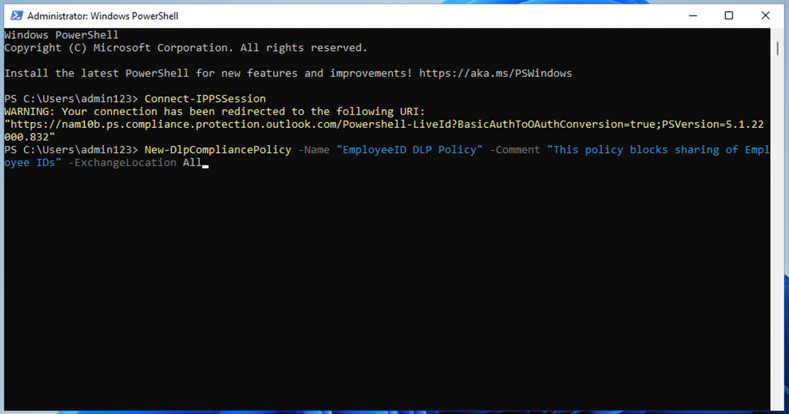

# Lab 6 – Creazione e gestione delle policy DLP

## Obiettivo:

Si è Patti Fernandez, Compliance Administrator appena assunto per
Contoso Ltd. incaricato di configurare il tenant di Microsoft 365
dell'azienda per la prevenzione della perdita di dati. Contoso Ltd. è
una società che offre istruzioni di guida negli Stati Uniti ed è
necessario assicurarsi che le informazioni riservate dei clienti non
lascino l'organizzazione.

## Esercizio 1 - Creazione di criteri DLP

### Attività 1 - Creazione di un criterio DLP in modalità di test

In questo esercizio si creerà un criterio di prevenzione della perdita
dei dati nel portale di Microsoft Purview per proteggere i dati
sensibili dalla condivisione da parte degli utenti. I criteri DLP creati
informeranno gli utenti se desiderano condividere contenuti che
includono informazioni sulla carta di credito e consentiranno loro di
fornire una giustificazione per l'invio di tali informazioni. I criteri
verranno implementati in modalità di test perché non si desidera che
l'azione di blocco influisca ancora sugli utenti.

1.  In **Microsoft Edge,** passare a `https://purview.microsoft.com` e
    assicurarsi di aver effettuato l'accesso al portale di **Microsoft
    Purview** come **Patti Fernandez**.

2.  Nel portale di **Microsoft Purview** , nel riquadro di spostamento
    sinistro, selezionare **Solutions \> Data loss prevention**.

3.  In **Data loss prevention,** selezionare **Policies** e quindi
    selezionare **+Create policy** per avviare la procedura guidata per
    la creazione di un nuovo criterio di prevenzione della perdita dei
    dati.

4.  Nella pagina **Start with a template or create a custom policy**,
    scorrere verso il basso e selezionare **Custom** in **Categories** e
    **Custom policy** in **Regulations**. Per impostazione predefinita,
    entrambe le opzioni dovrebbero essere già selezionate, selezionare
    **Next**.

5.  Nella pagina **Name your DLP policy,** digitare **Credit Card DLP
    Policy** nel campo **Name** e **Protect credit card numbers from
    being shared.** nel campo **Description**. Selezionare **Next**.

Uno screenshot di un computer Descrizione generata automaticamente

6.  Nella pagina **Assign admin units**, selezionare **Next**.

7.  Nella pagina **Choose locations to apply the policy,** assicurarsi
    che l'opzione **Teams chat and channel messages** sia abilitata e
    che tutte le altre opzioni siano disabilitate, quindi selezionare
    **Next**.

Uno screenshot di un computer Descrizione generata automaticamente

8.  Nella pagina **Define policy settings,** selezionare **Create or
    customize advanced DLP rules** e selezionare **Next**.

Uno screenshot di un computer Descrizione generata automaticamente

9.  Nella pagina **Customize advanced DLP rules,** selezionare **+
    Create rule**.

Uno screenshot di un computer Descrizione generata automaticamente

10. Nella pagina **Create rule,** digitare **Credit card information**
    nel campo **Name**.

Uno screenshot di un computer Descrizione generata automaticamente

11. In **Conditions** nella pagina **Create rule,** selezionare **+ Add
    condition** e selezionare **Content is shared from Microsoft 365**
    dal menu a discesa.

12. Nella nuova sezione **Content is shared from Microsoft 365,**
    selezionare l' opzione **with people outside my organization**.

Uno screenshot di un computer Descrizione generata automaticamente

13. Selezionare **+ Add Condition,** quindi selezionare **Content
    contains** dal menu a discesa.

Uno screenshot di un computer Descrizione generata automaticamente

14. Nella nuova area **Content contains,** selezionare **Add** e
    selezionare **Sensitive info types** dal menu a discesa.

15. Nella pagina **Sensitive info types,** selezionare **Credit Card
    Number** e selezionare **Add**.

16. Nella pagina **Create rule,** selezionare **+ Add an action** e
    selezionare **Restrict access or encrypt the content in Microsoft
    365 locations**.

17. Selezionare la casella davanti a **Restrict access or encrypt the
    content in Microsoft 365 locations** e quindi selezionare **Block
    only people outside your organization**.

Uno screenshot di un computer Descrizione generata automaticamente

18. Nella sezione **User notifications** della pagina **Create rule,**
    selezionare l'interruttore per metterlo in posizione **On**.

Uno screenshot di un computer Descrizione generata automaticamente

19. Nella sezione **User overrides** della pagina **Create rule**,
    selezionare la casella **Allow overrides from M365 services. Allows
    users in Exchange, SharePoint, OneDrive and Teams to override policy
    restrictions.**

**Nota**: Se non è stato possibile selezionare la casella di controllo
**Allow overrides from M365 services**, abilitare la casella di
controllo **Notify users in Office 365 with a policy tip** per i criteri
disponibile nella pagina **Create rule** nella sezione **User
notification \> Microsoft 365 services** del passaggio precedente.
Selezionare quindi la casella di controllo **Allow overrides from M365
services. Allows users in Exchange, SharePoint, OneDrive and Teams to
override policy restrictions.**

20. Selezionare la casella **Require a business justification to
    override**.

21. Nella sezione **Incident reports**, nell'elenco a discesa **Use this
    severity level in admin alerts and reports,** selezionare **Low**.

22. Selezionare **Save**, quindi selezionare **Next**.

Uno screenshot di un computer Descrizione generata automaticamente

23. Nella pagina **Test or turn on the policy,** selezionare **Run the
    policy in simulation mode** e selezionare **Show policy tips while
    in test mode**.

24. Selezionare **Submit** per creare il criterio.

25. Dopo aver creato il criterio, selezionare **Done**.

Uno screenshot di un computer Descrizione generata automaticamente

A questo punto è stato creato un criterio DLP che esegue la scansione
dei numeri di carta di credito nelle chat e nei canali di Microsoft
Teams e consente agli utenti di fornire una giustificazione aziendale
per eseguire l'override del criterio.

### Attività 2 - Modifica di un criterio DLP

In questa attività verrà modificato il criterio DLP esistente creato nel
passaggio precedente per analizzare anche i messaggi di posta
elettronica alla ricerca di informazioni sulla carta di credito e
informare gli utenti se desiderano condividere questo contenuto in un
messaggio di posta elettronica.

1.  In **Microsoft Edge,** passare a `https://purview.microsoft.com` e
    assicurarsi di aver effettuato l'accesso al portale di **Microsoft
    Purview** come **Patti Fernandez**.

2.  Nel portale di **Microsoft Purview** , nel riquadro di spostamento
    sinistro, selezionare **Solutions \> Data loss prevention**.

3.  In **Data loss prevention,** selezionare **Policies**, quindi
    selezionare il criterio denominato **Credit Card DLP Policy** e
    quindi selezionare **Edit policy** (icona a forma di matita) per
    aprire la procedura guidata dei criteri.

4.  Nella pagina **Name your DLP policy** e **Assign admin units,**
    selezionare **Next**.

5.  Nella pagina **Choose locations to apply the policy,** abilitare
    l'opzione **Exchange email** e quindi selezionare **Next** fino a
    raggiungere la pagina **Review and finish**. Assicurati che le altre
    posizioni siano disabilitate.

6.  Selezionare **Submit** per applicare la modifica apportata nel
    criterio.

7.  Dopo aver aggiornato il criterio, selezionare **Done**.

Uno screenshot di un computer Descrizione generata automaticamente

A questo punto è stato modificato un criterio DLP esistente e sono stati
modificati i percorsi di analisi del contenuto.

### Attività 3 - Creazione di un criterio DLP in PowerShell

In questa attività si utilizza PowerShell per creare un criterio DLP per
proteggere gli ID dipendente di Contoso e impedirne la condivisione in
Exchange. Gli utenti verranno informati che stanno tentando di
condividere dati sensibili e che l'invio del messaggio di posta
elettronica viene impedito se include Contoso EmployeeIDS.

1.  Nel menu Start, selezionare **Windows PowerShell**.

2.  Nella finestra **PowerShell** immettere

`Connect-IPPSSession`

e poi accedere come **Patti Fernandez.**

Descrizione del testo generata automaticamente

Nota: se viene visualizzato un errore, provare a eseguire prima i
seguenti comandi uno per uno, quindi eseguire nuovamente il passaggio.

Install-Module ExchangeOnlineManagement 

Import-Module ExchangeOnlineManagement

Se viene visualizzato un errore, provare a eseguire prima i seguenti
comandi uno per uno, quindi eseguire nuovamente il passaggio. Se
l'errore persiste, scarica il seguente file e installalo prima di
procedere ulteriormente.
`https://github.com/PowerShell/PowerShell/releases/download/v7.4.0/PowerShell-7.4.0-win-x64.msi`

3.  Immettere il comando seguente in PowerShell per creare un criterio
    DLP che analizzi tutte le cassette postali di Exchange:

New-DlpCompliancePolicy -Name "EmployeeID DLP Policy" -Comment "This
policy blocks sharing of Employee IDs" -ExchangeLocation All 

Immagine rotta

4.  Immettere il comando seguente in PowerShell per aggiungere una
    regola DLP ai criteri DLP creati nel passaggio precedente:

New-DlpComplianceRule -Name "EmployeeID DLP rule" -Policy "EmployeeID
DLP Policy" -BlockAccess $\\true -ContentContainsSensitiveInformation
@{Name="Contoso Employee IDs"}

Descrizione del testo generata automaticamente

5.  Utilizzare il comando seguente per esaminare la regola **EmployeeID
    DLP**:

Get-DLPComplianceRule -Identity "EmployeeID DLP rule" 

Descrizione del testo generata automaticamente

A questo punto è stato creato un criterio DLP che analizza gli
EmpoloyeeID di Contoso in Exchange usando PowerShell.

### Task 4 – Attivazione di un criterio in modalità test

In questa attività verranno attivati i criteri DLP relativi alle
informazioni sulla carta di credito creati in modalità test in modo che
applichino le azioni di protezione.

1.  In **Microsoft Edge,** passare a `https://purview.microsoft.com` e
    assicurarsi di aver effettuato l'accesso al portale di **Microsoft
    Purview** come **Patti Fernandez**.

2.  Nel portale di **Microsoft Purview** , nel riquadro di spostamento
    sinistro, selezionare **Solutions \> Data loss prevention**.

3.  In **Data loss prevention,** selezionare **Policies**, quindi
    selezionare il criterio denominato **Credit Card DLP Policy** e
    quindi selezionare **Edit policy** (icona a forma di matita) per
    aprire la procedura guidata dei criteri.

4.  Selezionare **Next** fino a raggiungere la pagina **Test or turn on
    the policy** e selezionare **Turn the policy on immediately**.

Uno screenshot di un computer Descrizione generata automaticamente

5.  Selezionare **Next**, quindi selezionare **Submit** per attivare il
    criterio.

6.  Dopo aver aggiornato il criterio, selezionare **Done**.

Uno screenshot di un computer Descrizione generata automaticamente

Il criterio DLP è stato attivato correttamente. Se il criterio rileva un
tentativo di condivisione delle informazioni sulla carta di credito,
bloccherà il tentativo e consentirà agli utenti di fornire una
giustificazione aziendale per ignorare l'azione di blocco.

## Esercizio 2 - Gestione dei criteri DLP

### Attività 1 - Modifica della priorità dei criteri

Dopo aver creato due criteri DLP, si desidera assicurarsi che il
criterio più restrittivo venga elaborato con una priorità più alta
rispetto al criterio meno restrittivo. Per questo motivo, si desidera
spostare il criterio DLP EmployeeID nella priorità più alta.

1.  In **Microsoft Edge,** passare a `https://purview.microsoft.com` e
    assicurarsi di aver effettuato l'accesso al portale di **Microsoft
    Purview** come **Patti Fernandez**.

2.  Nel portale di **Microsoft Purview**, nel riquadro di spostamento
    sinistro, selezionare **Solutions \> Data loss prevention**.

3.  In **Data loss prevention,** selezionare **Policies**, quindi
    selezionare il criterio denominato **Credit Card DLP Policy** e
    quindi selezionare **Edit policy** (icona a forma di matita) per
    aprire la procedura guidata dei criteri.

4.  Selezionare **Move to top**.

5.  Nella finestra **Data loss prevention,** selezionare **Refresh** ed
    esaminare la priorità nella colonna **Order** della tabella dei
    criteri.

La priorità dei criteri DLP è stata modificata correttamente. Se
entrambidue criteri corrispondono allo stesso contenuto, verrà applicata
l'azione del criterio con priorità più alta.

### Attività 2 - Abilitazione del monitoraggio dei file in Microsoft 365 Defender

Si vogliono usare i criteri file in **Microsoft 365 Defender** per
proteggere i file nei percorsi di OneDrive e SharePoint Online. Prima di
poter creare un criterio file, è necessario abilitare il monitoraggio
dei file in modo che Microsoft 365 Defender possa analizzare i file
nell'organizzazione.

1.  Aprire **Microsoft Edge** e andare a
    `https://security.microsoft.com` e accedere al portale di Microsoft
    365 Defender come **MOD Administrator**.

2.  Nella navigazione, selezionare **Cloud appsSystem \> Files Settings
    \> Cloud apps** dal menu.

3.  Quindi selezionare **Enable file monitoring**. Selezionare **Files**
    in **Information Protection**.

Uno screenshot di un computer Descrizione generata automaticamente

4.  Selezionare la casella di controllo **Enable file monitoring**,
    quindi selezionare **Save** se non è già contrassegnata.

Uno screenshot di un computer Descrizione generata automaticamente

È stato abilitato il monitoraggio dei file in Microsoft Defender per
Cloud Apps ed è ora possibile analizzare i file alla ricerca di
contenuti sensibili usando i criteri file.

### Attività 3 - Creazione di criteri file per Microsoft 365 Defender

In questa attività si vuole creare un criterio file in Microsoft 365
Defender per analizzare i file in OneDrive e SharePoint Online e mettere
automaticamente in quarantena i file contenenti informazioni sulla carta
di credito se sono condivisi.

1.  Aprire **Microsoft Edge** e andare a
    `https://security.microsoft.com` e accedere al portale di Microsoft
    365 Defender come **MOD Administrator**.

2.  Nella navigazione selezionare **Settings** in **System** e
    selezionare **Cloud apps** dal menu.

3.  In **Information Protection \> Microsoft Information Protection,**
    verificare che **Automatically scan new files for sensitivity labels
    from Microsoft Purview Protection and content inspection warnings**
    sia selezionata, in caso contrario. Fare clic su **Save**.

4.  In **Inspect protected files**, fare clic su **Grant Permission**.

5.  Se richiesto, accedere utilizzando l'ID di **MOD Administrator** e
    fare clic su **Accept** nella schermata successiva.

6.  Nella navigazione secondaria, selezionare **Connected apps \> App
    Connectors**. Assicurati che **Microsoft 365** sia stato aggiunto.

- In caso contrario, selezionare **Connect an app** e aggiungere l'app.
  In **Select Office 365 components** selezionare tutte le caselle di
  controllo e quindi fare clic su **Connect Office 365**.

- Quando viene visualizzato il messaggio **Office 365 was successfully
  connected**, chiudere la casella.

7.  Nel portale di **Microsoft 365 Defender** , nel riquadro di
    spostamento sinistro, espandere **Cloud apps \> Policies** e
    selezionare **Policy management**.

8.  Nella pagina **Policies,** espandere **+ Create policy** e quindi
    selezionare **File policy**.

Uno screenshot di un computer Descrizione generata automaticamente

9.  Nella pagina **Create file policy,** digitare **Credit Card
    Information for files** nel campo **Policy name** e digitare
    **Protect credit card numbers from being shared in files.** nel
    campo **Description**.

Interfaccia utente grafica, applicazione Descrizione generata
automaticamente

10. Mantenere **Policy Severity** su **Low** (un'icona illuminata) e
    assicurarsi che la **Category** sia impostata su **DLP**. Per un
    criterio file, questa dovrebbe essere l'impostazione predefinita.

Interfaccia utente grafica, testo, applicazione Descrizione generata
automaticamente

11. Nell'area **Files matching all of the following**, espandere il menu
    a discesa **Public (Internet), External, Public** e aggiungere
    **Internal**.

Interfaccia utente grafica, applicazione Descrizione generata
automaticamente

12. In **Apply to** nel menu a discesa **Inspection Method**,
    selezionare **Data Classification Service**.

Interfaccia utente grafica, testo, applicazione Descrizione generata
automaticamente

**Nota:** se non vedere ancora **Data Classification Service**
nell'elenco a discesa, selezionare **None** al momento. Una volta
terminato, torna dopo un po' di tempo a **Policies \> Policy management
\> All Policies \> Search for name: Credit card \> Select Credit Card
Information for files**.

Uno screenshot di un computer Descrizione generata automaticamente

13. Selezionare **Data Classification Service** dall'elenco a discesa
    **Inspection method**.

Uno screenshot di un computer Descrizione generata automaticamente con
media sicurezza

14. Nella sezione **Choose inspection type…** menu a discesa,
    selezionare **Sensitive information type….**

Interfaccia utente grafica, testo, applicazione Descrizione generata
automaticamente

15. Nella finestra di dialogo **Select a sensitive information type,**
    selezionare **Credit Card Number**, quindi selezionare **Done**
    nell'angolo in alto a destra.

Interfaccia utente grafica, sito web Descrizione generata
automaticamente

16. In **Alerts,** selezionare la casella di controllo **Create an alert
    for each matching file** ed esaminare le opzioni. Mantenere le
    impostazioni predefinite selezionando **Save as default settings**.

Uno screenshot di un computer Descrizione generata automaticamente

17. Nella sezione **Governance actions,** espandere **Microsoft OneDrive
    for Business** e selezionare **Put in user quarantine**.

Uno screenshot di un computer Descrizione generata automaticamente

18. Nella sezione **Governance actions,** espandere **Microsoft
    SharePoint Online** e selezionare **Put in user quarantine**.

Uno screenshot di un computer Descrizione generata automaticamente

19. Selezionare **Create** nella parte inferiore della pagina.

Interfaccia utente grafica, testo, applicazione Descrizione generata
automaticamente

20. Selezionare **Profile picture** dell'amministratore MOD in alto a
    destra e selezionare **Sign out** accanto alla ruota dentata, quindi
    chiudi il browser.

A questo punto è stato creato un criterio file che analizza
continuamente i file salvati in OneDrive e SharePoint per i dati della
carta di credito e li mette in quarantena se vengono condivisi
all'interno dell'organizzazione.

### Attività 4 - Creazione di un criterio DLP per Power Platform

La tua azienda usa i flussi di Power Automate per condividere i dati tra
SharePoint Online e SalesForce. In questa attività, creerai un criterio
DLP per Power Platform che consente ai flussi esistenti di continuare a
funzionare, ma impedisce la creazione di flussi che condivideranno i
dati tra SharePoint Online e le app definite come non aziendali.

1.  In **Microsoft Edge**, andare a
    `https://admin.powerplatform.microsoft.com` e accedere
    all'interfaccia di amministrazione di Power Platform come **MOD
    Administrator**.

2.  Nel **Power Platform admin center**, nel riquadro di spostamento a
    sinistra, selezionare l'elenco a discesa per **Policies,** quindi
    selezionare **Data policies**.

3.  Nella pagina **Data policies,** selezionare **+ New Policy**.

Interfaccia utente grafica, applicazione, Teams Descrizione generata
automaticamente

4.  Nella pagina **Name your policy,** digitare **Tenant-wide SharePoint
    Policy**, quindi selezionare **Next**.

Interfaccia utente grafica, testo, applicazione Descrizione generata
automaticamente

5.  Sulla scheda **Non-business | Default**, selezionare **SharePoint**
    e **Salesforce**, quindi selezionare **Move to Business** nella
    parte superiore della pagina.

6.  Nella pagina **Assign connectors,** selezionare la scheda
    **Business** per assicurarsi che vengano visualizzati sia SharePoint
    che Salesforce.

Interfaccia utente grafica, applicazione Descrizione generata
automaticamente

7.  Selezionare **Next** due volte.

Interfaccia utente grafica, applicazione Descrizione generata
automaticamente

Interfaccia utente grafica, testo, applicazione Descrizione generata
automaticamente

8.  Nella pagina **Define scope,** selezionare **Add all environments**,
    quindi selezionare **Next**.

Interfaccia utente grafica, testo, applicazione Descrizione generata
automaticamente

9.  Nella pagina **Review and create policy**, esaminare le impostazioni
    dei criteri, quindi selezionare **Create policy**.

Uno screenshot di un computer Descrizione generata automaticamente

A questo punto hai creato un criterio DLP di Power Platform che
impedisce agli utenti di creare flussi che coinvolgono un connettore
SharePoint Online e qualsiasi connettore che non sia Salesforce.

## Esercizio 3 – Abilitazione della protezione adattiva

1.  In **Microsoft Edge,** passare a `https://purview.microsoft.com` e
    accedere al portale di Purview come **amministratore MOD**.

2.  Nel riquadro di spostamento a sinistra selezionare **Solutions \>
    Insider Risk Management \> Adaptive protection \> Dashboard**.
    Selezionare **Quick setup**.

3.  Mostrerà un messaggio che dice che stiamo configurando le cose. Ci
    vorranno 72 ore per abilitarlo. Lo utilizzeremo nell'ultimo
    laboratorio in cui esploreremo la funzione di **Adaptive
    Protection**.

Uno screenshot di un computer Descrizione generata automaticamente

4.  Selezionare la scheda **Adaptive Protection settings** e attivare
    l'interruttore **Adaptive Protection**. Selezionare **Save**.

Uno screenshot di un computer Descrizione generata automaticamente

## Sommario:

In questo lab si è appreso come creare nuovi criteri DLP, abilitare la
protezione dei file e gestire i criteri DLP. Abbiamo anche imparato come
abilitare la protezione adottiva, che esploreremo in laboratorio più
avanti.
