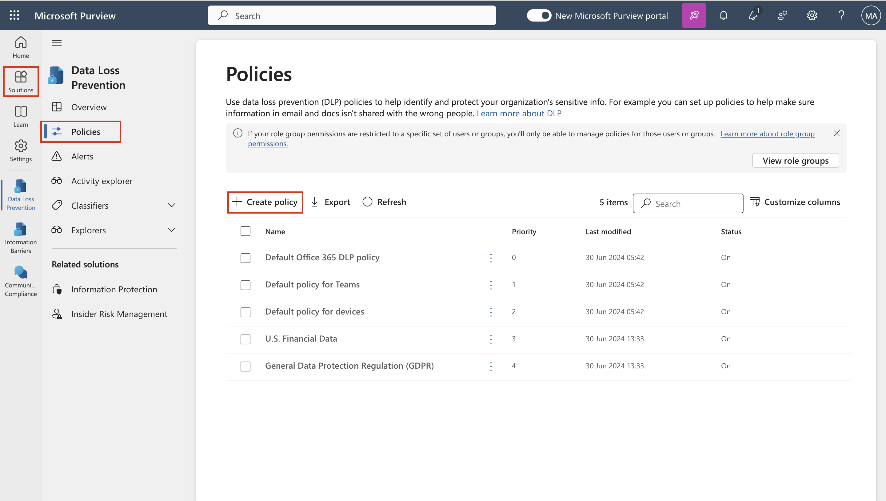
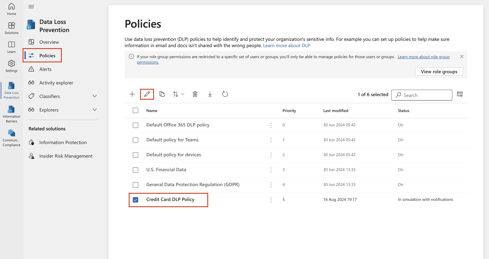
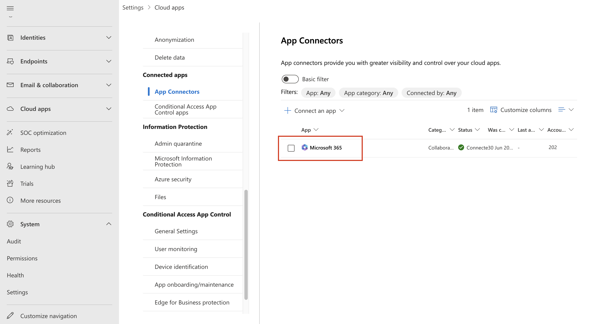

# 实验 6 – 创建和管理 DLP 策略

## 目的：

您是 Patti Fernandez，Contoso Ltd. 新聘用的合规性管理员，负责配置公司的
Microsoft 365 租户以防止数据丢失。Contoso Ltd.
是一家在美国提供驾驶指导的公司，您需要确保敏感的客户信息不会离开组织。

## 练习 1 – 创建 DLP 策略

### 任务 1 – 在测试模式下创建 DLP 策略

在本练习中，您将在 Microsoft Purview
门户中创建数据丢失防护策略，以保护敏感数据不被用户共享。您创建的 DLP
策略将通知用户是否要共享包含信用卡信息的内容，并允许他们提供发送此信息的理由。该策略将在测试模式下实施，因为您还不希望阻止作影响您的用户。

1.  在 **Microsoft Edge** 中，导航到 `https://purview.microsoft.com`
    并确保您以 **Patti Fernandez 的身份登录到** Microsoft Purview 门户。

2.  在 **Microsoft Purview** 门户的左侧导航窗格中，选择 **olutions \>
    Data loss prevention**。

3.  在 Data loss prevention **下**，选择 **Policies**，然后选择
    **+Create policy** 以启动用于创建新的数据丢失防护策略的向导。

4.  在 **Start with a template or create a custom policy**
    页面上，向下滚动并选择 **Categories** 下的 **Custom** 和
    **Regulations** 下的 **Custom
    policy**。默认情况下，这两个选项都应已选中，选择 **下一步**。

5.  在 **Name your DLP policy** 页面上， ` 在`` `Name 字段中键入 Credit
    Card DLP Policy `并保护信用卡号不被共享``。` 在 **Description**
    字段中。选择 **Next**。

自动生成的计算机 Description 的屏幕截图

6.  在 **Assign admin units** 页上，选择 Next。

7.  在 **Choose locations to apply the policy**，**Teams chat and
    channel messages** 选项，并禁用所有其他选项，然后选择 **Next**。

自动生成的计算机 Description 的屏幕截图

8.  在 **Define policy settings** 页面上，选择 **Create or customize
    advanced DLP rules**，然后选择 **Next**。

自动生成的计算机 Description 的屏幕截图

9.  在 **Customize advanced DLP rules** 页上，选择**+ Create rule**。

自动生成的计算机 Description 的屏幕截图

10. 在 **Create rule** 页面上，在 `Name` 字段中键入 Credit card
    information。

自动生成的计算机 Description 的屏幕截图

11. 在 **Create rule 页面上**的 **Conditions** 下，选择 **+ Add
    condition**，然后从下拉菜单中选择 **Content is shared from Microsoft
    365**。

12. 在新 **Content is shared from Microsoft 365** 部分中，选择 with
    **people outside my organization** 选项。

自动生成的计算机 Description 的屏幕截图

13. 选择 **+ Add Condition**，然后选择 **Content contains**
    从下拉菜单中。

自动生成的计算机 Description 的屏幕截图

14. 在新的 **Content contains**区域中，选择
    **Add**，然后从下拉菜单中选择 **Sensitive info type**。

15. 在 **Sensitive info types**页上，选择 **Credit Card
    Number**，然后选择 **Add**。

16. 在 **Create rule** 页面上，选择 **+ Add an action** ，然后选择
    **Restrict access or encrypt the content in Microsoft 365
    locations**。

17. 选中 **Restrict access or encrypt the content in Microsoft 365
    locations** 前面的框 ，然后选择 **Block only people outside your
    organization**。

自动生成的计算机 Description 的屏幕截图

18. 在 **Create rule** 页面的 **User notifications**
    部分中，选择开关以将其置于 **On** 位置。

自动生成的计算机 Description 的屏幕截图

19. 在 **Create rule** 页面的 **User overrides** 部分的 **Allow
    overrides from M365 services** 下，选中 **Allow overrides from M365
    services 复选框。允许 Exchange、SharePoint、OneDrive 和 Teams
    中的用户覆盖策略限制。**

**注意**：如果您无法选中**Allow overrides from M365
services**复选框，请启用**Notify users in Office 365 with a policy tip**
复选框，该策略提示可在上一步的**User notification \> Microsoft 365
services** 部分下的 **Create rule**页面上找到。然后选中 **Allow
overrides from M365 services复选框。Allow overrides from M365 services.
Allows users in Exchange, SharePoint, OneDrive and Teams to override
policy restrictions 。**

20. 选中 **Require a business justification to override** 框。

21. 在 **Incident reports** 部分的 **Use this severity level in admin
    alerts and reports**下拉列表中，选择 **Low**。

22. 选择 **Save**，然后选择 **Next**。

自动生成的计算机 Description 的屏幕截图

23. 在 **Test or turn on the policy** 页面上，选择 **Run the policy in
    simulated mode**，然后选择 **Show policy tips when in test mode**。

24. 选择 **Submit** 以创建策略。

25. 创建策略后，选择 **Done**。

自动生成的计算机 Description 的屏幕截图

您现在已经创建了一个 DLP 策略，该策略扫描 Microsoft Teams
聊天和频道中的信用卡号，并允许用户提供覆盖策略的业务理由。

### 任务 2 – 修改 DLP 策略

在此任务中，您将修改在上一步中创建的现有DLP策略，以同时扫描电子邮件中的信用卡信息，并通知用户是否要通过电子邮件共享此内容。

1.  在 **Microsoft Edge** 中，导航到 `https://purview.microsoft.com`
    并确保您以 **Patti Fernandez** 的身份登录到 Microsoft Purview 门户。

2.  在 **Microsoft Purview** 门户的左侧导航窗格中，选择 **olutions \>
    Data loss prevention**。

3.  在 **Data loss prevention下**，选择 **Policies，**然后选择名为
    **Credit Card DLP Policy** 的策略**，** 然后选择 **Edit policy**
    （pencil icon）以打开策略向导。

4.  在 **Name your DLP policy** 和 **Assign admin units**页上，选择
    **Next**。

5.  在 **Choose locations to apply the policy** 页面上，启用 **Exchange
    email** 选项，然后选择 **Next**，直到到达 **Review and finish**
    页面。确保其余位置处于禁用状态。

6.  选择 **Submit** 以应用您在策略中所做的更改。

7.  更新策略后，选择 **Done**。

自动生成的计算机 Description 的屏幕截图

您现在已经修改了现有的 DLP 策略并更改了它扫描内容的位置。

### 任务 3 – 在 PowerShell 中创建 DLP 策略

在此任务中，您将使用 PowerShell 创建 DLP 策略，以保护 Contoso EmployeeID
并防止它们在Exchange中共享。用户将收到他们正在尝试共享敏感数据的通知，如果电子邮件包含
Contoso EmployeeID，则会阻止用户发送电子邮件。

1.  在开始菜单中，选择 **Windows PowerShell**。

2.  在 **PowerShell** 窗口中，输入

`Connect-IPPSSession`

然后以 **Patti Fernandez** 身份登录**。**

自动生成文本描述

注意：如果显示错误，请先尝试逐个运行以下命令，然后再次执行该步骤。

`Install-Module ``ExchangeOnlineManagement`

`Import-Module ExchangeOnlineManagement`

如果显示错误，请先尝试逐个运行以下命令，然后再次执行该步骤。如果您仍然遇到任何错误，请下载以下文件并安装它，然后再继续。
`https://github.com/PowerShell/PowerShell/releases/download/v7.4.0/PowerShell-7.4.0-win-x64.msi`

3.  在 PowerShell 中输入以下命令以创建扫描所有 Exchange 邮箱的 DLP
    策略：

`New-DlpCompliancePolicy -Name "EmployeeID DLP Policy" -Comment "This policy blocks sharing of Employee IDs" -ExchangeLocation All`

BrokenImage

4.  在 PowerShell 中输入以下命令，将 DLP 规则添加到您在上一步中创建的
    DLP 策略:

`New-DlpComplianceRule -Name "EmployeeID DLP rule" -Policy "EmployeeID DLP Policy" -BlockAccess $\\true -ContentContainsSensitiveInformation @{Name="Contoso Employee IDs"}`

自动生成文本描述

5.  使用以下命令查看 **EmployeeID DLP rule**:

`Get-DLPComplianceRule -Identity "EmployeeID DLP rule"`

自动生成文本描述

现在，你已创建一个 DLP 策略，该策略使用 PowerShell 在 Exchange 中扫描
Contoso EmpoloyeeID。

### 任务 4 – 在测试模式下激活策略

在此任务中，您将激活在测试模式下创建的信用卡信息DLP策略，以便它强制执行其保护作。

1.  在 **Microsoft Edge** 中，导航到 https://purview.microsoft.com
    并确保您以 **Patti Fernandez** 的身份登录到 **Microsoft Purview**
    门户。

2.  在 **Microsoft Purview** 门户的左侧导航窗格中，选择 **Solutions \>
    Data loss prevention**。

3.  在 **Data loss prevention** 下，选择 **Policies ，**然后选择名为
    **Credit Card DLP Policy** 的策略， 然后选择 **Edit policy**
    （pencil icon）以打开策略向导。

4.  选择 **Next**，直到到达 **Test or turn on the policy**，然后选择
    **Turn the policy on immediately**。

自动生成的计算机 Description 的屏幕截图

5.  选择 **Next**，然后选择 **Submit** 以激活策略。

6.  更新策略后，选择 **Done**。

自动生成的计算机 Description 的屏幕截图

您已成功激活 DLP
策略。如果策略检测到共享信用卡信息的尝试，它现在将阻止该尝试，并允许用户提供业务理由来覆盖阻止作。

## 练习 2 – 管理 DLP 策略

### 任务 1 – 修改策略优先级

创建两个 DLP
策略后，您希望确保以比限制较少的策略更高的优先级处理限制性较强的策略。因此，您希望将
EmployeeID DLP 策略移动到更高的优先级。

1.  在 **Microsoft Edge** 中，导航到 `https://purview.microsoft.com`
    并确保您以 **Patti Fernandez 的身份登录到** Microsoft Purview 门户。

2.  在 **Microsoft Purview** 门户的左侧导航窗格中，选择 **Solutions \>
    Data loss prevention**。

3.  在 **Data loss prevention下**，选择 **Policies** ，然后选择名为
    **Credit Card DLP Policy** 的策略，然后选择 **Edit policy** （pencil
    icon）以打开策略向导。

4.  选择 **Move to top**。

5.  在 **Data loss prevention** 窗口中，选择 **Refresh** 并查看 策略表的
    **Order** 列中的优先级。

您已成功修改 DLP
策略的优先级。如果两个策略都匹配相同的内容，则将强制执行优先级较高的策略的作。

### 任务 2 - 在 Microsoft 365 Defender 中启用文件监视

你想要使用 **Microsoft 365 Defender** 中的文件策略 来保护 OneDrive 和
SharePoint Online
位置中的文件。在创建文件策略之前，您需要启用文件监控，以便 Microsoft 365
Defender 可以扫描组织中的文件。

1.  打开 **Microsoft Edge** 并导航到 `https://security.microsoft.com`
    并以 MOD Administrator身份登录 Microsoft 365 Defender 门户。

2.  在导航栏中，从菜单中选择 **Cloud appsSystem** \> **Files Settings**
    \> **Cloud apps**。

3.  然后选择 **Enable file monitoring**。选择 **Information
    Protection**下的 **Files** 。

自动生成的计算机 Description 的屏幕截图

4.  选中 **Enable file monitoring** 复选框，然后选择 **Save**
    （如果尚未标记）。

自动生成的计算机 Description 的屏幕截图

您已成功在 Microsoft Defender for Cloud Apps
中启用文件监控，现在可以使用文件策略扫描文件中的敏感内容。

### 任务 3 - 为 Microsoft 365 Defender 创建文件策略

在此任务中，您希望在 Microsoft 365 Defender 中创建文件策略，以扫描
OneDrive 和 SharePoint Online
中的文件，并自动隔离包含信用卡信息的文件（如果它们是共享的）。

1.  打开 **Microsoft Edge** 并导航到 `https://security.microsoft.com`
    并以 **MOD Administrator**身份登录 Microsoft 365 Defender 门户。

2.  在导航中，选择 **Settings** 下的 **System**，然后从菜单中选择
    **Cloud apps**。

 3. 在**Information Protection** \> **Microsoft
Information Protection下**，确保选中 **Automatically scan new files for
sensitivity labels from Microsoft Purview Protection and content
inspection warnings**，请选择它。点击 **Save**。

4\. 在 **Inspect protected files** 下，单击 **Grant Permission**。

5.  如果询问，请使用 **MOD Administrator’s** ID 登录，然后单击
    下一个屏幕上的 **Accept。**

6.  在子导航中，选择 **Connected apps \> App Connectors**。确保 **已添加
    Microsoft 365。**

- 如果没有，请选择 **Connect an app**，然后添加应用程序。在 **Select
  Office 365 components**下，选中所有复选框，然后单击 **Connect Office
  365**。

- 看到消息 **Office 365 was successfully connected**，请关闭该框。

7.  在 **Microsoft 365 Defender** 门户的左侧导航窗格中，展开 **Cloud
    apps** \> **Policies** 并选择 Policy **management**。

8.  在 **Policies** 页面上，展开 **+ Create policy**，然后选择 **File
    policy**。

自动生成的计算机 Description 的屏幕截图

9.  在 **Create file policy** 页面上，在 `Policy name`` `字段中键入
    Credit Card Information for files，然后键入
    `Protect credit card numbers from being shared in files。` 在
    **Description**字段中。

图形用户界面，自动生成应用程序描述

10. 将 **Policy Severity** 保持在 **Low**（一个亮起的图标）并确保
    **Category** 设置为 **DLP**。对于文件策略，这应该是默认值 。

自动生成图形用户界面、文本、应用程序描述

11. 在 **Files matching all of the following** 区域中，展开下拉菜单
    **Public （Internet）、External、Public** 并添加 **Internal**。

图形用户界面，自动生成应用程序描述

12. 在 Apply to**下的 Inspection Method**下拉菜单中，选择 **Data
    Classification Service**。

自动生成图形用户界面、文本、应用程序描述

注意： 如果您尚未在下拉列表中看到 **Data Classification Service**
，请选择 **None** **as of now**。完成后，一段时间后返回 **Policies \>
Policy management \> All Policies \> Search for name: Credit card \>
Select Credit Card Information for files**。

自动生成的计算机 Description 的屏幕截图

13. 从 **Inspection method** 下拉列表中选择 **Data Classification
    Service**。

以中等置信度自动生成的计算机描述的屏幕截图

14. 在 **Choose inspection type...** 下拉菜单中，选择 **Sensitive
    information type...**。

自动生成图形用户界面、文本、应用程序描述

15. 在 **Select a sensitive information type** 对话框中，选择 **Credit
    Card Number**，然后选择右上角的 **Done**。

图形用户界面，自动生成网站描述

16. 在 **Alerts**下，选中 **Create an alert for each matching file**
    复选框并查看您的选项。通过选择 **Save as default settings**
    将设置保持为默认值。

自动生成的计算机 Description 的屏幕截图

17. 在 **Governance actions** 部分中，展开 **Microsoft OneDrive for
    Business** 并选择 **Put in user quarantine**。

自动生成的计算机 Description 的屏幕截图

18. 在 **Governance actions** 部分中，展开 **“Microsoft SharePoint
    Online** ” ，然后选择 **Put in user quarantine**。

自动生成的计算机 Description 的屏幕截图

19. 选择 页面底部的 **Create** 。

自动生成图形用户界面、文本、应用程序描述

20. 选择 Profile picture 管理员 在右上角，然后选择齿轮旁边的 **Sign
    out**，然后关闭浏览器。

您现在已经创建了一个文件策略，该策略将持续扫描保存在 OneDrive 和
SharePoint 中的文件以查找信用卡信息，并在它们在组织内部共享时将其隔离。

### 任务 4 - 为 Power Platform 创建 DLP 策略

您的公司使用 Power Automate 流在 SharePoint Online 和 SalesForce
之间共享数据。在此任务中，您将为 Power Platform 创建一个 DLP
策略，该策略允许您的现有流继续工作，但会阻止创建将在 SharePoint Online
和定义为非业务的应用程序之间共享数据的流。

1.  在 **Microsoft Edge** 中，导航到
    `https://admin.powerplatform.microsoft.com` 并以 **MOD
    Administrator** 身份登录 Power Platform 管理中心。

2.  在**Power Platform admin center** 的左侧导航窗格中，选择
    **Policies** 的下拉列表， 然后选择 **Data policies**。

3.  在 **Data policies** 页面上，选择 **+ New Policy**。

自动生成图形用户界面、应用程序、Teams 描述

4.  在 **Name your policy**页面上，键入
    `“``租户范围的`` SharePoint ``策略`”，然后选择 **Next**。

自动生成图形用户界面、文本、应用程序描述

5.  在**Non-business | Default** 选项卡，选择 **SharePoint** 和
    **Salesforce**，然后选择 **页面顶部的 Move to Business**。

6.  在 **Assign connectors** 页中，选择 **Business**选项卡，确保
    SharePoint 和 Salesforce 现在都显示。

图形用户界面，自动生成应用程序描述

7.  选择 **Next** 两次。

图形用户界面，自动生成应用程序描述

自动生成图形用户界面、文本、应用程序描述

8.  在 **Define scope** 页面上，选择 **Add all environments**，然后选择
    **Next** 。

自动生成图形用户界面、文本、应用程序描述

9.  在 **Review and create policy**页面上，查看您的策略设置，然后选择
    **Create policy。**

自动生成的计算机 Description 的屏幕截图

您现在已经创建了一个 Power Platform DLP 策略，该策略可防止用户创建涉及
SharePoint Online 连接器和任何非 Salesforce 连接器的流。

## 练习 3 – 启用自适应保护

1.  在 **Microsoft Edge** 中，导航到 `https://purview.microsoft.com`
    并以 **MOD Administrator**身份登录 purview 门户。

2.  从左侧导航窗格中，选择 **Solutions** \> **Insider Risk Management**
    \> **Adaptive protection** \> **Dashboard**。选择 **Quick setup**。

3.  它将显示一条消息，指出我们正在进行设置。启用它需要 72
    小时。我们将在最后一个实验中使用它来探索 **Adaptive Protection**
    功能。

自动生成的计算机 Description 的屏幕截图

4.  选择 **Adaptive Protection settings** 选项卡，然后打开 **Adaptive
    Protection** 切换按钮。选择 **Save**。

自动生成的计算机 Description 的屏幕截图

## 总结:

在本实验中，我们学习了如何创建新的 DLP 策略、启用文件保护和管理 DLP
策略。我们还学习了如何启用收养保护，我们稍后将在实验室中探讨。
