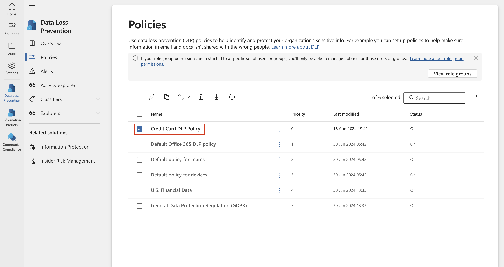
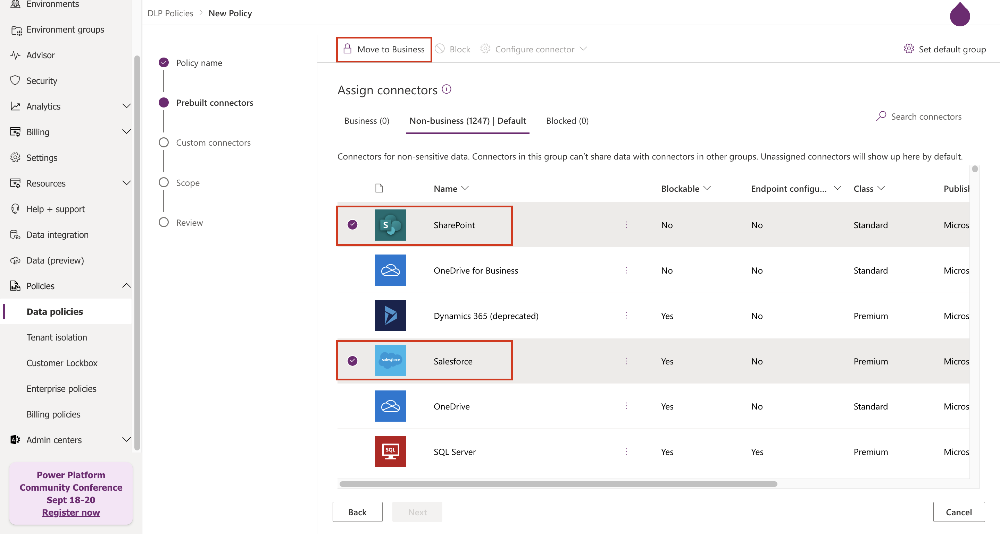

# Atelier 6 : création et gestion de stratégies DLP

## Objectif :

Vous êtes Patti Fernandez, l'administratrice de la conformité
nouvellement embauchée chez Contoso Ltd., chargée de configurer le
locataire Microsoft 365 de l'entreprise pour la prévention des pertes de
données. Contoso Ltd. est une société qui propose des cours de conduite
aux États-Unis et vous devez vous assurer que les informations sensibles
des clients ne quittent pas l'organisation.

## Exercice 1 – Création de stratégies DLP

### Tâche 1 – Création d'une politique DLP en mode test

Dans cet exercice, vous allez créer une stratégie de prévention de la
perte de données dans le portail Microsoft Purview pour empêcher les
utilisateurs de partager des données sensibles. La politique DLP que
vous créez informera vos utilisateurs s'ils souhaitent partager du
contenu contenant des informations de carte de crédit et leur permettra
de justifier l'envoi de ces informations. La stratégie sera implémentée
en mode test, car vous ne souhaitez pas que l'action de blocage affecte
encore vos utilisateurs.

1.  Dans **Microsoft Edge**, accédez à `https://purview.microsoft.com`
    et assurez-vous d'être connecté au portail **Microsoft Purview** en
    tant que **Patti Fernandez**.

2.  Dans le portail **Microsoft Purview**, dans le volet de navigation
    de gauche, sélectionnez **Solutions \> Data loss prevention**.

3.  Sous **Data loss prevention**, sélectionnez **Policies**, puis
    sélectionnez **+Create policy** pour démarrer l'Assistant de
    création d'une stratégie de protection contre la perte de données.

4.  Sur la page **Start with a template or create a custom policy**,
    faites défiler vers le bas et sélectionnez **Custom** sous
    **Categories** et **Custom policy** sous **Regulations**. Par
    défaut, les deux options doivent déjà être sélectionnées,
    sélectionnez **Next**.

5.  Sur la page **Nommez votre stratégie DLP**, tapez
    `Stratégie DLP de carte de crédit` dans le champ **Name** et
    `Protégez les numéros de carte de crédit contre le partage.` dans le
    champ **Description**. Sélectionnez **Next**.

Une capture d'écran d'un ordinateur Description générée automatiquement

6.  Sur la page **Assign admin units**, sélectionnez **Next**.

7.  Sur la page **Choose locations to apply the policy**, assurez-vous
    que l’option **Teams chat and channel messages** est activée et que
    toutes les autres options sont désactivées, puis sélectionnez
    **Next**.

Une capture d'écran d'un ordinateur Description générée automatiquement

8.  Sur la page **Define policy settings**, sélectionnez **Create or
    customize advanced DLP rules**, puis sélectionnez **Next**.

Une capture d'écran d'un ordinateur Description générée automatiquement

9.  Sur la page **Customize advanced DLP rules**, sélectionnez **+
    Create rule**.

Une capture d'écran d'un ordinateur Description générée automatiquement

10. Sur la page **Create rule**, tapez `informations de carte de crédit`
    dans le champ **Name**.

Une capture d'écran d'un ordinateur Description générée automatiquement

11. Sous **Conditions** sur la page **Create rule**, sélectionnez **+
    Add condition**, puis sélectionnez **Content is shared from
    Microsoft 365** dans le menu déroulant.

12. Dans la nouvelle section **Content is shared from Microsoft 365**,
    sélectionnez l'option **with people outside my organization**.

Une capture d'écran d'un ordinateur Description générée automatiquement

13. Sélectionnez **+ Add Condition**, puis sélectionnez **Content
    contains** dans le menu déroulant.

Une capture d'écran d'un ordinateur Description générée automatiquement

14. Dans la nouvelle zone **Content contains**, sélectionnez **Add**,
    puis **Sensitive info types** dans le menu déroulant.

15. Sur la page **Sensitive info types**, sélectionnez **Credit Card
    Number**, puis **Add**.

16. Sur la page **Create rule**, sélectionnez **+ Add an action,** puis
    Restreindre **Restrict access or encrypt the content in Microsoft
    365 locations**.

17. Cochez la case devant **Restrict access or encrypting the content in
    Microsoft 365 locations**, puis sélectionnez **Block only people
    outside your organization**.

Une capture d'écran d'un ordinateur Description générée automatiquement

18. Sur la page **Create rule**, dans la section **User notifications**,
    sélectionnez le commutateur pour le mettre en position **On**.

Une capture d'écran d'un ordinateur Description générée automatiquement

19. Sur la page **Create rule**, dans la section **User overrides**,
    sous Autoriser **Allow overrides from M365 services**, cochez la
    case **Allow overrides from M365 services. Allow users in Exchange,
    SharePoint, OneDrive and Teams to override policy restrictions.**

**Remarque** : Si vous n'avez pas pu cocher la case Autoriser les
**Allow overrides from M365 services**, activez la case à cocher
**Notify users in Office 365 with a policy tip** qui se trouve sur la
page **Create rule** sous la section **User notification \> Microsoft
365 services** de l'étape précédente. Cochez ensuite la case **Allow
overrides from M365 services. Allows users in Exchange,** **SharePoint,
OneDrive and Teams to override policy restrictions.**

20. Cochez la case **Require a business justification to override**.

21. Dans la section **Incident reports**, dans le menu déroulant **Use
    this severity level in admin alerts and reports,** sélectionnez
    **Low**.

22. Sélectionnez **Save**, puis **Next**.

Une capture d'écran d'un ordinateur Description générée automatiquement

23. Sur la page **Test or turn on the policy**, sélectionnez **Run the
    policy in simulation mode** et sélectionnez **Show policy tips while
    in test mode**.

24. Sélectionnez **Submit** pour créer la stratégie.

25. Une fois la stratégie créée, sélectionnez **Done**.

Une capture d'écran d'un ordinateur Description générée automatiquement

Vous avez maintenant créé une stratégie DLP qui recherche les numéros de
carte de crédit dans les conversations et les canaux Microsoft Teams et
permet aux utilisateurs de fournir une justification commerciale pour
remplacer la stratégie.

### Tâche 2 – Modification d'une politique DLP

Dans cette tâche, vous allez modifier la stratégie DLP existante que
vous avez créée à l'étape précédente pour analyser également les e-mails
à la recherche d'informations de carte de crédit et informer les
utilisateurs s'ils souhaitent partager ce contenu dans un e-mail.

1.  Dans **Microsoft Edge**, accédez à `https://purview.microsoft.com`
    et assurez-vous d'être connecté au portail **Microsoft Purview** en
    tant que **Patti Fernandez**.

2.  Dans le portail **Microsoft Purview**, dans le volet de navigation
    de gauche, sélectionnez **Solutions** \> **Data loss prevention**.

3.  Sous **Data loss prevention**, sélectionnez **Policies**, puis la
    stratégie nommée **Credit Card DLP Policy**, puis Modifier **Edit
    policy** (icône en forme de crayon) pour ouvrir l'Assistant
    Stratégie.

4.  Sur la page **Name your DLP policy** et **Assign admin units**,
    sélectionnez **Next**.

5.  Sur la page **Choose locations to apply the policy**, activez
    l’option **E-mail Exchange**, puis sélectionnez **Next** jusqu'à ce
    que vous atteigniez la page **Review and finish**. Assurez-vous que
    les autres emplacements sont désactivés.

6.  Sélectionnez **Submit** pour appliquer la modification que vous avez
    apportée à la stratégie.

7.  Une fois la stratégie mise à jour, sélectionnez **Done**.

Une capture d'écran d'un ordinateur Description générée automatiquement

Vous avez maintenant modifié une stratégie DLP existante et changé les
emplacements où elle analyse le contenu.

### Tâche 3 – Création d'une stratégie DLP dans PowerShell

Dans cette tâche, vous allez utiliser PowerShell pour créer une
stratégie DLP afin de protéger les EmployeeID Contoso et d'empêcher leur
partage dans Exchange. Les utilisateurs sont informés qu'ils tentent de
partager des données sensibles et ne peuvent pas envoyer l'e-mail s'il
inclut des ID d'employé Contoso.

1.  Dans le menu Démarrer, sélectionnez **Windows PowerShell**.

2.  Dans la fenêtre **PowerShell**, entrez

`Connect-``IPPSSession`

puis connectez-vous en tant que **Patti Fernandez.**

Description textuelle générée automatiquement

Remarque : Si l'erreur s'affiche, essayez d'exécuter les commandes
Nextes une par une, puis exécutez à nouveau l'étape.

`Install-Module ``ExchangeOnlineManagement`

`Import-Module ``ExchangeOnlineManagement`

S'il affiche une erreur, essayez d'exécuter les commandes Nextes une par
une, puis exécutez à nouveau l'étape. Si vous rencontrez toujours une
erreur, téléchargez le fichier Next et installez-le avant de continuer.
`https://github.com/PowerShell/PowerShell/releases/download/v7.4.0/PowerShell-7.4.0-win-x64.msi`

3.  Entrez la commande Nexte dans PowerShell pour créer une stratégie
    DLP qui analyse toutes les boîtes aux lettres Exchange :

`New-``DlpCompliancePolicy`` -Name "``EmployeeID`` DLP Policy" -Comment "This policy blocks sharing of Employee IDs" -``ExchangeLocation`` All`

4.  Entrez la commande Nexte dans PowerShell pour ajouter une règle DLP
    à la stratégie DLP que vous avez créée à l'étape précédente :

`New-``DlpComplianceRule`` -Name "``EmployeeID`` DLP rule" -Policy "``EmployeeID`` DLP Policy" -``BlockAccess`` $\\true -``ContentContainsSensitiveInformation`` ``@{``Name="Contoso Employee IDs"}`

Description textuelle générée automatiquement

5.  Utilisez la commande Nexte pour examiner la **EmployeeID DLP rule**:

`Get-``DLPComplianceRule`` -Identity « ``Règle`` DLP EmployeeID »`

Description textuelle générée automatiquement

Vous avez maintenant créé une stratégie DLP qui recherche les Contoso
EmpoloyeeID dans Exchange à l'aide de PowerShell.

### Tâche 4 – Activation d'une politique en mode test

Dans cette tâche, vous allez activer la stratégie DLP d'informations de
carte de crédit que vous avez créée en mode test afin qu'elle applique
ses actions de protection.

1.  Dans **Microsoft Edge**, accédez à `https://purview.microsoft.com`
    et assurez-vous d'être connecté au portail **Microsoft Purview** en
    tant que **Patti Fernandez**.

2.  Dans le portail **Microsoft Purview**, dans le volet de navigation
    de gauche, sélectionnez **Solutions** \> **Data loss prevention**.

3.  Sous **Data loss prevention**, sélectionnez **Policies**, puis la
    stratégie nommée **Credit Card DLP Policy**, puis **Edit policy**
    (icône en forme de crayon) pour ouvrir l'Assistant Stratégie.

4.  Sélectionnez **Next** jusqu'à ce que vous atteigniez la page **Test
    or turn on the policy,** puis sélectionnez **Turn the policy on
    immediately**.

Une capture d'écran d'un ordinateur Description générée automatiquement

5.  Sélectionnez **Next**, puis **Submit** pour activer la stratégie.

6.  Une fois la stratégie mise à jour, sélectionnez **Done**.

Une capture d'écran d'un ordinateur Description générée automatiquement

Vous avez activé la politique DLP. Si la stratégie détecte une tentative
de partage d'informations de carte de crédit, elle bloque désormais la
tentative et permet aux utilisateurs de fournir une justification
commerciale pour remplacer l'action de blocage.

## Exercice 2 – Gestion des stratégies DLP

### Tâche 1 – Modifier la priorité de la politique

Après avoir créé deux stratégies DLP, vous devez vous assurer que la
stratégie la plus restrictive est traitée avec une priorité plus élevée
que la stratégie la moins restrictive. Pour cette raison, vous souhaitez
déplacer la stratégie DLP EmployeeID vers la priorité supérieure.

1.  Dans **Microsoft Edge**, accédez à `https://purview.microsoft.com`
    et assurez-vous d'être connecté au portail **Microsoft Purview** en
    tant que **Patti Fernandez**.

2.  Dans le portail **Microsoft Purview**, dans le volet de navigation
    de gauche, sélectionnez **Solutions** \> **Data loss prevention**.

3.  Sous **Data loss prevention**, sélectionnez **Policies**, puis la
    stratégie nommée **Credit Card DLP Policy**, puis Modifier **Edit
    policy** (icône en forme de crayon) pour ouvrir l'Assistant
    Stratégie.

4.  Sélectionnez **Move to top**.

5.  Dans la fenêtre Protection contre la **Data loss prevention**,
    sélectionnez **Refresh** et vérifiez la priorité dans la colonne
    **Order** de la table de stratégie.

Vous avez réussi à modifier la priorité de vos stratégies DLP. Si les
deux stratégies correspondent au même contenu, l'action de la politique
de priorité la plus élevée sera appliquée.

### Tâche 2 – Activation de la surveillance des fichiers dans Microsoft 365 Defender

Vous souhaitez utiliser des stratégies de fichiers dans **Microsoft 365
Defender** pour protéger les fichiers dans vos emplacements OneDrive et
SharePoint Online. Avant de pouvoir créer une stratégie de fichiers,
vous devez activer la surveillance des fichiers afin que Microsoft 365
Defender puisse analyser les fichiers de votre organisation.

1.  Ouvrez **Microsoft Edge** et accédez à
    `https://security.microsoft.com` et connectez-vous au portail
    Microsoft 365 Defender en tant que **MOD Administrator**.

2.  Dans la navigation, sélectionnez **Cloud appsSystem \> Files
    Settings \> Cloud apps** dans le menu.

3.  Sélectionnez ensuite **Enable file monitoring**. Sélectionnez
    **Files** sous **Information Protection**.

Une capture d'écran d'un ordinateur Description générée automatiquement

4.  Cochez la case **Enable file monitoring**, puis sélectionnez
    **Save** si ce n'est pas déjà indiqué.

Une capture d'écran d'un ordinateur Description générée automatiquement

Vous avez activé la surveillance des fichiers dans Microsoft Defender
pour Cloud Apps et vous pouvez désormais analyser les fichiers à la
recherche de contenu sensible à l'aide de stratégies de fichiers.

### Tâche 3 – Création d'une stratégie de fichiers pour Microsoft 365 Defender

Dans cette tâche, vous souhaitez créer une stratégie de fichiers dans
Microsoft 365 Defender pour analyser les fichiers dans OneDrive et
SharePoint Online et mettre automatiquement en quarantaine les fichiers
contenant des informations de carte de crédit s'ils sont partagés.

1.  Ouvrez **Microsoft Edge** et accédez à
    `https://security.microsoft.com` et connectez-vous au portail
    Microsoft 365 Defender en tant que **MOD Administrator**.

2.  Dans la navigation, sélectionnez **Settings** sous **System**, puis
    Applications **Cloud** **apps** dans le menu.

3.  Sous **Information Protection \> Microsoft Information Protection**,
    assurez-vous que l’option **Automatically scan new files for
    sensitivity labels from Microsoft Purview Protection and content
    inspection warnings** est sélectionnée, si ce n'est pas le cas.
    Cliquez sur **Save**.

4.  Sous **Inspect protected files**, cliquez sur **Grant Permission**.

5.  Si vous y êtes invité, connectez-vous à l'aide **de l'ID de MOD
    Administrator** et cliquez sur **Accept** sur l'écran Next.

6.  Dans la sous-navigation, sélectionnez **Connected apps \> App
    Connectors**. Assurez-vous que **Microsoft 365** est ajouté.

- Si ce n'est pas le cas, sélectionnez **Connect an app**, puis
  ajoutez-la. Sous **Select Office 365 components**, activez toutes les
  cases à cocher, puis cliquez sur **Connecter Office 365**.

- Une fois que le message **Office 365 was successfully connected**
  s'affiche, fermez la boîte.

7.  Dans le portail **Microsoft 365 Defender**, dans le volet de
    navigation gauche, développez **Cloud apps \> Policies** et
    sélectionnez **Policy management**.

8.  Sur la page **Policies**, développez **+ Create policy**, puis
    sélectionnez **File policy**.

Une capture d'écran d'un ordinateur Description générée automatiquement

9.  Sur la page **Create file policy**, tapez
    `Informations de carte de crédit pour les fichiers` dans le champ
    **Policy name**, puis tapez
    `Protéger les numéros de carte de crédit contre le partage dans les fichiers.`
    dans le champ **Description**.

Interface utilisateur graphique, application Description générée
automatiquement

10. Gardez la gravité de la **Policy Severity** sur **Low** (une icône
    allumée) et assurez-vous que la **Category** est définie sur
    **DLP**. Pour une politique de fichiers, il doit s'agir de la valeur
    par défaut.

Interface utilisateur graphique, texte, application Description générée
automatiquement

11. Dans la zone **Files matching all of the following**, développez le
    menu déroulant **Public (Internet), External, Public and add
    Internal** et ajoutez **Internal**.

Interface utilisateur graphique, application Description générée
automatiquement

12. Sous Appliquer à dans le menu déroulant **Inspection Method**,
    sélectionnez **Data Classification Service**.

Interface utilisateur graphique, texte, application Description générée
automatiquement

**Remarque :** Si vous ne voyez pas encore le service de **Data
Classification Service** dans la liste déroulante, sélectionnez **None**
pour l'instant. Une fois cela fait, revenez après un certain temps à
**Policies \> Policy management \> All Policies \> Search for name:
Credit card \> Select Credit Card Information for files.**

Une capture d'écran d'un ordinateur Description générée automatiquement

13. Sélectionnez **Data Classification Service** dans la liste
    déroulante **Méthode d’inspection**.

Une capture d'écran d'un ordinateur Description générée automatiquement
avec un niveau de confiance moyen

14. Dans l'onglet **Choose inspection type…** menu déroulant,
    sélectionnez **Sensitive information type….**

Interface utilisateur graphique, texte, application Description générée
automatiquement

15. Dans la boite de dialogue **Select a sensitive information type,**
    sélectionnez **Credit Card Number**, puis sélectionnez **Done** dans
    le coin supérieur droit.

Interface utilisateur graphique, description du site web générée
automatiquement

16. Sous **Alertes**, cochez la case **Create an alert for each matching
    file** et vérifiez vos options. Conservez les paramètres par défaut
    en sélectionnant **Save as default settings**.

Une capture d'écran d'un ordinateur Description générée automatiquement

17. Dans la section **Governance actions**, développez **Microsoft
    OneDrive for Business** et sélectionnez **Put in user quarantine**.

Une capture d'écran d'un ordinateur Description générée automatiquement

18. Dans la section **Governance actions**, développez **Microsoft
    SharePoint Online** et sélectionnez **Put in user quarantine**.

Une capture d'écran d'un ordinateur Description générée automatiquement

19. Sélectionnez **Create** en bas de la page.

Interface utilisateur graphique, texte, application Description générée
automatiquement

20. Sélectionnez-la **Profile picture** de l'administrateur MOD en haut
    à droite et sélectionnez **Sign out** à côté de la roue dentée, puis
    fermez le navigateur.

Vous avez maintenant créé une stratégie de fichiers qui analysera en
permanence les fichiers enregistrés dans OneDrive et SharePoint à la
recherche d'informations de carte de crédit et les mettra en quarantaine
s'ils sont partagés au sein de votre organisation.

### Tâche 4 – Création d'une politique DLP pour Power Platform

Votre entreprise utilise les flux Power Automate pour partager des
données entre SharePoint Online et SalesForce. Dans cette tâche, vous
allez créer une stratégie DLP pour Power Platform qui permet à vos flux
existants de continuer à fonctionner, mais empêche la création de flux
qui partageront des données entre SharePoint Online et les applications
définies comme non commerciales.

1.  Dans **Microsoft Edge**, accédez à
    `https://admin.powerplatform.microsoft.com` et connectez-vous au
    centre d'administration Power Platform en tant que **MOD
    Administrator**.

2.  Dans le **Power Platform admin center**, dans le volet de navigation
    de gauche, sélectionnez la liste déroulante **Policies**, puis
    sélectionnez **Data policies**.

3.  Sur la page **Data policies**, sélectionnez **+ New Policy**.

Interface utilisateur graphique, application, Teams Description générée
automatiquement

4.  Sur la page **Name your policy**, tapez
    `Tenant-``wide`` SharePoint Policy`, puis sélectionnez **Next**.

Interface utilisateur graphique, texte, application Description générée
automatiquement

5.  Sur le **Non-business |** Dans l'onglet **Default**, sélectionnez
    **SharePoint** et **Salesforce**, puis **Move to Business** en haut
    de la page.

6.  Sur la page **Assign connectors**, sélectionnez l' onglet
    **Business** pour vous assurer que SharePoint et Salesforce
    s'affichent désormais.

Interface utilisateur graphique, application Description générée
automatiquement

7.  Sélectionnez **Next** deux fois.

Interface utilisateur graphique, application Description générée
automatiquement

Interface utilisateur graphique, texte, application Description générée
automatiquement

8.  Sur la page **Define scope**, sélectionnez **Add all environments**,
    puis sélectionnez **Next**.

Interface utilisateur graphique, texte, application Description générée
automatiquement

9.  Sur la page **Review and create policy**, vérifiez vos paramètres de
    stratégie, puis sélectionnez **Create policy**.

Une capture d'écran d'un ordinateur Description générée automatiquement

Vous avez maintenant créé une stratégie DLP Power Platform qui empêche
les utilisateurs de créer des flux impliquant un connecteur SharePoint
Online et tout connecteur qui n'est pas Salesforce.

## Exercice 3 – Activation de la protection adaptative

1.  Dans **Microsoft Edge**, accédez à `https://purview.microsoft.com`
    et connectez-vous au portail purview en tant que **MOD
    Administrator**.

2.  Dans le volet de navigation de gauche, sélectionnez **Solutions \>
    Insider Risk Management \> Adaptive protection \> Dashboard**.
    Sélectionnez **Quick setup**.

3.  Il affichera un message indiquant que nous mettons les choses en
    place. Il faudra 72 heures pour l'activer. Nous l'utiliserons dans
    le dernier labo où nous explorerons la fonctionnalité **Adaptive
    Protection**.

Une capture d'écran d'un ordinateur Description générée automatiquement

4.  Sélectionnez l’onglet **Adaptive Protection settings** et activez le
    bouton bascule **Adaptive Protection**. Sélectionnez **Save**.

Une capture d'écran d'un ordinateur Description générée automatiquement

## Résumé :

Dans cet atelier, nous avons appris à créer de nouvelles stratégies DLP,
à activer la protection des fichiers et à gérer les stratégies DLP. Nous
avons également appris comment activer la protection adoptive, ce que
nous explorerons plus tard en laboratoire.
