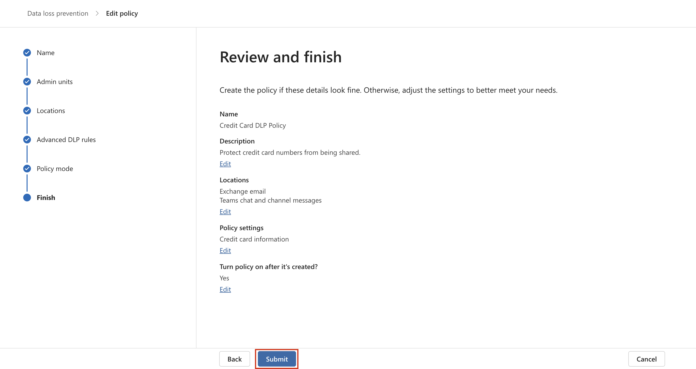
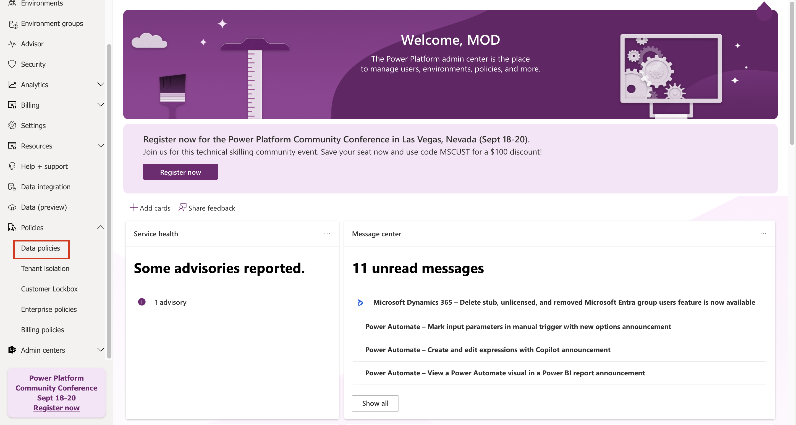

# Laboratorio 6 – Creación y gestión de políticas de DLP

## Objetivo:

Usted es Patti Fernández, la recién contratada administradora de
cumplimiento de Contoso Ltd. encargada de configurar el tenant de
Microsoft 365 de la empresa para la prevención de pérdida de datos.
Contoso Ltd. es una empresa que ofrece cursos de conducción en Estados
Unidos y usted necesita asegurarse de que la información confidencial de
los clientes no salga de la organización.

## Ejercicio 1 – Creación de políticas de DLP

### Tarea 1 – Creación de una política de DLP en modo de prueba 

En este ejercicio, creará una política de Data Loss Prevention
(prevención de pérdida de datos) en el portal de Microsoft Purview para
proteger los datos confidenciales de ser compartidos por los usuarios.
La política de DLP que cree informará a sus usuarios si desean compartir
contenido que contenga información sobre tarjetas de crédito y les
permitirá proporcionar una justificación para el envío de esta
información. La política se implementará en modo de prueba porque aún no
desea que la acción de bloqueo afecte a sus usuarios.

1.  En **Microsoft Edge**, navegue hasta `https://purview.microsoft.com`
    y asegúrese de que ha iniciado sesión en el portal **Microsoft
    Purview** como **Patti Fernandez**.

2.  En el portal **Microsoft Purview**, en el panel de navegación
    izquierdo, seleccione **Solutions** \> **Data loss prevention**.

3.  En **Data loss prevention**, seleccione **Policies**, y luego
    seleccione **+Create policy** para iniciar el asistente de creación
    de una política de prevención de pérdida de datos.

4.  En la página **Start with a template or create a custom policy**,
    desplácese hacia abajo y seleccione **Custom** en **Categories** y
    **Custom policy** en **Regulations**. De forma predeterminada, ambas
    opciones ya deberían estar seleccionadas, seleccione **Next**.

5.  En la página **Name your DLP policy**, escriba
    `Credit Card DLP Policy` en el campo **Name** y
    `Protect credit card numbers from being shared.` en el campo
    **Description**. Seleccione **Next**.

Una captura de pantalla de una descripción de ordenador generada
automáticamente

6.  En la página **Assign admin units**, seleccione **Next**.

7.  En la página **Choose locations to apply the policy**, asegúrese de
    que la opción **Teams chat and channel messages** esté habilitada y
    todas las demás opciones deshabilitadas y seleccione **Next**.

Una captura de pantalla de una descripción de ordenador generada
automáticamente

8.  En la página **Define policy settings**, seleccione **Create or
    customize advanced DLP rules** y seleccione **Next**.

Una captura de pantalla de una descripción de ordenador generada
automáticamente

9.  En la página **Customize advanced DLP rules**, seleccione **+ Create
    rule**.

Una captura de pantalla de una descripción de ordenador generada
automáticamente

10. En la página **Create rule**, escriba `Credit card information` en
    el campo **Name**.

Una captura de pantalla de una descripción de ordenador generada
automáticamente

11. En **Conditions** en la página **Create rule**, seleccione **+ Add
    condition** y seleccione **Content is shared from Microsoft 365**
    del menú desplegable.

12. En la nueva sección **Content is shared from Microsoft 365**,
    seleccione la opción **with people outside my organization**.

Una captura de pantalla de una descripción de ordenador generada
automáticamente

13. Seleccione **+ Add Condition** y luego seleccione **Content
    contains** en el menú desplegable.

Una captura de pantalla de una descripción de ordenador generada
automáticamente

14. En la nueva área **Content contains**, seleccione **Add** y
    seleccione **Sensitive info types** en el menú desplegable.

15. En la página **Sensitive info types**, seleccione **Credit Card
    Number** y seleccione **Add**.

16. En la página **Create rule**, seleccione **+ Add an action** y
    seleccione **Restrict access or encrypt the content in Microsoft 365
    locations**.

17. Marque la casilla delante de **Restrict access or encrypt the
    content in Microsoft 365 locations** y luego seleccione **Block only
    people outside your organization**.

Una captura de pantalla de una descripción de ordenador generada
automáticamente

18. En la página **Create rule**, en la sección **User notifications**,
    seleccione el interrumptor para ponerlo en la posición **On**.

Una captura de pantalla de una descripción de ordenador generada
automáticamente

19. En la página **Create rule**, en la sección **User overrides**, en
    **Allow overrides from M365 services**, marque la casilla **Allow
    overrides from M365 services. Allows users in Exchange, SharePoint,
    OneDrive and Teams to override policy restrictions.**

**Nota**: Si no ha podido seleccionar la casilla de verificación **Allow
overrides from M365 services**, active la casilla de verificación
**Notify users in Office 365 with a policy tip** que se encuentra en la
página **Create rule** en la sección **User notification** \>
**Microsoft 365 services** del paso anterior. A continuación, seleccione
la casilla de verificación **Allow overrides from M365 services. Allows
users in Exchange,** **SharePoint, OneDrive and Teams to override policy
restrictions.**

20. Marque la casilla **Require a business justification to override**.

21. En la sección **Incident reports**, en el menú desplegable **Use
    this severity level in admin alerts and reports**, seleccione
    **Low**.

22. Seleccione **Save**, y luego seleccione **Next**.

Una captura de pantalla de una descripción de ordenador generada
automáticamente

23. En la página **Test or turn on the policy**, seleccione **Run the
    policy in simulation mode** y seleccione **Show policy tips while in
    test mode**.

24. Seleccione **Submit** para crear la política.

25. Una vez creada la política, seleccione **Done**.

Una captura de pantalla de una descripción de ordenador generada
automáticamente

### Ahora ha creado una política de DLP que busca números de tarjetas de crédito en chats y canales de Microsoft Teams y permite a los usuarios proporcionar una justificación empresarial para anular la política.

### Task 2 – Modificación de una política de DLP

En esta tarea, modificará la política de DLP existente que creó en el
paso anterior para analizar también los correos electrónicos en busca de
información de tarjetas de crédito e informar a los usuarios si desean
compartir este contenido en un correo electrónico.

1.  En **Microsoft Edge**, vaya a `https://purview.microsoft.com` y
    asegúrese de haber inicado sesión en el portal **Microsoft Purview**
    como **Patti Fernandez**.

2.  En el portal **Microsoft Purview**, en el panel de navegación,
    seleccione **Solutions** \> **Data loss prevention**.

3.  En **Data loss prevention**, seleccione **Policies**, luego
    seleccione la política denominada **Credit Card DLP Policy** y
    después seleccione **Edit policy** (icono del lápiz) para abrir el
    asistente de políticas.

4.  En la página **Name your DLP policy** and **Assign admin units**,
    seleccione **Next**.

5.  En la página **Choose locations to apply the policy**, active la
    opción **Exchange email** y luego seleccione **Next** hasta llegar a
    la página **Review and finish**. Asegúrese de que el resto de
    ubicaciones estén desactivadas.

6.  Seleccione **Submit** para aplicar el cambio que ha realizado en la
    política.

7.  Una vez actualizada la política, seleccione **Done**.

Una captura de pantalla de una descripción de ordenador generada
automáticamente

Ahora ha modificado una política de DLP existente y cambiado las
ubicaciones que analiza en busca de contenido.

### Tarea 3 – Creación de una política de DLP en PowerShell 

En esta tarea, utilizará PowerShell para crear una política de DLP para
proteger los ID de empleado de Contoso y evitar que se compartan en
Exchange. Se informará a los usuarios de que están intentando compartir
datos confidenciales y se les bloqueará el envío del correo electrónico
si incluye ID de empleado de Contoso.

1.  En el menú de inicio, seleccione **Windows PowerShell**.

2.  En la ventana **PowerShell**, ingrese

`Connect-IPPSSession`

y luego inicie sesión como **Patti Fernandez.**

Descripción de texto generada automáticamente

Nota: Si muestra error intente ejecutar primero los siguientes comandos
uno a uno y luego ejecute de nuevo el paso.

`Install-Module ExchangeOnlineManagement`

`Import-Module ExchangeOnlineManagement`

Si muestra error intente ejecutar los siguientes comandos uno a uno
primero y luego ejecute el paso de nuevo. Si aún así se encuentra con
algún error, descargue el siguiente archivo e instálelo antes de seguir
adelante.
`https://github.com/PowerShell/PowerShell/releases/download/v7.4.0/PowerShell-7.4.0-win-x64.msi`

3.  Ingrese el siguiente comando en PowerShell para crear una política
    de DLP que escanee todos los buzones de Exchange:

`New-DlpCompliancePolicy -Name "EmployeeID DLP Policy" -Comment "This policy blocks sharing of Employee IDs" -ExchangeLocation All`

4.  Ingrese el siguiente comando en PowerShell para agregar una regla de
    DLP a la política de DLP que creó en el paso anterior:

`New-DlpComplianceRule -Name "EmployeeID DLP rule" -Policy "EmployeeID DLP Policy" -BlockAccess $\\true -ContentContainsSensitiveInformation @{Name="Contoso Employee IDs"}`

Descripción de texto generada automáticamente

5.  Utilice el siguiente comando para revisar **EmployeeID DLP rule**:

`Get-DLPComplianceRule -Identity "EmployeeID DLP rule"`

Descripción de texto generada automáticamente

Ahora ha creado una política de DLP que escanea en busca de Contoso
EmpoloyeeIDs en Exchange utilizando PowerShell.

### Tarea 4 – Activar una política en modo de prueba 

En esta tarea, activará la política DLP de información de tarjetas de
crédito que creó en modo de prueba para que aplique sus acciones de
protección.

1.  En **Microsoft Edge**, navegue hasta `https://purview.microsoft.com`
    y asegúrese de que ha iniciado sesión en el portal **Microsoft**
    **Purview** como **Patti Fernandez**.

2.  En el portal **Microsoft Purview**, en el panel de navegación de la
    izquierda, seleccione **Solutions** \> **Data loss prevention**.

3.  En **Data loss prevention**, seleccione **Policies**, y luego
    seleccione la política denominada **Credit Card DLP Policy** y
    después **Edit policy** (icono del lápiz) para abrir el asistente de
    políticas.

4.  Seleccione **Next** hasta llegar a la página **Test or turn on the
    policy** y seleccione **Turn the policy on immediately**.

Una captura de pantalla de la descripción de un ordenador generada
automáticamente

5.  Seleccione **Next**, y seleccione **Submit** para activar la
    política.

6.  Una vez actualizada la política seleccione **Done**.

Una captura de pantalla de la descripción de un ordenador generada
automáticamente

Ha activado correctamente la política de DLP. Si la política detecta un
intento de compartir información de tarjetas de crédito, ahora bloqueará
el intento y permitirá a los usuarios proporcionar una justificación
empresarial para anular la acción de bloqueo.

## Ejercicio 2 - Gestión de políticas de DLP

### Tarea 1 - Modificación de la prioridad de las políticas

Después de crear dos políticas de DLP, querrá asegurarse de que la
política más restrictiva se procesa con mayor prioridad que la menos
restrictiva. Por esta razón, desea mover la política DLP EmployeeID a la
prioridad más alta.

1.  En **Microsoft Edge**, navegue hasta `https://purview.microsoft.com`
    y asegúrese de que ha iniciado sesión en el portal **Microsoft
    Purview** como **Patti Fernandez**.

2.  En el portal **Microsoft Purview**, en el panel de navegación
    izquierdo, seleccione **Solutions** \> **Data loss prevention**.

3.  En **Data loss prevention**, seleccione **Policies**, y luego
    seleccione la política denominada **Credit Card DLP Policy** y
    después **Edit policy** (icono del lápiz) para abrir el asistente de
    políticas.

4.  Seleccione **Move to top**.

5.  En la ventana **Data loss prevention**, seleccione **Refresh** y
    revise la prioridad en la columna **Order** de la table de
    políticas.

Ha modificado correctamente la prioridad de sus políticas DLP. Si ambas
políticas coinciden con el mismo contenido, se aplicará la acción de la
política de mayor prioridad.

### Tarea 2 - Habilitar la supervisión de archivos en Microsoft 365 Defender

Desea utilizer políticas de archivos en **Microsoft 365 Defender** para
proteger los archivos de sus ubicaciones de OneDrive y SharePoint
Online. Antes de poder crear una política de archivos, debe habilitar la
supervisión de archivos para que Microsoft 365 Defender pueda analizar
los archivos de su organización.

1.  Abra **Microsoft Edge** y navegue hasta
    `https://security.microsoft.com` e inicie sesión en el portal de
    Microsoft 365 Defender como **MOD Administrator**.

2.  En la navegación seleccione **Cloud appsSystem** \> **Files
    Settings** \> **Cloud apps** en el menú.

3.  Después seleccione **Enable file monitoring**. Seleccione **Files**
    en **Information Protection**.

Una captura de pantalla de la descripción de un ordenador generada
automáticamente

4.  Marque la casilla **Enable file monitoring** y luego seleccione
    **Save** si aún no está marcada.

Una captura de pantalla de la descripción de un ordenador generada
automáticamente

Ha habilitado correctamente la supervisión de archivos en Microsoft
Defender for Cloud Apps y ahora puede analizar archivos en busca de
contenido confidencial utilizando políticas de archivos.

### Tarea 3 - Creación de una política de archivos para Microsoft 365 Defender 

En esta tarea, desea crear una política de archivos en Microsoft 365
Defender para analizar archivos en OneDrive y SharePoint Online y poner
automáticamente en cuarentena los archivos que contengan información de
tarjetas de crédito si se comparten.

1.  Abra **Microsoft Edge** y navegue hasta
    `https://security.microsoft.com` e inicie sesión en el portal de
    Microsoft 365 Defender como **MOD Administrator**.

2.  En la navegación seleccione **Settings** en **System**, y seleccione
    **Cloud apps** en el menú.

3.  En **Information Protection** \> **Microsoft Information
    Protection**, asegúrese de que esta seleccionada la opción
    **Automatically scan new files for sensitivity labels from Microsoft
    Purview Protection and content inspection warnings**, si no es así,
    selecciónela. Haga clic en **Save**.

4.  En **Inspect protected files**, haga clic en **Grant Permission**.

5.  Si se le pide, inicie sesión utilizando el ID de **MOD
    Administrator** y haga clic en **Accept** en la siguiente pantalla.

6.  En la subnavegación, seleccione **Connected apps** \> **App
    Connectors**. Asegúrese de que **Microsoft 365** está añadido.

- Si no es así, seleccione **Connect an app**, y añada la aplicación. En
  **Select Office 365 components**, seleccione todas las casillas de
  verificación y luego haga clic en **Connect Office 365**.

- Una vez que vea el mensaje **Office 365 was successfully connected**,
  cierre el cuadro.

7.  En el portal de **Microsoft 365 Defender**, en el panel de
    navegación izquierdo, expanda **Cloud apps** \> **Policies** y
    seleccione **Policy management**.

8.  En la página **Policies**, expanda **+ Create policy** y luego
    seleccione **File policy**.

Una captura de pantalla de la descripción de un ordenador generada
automáticamente

9.  En la página **Create file policy**, escriba
    `Credit Card Information for files` en el campo **Policy name**, y
    escriba `Protect credit card numbers from being shared in files.` en
    el campo **Description**.

Interfaz gráfica de usuario, descripción de la aplicación generada
automáticamente

10. Mantenga **Policy Severity** en **Low** (un icono iluminado) y
    asegúrese de que **Category** está establecido en **DLP**. Para una
    política de archivos, ésta debería ser la predeterminada.

Interfaz gráfica de usuario, texto, descripción de la aplicación
generada automáticamente

11. En el área **Files matching all of the following**, amplíe el menú
    desplegable **Public (Internet), External, Public** y añada
    **Internal**.

Interfaz gráfica de usuario, descripción de la aplicación generada
automáticamente

12. En Apply to, en el menú desplegable **Inspection Method**,
    seleccione **Data Classification Service**.

Interfaz gráfica de usuario, texto, descripción de la aplicación
generada automáticamente

**Nota:** Si aún no ve el servicio **Data Classification Service** en el
despegable, seleccione **None** por ahora. Una vez hecho esto vuelva al
cabo de un tiempo a **Policies** \> **Policy management** \> **All
Policies** \> **Search for name: Credit card** \> **Select Credit Card
Information for files**.

Una captura de pantalla de la descripción de un ordenador generada
automáticamente

13. Seleccione **Data Classification Service** en el desplegable de
    **Inspection method**.

Una captura de pantalla de una descripción informática generada
automáticamente con una confianza media

14. En el menú desplegable **Choose inspection type…**, seleccione
    **Sensitive information type…**.

Interfaz gráfica de usuario, texto, descripción de la aplicación
generada automáticamente

15. En el cuadro de diálogo **Select a sensitive information type**,
    seleccione **Credit Card Number**, y luego seleccione **Done** en la
    esquina superior derecha.

Interfaz gráfica de usuario, descripción del sitio web generada
automáticamente

16. En **Alerts**, marque la casilla **Create an alert for each matching
    file** y revise sus opciones. Mantenga la configuración por defecto
    seleccionando **Save as default settings**.

Una captura de pantalla de la descripción de un ordenador generada
automáticamente

17. En la sección **Governance actions**, expanda **Microsoft OneDrive
    for Business** y seleccione **Put in user quarantine**.

Una captura de pantalla de la descripción de un ordenador generada
automáticamente

18. En la sección **Governance actions**, expanda **Microsoft SharePoint
    Online** y seleccione **Put in user quarantine**.

Una captura de pantalla de la descripción de un ordenador generada
automáticamente

19. Seleccione **Create** en la parte inferior de la página.

Interfaz gráfica de usuario, texto, descripción de la aplicación
generada automáticamente

20. Seleccione **Profile picture** del MOD Admin en la parte superior
    derecha y seleccione **Sign out** junto a la rueda dentada, después
    cierre el navegador.

Ahora ha creado una política de archivos que analizará continuamente los
archivos guardados en OneDrive y SharePoint en busca de información de
tarjetas de crédito y los pondrá en cuarentena si se comparten dentro de
su organización.

### Tarea 4 - Creación de una política de DLP para Power Platform 

Su empresa utiliza flujos de Power Automate para compartir datos entre
SharePoint Online y SalesForce. En esta tarea, creará una política de
DLP para Power Platform que permita que sus flujos existentes sigan
funcionando, pero impida la creación de flujos que compartan datos entre
SharePoint Online y Apps definidas como no empresariales.

1.  En **Microsoft Edge**, navegue hasta
    `https://admin.powerplatform.microsoft.com` e inicie sesión en el
    centro de administración de Power Platform como **MOD
    Administrator**.

2.  En **Power Platform admin center**, en el panel de navegación
    izquierdo, seleccione el desplegable **Policies** y luego seleccione
    **Data policies**.

3.  En la página **Data policies**, seleccione **+ New Policy**.

Interfaz gráfica de usuario, aplicación, Descripción de los equipos
generada automáticamente

4.  En la página **Name your policy**, escriba
    `Tenant-wide SharePoint Policy`, y luego seleccione **Next**.

Interfaz gráfica de usuario, texto, descripción de la aplicación
generada automáticamente

5.  En la pestaña **Non-business | Default**, seleccione **SharePoint**
    y **Salesforce**, y luego seleccione **Move to Business** en la
    parte superior de la página.

6.  En la página **Assign connectors**, seleccione la pestaña
    **Business** para asegurarse de que ahora aparecen tanto SharePoint
    como Salesforce.

Interfaz gráfica de usuario, descripción de la aplicación generada
automáticamente

7.  Seleccione **Next** dos veces.

Interfaz gráfica de usuario, descripción de la aplicación generada
automáticamente

Interfaz gráfica de usuario, texto, descripción de la aplicación
generada automáticamente

8.  En la página **Define scope**, seleccione **Add all environments**,
    y luego seleccione **Next**.

Interfaz gráfica de usuario, texto, descripción de la aplicación
generada automáticamente

10. En la página **Review and create policy**, revise la configuración
    de su política y seleccione **Create policy**.

Una captura de pantalla de la descripción de un ordenador generada
automáticamente

Ahora ha creado una política de DLP de Power Platform que impide a los
usuarios crear flujos que impliquen un conector de SharePoint Online y
cualquier conector que no sea Salesforce.

## Ejercicio 3 - Habilitación de Adaptive Protection

1.  En **Microsoft Edge**, navegue hasta `https://purview.microsoft.com`
    e inicie sesión en el portal purview como **MOD Administrator**.

2.  En el panel de navegaciín izquierdo, seleccione **Solutions** \>
    **Insider Risk Management** \> **Adaptive protection** \>
    **Dashboard**. Seleccione **Quick setup**.

3.  Aparecerá un mensaje diciendo que estamos configurando las cosas.
    Tardará 72 horas en habilitarlo. Utilizaremos esto en el último
    laboratorio donde exploraremos la característica **Adaptive
    Protection**.

Una captura de pantalla de la descripción de un ordenador generada
automáticamente

4.  Seleccione la pestaña **Adaptive Protection settings** y active el
    botón de alternancia de **Adaptive Protection**. Seleccione
    **Save**.

Una captura de pantalla de la descripción de un ordenador generada
automáticamente

## Resumen:

En este laboratorio aprendimos a crear nuevas políticas de DLP, a
habilitar la protección de archivos y a gestionar las políticas de DLP.
También aprendimos a habilitar Adaptive Protection, que exploraremos en
el laboratorio más adelante.
