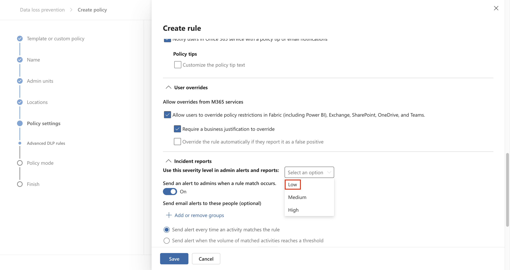
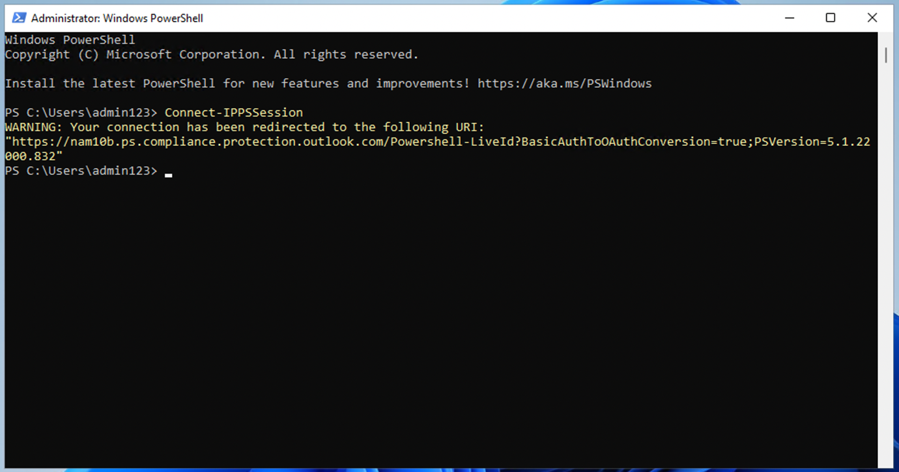
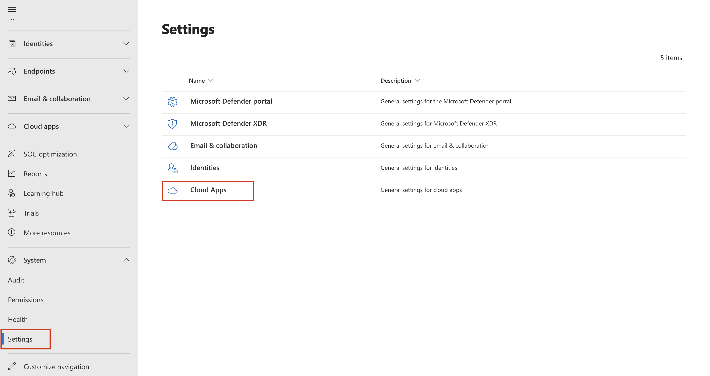
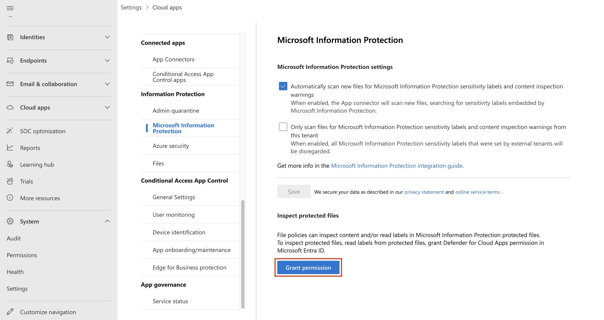

# 實驗 6 – 創建和管理 DLP 策略

## 目的：

您是 Patti Fernandez，Contoso Ltd. 新聘用的合規性管理員，負責配置公司的
Microsoft 365 租戶以防止數據丟失。Contoso Ltd.
是一家在美國提供駕駛指導的公司，您需要確保敏感的客戶信息不會離開組織。

## 練習 1 – 創建 DLP 策略

### 任務 1 – 在測試模式下創建 DLP 策略

在本練習中，您將在 Microsoft Purview
門戶中創建數據丟失防護策略，以保護敏感數據不被用戶共享。您創建的 DLP
策略將通知用戶是否要共享包含信用卡信息的內容，幷允許他們提供發送此信息的理由。該策略將在測試模式下實施，因爲您還不希望阻止作影響您的用戶。

1.  在 **Microsoft Edge** 中，導航到 `https://purview.microsoft.com`
    幷確保您以 **Patti Fernandez 的身份登錄到** Microsoft Purview 門戶。

2.  在 **Microsoft Purview** 門戶的左側導航窗格中，選擇 **olutions \>
    Data loss prevention**。

3.  在 Data loss prevention **下**，選擇 **Policies**，然後選擇
    **+Create policy** 以啓動用于創建新的數據丟失防護策略的嚮導。

4.  在 **Start with a template or create a custom policy**
    頁面上，向下滾動幷選擇 **Categories** 下的 **Custom** 和
    **Regulations** 下的 **Custom
    policy**。默認情况下，這兩個選項都應已選中，選擇 **下一步**。

5.  在 **Name your DLP policy** 頁面上， ` 在 `Name 字段中鍵入
    Credit Card DLP Policy `幷保護信用卡號不被共享。` 在 **Description**
    字段中。選擇 **Next**。

自動生成的計算機 Description 的屏幕截圖

6.  在 **Assign admin units** 頁上，選擇 Next。

7.  在 **Choose locations to apply the policy**，**Teams chat and
    channel messages** 選項，幷禁用所有其他選項，然後選擇 **Next**。

自動生成的計算機 Description 的屏幕截圖

8.  在 **Define policy settings** 頁面上，選擇 **Create or customize
    advanced DLP rules**，然後選擇 **Next**。

自動生成的計算機 Description 的屏幕截圖

9.  在 **Customize advanced DLP rules** 頁上，選擇**+ Create rule**。

自動生成的計算機 Description 的屏幕截圖

10. 在 **Create rule** 頁面上，在 `Name` 字段中鍵入 Credit card
    information。

自動生成的計算機 Description 的屏幕截圖

11. 在 **Create rule 頁面上**的 **Conditions** 下，選擇 **+ Add
    condition**，然後從下拉菜單中選擇 **Content is shared from Microsoft
    365**。

12. 在新 **Content is shared from Microsoft 365** 部分中，選擇 with
    **people outside my organization** 選項。

自動生成的計算機 Description 的屏幕截圖

13. 選擇 **+ Add Condition**，然後選擇 **Content contains**
    從下拉菜單中。

自動生成的計算機 Description 的屏幕截圖

14. 在新的 **Content contains**區域中，選擇
    **Add**，然後從下拉菜單中選擇 **Sensitive info type**。

15. 在 **Sensitive info types**頁上，選擇 **Credit Card
    Number**，然後選擇 **Add**。

16. 在 **Create rule** 頁面上，選擇 **+ Add an action** ，然後選擇
    **Restrict access or encrypt the content in Microsoft 365
    locations**。

17. 選中 **Restrict access or encrypt the content in Microsoft 365
    locations** 前面的框 ，然後選擇 **Block only people outside your
    organization**。

自動生成的計算機 Description 的屏幕截圖

18. 在 **Create rule** 頁面的 **User notifications**
    部分中，選擇開關以將其置于 **On** 位置。

自動生成的計算機 Description 的屏幕截圖

19. 在 **Create rule** 頁面的 **User overrides** 部分的 **Allow
    overrides from M365 services** 下，選中 **Allow overrides from M365
    services 複選框。允許 Exchange、SharePoint、OneDrive 和 Teams
    中的用戶覆蓋策略限制。**

**注意**：如果您無法選中**Allow overrides from M365
services**複選框，請啓用**Notify users in Office 365 with a policy tip**
複選框，該策略提示可在上一步的**User notification \> Microsoft 365
services** 部分下的 **Create rule**頁面上找到。然後選中 **Allow
overrides from M365 services複選框。Allow overrides from M365 services.
Allows users in Exchange, SharePoint, OneDrive and Teams to override
policy restrictions 。**

20. 選中 **Require a business justification to override** 框。

21. 在 **Incident reports** 部分的 **Use this severity level in admin
    alerts and reports**下拉列表中，選擇 **Low**。

22. 選擇 **Save**，然後選擇 **Next**。

自動生成的計算機 Description 的屏幕截圖

23. 在 **Test or turn on the policy** 頁面上，選擇 **Run the policy in
    simulated mode**，然後選擇 **Show policy tips when in test mode**。

24. 選擇 **Submit** 以創建策略。

25. 創建策略後，選擇 **Done**。

自動生成的計算機 Description 的屏幕截圖

您現在已經創建了一個 DLP 策略，該策略掃描 Microsoft Teams
聊天和頻道中的信用卡號，幷允許用戶提供覆蓋策略的業務理由。

### 任務 2 – 修改 DLP 策略

在此任務中，您將修改在上一步中創建的現有DLP策略，以同時掃描電子郵件中的信用卡信息，幷通知用戶是否要通過電子郵件共享此內容。

1.  在 **Microsoft Edge** 中，導航到 `https://purview.microsoft.com`
    幷確保您以 **Patti Fernandez** 的身份登錄到 Microsoft Purview 門戶。

2.  在 **Microsoft Purview** 門戶的左側導航窗格中，選擇 **olutions \>
    Data loss prevention**。

3.  在 **Data loss prevention下**，選擇 **Policies，**然後選擇名爲
    **Credit Card DLP Policy** 的策略**，** 然後選擇 **Edit policy**
    （pencil icon）以打開策略嚮導。

4.  在 **Name your DLP policy** 和 **Assign admin units**頁上，選擇
    **Next**。

5.  在 **Choose locations to apply the policy** 頁面上，啓用 **Exchange
    email** 選項，然後選擇 **Next**，直到到達 **Review and finish**
    頁面。確保其餘位置處于禁用狀態。

6.  選擇 **Submit** 以應用您在策略中所做的更改。

7.  更新策略後，選擇 **Done**。

自動生成的計算機 Description 的屏幕截圖

您現在已經修改了現有的 DLP 策略幷更改了它掃描內容的位置。

### 任務 3 – 在 PowerShell 中創建 DLP 策略

在此任務中，您將使用 PowerShell 創建 DLP 策略，以保護 Contoso EmployeeID
幷防止它們在Exchange中共享。用戶將收到他們正在嘗試共享敏感數據的通知，如果電子郵件包含
Contoso EmployeeID，則會阻止用戶發送電子郵件。

1.  在開始菜單中，選擇 **Windows PowerShell**。

2.  在 **PowerShell** 窗口中，輸入

`Connect-IPPSSession`

然後以 **Patti Fernandez** 身份登錄**。**

自動生成文本描述

注意：如果顯示錯誤，請先嘗試逐個運行以下命令，然後再次執行該步驟。

`Install-Module ExchangeOnlineManagement`

`Import-Module ExchangeOnlineManagement`

如果顯示錯誤，請先嘗試逐個運行以下命令，然後再次執行該步驟。如果您仍然遇到任何錯誤，請下載以下文件幷安裝它，然後再繼續。
`https://github.com/PowerShell/PowerShell/releases/download/v7.4.0/PowerShell-7.4.0-win-x64.msi`

3.  在 PowerShell 中輸入以下命令以創建掃描所有 Exchange 郵箱的 DLP
    策略：

`New-DlpCompliancePolicy -Name "EmployeeID DLP Policy" -Comment "This policy blocks sharing of Employee IDs" -ExchangeLocation All`

4.  在 PowerShell 中輸入以下命令，將 DLP 規則添加到您在上一步中創建的
    DLP 策略:

`New-DlpComplianceRule -Name "EmployeeID DLP rule" -Policy "EmployeeID DLP Policy" -BlockAccess $\\true -ContentContainsSensitiveInformation @{Name="Contoso Employee IDs"}`

自動生成文本描述

5.  使用以下命令查看 **EmployeeID DLP rule**:

`Get-DLPComplianceRule -Identity "EmployeeID DLP rule"`

自動生成文本描述

現在，你已創建一個 DLP 策略，該策略使用 PowerShell 在 Exchange 中掃描
Contoso EmpoloyeeID。

### 任務 4 – 在測試模式下激活策略

在此任務中，您將激活在測試模式下創建的信用卡信息DLP策略，以便它强制執行其保護作。

1.  在 **Microsoft Edge** 中，導航到 https://purview.microsoft.com
    幷確保您以 **Patti Fernandez** 的身份登錄到 **Microsoft Purview**
    門戶。

2.  在 **Microsoft Purview** 門戶的左側導航窗格中，選擇 **Solutions \>
    Data loss prevention**。

3.  在 **Data loss prevention** 下，選擇 **Policies ，**然後選擇名爲
    **Credit Card DLP Policy** 的策略， 然後選擇 **Edit policy**
    （pencil icon）以打開策略嚮導。

4.  選擇 **Next**，直到到達 **Test or turn on the policy**，然後選擇
    **Turn the policy on immediately**。

自動生成的計算機 Description 的屏幕截圖

5.  選擇 **Next**，然後選擇 **Submit** 以激活策略。

6.  更新策略後，選擇 **Done**。

自動生成的計算機 Description 的屏幕截圖

您已成功激活 DLP
策略。如果策略檢測到共享信用卡信息的嘗試，它現在將阻止該嘗試，幷允許用戶提供業務理由來覆蓋阻止作。

## 練習 2 – 管理 DLP 策略

### 任務 1 – 修改策略優先級

創建兩個 DLP
策略後，您希望確保以比限制較少的策略更高的優先級處理限制性較强的策略。因此，您希望將
EmployeeID DLP 策略移動到更高的優先級。

1.  在 **Microsoft Edge** 中，導航到 `https://purview.microsoft.com`
    幷確保您以 **Patti Fernandez 的身份登錄到** Microsoft Purview 門戶。

2.  在 **Microsoft Purview** 門戶的左側導航窗格中，選擇 **Solutions \>
    Data loss prevention**。

3.  在 **Data loss prevention下**，選擇 **Policies** ，然後選擇名爲
    **Credit Card DLP Policy** 的策略，然後選擇 **Edit policy** （pencil
    icon）以打開策略嚮導。

4.  選擇 **Move to top**。

5.  在 **Data loss prevention** 窗口中，選擇 **Refresh** 幷查看 策略表的
    **Order** 列中的優先級。

您已成功修改 DLP
策略的優先級。如果兩個策略都匹配相同的內容，則將强制執行優先級較高的策略的作。

### 任務 2 - 在 Microsoft 365 Defender 中啓用文件監視

你想要使用 **Microsoft 365 Defender** 中的文件策略 來保護 OneDrive 和
SharePoint Online
位置中的文件。在創建文件策略之前，您需要啓用文件監控，以便 Microsoft 365
Defender 可以掃描組織中的文件。

1.  打開 **Microsoft Edge** 幷導航到 `https://security.microsoft.com`
    幷以 MOD Administrator身份登錄 Microsoft 365 Defender 門戶。

2.  在導航欄中，從菜單中選擇 **Cloud appsSystem** \> **Files Settings**
    \> **Cloud apps**。

3.  然後選擇 **Enable file monitoring**。選擇 **Information
    Protection**下的 **Files** 。

自動生成的計算機 Description 的屏幕截圖

4.  選中 **Enable file monitoring** 複選框，然後選擇 **Save**
    （如果尚未標記）。

自動生成的計算機 Description 的屏幕截圖

您已成功在 Microsoft Defender for Cloud Apps
中啓用文件監控，現在可以使用文件策略掃描文件中的敏感內容。

### 任務 3 - 爲 Microsoft 365 Defender 創建文件策略

在此任務中，您希望在 Microsoft 365 Defender 中創建文件策略，以掃描
OneDrive 和 SharePoint Online
中的文件，幷自動隔離包含信用卡信息的文件（如果它們是共享的）。

1.  打開 **Microsoft Edge** 幷導航到 `https://security.microsoft.com`
    幷以 **MOD Administrator**身份登錄 Microsoft 365 Defender 門戶。

2.  在導航中，選擇 **Settings** 下的 **System**，然後從菜單中選擇
    **Cloud apps**。

 3. 在**Information Protection** \> **Microsoft
Information Protection下**，確保選中 **Automatically scan new files for
sensitivity labels from Microsoft Purview Protection and content
inspection warnings**，請選擇它。點擊 **Save**。

4\. 在 **Inspect protected files** 下，單擊 **Grant Permission**。

5.  如果詢問，請使用 **MOD Administrator’s** ID 登錄，然後單擊
    下一個屏幕上的 **Accept。**

6.  在子導航中，選擇 **Connected apps \> App Connectors**。確保 **已添加
    Microsoft 365。**

- 如果沒有，請選擇 **Connect an app**，然後添加應用程序。在 **Select
  Office 365 components**下，選中所有複選框，然後單擊 **Connect Office
  365**。

- 看到消息 **Office 365 was successfully connected**，請關閉該框。

7.  在 **Microsoft 365 Defender** 門戶的左側導航窗格中，展開 **Cloud
    apps** \> **Policies** 幷選擇 Policy **management**。

8.  在 **Policies** 頁面上，展開 **+ Create policy**，然後選擇 **File
    policy**。

自動生成的計算機 Description 的屏幕截圖

9.  在 **Create file policy** 頁面上，在 `Policy name `字段中鍵入
    Credit Card Information for files，然後鍵入
    `Protect credit card numbers from being shared in files。` 在
    **Description**字段中。

圖形用戶界面，自動生成應用程序描述

10. 將 **Policy Severity** 保持在 **Low**（一個亮起的圖標）幷確保
    **Category** 設置爲 **DLP**。對于文件策略，這應該是默認值 。

自動生成圖形用戶界面、文本、應用程序描述

11. 在 **Files matching all of the following** 區域中，展開下拉菜單
    **Public （Internet）、External、Public** 幷添加 **Internal**。

圖形用戶界面，自動生成應用程序描述

12. 在 Apply to**下的 Inspection Method**下拉菜單中，選擇 **Data
    Classification Service**。

自動生成圖形用戶界面、文本、應用程序描述

注意： 如果您尚未在下拉列表中看到 **Data Classification Service**
，請選擇 **None** **as of now**。完成後，一段時間後返回 **Policies \>
Policy management \> All Policies \> Search for name: Credit card \>
Select Credit Card Information for files**。

自動生成的計算機 Description 的屏幕截圖

13. 從 **Inspection method** 下拉列表中選擇 **Data Classification
    Service**。

以中等置信度自動生成的計算機描述的屏幕截圖

14. 在 **Choose inspection type...** 下拉菜單中，選擇 **Sensitive
    information type...**。

自動生成圖形用戶界面、文本、應用程序描述

15. 在 **Select a sensitive information type** 對話框中，選擇 **Credit
    Card Number**，然後選擇右上角的 **Done**。

圖形用戶界面，自動生成網站描述

16. 在 **Alerts**下，選中 **Create an alert for each matching file**
    複選框幷查看您的選項。通過選擇 **Save as default settings**
    將設置保持爲默認值。

自動生成的計算機 Description 的屏幕截圖

17. 在 **Governance actions** 部分中，展開 **Microsoft OneDrive for
    Business** 幷選擇 **Put in user quarantine**。

自動生成的計算機 Description 的屏幕截圖

18. 在 **Governance actions** 部分中，展開 **“Microsoft SharePoint
    Online** ” ，然後選擇 **Put in user quarantine**。

自動生成的計算機 Description 的屏幕截圖

19. 選擇 頁面底部的 **Create** 。

自動生成圖形用戶界面、文本、應用程序描述

20. 選擇 Profile picture 管理員 在右上角，然後選擇齒輪旁邊的 **Sign
    out**，然後關閉瀏覽器。

您現在已經創建了一個文件策略，該策略將持續掃描保存在 OneDrive 和
SharePoint 中的文件以查找信用卡信息，幷在它們在組織內部共享時將其隔離。

### 任務 4 - 爲 Power Platform 創建 DLP 策略

您的公司使用 Power Automate 流在 SharePoint Online 和 SalesForce
之間共享數據。在此任務中，您將爲 Power Platform 創建一個 DLP
策略，該策略允許您的現有流繼續工作，但會阻止創建將在 SharePoint Online
和定義爲非業務的應用程序之間共享數據的流。

1.  在 **Microsoft Edge** 中，導航到
    `https://admin.powerplatform.microsoft.com` 幷以 **MOD
    Administrator** 身份登錄 Power Platform 管理中心。

2.  在**Power Platform admin center** 的左側導航窗格中，選擇
    **Policies** 的下拉列表， 然後選擇 **Data policies**。

3.  在 **Data policies** 頁面上，選擇 **+ New Policy**。

自動生成圖形用戶界面、應用程序、Teams 描述

4.  在 **Name your policy**頁面上，鍵入
    `“租戶範圍的 SharePoint 策略"`，然後選擇 **Next**。

自動生成圖形用戶界面、文本、應用程序描述

5.  在**Non-business | Default** 選項卡，選擇 **SharePoint** 和
    **Salesforce**，然後選擇 **頁面頂部的 Move to Business**。

6.  在 **Assign connectors** 頁中，選擇 **Business**選項卡，確保
    SharePoint 和 Salesforce 現在都顯示。

圖形用戶界面，自動生成應用程序描述

7.  選擇 **Next** 兩次。

圖形用戶界面，自動生成應用程序描述

自動生成圖形用戶界面、文本、應用程序描述

8.  在 **Define scope** 頁面上，選擇 **Add all environments**，然後選擇
    **Next** 。

自動生成圖形用戶界面、文本、應用程序描述

9.  在 **Review and create policy**頁面上，查看您的策略設置，然後選擇
    **Create policy。**

自動生成的計算機 Description 的屏幕截圖

您現在已經創建了一個 Power Platform DLP 策略，該策略可防止用戶創建涉及
SharePoint Online 連接器和任何非 Salesforce 連接器的流。

## 練習 3 – 啓用自適應保護

1.  在 **Microsoft Edge** 中，導航到 `https://purview.microsoft.com`
    幷以 **MOD Administrator**身份登錄 purview 門戶。

2.  從左側導航窗格中，選擇 **Solutions** \> **Insider Risk Management**
    \> **Adaptive protection** \> **Dashboard**。選擇 **Quick setup**。

3.  它將顯示一條消息，指出我們正在進行設置。啓用它需要 72
    小時。我們將在最後一個實驗中使用它來探索 **Adaptive Protection**
    功能。

自動生成的計算機 Description 的屏幕截圖

4.  選擇 **Adaptive Protection settings** 選項卡，然後打開 **Adaptive
    Protection** 切換按鈕。選擇 **Save**。

自動生成的計算機 Description 的屏幕截圖

## 總結:

在本實驗中，我們學習了如何創建新的 DLP 策略、啓用文件保護和管理 DLP
策略。我們還學習了如何啓用收養保護，我們稍後將在實驗室中探討。
