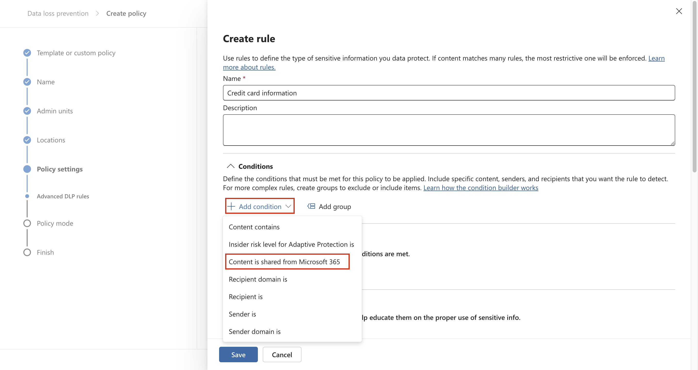
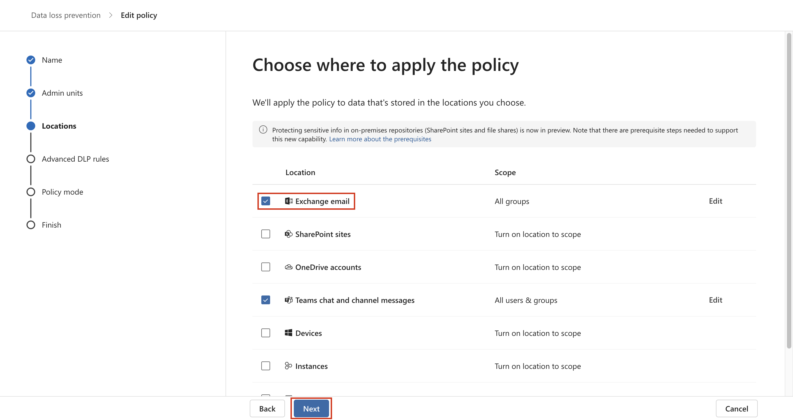

# 실습 6 – DLP 정책을 생성하고 관리하기

## 목표:

Data loss prevention를 위해 회사의 Microsoft 365 테넌트를 구성하는
작업을 맡은 Contoso Ltd.의 새로 고용된 규정 준수 관리자인 Patti
Fernandez입니다. Contoso Ltd.는 미국에서 운전 교육을 제공하는 회사이며
중요한 고객 정보가 조직 외부로 유출되지 않도록 해야 합니다.

## 연습 1 – DLP 정책을 생성하기

### 작업 1 – 테스트 모드에서 DLP 정책을 생성하기

이 연습에서는 사용자가 민감한 데이터를 공유하지 못하도록 보호하기
위해Microsoft Purview 포털에서 Data Loss Prevention 정책을 생성할
것입니다. 관리자가 생성한 DLP 정책은 사용자가 신용 카드 정보가 포함된
콘텐츠를 공유하려는 경우 사용자에서 알리고 이 정보를 보낼 수 있는 근거를
제공할 수 있도록 합니다. 차단 작업이 아직 사용자에게 영향을 주지 않도록
하기 위해 이 정책은 테스트 모드에서 구현됩니다.

1.  **Microsoft Edge**에서 navigate to `https://purview.microsoft.com`
    로 인동하여**Microsoft Purview** 포털에**Patti Fernandez**로
    로그인했는지 확인하세요.

2.  **Microsoft Purview** 포털에서 왼쪽 탐색 창에서**Solutions** \>
    **Data loss prevention**를 선택하세요.

3.  **Data loss prevention**에서**Policies**를 선택하여 새로운data loss
    prevention 정책을 생성하려면 wizard를 시작하기 위해 **+Create
    policy**를 선택하세요.

4.  **Start with a template or create a custom policy** 페이지에서
    아래로 스크롤하여**Regulations**의 **Categories** 및 **Custom
    policy**에서 **Custom**을 선택하세요. 기본적으로 두 옵션 모두 이미
    선택되어 있어야 하여 **Next**을 선택하세요.

5.  **Name your DLP policy** 페이지에서**Name**
    필드에`Credit Card DLP Policy` 을
    입력하고`Protect credit card numbers from being shared`을
    입력하새요. **Description** 필드에서**Next**를 선택하세요.

컴퓨터 설명의 스크린샷 자동으로 생성됩니다

6.  **Assign admin units** 페이지에서 **Next**를 선택하세요.

7.  **Choose locations to apply the policy** 페이지에서**Teams chat and
    channel messages** 옵션이 활성화되어 있고 다른 모든 옵션이
    비활성화되어 있는지 확인하고 **Next**를 선택하세요.

컴퓨터 설명의 스크린샷 자동으로 생성됩니다

8.  **Define policy settings** 페이지에서**Create or customize advanced
    DLP rules**를 선택하고**Next**를 선택하세요.

컴퓨터 설명의 스크린샷 자동으로 생성됩니다

9.  **Customize advanced DLP rules** 페이지에서 **+ Create rule**를
    선택하세요.

컴퓨터 설명의 스크린샷 자동으로 생성됩니다

10. **Create rule** 페이지에서**Name** 필드에`Credit card information`를
    입력하세요.

컴퓨터 설명의 스크린샷 자동으로 생성됩니다

11. **Create rule** 페이지의**Conditions**에서 **+ Add condition**를
    선택하고 드롭다운 메뉴에서**Content is shared from Microsoft 365**를
    선택하세요.

12. 새로운 **Content is shared from Microsoft 365** 섹션에서**with
    people outside my organization** 옵션을 선택하세요.

컴퓨터 설명의 스크린샷 자동으로 생성됩니다

13. **+ Add Condition**를 선택하여 드롭다운 메뉴에서**Content
    contains**를 선택하세요.

컴퓨터 설명의 스크린샷 자동으로 생성됩니다

14. **Content contains** 영역에서**Add**를 선택하여 드롭다운
    메뉴에서**Sensitive info types**를 선택하세요.

15. **Sensitive info types** 페이지에서**Credit Card Number**를
    선택하여**Add**를 선택하세요.

16. **Create rule** 페이지에서 **+ Add an action**를 선택하여**Restrict
    access or encrypt the content in Microsoft 365 locations**를
    선택하세요.

17. **Restrict access or encrypt the content in Microsoft 365
    locations** 앞에 있는 확인란을 선택하여 **Block only people outside
    your organization**를 선택하세요.

컴퓨터 설명의 스크린샷 자동으로 생성됩니다

18. **Create rule** 페이지의 **User notifications** 섹션에서 스위치를
    선택하여**On** 위치에 놓으세요.

컴퓨터 설명의 스크린샷 자동으로 생성됩니다

19. **Create rule** 페이지의**User overrides** 섹션에서**Allow overrides
    from M365 services**에서**Allow overrides from M365 services. Allows
    users in Exchange, SharePoint, OneDrive and Teams to override policy
    restrictions** 확인란을 선택하세요**.**

**참고**: **Allow overrides from M365 services**의 확인란을 선택 못하면
이전 단계의 **User notification** \> **Microsoft 365 services** 아래의
페이지에서 찾을 수 있는 **Create rule**을 사용하여 **Notify users in
Office 365 with a policy tip** 확인란을 활성화하세요. 그 다음에 **Allow
overrides from M365 services. Allows users in Exchange,** **SharePoint,
OneDrive and Teams to override policy restrictions**의 확인란을
선택하세요**.**

20. **Require a business justification to override**의 확인란을
    선택하세요.

21. **Incident reports** 섹션의 **Use this severity level in admin
    alerts and reports** 드롭다운에서 **Low**를 선택하세요.

22. **Save**를 선택하고**Next**를 선택하세요.

컴퓨터 설명의 스크린샷 자동으로 생성됩니다

23. **Test or turn on the policy** 페이지에서**Run the policy in
    simulation** mode를 선택허고**Show policy tips while in test
    mode**를 선택하세요.

24. 정책은 생성하기 위해**Submit**를 선택하세요.

25. 정책은 생성되면**Done**를 선택하세요.

컴퓨터 설명의 스크린샷 자동으로 생성됩니다

이제 Microsoft Teams 채팅 및 채널에서 신용 카드 번호를 검색하고 사용자가
정책을 재정의할 수 있는 비즈니스 근거를 제공할 수 있도록 하는 DLP 정책
생성헸습니다.

### 작업 2 – DLP 정책을 수정하기

이 작업에서는 이전 단계에서 생성한 기존 DLP 정책을 수정하여 이메일에서
신용 카드 정보를 검색하고 이 콘텐츠를 이메일로 공유하지 여부를
사용자에서 알립니다.

1.  **Microsoft Edge**에서 `https://purview.microsoft.com` 로 이동하여
    **Microsoft Purview** 포털에**Patti Fernandez**로 로그인되어 있는지
    확인하세요.

2.  **Microsoft Purview** 포털의 왼쪽 탐색 창에서**Solutions** \> **Data
    loss prevention**를 선택하세요.

3.  **Data loss prevention**에서**Policies**를 선택하고**Credit Card DLP
    Policy**라는 정책을 선택하고 정책 wizard를 열기 위해 **Edit policy**
    (연필 아이콘)을 선택하세요.

4.  **Name your DLP policy** 및**Assign admin units**
    페이지에서**Next**를 선택하세요.

5.  **Choose locations to apply the policy** 페이지에서**Exchange
    email** 옵션을 활성화하고**Review and finish** 페이지에 도달 때까지
    **Next** 를 선택하세요. 나머지 위치가 비활성화되어 있는지
    확인하세요.

6.  정책에서 변경한 내용을 적용하기 위해**Submit**를 선택하세요.

7.  정책이 업데이트되면**Done**를 선택하세요.

컴퓨터 설명의 스크린샷 자동으로 생성됩니다

이제 기존 DLP 정책을 수정하고 콘텐츠를 검색하는 위치를 변경했습니다.

### 작업 3 – PowerShell에서 DLP 정책을 생성하기

이 작업에서는 PowerShell을 사용하여 Contoso EmployeeID를
보호하고Exchange에서 공유되지 않도록 하는 DLP 정책을 생성합니다.
사용자에게 민감한 데이터를 공유하려고 시도하고 있으며 Contoso
EmployeeID가 포함된 경우 이메일 보내기가 차단된다는 알림이 표시됩니다.

1.  시작 메뉴에서 **Windows PowerShell**를 선택하세요.

2.  **PowerShell** 창에서 다음을 입력하고

`Connect-``IPPSSession`

**Patti Fernandez**로 로그인하세요**.**

텍스트 설명이 자동으로 생성됩니다

참고: 오류가 표시되면 먼저 다음 명령을 하나씩 실행한 후 단계를 다시
실행해 보세요.

`Install-Module ``ExchangeOnlineManagement`

`Import-Module ``ExchangeOnlineManagement`

오류가 표시되면 먼저 다음 명령을 하나씩 실행한 후 단계를 다시 실행해
보세요. 여전히 오류가 발생하면 계속 진행하기 전에 다음 파일을
다운로드하여 설치하세요.
`https://github.com/PowerShell/PowerShell/releases/download/v7.4.0/PowerShell-7.4.0-win-x64.msi`

3.  PowerShell에 다음 명령을 입력하여 모든 Exchange 사서함을 검사하는
    DLP 정책을 생성하세요:

`New-``DlpCompliancePolicy`` -Name "``EmployeeID`` DLP Policy" -Comment "This policy blocks sharing of Employee IDs" -``ExchangeLocation`` All`

4.  PowerShell에 다음 명령을 입력하여 이전 단계에서 생성한 DLP 정책에DLP
    규칙을 추가하세요:

`New-``DlpComplianceRule`` -Name "``EmployeeID`` DLP rule" -Policy "``EmployeeID`` DLP Policy" -``BlockAccess`` $\\true -``ContentContainsSensitiveInformation`` ``@{``Name="Contoso Employee IDs"}`

텍스트 설명이 자동으로 생성됩니다

5.  **EmployeeID DLP rule**를 검토하기 위해 다음 명령을 사용하세요:

`Get-``DLPComplianceRule`` -Identity "``EmployeeID`` DLP rule"`

텍스트 설명이 자동으로 생성됩니다

이제 PowerShell을 사용하여 Exchange에서 Contoso EmpoloyeeID를 검사하는
DLP 정책을 생성했습니다.

### 작업 4 – 테스트 모드에 정책을 활성화하기

이 작업에서는 테스트 모드에서 생성한 신용 카드 정보 DLP 정책을
활성화하여 보호 작업을 적용할 것입니다.

1.  **Microsoft Edge**에서 `https://purview.microsoft.com` 로 이동하여
    **Microsoft Purview** 포털에**Patti Fernandez**로 로그인되어 있는지
    확인하세요.

2.  **Microsoft Purview** 포털의 왼쪽 탐색 창에서**Solutions** \> **Data
    loss prevention**를 선택하세요.

3.  **Data loss prevention**에서**Policies**를 선택하고**Credit Card DLP
    Policy**라는 정책을 선택하고 정책 wizard를 열기 위해 **Edit policy**
    (연필 아이콘)을 선택하세요.

4.  **Test or turn on the policy** 페이지에 도달할 때까지**Next** 를
    선택하고**Turn the policy on immediately**를 선택하세요.

컴퓨터 설명의 스크린샷 자동으로 생성됩니다

5.  **Next**를 선택하고 정책을 활성화하기 위해**Submit** 를 선택하세요.

6.  정책이 업데이트되면**Done**를 선택하세요.

컴퓨터 설명의 스크린샷 자동으로 생성됩니다

DLP 정책을 성공적으로 활성화했습니다. 정책에서 신용 카드 정보를
공유하려는 시도를 감지하면 이제 해당 시도를 차단하고 사용자가 차단
작업을 재정의할 수 있는 비즈니스 근거를 제공할 수 있습니다.

## 연습 2 – DLP 정책을 관리하기

### 작업 1 – 정책 우선 순위를 수정하기

두 개의 DLP 정책을 생성한 후 더 제한적인 정책이 덜 제한적인 정책보다 더
높은 우선 순위로 처리되도록 하려고 합니다. 이러한 이유로EmployeeID DLP
정책을 더 높은 우선 순위호 이동하려고 합니다.

1.  **Microsoft Edge**에서 `https://purview.microsoft.com` 로 이동하여
    **Microsoft Purview** 포털에**Patti Fernandez**로 로그인되어 있는지
    확인하세요.

2.  **Microsoft Purview** 포털의 왼쪽 탐색 창에서**Solutions** \> **Data
    loss prevention**를 선택하세요.

3.  **Data loss prevention**에서**Policies**를 선택하고**Credit Card DLP
    Policy**라는 정책을 선택하고 정책 wizard를 열기 위해 **Edit policy**
    (연필 아이콘)을 선택하세요.

4.  **Move to top**을 선택하세요.

5.  **Data loss prevention** 창에**Refresh**를 선택하고 정책
    테이블의**Order** 열에서 우선 순위를 검토하세요.

DLP 정책의 우선 순위를 성공적으로 수정했습니다. 두 정책이 동일한
콘텐츠와 일치하는 경우 우선 순위가 더 높은 정책의 작업이 적용됩니다.

### 작업 2 – Microsoft 365 Defender의 파일 모니터링을 활성화하기

**Microsoft 365 Defender** 파일 정책을 사용하여OneDrive 및 SharePoint
Online 위치의 파일을 보호하려고 합니다.파일 정책을 생성하기 전에
Microsoft 365 Defender 조직의 파일을 검색할 수 있도록 파일 모니터링을
사용하도록 설정해야 합니다.

1.  **Microsoft Edge** 열고`https://security.microsoft.com` 로
    이동하여**MOD Administrator**로 Microsoft 365 Defender 포털에
    로그인하세요.

2.  탐색의 메뉴에서**Cloud apps System** \> **Files Settings** \>
    **Cloud apps**를 선택하세요.

3.  **Enable file monitoring**를 선택하세요. **Information
    Protection**의**Files**을 선택하세요.

컴퓨터 설명의 스크린샷 자동으로 생성됩니다

4.  **Enable file monitoring** 확인란을 선택하고 아직 표시되지 않은
    경우**Save**을 선택하세요.

컴퓨터 설명의 스크린샷 자동으로 생성됩니다

Cloud Apps용 Microsoft Defender에서 파일 모니터링을 성공적으로
활성화했으며 이제 파일 정책을 사용하여 파일에서 민감한 콘텐츠를 검색할
수 있습니다.

### 작업 3 – Microsoft 365 Defender용 File Policy생성하기

이 작업에서는Microsoft 365 Defender 파일 정책을 생성하여OneDrive 및
SharePoint Online의 파일을 검사하는 공유되는 경우 신용 카드 정보가
포함된 파일을 자동으로 격리하려고 합니다.

1.  **Microsoft Edge**를 열고 `https://security.microsoft.com`로
    이동하여**MOD Administrator**로Microsoft 365 Defender 포털에
    로그인하세요.

2.  탐색의 **System**에서 **Settings**을 선택하여 메뉴에서**Cloud apps**
    를 선택하세요.

3.  **Information Protection** \> **Microsoft Information
    Protection**에서**Automatically scan new files for sensitivity
    labels from Microsoft Purview Protection and content inspection
    warnings**가 선택하는지 확인하세요. 그렇지 않은 경우**Save**를
    클릭하세요.

4.  **Inspect protected files**에서**Grant Permission**를 클릭하세요.

5.  메시지가 표시되면 **MOD Administrator의** ID를 사용하여 로그인하여
    다음 화면에서**Accept**를 클릭하세요.

6.  하위 탐색에서**Connected apps** \> **App Connectors**를 선택하세요.
    **Microsoft 365** 추가되어 있는지 확인하세요.

- 그렇지 않은 경우**Connect an app**를 선택하여 앱을 추가하세요.
  **Select Office 365 components**에서 모든 확인란을 선택한 후**Connect
  Office 365**를 클릭하세요.

- **Office 365 was successfully connected**라는 메시지가 표시되면 상자를
  닫으세요.

7.  **Microsoft 365 Defender** 포털의 왼쪽 창에서**Cloud apps** \>
    **Policies**를 확장하여**Policy management**를 선택하세요.

8.  **Policies** 페이지에서 **+ Create policy**를 확장하여**File
    policy**를 선택하세요.

컴퓨터 설명의 스크린샷 자동으로 생성됩니다

9.  **Create file policy** 페이지에서**Policy name** 필드에서
    `Credit Card Information for files` 를 입력하여**Description**
    필드에서 `Protect credit card numbers from being shared in files.`를
    입력하세요.

그래픽 사용자 인터페이스, 에플리케이션 설명이 자동으로 생성됩니다

10. **Policy Severity**를 **Low** (불이 켜진 아이콘 1개)
    **Category**가**DLP**로 설정되어 있는지 확인하세요. 파일 정책의 경우
    기본값이어야 합니다.

그래픽 사용자 인터페이스, 텍스트, 에플리케이션 설명이 자동으로
생성됩니다

11. **Files matching all of the following** 영역에서 **Public
    (Internet), External, Public**의 드롭다운 메뉴를
    확장하여**Internal**를 추가하세요.

그래픽 사용자 인터페이스, 에플리케이션 설명이 자동으로 생성됩니다

12. **Inspection Method** 드롭다운 메뉴의 Apply to에서 **Data
    Classification Service**를 선택하세요.

그래픽 사용자 인터페이스, 텍스트, 에플리케이션 설명이 자동으로
생성됩니다

**참고:** 드롭다운에 **Data Classification Service**가 아직 표시되지
않으면 지금은 **None**를 선택하세요. 완료되면 잠시 후**Policies** \>
**Policy management** \> **All Policies** \> **Search for name: Credit
card** \> **Select Credit Card Information for files**로 다시 오세요.

컴퓨터 설명의 스크린샷 자동으로 생성됩니다

13. **Inspection method**의 드롭다운 메뉴에서**Data Classification
    Service**를 선택하세요.

컴퓨터 화면의 스크린샷: 설명이 중간 신뢰도로 자동으로 생성됩니다

14. **Choose inspection type…** 드롭다운 메뉴에서 **Sensitive
    information type…**를 선택하세요.

그래픽 사용자 인터페이스, 텍스트, 에플리케이션 설명이 자동으로
생성됩니다

15. **Select a sensitive information type** 대화 상자에서**Credit Card
    Number**를 선택하여 오른쪽 상단에서**Done**를 선택하세요.

그래픽 사용자 인터페이스, 웹 사이트 설명이 자동으로 생성됨

16. **Alerts**에서**Create an alert for each matching file** 확인란을
    선택하고 옵션을 검토하세요. **Save as default settings**를 선택하여
    설정을 기본값으로 유지하세요.

컴퓨터 설명의 스크린샷 자동으로 생성됩니다

17. **Governance actions** 섹션에서 **Microsoft OneDrive for
    Business**를 확장하여**Put in user quarantine**를 선택하세요.

컴퓨터 설명의 스크린샷 자동으로 생성됩니다

18. **Governance actions** 섹션에서 **Microsoft SharePoint Online**를
    확장하여**Put in user quarantine**를 선택하세요.

컴퓨터 설명의 스크린샷 자동으로 생성됩니다

19. 페이지 아래쪽에서Create를 선택하세요.

그래픽 사용자 인터페이스, 텍스트, 에플리케이션 설명이 자동으로
생성됩니다

20. 오른쪽 상단에서 MOD Admin의**Profile picture**을 선택하고 톱니바퀴
    옆에 있는**Sign out**를 선택한 후 브라우저를 닫으세요.

이제 OneDrive 및 SharePoint에 저장된 파일에서 신용 카드 정보를
지속적으로 검색하고 조직 내에서 공유되는 경우 격리하는 파일 정책을
생성했습니다.

### 작업 4 – Power Platform를 위한 DLP 정책을 생성하기

회사는 Power Automate 플로우를 사용하여SharePoint Online과
SalesForce간에 데이터 공유합니다. 이 작업에서는 기존 플로우가 계속
작동할 수 있도록 하지만 SharePoint Online과 비업무용으로 정의된Apps간에
데이터를 공유하는 플로우를 생성하지 못하도록 하는 Power Platform에 대한
DLP 정책을 생성할 것입니다.

1.  **Microsoft Edge**에서`https://admin.powerplatform.microsoft.com` 로
    이동하여**MOD Administrator**로 Power Platform admin center로
    로그인하세요.

2.  **Power Platform admin center**의 왼쪽 탐색창에서**Policies**의
    드롭다운을 선택하여**Data policies**를 선택하세요.

3.  **Data policies** 페이지에서 **+ New Policy**를 선택하세요.

그래픽 사용자 인터페이스, 에플리케이션, 팀 설명이 자동으로 생성됩니다

4.  **Name your policy** 페이지에서`Tenant-wide SharePoint Policy`를
    입력하여 **Next**를 선택하세요.

그래픽 사용자 인터페이스, 텍스트, 에플리케이션 설명이 자동으로
생성됩니다

5.  **Non-business | Default** 탭에서**SharePoint** 및 **Salesforce**를
    선택하고 페이지 멘 위에서 **Move to Business**를 선택하세요.

6.  **Assign connectors** 페이지에서 **Business** 탭을
    선택하여SharePoint 및 Salesforce가 모두 표시되는지 확인하세요.

그래픽 사용자 인터페이스, 에플리케이션 설명이 자동으로 생성됩니다

7.  **Next**을 두 번 선택하세요.

그래픽 사용자 인터페이스, 에플리케이션 설명이 자동으로 생성됩니다

그래픽 사용자 인터페이스, 텍스트, 에플리케이션 설명이 자동으로
생성됩니다

8.  **Define scope** 페이지에서**Add all environments**를
    선택하여**Next**를 선택하세요.

그래픽 사용자 인터페이스, 텍스트, 에플리케이션 설명이 자동으로
생성됩니다

9.  **Review and create policy** 페이지에서 정책 설정을 검토하고**Create
    policy**를 선택하세요.

컴퓨터 설명의 스크린샷 자동으로 생성됩니다

사용자가 SharePoint Online Connector 및Salesforce가 아닌 커넥터와 관련된
플로우 생성하지 못하도록 하는 Power Platform DLP 정책을 생성했습니다.

## 연습 3 – Adaptive Protection 활성화하기

1.  **Microsoft Edge**에서`https://purview.microsoft.com`로
    이동하여**MOD Administrator**로 purview 포털로 로그인하세요.

2.  왼쪽 탐색 창에서**Solutions** \> **Insider Risk Management** \>
    **Adaptive protection** \> **Dashboard**를 선택하세요. **Quick
    setup**를 선택하세요.

3.  설정 중이라는 메시지가 표시됩니다. 활성화하는 72시간이 걸립니다.
    **Adaptive Protection** 기능을 살펴보는 마지막 실습에서 이 기능을
    사용할 것입니다.

컴퓨터 설명의 스크린샷 자동으로 생성됩니다

4.  **Adaptive Protection settings** 탭을 선택하여**Adaptive
    Protection** 토글 버튼을 켜세요. **Save**를 선택하세요.

컴퓨터 설명의 스크린샷 자동으로 생성됩니다

## 요약:

이 실습에서는 새 DLP 정책을 생성하고 파일 보호를 사용하도록 설정하고 DLP
정책을 관리하는 방법을 알아봤습니다. 그리고 Adaptive Protection를
활성화하는 방법도 배웠으며 이에 대해서는 나중에는 실습에서 살펴볼
것입니다.
