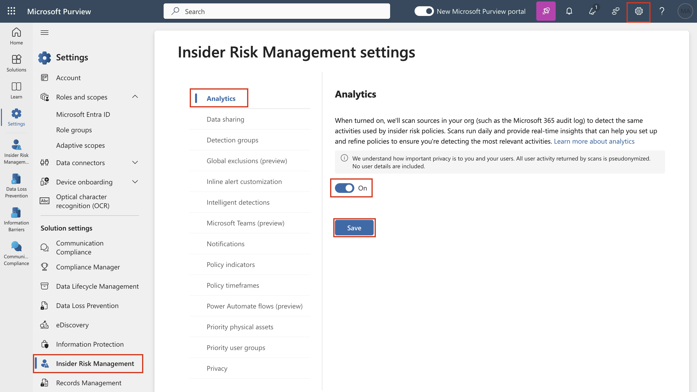

# Lab 7 – Konfigurieren des Insider-Risikomanagements

## Ziel:

In dieser Übung lernen wir, wie Sie das Insider-Risikomanagement
mithilfe der Insider-Risikomanagement-Richtlinien konfigurieren. Wir
verwenden die Typen vertraulicher Informationen, die wir in Lab 2
erstellt haben, und DLP-Richtlinien, die wir in Lab 5 erstellt haben, um
Richtlinien zu erstellen, die das Unternehmen vor riskanter
Browsernutzung oder Datendiebstahl oder -lecks schützen.

Zu diesem Zweck erstellen wir eine Infrastruktur in Azure, die die
Geräte in einer Organisation darstellt. Wir erfahren, wie Sie diese
Geräte in Azure AD und Intune integrieren und einen MDM-Agent auf ihnen
installieren, damit sie zum Abrufen von Warnungen von diesen Computern
verwendet werden können.

## Übung 1: Synchronisieren der VM-Uhr

1.  Nachdem Sie sich bei der VM angemeldet haben, wählen Sie das
    Windows-Symbol aus. Suchen Sie dann nach **Date and time**, und
    wählen Sie **Date and time settings** aus.

Ein Screenshot einer automatisch generierten Computerbeschreibung.

1.  Klicken Sie auf dem sich öffnenden Bildschirm Settings unter
    "Zusätzliche Einstellungen" auf **Sync now**.

Ein Screenshot einer automatisch generierten Computerbeschreibung

1.  Dies kümmert sich um die Synchronisierung der Uhrzeit nur für den
    Fall, dass die automatische Synchronisierung nicht funktioniert.

Ein Screenshot einer Computerbeschreibung, die automatisch mit mittlerer
Zuverlässigkeit generiert wird

## Übung 2: Erstellen von Richtlinien für das Insider-Risikomanagement.

### Voraussetzungen

#### Schritt 1 – Hinzufügen von Benutzern zur Rollengruppe "Insider-Risikomanagement"

1.  Wenn das Azure Purview-Portal geöffnet ist, fahren Sie mit Schritt 2
    fort, andernfalls öffnen Sie das `https://purview.microsoft.com,`und
    melden Sie sich mit den **Anmeldeinformationen** des
    **MOD-Administrators** an.

2.  In der Navigation wählen Sie **Settings**, und wählen Sie **Role
    groups** unter **Role Groups**, wählen Sie **Insider Risk
    Management**. Wählen Sie dann **Edit**. Wählen Sie im Seitenbereich
    erneut **Edit** aus.

3.  Wählen Sie auf der Seite **Edit Members of the role group** die
    Option **Choose Users** aus.

*Ein Screenshot einer automatisch generierten Computerbeschreibung*

4.  Aktivieren Sie das Kontrollkästchen neben **MOD Admin**, **Patti**,
    **Megan** und **Alex**. Wählen Sie dann **Select**.

5.  Wählen Sie dann **Next** aus.

*Ein Screenshot einer automatisch generierten Computerbeschreibung*

6.  Wählen Sie **Save** aus, um die Benutzer der Rollengruppe
    hinzuzufügen.

Ein Screenshot einer automatisch generierten Computerbeschreibung

7.  Wählen Sie **Done** aus, um die Schritte abzuschließen.

Ein Screenshot einer automatisch generierten Computerbeschreibung

#### Schritt 2 – Ermöglichen Sie Einblicke in die Risikoanalyse von Insidern

1.  Im Azure Purview-Portal. Navigieren Sie zu **Settings**, gehen Sie
    zu **Insider risk management**. Gehen Sie zu **Analytics**,
    aktivieren Sie das Optionsfeld und klicken Sie auf **Save**.

#### Schritt 3 – Onboarding eines Geräts

In diesem Bereitstellungsszenario integrieren Sie Geräte, die noch nicht
integriert wurden, und Sie möchten nur Insider-Risikoaktivitäten auf
Windows 10-Geräten erkennen.

Wir müssen unser Gerät/unsere VM in Microsoft Entra ID registrieren, um
eine Insider-Risikorichtlinie zu erstellen.

1.  Öffnen Sie die Windows-**Settings** auf Ihrer VM.

Ein Screenshot einer automatisch generierten Computerbeschreibung

2.  Gehen Sie zu **Accounts** \> **Access work or school**. Auf der
    **Access work or school** Seite, klicken Sie auf **Connect**.

Ein Screenshot einer automatisch generierten Computerbeschreibung

3.  Klicken Sie in der Eingabeaufforderung **Set up a work or school
    account** auf **Join this device to Microsoft Entra ID**.

4.  Melden Sie sich in der Anmeldeaufforderung mit den
    Anmeldeinformationen des **MOD-Administrators** an, die Sie auf der
    Registerkarte "Ressourcen" Ihrer Lab-Umgebung angegeben haben. 

Ein Screenshot einer automatisch generierten Computerbeschreibung

Grafische Benutzeroberfläche, Anwendung, PowerPoint Beschreibung
automatisch generiert

5.  Drücken Sie in der Eingabeaufforderung auf **Join** und **stellen
    Sie sicher, dass dies Ihre Organisation ist**.

Grafische Benutzeroberfläche, Text, Anwendung Beschreibung wird
automatisch generiert

6.  Sobald Sie fertig sind, sehen Sie ein Bestätigungsfenster**: You’re
    all set!** Klicken Sie auf **Done**.

*Ein Screenshot einer automatisch generierten Computerbeschreibung*

7.  Gehen Sie erneut zu **Accounts** \> **Access work or school**. Auf
    der **Access work or school** Seite, klicken Sie auf **Connect**.

Ein Screenshot einer automatisch generierten Computerbeschreibung

1.  Verwenden Sie in der Eingabeaufforderung **Set up a work or school
    account** die Anmeldeinformationen des MOD-Administrators, um sich
    anzumelden.

Ein Screenshot einer automatisch generierten Computerbeschreibung

9.  Wählen Sie auf der Seite **Setting up your device** die Option **Got
    it** aus.

Ein Screenshot einer automatisch generierten Computerbeschreibung

10. Gehen Sie nun zu **windows settings** \> **Accounts** \> **Access
    work or school** \> **Connected to Contoso MDM** \> **Info** \>
    **Sync**.

Ein Screenshot einer automatisch generierten Computerbeschreibung

Ein Screenshot einer automatisch generierten Computerbeschreibung

1.  Klicken Sie auf das Windows-Symbol auf Ihrer VM. Wählen Sie den
    Benutzer **Admin** aus, und wählen Sie **Sign out** aus.

Ein Screenshot einer automatisch generierten Computerbeschreibung

12. Wählen Sie auf dem Benutzerbildschirm **Other Users** aus.

Ein Screenshot einer Computerbeschreibung, die automatisch mit mittlerer
Zuverlässigkeit generiert wird

1.  Geben Sie Ihre O365-Anmeldeinformationen ein, die Sie auf der
    Startseite Ihrer Lab-Umgebung angegeben haben, und melden Sie sich
    bei der VM als **MOD-Administrator** an.

Ein Screenshot einer Computerbeschreibung, die automatisch mit mittlerer
Zuverlässigkeit generiert wird

14. Schließen Sie die Windows-Einstellungen-App. Melden Sie sich
    `mit`` Ihrem `**MOD-Administratorkonto** auf Ihrer Lab-VM bei
    https://purview.microsoft.com an.

15. Wählen Sie **Settings** \> **Device onboarding** \> **Devices** aus.

16. Klicken Sie auf **Turn on Device onboarding**.

*Ein Screenshot einer automatisch generierten Computerbeschreibung*

17. In den **Settings** \> **Device onboarding** \> **Onboarding**.
    Klicken Sie auf **Download package**.

*Ein Screenshot einer automatisch generierten Computerbeschreibung*

18. Klicken Sie mit der rechten Maustaste auf die Datei und **Extract
    all…**

Ein Screenshot einer Computerbeschreibung, die automatisch mit mittlerer
Zuverlässigkeit generiert wird

*Ein Screenshot einer automatisch generierten Computerbeschreibung*

19. Wenn Sie fertig sind, öffnen Sie den Ordner und führen Sie die Datei
    mit **Administratorrechten** aus.

*Ein Screenshot einer automatisch generierten Computerbeschreibung.*

20. Klicken Sie auf **More info**.

Grafische Benutzeroberfläche, Anwendung Beschreibung wird automatisch
generiert

21. Klicken Sie auf **Run anyway**.

*Ein Screenshot einer automatisch generierten Computerbeschreibung.*

22. Drücken Sie in der Eingabeaufforderung **Y** und drücken Sie die
    Eingabetaste, um zu bestätigen und fortzufahren, wenn Sie dazu
    aufgefordert werden.

*Ein Screenshot einer automatisch generierten Computerbeschreibung*

23. Sie erhalten eine Meldung, dass das Gerät integriert ist. Sobald Sie
    die Meldung in der Eingabeaufforderung erhalten haben, **Press any
    key to continue...**, drücken Sie eine beliebige Taste.

24. Sobald die Eingabeaufforderung geschlossen ist, öffnen Sie die
    Eingabeaufforderung im Administratormodus, um einen Erkennungstest
    durchzuführen, und kopieren Sie an der Eingabeaufforderung den
    folgenden Befehl, und führen Sie ihn aus. Das
    Eingabeaufforderungsfenster wird automatisch geschlossen.

`powershell.exe -NoExit -ExecutionPolicy Bypass -WindowStyle Hidden $ErrorActionPreference= 'silentlycontinue';(New-ObjectSystem.Net.WebClient).DownloadFile('http://127.0.0.1/1.exe','C:\test-WDATP-test\invoice.exe');Start-Process 'C:\test-WDATP-test\invoice.exe'`

Text Beschreibung wird automatisch generiert

25. Öffnen Sie die **Settings**, indem Sie in der Navigation auf die
    Einstellungen klicken und **Devices Onboarding** \> **Devices**
    auswählen.

**Anmerkung:** Während es in der Regel etwa 60 Sekunden dauert, bis das
Geräte-Onboarding aktiviert ist, kann es bis zu 30 Minuten dauern.

26. Sie können die  **Devices** List überprüfen. Die Liste ist leer, bis
    Sie Geräte integriert haben. Sobald Sie fertig sind, können Sie Ihre
    VMs als integriertes Gerät anzeigen.

### Aufgabe 1: Erstellen einer unternehmensweiten Richtlinie zur Erkennung und Bewertung riskanter Browsernutzung

#### Schritt 1 – Erstellen einer neuen Richtlinie

1.  Wenn Sie das Browserfenster in der vorherigen Aufgabe geschlossen
    haben, öffnen Sie das `https://purview.microsoft.com` und melden Sie
    sich mit den Administratoranmeldeinformationen an.

2.  Wechseln Sie zu **Insider Risk Management,** und wählen Sie die
    Registerkarte **Policies** aus. Wählen Sie **Create Policy** aus, um
    den Richtlinien-Assistenten zu öffnen.

1.  Wählen Sie auf der Seite **Choose a policy template** unter **Risky
    browser usage (preview)** die Option **Risky browser usage
    (preview)** aus.

*Ein Screenshot einer automatisch generierten Computerbeschreibung*

4.  Stellen Sie sicher, dass alle Voraussetzungen erfüllt sind.

Ein Screenshot einer automatisch generierten Computerbeschreibung

5.  Wählen Sie **Next** aus, um fortzufahren.

*Ein Screenshot einer automatisch generierten Computerbeschreibung*

6.  Füllen Sie auf der Seite **Name and description** die folgenden
    Felder aus:

    - Name (required): `Risky usage of browser`

    - Description
      (optional): `This is a test policy for the risky browser usage.`

7.  Wählen Sie **Next** aus, um fortzufahren.

Grafische Benutzeroberfläche, Text, Anwendung Beschreibung wird
automatisch generiert

8.  Wählen Sie auf der Seite **Choose users, groups, & adaptive
    scopes **die Option **All users, groups, & adaptive scopes** aus.
    Wählen Sie **Next** aus, um fortzufahren.

9.  Wählen Sie auf der Seite **Exclude users and groups** die Option
    **Next** aus.

10. Wählen Sie auf der Seite **Decide whether to prioritize** die Option
    Ich **I don’t want to specify priority content right now** aus (Sie
    können dies tun, nachdem die Richtlinie erstellt wurde). Wählen
    Sie **Next** um fortzufahren.

Grafische Benutzeroberfläche, Text, Anwendung Beschreibung wird
automatisch generiert

11. Wählen Sie auf der Seite **Triggers for this policy** die Option **I
    Turn on indicators** aus.

*Ein Screenshot einer automatisch generierten Computerbeschreibung*

12. Wählen Sie unter **Choose indicators to turn on** unter **Select
    all Under Risky Browsing Indicators (Preview)** aus, und
    deaktivieren Sie die restlichen Kontrollkästchen.

Ein Screenshot eines Computers Beschreibung wird automatisch generiert

13. Scrollen Sie nach unten und wählen Sie **Save**.

14. Unter **Triggers for this policy** unter **Select which activities
    will trigger this policy**. Wählen Sie alle Optionen aus und klicken
    Sie auf **Next**.

Grafische Benutzeroberfläche, Text, Anwendung Beschreibung wird
automatisch generiert

15. Wählen Sie auf der Seite **Select which Activities will Trigger this
    Policy** die Option **Use Custom Thresholds (Recommended)** aus,
    ändern Sie alle Schwellenwerte in 1 pro Tag, und wählen Sie dann
    **Next** aus.

Grafische Benutzeroberfläche, Anwendung Beschreibung wird automatisch
generiert

*Ein Screenshot einer automatisch generierten Computerbeschreibung*

16. Wählen Sie auf der Seite **Indicators** die Option **Next** aus.

*Ein Screenshot einer automatisch generierten Computerbeschreibung*

17. Wählen Sie unter **Decide whether to use default or custom indicator
    thresholds** die Option **Use default thresholds for all
    indicators** aus, und wählen Sie dann **Next** aus.

Grafische Benutzeroberfläche, Text, Anwendung Beschreibung wird
automatisch generiert

18. Wählen Sie unter **Review Settings and Finish**, wählen
    sie **Submit** aus.

Grafische Benutzeroberfläche, Text, Anwendung Beschreibung wird
automatisch generiert

19. Wählen Sie unter **Your policy was created**, wählen sie **Done**
    aus.

*Ein Screenshot einer automatisch generierten Computerbeschreibung*

20. Lassen Sie die Registerkarte geöffnet und fahren Sie mit der
    nächsten Aufgabe fort.

#### Schritt 2 – Bewertung der Richtlinie

1.  Klicken Sie auf die neue Richtlinie mit dem Namen **Risky usage of
    browser**. Wählen Sie **Start scoring activity for users** aus.

*Ein Screenshot einer automatisch generierten Computerbeschreibung*

2.  Geben Sie im Feld **Reason** im Bereich **Add users to multiple
    policies** den Namen **Testing the policy** ein.

*Ein Screenshot einer automatisch generierten Computerbeschreibung*

3.  Wählen Sie im Feld **This should last for (choose between 5 and 30
    days)** die Option **10** Tage aus.

4.  Verwenden Sie das Feld **Search user to add to policies**. **MOD
    Admin** hinzufügen. Klicken Sie dann auf **Start scoring activity**.

5.  Sobald Sie die Bestätigung erhalten haben, dass Sie mit der
    **Scoring activity for 1 users**, klicken Sie auf **Close**.

Ein Screenshot eines Computerbildschirmbeschreibung, die automatisch mit
mittlerer Zuverlässigkeit generiert wird

### Aufgabe 2: Datendiebstahl durch ausscheidende Benutzer

#### Schritt 1 – Erstellen einer neuen Richtlinie

1.  Wenn Sie das Browserfenster in der vorherigen Aufgabe geschlossen
    haben, öffnen Sie das `https://purview.microsoft.com` und melden Sie
    sich mit den Administratoranmeldeinformationen an.

2.  Gehen Sie zu **Insider Risk Management** und wählen Sie die
    Registerkarte **Policies**. Wählen Sie **Create policy** aus, um den
    Richtlinien-Assistenten zu öffnen.

3.  Wählen Sie auf der Seite Richtlinienvorlage auswählen unter Data
    theft die Option Data theft by departing users aus. Wählen Sie Next
    aus, um fortzufahren.

*Ein Screenshot einer automatisch generierten Computerbeschreibung*

4.  Füllen Sie auf der Seite **Name and description** die folgenden
    Felder aus:

    - Name (required): `Data theft by a user`

    - Description
      (optional): `This is a test policy for the preventing data theft.`

5.  Wählen Sie **Next** aus, um fortzufahren.

6.  *Ein Screenshot einer automatisch generierten Computerbeschreibung*

7.  Wählen Sie auf der Seite **Choose users, groups, & adaptive
    scopes** die Option **All users, groups, & adaptive scopes** aus.
    Wählen Sie **Next** aus, um fortzufahren.

8.  Wählen Sie auf der Seite **Exclude users, groups, & adaptive
    scopes** die Option **Next** aus.

&nbsp;

1.  Wählen Sie auf der Seite **Decide whether to prioritize** soll die
    Option **I want to specify priority content** aus. Aktivieren Sie
    das Kontrollkästchen für **Sensitivity labels** und **Sensitive info
    types**. Wählen Sie **Next** aus, um fortzufahren.

Ein Screenshot einer Computerbildschirmbeschreibung, die automatisch mit
mittlerer Zuverlässigkeit generiert wird

9.  Wählen Sie auf der Seite **Sensitivity labels to prioritize** die
    Option **Vertraulichkeitsbezeichnungen hinzufügen oder bearbeiten**
    aus. Wählen Sie im Flyoutbereich **Internal/Employee data (HR)** und
    dann **Add** aus. Klicken Sie dann auf **Next**.

Ein Screenshot einer Computerbildschirmbeschreibung, die automatisch mit
mittlerer Zuverlässigkeit generiert wird

10. Wählen Sie auf der **Seite Zu priorisierende vertrauliche Infotypen
    die Option** Typen vertraulicher Informationen hinzufügen oder
    bearbeiten **aus**. Suchen Sie im Flyoutbereich nach On the flyout
    pane, search for and select **Credit Card Number**, **Contoso
    Employee ID** and **Contoso Employee EDM** aus. Wählen Sie **Add**
    aus. Klicken Sie dann auf **Next**.

*Ein Screenshot einer automatisch generierten Computerbeschreibung*

11. Wählen Sie unter **Decide whether to score only activity with
    priority content** die Option **Get alerts for all activity** aus.
    Wählen sie **Next** aus.

Ein Screenshot einer Computerbildschirmbeschreibung, die automatisch mit
mittlerer Zuverlässigkeit generiert wird

12. Wählen Sie bei Triggern für diese Richtlinienseite die
    Standardeinstellung aus, und klicken Sie dann auf **Next**.

Ein Screenshot einer Computerbeschreibung, die automatisch mit mittlerer
Zuverlässigkeit generiert wird

13. Wählen Sie auf der Seite **Indicators** in der Eingabeaufforderung
    **Turn on Indicators** aus.

Ein Screenshot einer Computerbeschreibung, die automatisch mit mittlerer
Zuverlässigkeit generiert wird

14. Wählen Sie **Select all under Office Indicators** aus, und klicken
    Sie auf **Save**.

Ein Screenshot einer Computerbildschirmbeschreibung, die automatisch mit
mittlerer Zuverlässigkeit generiert wird

15. Wählen Sie alle Optionen aus und klicken Sie auf **Next**.

*Ein Screenshot einer automatisch generierten Computerbeschreibung*

16. Wählen Sie auf der Seite **Detection options** die
    Standardeinstellung aus, und klicken Sie dann auf **Next**.

*Ein Screenshot einer automatisch generierten Computerbeschreibung*

17. Wählen Sie auf der Seite **Indicators** die Option **Next** aus.

*Ein Screenshot einer automatisch generierten Computerbeschreibung*

18. Wählen Sie unter **Decide whether to use default or custom indicator
    thresholds, Customise thresholds** anpassen aus**, 1**, **2** bzw.
    **3** Ereignisse für jede Phase verwenden und dann **Next** aus.

*Ein Screenshot einer automatisch generierten Computerbeschreibung*

19. Wählen Sie unter **Review settings and finish**, die Option
    **Submit** aus.

*Ein Screenshot einer automatisch generierten Computerbeschreibung*

20. Wählen Sie unter **Your policy was created** die Option **Done**
    aus.

*Ein Screenshot einer automatisch generierten Computerbeschreibung*

21. Lassen Sie die Registerkarte geöffnet und fahren Sie mit der
    nächsten Aufgabe fort.

#### Schritt 2 – Bewertung der Richtlinie

1.  Klicken Sie auf die neue Richtlinie mit dem Namen **Data theft by a
    user**. Wählen Sie **Start scoring activity for users** aus.

*Ein Screenshot einer automatisch generierten Computerbeschreibung*

1.  Geben Sie im Bereich **Reason field in the Add users to multiple
    policies** den Namen **Testing the policy** ein.

*Ein Screenshot einer automatisch generierten Computerbeschreibung*

3.  Wählen Sie im Feld **This should last for (choose between 5 and 30
    days)** die Option **10** Tage aus.

4.  Verwenden Sie das Feld **Search user to add to policies**. Fügen Sie
    **den MOD-Administrator** hinzu. Klicken Sie dann auf **Aktivität
    bewerten starten**.

5.  Sobald Sie die Bestätigung erhalten haben, dass Sie mit der
    **Scoring activity for 1 users**, klicken Sie auf **Close**.

### *Ein Screenshot einer automatisch generierten Computerbeschreibung.* 

### Aufgabe 3: Datenlecks durch Benutzer

#### Schritt 1 – Erstellen einer neuen Richtlinie

1.  Wenn Sie das Browserfenster in der vorherigen Aufgabe geschlossen
    haben, öffnen Sie das `https://purview.microsoft.com` und melden Sie
    sich mit den Anmeldeinformationen des Administrators an.

2.  Gehen Sie zu **Insider Risk Management** und wählen Sie die
    Registerkarte Polcies. Wählen Sie **Create policy** aus, um den
    Richtlinien-Assistenten zu öffnen.

*Ein Screenshot einer automatisch generierten Computerbeschreibung.*

3.  Wählen Sie auf der Seite **Choose a policy template** unter **Data
    leaks** die Option **Data leaks** aus. Wählen Sie **Next** aus, um
    fortzufahren.

*Ein Screenshot einer automatisch generierten Computerbeschreibung.*

4.  Füllen Sie auf der Seite **Name and description** die folgenden
    Felder aus:

    - Name (required): `Data leaks by a user`

    - Description
      (optional): `This is a test policy for preventing data leaks.`

5.  Wählen Sie **Next** aus, um fortzufahren.

*Ein Screenshot einer automatisch generierten Computerbeschreibung.*

6.  Wählen Sie auf der Seite **Choose users and groups** die Option
    **Include all users and groups** aus. Wählen Sie **Next** aus, um
    fortzufahren.

*Ein Screenshot einer automatisch generierten Computerbeschreibung.*

7.  Wählen Sie auf der Seite **Exclude users and groups** die Option
    **Next** aus.

&nbsp;

1.  Wählen Sie auf der Seite **Decide whether to prioritize** soll die
    Option **I want to specify priority content** aus. Aktivieren Sie
    das Kontrollkästchen für **SharePoint sites**, **Sensitivity
    labels** und **Sensitive info types**. Wählen Sie **Next** aus, um
    fortzufahren.

Ein Screenshot einer Computerbeschreibung, die automatisch mit mittlerer
Zuverlässigkeit generiert wird

1.  Wählen Sie auf der Seite **SharePoint sites to prioritize** die
    Option **Add or edit SharePoint sites** aus. Wählen Sie im
    Flyoutbereich
    `https://{TENANTPREFIX}.sharepoint.com/sites/ContosoWeb1` und dann
    **Add** aus. Klicken Sie dann auf **Next**.

&nbsp;

9.  Wählen Sie auf der Seite **Sensitivity labels to prioritize** die
    Option **Add or edit sensitivity labels** aus. Wählen Sie im
    Flyoutbereich **Internal/Employee data (HR)** und dann **Add** aus.
    Klicken Sie dann auf **Next**.

Ein Screenshot einer Computerbildschirmbeschreibung, die automatisch mit
mittlerer Zuverlässigkeit generiert wird

11. Wählen Sie auf der Seite **Sensitive info types to prioritize** die
    Option **Add or edit sensitive info types** aus. Suchen Sie im
    Flyoutbereich nach **Credit Card Number**, **Contoso Employee ID**
    und **Contoso Employee EDM,** und wählen Sie diese Option
    aus. Wählen Sie **Add** aus. Klicken Sie dann auf **Next**

*Ein Screenshot einer automatisch generierten Computerbeschreibung*

12. Wählen Sie unter **Decide whether to score only activity with
    priority content** die Option **Get alerts for all activity** aus.
    Wählen Sie **Next** aus.

Ein Screenshot einer Computerbildschirmbeschreibung, die automatisch mit
mittlerer Zuverlässigkeit generiert wird

13. Wählen Sie auf der Seite **Get alerts for all activity** das
    Optionsfeld in der Nähe von **User performs an exfiltration
    activity** aus. Wählen Sie unter Auswählen, welche Aktivitäten diese
    Richtlinie auslösen sollen, alle verfügbaren Optionen aus,
    insbesondere **Download content from SharePoint**. Wählen Sie dann
    **Next** aus.

*Ein Screenshot einer automatisch generierten Computerbeschreibung*

14. Wählen Sie unter **Triggering thresholds for this policy** die
    Option **Use custom thresholds** aus. Legen Sie jeden Schwellenwert
    auf **1** fest, und wählen Sie **Next** aus.

Ein Screenshot einer Computerbeschreibung, die automatisch mit mittlerer
Zuverlässigkeit generiert wird

15. Wählen Sie die Standardeinstellungen auf der Seite **Indicators**
    aus, und wählen Sie **Next** aus.

16. Wählen Sie unter **Decide whether to use default or custom indicator
    thresholds**, **Customise thresholds** anpassen aus, **1**, **2**
    bzw. **3** Ereignisse für jede Phase verwenden und dann **Next**
    aus.

Ein Screenshot einer Computerbeschreibung, die automatisch mit mittlerer
Zuverlässigkeit generiert wird

17. Wählen Sie unter **Review settings and finish** die Option
    **Submit** aus.

Ein Screenshot einer Computerbeschreibung, die automatisch mit mittlerer
Zuverlässigkeit generiert wird

18. Wählen Sie unter **Your policy was created** Option **Done** aus.

*Ein Screenshot einer automatisch generierten Computerbeschreibung*

19. Lassen Sie die Registerkarte geöffnet und fahren Sie mit der
    nächsten Aufgabe fort.

#### Schritt 2 – Bewertung der Richtlinie

1.  Klicken Sie auf die neue Richtlinie mit dem Namen **Data leaks by a
    user**. Wählen Sie **Start scoring activity for users** aus.

Ein Screenshot einer Computerbeschreibung, die automatisch mit mittlerer
Zuverlässigkeit generiert wird

2.  Geben Sie im **Reason field in the Add users to multiple policies**
    den Namen Richtlinie testen ein. Wählen Sie im Feld **This should
    last for (choose between 5 and 30 days)** die Option **10** Tage
    Aus. Verwenden Sie das **Feld** **Search user to add to
    policies**. **MOD Admin hinzufügen**. Klicken Sie dann auf **Start
    scoring activity**.

&nbsp;

1.  Sobald Sie die Bestätigung erhalten haben, dass Sie die **Scoring
    activity for 1 user** gestartet haben, klicken Sie auf **Close**.

Sie haben erfolgreich die Richtlinien für das Insider-Risikomanagement
erstellt.

## Zusammenfassung:

In diesem Lab haben wir uns mit der Einrichtung des
Insider-Risikomanagements von Anfang bis Ende befasst. Mit Ihrem eigenen
Abonnement und Ihren eigenen Lizenzen können Sie diesen Lab-Leitfaden
auch verwenden, um ein Azure-Setup zu erstellen, das auch zum Erstellen
verschiedener Warnungen (einschließlich des Sendens von E-Mails mit
eingeschränkten Daten, was bei einem Testabonnement nicht möglich ist)
für die Insider-Risikomanagementrichtlinien verwendet werden kann, mit
denen Sie das Feature "Adaptiver Schutz" in Purview erkunden können.
