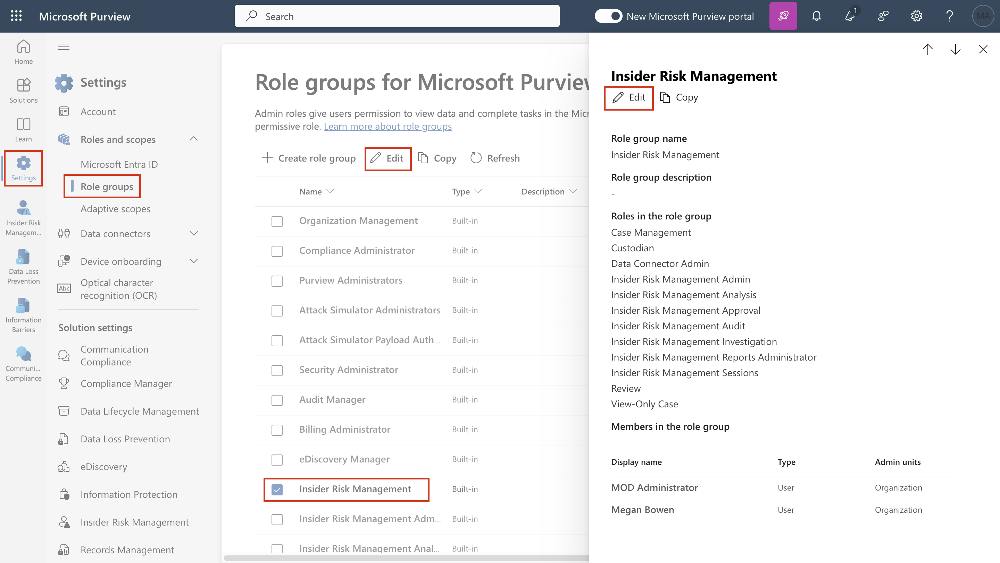
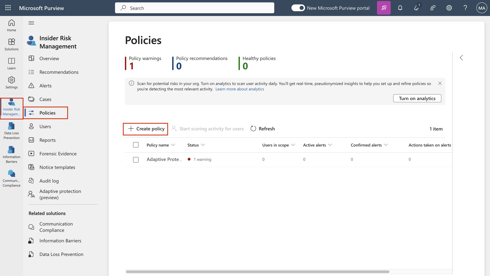

# Laboratório 7 – Configurando o Insider Risk Management

## Objetivo:

Neste laboratório, aprenderemos como configurar o Insider Risk
Management usando as Políticas de Insider Risk Management. Usaremos os
Tipos de Informações Confidenciais que criamos no Laboratório 2 e as
políticas de DLP que criamos no Laboratório 5 para criar políticas que
protegerão a organização contra o uso arriscado do navegador ou qualquer
roubo ou vazamento de dados.

Para fazer isso, criaremos uma infraestrutura no Azure que representará
os dispositivos em uma organização. Aprenderemos como integrar esses
dispositivos no Azure AD e no Intune e instalar um agente MDM neles,
para que eles possam ser usados para obter os alertas dessas máquinas.

## Exercício 1: Sincronizar o relógio da VM

1.  Depois de fazer login na VM, selecione o ícone do Windows. Em
    seguida, procure por **Date and time**, e selecione **Date and time
    settings**.

Uma captura de tela de uma descrição de computador gerada
automaticamente

2.  Na tela Settings que se abre, clique em **Sync now** em Additional
    settings.

Uma captura de tela de uma descrição de computador gerada
automaticamente

3.  Isso sincroniza a hora caso a sincronização automática não
    funcionar.

Uma captura de tela de uma descrição de computador gerada
automaticamente com confiança média

## Exercício 2: Criar políticas de Insider Risk Management.

### Pré-requisitos

#### Etapa 1 - Adicionar usuários ao grupo de Insider risk management

> 1\. Se o portal Microsoft Purview estiver aberto, vá para a etapa 2;
> caso contrário, abra o portal  `https://purview.microsoft.com` e faça
> login com as credenciais de **MOD Administrator**.

2.  Na navegação, selecione **Settings** e grupos de funções. Em **Role
    groups**, selecione **Insider Risk Management**. Em seguida,
    selecione **Edit**. No painel lateral, selecione novamente **Edit**

3.  Na página **Edit Members of the role group**, selecione **Choose
    users**.

Uma captura de tela de uma descrição de computador gerada
automaticamente

4.  Marque a Caixa de seleção próxima a **MOD Admin**,
    **Patti**, **Megan** e **Alex**. Em seguida, selecione **Select**.

5.  Em seguida, selecione **Next**.

Uma captura de tela de uma descrição de computador gerada
automaticamente

6.  Selecione **Save** para adicionar os usuários ao grupo de funções.

Uma captura de tela de uma descrição de computador gerada
automaticamente

7.  Selecione **Done** para concluir as etapas.

Uma captura de tela de uma descrição de computador gerada
automaticamente

#### Etapa 2 - Habilitar insights de análise de risco interno

1.  No portal Microsoft Purview. Navegue até **Settings**, vá para o
    **Insider risk management**. Vá para **Analytics**, ative o botão de
    opção e clique em **Save**.

#### Etapa 3 - Integração de um dispositivo

Nesse cenário de implementação, você integrará dispositivos que ainda
não foram integrados e deseja apenas detectar atividades de risco
internas em dispositivos Windows 10.

Precisamos registrar nosso dispositivo/VM no Microsoft Entra ID como um
pré-requisito para criar qualquer política de risco interno.

1.  Abra o Windows **Setting** em sua VM.

Uma captura de tela de uma descrição de computador gerada
automaticamente

2.  Vá para **Accounts** \> **Access work or school**. Na
    página **Access work or school**, clique em **Connect**.

Uma captura de tela de uma descrição de computador gerada
automaticamente

3.  No prompt **Set up a work or school account**, clique em **Join this
    device to Microsoft Entra ID**.

4.  No prompt de login, faça login com as credenciais de **MOD
    Administrator** fornecidas na guia de recursos do seu ambiente de
    laboratório. 

Uma captura de tela de uma descrição de computador gerada
automaticamente

Interface gráfica do usuário, aplicativo, Descrição do PowerPoint gerada
automaticamente

5.  Pressione **Join** no prompt **Make sure this is your
    organisation**.

Interface gráfica do usuário, texto e descrição do aplicativo gerada
automaticamente

6.  Depois de concluído, você verá uma janela de confirmação **You’re
    all set!** Clique em **Done**.

Uma captura de tela de uma descrição de computador gerada
automaticamente

7.  Vá novamente para **Accounts** \> **Access work or school**. Na
    página **Access work or school**, clique em **Connect**.

Uma captura de tela de uma descrição de computador gerada
automaticamente

8.  No prompt **Set up a work or school account**, use as credenciais de
    MOD admin credentials para fazer login.

Uma captura de tela de uma descrição de computador gerada
automaticamente

9.  Na página **Setting up your device**, selecione **Got it**.

Uma captura de tela de uma descrição de computador gerada
automaticamente

10. Agora, vá para **windows settings** \> **Accounts** \> **Access work
    or school** \> **Connected to Contoso MDM** \> **Info** \> **Sync**.

Uma captura de tela de uma descrição de computador gerada
automaticamente

Uma captura de tela de uma descrição de computador gerada
automaticamente

11. Clique no símbolo do Windows em sua VM. Selecione o
    usuário **Admin** e selecione **Sign out**.

Uma captura de tela de uma descrição de computador gerada
automaticamente

12. Na tela do usuário, selecione **Other user**.

Uma captura de tela de uma descrição de computador gerada
automaticamente com confiança média

13. Digite suas credenciais do O365 fornecidas na página inicial do seu
    ambiente de laboratório e faça login na VM como **MOD
    Administrator**.

Uma captura de tela de uma descrição de computador gerada
automaticamente com confiança média

14. Feche o aplicativo de configurações do Windows. Faça login em
    `https://purview.microsoft.com` usando sua conta de **MOD
    Administrator** em sua VM de laboratório.

15. Selecione **Settings** \> **Device onboarding** \> **Devices**.

16. Clique em **Turn on Device onboarding**.

Uma captura de tela de uma descrição de computador gerada
automaticamente

17. Em **Settings** \> **Device onboarding** \> **Onboarding**. Clique
    em **Download package**.

Uma captura de tela de uma descrição de computador gerada
automaticamente

18. Clique com o botão direito do mouse no arquivo e **Extract all…** .

Uma captura de tela de uma descrição de computador gerada
automaticamente com confiança média

Uma captura de tela de uma descrição de computador gerada
automaticamente

19. Quando terminar, abra a pasta e execute o arquivo com direitos de
    **Administrator.**

Uma tela de computador com uma descrição de tela de computador gerada
automaticamente

20. Clique em **More info**.

Interface gráfica do usuário, descrição do aplicativo gerada
automaticamente

21. Clique em **Run anyway**.

Uma captura de tela de um erro de computador Gerada automaticamente

22. No prompt de comando, pressione **Y** e pressione Enter para
    confirmar e continuar quando solicitado.

Interface gráfica do usuário, texto e descrição do aplicativo gerada
automaticamente

23. Você receberá uma mensagem informando que o dispositivo está
    integrado. No prompt de comando, assim que você receber a
    mensagem, **Press any key to continue …**, pressione qualquer tecla.

24. Quando o prompt de comando estiver fechado, abra o prompt de comando
    no administrator mode para executar um teste de detecção e, no
    prompt, copie e execute o comando abaixo. A janela do prompt de
    comando será fechada automaticamente.

`powershell.exe -NoExit -ExecutionPolicy Bypass -WindowStyle Hidden $ErrorActionPreference= 'silentlycontinue';(New-ObjectSystem.Net.WebClient).DownloadFile('http://127.0.0.1/1.exe','C:\test-WDATP-test\invoice.exe');Start-Process 'C:\test-WDATP-test\invoice.exe'`

Descrição do texto gerada automaticamente

25. Abra as **settings** clicando nas configurações na navegação e
    escolha **Devices Onboarding** \> **Devices**.

**Observação:** Embora normalmente demore cerca de 60 segundos para que
a integração do dispositivo seja ativada, aguarde até 30 minutos.

26. Você poderá verificar a lista de **Devices**. A lista estará vazia
    até que você integre os dispositivos. Quando isso for feito, você
    poderá ver suas VMs listadas como o dispositivo integrado.

### Tarefa 1: Criação de uma política em toda a organização para detectar e classificar o uso arriscado do navegador

#### Etapa 1 - Criar uma nova política

1.  e você fechou a janela do navegador na tarefa anterior, abra o
    site `https://purview.microsoft.com` e faça login com as credenciais
    de administrador.

2.  Vá para **Insider Risk Management** e selecione a guia **Policies**.
    Selecione **Create policy** para abrir o assistente de políticas.

3.  Na página **Choose a policy template**, selecione **Risky browser
    usage (preview)**, em **Risky browser usage (preview)**.

Uma captura de tela de uma descrição de computador gerada
automaticamente

4.  Certifique-se de que todos os pré-requisitos sejam atendidos.

Uma captura de tela de uma descrição de computador gerada
automaticamente

5.  Selecione **Next** para continuar.

Uma captura de tela de uma descrição de computador gerada
automaticamente

6.  Na página **Name and description**, preencha os seguintes campos:

    - Name (required): `Risky usage of browser`

    - Description
      (optional): `This is a test policy for the risky browser usage.`

7.  Selecione **Next** para continuar.

Interface gráfica do usuário, texto e descrição do aplicativo gerada
automaticamente

8.  Na página **Choose users, groups, & adaptive scopes**,
    selecione **All users, groups, & adaptive scopes**.
    Selecione **Next** para continuar.

9.  Na página **Exclude users and groups**, selecione **Next**.

10. Na página **Decide whether to prioritize**, selecione **I don’t want
    to specify priority content right now** (você poderá fazer isso
    depois que a política for criada). Selecione **Next** para
    continuar.

Interface gráfica do usuário, texto e descrição do aplicativo gerada
automaticamente

11. Na página **Triggers for this policy**, selecione **Turn on
    indicators**.

Uma captura de tela de uma descrição de computador gerada
automaticamente

12. Em **Choose indicators to turn on**, selecione **Select
    all under Risky browsing indicators (preview)**, e desmarque as
    demais caixas.

Uma captura de tela de uma descrição de computador gerada
automaticamente

13. Role até o final e selecione **Save**.

14. Em **Triggers for this policy**, na seção **Select which activities
    will trigger this policy**. Selecione todas as opções e clique
    em **Next**.

Interface gráfica do usuário, texto, descrição do aplicativo gerada
automaticamente

15. Na página **Triggering thresholds for this policy**, selecione **Use
    custom thresholds (Recommended)**, altere todos os limites para
    **1** por dia e, em seguida, selecione **Next**.

Interface gráfica do usuário, texto e descrição do aplicativo gerada
automaticamente

Uma captura de tela de uma descrição de computador gerada
automaticamente

16. Na página **indicators**, selecione **Next**.

Uma captura de tela de uma descrição de computador gerada
automaticamente

17. Em **Decide whether to use default or custom indicator thresholds**,
    selecione **Use default thresholds for all indicators** e, em
    seguida, selecione **Next**.

Interface gráfica do usuário, texto e descrição do aplicativo gerada
automaticamente

18. Em **Review settings and finish**, selecione **Submit**.

Interface gráfica do usuário, texto e descrição do aplicativo gerada
automaticamente

19. Em **Your policy was created**, selecione **Done**.

Uma captura de tela de uma descrição de computador gerada
automaticamente

20. Mantenha a guia aberta e prossiga para a próxima tarefa.

#### Etapa 2 - Pontuação da política

1.  Clique na nova política denominada **Risky usage of browser**.
    Selecione **Start scoring activity for users**.

Uma captura de tela de uma descrição de computador gerada
automaticamente

2.  No campo **Reason**, no painel **Add users to multiple policies**,
    digite **Testing the policy**.

Uma captura de tela de uma descrição de computador gerada
automaticamente

3.  No campo **This should last for (choose between 5 and 30 days)** ,
    selecione **10** dias.

4.  Use o campo **Search user to add to policies**. Adicione o **MOD
    Admin**. Em seguida, clique em **Start scoring activity**.

5.  Depois de receber a confirmação de que iniciou a atividade **Scoring
    activity for 1 users**, clique em **Close**.

Uma captura de tela de um computador. Descrição gerada automaticamente
com confiança média

### Tarefa 2: Roubo de dados por usuários que estão se desligando

#### Etapa 1 - Criar uma nova política

1.  Se você fechou a janela do navegador na tarefa anterior, abra o site
    the `https://purview.microsoft.com` e faça login com as credenciais
    de administrado.

2.  Vá para **Insider Risk Management** e selecione a guia **Policies**.
    Selecione **Create policy** para abrir o assistente de políticas.

3.  Na página Choose a policy template, escolha Data theft by departing
    users, em Data theft. Selecione Next para continuar.

Uma captura de tela de uma descrição de computador gerada
automaticamente

4.  Na página **Name and description**, preencha os seguintes campos:

    - Name (required): `Data theft by a user`

    - Description
      (optional): `This is a test policy for the preventing data theft.`

5.  Selecione **Next** para continuar.

Uma captura de tela de uma descrição de computador gerada
automaticamente

6.  Na página **Choose users, groups, & adaptive scopes**, selecione
    **All users, groups, & adaptive scopes**. Selecione **Next** para
    continuar.

7.  Na página **Exclude users, groups, & adaptive scopes**, selecione
    **Next**.

8.  Na página **Decide whether to prioritize**, selecione **I want to
    specify priority content**. Marque a caixa de seleção de
    **Sensitivity labels** e **Sensitive info types**.
    Selecione **Next** para continuar.

Uma captura de tela de um computado. Descrição gerada automaticamente
com confiança média

9.  Na página **Sensitivity labels to prioritize**, selecione **Add or
    edit sensitivity labels**. No painel suspenso,
    selecione **Internal/Employee data (HR)** e selecione **Add**. Em
    seguida, clique em **Next**.

Uma captura de tela de um computador. Descrição gerada automaticamente
com confiança média

10. Na página **Sensitivity labels to prioritize**, selecione **Add or
    edit sensitivity labels**. No painel suspenso, procure e selecione
    **Credit Card Number**, **Contoso Employee ID** e **Contoso Employee
    EDM**. Selecione **Add**. Em seguida, clique em **Next**.

Uma captura de tela de uma descrição de computador gerada
automaticamente

11. Em **Decide whether to score only activity with priority content**,
    selecione **Get alerts for all activity**. Selecione **Next**.

Uma captura de tela de um computador. Descrição gerada automaticamente
com confiança média

12. Na página de acionadores para esta política, selecione o padrão e,
    em seguida, selecione Next.

Uma captura de tela de um computador. Descrição gerada automaticamente
com confiança média

13. Na página **Indicators**, selecione **Turn on indicators** no
    prompt.

Uma captura de tela de um computador. Descrição gerada automaticamente
com confiança média

14. Selecione **Select all under Office indicators** e clique
    em **Save**.

Uma captura de tela de um computador. Descrição gerada automaticamente
com confiança média

15. Selecione todas as opções e clique em **Next**.

Uma captura de tela de uma descrição de computador gerada
automaticamente

16. Na página **Detection options**, selecione o padrão e, em seguida,
    selecione **Next**.

Uma captura de tela de uma descrição de computador gerada
automaticamente

17. Na página **indicators**, selecione **Next**.

Uma captura de tela de uma descrição de computador gerada
automaticamente

18. On **Decide whether to use default or custom indicator thresholds**,
    selecione **Customise thresholds**, use **1**, **2**, e **3**
    eventos para cada etapa, respectivamente, e selecione Next.

Uma captura de tela de um computador. Descrição gerada automaticamente

19. Em **Review settings and finish**, selecione **Submit**.

Uma captura de tela de uma descrição de computador gerada
automaticamente

20. Em **Your policy was created**, selecione **Done**.

Uma captura de tela de uma descrição de computador gerada
automaticamente

21. Mantenha a guia aberta e prossiga para a próxima tarefa.

#### Etapa 2 - Pontuação da política

1.  Clique na nova política denominada **Data theft by a user**.
    Selecione **Start scoring activity for users**.

Uma captura de tela de uma descrição de computador gerada
automaticamente

2.  No painel **Reason for scoring activity**, digite **Testing the
    policy**.

Uma captura de tela de uma descrição de computador gerada
automaticamente

3.  No campo **This should last for (choose between 5 and 30 days)**,
    selecione **10** dias.

4.  Use o campo **Search user to add to policies**. Adicione o **MOD
    Admin**. Em seguida, clique em **Start scoring activity**.

5.  Depois de receber a confirmação de que iniciou a **Scoring activity
    for 1 users**, clique em **Close**.

Uma captura de tela de uma descrição de computador gerada
automaticamente

### Tarefa 3: Vazamento de dados pelos usuários

#### Etapa 1 - Criar uma nova política

1.  Se você fechou a janela do navegador na tarefa anterior, abra a
    Janela do site `https://purview.microsoft.com` e faça login com as
    credenciais de administrador.

2.  Vá para **Insider Risk Management** e selecione a guia **Policies**.
    Selecione **Create policy** para abrir o assistente de políticas.

Uma captura de tela de uma descrição de computador gerada
automaticamente

3.  Na página **Choose a policy template**, selecione **Data leaks**, em
    **Data leaks**. Selecione **Next** para continuar.

Uma captura de tela de uma descrição de computador gerada
automaticamente

4.  Na página **Name and description**, preencha os seguintes campos:

    - Name (required): `Data leaks by a user`

    - Description
      (optional): `This is a test policy for preventing data leaks.`

5.  Selecione **Next** para continuar.

Uma captura de tela de uma descrição de computador gerada
automaticamente

6.  Na página **Choose users and groups**, selecione **Include all users
    and groups**. Selecione **Next** para continuar.

Uma captura de tela de uma descrição de computador gerada
automaticamente

7.  Na página **Exclude users and groups**, selecione **Next**.

8.  Na página **Decide whether to prioritize**, selecione **I want to
    specify priority content**. Marque a caixa de seleção para sites do
    **SharePoint sites**, **Sensitivity labels** e **Sensitive info
    types**. Selecione **Next** para continuar.

Uma captura de tela de uma descrição de computador gerada
automaticamente com confiança média

9.  Na página **SharePoint sites to prioritize**, selecione **Add or
    edit SharePoint sites**. No painel suspenso, selecione o site,
    `https://{TENANTPREFIX}.sharepoint.com/sites/ContosoWeb1` e
    selecione **Add**. Em seguida, clique em **Next**.

10. Na página **Sensitivity labels to prioritize**, selecione **Add or
    edit sensitivity labels**. No painel suspenso,
    selecione **Internal/Employee data (HR)** e selecione **Add**. Em
    seguida, clique em **Next**.

Uma captura de tela de um computador. Descrição gerada automaticamente
com confiança média

11. Na página **Sensitivity labels to prioritize**, selecione **Add or
    edit sensitivity labels**. No painel suspenso, procure e selecione
    **Credit Card Number**, **Contoso Employee ID** e **Contoso Employee
    EDM**. Selecione **Add**. Em seguida, clique em **Next**

Uma captura de tela de uma descrição de computador gerada
automaticamente

12. Em **Decide whether to score only activity with priority content**,
    selecione **Get alerts for all activity**. Selecione **Next**.

A screenshot of a computer screen Description automatically generated
com confiança média

13. Na página **Triggers for this policy**, selecione o botão de opção
    próximo a **User performs an exfiltration activity**. Em select
    which activities will trigger this policy, selecione todas as opções
    disponíveis, especialmente **Download content from SharePoint** e,
    em seguida, selecione **Next**.

Uma captura de tela de uma descrição de computador gerada
automaticamente

14. Em **Triggering thresholds for this policy**, selecione **Use custom
    thresholds**. Defina cada limite como **1** e selecione **Next**.

Uma captura de tela de uma descrição de computador gerada
automaticamente com confiança média

15. Selecione as configurações padrão na página **Indicators,** e
    selecione **Next**.

16. On **Decide whether to use default or custom indicator thresholds**,
    selecione **Customise thresholds**, use **1**, **2**, e **3**
    eventos para cada etapa, respectivamente, e selecione Next.

Uma captura de tela de uma descrição de computador gerada
automaticamente com confiança média

17. Em **Review settings and finish**, selecione **Submit**.

Uma captura de tela de uma descrição de computador gerada
automaticamente com confiança média

18. Em **Your policy was created**, selecione **Done**.

Uma captura de tela de uma descrição de computador gerada
automaticamente

19. Mantenha a guia aberta e prossiga para a próxima tarefa.

#### Etapa 2 - Pontuação da política

1.  Clique na nova política denominada **Data leaks by a user**.
    Selecione **Start scoring activity for users**

Uma captura de tela de uma descrição de computador gerada
automaticamente com confiança média

2.  No campo **This should last for (choose between 5 and 30 days)** ,
    selecione **10** dias. Use o campo **Search user to add to
    policies**. Adicione o **MOD Admin**. Em seguida, clique em **Start
    scoring activity**. Depois de receber a confirmação de que iniciou a
    atividade **Scoring activity for 1 users**, clique em **Close.**

Você criou com sucesso as políticas de Insider risk management.

## Resumo:

Neste laboratório, exploramos a configuração do Insider Risk Management
de ponta a ponta. Com sua própria assinatura e licenças, você também
pode usar este guia de laboratório para criar uma configuração do Azure
que também pode ser usada para criar vários alertas (o que inclui o
envio de e-mails com dados restritos, o que não é possível com uma
assinatura de avaliação) para as políticas do Insider Risk Management,
que podem ser usadas para explorar o recurso Proteção adaptativa no
Purview.
