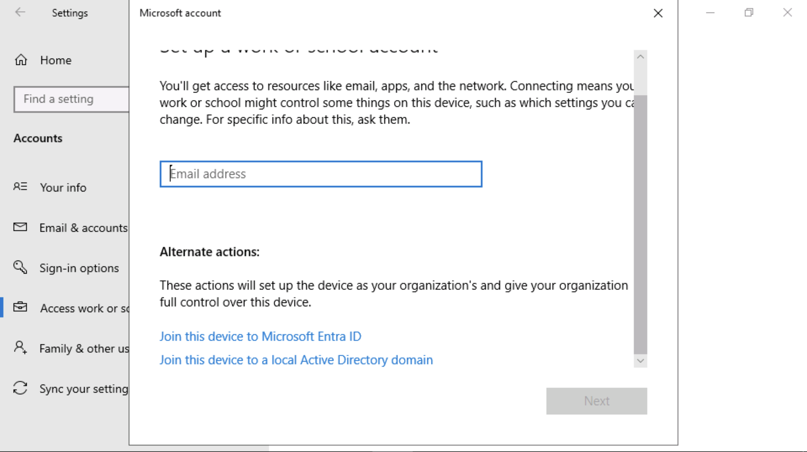

# Lab 7 – Configurazione di Insider Risk Management

## Obiettivo:

In questo lab si apprenderà come configurare Insider Risk Management
usando i criteri di Insider Risk Management. Utilizzeremo i tipi di
informazioni sensibili creati nel Lab 2 e i criteri DLP creati nel Lab 5
per creare criteri che proteggeranno l'organizzazione dall'utilizzo
rischioso del browser o da eventuali furti o fughe di dati.

A tale scopo, verrà creata un'infrastruttura in Azure che rappresenterà
i dispositivi in un'organizzazione. Si apprenderà come eseguire
l'onboarding di tali dispositivi in Azure AD e Intune e installare un
agente MDM su di essi, in modo che possano essere usati per ottenere gli
avvisi da tali computer.

## Esercizio 1: Sincronizzare l'orologio della macchina virtuale

1.  Dopo aver effettuato l'accesso alla VM, selezionare l'icona di
    Windows. Quindi cercare **Date and time** e selezionare ** Date and
    time settings**.

Uno screenshot di un computer Descrizione generata automaticamente

2.  Nella schermata **Settings** che si apre, fare clic su **Sync now**
    in Impostazioni aggiuntive.

Uno screenshot di un computer Descrizione generata automaticamente

3.  Questo si occupa di sincronizzare l'ora nel caso in cui la
    sincronizzazione automatica non funzioni.

Uno screenshot di un computer Descrizione generata automaticamente con
media sicurezza

## Esercizio 2: Creare criteri di Insider Risk Management.

### Prerequisiti

#### Passaggio 1 - Aggiungere utenti al gruppo di ruoli Insider risk management

1.  Se il portale di Microsoft Purview è aperto, continuare con il
    passaggio 2, in caso contrario, aprire il
    `https://purview.microsoft.com` e accedere con le credenziali di
    **amministratore MOD**.

2.  Nella navigazione selezionare **Settings** e selezionare **Role
    groups** in **Role groups,** selezionare **Insider Risk
    Management**. Quindi selezionare **Edit**. Nel riquadro laterale,
    selezionare nuovamente **Edit.**

3.  Nella pagina ** Edit Members of the role group,** selezionare
    **Choose users**.

Uno screenshot di un computer Descrizione generata automaticamente

4.  Selezionare la casella di controllo accanto a **MOD Admin,
    Patti, Megan **e** Alex**. Quindi scegliere **Select**.

5.  Quindi selezionare **Next**.

Uno screenshot di un computer Descrizione generata automaticamente

6.  Selezionare **Save **per aggiungere gli utenti al gruppo di ruoli.

Uno screenshot di un computer Descrizione generata automaticamente

7.  Selezionare **Done **per completare i passaggi.

Uno screenshot di un computer Descrizione generata automaticamente

#### Passaggio 2 - Abilitare le informazioni dettagliate sull'analisi dei rischi Insider

1.  Nel portale di Microsoft Purview. Passare a **Settings**, andare a
    ** Insider risk management**. Andare su **Analytics**, abilitare il
    pulsante di opzione e fare clic su **Save**.

#### Passaggio 3 - Onboarding di un dispositivo

In questo scenario di distribuzione, si eseguirà l'onboarding dei
dispositivi di cui non è stato ancora eseguito l'onboarding e si
desidera solo rilevare le attività di rischio Insider nei dispositivi
Windows 10.

È necessario registrare il dispositivo/macchina virtuale nell'ID
Microsoft Entra come prerequisito per la creazione di qualsiasi criterio
di rischio Insider.

1.  Aprire **Setting** di Windows sulla vostra VM.

Uno screenshot di un computer Descrizione generata automaticamente

2.  Andare su ** Accounts \> Access work or school**. Nella pagina
     **Access work or school**, fare clic su **Connect**.

Uno screenshot di un computer Descrizione generata automaticamente

3.  Nel prompt **Set up a work or school account**, fare clic su **Join
    this device to Microsoft Entra ID**.

4.  Nella richiesta di accesso, accedere con le credenziali di
    **amministratore MOD** fornite nella scheda delle risorse
    dell'ambiente lab. 

Uno screenshot di un computer Descrizione generata automaticamente

Interfaccia utente grafica, applicazione, PowerPoint Descrizione
generata automaticamente

5.  Premere **Join **nel prompt **Make sure this is your organisation**.

Interfaccia utente grafica, testo, applicazione Descrizione generata
automaticamente

6.  Una volta fatto, vedrai una finestra di conferma**: You’re all
    set!.** Cliccare su **Done**.

Uno screenshot di un computer Descrizione generata automaticamente

7.  Di nuovo, andare su **Accounts \> Access work or school**. Nella
    pagina **Access work or school**, fare clic su **Connect**.

Uno screenshot di un computer Descrizione generata automaticamente

8.  Nel prompt ** Set up a work or school account**, utilizzare le
    credenziali di amministratore MOD per accedere.

Uno screenshot di un computer Descrizione generata automaticamente

9.  Nella pagina **Setting up your device**, selezionare **Got it**.

Uno screenshot di un computer Descrizione generata automaticamente

10. Passare ora a **windows settings** \> **Accounts** \> **Access work
    or school** \> **Connected to Contoso MDM** \> **Info** \> **Sync**.

Uno screenshot di un computer Descrizione generata automaticamente

Uno screenshot di un computer Descrizione generata automaticamente

11. Fare clic sul simbolo di Windows sulla macchina virtuale. Seleziona
    l'utente **Admin **e selezionare **Sign out**.

Uno screenshot di un computer Descrizione generata automaticamente

12. Nella schermata utente selezionare **Other user**.

Uno screenshot di un computer Descrizione generata automaticamente con
media sicurezza

13. Immettere le credenziali di Office 365 fornite nella home page
    dell'ambiente lab e accedere alla macchina virtuale come
    **amministratore MOD**.

Uno screenshot di un computer Descrizione generata automaticamente con
media sicurezza

14. Chiudere l'app delle impostazioni di Windows. Accedere a
    `https://purview.microsoft.com` utilizzando il tuo account **MOD
    Administrator** sulla tua VM Lab.

15. Selezionare **Settings \> Device onboarding \> Devices**.

16. Fare clic su **Turn on Device onboarding**.

Uno screenshot di un computer Descrizione generata automaticamente

17. Dalle **Settings \> Device onboarding \> Onboarding**. Cliccare su
    **Download package**.

Uno screenshot di un computer Descrizione generata automaticamente

18. Fare clic con il pulsante destro del mouse sul file ed **Extract
    all…**.

Uno screenshot di un computer Descrizione generata automaticamente con
media sicurezza

Uno screenshot di un computer Descrizione generata automaticamente

19. Una volta terminato, aprire la cartella ed eseguire il file con i
    diritti di **Administrator**.

Lo schermo di un computer con lo schermo di un computer Descrizione
generata automaticamente

20. Cliccare su **More info**.

Interfaccia utente grafica, applicazione Descrizione generata
automaticamente

21. Fare clic su **Run anyway**.

Uno screenshot di un errore del computer Descrizione generata
automaticamente

22. Nel prompt dei comandi, premere **Y** e premere invio per confermare
    e continuare quando richiesto.

Uno screenshot di un errore del computer Descrizione generata
automaticamente

23. Riceverai un messaggio che ti informa che il dispositivo è stato
    caricato. Nel prompt dei comandi una volta ricevuto il messaggio,
    **Press any key to continue …**, premere un tasto qualsiasi.

24. Una volta chiuso il prompt dei comandi, aprire il prompt dei comandi
    in modalità amministratore per eseguire un test di rilevamento e, al
    prompt, copiare ed eseguire il comando seguente. La finestra del
    prompt dei comandi si chiuderà automaticamente.

`powershell.exe -``NoExit`` -``ExecutionPolicy`` Bypass -``WindowStyle`` Hidden $``ErrorActionPreference``= 'silentlycontinue';(New-ObjectSystem.Net.WebClient).DownloadFile('http://127.0.0.1/1.exe','C:\test-WDATP-test\invoice.exe');Start-Process 'C:\test-WDATP-test\invoice.exe'`

Descrizione del testo generata automaticamente

25. Aprire **settings** facendo clic sulle impostazioni nella
    navigazione e scegliere **Devices Onboarding \> Devices**.

**Nota:** anche se in genere sono necessari circa 60 secondi per
abilitare l'onboarding del dispositivo, attendi fino a 30 minuti.

26. Sarai in grado di controllare l'elenco dei **Devices**. L'elenco
    sarà vuoto fino a quando non si esegue l'onboarding dei dispositivi,
    una volta terminato, sarà possibile visualizzare le macchine
    virtuali elencate come dispositivo di cui è stato eseguito
    l'onboarding.

### Attività 1: Creazione di un criterio a livello di organizzazione per rilevare e valutare Risky Browser Usage 

#### Passaggio 1 - Creare un nuovo criterio

1.  Se hai chiuso la finestra del browser nell'attività precedente,
    aprire il `https://purview.microsoft.com` e accedi con le
    credenziali di amministratore.

2.  Passare a **Insider Risk Management** e selezionare la scheda
    **Policies**. Selezionare ** Create policy** per aprire la procedura
    guidata dei criteri.

3.  Nella pagina **Choose a policy template,** scegliere **Risky browser
    usage (preview),** in **Risky browser usage (preview).**

Uno screenshot di un computer Descrizione generata automaticamente

4.  Assicurarsi che tutti i prerequisiti siano soddisfatti.

Uno screenshot di un computer Descrizione generata automaticamente

5.  Selezionare **Next **per continuare.

Uno screenshot di un computer Descrizione generata automaticamente

6.  Nella pagina **Name and description,** completare i campi seguenti:

- Name (required): Risky usage of browser 

&nbsp;

- Description (optional): This is a test policy for the risky browser
  usage. 

7.  Selezionare **Next **per continuare.

Interfaccia utente grafica, testo, applicazione Descrizione generata
automaticamente

8.  Nella pagina **Choose users, groups, & adaptive scopes,**
    selezionare **All users, groups, & adaptive scopes**. Selezionare
    **Next **per continuare.

9.  Nella pagina **Exclude users and groups,** selezionare **Next**.

10. Nella pagina **Decide whether to prioritize,** selezionare **I don’t
    want to specify priority content right now** (sarà possibile
    eseguire questa operazione dopo la creazione del criterio).
    Selezionare **Next **per continuare.

Interfaccia utente grafica, testo, applicazione Descrizione generata
automaticamente

11. Nella pagina **Triggers for this policy,** selezionare **Turn on
    indicators**.

Uno screenshot di un computer Descrizione generata automaticamente

12. In **Choose indicators to turn on**, selezionare **Select
    all under Risky browsing indicators (preview)** e deseleziona il
    resto delle caselle.

Uno screenshot di un computer Descrizione generata automaticamente

13. Scorrere verso il basso e selezionare **Save**.

14. In **Triggers for this policy**, in **Select which activities will
    trigger this policy**. Selezionare tutte le opzioni e cliccare su
    **Next**.

Interfaccia utente grafica, testo, applicazione Descrizione generata
automaticamente

15. Nella pagina **Triggering thresholds for this policy,** selezionare
    **Use custom thresholds (Recommended),** modificare tutte le soglie
    in **1** al giorno e quindi selezionare **Next**.

Interfaccia utente grafica, applicazione Descrizione generata
automaticamente

Uno screenshot di un computer Descrizione generata automaticamente

16. Nella pagina **indicators**, selezionare **Next**.

Uno screenshot di un computer Descrizione generata automaticamente

17. In **Decide whether to use default or custom indicator thresholds**,
    selezionare **Use default thresholds for all indicators**, quindi
    selezionare **Next**.

Interfaccia utente grafica, testo, applicazione Descrizione generata
automaticamente

18. In **Review settings and finish**, selezionare **Submit**.

Interfaccia utente grafica, testo, applicazione Descrizione generata
automaticamente

19. In **Your policy was created**, selezionare **Done**.

Uno screenshot di un computer Descrizione generata automaticamente

20. Tenere aperta la scheda e continua con l'attività successiva.

#### 

#### Passaggio 2 - Assegnare un punteggio ai criteri

1.  Fare clic sulla nuova politica denominata **Risky usage of
    browser**. Selezionare **Start scoring activity for users**.

Uno screenshot di un computer Descrizione generata automaticamente

2.  Nel campo **Reason** del riquadro **Add users to multiple
    policies,** digitare **Testing the policy**.

Uno screenshot di un computer Descrizione generata automaticamente

3.  Nel campo **This should last for (choose between 5 and 30 days),**
    selezionare **10** giorni.

4.  Utilizzare il campo** Search user to add to policies**. Aggiungere
    **MOD Admin**. Quindi fare clic su **Start scoring activity**.

5.  Una volta ricevuta la conferma che hai avviato **Scoring activity
    for 1 users**, fare clic su **Close**.

Uno screenshot dello schermo di un computer Descrizione generata
automaticamente con media sicurezza

### Attività 2: Furto di dati da parte di utenti in partenza

#### Passaggio 1 - Creare un nuovo criterio

1.  Se la finestra del browser è stata chiusa nell'attività precedente,
    aprire il `https://purview.microsoft.com` e accedere con le
    credenziali di amministratore.

2.  Passare a **Insider Risk Management** e selezionare la scheda
    **Policies**. Selezionare **Create policy** per aprire la procedura
    guidata dei criteri.

3.  Nella pagina **Choose a policy template**, scegliere **Data theft by
    departing users**, in **Data theft**. Selezionare **Next **per
    continuare.

Uno screenshot di un computer Descrizione generata automaticamente

4.  Nella pagina ** Name and description,** completare i campi seguenti:

- Name (required): Data theft by a user 

&nbsp;

- Description (optional): This is a test policy for the preventing data
  theft. 

5.  Selezionare **Next **per continuare.

Uno screenshot di un computer Descrizione generata automaticamente

6.  Nella pagina **Choose users, groups, & adaptive scopes,**
    selezionare **All users, groups, & adaptive scopes**. Selezionare
    **Next **per continuare.

7.  Nella pagina **Exclude users, groups, & adaptive scopes,**
    selezionare **Next**.

8.  Nella pagina  **Decide whether to prioritize,** selezionare **I want
    to specify priority content**. Selezionare la casella di controllo
    **Sensitivity labels** e **Sensitive info types**. Seleziona
    **Next **per continuare.

Uno screenshot dello schermo di un computer Descrizione generata
automaticamente con media sicurezza

9.  Nella pagina **Sensitivity labels to prioritize,** selezionare **Add
    or edit sensitivity labels**. Nel riquadro a comparsa selezionare
    ** Internal/Employee data (HR) **e selezionare **Add**. Quindi fare
    clic su **Next**.

Uno screenshot dello schermo di un computer Descrizione generata
automaticamente con media sicurezza

10. Nella pagina **Sensitive info types to prioritize,** selezionare
    **Add or edit sensitive info types**. Nel riquadro a comparsa
    cercare e selezionare **Credit Card Number, Contoso Employee
    ID and Contoso Employee EDM**. Selezionare **Add**. Quindi fare clic
    su **Next**.

Uno screenshot di un computer Descrizione generata automaticamente

11. In **Decide whether to score only activity with priority content**,
    selezionare **Get alerts for all activity**. Selezionare **Next**.

Uno screenshot dello schermo di un computer Descrizione generata
automaticamente con media sicurezza

12. Nella pagina **Triggers for this policy**, selezionare
    l'impostazione predefinita e quindi selezionare **Next**.

Uno screenshot di un computer Descrizione generata automaticamente con
media sicurezza

13. Nella pagina **Indicators**, selezionare **Turn on indicators** dal
    prompt.

Uno screenshot di un computer Descrizione generata automaticamente con
media sicurezza

14. Selezionare **Select all under Office indicators** e fare clic su
    **Save**.

Uno screenshot dello schermo di un computer Descrizione generata
automaticamente con media sicurezza

15. Selezionare tutte le opzioni e cliccare su **Next**.

Uno screenshot di un computer Descrizione generata automaticamente

16. Nella pagina **Detection options,** selezionare l'impostazione
    predefinita e quindi selezionare **Next**.

Uno screenshot di un computer Descrizione generata automaticamente

17. Nella pagina **indicators**, selezionare **Next**.

Uno screenshot di un computer Descrizione generata automaticamente

18. In **Decide whether to use default or custom indicator thresholds**,
    selezionare **Customise thresholds**, utilizzare rispettivamente
    **1**, **2** e **3** eventi per ogni fase, quindi selezionare
    **Next**.

Uno screenshot dello schermo di un computer Descrizione generata
automaticamente

19. In **Review settings and finish**, selezionare **Submit**.

Uno screenshot di un computer Descrizione generata automaticamente

20. In **Your policy was created**, selezionare **Done**.

Uno screenshot di un computer Descrizione generata automaticamente

21. Tenere aperta la scheda e continuare con l'attività successiva.

#### 

#### Passaggio 2 - Assegnare un punteggio ai criteri

1.  Fare clic sulla nuova policy denominata ** Data theft by a user**.
    Selezionare **Start scoring activity for users**.

Uno screenshot di un computer Descrizione generata automaticamente

2.  Nel riquadro **Reason field in the Add users to multiple policies,**
    digitare **Testing the policy**.

Uno screenshot di un computer Descrizione generata automaticamente

3.  Nel campo **This should last for (choose between 5 and 30 days),**
    selezionare **10** giorni.

4.  Utilizzare il campo **Search user to add to policies**. Aggiungere
    **MOD Admin**. Quindi fare clic su **Start scoring activity**.

5.  Una volta ricevuta la conferma che hai avviato **Scoring activity
    for 1 users**, fare clic su **Close**.

Uno screenshot di un computer Descrizione generata automaticamente

### Attività 3: Fughe di dati da parte degli utenti

#### Passaggio 1 - Creare un nuovo criterio

1.  Se hai chiuso la finestra del browser nell'attività precedente,
    aprire il `https://purview.microsoft.com` e accedere con le
    credenziali di amministratore.

2.  Passare a **Insider Risk Management** e selezionare la scheda
    **Policies**. Selezionare **Create policy **per aprire la procedura
    guidata dei criteri.

Uno screenshot di un computer Descrizione generata automaticamente

3.  Nella pagina **Choose a policy template,** scegliere **Data leaks**,
    in **Data leaks**. Selezionare **Next **per continuare.

Uno screenshot di un computer Descrizione generata automaticamente

4.  Nella pagina **Name and description,** completare i campi seguenti:

- Name (required): Data leaks by a user 

&nbsp;

- Description (optional): This is a test policy for preventing data
  leaks. 

5.  Selezionare **Next **per continuare.

Uno screenshot di un computer Descrizione generata automaticamente

6.  Nella pagina** Choose users and groups,** selezionare **Include all
    users and groups**. Selezionare **Next **per continuare.

Uno screenshot di un computer Descrizione generata automaticamente

7.  Nella pagina **Exclude users and groups,** selezionare **Next**.

8.  Nella pagina  **Decide whether to prioritize,** selezionare **I want
    to specify priority content**. Selezionare la casella di controllo
    per **SharePoint sites, Sensitivity labels** e** Sensitive info
    types**. Selezionare **Next **per continuare.

Uno screenshot di un computer Descrizione generata automaticamente con
media sicurezza

9.  Nella pagina **SharePoint sites to prioritize,** selezionare ** Add
    or edit SharePoint sites**. Nel riquadro a comparsa selezionare
    `https://{TENANTPREFIX}.sharepoint.com/sites/ContosoWeb1` e
    selezionare **Add**. Quindi fare clic su **Next**.

10. Nella pagina ** Sensitivity labels to prioritize,** selezionare
    ** Add or edit sensitivity labels**. Nel riquadro a comparsa,
    selezionare ** Internal/Employee data (HR)** e selezionare **Add**.
    Quindi fare clic su **Next**.

Uno screenshot dello schermo di un computer Descrizione generata
automaticamente con media sicurezza

11. Nella pagina ** Sensitive info types to prioritize,** selezionare
    ** Add or edit sensitive info types**. Nel riquadro a comparsa
    cercare e selezionare **Credit Card Number, Contoso Employee ID** e
    **Contoso Employee EDM**. Selezionare **Add**. Quindi fare clic su
    **Next**.

Uno screenshot di un computer Descrizione generata automaticamente

12. In **Decide whether to score only activity with priority content**,
    selezionare **Get alerts for all activity**. Selezionare **Next**.

Uno screenshot dello schermo di un computer Descrizione generata
automaticamente con media sicurezza

13. Nella pagina **Triggers for this policy,** selezionare il pulsante
    di opzione accanto a **ser performs an exfiltration activity**. In
    **select which activities will trigger this policy**, seleziona
    tutte le opzioni disponibili, in particolare **Download content from
    SharePoint**. e quindi selezionare **Next**.

Uno screenshot di un computer Descrizione generata automaticamente

14. In **Triggering thresholds for this policy,** selezionare ** Use
    custom thresholds**. Impostare ogni soglia su **1** e selezionare
    **Next**.

Uno screenshot di un computer Descrizione generata automaticamente con
media sicurezza

15. Selezionare le impostazioni predefinite nella pagina
    **Indicators **e selezionare **Next**.

16. In **Decide whether to use default or custom indicator thresholds**,
    selezionare **Customise thresholds**, utilizzare rispettivamente
    **1**, **2** e **3** eventi per ogni fase, quindi seleziona
    **Next**.

Uno screenshot di un computer Descrizione generata automaticamente con
media sicurezza

17. In **Review settings and finish**, selezionare **Submit**.

Uno screenshot di un computer Descrizione generata automaticamente con
media sicurezza

18. In **Your policy was created**, selezionare **Done**.

Uno screenshot di un computer Descrizione generata automaticamente

19. Tenere aperta la scheda e continua con l'attività successiva.

#### 

#### Passaggio 2 - Assegnare un punteggio ai criteri

1.  Fare clic sul nuovo criterio denominato ** Data leaks by a user**.
    Selezionare **Start scoring activity for users**.

Uno screenshot di un computer Descrizione generata automaticamente con
media sicurezza

2.  Nel riquadro **Reason field in the Add users to multiple policies,**
    digitare Testing the policy. Nel campo **This should last for
    (choose between 5 and 30 days),** selezionare **10** giorni.
    Utilizzare il campo ** Search user to add to policies**. Aggiungere
    **MOD Admin**. Quindi fare clic su **Start scoring activity**.

3.  Una volta ricevuta la conferma che hai avviato **Scoring activity
    for 1 user**, fare clic su **Close**.

I criteri di Insider risk management sono stati creati correttamente.

## Sommario:

In questo lab è stata esaminata la configurazione della Insider risk
management dall'inizio alla fine. Con la sottoscrizione e le licenze, è
anche possibile usare questa guida di laboratorio per creare una
configurazione di Azure che può essere usata anche per creare vari
avvisi (che include l'invio di messaggi di posta elettronica con dati
limitati, che non è possibile da una sottoscrizione di valutazione) per
i criteri di Insider risk management che è possibile usare per esplorare
la funzionalità di protezione adattiva in Purview.
