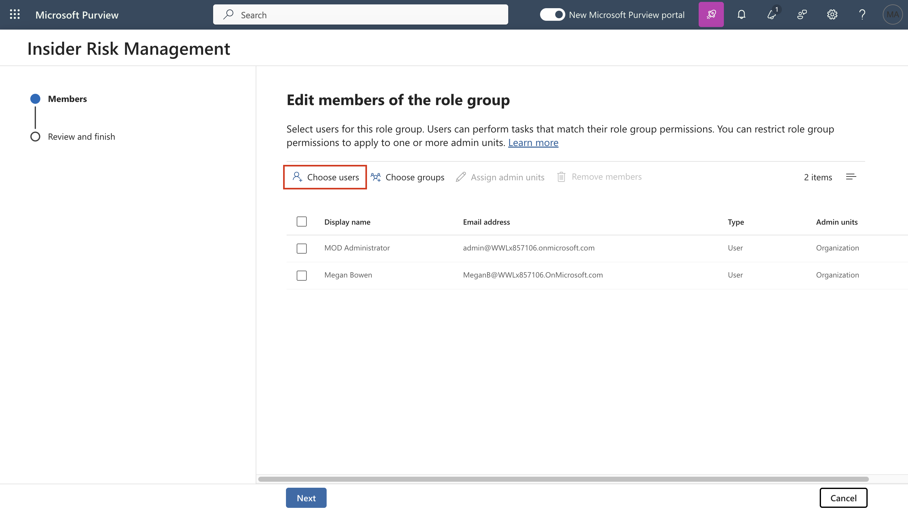
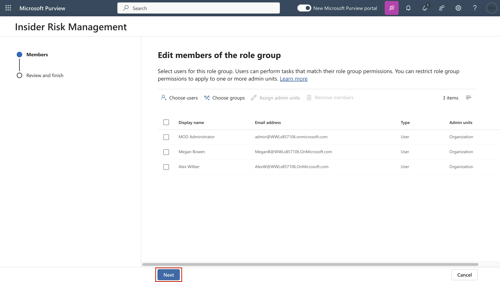
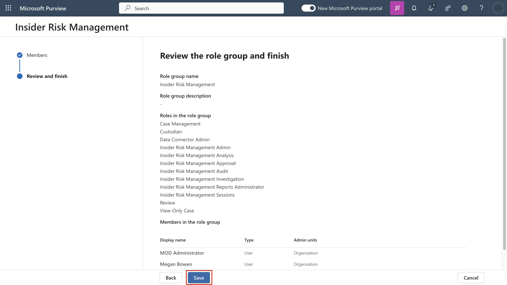
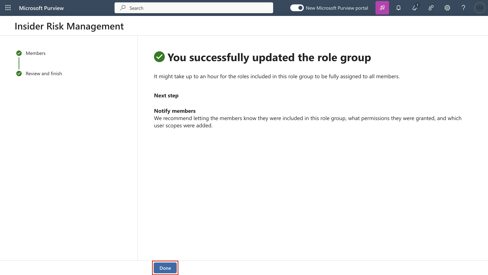
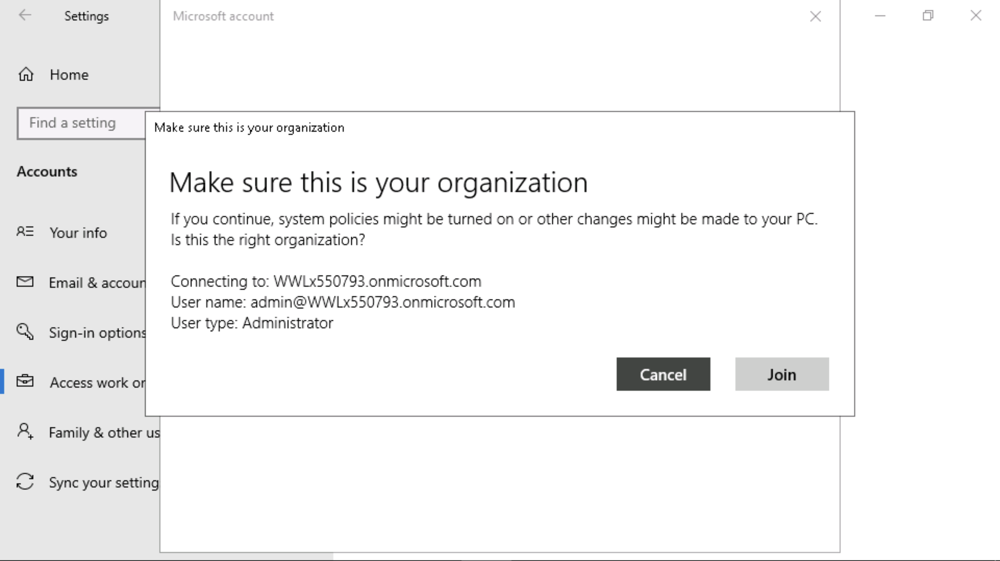
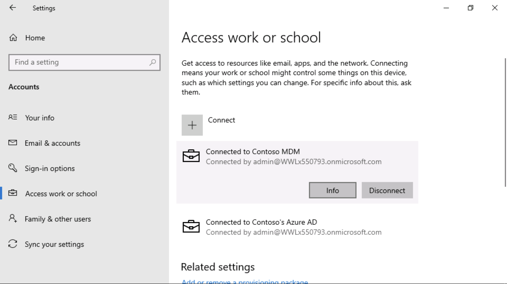
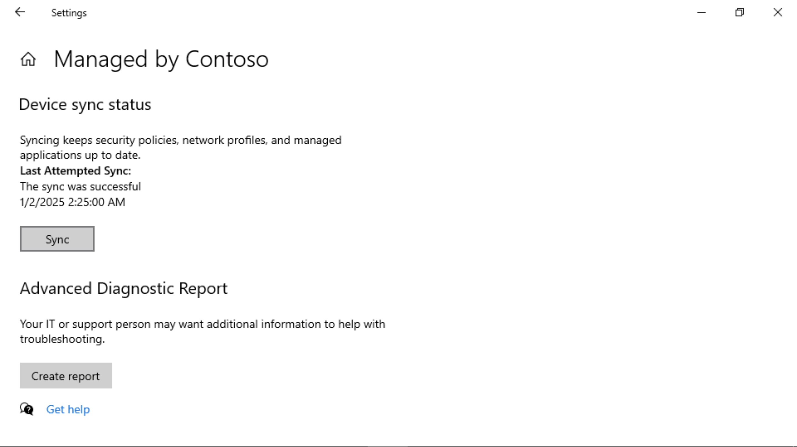
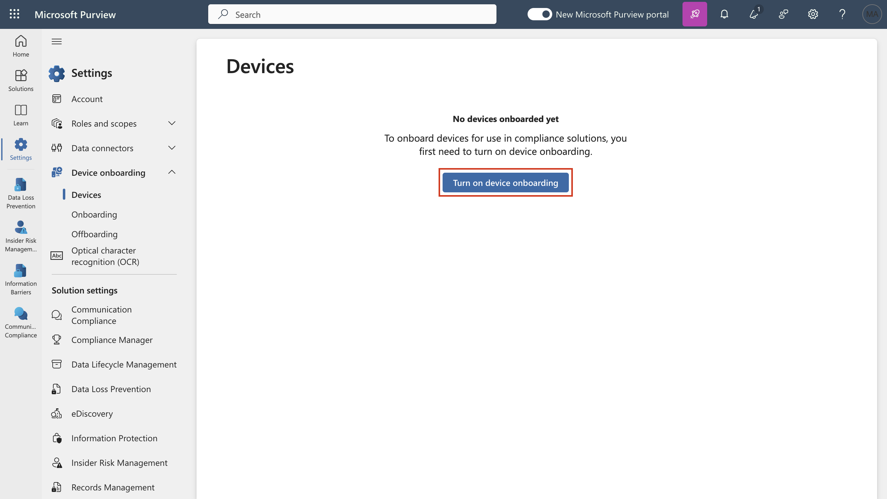
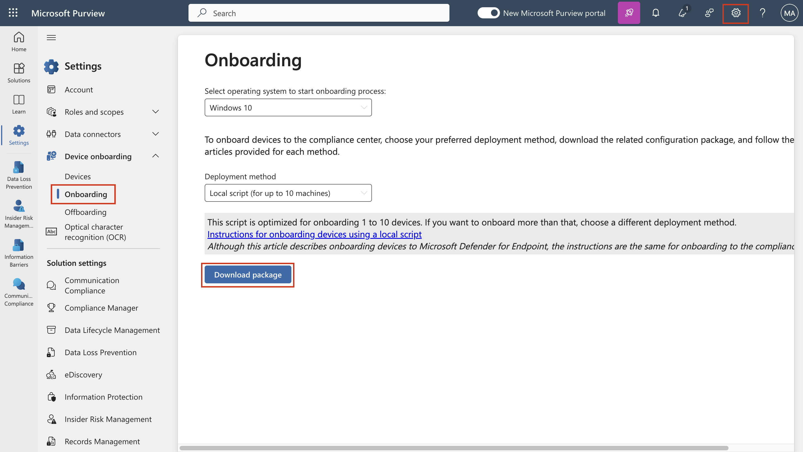
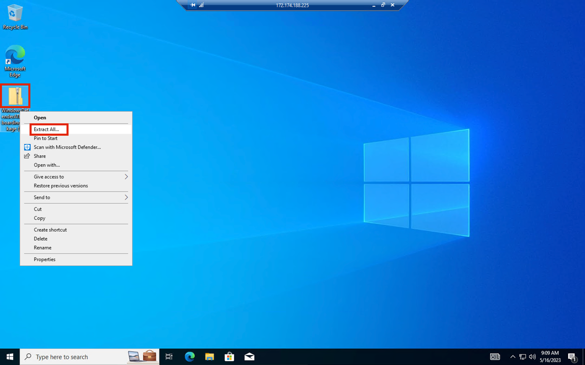

# **ラボ7 – Adaptive Protectionの機能の探究**

紹介

Microsoft Purview の Adaptive Protection は、Microsoft Purview Insider Risk Management と Microsoft Purview Data Loss Prevention (DLP) を統合します。Insider Riskによって危険な行動を行っているユーザーが特定されると、そのユーザーは内部リスクレベルに動的に割り当てられます。その後、Adaptive Protection は DLP ポリシーを自動的に作成し、その内部リスクレベルに関連付けられた危険な行動から組織を保護します。

目的

- Insider Risk Management で Adaptive Protection
  のリスクしきい値を設定します。

- エンドポイント保護用のカスタム DLP ポリシーを作成して構成します。

- トレーニング可能な分類子とインサイダー リスク
  レベルを使用して条件を定義します。

- リスクの高いデータ流出活動をブロックするアクションを適用します。

- 即時適用するにはポリシーを有効にします。

## 演習1 – Adaptive Protectionの設定

### タスク1 – Adaptive Protectionのリスクレベルの設定

1.  ナビゲーション バーから、 **Solutions \> Insider risk
    managementに移動します**。

    

2.  **Insider Risk Management の**左側のペインで、 **Adaptive
    Protectionに移動してクリックします**。

    

3.  **Adaptive Protectionページ**で、 **Insider risk
    levels**をクリックします。次に、 **Insider risk
    policy**セクションに移動し、 **Select a
    policy**の横にあるドロップダウンをクリックします**Data leaks by a
    user**の横にあるチェックボックスをオンにします。

    

    

4.  **Conditions for insider risk levels**で、 **Elevated risk
    level**フィールドの「User performs at least 3 data exfiltration
    activities, each…」を選択します**Moderate risk
    level**フィールドの「User performs at least 2 data exfiltration
    activities, each…」を選択します**Minor risk
    level**フィールドの「User performs at least 1 data exfiltration
    activities,
    each…」を選択します。次に、下にスクロールして「**Save」**ボタンを選択します。

    

5.  **\[Save\]ボタン**をクリックします。

    

タスク2 – エンドポイント用のカスタムAdaptive Protection
DLPポリシーを作成する

1.  **Adaptive Protectionページ**で、 **Data Loss
    Preventionに移動してクリックし、 「+ Create
    policy」**をクリックします。

    

2.  **Choose what type of data to protect**ページで、**Data stored in
    connected sources**のラジオ  
    ボタンが選択されていることを確保します。

    

3.  **Template or custom policy**ページの**Categories**セクションで、
    **\[Custom\]**に移動して選択し、
    **\[Regulations\]**の下にある**Custom policy**をクリックします。

    

4.  **Name your DLP policy**ページの**「Name」**フィールドに、
    **+++Custom Policy for Endpoint+++** と入力します。

    

5.  **Assign admin units**ページで、 **Next**ボタンをクリックします。

    

6.  **Choose where to apply the policy**ページで、
    **「Next」**ボタンをクリックします。

    

7.  **Define policy settings**ページで、
    **「Next」**ボタンをクリックします。

    

8.  **Customize advanced DLP rules**ページで、**+ Create
    rule**をクリックします。

    

9.  **Create rule**フィールドに、+++ **Adaptive Protection block rule
    for Endpoint DLP** +++と入力します。

    

10. **+ Add condition**の横にあるドロップダウンをクリックし、**Content
    contains**を選択します。

    

11. **Content
    containsセクション**で、**Add**の横にあるドロップダウンをクリックし**Trainable
    classifiers**を選択します。

    

12. 右側の**Trainable classifiersペイン**で**Source code Agreements**,
    **HR**, and
    **IP**の横にあるチェックボックスに移動して選択し**Addボタン**をクリックします。

    

    

13. **Add condition**の横にあるドロップダウンをクリックし、 **select
    Insider risk level for Adaptive Protection isを選択します。**

    

14. **Select one or more risk
    levels**の横にあるドロップダウンをクリックし、 **Elevated risk
    level**の横にあるチェックボックスを選択します。

    

15. **Actionsセクション**で、 **Add an
    action**の横にあるドロップダウンをクリックし、 **Audit or restrict
    activities on devicesを**選択します。

    

16. **Copy to clipboard, Copy to a removable USB device, Copy to a
    network share,** 及び**Print**.**に対してBlock**を選択します。

    ..

    

17. **Incident reports**セクションの**Use this severity level in admin
    alerts and
    reports**フィールドで、ドロップダウンから**Low**を選択します。
    **「Save」**ボタンをクリックします。

    

18. **Next**ボタンをクリックします。

    

19. **Policy modeページ**で、 **Turn the policy on
    immediately**の横にあるラジオ ボタンを選択し、\[**Next**\]
    ボタンをクリックします。

    

20. **Review and finish**ページで、
    **「Submit」**ボタンをクリックします。

    

21. **New policy created**ページで、**Done**ボタンをクリックします。

    

**まとめ**

この演習では、まずデータ流出アクティビティのしきい値に基づいてインサイダー
リスク レベルを定義して、Microsoft Purview で Adaptive Protection
を構成しました。次に、エンドポイントデバイス向けに、Adaptive Protection
を使用して、リスクの上昇が検出された場合に USB
へのコピーや印刷などのアクティビティを自動的に制限するData Loss
Prevention
(DLP)ポリシーを作成しました。このポリシーは、トレーニング可能な分類子を用いて機密コンテンツを対象とし、インサイダーリスクレベルに基づいて厳格なアクションを適用することで、潜在的なデータ漏洩を軽減します。

