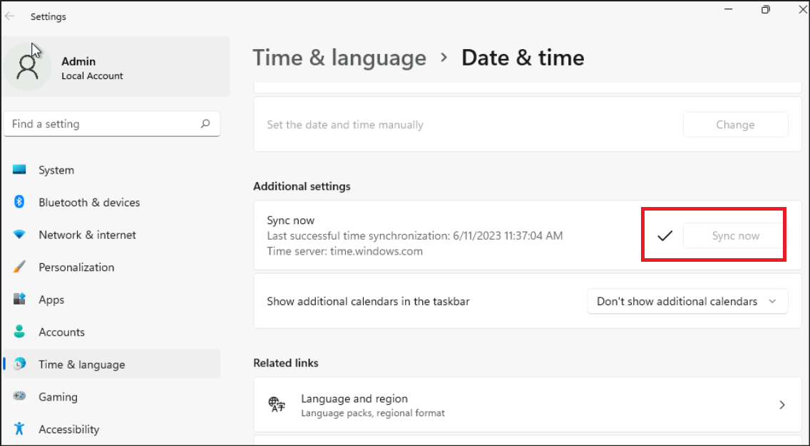
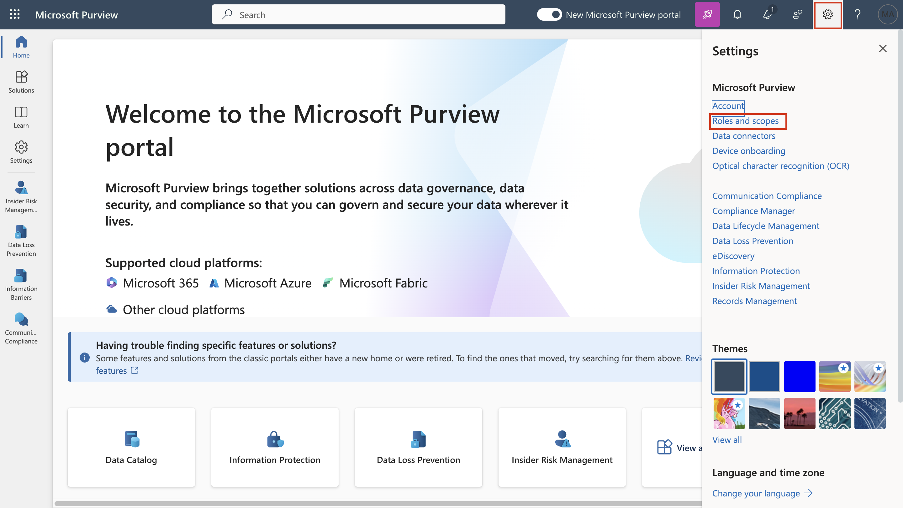
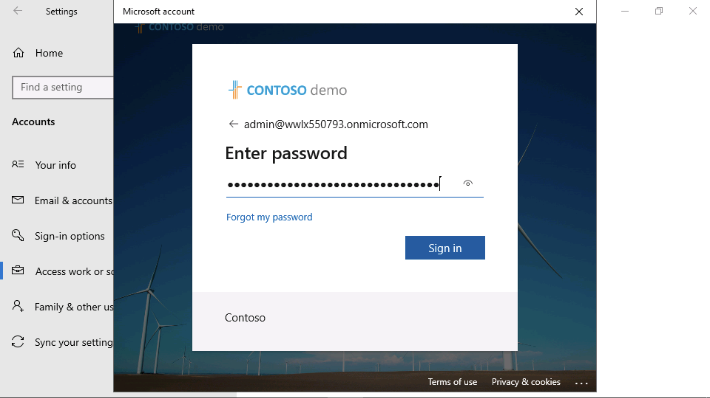
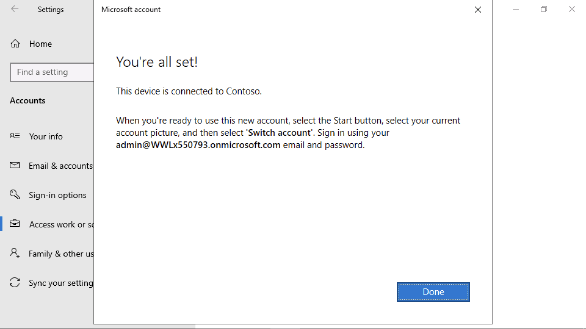
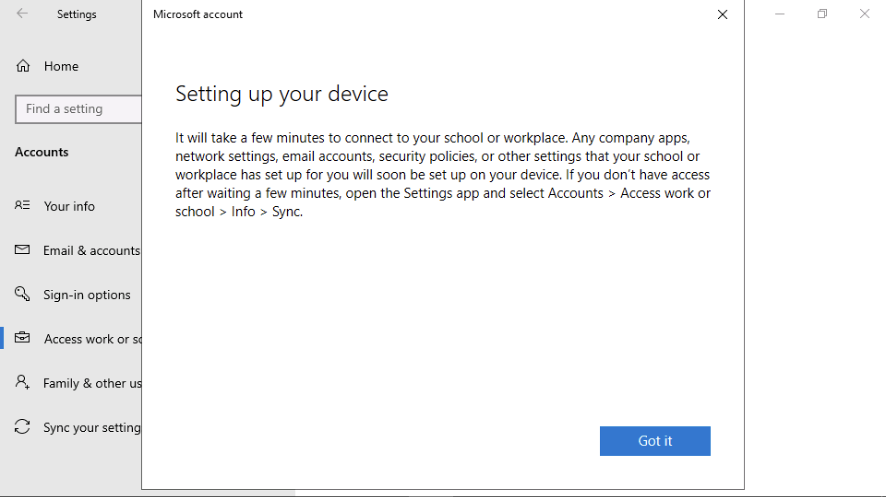

**实验 7_探索自适应保护的功能**

介绍

## Microsoft Purview 中的自适应保护将 Microsoft Purview 内部风险管理与 Microsoft Purview 数据丢失防护 （DLP） 集成。当内部风险识别出从事风险行为的用户时，他们会动态分配到内部风险级别。然后，自适应保护可以自动创建 DLP 策略，以帮助保护组织免受与该内部风险级别关联的风险行为的影响。

目标

- 在内部风险管理中设置自适应保护的风险阈值。

- 创建和配置用于终结点保护的自定义 DLP 策略。

- 使用可训练的分类器和内部风险级别定义条件。

- 应用作来阻止高风险数据外泄活动。

- 启用策略以立即实施。

## 练习 1 – 设置自适应保护

### 任务 1 – 设置自适应保护的风险级别

1.  从导航栏中，转到 **Solutions** \> **Insider risk management**”。.

2.  在“**Insider Risk Management**”左侧窗格中，导航并单击“**Adaptive
    Protection**”。

3.  在“**Adaptive Protection**”页中，单击“**Insider risk levels**”。
    然后，导航到“**Insider risk policy**”部分，然后单击“**Select a
    policy**”旁边的下拉列表。导航并选中 **Data leaks by a user**
    旁边的复选框。

4.  在“**Conditions for insider risk levels**”下，选择“User performs at
    least 3 data exfiltration activities, each…  “提升 **Elevated risk
    level**”字段。选择“User performs at least 2 data exfiltration
    activities, each… 用于**Moderate risk level**。选择“User performs at
    least 1 data exfiltration activities, each… 用于**Minor risk
    level**。然后，向下滚动并选择“**Save**”按钮。

5.  单击“**Save**”按钮。

任务 2 - 为端点创建自定义自适应保护 DLP 策略

1.  在“**Adaptive Protection**”页面中，导航并单击“**Data Loss
    Prevention**”，然后单击“**+ Create policy**”。

2.  在“**Choose what type of data to protect**”页上，确保选中“**Data
    stored in connected sources**”单选按钮。

3.  在“**Template or custom
    policy**”页的“**Custom**”部分中，导航并选择“**Categories**”，然后在“**Regulations**”下单击“**Custom
    policy**”。

4.  在“**Namee your DLP policy** “**Name**”字段中，输入 **+++Custom
    Policy for Endpoint+++**。

5.  在“**Assign admin units**”页中，单击“**Next**”按钮。

6.  在 **Choose where to apply the policy** 页面上，单击 **Next** 按钮。

7.  在“**Define policy settings**”页上，单击“**Next**”按钮。

8.  在“**Customize advanced DLP rules**”页上，单击“**+ Create rule**”。

9.  在“**Create rule**”字段中，输入终结点 +++**Adaptive Protection block
    rule for Endpoint DLP**+++

10. 单击 **+ Add condition** 旁边的下拉菜单，然后选择 **Content
    contains**。

11. 在“**Content
    contains**”部分中，单击“**Add**”旁边的下拉列表，选择“**Trainable
    classifiers**”。

12. 在右侧的“**Trainable classifiers**”窗格中，导航并选中“**Source
    code**, **Agreements**,
    **HR**,”和“**IP**”旁边的复选框，然后单击“**Add**”按钮。

13. 然后，单击“**Add condition**”旁边的下拉列表，然后选择“**Insider risk
    level for Adaptive Protection is**

14. 单击“**Select one or more risk
    levels**”旁边的下拉列表，然后选中“**Elevated risk
    level**”旁边的复选框

15. 在“**Actions**”部分下，单击“**Add an
    action**”旁边的下拉列表，然后选择“**Audit or restrict activities on
    devices**”。

16. 选择“**Copy to clipboard, Copy to a removable USB device, Copy to a
    network share,**”和“**Print**”的“**Block**”。

..

17. 在“**Incident reports**”部分的“**Use this severity level in admin
    alerts and
    reports**”字段中，从下拉列表中选择“**Low**”。然后，单击“**Save**”按钮。

18. 单击“**Next**”按钮。

19. 在“**Policy mode**”页中，选择“beside **Turn the policy on
    immediately**”旁边的单选按钮，然后单击“**Next**”按钮。

20. 在“**Review and finish**”页面上，单击“**Submit**”按钮。

21. 在“**New policy created**”页上，单击“**Done**”按钮。

**总结**

在本练习中，你首先根据数据外泄活动阈值定义内部风险级别，在 Microsoft
Purview 中配置了自适应保护。然后，你为端点设备创建了自定义数据丢失防护
（DLP）
策略，该策略使用自适应保护在检测到风险升高时自动限制活动（例如复制到 USB
或打印）。该策略使用可训练的分类器针对敏感内容，并根据内部风险级别应用严格的作，以减轻潜在的数据泄露。
