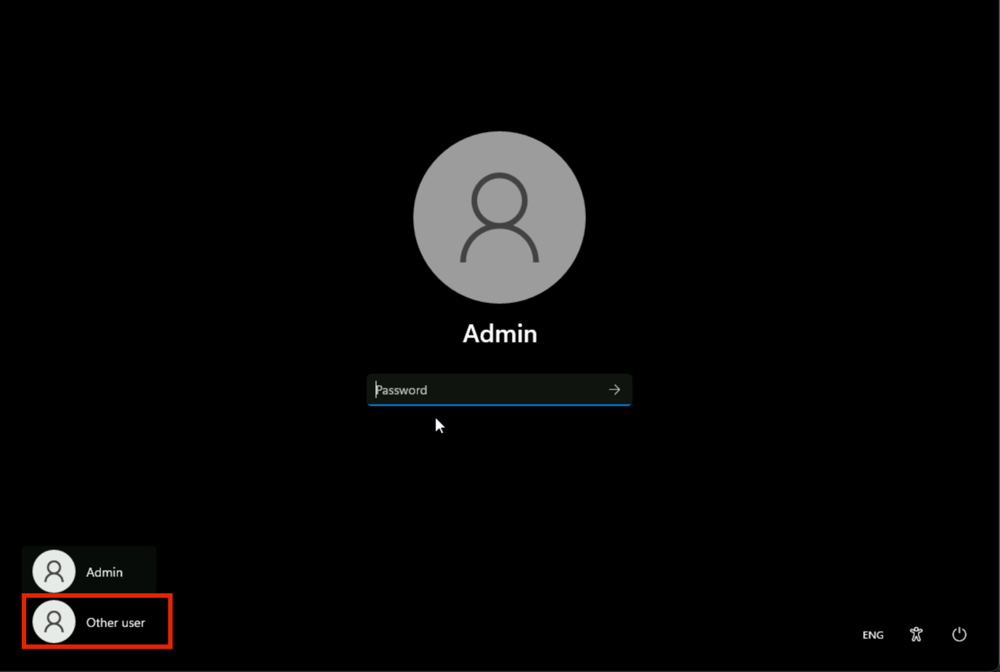

**ラボ8 – Information Barriersの設定**

**紹介**

Contoso
には*、人事*、*営業*、*マーケティング*、*研究*、*製造の*5つの部門があります。業界の規制に準拠するため、次の表に示すように、一部の部門のユーザーは他の部門とのコミュニケーションを禁止されています。

[TABLE]

この構造では、Contoso の計画には 3つの IB ポリシーが含まれています。

1.  営業部門が研究部と連絡を取ることを防ぐためのIBポリシー

2.  研究部が営業部門と連絡取ることを防ぐための、もう一つのIBポリシー

3.  製造部門が
    人事およびマーケティング部門とのみ連絡できるように設計された IB
    ポリシー。

**目的**

- Information Barriers (IB) 実装用に PowerShell
  を使用して組織セグメントを設定します。

- Microsoft Teams でスコープ
  ディレクトリ検索を有効にして、セグメント・ベースのユーザー可視性を強化します。　

- Microsoft Purview ポータルと PowerShell を使用してInformation Barriers
  (IB) ポリシーを作成し、セグメント間通信を制御します。

- 構成された IB ポリシーを適用して、部門間での通信制限を強化します。

**演習1 – 前提条件**

**タスク 1 – 組織内のユーザーのセグメントを作成する**

1.  Windowsアイコンを右クリックし、 **Windows
    PowerShell(Admin)** に移動してクリックします。 

2.  **User Account Control** ダイアログ ボックスで、
    **「Yes」**ボタンをクリックします。

3\. 以下を実行します。

**+++Install-ModuleExchangeOnlineManagement+++**

1.  「 **Do you want PowerShellGet to install and import the NuGet
    provider now?**」および**「Are you sure you want to install the
    modules from 'PSGallery'?**」というメッセージが表示されたら、
    **y**と入力して Enter キーを押します。

2.  次のコマンドを実行します。

**+++Import-Module ExchangeOnlineManagement+++**

3.  次のコマンドを実行して、Exchange Online に接続します。

**+++Connect-IPPSSession+++**

4.  ラボ環境のホームページに記載されている**MOD
    Administrator **の資格情報を使用してログインします。

**注: 「Automatically sign in to all desktop apps and websites on this
device?」**というダイアログ ボックスが表示された場合は、 **「No, this
app only」**ボタンをクリックします。

5.  組織構造を作成するには、 **PowerShell**で次のコマンドを 1
    つずつ実行します。

**+++New-OrganizationSegment -Name"HR" -UserGroupFilter"Department -eq
'HR'"+++**

**+++New-OrganizationSegment -Name"Sales" -UserGroupFilter "Department
-eq 'Sales'"+++**

**+++New-OrganizationSegment -Name"Marketing" -UserGroupFilter
"Department -eq 'Marketing'"+++**

**+++New-OrganizationSegment -Name"Research" -UserGroupFilter
"Department -eq 'Research'"+++**

**+++** **New-OrganizationSegment -Name "Manufacturing" -UserGroupFilter
"Department -eq 'Manufacturing'"+++**

**タスク 2 – Microsoft Teams でスコープ ディレクトリ検索を有効にする**

名前による検索をオンにするには

1.  **+++https://admin.teams.microsoft.com+++**
    にアクセスして、Microsoft Teams
    管理センターに移動し、**Teams** \> **Teams settings**を選択します。

2.  **Search by name**の**Scope directory search using an Exchange
    address book policy**の横にあるトグルを**On**にします。
    **「Save」**を選択します。

3.  **Changes might take some time to take
    effect**というダイアログボックスが表示された場合は、
    **「Confirm」**ボタンをクリックします。

**演習2 – IBポリシーの作成**

**タスク1 – セグメント間の通信をブロックする**

1.  Microsoft Purview ポータルで、**Solutions**\> **Information
    barriers**をクリックします。

2.  Information
    Barriersブレードにある、**Policies**をクリックし、**Policies**を選択します。**Policies**ページで**+**
    **Create policy** を選択し、新しい IB ポリシーを作成して構成します。

3.  **Provide a policy
    name**ページのNameフィールドに、ポリシーの名前**（
    +++Sales-Research+++ ）**を入力します。次に、
    **「Next」**を選択します。

4.  **Add assigned segment**の詳細ページで、 **Choose
    segment**を選択します。 **Select assigned segment for this
    policy**ペインで、
    **Sales**を選択します。**Add** を選択して、選択したセグメントをポリシーに追加します。選択できるセグメントは1つだけです。

5.  **「Next」**を選択します。

6.  **Configure Communication and collaboration detailsページ**で、
    **Block**を選択します。 **Choose segment**を選択し、
    **Research**を選択して、 **Add**を選択します。

7.  **「Communication and collaboration」ページの「Communication and
    collaboration」フィールド**で、ポリシーの種類としてBlockedを選択します。
    **「Next」を選択します**。

8.  **「Policy
    status** **」**ページで、アクティブなポリシーのステータスを**「On」**に切り替えます。
    **Next** を選択して続行します。

9.  **Review your
    settings** ページで、ポリシーに選択した設定と、選択内容に関する提案や警告を確認してください。ポリシーのセグメントやステータスを変更するには**Edit** を選択し、ポリシーを作成するには**Submit** を選択してください。

10. ポリシーが作成されたら、 **\[Done** **\] を**選択します。

11. セールス・リサーチIBポリシーが正常に作成されました。

**タスク2 – PowerShellを使用してIBポリシーを作成する**

1.  **Administrator: Windows
    PowerShell**に戻り、次のコマンドを実行します。

**+++ Import -ModuleExchangeOnlineManagement+++**

2.  次のコマンドを実行して、Exchange Online に接続します。

**+++ Connect-IPPSSession +++**

3.  ラボ環境のホームページに記載されている**MOD
    Administrator** の資格情報を使用してログインします。

**注: 「Automatically sign in to all desktop apps and websites on this
device?」**というダイアログ ボックスが表示された場合は、 **「No, this
app only」**ボタンをクリックします。

4.  次のコマンドを実行して、 **「 Research-Sales
    」**というIBポリシーを作成します。このポリシーをアクティブにして適用すると、
    **Research**セグメントのユーザーが**Sales**セグメントのユーザーと通信するのを防ぐことができます。

**+++
New-InformationBarrierPolicy -Name "Research-Sales" -AssignedSegment "Research" -SegmentsBlocked "Sales" -StateInactive
+++**

5.  次のコマンドを実行して、
    **Manufacturing-HRMarketing**というIBポリシーを作成します。このポリシーがアクティブ化され、適用されると、
    **Manufacturing**は**HR**および**Marketing**とのみ通信できます。HRとMarketingは他のセグメントとの通信を制限されません。

**+++ New-InformationBarrierPolicy -Name "Manufacturing-HRMarketing"-  
AssignedSegment "Manufacturing"-  
SegmentsAllowed"HR","Marketing","Manufacturing"-State Inactive +++**

6.  Microsoft Purview ポータルに戻り、「Information Barriers –
    Policies」ページを更新すると、PowerShell
    を使用して作成したポリシーが表示されます。

**演習3 – IBポリシーの適用**

1.  **Information Barriers**の左側のペインで、 **Policy
    applications**をクリックします。Policy
    applicationsページで、「**Apply all policies」**をクリックします。

**まとめ：**

このラボでは、PowerShell
を使用して組織セグメント（人事、営業、マーケティング、研究、製造）を作成し、Microsoft
Teams
でスコープ指定のディレクトリ検索を有効にして、ユーザーの可視性をセグメント制限と整合させました。次に、Microsoft
Purview 内で IB
ポリシーを構成し、特定のセグメント間の通信をブロックまたは許可しました（例：SalesのResearchへの通信をブロックする）。これらのポリシーは、ハンズ・オン練習のためにポータルと
PowerShell
の両方で作成しました。最後に、ポリシーを適用して、定義した通信制限を組織内で有効化および適用しました。
