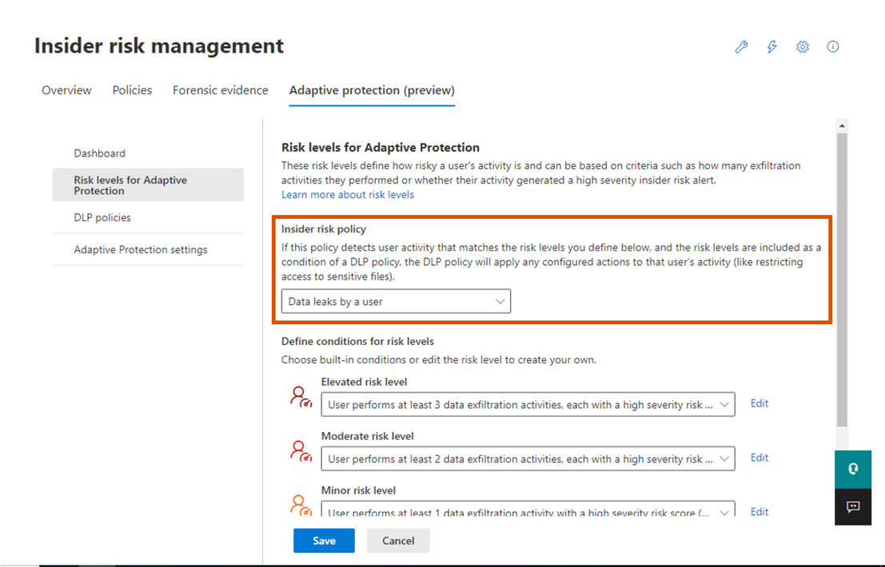
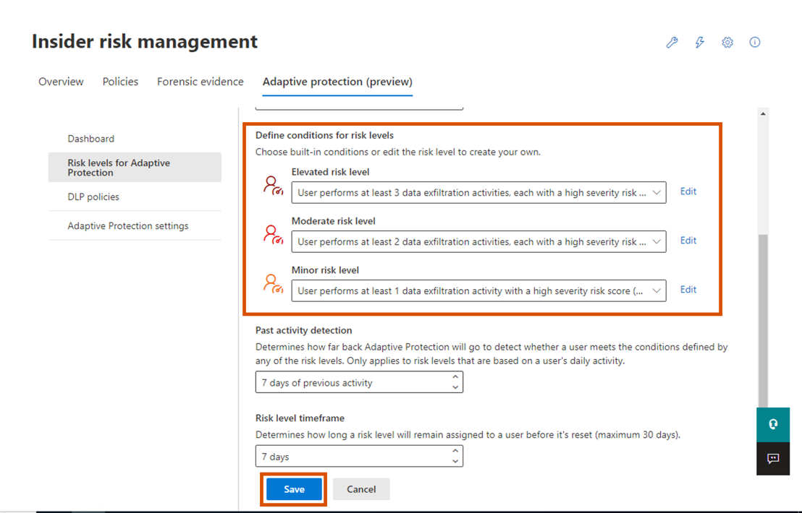
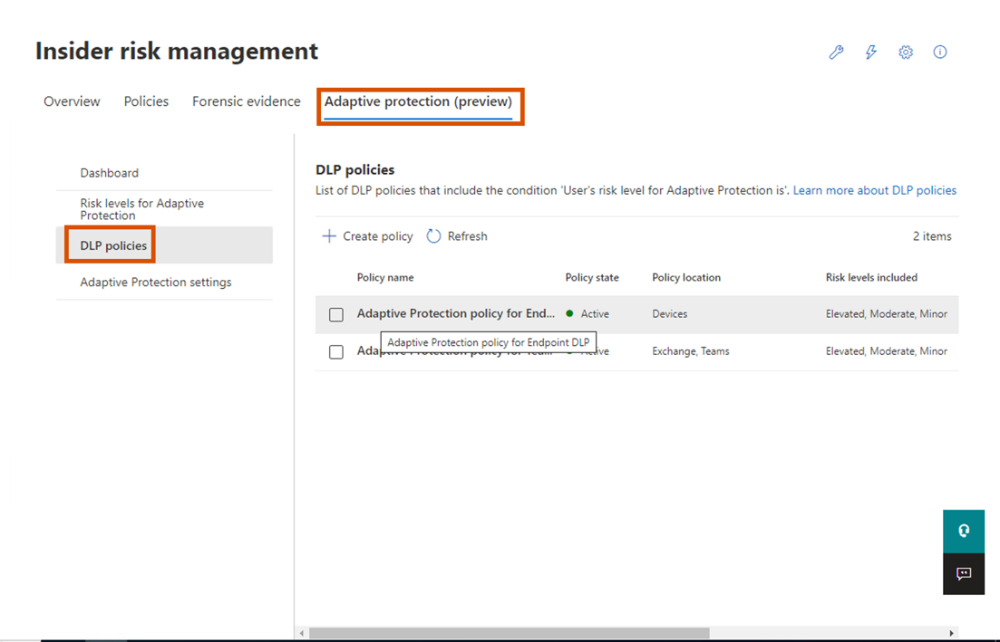

# Lab 8 – Esplorare le funzionalità della protezione adattiva

## Esercizio 1 – Impostazione della protezione adattiva

### Task 1 – Impostazione dei livelli di rischio per la protezione adattiva

1.  In Microsoft Edge, aprire una nuova finestra InPrivate Window,
    passare a `https://purview.microsoft.com` e accedere utilizzando il
    tenant amministratore.

2.  Dalla barra di spostamento passare a **Solutions \> Insider risk
    management**.

3.  Nella struttura di spostamento secondario selezionare **Adaptive
    Protection (Preview). **

Uno screenshot di un computer Descrizione generata automaticamente

4.  Poiché è stata utilizzata l'opzione di avvio rapido durante
    l'abilitazione della **Adaptive Protection**, è possibile
    visualizzare la creazione di 2 criteri DLP.

Uno screenshot di un computer Descrizione generata automaticamente

5.  Ora fare clic su **Risk levels for Adaptive Protection** dal
    sottomenu e dal menu a discesa selezionare ** Data leaks by a
    user**.

Immagine rotta

6.  In **Define conditions for risk levels**, selezionare **User
    performs at least 3 data exfiltration activities, each…** per
    rischio **Elevated**. Selezionare **User performs at least 2 data
    exfiltration activities, each…** per rischio **Moderate**.
    **Select User performs at least 1 data exfiltration activities,
    each…** per rischio **Minor**. Quindi fare clic su **Save**.

Immagine rotta

7.  Analogamente, è possibile personalizzare le condizioni per tutti i
    criteri disponibili in Insider risk management.

8.  Ora possiamo personalizzare la policy DLP per ogni livello.

### Attività 2 - Esplorazione dei criteri DLP predefiniti per ognuno dei livelli di rischio di

Protezione adattiva

1.  In Protezione adattiva, selezionare** DLP Polices** e selezionare
    **Adaptive Protection Policy for Endpoint DLP**.

Immagine rotta

2.  Selezionare **Edit**.

Uno screenshot dello schermo di un computer Descrizione generata
automaticamente con media sicurezza

3.  Fare clic su **Next** fino a raggiungere **Customize advanced DLP
    rules**.

Uno screenshot di un computer Descrizione generata automaticamente

4.  Controllare le regole e le condizioni stabilite per ogni livello di
    rischio. Fare clic su **Next**.

5.  Nella pagina  **Policy mode,** selezionare il pulsante di opzione
    accanto a **Turn it on right away**. Fare clic su **Next**.

Uno screenshot di un computer Descrizione generata automaticamente

6.  Selezionare **Submit**.

Uno screenshot di un computer Descrizione generata automaticamente

7.  Ripetere i passaggi per abilitare i criteri di protezione adattiva
    per Teams ed Exchange DLP.

8.  Al momento non creeremo alcuna regola o politica, ma puoi esplorare
    varie opzioni disponibili dopo aver completato il laboratorio.
