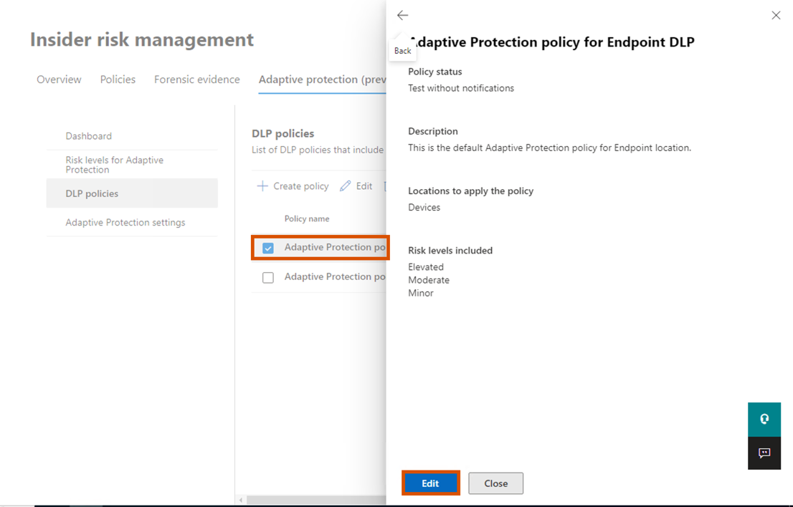
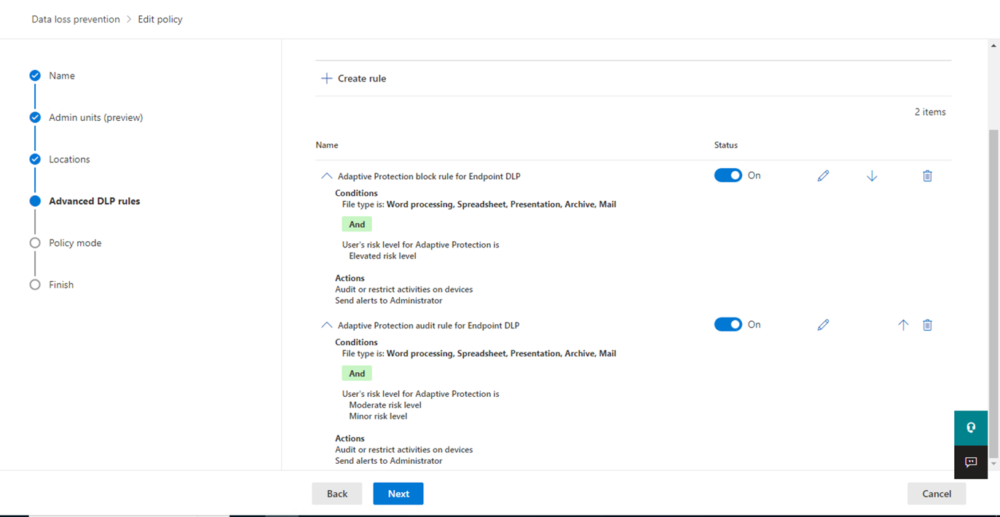
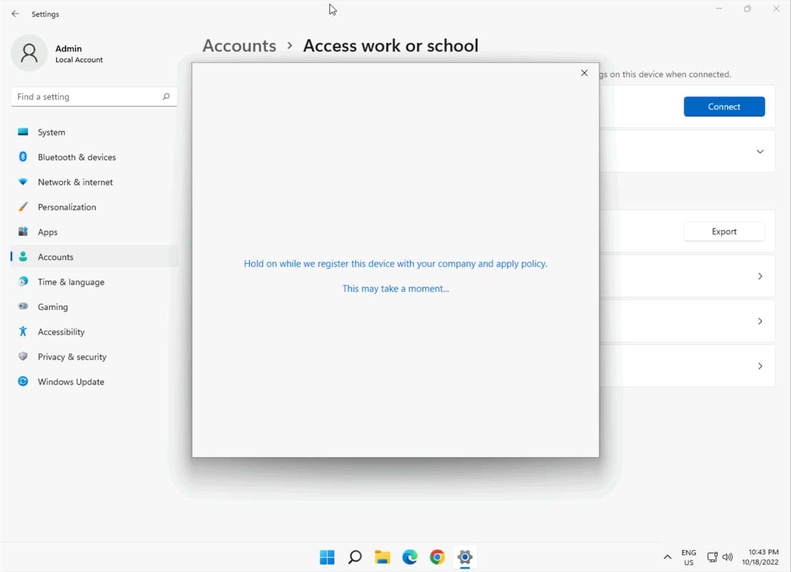
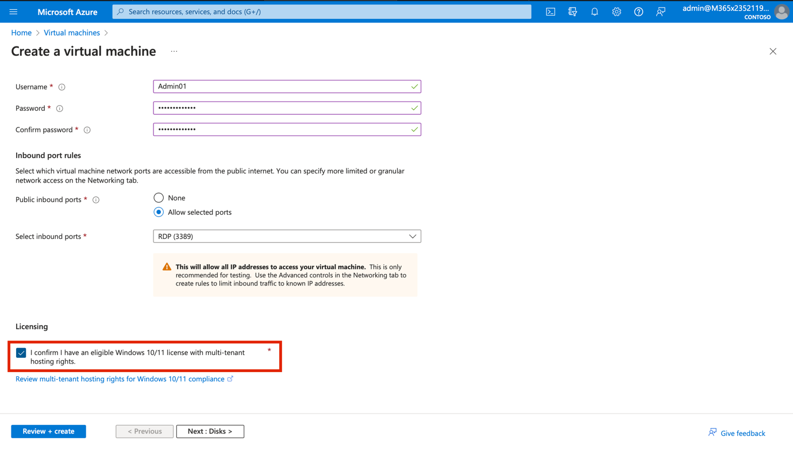

**实验室 8_配置信息屏障**

**介绍**

Contoso
有五个部门：*人力资源*、*销售*、*营销*、*研究*和*制造*。为了遵守行业法规，某些部门的用户不应与其他部门通信，如下表所示:

[TABLE]

对于此结构，Contoso 的计划包括三个 IB 策略:

1.  旨在防止销售人员与研究部门沟通的 IB 政策

2.  另一项防止研究与销售人员沟通的 IB 政策。

3.  IB 策略旨在仅允许制造部门与 HR 和营销部门进行沟通。

**目标**

- 使用 PowerShell 设置组织段以实现信息屏障 （IB） 。

- 在 Microsoft Teams 中启用范围目录搜索，以强制实施基于段的用户可见性。

- 通过 Microsoft Purview 门户和 PowerShell 创建信息屏障 （IB）
  策略，以控制段间通信。

- 应用配置的 IB 策略以跨部门强制实施通信限制。

**练习 1 – 先决条件**

**任务 1 – 为组织中的用户创建客户细分**

1.  右键单击 Windows 图标，然后导航并单击 **Windows
    PowerShell（Admin）**

1.  在“**User Account Control**”对话框中，单击“**Yes**”按钮。  

3\. 运行以下命令:

**+++Install-ModuleExchangeOnlineManagement+++**

4.  如果提示“**Do you want PowerShellGet to install and import the NuGet
    provider now?**”和“**Are you sure you want to install the modules
    from 'PSGallery'?**”，请键入 **y** 并按 Enter。

5.  执行以下命令.

**+++Import-Module ExchangeOnlineManagement+++**

6.  现在运行以下命令连接到 Exchange Online。

**+++Connect-IPPSSession+++**

7.  使用实验室环境主页上提供的 **MOD Administrator**凭据登录。 

**注意：**如果 **Automatically sign in to all desktop apps and websites
on this device?** 出现对话框，然后单击“**No, this app only**”按钮。

8.  在 **PowerShell** 中逐个运行以下命令 以创建组织结构。

**+++New-OrganizationSegment -Name"HR" -UserGroupFilter"Department -eq
'HR'"+++**

**+++New-OrganizationSegment -Name"Sales" -UserGroupFilter "Department
-eq 'Sales'"+++**

**+++New-OrganizationSegment -Name"Marketing" -UserGroupFilter
"Department -eq 'Marketing'"+++**

**+++New-OrganizationSegment -Name"Research" -UserGroupFilter
"Department -eq 'Research'"+++**

**+++** **New-OrganizationSegment -Name "Manufacturing" -UserGroupFilter
"Department -eq 'Manufacturing'"+++**

**任务 2 – 在 Microsoft Teams 中启用范围目录搜索**

打开按名称搜索

1.  转到 **+++https://admin.teams.microsoft.com+++**，转到 Microsoft
    Teams admin center选择 select **Teams** \> **Teams settings**。

2.  在“**Search by name**”下，在“**Scope directory search using an
    Exchange address book policy**”旁边，打开**On**。选择**Save**。 

3.  如果出现“**Changes might take some time to take
    effect**”对话框，然后单击“**Confirm**”按钮。

**练习 2 – 创建 IB 策略**

**任务 1 – 阻止段之间的通信**

1.  在 Microsoft Purview 门户中，单击“**Solutions**\> **Information
    barriers**”。

2.  在“Information
    Barriers”边栏选项卡中，单击“**Policies**”，然后选择“**Policies**”。在“策略”页上，选择“**+**
    **Create policy** ”以创建和配置新的 IB 策略。

3.  在“**Provide a policy name**”页的“Name”字段中，输入策略的名称 -
    **+++Sales-Research+++**.。然后，选择“**Next**”。

4.  在**Add assigned segment** 详细信息页上，选择“**Choose
    segment**”。在 “**Select assigned segment for this policy**
    ”窗格上，选择
    “**Sales**”。现在，选择“**Add**”将所选段添加到策略中。您只能选择一个区段。

5.  选择**Next**。

6.  在“**Configure** **Communication and collaboration
    details**”页下，选择“**Block**”。选择**Choose
    segment**，选择**Research**，然后选择 **Add**。

7.  在“**Communication and collaboration**”页上，在“**Communication and
    collaboration** ”字段中选择策略类型“Blocked”。选择**Next**。

8.  在“**Policy
    status**”页上，将活动策略状态切换为“**On**”。选择“**Next** ”继续。 

9.  在“**Review your
    settings** ”页上，查看为策略选择的设置以及针对所选内容的任何建议或警告。选择“**Edit**”以更改任何策略段和状态，或选择“**Submit** ”以创建策略。

10. 创建策略后，选择“**Done**”。

11. 销售研究IB政策已成功创建。

**任务 2 – 通过 PowerShell 创建 IB 策略**

1.  返回到 **Administrator: Windows PowerShell**并运行以下命令:

**+++Import-ModuleExchangeOnlineManagement+++**

2.  现在运行以下命令连接到 Exchange Online。

**+++Connect-IPPSSession+++**

3.  使用实验室环境主页上提供的 **MOD Administrator** 凭据登录。

**注意：**如果 **Automatically sign in to all desktop apps and websites
on this device?**出现对话框，然后单击“**No, this app only**”按钮。

4.  运行以下命令以创建名为 **Research-Sales** 的 IB
    策略。当此策略处于活动状态并应用时，它将有助于防止**Research**细分中的用户与**Sales**细分中的用户通信。

**+++New-InformationBarrierPolicy -Name "Research-Sales" -AssignedSegment "Research" -SegmentsBlocked "Sales" -StateInactive+++**

5.  运行以下命令以创建名为 **Manufacturing-HRMarketing** 的 IB
    策略。当此策略处于活动状态并应用时，**Manufacturing**只能与 **HR**
    和 **Marketing** 进行通信。人力资源和营销不受与其他部门沟通的限制。

**+++New-InformationBarrierPolicy -Name "Manufacturing-HRMarketing"-AssignedSegment "Manufacturing"-SegmentsAllowed"HR","Marketing","Manufacturing"-State Inactive+++**

6.  返回 Microsoft Purview 门户，刷新“Information Barriers –
    Policies”页，你将能够看到使用 PowerShell 创建的策略。

**练习 3 – 应用 IB 策略**

1.  在“**Information Barriers**”左侧窗格中，导航并单击“**Policy
    applications**”。在“Policy application”页面中，单击“**Apply all
    policies**”。

**总结：**

在本实验室中，你使用 PowerShell 创建了组织细分
（HR、销售、营销、研究和制造） ，并在 Microsoft Teams
中启用了作用域目录搜索，以使用户可见性与细分限制保持一致。然后，在
Microsoft Purview 中配置 IB 策略以阻止或允许特定细分之间的通信
（例如，阻止销售人员与研究） 通信。这些策略是通过门户和 PowerShell
创建的，用于动手实践。最后，您应用了策略来激活和强制实施组织内定义的通信限制。
