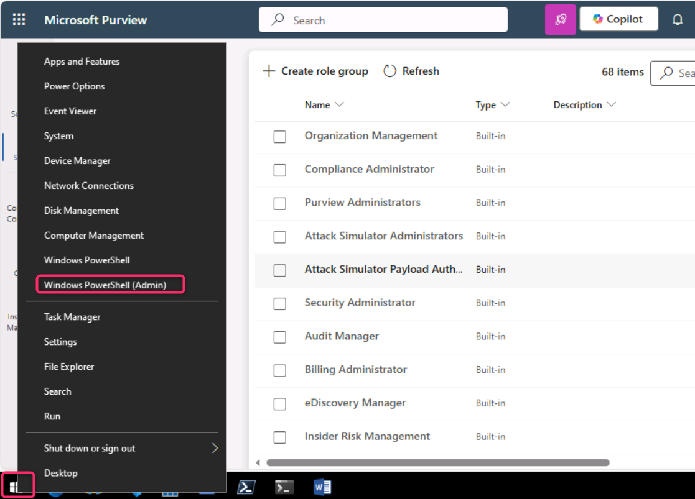
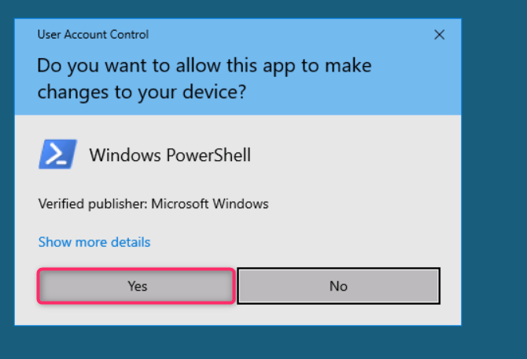
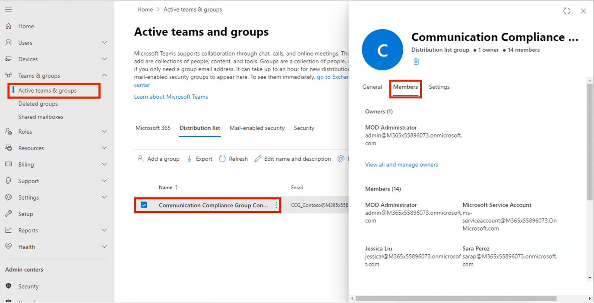
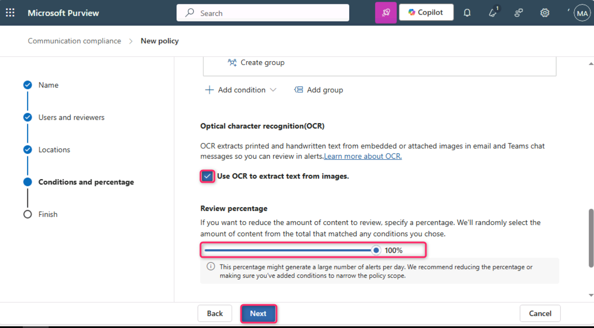
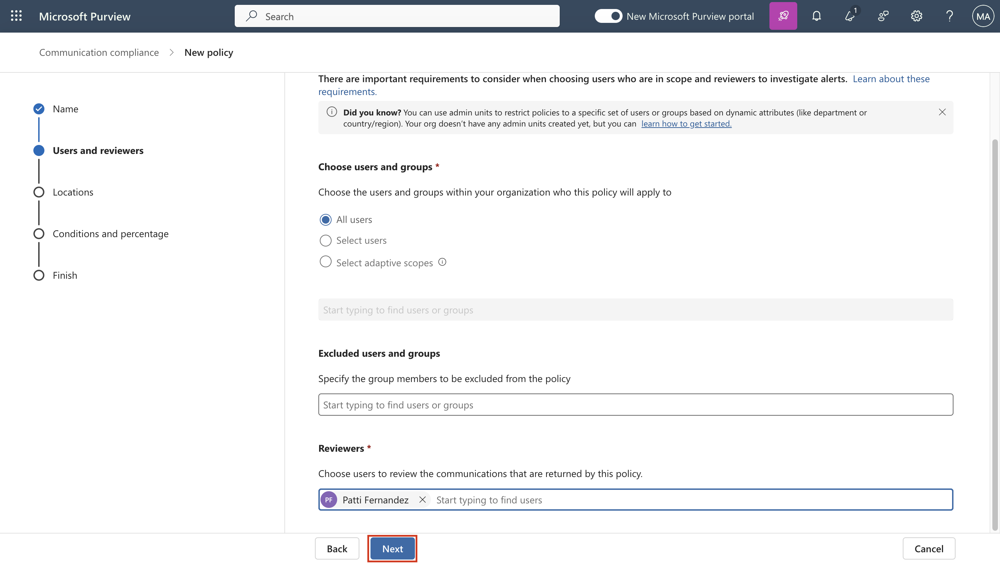

# Lab 9 – Konfigurieren der Kommunikationscompliance

## Ziel:

In diesem Lab konfigurieren Sie eine Konformitätsrichtlinie, um
vertrauliche Informationen zu erkennen, die von den Benutzern in Ihrer
Organisation kommuniziert werden. Sie verwenden die Typen vertraulicher
Informationen, die im vorherigen Lab erstellt wurden, um die
Gesundheitsdaten der Mitarbeiter oder die Mitarbeiter-IDs zu erkennen,
die über E-Mails übermittelt werden.

## Übung 1 – Aktivieren von Berechtigungen für die Kommunikationscompliance

In dieser Aufgabe weisen Sie Benutzer bestimmten Rollengruppen zu, um
Kommunikation, Compliance, Zugriff und Zuständigkeiten zwischen
verschiedenen Benutzern in Ihrer Organisation zu segmentieren.

1.  Wenn das Azure Purview-Portal geöffnet ist, fahren Sie mit Schritt 2
    fort, andernfalls öffnen Sie das
    `https://purview.microsoft.com, `und melden Sie sich mit den
    Anmeldeinformationen des **MOD-Administrators** an.

&nbsp;

1.  Wählen Sie in der Navigation **Settings** aus, und wählen Sie unter
    Role Groups die Option **Role Groups** aus, wählen Sie
    **Communication Compliance** aus. Wählen Sie dann **Edit** aus.
    Wählen Sie im Seitenbereich erneut **Edit** aus.

*Ein Screenshot einer automatisch generierten Computerbeschreibung.*

3.  Wählen Sie in der **Edit members of the role group** die Option
    **Choose Users** aus**.**

*Ein Screenshot einer automatisch generierten Computerbeschreibung.*

4.  Stellen Sie sicher, dass Sie **MOD-Administrator**, **Megan Bowen**
    und **Patti Fernandez** auswählen. Wählen Sie dann **Select**.

5.  Wählen Sie **Next** aus.

Ein Screenshot einer automatisch generierten Computerbeschreibung.

6.  Wählen Sie **Save** aus, um die Benutzer der Rollengruppe
    hinzuzufügen. Wählen Sie **Done** aus, um die Schritte
    abzuschließen.

Ein Screenshot einer automatisch generierten Computerbeschreibung. 

Ein Screenshot einer automatisch generierten Computerbeschreibung.

## Übung 2 – Einrichten von Gruppen für die Kommunikationscompliance

In der Richtlinie verwenden Sie E-Mail-Adressen, um Einzelpersonen oder
Personengruppen zu identifizieren. Um die Einrichtung zu vereinfachen,
können Sie Gruppen für Personen erstellen, deren Kommunikation überprüft
wird, und Gruppen für Personen, die diese Kommunikation überprüfen.

Sie können PowerShell verwenden, um eine Verteilergruppe für eine
globale Kommunikationskonformitätsrichtlinie für die zugewiesene Gruppe
zu konfigurieren. Auf diese Weise können Sie Nachrichten für Tausende
von Benutzern mit einer einzigen Richtlinie erkennen und die Richtlinie
zur Einhaltung der Kommunikation aktualisieren, wenn neue Mitarbeiter
Ihrer Organisation beitreten.

1.  Öffnen Sie **PowerShell** im Administratormodus.

2.  Geben Sie das folgende Cmdlet ein, um das **Exchange Online
    PowerShell-Modul** zu verwenden und eine Verbindung mit Ihrem
    Mandanten herzustellen:

`Connect-ExchangeOnline`

Text Beschreibung wird automatisch generiert

3.  Wenn das Sign In Fenster angezeigt wird, melden Sie sich als
    **MOD-Administrator** an.

4.  Erstellen Sie eine dedizierte Verteilergruppe für Ihre globale
    Kommunikationskonformitätsrichtlinie mit den folgenden
    Eigenschaften:

    - **MemberDepartRestriction = Closed**. Stellt sicher, dass Benutzer
      sich nicht selbst aus der Verteilergruppe entfernen können.

    - **MemberJoinRestriction = Closed**. Stellt sicher, dass Benutzer
      sich nicht selbst zur Verteilergruppe hinzufügen können.

    - **ModerationEnabled = True**. Stellt sicher, dass alle
      Nachrichten, die an diese Gruppe gesendet werden,
      genehmigungspflichtig sind und dass die Gruppe nicht für die
      Kommunikation außerhalb der Konfiguration der
      Kommunikationskonformitätsrichtlinie verwendet wird.

`New-DistributionGroup -Name "Communication Compliance Group Contoso" -Alias "CCG_Contoso" -MemberDepartRestriction 'Closed' -MemberJoinRestriction 'Closed' -ModerationEnabled $true`

**Anmerkung:** Sie können ein **Exchange Custom Attribute** wie im
**folgenden Befehl hinzufügen**, um Benutzer nachzuverfolgen, die der
Richtlinie für die Kommunikationscompliance in Ihrer Organisation
hinzugefügt wurden.

`Set-DistributionGroup -Identity "Communication Compliance Group Contoso"-CustomAttribute1 "MonitoredCommunication"`

*Ein Screenshot einer automatisch generierten Computerbeschreibung.*

5.  Führen Sie das folgende PowerShell-Skript nach einem wiederkehrenden
    Zeitplan aus, um Benutzer zur Richtlinie für die
    Kommunikationscompliance hinzuzufügen:

&nbsp;

    $Mbx = (Get-Mailbox -RecipientTypeDetails UserMailbox -ResultSize Unlimited -Filter {CustomAttribute9 -eq $Null})
    $i = 0
    ForEach ($M in $Mbx)
    {
    Write-Host "Adding" $M.DisplayName
    Add-DistributionGroupMember -Identity "Communication Compliance Group Contoso" -Member $M.DistinguishedName -ErrorAction SilentlyContinue
    Set-Mailbox -Identity $M.Alias -CustomAttribute1 "MonitoredCommunication"
    $i++
    }
    Write-Host $i "Mailboxes added to supervisory review distribution group."

**Anmerkung:** Dieses Skript soll nach jedem bestimmten Intervall
ausgeführt werden. Ab sofort können Sie die Verteilerliste unter Aktive
Teams und Gruppen im Microsoft 365 Admin Center sehen.

Wenn Sie auf den Gruppennamen klicken, können Sie alle Benutzer sehen,
die auf der Registerkarte Mitglieder aufgelistet sind.

## Übung 3 – Erstellen einer Kommunikationscompliancerichtlinie

1.  Wenn das Microsoft Purview-Complianceportal geöffnet ist, fahren Sie
    mit Schritt 2 fort, andernfalls öffnen Sie das
    `https://purview.microsoft.com, `und melden Sie sich als
    **MOD-Administrator** an.

&nbsp;

1.  Wählen Sie im Azure Purview-Portal die Option **Solutions** \>
    **Communication compliance** aus.

&nbsp;

1.  Wählen Sie in der Unternavigation die Option **Policy** aus. Wählen
    Sie dann **Create Policy** aus.

*Ein Screenshot einer automatisch generierten Computerbeschreibung.*

4.  Wählen Sie **Custom Policy** aus der Dropdown-Liste aus.

5.  Auf der Name your DLP policy Seite, geben Sie
    `My first communication compliance policy` im **Name** Feld ein und
    `This is a policy to test communication compliance` im
    **Description** Feld ein. Wählen Sie dann **Next** aus.

Grafische Benutzeroberfläche, Text, Anwendung Beschreibung wird
automatisch generiert

1.  Behalten Sie auf der Seite **Choose supervised users and reviewers**
    die restlichen Standardeinstellungen bei, und fügen Sie unter
    Überprüfungen **Patti Fernandez** hinzu. Klicken Sie dann auf
    **Next**.

*Ein Screenshot einer automatisch generierten Computerbeschreibung.*

7.  Auf der **Communications** Seite, aktivieren Sie alle Kästchen unter
    **Microsoft 365 Locations** und klicken Sie auf **Next**.

*Ein Screenshot einer automatisch generierten Computerbeschreibung.*

1.  Wählen Sie unter **Choose conditions and review percentage** die
    Option **Add condition** aus, und wählen Sie in der Dropdownliste
    die Option **Content contains any of these sensitive info types**
    aus.

*Ein Screenshot einer automatisch generierten Computerbeschreibung.*

1.  Wählen Sie im Feld **Content contains any of these sensitive info
    types** die Option **Add** aus, klicken Sie auf **Sensitive info
    types**, und suchen Sie nach **Contoso**. Aktivieren Sie die
    Kontrollkästchen für alle Typen vertraulicher Informationen, die wir
    in früheren Labs erstellt haben. Klicken Sie dann auf **Add.**

Grafische Benutzeroberfläche, Text, Anwendung Beschreibung wird
automatisch generiert

1.  Aktivieren Sie unter **Bedingungen und Überprüfungsprozentsatz
    auswählen** das Kontrollkästchen neben **Use OCR to extract text
    from images**, legen Sie **den Review percentage to 100%**, fest,
    und klicken Sie dann auf **Next**.

Grafische Benutzeroberfläche, Anwendung Beschreibung wird automatisch
generiert

11. Wählen Sie auf der Seite **Review and finish** die Option **Create
    Policy** aus.

Grafische Benutzeroberfläche, Text, Anwendung Beschreibung wird
automatisch generiert

12. Die Seite **Your policy was created** wird mit Richtlinien
    angezeigt, wann die Richtlinie aktiviert wird und welche
    Kommunikationen erfasst werden.

Grafische Benutzeroberfläche, Text, Anwendung Beschreibung wird
automatisch generiert

## Übung 4 – Bearbeiten einer Kommunikationscompliancerichtlinie

1.  Wenn das Microsoft Purview-Complianceportal geöffnet ist, fahren Sie
    mit Schritt 2 fort, andernfalls öffnen Sie die
    `https://purview.microsoft.com,` und melden Sie sich als
    **MOD-Administrator** an.

&nbsp;

1.  Wechseln Sie im Azure Purview-Portal zu **Settings** \>
    **Communication compliance** \> **Policies**, wählen Sie die drei
    Punkte neben **My first communication compliance policy** aus, und
    wählen Sie **Edit** aus.

*Ein Screenshot einer automatisch generierten Computerbeschreibung.*

3.  Lassen Sie das Feld **Name and describe your policy** leer und
    klicken Sie auf **Next**.

Grafische Benutzeroberfläche, Text, Anwendung Beschreibung wird
automatisch generiert

1.  Wählen Sie unter **Choose supervised user and reviewers** und unter
    **Supervised users and groups** die Schaltfläche **Select users**
    aus.

Grafische Benutzeroberfläche, Anwendung, Teams Beschreibung automatisch
generiert

1.  Suchen Sie unter **Start typing to find users or groups**, suchen
    Sie nach **Communication,** und wählen Sie **Communication
    Compliance Groups Contoso** aus.

6.  Auf Choose supervised user und reviewers unter Reviewers fügen Sie
    MOD-Administrator zu den Reviewers hinzu.

Grafische Benutzeroberfläche, Anwendung, Teams Beschreibung automatisch
generiert

7.  Wählen Sie **Next** aus, bis Sie die Seite **Review and Finish**
    erreichen.

8.  Klicken Sie auf **Save**.

## Übung 5 – Erstellen von Hinweisvorlagen und Konfigurieren der Benutzeranonymisierung

1.  Wählen Sie im Azure Purview-Portal in der oberen rechten Ecke
    Einstellungen aus, und wählen Sie dann **Communication compliance**
    aus.

1.  Wählen Sie die Registerkarte **Privacy** aus. Um die Anonymisierung
    zu aktivieren, stellen Sie sicher, dass **Show anonymized versions
    of usernames** ausgewählt ist. Wählen Sie **Save** aus.

*Ein Screenshot einer automatisch generierten Computerbeschreibung*

3.  Navigieren Sie zur Registerkarte **Notice templates** und wählen Sie
    dann **Create** **Notice templates** aus.

4.  Füllen Sie auf der Seite **Modify a notice template** die folgenden
    Felder aus:

    - Name der Vorlage (erforderlich): `Sample Notice`

    1.  Senden von (erforderlich): Wählen Sie **Patti Fernandez** aus,
        indem Sie **Patti** eingeben und den Namen aus der
        Dropdown-Liste auswählen.

    - Cc (optional): Wählen Sie **MOD-Administrator** aus, indem Sie
      **MOD** eingeben und den Namen aus der Dropdown-Liste auswählen.

    - Betreff
      (erforderlich): `Your communication violets company Communication compliance policy.`

    - Nachrichtentext
      (erforderlich): `Please note this for future reference and provide an acceptable justification for your current communication.`

5.  Wählen Sie **Create** aus, um die Hinweisvorlage zu erstellen und zu
    speichern.

## *Ein Screenshot einer automatisch generierten Computerbeschreibung* 

## Übung 6 – Testen Ihrer Kommunikationscompliancerichtlinie

Im Testkonto haben Sie nicht die Berechtigung, E-Mails zu senden, aber
Sie können die folgenden Schritte ausführen, um zu verstehen, wie Sie
die Richtlinie testen können, wenn Sie über Ihre eigenen Lizenzen
verfügen. Sie können Schritte ausführen, aber Ihre E-Mail kann den
Empfänger Ihres aktuellen Mieters nicht erreichen.

1.  Öffnen Sie Outlook, indem Sie zu
    `https://outlook.office365.com/mail/ `wechseln und sich mit dem
    Benutzernamen `adelev@{TENANTPREFIX``}. onmicrosoft.com` und dem
    Benutzerkennwort anmelden.

&nbsp;

1.  Senden Sie eine E-Mail an Ihr persönliches E-Mail-Konto mit dem
    folgenden Nachrichtentext.

Message
body: `Employee Patti Fernandez EMP123456 is on absence because of the flu/influenza`

**Anmerkung:** Es kann ungefähr 24 Stunden dauern, bis
E-Mail-Nachrichten in einer Richtlinie vollständig verarbeitet werden.
Die Kommunikation in Microsoft Teams, Yammer und Plattformen von
Drittanbietern kann etwa 48 Stunden dauern, bis sie vollständig in einer
Richtlinie verarbeitet wird.

Melden Sie sich in `https://purview.microsoft.com/` als **Patti
Fernandez** an. Navigieren Sie zu **Communication
compliance** \> **Alerts**, um die Warnungen für Ihre Richtlinien nach
24 Stunden anzuzeigen.

**Zusammenfassung:**

In diesem Lab haben wir gelernt, wie Sie die Berechtigungen für die
Kommunikationscompliance aktivieren, die Richtlinien erstellen,
verwalten und dann Benachrichtigungsvorlagen erstellen und die
Benutzeranonymisierung konfigurieren.
