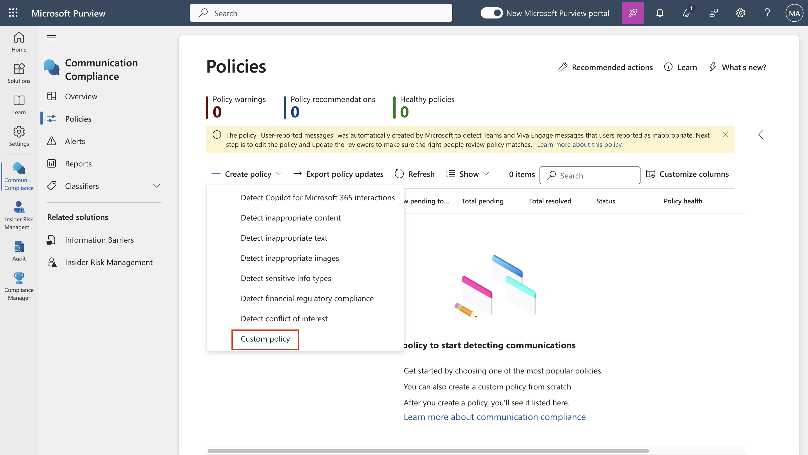

# 實驗 9 – 配置通信合規性

## 目的:

在本實驗中，您將配置合規性策略，以檢測組織中用戶傳達的任何敏感信息。您將使用在前面的實驗室中創建的敏感信息類型來檢測通過電子郵件傳達的員工健康數據或員工
ID。

## 練習 1 - 啓用通信合規性權限

在此任務中，您將用戶分配到特定角色組，以對組織中不同用戶之間的通信合規性、訪問權限和職責進行分段。

1.  如果 Microsoft Purview 門戶已打開，請繼續執行步驟 2，否則，請打開
    `https://purview.microsoft.com` 幷使用 **MOD Administrator**
    憑據登錄。

2.  在導航中，選擇 **Settings**，然後選擇 **Role groups**，在 **Role
    groups** 下，選擇Communication Compliance。然後選擇
    **Edit**。在側窗格中，再次選擇 **Edit**。

自動生成的計算機 Description 的屏幕截圖

3.  在 **Edit members of the role group** 上，選擇 **Choose Users** 。

自動生成的計算機 Description 的屏幕截圖

4.  確保選擇 **MOD Administrator**、**Megan Bowen** 和 **Patti
    Fernandez**。然後選擇 **Select**。

5.  選擇 **Next**。

自動生成的計算機 Description 的屏幕截圖

6.  選擇 **Save** 將用戶添加到角色組。選擇 **Done** 以完成這些步驟。

自動生成的計算機 Description 的屏幕截圖

自動生成的計算機 Description 的屏幕截圖

## 練習 2 - 設置通信合規性組

在該策略中，您將使用電子郵件地址來識別個人或人群。爲了簡化設置，您可以爲審核其通信的人員創建組，幷爲審核這些通信的人員創建組。

可以使用 PowerShell
爲分配的組配置全域通信合規性策略的通訊組。這使您能够使用單個策略檢測數千個用戶的消息，幷在新員工加入組織時保持通信合規性策略更新。

1.  在管理員模式下打開 **PowerShell**。

2.  輸入以下 cmdlet 以使用 **Exchange Online PowerShell**
    模塊幷連接到您的租戶：

`Connect-``ExchangeOnline`

自動生成文本描述

3.  當顯示 **Sign in** 窗口時，以 **MOD Administrator 身份登錄**。

4.  使用以下屬性爲全域通信合規性策略創建專用通訊組:

    - **MemberDepartRestriction =
      Closed**。確保用戶無法將自己從通訊組中删除。

    - **MemberJoinRestriction = Closed**確保用戶無法將自己添加到通訊組。

    - **ModerationEnabled =
      True**。確保發送到此組的所有消息都需要審批，幷且該組不用于通信合規性策略配置之外的通信。

`New-``DistributionGroup`` -Name "Communication Compliance Group Contoso" -Alias "``CCG_Contoso``" -``MemberDepartRestriction`` 'Closed' -``MemberJoinRestriction`` 'Closed' -``ModerationEnabled`` $true`

**注意：**可以按  **following command** 添加 **Exchange Custom
Attribute**，以跟踪添加到組織中通信合規性策略的用戶。

`Set-``DistributionGroup`` -Identity "Communication Compliance Group Contoso"-CustomAttribute1 "``MonitoredCommunication``"`

自動生成的計算機描述的屏幕截圖

5.  按定期計劃運行以下 PowerShell 脚本，將用戶添加到通信合規性策略：

&nbsp;

    $Mbx = (Get-Mailbox -RecipientTypeDetails UserMailbox -ResultSize Unlimited -Filter {CustomAttribute9 -eq $Null})
    $i = 0
    ForEach ($M in $Mbx)
    {
    Write-Host "Adding" $M.DisplayName
    Add-DistributionGroupMember -Identity "Communication Compliance Group Contoso" -Member $M.DistinguishedName -ErrorAction SilentlyContinue
    Set-Mailbox -Identity $M.Alias -CustomAttribute1 "MonitoredCommunication"
    $i++
    }
    Write-Host $i "Mailboxes added to supervisory review distribution group."

**注意：**此脚本應該在每個特定間隔後運行。截至現在，您將能够在Microsoft
365 admin中心的活躍團隊和組下看到分發列表。

如果單擊組名稱，您將能够看到 members 選項卡下列出的所有用戶。

## 練習 3 - 創建通信合規性策略

1.  如果 **Microsoft Purview** 合規門戶已打開，請繼續執行步驟
    2，否則，請打開 `https://purview.microsoft.com` 幷以 **MOD
    Administrator** 身份登錄。

2.  在 Microsoft Purview 門戶中，選擇 **Soltions** \> **Communication
    compliance**。

3.  從子導航中選擇，選擇 **Policy**。然後選擇 **Create policy**。

自動生成的計算機 Description 的屏幕截圖

4.  從下拉列表中選擇 **Custom policy**。

5.  在 “命名 DLP 策略 ”頁上，在 ` `**Name** 字段中鍵入 My first
    communication compliance policy，幷在  **Description** 字段中鍵入
    This is a policy to test communication compliance。選擇 **Next**。

自動生成圖形用戶界面、文本、應用程序描述

6.  在 **Choose supervised users and
    reviewers**頁面上，保留其餘的默認設置，幷在 “審閱” 下添加 **Patti
    Fernandez**。然後點擊 **Next**。

自動生成的計算機 Description 的屏幕截圖

7.  在 **communications**頁面上，選中 **Microsoft 365 locations**
    下的所有框，然後單擊 **Next**。

自動生成的計算機 Description 的屏幕截圖

8.  在 ** Choose conditions and review percentage** 上，選擇 **Add
    condition**，從下拉列表中選擇 **Content contains any of these
    sensitive info types**。

自動生成的計算機屏幕描述的屏幕截圖

9.  在  **Content contains any of these sensitive info types**
    框中，選擇 ** Add**，單擊 ** Sensitive info types**，然後搜索
    **contoso**。選中我們在早期實驗室中創建的所有敏感信息類型的框。然後單擊
    **Add**

自動生成圖形用戶界面、文本、應用程序描述

10. 在 **Choose conditions and review percentage** 上，選中 **Use OCR to
    extract text from images** 旁邊的框，將 ** Review percentage to
    100%，**然後單擊 Next。

圖形用戶界面，自動生成應用程序描述

11. 在 **Review and finish**頁面上，選擇 **Create policy**。

自動生成圖形用戶界面、文本、應用程序描述

12. 系統會顯示 **Your policy was
    created**頁面，其中包含有關何時激活政策以及將捕獲哪些通信的指南。

自動生成圖形用戶界面、文本、應用程序描述

## 練習 4 - 編輯通信合規性策略

1.  如果 Microsoft Purview 合規門戶已打開，請繼續執行步驟
    2，否則，請打開 `https://purview.microsoft.com` 幷以 **MOD
    Administrator**身份登錄。

2.  在 Microsoft Purview 門戶中，轉到 **Settings \> Communication
    compliance \> Policies**，選擇 **My first communication compliance
    policy** 旁邊的三個點 ，然後選擇 **Edit**。

自動生成的計算機 Description 的屏幕截圖

3.  將 **Name and description your policy** 留空，然後單擊 **Next**。

自動生成圖形用戶界面、文本、應用程序描述

4.  在 **Choose supervised user and reviewers** 和 **Supervised
    users and groups下**，選擇  **Select users** 按鈕。

自動生成圖形用戶界面、應用程序、Teams 描述

5.  在 **Start typing to find users or groups** 中，搜索
    **Communication **，然後選擇 ** Communication Compliance Groups
    Contoso**。

6.  在 Choose supervised user and reviewers上，在 Reviewers下，將 MOD
    Administrator 添加到 Reviewers。

自動生成圖形用戶界面、應用程序、Teams 描述

7.  選擇 **Next**，直到到達 **Review and finish** 頁面。

8.  點擊 **Save**。

## 練習 5 – 創建通知模板幷配置用戶匿名化

1.  在 Microsoft Purview 門戶中，選擇右上角的 Settings，然後選擇
    **Communication compliance**。

2.  選擇 Privacy 選項卡。要啓用匿名化，請確保選中 **Show anonymized
    versions of username。**選擇 **Save**。

自動生成的計算機 Description 的屏幕截圖

3.  導航到 **Notice templates** 選項卡，然後選擇 **Create notice
    template**。

4.  在 **Modify a notice template** 頁面上，填寫以下字段：

    - 模板名稱 （必填）: 樣品通知

    - 發送自 （必填）: 通過鍵入 **Patti** 幷從下拉列表中選擇姓名來選擇
      **Patti Fernandez。**

    - CC（可選）: 通過鍵入 MOD 幷從下拉列表中選擇名稱來選擇 MOD
      administrator。

    - 主題 （必填）：你的通信違反了公司的通信合規性策略。

    - 消息正文
      （必填）：請記下這一點以備將來參考，幷爲您當前的通信提供可接受的理由。

5.  選擇 **Create** 以創建幷保存通知模板。

自動生成的計算機 Description 的屏幕截圖

## 練習 6 - 測試通信合規性策略

在試用帳戶中，您將無權發送任何電子郵件，但可以查看以下步驟，瞭解如何在擁有自己的許可證時測試策略。您可以執行步驟，但您的郵件將無法從當前租戶到達收件人。

1.  轉到 https://outlook.office365.com/mail/ 打開
    Outlook，然後使用用戶名 `adelev``@{TENANTPREFIX}.``onmicrosoft.com`
    和用戶密碼登錄。

2.  向您的個人電子郵件賬戶發送一封電子郵件，其中包含以下郵件正文。

消息正文: `Employee Patti Fernandez EMP123456 ``is on absence`` because of the flu/influenza`

**注意** 電子郵件可能需要大約 24 小時才能在策略中完全處理。Microsoft
Teams、Yammer 和第三方平臺中的通信可能需要大約 48
小時才能在策略中完全處理。

以 `Patti Fernandez`` ``的身份`登錄
https://purview.microsoft.com/。導航到 **Communication
compliance \> Alerts** ，在 24 小時後查看策略的警報。

**總結:**

在本實驗中，我們學習了如何啓用通信合規性權限、創建策略、管理策略，然後創建通知模板幷配置用戶匿名化。
