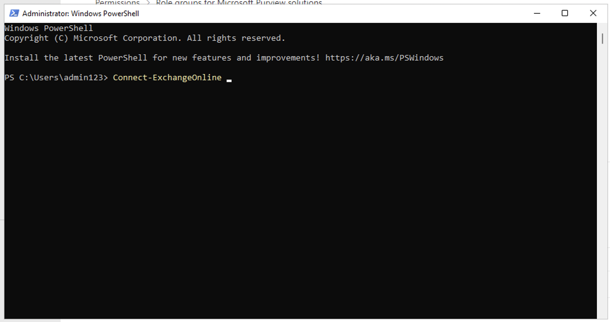

# Atelier 9 – Configuration de la conformité des communications

## Objectif :

Dans cet atelier, vous allez configurer une politique de conformité pour
détecter toute information sensible communiquée par les utilisateurs de
votre organisation. Vous utiliserez les types d'informations sensibles
créés dans l'atelier précédent pour détecter les données de santé des
employés ou les identifiants des employés communiqués par e-mail.

## Exercice 1 – Activation des autorisations pour la conformité des communications

Dans cette tâche, vous allez affecter des utilisateurs à des groupes de
rôles spécifiques afin de segmenter la communication, la conformité,
l'accès et les responsabilités entre les différents utilisateurs de
votre organisation.

1.  Si le portail Microsoft Purview est ouvert, passez à l'étape 2,
    sinon ouvrez le `https://purview.microsoft.com` et connectez-vous
    avec les informations d'identification de **MOD Administrator**.

2.  Dans la navigation, sélectionnez **Settings**, puis **Role groups**
    sous **Role groups**, sélectionnez **Communication Compliance**.
    Sélectionnez ensuite **Edit**. Dans le volet latéral, sélectionnez à
    nouveau **Edit**.

Une capture d'écran d'un ordinateur Description générée automatiquement

3.  Dans Modifier les **Edit members of the role group**, sélectionnez
    **Choose Users**.

Une capture d'écran d'un ordinateur Description générée automatiquement

4.  Assurez-vous de sélectionner **MOD Administrator, Megan Bowen** et
    **Patti Fernandez**. Choisissez ensuite **Sélect**.

5.  Sélectionnez **Next**.

Une capture d'écran d'un ordinateur Description générée automatiquement

6.  Sélectionnez **Save** pour ajouter les utilisateurs au groupe de
    rôles. Sélectionnez **Done** pour terminer les étapes.

Une capture d'écran d'un ordinateur Description générée automatiquement

Une capture d'écran d'un ordinateur Description générée automatiquement

## Exercice 2 – Mise en place de groupes pour la conformité de la communication

Dans la politique, vous utiliserez les adresses e-mail pour identifier
des individus ou des groupes de personnes. Pour simplifier votre
configuration, vous pouvez créer des groupes pour les personnes dont la
communication est examinée et des groupes pour les personnes qui
examinent ces communications.

Vous pouvez utiliser PowerShell pour configurer un groupe de
distribution pour une stratégie de conformité de communication globale
pour le groupe attribué. Cela vous permet de détecter les messages de
milliers d'utilisateurs à l'aide d'une seule stratégie et de maintenir
la politique de conformité des communications à jour lorsque de nouveaux
employés rejoignent votre organisation.

1.  Ouvrez **PowerShell** en mode administrateur.

2.  Entrez l'applet de commande suivante pour utiliser le **Exchange
    Online PowerShell** et vous connecter à votre locataire :

`Connect-``ExchangeOnline`

Description textuelle générée automatiquement

3.  Lorsque la fenêtre **Sign in** s'affiche, connectez-vous en tant que
    **MOD Administrator**.

4.  Créez un groupe de distribution dédié pour votre stratégie de
    conformité des communications globales avec les propriétés suivantes
    :

    - **MemberDepartRestriction = Closed**. Garantit que les
      utilisateurs ne peuvent pas se supprimer du groupe de
      distribution.

    - **MemberJoinRestriction = Closed**. Garantit que les utilisateurs
      ne peuvent pas s'ajouter eux-mêmes au groupe de distribution.

    - **ModerationEnabled = True**. S'assure que tous les messages
      envoyés à ce groupe sont soumis à approbation et que le groupe
      n'est pas utilisé pour communiquer en dehors de la configuration
      de la stratégie de conformité de communication.

`New-``DistributionGroup`` -Name "Communication Compliance Group Contoso" -Alias "``CCG_Contoso``" -``MemberDepartRestriction`` 'Closed' -``MemberJoinRestriction`` 'Closed' -``ModerationEnabled`` $true`

**Remarque :** Vous pouvez ajouter un **Exchange Custom Attribute**
comme dans la **following command** pour suivre les utilisateurs ajoutés
à la stratégie de conformité de communication dans votre organisation.

`Set-``DistributionGroup`` -Identity "Communication Compliance Group Contoso"-CustomAttribute1 "``MonitoredCommunication``"`

Une capture d'écran d'un ordinateur Description générée automatiquement

5.  Exécutez le script PowerShell suivant selon une planification
    récurrente pour ajouter des utilisateurs à la stratégie de
    conformité de communication :

6.  $Mbx = (Get-Mailbox -RecipientTypeDetails UserMailbox -ResultSize Unlimited -Filter {CustomAttribute9 -eq $Null})
        $i = 0
        ForEach ($M in $Mbx)
        {
        Write-Host "Adding" $M.DisplayName
        Add-DistributionGroupMember -Identity "Communication Compliance Group Contoso" -Member $M.DistinguishedName -ErrorAction SilentlyContinue
        Set-Mailbox -Identity $M.Alias -CustomAttribute1 "MonitoredCommunication"
        $i++
        }
        Write-Host $i "Mailboxes added to supervisory review distribution group."

**Remarque :** Ce script est censé être exécuté après chaque intervalle
particulier. À partir de maintenant, vous pourrez voir la liste
Distribution sous Équipes et groupes actifs dans le Centre
d'administration Microsoft 365.

Si vous cliquez sur le nom du groupe, vous pourrez voir tous les
utilisateurs répertoriés sous l'onglet membres.

## Exercice 3 – Création d'une politique de conformité de la communication

1.  Si le portail de conformité Microsoft Purview est ouvert, passez à
    l'étape 2, sinon ouvrez le `https://purview.microsoft.com` et
    connectez-vous en tant que **MOD Administrator**.

2.  Dans le portail Microsoft Purview, sélectionnez **Solutions \>
    Communication compliance**.

3.  Sélectionnez dans la sous-navigation, sélectionnez **Policy**.
    Sélectionnez ensuite **Create policy**.

Une capture d'écran d'un ordinateur Description générée automatiquement

4.  Sélectionnez **Custom policy** dans la liste déroulante.

5.  Sur la page Nommez votre stratégie DLP, tapez
    `Ma première stratégie de conformité de communication` dans le champ
    **Name** et
    `Il s'agit d'une stratégie permettant de tester la conformité` de la
    communication dans le champ **Description**. Sélectionnez **Next**.

Interface utilisateur graphique, texte, application Description générée
automatiquement

6.  Sur la page **Choose supervised users and reviewers**, conservez le
    reste des paramètres par défaut et ajoutez **Patti Fernandez sous
    les** avis. Cliquez ensuite sur **Next**.

Une capture d'écran d'un ordinateur Description générée automatiquement

7.  Sur la page **des communications**, cochez toutes les cases sous
    **Emplacements Microsoft 365** et cliquez sur **Next**.

Une capture d'écran d'un ordinateur Description générée automatiquement

8.  Dans **Choose conditions and review percentage**, sélectionnez **Add
    condition**, dans la liste déroulante, sélectionnez **Content
    contains any of these sensitive info types**.

Une capture d'écran d'un écran d'ordinateur Description générée
automatiquement

9.  Dans la zone **Content contains any of these sensitive info types**,
    sélectionnez **Add**, cliquez sur **Sensitive info types**, puis
    recherchez **contoso**. Cochez les cases pour tous les types
    d'informations sensibles que nous avons créés dans les labos
    précédents. Cliquez ensuite sur **Add**

Interface utilisateur graphique, texte, application Description générée
automatiquement

10. Dans **Choose conditions and review percentage**, cochez la case à
    côté de **Use OCR to extract text from images**, définissez **Review
    percentage to 100%,** puis cliquez sur **Next**.

Interface utilisateur graphique, application Description générée
automatiquement

11. Sur la page **Review and finish**, sélectionnez **Create policy**.

Interface utilisateur graphique, texte, application Description générée
automatiquement

12. La page **Your policy was created** s'affiche avec des instructions
    sur le moment où la politique sera activée et les communications qui
    seront capturées.

Interface utilisateur graphique, texte, application Description générée
automatiquement

## Exercice 4 – Modification d'une politique de conformité de la communication

1.  Si le portail de conformité Microsoft Purview est ouvert, passez à
    l'étape 2, sinon ouvrez le `https://purview.microsoft.com` et
    connectez-vous en tant que **MOD Administrator**.

2.  Dans le portail Microsoft Purview, accédez à **Settings \>
    Communication compliance \> Policies**, sélectionnez les trois
    points près de **My first communication compliance policy**, puis
    sélectionnez **Edit**.

Une capture d'écran d'un ordinateur Description générée automatiquement

3.  Laissez le champ **Name and describe your policy** vides, puis
    cliquez sur **Next**.

Interface utilisateur graphique, texte, application Description générée
automatiquement

4.  Dans **Choose supervised user and reviewers** et sous **Supervised
    users and groups**, sélectionnez le bouton **Select users**.

Interface utilisateur graphique, application, Teams Description générée
automatiquement

5.  Dans **Start typing to find users or groups**, recherchez
    **Communication** et sélectionnez **Communication Compliance Groups
    Contoso**.

6.  Dans Choisir un utilisateur supervisé et des réviseurs sous
    Réviseurs, ajoutez Administrateur MOD aux Réviseurs.

Interface utilisateur graphique, application, Teams Description générée
automatiquement

7.  Sélectionnez **Next** jusqu'à ce que vous atteigniez la page
    **Review and finish**.

8.  Cliquez sur **Save**.

## Exercice 5 – Création de modèles d'avis et configuration de l'anonymisation des utilisateurs

1.  Dans le portail Microsoft Purview, sélectionnez Paramètres dans le
    coin supérieur droit, puis **Communication compliance**.

2.  Sélectionnez l'onglet **Privacy**. Pour activer l'anonymisation,
    assurez-vous que **Show anonymized versions of usernames** est
    sélectionnée. Sélectionnez **Save**.

Une capture d'écran d'un ordinateur Description générée automatiquement

3.  Accédez à l'onglet **Notice templates**, puis sélectionnez **Create
    notice template**.

4.  Sur la page **Modify a notice template**, renseignez les champs
    suivants :

    - Template name (required): `Sample Notice`

    - Send from (required): Select **Patti Fernandez** by
      typing **Patti** and selecting the name from the drop down.

    - Cc (optional): Select **MOD** **administrator** by
      typing **MOD** and selecting the name from the drop down.

    - Subject
      (required): `Your communication violets company Communication compliance policy.`

    - Message body
      (required): `Please note this for future reference and provide an acceptable justification for your current communication``.`

5.  Sélectionnez **Create** pour créer et enregistrer le modèle d'avis.

Une capture d'écran d'un ordinateur Description générée automatiquement

## Exercice 6 – Tester votre politique de conformité de communication

Dans le compte d'essai, vous n'aurez pas le privilège d'envoyer des
e-mails, mais vous pouvez consulter les étapes suivantes pour comprendre
comment tester la politique lorsque vous avez vos propres licences. Vous
pouvez effectuer des étapes, mais votre courrier ne pourra pas atteindre
le destinataire à partir de votre locataire actuel.

1.  Ouvrez Outlook en accédant à
    `https://outlook.office365.com/mail/ `et connectez-vous avec le nom
    d'utilisateur `adelev``@{TENANTPREFIX``}.onmicrosoft.com` et le mot
    de passe utilisateur.

2.  Envoyez un e-mail à votre compte de messagerie personnel avec le
    corps du message suivant.

Message body : Employee Patti Fernandez EMP123456 is on absence
because of the flu/influenza **  
Remarque Le** traitement complet des messages électroniques dans une
stratégie peut prendre environ 24 heures. Le traitement complet des
communications dans Microsoft Teams, Yammer et les plateformes tierces
dans une stratégie peut prendre environ 48 heures.

Connectez-vous pour `https://purview.microsoft.com/` en tant que **Patti
Fernandez**. Accédez à **Communication compliance** \> **Alerts** pour
afficher les alertes de vos stratégies après 24 heures.

**Résumé :**

Dans cet atelier, nous avons appris à activer les autorisations pour la
conformité des communications, à créer les stratégies, à les gérer, puis
à créer des modèles de notification et à configurer l'anonymisation des
utilisateurs.
