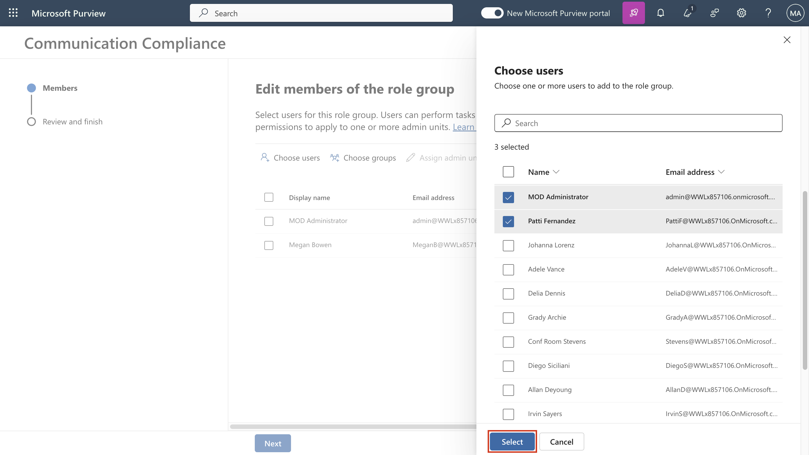

# Laboratório 9 – Configurando a conformidade de comunicação

## Objetivo:

Neste laboratório, você configurará uma política de conformidade para
detectar qualquer informação confidencial que esteja sendo comunicada
pelos usuários da sua organização. Você usará os tipos de informações
confidenciais criados no laboratório anterior para detectar os dados de
saúde dos funcionários ou os IDs dos funcionários que estão sendo
comunicados por e-mail.

## Exercício 1 – Habilitar permissões para conformidade de comunicação

Nesta tarefa, você atribuirá usuários a grupos de funções específicos
para segmentar a comunicação, a conformidade, o acesso e as
responsabilidades entre diferentes usuários em sua organização.

1.  Se o portal do Microsoft Purview estiver aberto, vá para a etapa 2,
    caso contrário, abra o site `https://purview.microsoft.com` e faça
    login com as credenciais do **MOD Administrator**.

2.  Na navegação, vá para **Settings** e, em **Role** **groups,**
    selecione **Communication Compliance**. Em seguida, selecione
    **Edit**. No painel lateral, selecione novamente **Edit**.

Uma captura de tela de uma descrição de computador gerada
automaticamente

3.  Em **Edit members of the role group,** selecione **Choose Users**.

Uma captura de tela de uma descrição de computador gerada
automaticamente

4.  Certifique-se de selecionar **MOD Administrator**, **Megan Bowen** e
    **Patti Fernandez**. Em seguida, escolha **Select**.

5.  Selecione **Next**.

Uma captura de tela de uma descrição de computador gerada
automaticamente

6.  Selecione **Save** para adicionar os usuários ao grupo de funções.
    Selecione **Done** para concluir as etapas.

Uma captura de tela de uma descrição de computador gerada
automaticamente

Uma captura de tela de uma descrição de computador gerada
automaticamente

## Exercício 2 – Configurar grupos para conformidade de comunicação

Na política, você usará endereços de email para identificar indivíduos
ou grupos de pessoas. Para simplificar sua configuração, você pode criar
grupos para pessoas que têm suas comunicações revisadas e grupos para
pessoas que revisam essas comunicações.

Você pode usar o PowerShell para configurar um grupo de distribuição
para uma política global de conformidade de comunicação para o grupo
atribuído. Isso permite detectar mensagens para milhares de usuários com
uma única política e manter a política de conformidade de comunicação
atualizada à medida que novos funcionários ingressam na organização.

1.  Abra **PowerShell** no modo de administrador.

2.  Digite o seguinte cmdlet para usar o módulo **Exchange Online
    PowerShell** e conectar-se ao seu locatário:

`Con``n``ect- ExchangeOnline`

Descrição do texto gerada automaticamente

3.  Quando a janela de **Sign in** for exibida, entre como **MOD
    Administrator**.

Imagem interrompida

4.  Crie um grupo de distribuição dedicado para sua política de
    conformidade de comunicação global com as seguintes propriedades:

    - **MemberDepartRestriction = Closed**. Garante que os usuários não
      possam se remover do grupo de distribuição.

    - **MemberJoinRestriction = Closed**. Garante que os usuários não
      possam se adicionar ao grupo de distribuição.

    - **ModerationEnabled = True**. Garante que todas as mensagens
      enviadas a esse grupo estejam sujeitas a aprovação e que o grupo
      não esteja sendo usado para se comunicar fora da configuração da
      política de conformidade de comunicação.

`New-``DistributionGroup`` -Name ``“``communication Compliance Group ``Constoso``" -Alias "``CCG_Contoso``" -``MemberDepartRestriction`` 'Closed' -``MemberJoinRestriction`` 'Closed' -``ModerationEnabled`` $true`

Imagem interrompida

**Observação:** É possível adicionar um **Exchange Custom Attribute**
como no **following command** para rastrear usuários adicionados à
política de conformidade de comunicação em sua organização.

`Set-``DistributionGroup`` -Identity "``communication Compliance Group ``Constoso``"-CustomAttribute1 "``MonitoredCommunication``"`

Uma captura de tela de uma descrição de computador gerada
automaticamente

5.  Execute o seguinte script do PowerShell em uma programação
    recorrente para adicionar usuários à política de conformidade de
    comunicação:

&nbsp;

    $Mbx = (Get-Mailbox -RecipientTypeDetails UserMailbox -ResultSize Unlimited -Filter {CustomAttribute9 -eq $Null})
    $i = 0
    ForEach ($M em $Mbx)
    {
    Write-Host "Adding" $M.DisplayName
    Add-DistributionGroupMember -Identity “communication Compliance Group Constoso” -Member $M.DistinguishedName -ErrorAction SilentlyContinue
    Set-Mailbox -Identity $M.Alias -CustomAttribute1 "MonitoredCommunication"
    $i++
    }
    Write-Host $i " Mailboxes added to the supervisory review distribution group ".

Imagem interrompida

**Observação:** esse script deve ser executado após cada intervalo
específico. A partir de agora, você poderá ver a lista de distribuição
em Active teams & groups no Microsoft 365 admin center.

Se você clicar no nome do grupo, poderá ver todos os usuários listados
na guia membros.

Imagem interrompida

## Exercício 3 – Criando uma política de conformidade de comunicação

1.  Se o portal de conformidade do Microsoft Purview estiver aberto, vá
    para a etapa 2, caso contrário, abra o
    `https://purview.microsoft.com` e faça login como **MOD
    Administrator**.

2.  No portal do Microsoft Purview, selecione **Solutions** \>
    **Communication compliance**.

3.  Selecione na subnavegação, selecione **Policy**. Em seguida,
    selecione **Create policy**.

Uma captura de tela de uma descrição de computador gerada
automaticamente

4.  Selecione **Custom policy** no menu suspenso.

5.  Na página Name your DLP policy page, digite  My first communication
    compliance policy no campo **Name** e This is a policy to test
    communication compliance no campo **Description**. Selecione
    **Next**.

Interface gráfica do usuário, texto, aplicativo e descrição gerada
automaticamente

6.  Na página **Choose supervised users and reviewers**, mantenha o
    restante das configurações padrão e, em revisões, adicione **Patti
    Fernandez**. Em seguida, clique em **Next**.

Uma captura de tela de uma descrição de computador gerada
automaticamente

7.  Na página de **communications**, marque todas as caixas em Locais do
    **Microsoft 365 locations** e clique em **Next**.

Uma captura de tela de uma descrição de computador gerada
automaticamente

8.  Em **Choose conditions and review percentage**, selecione **Add
    condition**, no menu suspenso, selecione **Content contains any of
    these sensitive info types**.

Uma captura de tela de uma descrição de computador gerada
automaticamente

9.  Na caixa **Content contains any of these sensitive info types**,
    selecione **Add**, clique em **Sensitive info types** e pesquise
    **contoso**. Marque as caixas de todos os tipos de informações
    confidenciais que criamos em laboratórios anteriores. Em seguida,
    clique em **Add**

Interface gráfica do usuário, texto, aplicativo e descrição gerada
automaticamente

10. Em **Choose conditions and review percentage**, marque a caixa ao
    lado **Use OCR to extract text from images**, defina **Review
    percentage to 100%**e clique em **Next**.

Interface gráfica do usuário, aplicação e descrição gerada
automaticamente

11. Na página **Review and finish**, selecione **Create policy**.

Interface gráfica do usuário, texto, aplicativo e descrição gerada
automaticamente

12. A página **Your policy was created** é exibida com diretrizes sobre
    quando a política será ativada e quais comunicações serão
    capturadas.

Interface gráfica do usuário, texto, aplicativo e descrição gerada
automaticamente

## Exercício 4 – Editando uma política de conformidade de comunicação

1.  Se o portal de conformidade do Microsoft Purview estiver aberto,
    continue na etapa 2, caso contrário, abra o
    `https://purview.microsoft.com` e faça login como **MOD
    Administrator**.

2.  No portal do Microsoft Purview, acesse **Settings** \>
    **Communication compliance** \> **Policies**, selecione os três
    pontos perto de **My first communication compliance policy** e
    selecione **Edit**.

Uma captura de tela de uma descrição de computador gerada
automaticamente

3.  Deixe **Name and describe your policy** em branco e clique em
    **Next**.

Interface gráfica do usuário, texto, aplicativo e descrição gerada
automaticamente

4.  Em **Choose supervised user and reviewers** e em **Supervised
    users and groups**, selecione o botão **Select users**.

Interface gráfica do usuário, aplicativo e descrição do Teams gerada
automaticamente

5.  Em **Start typing to find users or groups**, pesquise
    **Communication** e selecione **Communication Compliance Groups
    Contoso**.

6.  Em Choose supervised user and reviewers, em Reviewers adicione MOD
    Administrator aos Reviewers.

Interface gráfica do usuário, aplicativo e descrição do Teams gerada
automaticamente

7.  Selecione **Next** até chegar à página **Review and finish**.

8.  Clique em **Save**.

## Exercício 5 – Criando modelos de aviso e configurando a anonimização do usuário

1.  No portal do Microsoft Purview, selecione Configurações no canto
    superior direito e selecione **Communication compliance**.

2.  Selecione a guia **Privacy**. Para habilitar a anonimização,
    certifique-se de que **Show anonymized versions of usernames**
    esteja selecionada. Selecione **Save**.

Uma captura de tela de uma descrição de computador gerada
automaticamente

3.  Navegue até a guia **Notice templates** e selecione **Create notice
    template**.

4.  Na página **Modify a notice template**, preencha os seguintes
    campos:

    - Template name (required): Sample Notice 

    - Send from (required): Select **Patti Fernandez** by
      typing **Patti** and selecting the name from the drop down. 

    - Cc (optional): Select **MOD** **administrator** by
      typing **MOD** and selecting the name from the drop down. 

    - Subject (required): Your communication violets company
      Communication compliance policy. 

    - Message body (required): Please note this for future reference and
      provide an acceptable justification for your current
      communication`.`

5.  Selecione **Create** para criar e salvar o modelo de aviso.

Uma captura de tela de uma descrição de computador gerada
automaticamente

## Exercício 6 – Testando sua política de conformidade de comunicação

Na conta de teste, você não terá o privilégio de enviar nenhum e-mail,
mas pode conferir as etapas a seguir para entender como testar a
política quando tiver suas próprias licenças. Você pode executar etapas,
mas seu email não poderá alcançar o destinatário do seu locatário atual.

1.  Abra o Outlook acessando `https://outlook.office365.com/mail/ `e
    entre com o nome de usuário `adelev@{TENANTPREFIX}.onmicrosoft.com`
    e a senha do usuário.

2.  Envie um e-mail para sua conta de e-mail pessoal com o seguinte
    corpo de mensagem.

Message body: Employee Patti Fernandez EMP123456 is on absence
because of the flu/influenza

**Observação** As mensagens de email podem levar aproximadamente 24
horas para serem totalmente processadas em uma política. As comunicações
no Microsoft Teams, no Yammer e em plataformas de terceiros podem levar
aproximadamente 48 horas para serem totalmente processadas em uma
política.

Faça login para `https://purview.microsoft.com/` como **Patti
Fernandez**. Navegue até **Communication compliance** \> **Alerts** para
exibir os alertas de suas políticas após 24 horas.

**Resumo:**

Neste laboratório, aprendemos como habilitar as permissões para
conformidade de comunicação, criar as políticas, gerenciá-las e, em
seguida, criar modelos de aviso e configurar a anonimização do usuário.
