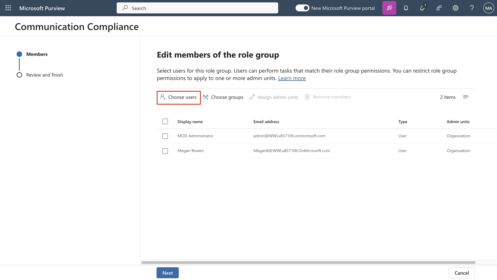
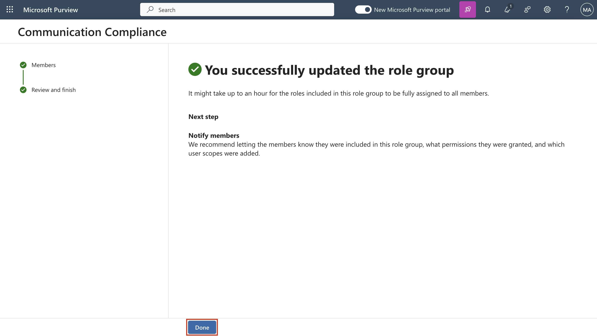
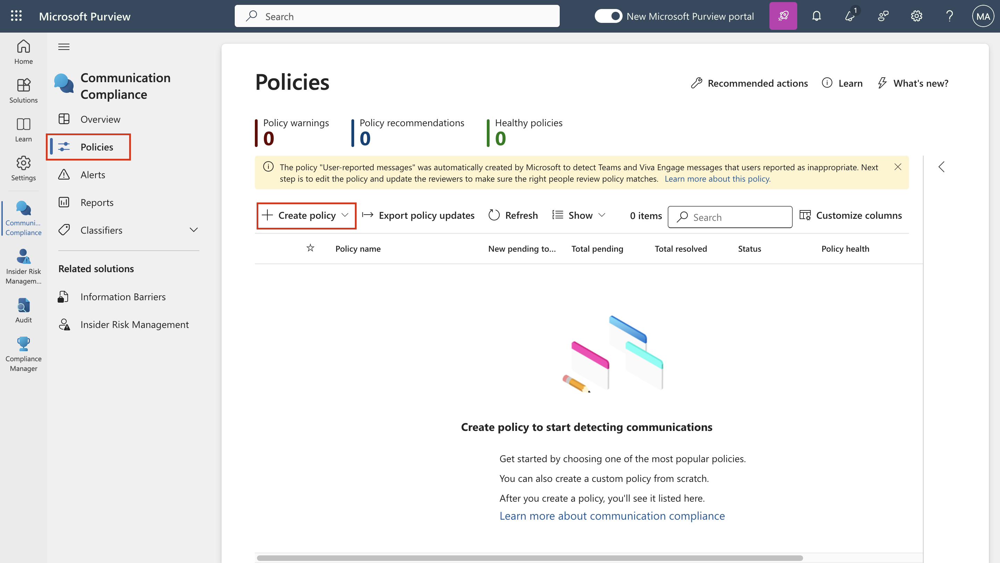
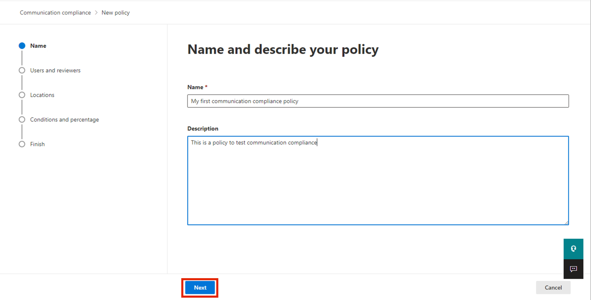
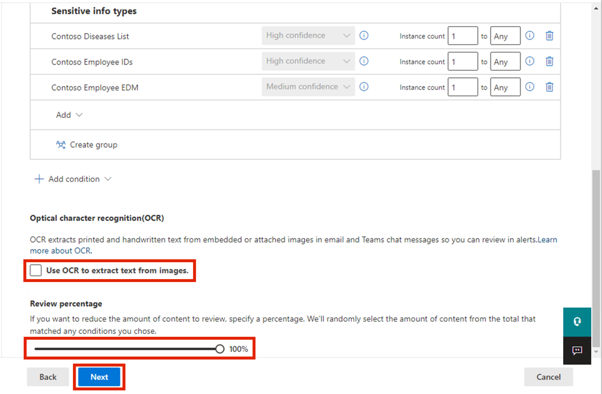
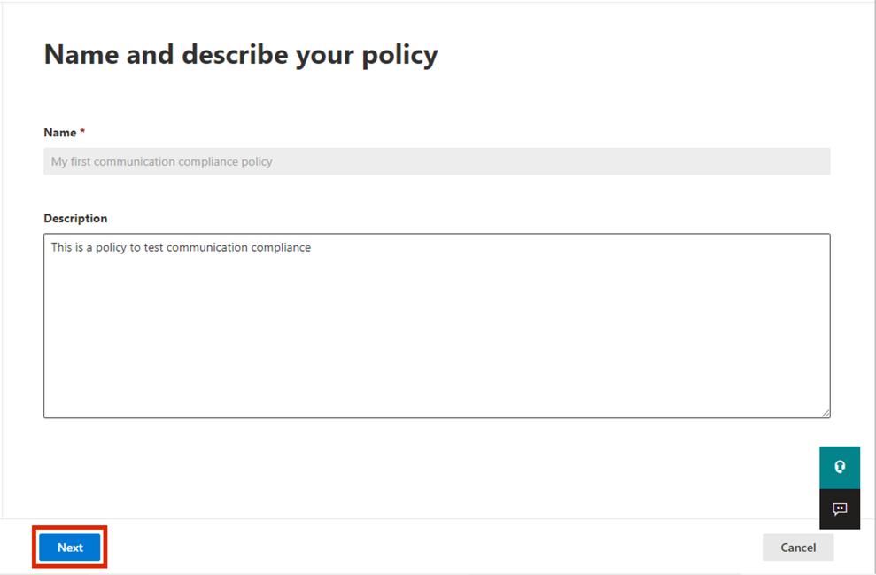
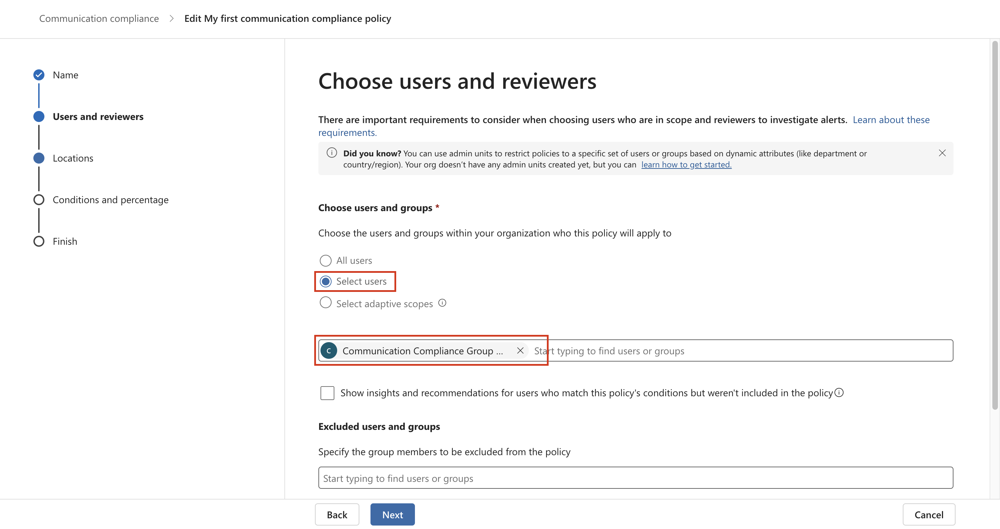
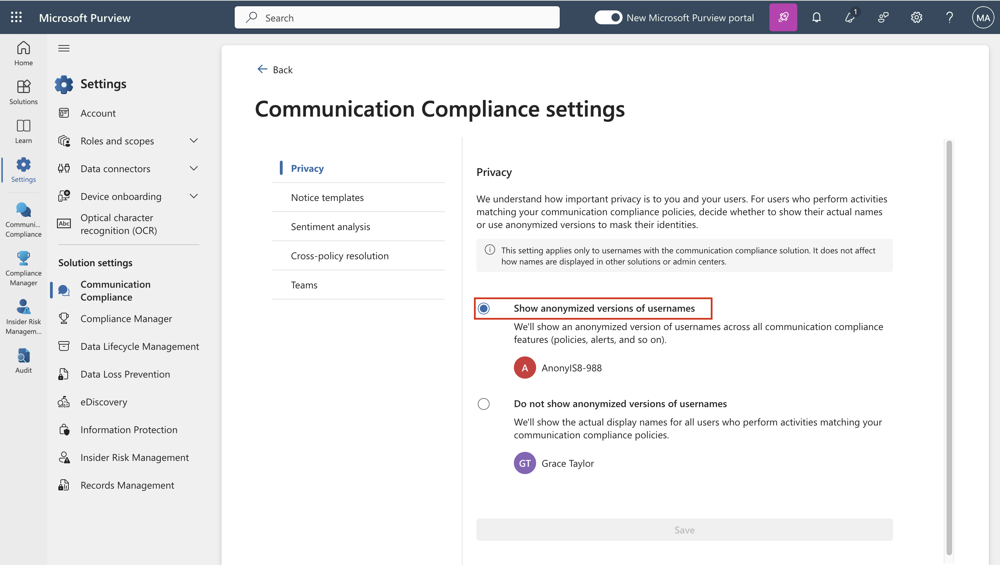
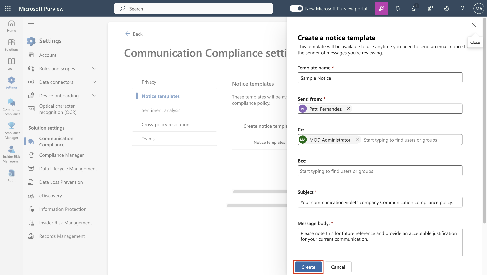

# **ラボ9 – communication complianceの設定**

## 紹介

このラボでは、組織内のユーザーが伝達する機密情報を検出するコンプライアンスポリシーを設定します。前のラボで作成した機密情報の種類を使用して、従業員の健康データや従業員IDがメールで伝達されるかどうかを検出します。

目的

- Communication compliance アクセスのロールを割り当てます。

- PowerShell を使用して配布グループを作成します。

- Communication compliance ポリシーを構成および編集します。

- 匿名化とユーザー通知を有効にします。

- ポリシーのテストプロセスを理解します。

## 演習1 – Communication Complianceのための権限の有効化

このタスクでは、ユーザーを特定の役割グループに割り当てて、組織内のさまざまなユーザー間でcommunication
compliance アクセスと責任をセグメント化します。

1.  ナビゲーションメニューで**Settings**を選択し,**Roles and
    scopes**を選択します**。** 移動して、**Role
    groupsを**クリックします**。**

2.  下にスクロールして **「Communication
    Compliance」**の横にあるチェックボックスを選択します。次に、鉛筆アイコンをクリックして**編集します**。

    

3.  **Edit members of the role group**で、 **Choose
    Users**を選択します。

    

4.  **MOD Administrator** 、 **Megan Bowen** 、 **Patti Fernandez
    を**必ず選択してください。次に、 **「Select」を選択します**。

    

5.  **Next**を選択します。

    

6.  **Save**を選択して、ユーザーをロールグループに追加します。
    **「Done」**を選択して手順を完了します。

    

    

## 演習2 – Communication Complianceのためのグループの設定　

このポリシーでは、メールアドレスを使用して個人またはグループを識別します。設定を簡素化するために、コミュニケーションがレビューされるユーザーと、コミュニケーションをレビューするユーザーをそれぞれグループ分けすることができます。

PowerShell を使用して、割り当てられたグループにグローバルなcommunication
complianceポリシーを適用する配布グループを構成できます。これにより、単一のポリシーで数千人のユーザーへのメッセージを検出し、組織に新しい従業員が加わってもcommunication
complianceポリシーを最新の状態に保つことができます。

1.  Windowsアイコンを右クリックし、 移動して**Windows PowerShell
    (Admin)** を選択します。

    

2.  User Account Controlダイアログボックスで**\[Yes\]**を選択します。

    

3.  **Exchange Online
    PowerShell**モジュールを使用してテナントに接続するには、次のコマンドレットを入力します。

**+++** **Connect-ExchangeOnline +++**

     

4.  **Sign in**ウィンドウが表示されたら、 **MOD
    Administrator**としてサインインします。もし \[**Automatically sign
    in to all desktop apps and websites on this
    device?\]**というダイアログボックスが表示されたら、 「No, this app
    only」ボタンを選択します。

    

    

5.  次のプロパティを使用して、グローバルcommunication
    complianceポリシー専用の配布グループを作成します。

    - **MemberDepartRestriction = Closed**
      。ユーザーが配布グループから自分自身を削除できないようにします。

    - **MemberJoinRestriction = Closed**
      。ユーザーが自分自身を配布グループに追加できないようにします。

    - **ModerationEnabled = True**
      。このグループに送信されるすべてのメッセージが承認の対象となり、このグループがcommunication
      complianceポリシー構成外での通信に使用されないことを確認します。

**+++ New-DistributionGroup -Name "Communication Compliance Group
Contoso" -Alias "CCG_Contoso" -MemberDepartRestriction
'Closed' -MemberJoinRestriction 'Closed' -ModerationEnabled $true +++**

    

**注:**組織内のcommunication
complianceポリシーに追加されたユーザーを追跡するには、**次のコマンド**のように**Exchange
Custom Attribute**を追加できます。

**+++Set- DistributionGroup -Identity "Communication Compliance Group
Contoso"-CustomAttribute1 " MonitoredCommunication "+++**

    

6.  定期的なスケジュールで次の PowerShell
    スクリプトを実行して、ユーザーをcommunication compliance
    ポリシーに追加します。

**+++$Mbx = (Get-Mailbox -RecipientTypeDetails UserMailbox -ResultSize
Unlimited -Filter {CustomAttribute9 -eq $Null})**

**$i = 0**

**ForEach ($M in $Mbx)**

**{**

**Write-Host "Adding" $M.DisplayName**

**Add-DistributionGroupMember -Identity "Communication Compliance Group
Contoso" -Member $M.DistinguishedName -ErrorAction SilentlyContinue**

**Set-Mailbox -Identity $M.Alias -CustomAttribute1
"MonitoredCommunication"**

**$i++**

**}**

**Write-Host $i "Mailboxes added to supervisory review distribution
group." +++**

    

7.  スクリプトから出力が生成されたら、新しいタブを開き、次の
    URL+++<https://admin.cloud.microsoft/>+++ を入力して Microsoft 365
    admin centerを開きます。　

8.  Microsoft 365 admin centerページで、 **Teams & groups\>Active teams
    & groups\>Distribution list\>Communication Compliance Group
    Contoso**に移動してクリックします。

    

9.  右側に表示される Communication Compliance ペインで \[Members\]
    タブをクリックし、下にスクロールして \[Distributionリスト\]
    グループ内のすべてのメンバーを確認します。　

    

    

## 演習3 – Communication complianceポリシーの作成

1.  Microsoft Purview ポータルで、 **Solutions \> Communication
    Compliance**を選択します。

    

2.  **Communication Compliance**ブレードで、
    **Policies**に移動してクリックします。次に、 **Policies**ページで**+
    Create policy**を選択し、 **on Custom policy**をクリックします。

    

3.  **Name**フィールドに**「+++My first communication Compliance
    policy+++」**と入力します。 **「Description」**フィールドに**「+++**
    **This is a policy to test communication compliance
    +++」**と入力します。**「Next」**を選択します。

    

4.  **Choose users and reviewers**ページで、
    **Reviewers**セクションに移動し、 **「Patti
    Fernandez」**と入力して選択します。
    **「Next」ボタン**をクリックします。

    

5.  **Choose locations to detect communications**ページで**、 Microsoft
    365 locations**の下にあるすべてのチェック
    ボックスが選択されていることを確認し、
    **\[Next\]**ボタンをクリックします。

   

6.  **Choose conditions and review
    percentage**で、下にスクロールして**Add
    conditionを**選択し、次に**Content contains sensitive info
    types**に移動して選択します。

    

7.  **Content contains any of these sensitive info types** ボックスで、
    **Add**を選択し、 **Sensitive info
    types**をクリックして**「contoso」**を検索します。以前のラボで作成したすべての機密情報の種類にチェックを入れます。「**Add」**をクリックします。　

    

8.  下にスクロールして「**Use OCR to extract text from
    images」**の横にあるチェックボックスを選択し**、Review percentageを
    100%** に設定して、**Next**ボタンをクリックします。

    

9.  **\[Review and finish \]**ページで、 **\[Create policy\]**
    を選択します。

    

10. **Your policy was
    created **というページが表示され、ポリシーがいつ有効化され、どの通信がキャプチャされるかを示すガイドラインが表示されます。「**Done」**ボタンをクリックしてください。

    

## 演習4 – Communication complianceポリシーの編集

1.  **Communication Compliance- Policies**ページで、 **My first
    communication compliance policy**の横にある省略記号をクリックし、
    **Edit**に移動してクリックします。

**注**: 「My first communication Compliance
policy」が表示されない場合は、ページを更新してください。

    

2.  以前設定した**Name and describe your policyをそのままに**して、
    **「Next」**ボタンをクリックします。

    

3.  **\[Choose users and reviewers\]**ページで、 **\[Select users\]
    の**横にあるラジオ ボタンに移動して選択します。

    

4.  **\[Start typing to find users or groups\]**で、
    **「Communication」**を検索し、 **\[Communication Compliance Groups
    Contoso\]**を選択します。

    

5.  **Reviewers**セクションで「MOD Administrator」と入力して選択します。
    **「Review and
    finish」**ページが表示されるまで**「Next」**を選択します。

    

6.  次に、 **「Save」ボタン**をクリックします。

    

## 演習5 – 通知テンプレートの作成とユーザー匿名化の設定

1.  Microsoft Purview ポータルで、右上隅から**Settings**を選択し**、
    Communication Compliance**に移動して選択します。

    

2.  **Communication
    Compliance設定-Privacy**ページで匿名化を有効にするには、「**Show
    anonymized versions of
    usernames」**ラジオボタンが選択されていることを確認してください。その後、
    **Save**ボタンをクリックします。

**注: \[Save\]**ボタンが強調表示されていない場合は、他の機能のラジオ
ボタンを選択し、 **\[Show anonymized versions of
usernames\]**ラジオボタンを再度選択します。

    

3.  **Notice templates**を選択し、
    **+**記号をクリックして通知テンプレートを作成します。

    

4.  **Modify a notice template**ページで、次のフィールドに入力します。

    - Template name (必須): **+++Sample Notice+++**

    - Send from (必須): Select **Patti Fernandez** by typing **Patti**
      and selecting the name from the drop down.

    - Cc (任意): Select **MOD** **administrator** by typing **MOD** and
      selecting the name from the drop down.

    - Subject (必須): **+++Your communication violets company
      Communication compliance policy.+++**

    - Message body (必須): **+++Please note this for future
      reference and provide an acceptable justification for your current
      communication. +++**

5.  通知テンプレートを作成して保存するには、 **Create**を選択します。

    

## 演習6 – Communication complianceポリシーのテスト

トライアルアカウントでメールを送信する権限がありませんが、ご自身のライセンスをお持ちの場合、ポリシーをテストする方法については、以下の手順をご確認ください。手順を実行することは可能ですが、現在のテナントから受信者にメールが届くことはありません。

1.  **+++https://outlook.office365.com/mail/+++**にアクセスして Outlook
    を開き、ユーザー名**+++adelev@WWLxXXXXXX.onmicrosoft.com+++**とユーザー
    パスワードでサインインします。

2.  次のメッセージ本文を含む電子メールを個人の電子メール
    アカウントに送信します。

件名: **Patti Fernandez (EMP123456) on Medical Leave Due to Flu**

メッセージ本文: **+++** **Employee Patti Fernandez EMP123456 is on
absence because of the flu/influenza +++**

    

**注：**メールメッセージはポリシーで完全に処理されるまでに約24時間かかる場合があります。Microsoft
Teams、Yammer、第三者プラットフォームでのコミュニケーションは、ポリシーで完全に処理されるまでに約48時間かかる場合があります。

**+++https://purview.microsoft.com/+++**に**Patti
Fernandez**としてサインインして、24時間後にポリシーのアラートを表示するには、
**Communication compliance \> Alerts**に移動します。

**まとめ：**

このラボでは、Microsoft Purview でCommunication
Complianceを構成および管理する方法を学習しました。必要なロールを割り当て、PowerShell
を使用して配布グループを作成し、社内コミュニケーションを監視するためのコンプライアンスポリシーを設定しました。レビュー中にユーザーのIDを保護するために匿名化を有効にし、ユーザー通知テンプレートを作成し、完全な適用前にcommunication
complianceポリシーをシミュレーションおよびテストする方法を理解しました。　

