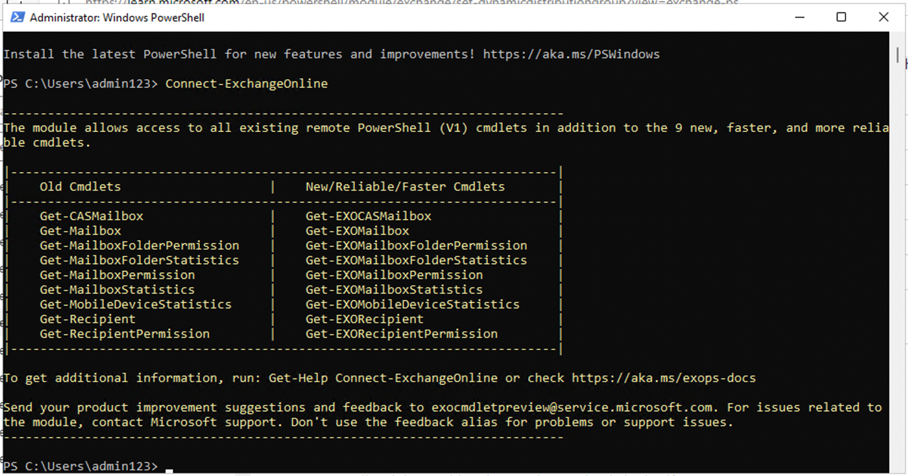

# Lab 9 – Configurazione della conformità della comunicazione

## Obiettivo:

In questo lab si configurerà un criterio di conformità per rilevare
eventuali informazioni riservate comunicate dagli utenti
dell'organizzazione. Utilizzerai i tipi di informazioni sensibili creati
nel lab precedente per rilevare i dati sanitari dei dipendenti o gli ID
dei dipendenti comunicati tramite e-mail.

## Esercizio 1 - Abilitazione delle autorizzazioni per la conformità delle comunicazioni

In questa attività verranno assegnati utenti a gruppi di ruoli specifici
per segmentare la conformità, l'accesso e le responsabilità delle
comunicazioni tra i diversi utenti dell'organizzazione.

1.  Se il portale di Microsoft Purview è aperto, continuare con il
    passaggio 2, in caso contrario, aprire il
    `https://purview.microsoft.com` e accedere con le credenziali di
    **amministratore MOD**.

2.  Nella navigazione, selezionare **Settings**, quindi selezionare
    **Role groups** in **Role groups**, selezionare **Communication
    Compliance**. Quindi selezionare **Edit**. Nel riquadro laterale,
    selezionare nuovamente **Edit**.

Uno screenshot di un computer Descrizione generata automaticamente

3.  In **Edit members of the role group,** selezionare **Choose Users**.

Uno screenshot di un computer Descrizione generata automaticamente

4.  Assicurati di selezionare **MOD Administrator, Megan Bowen** e
    **Patti Fernandez**. Quindi scegliere **Select**.

5.  Selezionare **Next**.

Uno screenshot di un computer Descrizione generata automaticamente

6.  Selezionare **Save **per aggiungere gli utenti al gruppo di ruoli.
    Selezionare **Done **per completare i passaggi.

Uno screenshot di un computer Descrizione generata automaticamente

Uno screenshot di un computer Descrizione generata automaticamente

## Esercizio 2 – Impostazione di gruppi per la conformità alla comunicazione

Nelle norme, utilizzerai gli indirizzi e-mail per identificare individui
o gruppi di persone. Per semplificare la configurazione, puoi creare
gruppi per le persone che hanno esaminato la loro comunicazione e gruppi
per le persone che esaminano tali comunicazioni.

È possibile usare PowerShell per configurare un gruppo di distribuzione
per un criterio di conformità delle comunicazioni globali per il gruppo
assegnato. In questo modo è possibile rilevare i messaggi per migliaia
di utenti con un singolo criterio e mantenere aggiornati i criteri di
conformità delle comunicazioni man mano che nuovi dipendenti entrano a
far parte dell'organizzazione.

1.  Aprire **PowerShell** in modalità amministratore.

2.  Immettere il cmdlet seguente per usare il modulo **Exchange Online
    PowerShell** e connettersi al tenant:

Connect-ExchangeOnline

Descrizione del testo generata automaticamente

3.  Quando viene visualizzata la finestra di **Sign in**, accedere come
    **MOD Administrator**.

Immagine rotta

4.  Creare un gruppo di distribuzione dedicato per i criteri di
    conformità delle comunicazioni globali con le proprietà seguenti:

    - **MemberDepartRestriction = Closed**. Garantisce che gli utenti
      non possano rimuoversi dal gruppo di distribuzione.

    - **MemberJoinRestriction = Closed**. Garantisce che gli utenti non
      possano aggiungersi al gruppo di distribuzione.

    - **ModerationEnabled = True**. Garantisce che tutti i messaggi
      inviati a questo gruppo siano soggetti ad approvazione e che il
      gruppo non venga usato per comunicare all'esterno della
      configurazione dei criteri di conformità delle comunicazioni.

New-DistributionGroup -Name "Communication Compliance Group
Contoso" -Alias "CCG_Contoso" -MemberDepartRestriction
'Closed' -MemberJoinRestriction 'Closed' -ModerationEnabled $true

Immagine rotta

**Nota:** È possibile aggiungere un **Exchange Custom Attribute** come
nel **comando seguente** per tenere traccia degli utenti aggiunti ai
criteri di conformità delle comunicazioni nell'organizzazione.

`Set-DistributionGroup -Identity "Communication Compliance Group Contoso"-CustomAttribute1 "MonitoredCommunication"`

Una schermata di un computer Descrizione generata automaticamente

5.  Eseguire lo script di PowerShell seguente in base a una
    pianificazione ricorrente per aggiungere utenti ai criteri di
    conformità delle comunicazioni:

&nbsp;

    $Mbx = (Get-Mailbox -RecipientTypeDetails UserMailbox -ResultSize Unlimited -Filter {CustomAttribute9 -eq $Null}) 
    $i = 0 
    ForEach ($M in $Mbx) 
    { 
    Write-Host "Adding" $M.DisplayName 
    Add-DistributionGroupMember -Identity "Communication Compliance Group Contoso" -Member $M.DistinguishedName -ErrorAction SilentlyContinue 
    Set-Mailbox -Identity $M.Alias -CustomAttribute1 "MonitoredCommunication" 
    $i++ 
    } 
    Write-Host $i "Mailboxes added to supervisory review distribution group."

Immagine rotta

**Nota:** questo script deve essere eseguito dopo ogni intervallo
particolare. A partire da ora sarà possibile visualizzare l'elenco di
distribuzione in Team e gruppi attivi nell'interfaccia di
amministrazione di Microsoft 365.

Se fare clic sul nome del gruppo, sarai in grado di vedere tutti gli
utenti elencati nella scheda membri.

Immagine rotta

## Esercizio 3 - Creazione di un criterio di conformità della comunicazione

1.  Se il portale di conformità di Microsoft Purview è aperto,
    continuare con il passaggio 2, in caso contrario, aprire il
    `https://purview.microsoft.com` e accedere come **amministratore
    MOD**.

2.  Nel portale di Microsoft Purview selezionare **Soltions \>
    Communication compliance**.

3.  Selezionare dalla struttura di spostamento secondario, selezionare
    **Policy**. Selezionare quindi **Create policy**.

Uno screenshot di un computer Descrizione generata automaticamente

4.  Selezionare **Custom policy** dall'elenco a discesa.

5.  Nella pagina **Name your DLP policy**, digitare **My first
    communication compliance policy** nel campo **Name** e **This is a
    policy to test communication compliance** nel campo **Description**.
    Selezionare **Next**.

Interfaccia utente grafica, testo, applicazione Descrizione generata
automaticamente

6.  Nella pagina **Choose supervised users and reviewers,** mantenere il
    resto delle impostazioni predefinite e in Revisioni aggiungere
    **Patti Fernandez**. Quindi fare clic su **Next**.

Uno screenshot di un computer Descrizione generata automaticamente

7.  Nella pagina **communications**, selezionare tutte le caselle sotto
    **Microsoft 365 locations** e fare clic su **Next**.

Uno screenshot di un computer Descrizione generata automaticamente

8.  In **Choose conditions and review percentage,** selezionare **Add
    condition**, dall'elenco a discesa selezionare **Content contains
    any of these sensitive info types**.

Uno screenshot dello schermo di un computer Descrizione generata
automaticamente

9.  Nella casella **Content contains any of these sensitive info
    types,** selezionare **Add**, fare clic su **Sensitive info types**
    e cercare **contoso**. Selezionare le caselle per tutti i tipi di
    informazioni sensibili che abbiamo creato nei lab precedenti. Quindi
    fare clic su **Add.**

Interfaccia utente grafica, testo, applicazione Descrizione generata
automaticamente

10. In **Choose conditions and review percentage**, selezionare la
    casella accanto a **Use OCR to extract text from images**, impostare
    **Review percentage to 100%** e quindi fare clic su **Next**.

Interfaccia utente grafica, applicazione Descrizione generata
automaticamente

11. Nella pagina **Review and finish,** selezionare **Create policy**.

Interfaccia utente grafica, testo, applicazione Descrizione generata
automaticamente

12. Viene visualizzata la pagina **Your policy was created** con le
    linee guida su quando i criteri verranno attivati e quali
    comunicazioni verranno acquisite.

Interfaccia utente grafica, testo, applicazione Descrizione generata
automaticamente

## Esercizio 4 – Modifica di una politica di conformità della comunicazione

1.  Se il portale di conformità di Microsoft Purview è aperto,
    continuare con il passaggio 2, in caso contrario, aprire il
    `https://purview.microsoft.com` e accedere come **amministratore
    MOD**.

2.  Nel portale di Microsoft Purview passare a **Settings \>
    Communication compliance \> Policies**, selezionare i tre punti
    accanto a **My first communication compliance policy** e selezionare
    **Edit**.

Uno screenshot di un computer Descrizione generata automaticamente

3.  Lasciare vuoti il campo **Name and describe your policy** e fare
    clic su **Next**.

Interfaccia utente grafica, testo, applicazione Descrizione generata
automaticamente

4.  In **Choose supervised user and reviewers** e in **Supervised
    users and groups,** selezionare il pulsante **Select users**.

Interfaccia utente grafica, applicazione, Teams Descrizione generata
automaticamente

5.  In **Start typing to find users or groups,** cercare
    **Communication **e selezionare **Communication Compliance Groups
    Contoso**.

6.  In **Choose supervised user and reviewers**, in
    **Reviewers** aggiungere **MOD Administrator** ai Reviewers.

Interfaccia utente grafica, applicazione, Teams Descrizione generata
automaticamente

7.  Selezionare **Next **fino a raggiungere la pagina **Review and
    finish**.

8.  Fare clic su **Save**.

## Esercizio 5 – Creazione di modelli di avviso e configurazione dell'anonimizzazione degli utenti

1.  Nel portale di Microsoft Purview selezionare Impostazioni
    nell'angolo in alto a destra e selezionare **Communication
    compliance**.

2.  Selezionare la scheda **Privacy**. Per abilitare l'anonimizzazione,
    assicurati che l'opzione **Show anonymized versions of usernames**
    sia selezionata. Selezionare **Save**.

Uno screenshot di un computer Descrizione generata automaticamente

3.  Passare alla scheda **Notice templates**, quindi selezionare
    **Create notice template**.

4.  Nella pagina **Modify a notice template** completare i campi
    riportati di seguito.

    - Template name (Obbligatorio): Sample Notice 

    - Send from (Obbligatorio): Selezionare **Patti Fernandez**
      digitando **Patti** e selezionando il nome dal menu a tendina. 

    - Cc (opzionale): Selezionare **MOD** **administrator** digitando
      **MOD** e selezionando il nome dal menu a tendina. 

    - Subject (Obbligatorio): Your communication violets company
      Communication compliance policy. 

    - Message body (Obbligatorio): Please note this for future
      reference and provide an acceptable justification for your current
      communication. 

5.  Selezionare **Create** per creare e salvare il modello di avviso.

Uno screenshot di un computer Descrizione generata automaticamente

## Esercizio 6 – Verifica della politica di conformità delle comunicazioni

Nell'account di prova non avrai il privilegio di inviare alcuna e-mail,
ma puoi controllare i seguenti passaggi per capire come testare la
politica quando hai le tue licenze. È possibile eseguire i passaggi, ma
la posta non sarà in grado di raggiungere il destinatario dal tenant
corrente.

1.  Aprire Outlook andando su `https://outlook.office365.com/mail/ `e
    accedere con il nome utente `adelev@{TENANTPREFIX}.onmicrosoft.com`
    e la password utente.

2.  Inviare un'e-mail al tuo account di posta elettronica personale con
    il seguente corpo del messaggio.

Corpo del messaggio: Employee Patti Fernandez EMP123456 is on absence
because of the flu/influenza

**Nota** L'elaborazione completa dei messaggi di posta elettronica in un
criterio può richiedere circa 24 ore. L'elaborazione completa delle
comunicazioni in Microsoft Teams, Yammer e piattaforme di terze parti in
un criterio può richiedere circa 48 ore.

Accedere a `https://purview.microsoft.com/` come **Patti Fernandez**.
Passare a **Communication compliance \> Alerts** per visualizzare gli
avvisi per i criteri dopo 24 ore.

**Sommario:**

In questo lab abbiamo appreso come abilitare le autorizzazioni per la
conformità delle comunicazioni, creare i criteri, gestirli e quindi
creare modelli di avviso e configurare l'anonimizzazione degli utenti.
