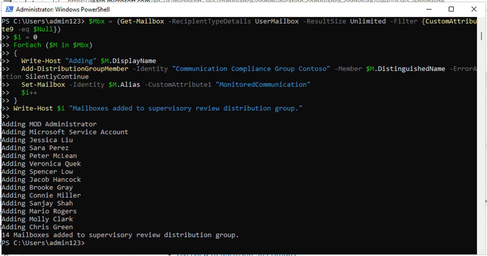
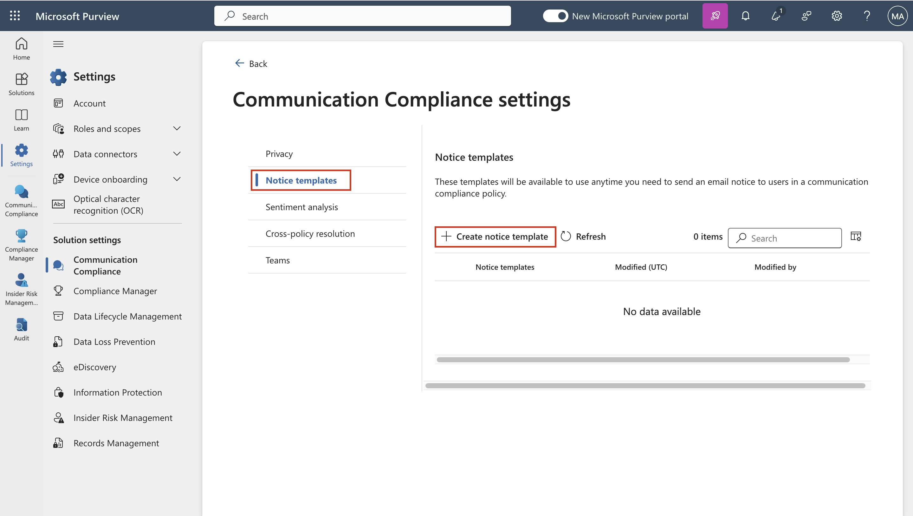

# 실습 9 – Communication Compliance 구성

## 목표:

이 실습에서는 조직의 사용자가 전달하는 중요한 정보를 검색하도록 규정
준수 정책을 구성할 것입니다. 이전 실습에서 생성한 중요한 정보 유형을
사요하여 이메일을 통해 전달되는 직원 건강 데이터나 직원 ID를 검색할
것입니다.

## 연습 1 – Communication Compliance에 대한 권한을 활성화하기

이 작업에서는 사용자를 특정 역할 그룹에 할당하여 조직의 여러 사용자간에
communication compliance 액세스 및 책임을 분류할 것입니다.

1.  Microsoft Purview 포털이 열려 있으면 2단계를 진행하세요. 그렇지
    않으면 `https://purview.microsoft.com` 를 열고 **MOD Administrator**
    자격 증명으로 로그인하세요.

2.  탐색에서 **Settings**를 선택하여**Role** **groups**의 **Role
    groups**를 선택하여 **Communication Compliance**를 선택하세요.
    **Edit**를 선택하세요. 옆 창에서**Edit**를 선택하세요.

컴퓨터 설명의 스크린샷 자동으로 생성됩니다

3.  **Edit members of the role group**에서 **Choose Users**를
    선택하세요.

컴퓨터 설명의 스크린샷 자동으로 생성됩니다

4.  **MOD Administrator**, **Megan Bowen**, 및**Patti Fernandez**를
    선택했는지 확인하세요. **Select**를 선택하세요.

5.  **Next**를 선택하세요.

컴퓨터 설명의 스크린샷 자동으로 생성됩니다

6.  사용자를 역할 그룹에 추가하기 위해 **Save**를 선택하세요. 단계를
    완료하려면 **Done**를 선택하세요.

컴퓨터 설명의 스크린샷 자동으로 생성됩니다

컴퓨터 설명의 스크린샷 자동으로 생성됩니다

## 연습 2 – Communication Compliance를 위한 그룹을 설정하기

이 정책에서는 이메일 주소를 사용하여 개인이나 사용자 그룹을 식별할
것입니다. 설정을 단순화하기 위해 통신을 검토한 사람들을 위한 그룹과 해당
통신을 검토하는 사람들을 위한 그룹을 생성할 수 있습니다.

PowerShell을 사용하여 할당된 그룹에 대한 글로벌 communication compliance
정책에 대한 메일 그룹을 구성할 수 있습니다. 이를 통해 단일 정책으로 수천
명의 사용자에 대한 메시지를 감지하고 새 직원이 조직에 합류할 때
communication compliance 정책을 업데이트된 상태로 유지할 수 있습니다.

1.  관리자 모드에서 **PowerShell** 여세요.

2.  다음 cmdlet을 입력하여 **Exchange Online PowerShell** 모듈을
    사용하고 테넌트에 연결하세요:

`Connect-ExchangeOnline`

텍스트 설명이 자동으로 생성됩니다

3.  **Sign in** 창이 표시되면 **MOD Administrator**로 로그인하세요.

4.  다음 속성을 사용하요 글로벌 communication compliance 정책에 대한
    전용 메일 그룹을 생성하세요:

    - **MemberDepartRestriction = Closed**. 사용자가 메일 그룹에서
      자신을 제거할 수 없도록 합니다.

    - **MemberJoinRestriction = Closed**. 사용자가 메일 그룹에 자신을
      추가할 수 없도록 합니다.

    - **ModerationEnabled = True**. 이 그룹으로 전송된 모든 메시지가
      승인 대상이며 그룹이 communication compliance 정책 구성 외부에서
      통신하는 데 사용되지 않도록 합니다.

`New-``DistributionGroup`` -Name "Communication Compliance Group Contoso" -Alias "CCG_Contoso" -MemberDepartRestriction 'Closed' -MemberJoinRestriction 'Closed' -ModerationEnabled $true`

**참고:**  **Following command**과 같이 **Exchange Custom Attribute**을
추가하여 조직의 communication compliance 정책에 추가된 사용자를 추적할
수 있습니다.

`Set-DistributionGroup -Identity "Communication Compliance Group Contoso"-CustomAttribute1 "MonitoredCommunication"`

컴퓨터 설명의 스크린샷이 자동으로 생성됩니다

5.  되풀이 일정에 따라 다음PowerShell 스크립트를 실행하여 communication
    compliance 정책에 사용자를 추가하세요:

&nbsp;

    $Mbx = (Get-Mailbox -RecipientTypeDetails UserMailbox -ResultSize Unlimited -Filter {CustomAttribute9 -eq $Null})
    $i = 0
    ForEach ($M in $Mbx)
    {
    Write-Host "Adding" $M.DisplayName
    Add-DistributionGroupMember -Identity "Communication Compliance Group Contoso" -Member $M.DistinguishedName -ErrorAction SilentlyContinue
    Set-Mailbox -Identity $M.Alias -CustomAttribute1 "MonitoredCommunication"
    $i++
    }
    Write-Host $i "Mailboxes added to supervisory review distribution group."

**참고:** 이 스크립트는 특정 간격마다 실행되어야 합니다. 지금은
Microsoft 365 admin center의 Active 팀 및 Groups에서 Distribution 목록을
볼 수 있습니다.

그룹 이름을 클릭하면 구성원 탭 아래에 나열된 모든 사용자를 볼 수
있습니다.

## 연습 3 – Communication compliance 정책을 생성하기

1.  Microsoft Purview 포털이 열려 있으면 2단계를 진행하세요. 그렇지
    않으면 `https://purview.microsoft.com` 를 열고 **MOD Administrator**
    자격 증명으로 로그인하세요.

2.  Microsoft Purview 포털에서 **Solutions** \> **Communication
    compliance**를 선택하세요.

3.  하위 탐색에서 **Policy**를 선택하세요. **Create policy**를
    선택하세요.

컴퓨터 설명의 스크린샷 자동으로 생성됩니다

4.  드롭다운에서 **Custom policy**를 선택하세요.

5.  Name your DLP policy 페이지에서 **Name** 필드에서
    `My first communication compliance policy` 를
    입력하여 **Description** 필드에서
    `This is a policy to test communication compliance`를 입력하세요.
    **Next**를 선택하세요.

그래픽 사용자 인터페이스, 텍스트, 애플리케이션 설명이 자동으로
생성됩니다

6.  **Choose supervised users and reviewers** 페이지에서 나머지 기본
    설정은 유지라고 리뷰 아래에 **Patti Fernandez**를 추가하세요.
    **Next**를 클릭하세요.

컴퓨터 설명의 스크린샷 자동으로 생성됩니다

7.  **Communications** 페이지에서 **Microsoft 365 locations** 아래의
    모든 확인란을 선택하고 **Next**를 클릭하세요.

컴퓨터 설명의 스크린샷 자동으로 생성됩니다

8.  **Choose conditions and review percentage**에서 **Add condition**를
    선택하고 드롭다운에서 **Content contains any of these sensitive info
    types**를 선택하세요.

컴퓨터 화면의 스크린샷 설명이 자동으로 생성됩니다

9.  **Content contains any of these sensitive info
    types** 상자에서 **Add**를 선택하고 **Sensitive info types**를
    클릭하여 **contoso**를 검색하세요. 이전 실습에서 생성한 모든 민감한
    정보 유형의 확인란을 선택하세요. **Add**를 클릭하세요.

그래픽 사용자 인터페이스, 텍스트, 애플리케이션 설명이 자동으로
생성됩니다

10. On **Choose conditions and review percentage**에서 **Use OCR to
    extract text from images**라는 확인란을 선택하고 **Review percentage
    to 100%**를 설정하여 **Next**를 클릭하세요.

그래픽 사용자 인터페이스, 애플리케이션 설명이 자동으로 생성됩니다

11. **Review and finish** 페이지에서 **Create policy**를 선택하세요.

그래픽 사용자 인터페이스, 텍스트, 애플리케이션 설명이 자동으로
생성됩니다

12. **Your policy was created** 페이지가 표시되면 정책이 활성화되는
    시기와 캡처되는 통신에 대한 지침이 표시됩니다.

그래픽 사용자 인터페이스, 텍스트, 애플리케이션 설명이 자동으로
생성됩니다

## 연습 4 – Communication compliance 정책을 편집하기

1.  Microsoft Purview 포털이 열려 있으면 2단계를 진행하세요. 그렇지
    않으면 `https://purview.microsoft.com` 를 열고 **MOD
    Administrator**로 로그인하세요.

2.  Microsoft Purview 포털에서 **Settings** \> **Communication
    compliance** \> **Policies**로 이동하고 **My first communication
    compliance policy**에 있는 세 개의 점을 선택하고**Edit**을
    선택하세요.

컴퓨터 설명의 스크린샷 자동으로 생성됩니다

3.  **Name and describe your policy** 을 비워 두고 **Next**를
    클릭하세요.

그래픽 사용자 인터페이스, 텍스트, 애플리케이션 설명이 자동으로
생성됩니다

4.  **Choose supervised user and reviewers** 및 **Supervised users and
    groups**에서 **Select users** 버튼을 선택하세요.

그래픽 사용자 인터페이스, 애플리케이션, 팀 설명이 자동으로 생성됩니다

5.  **Start typing to find users or groups**에서 **Communication**를
    검색하고 **Communication Compliance Groups Contoso**를 선택하세요.

6.  Reviewers의 Choose supervised user and reviewers에서 Reviewers에 MOD
    Administrator를 추가하세요.

그래픽 사용자 인터페이스, 애플리케이션, 팀 설명이 자동으로 생성됩니다

7.  **Review and finish** 페이지에 도달할 때까지**Next**을 선택하세요.

8.  **Save**를 클릭하세요.

## 연습 5 – 공지 템플릿을 생성하고 사용자 익명화를 구성하기

1.  Microsoft Purview 포털에서 오른쪽 위 모서리에서Settings을 선택하고
    **Communication compliance**를 선택하세요.

2.  **Privacy** 탭을 선택하세요. 이명화를 활성화하려면 **Show anonymized
    versions of usernames**가 선택되어 있는지 확인하세요. **Save**를
    선택하세요.

컴퓨터 설명의 스크린샷 자동으로 생성됩니다

3.  **Notice templates** 탭으로 이동하고 **Create notice template**를
    선택하세요.

4.  **Modify a notice template** 페이지에서 다음 필드를 완료하세요:

    - Template name (필수): `Sample Notice`

    - Send from (필수):  **Patti**를 입력하고 드롭다운에서 이름을
      선택하여 **Patti Fernandez**를 선택하세요.

    - Cc (선택적): **MOD**를 입력하고 드롭다운에서 이름을 선택하여
      **MOD** **administrator**를 선택하세요.

    - Subject
      (필수): `Your communication violets company Communication compliance policy.`

    - Message body
      (필수): `Please note this for future reference and provide an acceptable justification for your current communication.`

5.  공지 템플릿을 생성하고 저장하기 위해 **Create**를 선택하세요.

컴퓨터 설명의 스크린샷 자동으로 생성됩니다

## 연습 6 – Communication compliance 정책을 테스트하기

시험 계정에서는 이메일을 보낼 수 있는 권한이 없지만 다음 단계를 확인하여
자체 라이선스가 있는 경우 정책을 테스트하는 방법을 이해할 수 있습니다.
단계를 수행할 수 있지만 메일이 현재 테넌트에서 수신자에게 도달할 수
없습니다.

1.  <https://outlook.office365.com/mail/a>로 이동하여 outlook을 열고
    사용자 이름 `adelev``@{TENANTPREFIX}.onmicrosoft.com` 및 사용자
    암호로 로그인하세요.

2.  다음 메시지 본문을 포함하여 개인 이메일 계정으로 이메일을 보내세요.

메시지
본문: `Employee Patti Fernandez EMP123456 is on absence because of the flu/influenza`

**참고:** 이메일 메시지는 정책에서 완전히 처리되는 데 약 24시간이 걸릴
수 있습니다. Microsoft Teams, Yammer 및 타사 플랫폼의 통신은 정책에서
완전히 처리하는 데 약 48시간이 걸릴 수 있습니다.

**Patti Fernandez**로 `https://purview.microsoft.com/`에 로그인하세요.
**Communication compliance** \> **Alerts**로 이동하여 24시간 후에 정책에
대한 경고를 확인하세요.

**요약:**

이 실습에서는 communication compliance에 대한 권한을 활성화하고 정책을
생성하고 관리한 후 알림 템플릿을 생성하고 사용자 익명화를 구성하는
방법을 배웠습니다.
****
