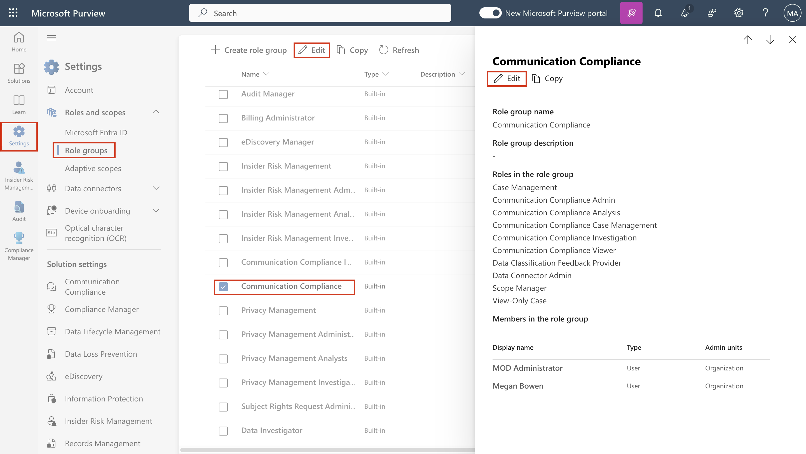
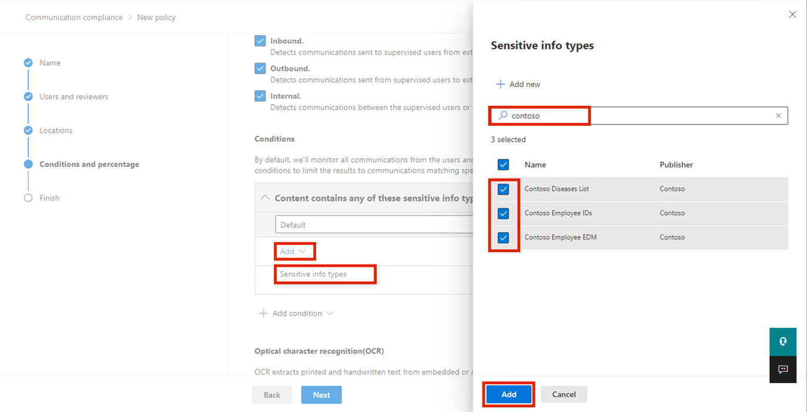
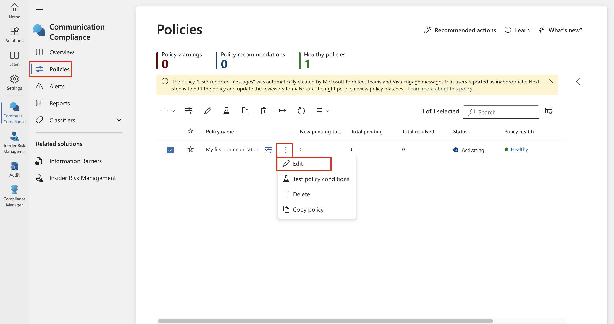

# **实验 9 – 配置通信合规性**

## 介绍

在本实验室中，你将配置合规性策略，以检测组织中用户正在通信的任何敏感信息。你将使用在前面的实验室中创建的敏感信息类型来检测通过电子邮件传达的员工健康数据或员工
ID。

目标

- 分配通信合规性访问的角色。

- 使用 PowerShell 创建通讯组。

- 配置和编辑通信合规性策略。

- 启用匿名化和用户通知。

- 了解策略测试过程。

## 练习 1 – 启用通信合规性权限

在此任务中，你将把用户分配到特定角色组，以对组织中不同用户之间的通信合规性访问和职责进行分段。

1.  在 navigation 菜单中，选择“**Settings**”，然后选择“**Roles and
    scopes**”。导航并单击“**Role groups**”。

2.  向下滚动并选中“**Communication
    Compliance**”旁边的复选框。然后，单击铅笔图标进行 **Edit**。

3.  在“**Edit members of the role group**”上，选择“**Choose Users**”。 

4.  确保选择 **MOD Administrator**, **Megan Bowen**,和 **Patti
    Fernandez**。然后选择**Select**。

5.  选择 **Next**。

6.  选择“**Save**”以将用户添加到角色组。选择 **Done** 以完成步骤。 

## 练习 2 – 设置通信合规性组

在策略中，你将使用电子邮件地址来标识个人或人员组。为了简化设置，您可以为已审核通信的人员创建群组，并为审核这些通信的人员创建群组。

可以使用 PowerShell
为分配的组配置通讯组的全局通信符合性策略。这使你能够使用单个策略检测数千个用户的邮件，并在新员工加入组织时保持通信合规性策略更新。

1.  右键单击 Windows 图标，然后导航并选择 **Windows
    PowerShell（Admin）**

1.  On User Account Control dialog box, select **Yes**.

2.  输入以下 cmdlet 以使用 **Exchange Online PowerShell**
    模块并连接到租户:

**+++Connect-ExchangeOnline+++**

3.  显示“**Sign in**”窗口时，以 **MOD Administrator** 身份登录。如果
    **Automatically sign in to all desktop apps and websites on this
    device?** 此对话框出现，然后选择“**No, this app only**”按钮 

4.  使用以下属性为全局通信合规性策略创建专用通讯组:

    - **MemberDepartRestriction = Closed**。
      确保用户无法从通讯组中删除自己。

    - **MemberJoinRestriction =
      Closed**。确保用户无法将自己添加到通讯组。

    - **ModerationEnabled =
      True**。确保发送到此组的所有消息都经过审批，并且该组不用于在通信符合性策略配置之外进行通信。

**+++New-DistributionGroup -Name "Communication Compliance Group
Contoso" -Alias "CCG_Contoso" -MemberDepartRestriction
'Closed' -MemberJoinRestriction 'Closed' -ModerationEnabled $true+++**

**注意：**您可以添加 **Exchange Custom Attribute** ，如以下**command**
所示，以跟踪添加到组织中通信合规性策略的用户。

**+++Set-DistributionGroup -Identity "Communication Compliance Group
Contoso"-CustomAttribute1 "MonitoredCommunication"+++**

5.  按定期计划运行以下 PowerShell 脚本，将用户添加到通信合规性策略:

**+++$Mbx = (Get-Mailbox -RecipientTypeDetails UserMailbox -ResultSize
Unlimited -Filter {CustomAttribute9 -eq $Null})**

**$i = 0**

**ForEach ($M in $Mbx)**

**{**

**Write-Host "Adding" $M.DisplayName**

**Add-DistributionGroupMember -Identity "Communication Compliance Group
Contoso" -Member $M.DistinguishedName -ErrorAction SilentlyContinue**

**Set-Mailbox -Identity $M.Alias -CustomAttribute1
"MonitoredCommunication"**

**$i++**

**}**

**Write-Host $i "Mailboxes added to supervisory review distribution
group." +++**

6.  从脚本生成输出后，打开一个新选项卡并输入以下
    URL：+++<https://admin.cloud.microsoft/>+++以打开 Microsoft 365
    admin center。

7.  在 Microsoft 365 admin center 页中，导航并单击 **Teams &
    groups\>Active teams & groups\>Distribution list\>Communication
    Compliance Group Contoso**。

8.  在右侧显示的“Communication
    Compliance”窗格中，单击“Members”选项卡，向下滚动并查看“Distribution
    list”组中的所有成员。

## 练习 3 – 创建通信合规性策略

1.  在 Microsoft Purview 门户中，选择“**Solutions** \> **Communication
    Compliance**”。

2.  在“**Communication
    Compliance**”边栏选项卡中，导航并单击“**Policies**”。然后，在“**Policies**”页中，选择“**+
    Create policy**”，然后单击“**Custom policy**”。

3.  在“**Name**”字段中，在“**Name**”字段中键入 **+++My first
    communication compliance
    policy+++**，并在“**Description**”字段中键入 **+++This is a policy
    to test communication compliance+++**。选择 **Next**。

4.  在“**Choose users and
    reviewers** ”页上，导航到“**Reviewers**”部分，键入并选择“**Patti
    Fernandez**”。然后，单击“下**Next** ”按钮。

5.  在“**Choose locations to detect**
    **communications** ”页上，确保选中“**Microsoft 365
    locations** 下的所有复选框，然后单击” **Next** “按钮。

6.  在“**Choose conditions and review
    percentage**”上，向下滚动并选择“**Add
    condition**”，然后导航并选择“**Content contains sensitive info
    types**”。

7.  在“**Content contains any of these sensitive info
    types**”框中，选择“**Add**”，单击“**Sensitive info
    types**”，然后搜索“**contoso**”。选中我们在早期实验室中创建的所有敏感信息类型的框。然后点击
    **Add**  

8.  向下滚动并选中旁边的复选框 **Use OCR to extract text from
    images**，**Review percentage to 100%**，然后单击 **Next** 按钮。

9.  在“**Review and finish** ”页上，选择“**Create policy**”。

10. 将显示“**Your policy was
    created** ”页面，其中包含有关何时激活策略以及将捕获哪些通信的指南。现在，单击“**Done**”按钮。

## 练习 4 – 编辑通信合规性策略

1.  在“**Communication Compliance – Policies**”页中，单击“**My first
    communication compliance
    policy**”旁边的省略号，然后导航并单击“**Edit**”。

**注意**：如果您没有看到我的第一个通信合规性策略，请刷新页面。

2.  保留 **Name and describe your policy**，然后单击 **Next** 按钮。 

3.  在“**Choose users and reviewers**”页上，导航并选择“**Select
    users**”旁边的单选按钮。 

4.  在“**Start typing to find users or
    groups**”中，搜索“**Communication**”，然后选择“**Communication
    Compliance Groups Contoso**”。

5.  在“**Reviewers**”部分中，键入并选择“MOD
    Administrator”。选择“**Next**”，直到到达“**Review and finish**”页。 

6.  然后，单击“**Save**”按钮。

## 练习 5 – 创建通知模板并配置用户匿名化

1.  在 Microsoft Purview
    门户中，选择右上角的“**Settings**”，然后导航并选择“**Communication
    Compliance**”。

2.  在“**Communication Compliance settings –
    Privacy**”页中，若要启用匿名化，请确保选择“**Show anonymized
    versions of usernames**”单选按钮。然后，单击“**Save**”按钮。

**注意：**如果“**Save**”按钮未突出显示，请选择其他功能单选按钮，然后再次选择“**Show
anonymized versions of usernames**”单选按钮。

3.  选择 **Notice templates**，然后单击 + 符号以创建通知模板。

4.  在修改**Modify a notice template** 页上，填写以下字段:

    - 模板名称（必填）：**+++Sample Notice+++**

    - 发送自（必填）：通过键入 **Patti** 并从下拉列表中选择姓名来选择
      **Patti Fernandez**。

    - 抄送（可选）：通过键入 **MOD** 并从下拉列表中选择名称来选择
      **MOD administrator**。

    - 科目（必填）：**+++Your communication violets company
      Communication compliance policy.+++**

    - 消息正文（必填）：**+++Please note this for future reference and
      provide an acceptable justification for your current
      communication. +++**

5.  选择 **Create** 以创建并保存通知模板。

## 练习 6 – 测试通信合规性策略

在试用帐户中，您将没有发送任何电子邮件的权限，但您可以查看以下步骤，了解如何在拥有自己的许可证时测试策略。您可以执行一些步骤，但您的邮件将无法从当前租户到达收件人。

1.  转到 打开 **+++https://outlook.office365.com/mail/+++**和 使用用户名
    **+++adelev@WWLxXXXXXX.onmicrosoft.com+++**和用户密码登录。

2.  向您的个人电子邮件帐户发送一封电子邮件，其中包含以下邮件正文。

主题行：**Patti Fernandez (EMP123456) on Medical Leave Due to Flu**

消息正文：**+++Employee Patti Fernandez EMP123456 is on absence
because of the flu/influenza+++**

**注意** 电子邮件可能需要大约 24 小时才能在策略中完全处理。Microsoft
Teams、Yammer 和第三方平台中的通信可能需要大约 48
小时才能在策略中完全处理。

以 **Patti Fernandez** 身份登录
**+++https://purview.microsoft.com/+++** 。导航到“**Communication
compliance** \> **Alerts** ”，查看 24 小时后策略的警报。

**总结：**

在本实验室中，你已了解如何在 Microsoft Purview
中配置和管理通信合规性。分配了所需的角色，使用 PowerShell
创建通讯组，并设置合规性策略以监视内部通信。你启用了匿名化以在评审期间保护用户标识，创建了用户通知模板，并了解如何在完全强制实施之前模拟和测试通信合规性策略。
