# **Lab 3 – Managing Trainable Classifiers**

## **Introduction**

The Contoso Ltd. tenant contains a SharePoint site collection with the
name "Sales and Marketing" that will be used in the future to store
several financial related documents and reports. Because of the nature
of these documents, you need to create a trainable classifier to
recognize and label these files. For this purpose, you will activate
custom trainable classifiers and create a new one in this lab.

## **Objectives**

- Create a trainable classifier to identify and categorize typical data stored in selected SharePoint sites.

## Exercise 1 – Creating a trainable classifier

In this task, Patti will create a new trainable classifier and select
different SharePoint sites for identifying typical data created and
stored by Contoso Ltd.

1.  In **Microsoft Edge**, open a **New InPrivate Window**, navigate
    to **+++https://purview.microsoft.com+++** and log in as **Patti
    Fernandez** using the username **PattiF@WWLxXXXXXX.onmicrosoft.com**
    and the User Password given on your resources tab.

2.  From the left navigation, select **Solutions** \> **Data Loss
    Prevention**.

    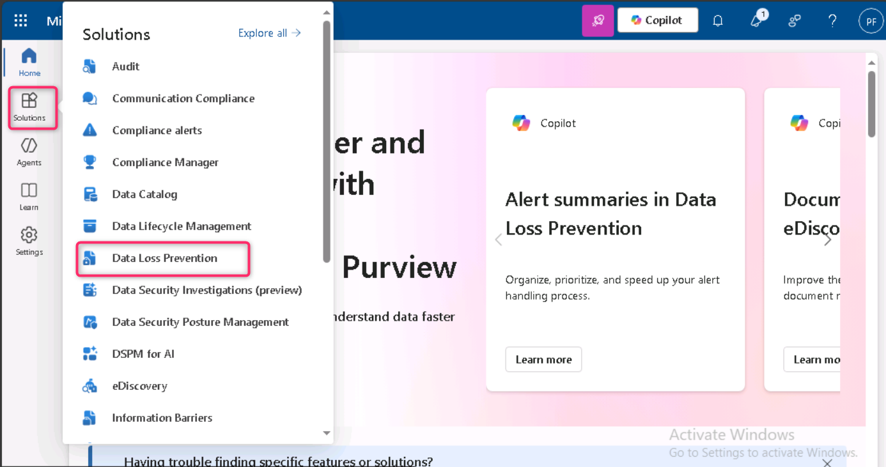

3.  Expand **Classifiers** from the left pane. Select **Trainable
    Classifiers** from the sub-navigation pane. Select **+ Create
    trainable classifier** to create a new classifier.

    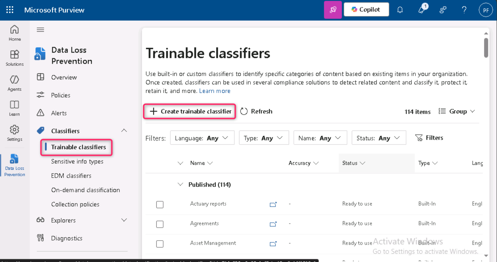

4.  Enter the following information:

5.  Name: **+++Contoso Company Data+++**

6.  Description: **+++Trainable classifier for company data produced and
    stored by Contoso Ltd.+++**

7.  Select **Next**.

    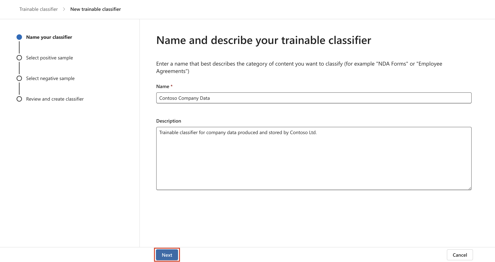

8.  Select **Choose sites** to open the right side pane.

    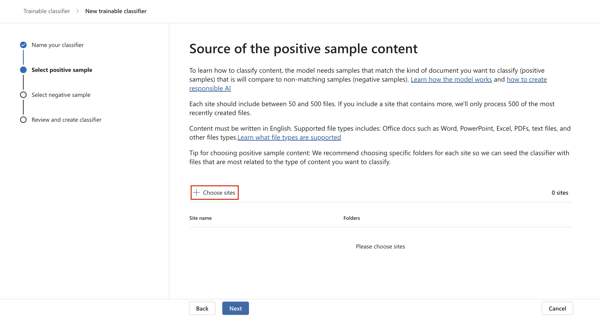

9.  Select the following SharePoint sites and select **Add**.

    - Brand

    - Digital Initiative Public Relations

    - Work

    - Sales and Marketing

    - Mark 8 Project Team

    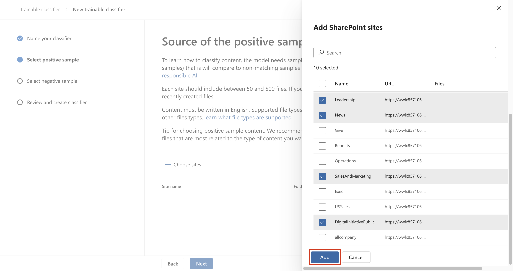

10. Wait until the chosen site is shown in the list and select **Next**.

    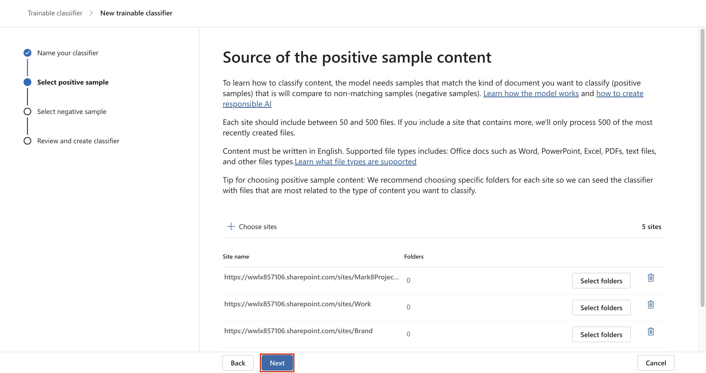

11. On the **Source of the negative sample content page**, click on the
    **+ Choose sites**

    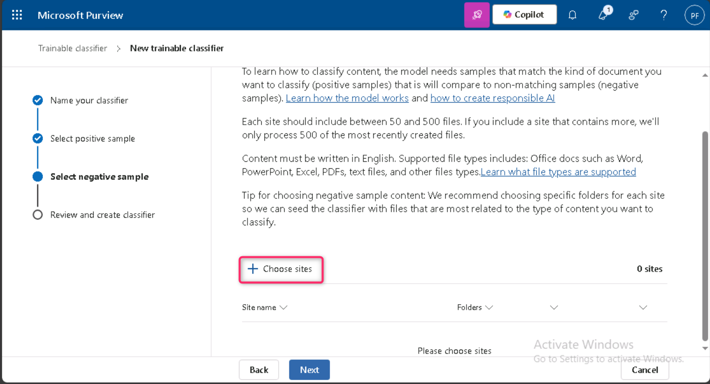

12. In **Add SharePoint sites** pane, navigate and select the checkbox
    beside **Learn**, then click on the **Add** button.

    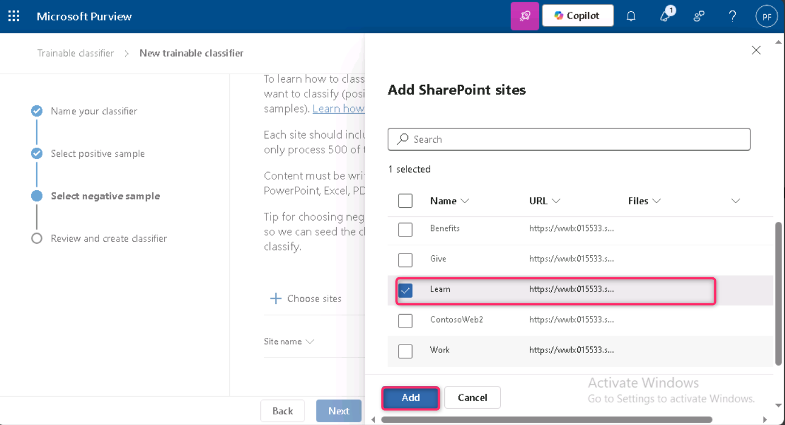

13. Click on the **Next** button.

    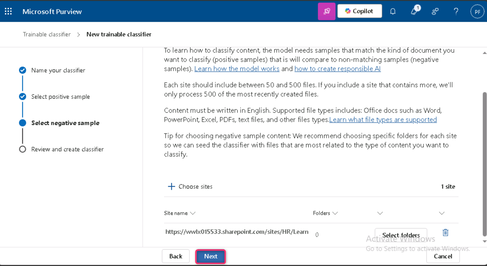

14. Review the settings and select **Create trainable classifier**.

    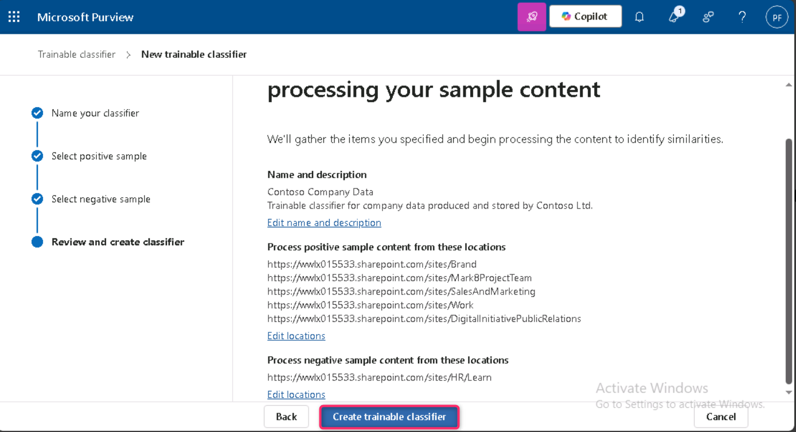

15. On **Your trainable classifier is being trained** page, click on the
    **Done** button.

    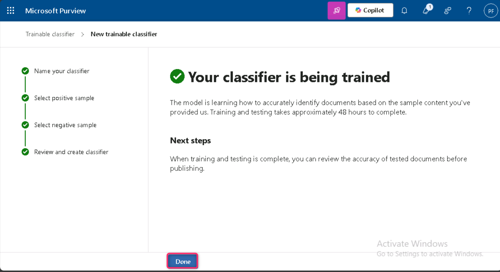

The documents and files in the chosen SharePoint site are now being
analyzed, which can take up to 24 hours.

## Summary:

In this lab, you’ve created a trainable classifier in Microsoft Purview
named *Contoso Company Data* by selecting relevant SharePoint sites as
positive and negative content sources. This classifier will analyze
documents to identify company-specific data, with training taking up to
24 hours.
