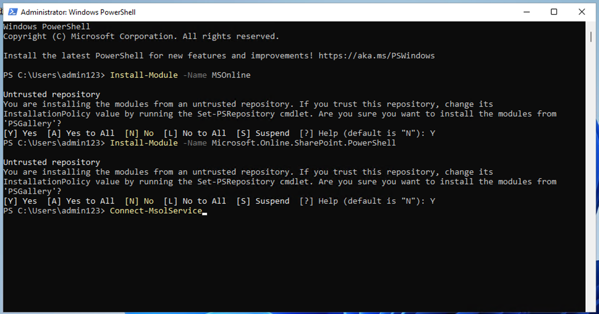
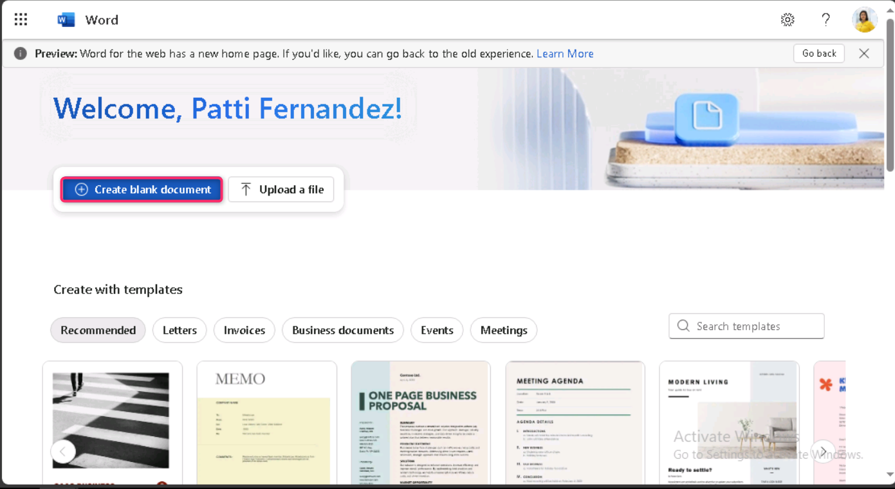
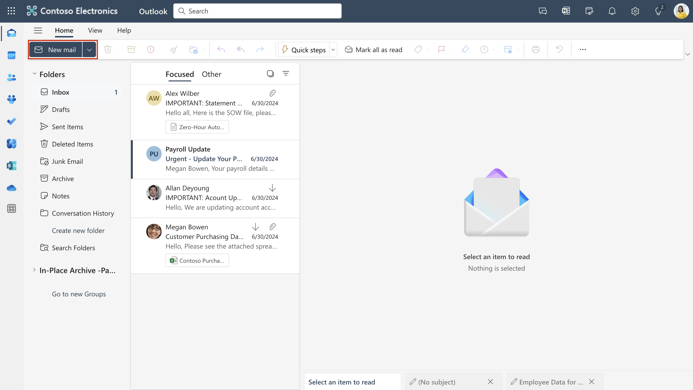
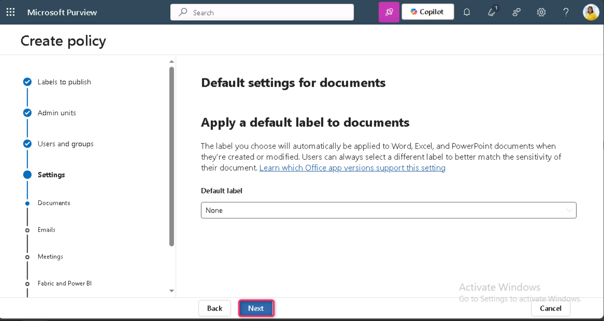

# **Lab 3 – Working with Sensitivity Labels**

## **Introduction**

In this lab, you will assume the role of Patti Fernandez, a System
Administrator for Contoso Ltd. Your organization is based in
Rednitzhembach, Germany and is currently implementing a sensitivity plan
to ensure that all employee documents in the HR department have been
marked with a sensitivity label as part of your organizations
information protection policies.

## **Objectives**

- Enable support for sensitivity labels in Microsoft 365 and SharePoint.

- Create and publish sensitivity labels and sublabels with protection
  settings.

- Apply sensitivity labels in Microsoft 365 apps (Word, Outlook,
  OneDrive).

- Configure and test auto-labeling policies based on sensitive
  information types.

## Exercise 1 – Enabling support for sensitivity labels

In this task, you will install the MSOnline module and the SharePoint
Online PowerShell module and enable support for sensitivity labels on
your tenant.

1.  Right click on Windows icon, then navigate and click on **Windows
    PowerShell (Admin)** 

    

2.  On the **User Account Control** dialog box, click on the **Yes**
    button.

    

3.  Enter the following cmdlet to install the latest Microsoft Online
    PowerShell module version:

    **+++Install-Module -Name MSOnline+++**

    

4.  On **You are installing the modules from an untrusted repository...
    message**, type **Y** then press the Enter button

    

5.  Enter the following cmdlet to install the latest SharePoint Online
    PowerShell module version:

    **+++Install-Module -NameMicrosoft.Online.SharePoint.PowerShell+++**

    

6.  On **You are installing the modules from an untrusted repository...
    message**, type **Y** then press the Enter button

    

7.  Enter the following cmdlet to connect to the Microsoft Online
    service:

    **+++Connect-MsolService+++**

    

8.  In the **Sign in to your account** form, log in as **Patti
    Fernandez** using the username **PattiF@WWLxXXXXXX.onmicrosoft.com**
    and the User Password given on your resources tab.

    

    

9.  Enter the following cmdlet to get the domain:

    **+++\\domain = get-msoldomain+++**

    

10. Enter the following cmdlet to create the SharePoint admin url:

    **+++\\adminurl = "https://" +\\domain.Name.split('.')\[0\] +"-admin.sharepoint.com"+++**

    

11. Enter the following cmdlet to sign in to the SharePoint Online admin
    center:

    **+++Connect-SPOService -url \\adminurl+++**

    

12. In the **Sign in to your account** form, log in as **MOD
    Administrator** using the credentials provided in the resources tab
    of your lab environment.

    

13. Enter the following cmdlet to enable support for sensitivity labels:

    **+++Set-SPOTenant -EnableAIPIntegration $true+++**

    

14. Confirm the changes with **Y** for Yes and press Enter.

    

15. Close the **PowerShell** window.

You have successfully enabled support for sensitivity labels with Teams
and SharePoint sites.

## Exercise 2 – Creating Sensitivity Labels

In this task, your HR department has requested a sensitivity label to
apply to HR employee documents. You will create a sensitivity label for
Internal documents and a sublabel for the HR department.

1.  Open an **Microsoft Edge** browser in Private window, navigate to
    **+++**https://purview.microsoft.com**+++** and log in as **Patti
    Fernandez** using the username **PattiF@WWLxXXXXXX.onmicrosoft.com**
    and the User Password given on your resources tab.

2.  In the Microsoft Purview portal, on the left navigation pane, select
    **Solutions** \> **Information Protection**.

    

3.  From the sub-navigation select **Sensitivity Labels** \> **Create
    Labels**.

    

4.  The **New sensitivity label** wizard will start. On the **Label
    details** page for the **Name**, **Description for
    admins** and **Description for users**, enter the following
    information:

    - Name: **+++Internal+++**

    - Display name: **+++Internal+++**

    - Description for users: **+++Internal sensitivity label+++**

    - Description for admins: **+++Internal sensitivity
      label for Contoso.+++**

      

5.  Select **Next**.

    

6.  On the **Define the scope for this label** page, ensure that the
    checkboxes of **Files & other data assets** are selected. Then,
    uncheck the checkbox of **Meetings** and click on the **Next**
    button.

    

7.  On the **Choose protection settings for the types of items you
    selected** page, click on the **Next** button.

    

8.  On the **Auto-labeling** for files and emails page, select **Next**.

    

9.  On the **Define protection settings for groups and sites** page,
    select **Next**.

    

10. On the **Review your settings and finish** page, click on the
    **Create label** button.

    

11. On **Your sensitivity label was created** page, navigate and select
    the radio button of **Don’t create a policy yet**. Then, click on
    the **Done** button.

    

12. On the **Information protection** page, navigate to the **Internal**
    label and select the vertical ellipsis

13. Then, navigate and click on **Create sublabel**.

    

14. The **New sensitivity label** wizard will start. On the **Label
    details** page, enter the following information:

    - Name: **+++Employee data (HR) +++**

    - Display name: **+++Employee data (HR) +++**

    - Description for users: **+++This HR
      label is the default label for all specified documents in the
      HR Department. +++**

    - Description for admins: **+++This label is created in
      consultation with Ms.Jones (Head of HR department). Contact her,
      when you want to change settings of the label. +++**

    

    

15. On the **Define the scope for this label** page, ensure that Files &
    other data assets, Emails, and Meetings checkboxes are selected,
    then click on the **Next** button.

    

16. On the **Choose protection settings for labeled items** page, select
    the **Control Access** option. Select **Next**.

    

17. On **Access control** page, ensure that **Configure access control
    settings** is selected.

    

18. Enter the following information into the encryption settings:

    - Assign permissions now or let users decide?: **Assign permissions
      now**

    - User access to content expires: **Never**

    - Allow offline access: **Only for a number of days**

    - Users have offline access to the content for this many
      days: **15**

    

19. Select the **Assign permissions** link.

    

20. On the **Assign permissions** pane, select the **+ Add any
    authenticated users**.

    

21. Select **Save**.

    

22. On the **Access control** page, select **Next**.

    

23. On the **Auto-labeling for files and emails** page, select **Next**.

    

24. On the **Define protection settings for groups and sites** page,
    select **Next**.

    

25. On the **Review your settings and finish** page, select **Create
    label**.

    

26. On **Your sensitivity label was created** page, select the radio
    button of **Don’t create a policy yet**, then click on the **Done**
    button.

    

You have successfully created a sensitivity label for your organizations
internal policies and a sensitivity sublabel for the Human Resources
(HR) department.

## Exercise 3 – Publishing Sensitivity Labels

You will now publish the Internal and HR sensitivity label so that the
published sensitivity labels will be available for the HR users to apply
to their HR documents.

1.  In **Microsoft Edge** navigate to
    **+++https://purview.microsoft.com+++** and log in as **Patti
    Fernandez** using the username **PattiF@WWLxXXXXXX.onmicrosoft.com**
    and the User Password given on your resources tab.

2.  In the Microsoft Purview portal, on the left navigation pane, select
    **Solutions** \> **Information Protection**.

    

3.  From the sub-navigation select **Sensitivity Labels** \> **Publish
    Labels**.

    

4.  The publish sensitivity labels wizard will start.

5.  On the **Choose sensitivity labels to publish** page, select
    the **Choose sensitivity labels to publish** link.

    

6.  A side bar called **Sensitivity labels to publish** will appear on
    the right.

7.  Select the **Internal** and **Internal/Employee Data
    (HR)** checkboxes. Select **Add**.

    

8.  On the **Choose sensitivity labels to publish** page,
    select **Next**.

    

9.  On Assign admin units page, select **Next**.

    

10. On **Publish to users and groups** page, ensure that **Users and
    groups** checkbox is selected, then click on the **Next** button.

    

11. On the **Policy settings** page, select **Next**.

    

12. On the **Apply a default label to documents** page, select **Next**.

    

13. On the **Apply a default label to emails** page, select **Next**.

    

14. On the **Default settings for meetings and calendar events**,
    select **Next**.

    

15. On the **Default settings for Fabric and Power BI content page**,
    select **Next**.

    

16. On the **Name your policy** page, enter the following information,
    then click on the **Next** button:

    - **Name**: **+++Internal HR employee data+++**

    - **Enter a description for your sensitivity label
      policy**: **+++This HR label is to be applied to internal HR
      employee data. +++**

    

17. On the **Review and finish** page, select **Submit**.

    

18. The policy will be created and when complete a message will
    display **New policy created**.

19. Select **Done and proceed to next task without closing the window**.

    

You have successfully published the Internal and HR sensitivity labels.
Note that it can take up to 24 hours for changes to replicate to all
users and services.

## Exercise 4 – Working with Sensitivity Labels

In this task, you will create sensitivity labels in Word and Outlook
emails. The document created will be stored in OneDrive and sent to an
HR employee via email.

1.  Navigate to **+++https://portal.office.com+++** and log in as
    **Patti Fernandez**.

2.  In case, **Copilot everywhere you need it** dialog box appears, then
    close it.

    

3.  Now, click on **Apps** on the left-sided navigation menu, then click
    on **Word**.

    

4.  On **Welcome, Patti Fernandez!** page, click on the **Create blank
    document** button.

    

5.  If a **Your privacy options** message appears, then click on the
    **Close** button.

    

6.  Enter the following contents into the word document:

    **+++Important HR employee document.+++**

7.  Then, select **Sensitivity** from the top pane to open the dropdown
    menu, navigate and click on **Internal**.

    

8.  Click on **Employee data (HR)** to apply the label.

    

**Note**: Be aware, the script you ran in task 1 of this exercise
activated sensitivity labels in Word for your tenant. It can sometimes
take an hour for that activation to be realized in Microsoft Word
online. If you don't see the Sensitivity label menu in Word, you may
need to return to this lab later or make sure you properly completed
task 1 of this exercise.

9.  Select the **Document – Saved** in the upper left of the window,
    enter **HR Document** as the File Name and press **Enter** key.

    

10. Close the word tab. In M365 Copilot – Apps page, click on
    **Outlook**.

    

11. If **Your privacy matters** dialog box appears, then click on the
    **Continue** button.

    

12. In Outlook on the web, select **New message** from the upper left of
    the window.

    

13. In the **To** field enter the name: **Adele** and select **Adele
    Vance** from the drop-down list.

    

14. In the subject field, enter: **+++Employee data for HR+++**.

15. Within the email body, insert the following message:

   **+++Dear Ms. Adele,**

  **Please find attached the important HR employee document.**

   **Kind regards,**

  **Patti Fernandez+++**

  

16. Select the **paperclip symbol** from the bottom menu.

  

17. Select the **HR Document.docx** below **Suggested attachments** to
    attach the document.

  

  

18. Select **Send** to send out the email message with attached
    document.

19. Leave the browser window open.

You have successfully created an HR Word document with a sensitivity
label, which was saved onto your OneDrive. You then emailed to document
to an HR staff member where the email was also set with a sensitivity
label.

In the trial account, note that you will be able to send the mail but it
will bounce back and will not be able to reach the receiver from your
current tenant.

## Exercise 5 – Configuring Auto Labelling

In this task, you will create a **Sensitivity Label** that will auto
label documents and emails found to contain information related to
the **European General Data Protection Regulation (GPDR)**.

1.  In **Microsoft Edge**, the Microsoft Purview portal tab should still
    be open.

2.  You should be logged into the portal as **Patti Fernandez**.

3.  Under the **Information protection**, navigate and click on
    **Sensitivity** **Labels**, select the checkbox beside
    **Internal** label, and click on the vertical ellipsis. Navigate and
    click on **+ Create sublabel**.

    

4.  The **New sensitivity label** wizard will start. On the **label
    details** page, enter the following information:

    - Name: **+++GDPR Germany+++**

    - Display name: **+++GDPR Germany+++**

    - Description for users: **+++This document or email contains data
      related to the European General Data
      Protection Regulation(GPDR) for the region Germany. +++**

    - Description for admins: **+++This label is auto applied
      to German GDPR documents. +++**

5.  Select **Next**.

    

    

6.  On **Define the scope for this label** page, ensure that the
    checkboxes for **Files & other data assets, Emails,** and
    **Meetings** are selected, then click on the **Next** button.

    

7.  On the **Choose protection settings for the types of items you
    selected** page, select **Next**.

    

8.  On the **Auto-labeling for files and emails** page, turn on the
    toggle for **Auto-labeling for files and emails**.

    

9.  In the **Detect content that matches these conditions** section,
    select **+Add condition** and then select **Content contains**.

    

10. In **Content contains** section select the **Add** text and then
    select **Sensitive info types**.

    

11. A **Sensitive info types** panel will be displayed on the right.

12. In the **Search for sensitive info types** search panel, enter the
    following information:

    **+++German+++**

13. Press the enter button, the results will display sensitivity info
    types related to Germany. Select the checkbox beside **Name** to
    select all sensitive info types.

    

14. Select **Add**.

    

15. Select **Next**.

    

16. On the **Define protection settings for groups and sites** page,
    select **Next**.

    

17. On the **Review your settings and finish** page, select **Create
    label**.

    

18. On **Your sensitivity label was created** page, select the radio
    button for **Automatically apply label to sensitive content**, then
    click on the **Done** button.

    

19. From the sub-navigation select **Sensitivity Labels** \> **Publish
    Labels**.

    

20. The **Publish sensitivity labels wizard** will start.

21. On the **Choose sensitivity labels to publish** page, select the
    **Choose sensitivity labels to publish** link.

    

22. **Sensitivity labels to publish** pane will appear on the right
    side. Navigate and select the **Internal** and **Internal/GDPR
    Germany** checkboxes, then click on the **Add** button.

    

23. On the **Choose sensitivity labels to publish** page,
    select **Next**.

    

24. On Assign admin units page, click on the **Next** button.

    

25. On the **Publish to users and groups** page, select **Next**.

    

26. On the **Policy settings** page, select **Next**.

    

27. On the **Apply a default label to documents** page, select **Next**.

    

28. On the **Apply a default label to emails** page, select **Next**.

    

29. On the **Default settings for meetings and calendar events**,
    select **Next**.

    

30. On the **Default settings for Fabric and Power BI content page**,
    select **Next**.

    

31. On the **Name your policy** page, enter the following information:

    - Name: **+++GDPR Germany policy+++**

    - Enter a description for your sensitivity label
      policy: **+++This auto apply sensitivity labels policy is for the
      GDPR region of Germany. +++**

32. Select **Next**.

    

33. On the **Review and finish** page, select **Submit**.

    

34. On **New policy created** page, click on the **Done** button.

    

## Summary

In this lab, you assumed the role of Patti Fernandez, a system
administrator at Contoso Ltd., and implemented information protection
using Microsoft Purview Sensitivity Labels. You enabled sensitivity
label support in SharePoint and Teams using PowerShell, created and
published an Internal label and an HR-specific sublabel, and applied
these labels in Word documents and Outlook emails. You also created and
published an auto-labeling sensitivity label for GDPR-related content
specific to Germany. These steps ensure HR and regulatory documents are
properly classified and protected within the organization.
