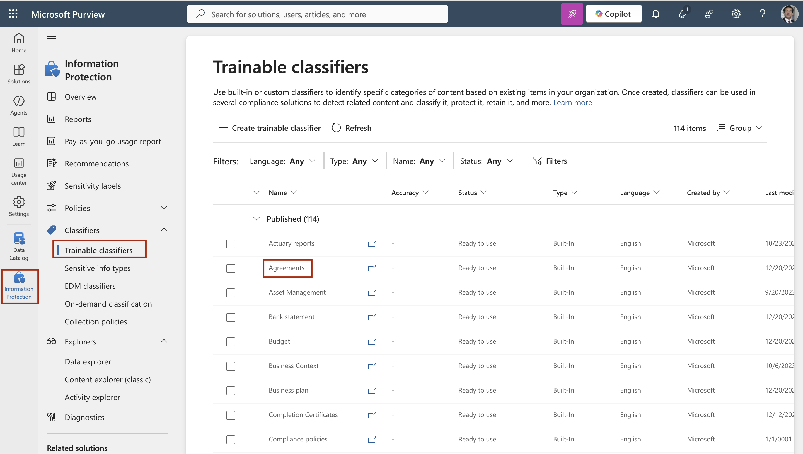
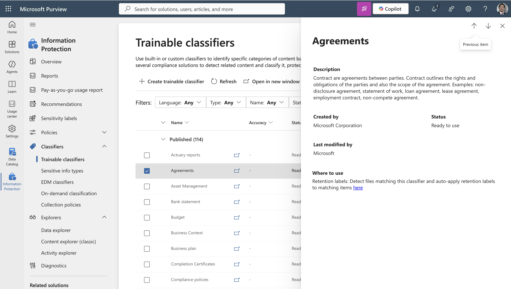
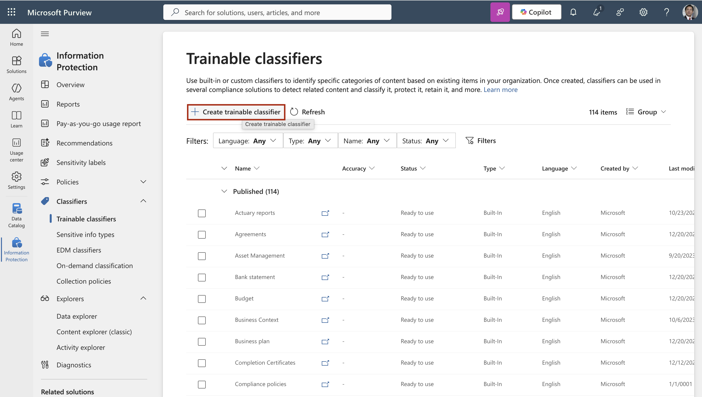
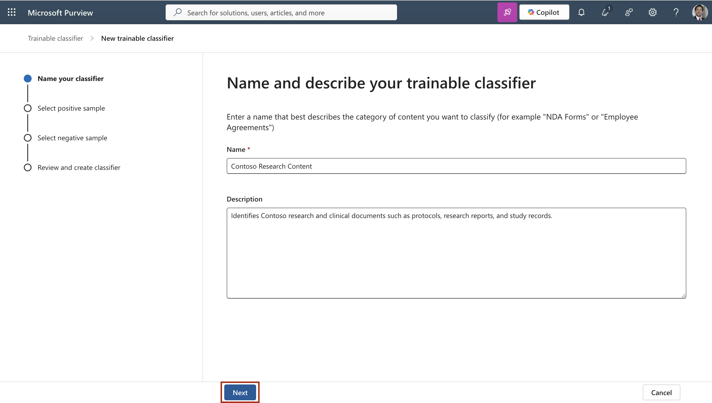
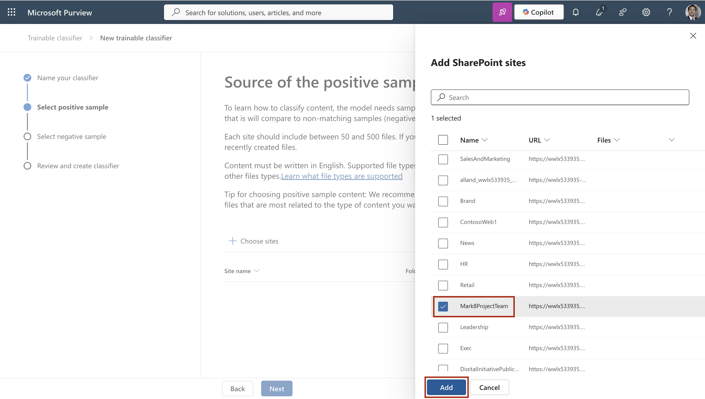
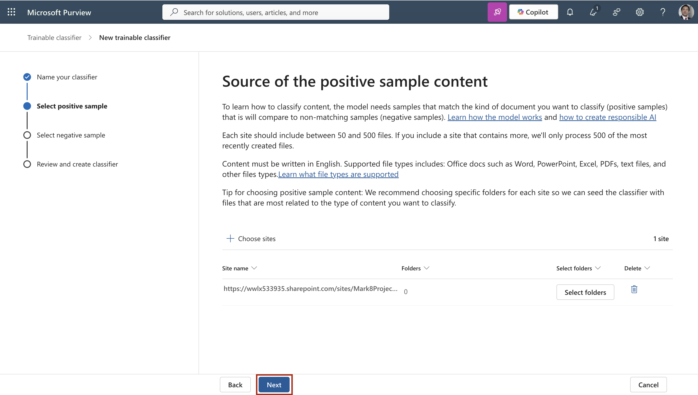
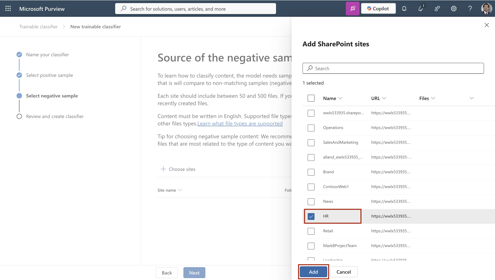
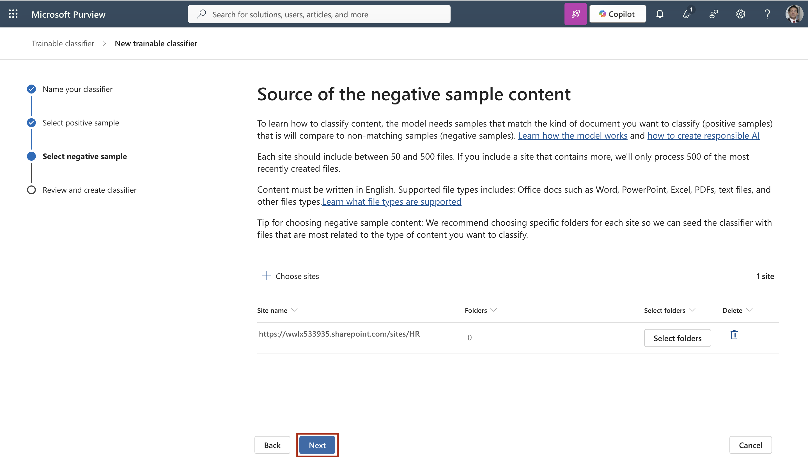
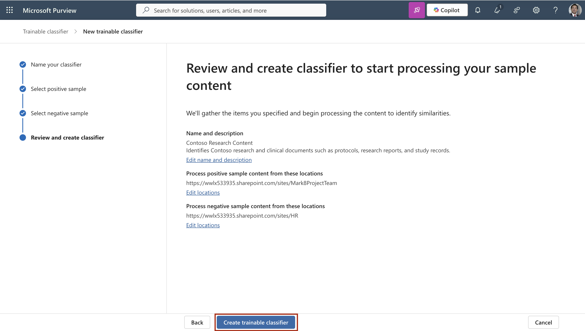

---
lab:
  title: Lab 3 — Classify confidential documents at scale with trainable classifiers and refine them through retraining
  description: In this lab we reviewed built-in trainable classifiers, created a custom trainable classifier from sample content, and learnt how classifiers are tested, tuned, and published.
  duration: 10 minutes
  level: 300
  islab: true
  primarytopics:
    - Microsoft Purview
    - Information Protection
---

# Lab 3 — Classify confidential documents at scale with trainable classifiers and refine them through retraining

Some of Contoso Pharmaceuticals' most sensitive content can't be captured by a pattern or a keyword list. A research report, a clinical protocol narrative, or a regulatory submission has no fixed format — what makes it sensitive is the *kind* of document it is, not a string it contains. For content like this, Microsoft Purview offers trainable classifiers: machine-learning models that learn to recognize a category of document from examples. In this lab, acting as Allan Deyoung, you'll review the built-in classifiers that are ready to use, create a custom trainable classifier for Contoso research content, and learn the operational rules that govern accuracy and publishing — most importantly, that you must get accuracy right *before* you publish, because a published classifier can no longer be retrained.

This lab is a walkthrough of the trainable-classifier lifecycle. Because a custom classifier takes up to 24 hours to train and needs a large body of representative documents to become accurate, no later lab depends on the classifier you create here — the goal is to understand the workflow, the trade-offs, and where a trained classifier fits among Contoso's other controls.

**Learning outcomes.** After this lab you can:

- Explain when a trainable classifier is the right choice compared with sensitive information types and Exact Data Match.
- Review the built-in, ready-to-use trainable classifiers available in Microsoft Purview.
- Create a custom trainable classifier using SharePoint sites as positive and negative seed content.
- Explain how a custom classifier is trained, tested, and tuned before publishing.
- Explain the operational limits of trainable classifiers, including that published classifiers can't be retrained.

**Tasks**:

1. Understand when to use a trainable classifier
2. Review the built-in trainable classifiers
3. Create a custom trainable classifier
4. Understand testing and the publish decision
5. See where a published classifier is used

## Task 1 – Understand when to use a trainable classifier

In this task, you'll review the concept behind trainable classifiers so that you choose the right detection method for a given type of content.

1. Consider the three detection methods you have available in Microsoft Purview and when each fits:

   - **Sensitive information types (SITs)** detect content that follows a *pattern* — a subject ID, a compound ID, a credit card number. You built these in the previous lab. Best when the sensitive data has a recognizable format.
   - **Exact Data Match (EDM)** detects *exact records* from a known data set — the enrolled trial subjects. Best when you want to detect specific known values and nothing else.
   - **Trainable classifiers** detect a *category of document* by learning from examples, when there's no reliable pattern — research reports, clinical protocol narratives, agreements, regulatory submissions. Best for unstructured content that "looks like" a sensitive document type but shares no fixed string.

2. Note the key trade-offs of trainable classifiers, which shape how this lab proceeds:

   - A custom classifier must learn from a **large body of examples** — at least 50 positive documents, with 200 or more recommended for good accuracy.
   - Training takes **up to 24 hours**.
   - Custom trainable classifiers evaluate **English-language content only** and **cannot evaluate encrypted content** (for example, files already protected by an encrypting sensitivity label).

You have successfully reviewed when a trainable classifier is the appropriate detection method.

## Task 2 – Review the built-in trainable classifiers

Before building a custom classifier, it's worth knowing that Microsoft Purview ships a set of pretrained classifiers that are ready to use immediately, with no training required. In this task, you'll review what's available.

1. In **Microsoft Edge**, navigate to **`https://purview.microsoft.com`** and sign in as **Allan Deyoung**, `AllanD@TenantName` (the Tenant Name and account password are provided in the Resources tab).

2. In the left navigation, select **Solutions** > **Information Protection**. Expand **Classifiers**, then select **Trainable classifiers**.

3. Review the list of classifiers. The ones with a status of **Published** are Microsoft's pretrained classifiers — for example, classifiers that detect source code, resumes, agreements, harassment, threat, profanity, and intellectual property. These require no training and can be used in policies right away.

	

4. Select one of the ready-to-use classifiers, such as **Agreements** or **Intellectual property**, and review its description to understand the category of content it detects.

	

> [!NOTE]
> The exact set of pretrained classifiers shown can vary by tenant and region, so review the classifiers that are present in your environment rather than expecting a fixed list. Where a pretrained classifier already covers your need, use it — building a custom classifier is only worthwhile when no pretrained one fits.

You have successfully reviewed the built-in trainable classifiers that are ready to use without training.

## Task 3 – Create a custom trainable classifier

No pretrained classifier specifically recognizes Contoso's internal research content, so you'll create a custom one. In this task, you'll create a custom trainable classifier that learns to distinguish Contoso research and clinical documents from general business content, using existing SharePoint sites as the positive and negative seed sources.

1. In the Microsoft Purview portal as **Allan Deyoung**, select **Solutions** > **Information Protection** > **Classifiers** > **Trainable classifiers**.

2. Select **+ Create trainable classifier**.

	

3. On the details page, enter the following, then select **Next**:

   - **Name**: `Contoso Research Content`
   - **Description**: `Identifies Contoso research and clinical documents such as protocols, research reports, and study records.`

	

4. On the source of positive sample content page, select **+ Choose sites**.

5. In the **Add SharePoint sites** pane, select the sites that hold Contoso's research and clinical content — for example, the **Mark 8 Project Team** site and any research or clinical-operations sites present in your tenant — then select **Add**.

	

6. Wait until the chosen sites appear in the list, then select **Next**.

	

7. On the source of negative sample content page, select **+ Choose sites**.

8. In the **Add SharePoint sites** pane, select one or more sites that hold general, non-research content the classifier should learn to ignore — for example, HR — then select **Add**.

	

9. Select **Next**.

	

10. Review the settings, then select **Create trainable classifier**.

	

11. On the **Your trainable classifier is being trained** page, select **Done**.

> [!IMPORTANT]
> Training takes up to 24 hours as Microsoft Purview analyzes the documents in the chosen sites. Accuracy depends heavily on the volume and quality of the positive samples — the recommended minimum is 50 representative documents, and 200 or more is better. In a lab tenant, the seed sites may contain far fewer documents than a production classifier needs, so the resulting classifier is for learning the workflow rather than for production use. This timing is indicative, not guaranteed.

You have successfully created a custom trainable classifier and started its training.

## Task 4 – Understand testing and the publish decision

A custom classifier's accuracy is set before it goes live, and the window to fix it is narrow. In this task, you'll review how a trained classifier is tested and the critical rule that governs publishing.

1. After training completes (up to 24 hours), a custom classifier moves to a state where you can review its predictions. Microsoft Purview automatically tests the classifier against sample content and reports how well it distinguished positive from negative examples.

2. Understand the tuning window. **Before you publish**, if the accuracy is poor, you improve it by adding more and better positive seed documents and letting the classifier retrain. This is the point at which accuracy is cheap to fix.

3. Understand the publishing rule, which is the most important operational fact about trainable classifiers:

> [!IMPORTANT]
> A published custom trainable classifier **cannot be retrained**. Once you publish a classifier so it can be used in policies, the only way to improve its accuracy is to delete it and start over with a larger, better sample set. For this reason, you tune a classifier's accuracy fully — by refining seed content and retraining — *before* you publish it, not after.

4. Note that publishing is what makes a classifier usable as a condition in policies. An unpublished classifier exists only for review; a published one becomes available to Data Loss Prevention, auto-labeling, and retention policies.

You have successfully reviewed how trainable classifiers are tested and the rule that publishing ends the ability to retrain.

## Task 5 – See where a published classifier is used

A trainable classifier is only valuable once it drives a control. In this task, you'll see where a published classifier plugs into Contoso's other Purview solutions, so you understand its role even though this lab doesn't depend on the classifier you created.

1. Once published, the `Contoso Research Content` classifier would appear as a selectable **condition** in the same way a sensitive information type does, in each of the following:

   - **Auto-labeling policies** (Information Protection) — automatically apply a sensitivity label to documents the classifier identifies as research content.
   - **Data Loss Prevention policies** — detect and restrict sharing of research documents, for example blocking them from leaving the organization.
   - **Retention policies (auto-apply)** — automatically apply a retention label to research content to meet records obligations.

2. Note the limits that carry into those policies: because custom trainable classifiers evaluate only unencrypted, English-language content, a classifier won't detect a document that is already protected by an encrypting label — so classifier-driven policies are typically applied before, or alongside, encryption rather than to already-encrypted content.

3. Recognize that in this course, the labeling, DLP, and retention labs use the sensitive information types and Exact Data Match classifier from the previous lab as their conditions, because those detect immediately and reliably. The trainable classifier you created here illustrates the method and where it fits, without the 24-hour dependency.

You have successfully reviewed where a published trainable classifier is used across Microsoft Purview.

## Summary

In this lab, you learned the trainable-classifier lifecycle in Microsoft Purview: when a trainable classifier is the right choice compared with sensitive information types and Exact Data Match, how to use the built-in pretrained classifiers that are ready immediately, and how to create a custom classifier from SharePoint seed content. You also learned the operational realities that shape real projects — the 24-hour training time, the dependence on a large, representative sample set, the English-only and unencrypted-content limits, and the critical rule that a published classifier cannot be retrained, so accuracy must be tuned before publishing. Because of these characteristics, the classifier created here is a walkthrough of the method, while the course's protection labs rely on the immediate, reliable classifiers built in the previous lab.
