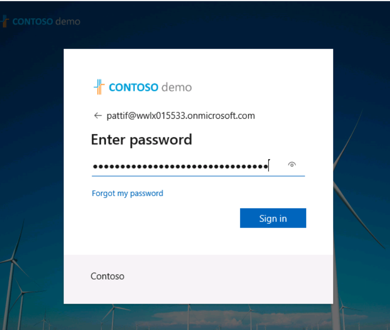
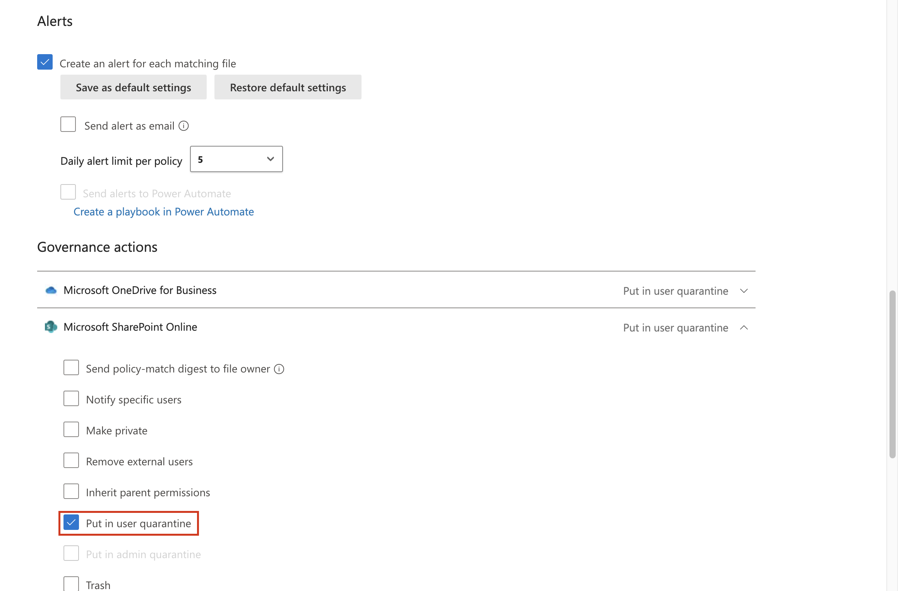
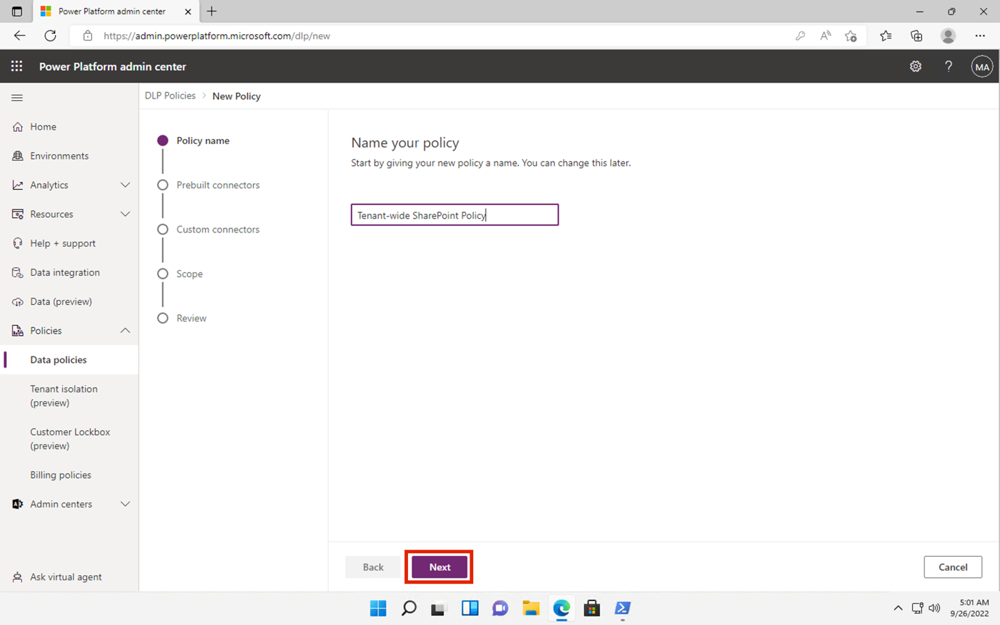
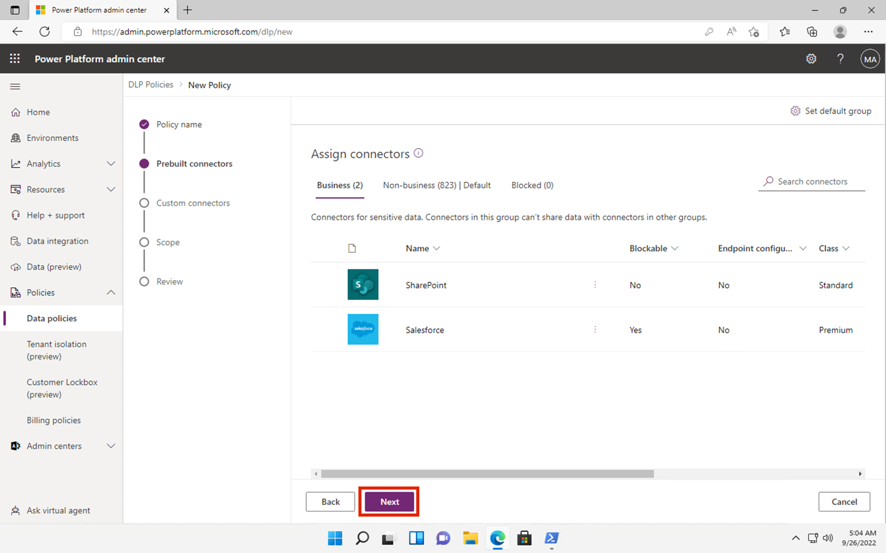

# **Lab 4 – Creating and Managing DLP Policies**

## Introduction

You are Patti Fernandez, the newly hired Compliance Administrator for
Contoso Ltd. tasked to configure the company's Microsoft 365 tenant for
data loss prevention. Contoso Ltd. is a company that offers driving
instruction in the United States and you need to make sure that
sensitive customer information does not leave the organization.

## Objectives 

- Create and test DLP policies in Microsoft Purview.

- Use PowerShell to manage DLP settings.

- Enable file monitoring and create file policies in Defender for Cloud
  Apps.

- Implement DLP for Power Platform to control data flows.

## Exercise 1 – Creating DLP Policies

### Task 1 – Creating a DLP policy in test mode

In this exercise, you will create a Data Loss Prevention policy in the
Microsoft Purview portal to protect sensitive data from being shared by
users. The DLP Policy that you create will inform your users if they
want to share content that contains Credit Card information and allow
them to provide a justification for sending this information. The policy
will be implemented in test mode because you do not want the block
action to affect your users yet.

1.  In **Microsoft Edge**, navigate
    to **+++https://purview.microsoft.com+++** and make sure you are
    logged into the **Microsoft Purview** portal as **Patti Fernandez**.

2.  In the **Microsoft Purview** portal, in the left navigation pane,
    select  **Solutions** \> **Data loss prevention**.

    

3.  Under **Data loss prevention**, select **Policies**, and then
    select **+Create policy** to start the wizard for creating a new
    data loss prevention policy.

    

4.  On **Choose what type of data to protect** page, ensure that **Data
    stored in connected sources** radio button is selected, then click
    on the **Next** button.

    

5.  On **Start with a template or create a custom policy** page, scroll
    down and select **Custom** under **Categories.** Then,
    select **Custom policy** under **Regulations**. Click on the
    **Next** button.

    

6.  On the **Name your DLP policy** page,
    type **+++Credit Card DLP Policy+++** in the **Name** field
    and **+++Protect credit card numbers from being shared.+++** in
    the **Description** field. Select **Next**.

    

7.  On the **Assign admin units** page, select **Next**.

    

8.  On the **Choose where to apply the policy** page, select
    the checkbox beside **Teams chat and channel messages** and uncheck
    the checkbox beside other resources, then click on the **Next**
    button.

    

9.  On the **Define policy settings** page, ensure that **Create or
    customize advanced DLP rules** radio button is selected, then click
    on the **Next** button.

    

10. On the **Customize advanced DLP rules** page, select **+ Create
    rule**.

    

11. On the **Create rule** page, type **+++Credit card
    information+++** in the **Name** field.

    

12. Under **Conditions** on the **Create rule** page, select **+ Add
    condition** and select **Content is shared from Microsoft 365** from
    the dropdown menu.

    

13. In the new **Content is shared from Microsoft 365** section, select
    the **with people outside my organization** option.

    

14. Select **+ Add Condition** and then select **Content contains** from
    the dropdown menu.

    

15. In the new **Content contains** area, select **Add** and
    select **Sensitive info types** from the dropdown menu.

    

16. On the **Sensitive info types** pane that appears on the right side,
    enter **+++credit card number+++** in the search bar and press the enter
    button. Select the checkbox beside **Credit Card Number**, then
    select the **Add** button.

    

17. On the **Create rule** page, select **+ Add an action** and
    select **Restrict access or encrypt the content in Microsoft 365
    locations**.

    

18. Under **Restrict access or encrypt the content in Microsoft 365
    locations** section, ensure that **Block users from receiving email
    or accessing shared SharePoint, OneDrive, and Teams files, and Power
    BI items** radio button is selected, then ensure that **Block only
    people outside your organization** radio button is selected.

    

19. On the **Create rule** page, in the **User notifications** section,
    select the switch to put it in the **On** position.

    

20. On the **Create rule** page, in the **User overrides** section,
    under the **Allow overrides from M365 services**, check the
    box **Allow overrides from M365 services. Allows users in Exchange,
    SharePoint, OneDrive and Teams to override policy restrictions.**

    

**Note**: If you were not able to select the check box of **Allow
overrides from M365 services**, enable the check box of **Notify users
in Office 365 with a policy tip** which can be found on the **Create
rule** page under the **User notification \>\\ \>Microsoft 365
services** section from the previous step. Then select the check box
of **Allow overrides from M365 services. Allows users in Exchange,
SharePoint, OneDrive and Teams to override policy restrictions.**

21. Check the box **Require a business justification to override**.

    

22. In the **Incident reports** section, in the **Use this severity
    level in admin alerts and reports** dropdown, select **Low**.

    

23. Select **Save**, then select **Next**.

    

    

24. On the **Policy mode** page, ensure that **Run the policy in
    simulation mode** radio button is selected, and ensure that the
    checkbox beside **Show policy tips while in test mode** is selected.
    Then, click on the **Next** button.

    

25. Select **Submit** to create the policy.

    

26. Once the policy is created, select **Done**.

    

    You have now created a DLP policy that scans for Credit Card numbers in Microsoft Teams chats and channels and allows users to provide a business justification to override the policy.

    

### Task 2 – Modifying a DLP policy

In this task, you will modify the existing DLP policy you created in the
previous step to also scan e-mails for Credit Card information and
inform users if they want to share this content in an e-mail.

1.  Select the checkbox beside **Credit Card DLP Policy**, then click on
    the **Edit** icon in the command bar as show in the below image.

    

2.  On the **Name your DLP policy** and **Assign admin units** page,
    select **Next**.

    

    

3.  On the **Choose where to apply the policy** page, only select the
    checkbox beside **Exchange email** then select **Next** until you
    reach the **Review and finish** page.

    

4.  Select **Submit** to apply the change you made in the policy.

    

5.  Once the policy is updated, select the **Done** button.

    

You have now modified an existing DLP policy and changed the locations
it scans for content.

### Task 3 – Creating a DLP policy in PowerShell

In this task, you use PowerShell to create a DLP policy to protect the
Contoso EmployeeIDs and prevent them from being shared in Exchange.
Users will be informed that they are attempting to share sensitive data
and are blocked from sending the e-mail if it includes Contoso
EmployeeIDs.

1.  Right-click the Windows icon on the taskbar and select Windows
    PowerShell (Admin) to run it as administrator.

    

2.  On the **User Account Control** dialog box, click on the **Yes**
    button.

    

3.  In the PowerShell execute the following commands:

    **+++Install-Module ExchangeOnlineManagement+++**

    **+++Import-Module ExchangeOnlineManagement+++**

    

    

4.  In the **PowerShell** window, enter **+++Connect-IPPSSession+++** and then sign in as **Patti Fernandez.**

    

    

    In case, **Automatically sign in to all desktop apps and websites on this device?** dialog box appears, then click on **No, this app only** button.

    

    

5.  Enter the following command into PowerShell to create a DLP policy
    that scans all Exchange mailboxes:

    **+++New-DlpCompliancePolicy -Name "EmployeeID DLP Policy" -Comment "This policy blocks sharing of Employee IDs" -ExchangeLocation All+++**

    

6.  Enter the following command into PowerShell to add a DLP rule to the
    DLP policy you created in the previous step:

    **+++New-DlpComplianceRule -Name "EmployeeID DLP rule" -Policy "EmployeeID DLP Policy" -BlockAccess $true -ContentContainsSensitiveInformation @{Name="Contoso
Employee IDs"}+++**

    

    

7.  Use the following command to review the **EmployeeID DLP rule**:

    **+++Get-DLPComplianceRule -Identity "EmployeeID DLP rule"+++**

    

You have now created a DLP Policy that scans for Contoso EmpoloyeeIDs in
Exchange by using PowerShell.

### Task 4 – Activating a policy in test mode

In this task, you will activate the credit card information DLP policy
you created in test mode so it enforces its protective actions.

1.  In **Microsoft Edge InPrivate Window**, navigate
    to **+++https://purview.microsoft.com+++** and make sure you are
    logged into the **Microsoft Purview** portal as **Patti Fernandez**.

2.  In the **Microsoft Purview** portal, in the left navigation pane,
    select **Solutions** \> **Data loss prevention**.

    

3.  Under **Data loss prevention**, select **Policies**, and then select
    the policy named **Credit Card DLP Policy** and then select **Edit
    policy**(pencil icon) to open the policy wizard.

    

4.  Select **Next** until you reach the **Test or turn on the
    policy** page and select **Turn the policy on immediately**.

    

5.  Select **Next**, then select **Submit** to activate the policy.

    

6.  Once the policy is updated select **Done**.

    

You have successfully activated the DLP Policy. If the policy detects an
attempt to share credit card information, it will now block the attempt
and allow the users to provide a business justification to override the
block action.

## Exercise 2 – Managing DLP Policies

### Task 1 – Modifying policy priority

After creating two DLP policies, you want to make sure that the more
restrictive policy is processed at a higher priority than the less
restrictive policy. For this reason, you want to move the EmployeeID DLP
Policy into the higher priority.

1.  In **Microsoft Edge**, navigate
    to **+++https://purview.microsoft.com+++** and make sure you are
    logged into the **Microsoft Purview** portal as **Patti Fernandez**.

2.  In the **Microsoft Purview** portal, in the left navigation pane,
    select **Solutions** \> **Data loss prevention**.

    

3.  Under **Data loss prevention**, select **Policies**, then select the
    policy named **Credit Card DLP Policy**. Select **Move to top
    (highest priority)**.

    

4.  In the **Data loss prevention** window, select **Refresh** and
    review the priority in the **Order** column of the policy table.

    

You successfully modified the priority of your DLP policies. If both
policies match the same content the action of the higher priority policy
will be enforced.

### Task 2 – Enabling file monitoring in Microsoft 365 Defender

You want to use file policies in **Microsoft Defender** to protect files
in your OneDrive and SharePoint Online locations. Before you can create
a file policy, you need to enable file monitoring so Microsoft Defender
can scan files in your organization.

1.  Open **Microsoft Edge** and navigate
    to **+++https://security.microsoft.com+++** and log into the
    Microsoft Defender portal as **MOD Administrator**.

2.  In the Microsoft Defender portal, scroll down to **Settings** in the
    left-sided navigation menu, then click on it. In the **Settings**
    page, click on **Cloud Apps**. 

3.  Now, scroll down to **Information Protection** section, then click
    on **Files**. In the **Files** page, select the checkbox beside
    **Enable file monitoring**, then click on the **Save** button.

    

You successfully enabled file monitoring in Microsoft Defender for Cloud
Apps and can now scan files for sensitive content using file policies.

### Task 3 – Creating File Policy for Microsoft 365 Defender

In this task, you want to create a file policy in Microsoft Defender to
scan files in OneDrive and SharePoint Online and automatically
quarantine files containing credit card information if they are shared.

1.  Now, under the same **Information Protection** section, click on
    **Microsoft Information Protection**, then select the checkbox
    beside **Automatically scan new files for Microsoft Information
    Protection sensitivity labels and content inspection warnings**.
    Then, click on the Save button

    

    

2.  Under **Inspect protected files**, click on **Grant Permission**.

    

3.  On **Pick an account** dialog box appears, then select the MOD
    Administrator tenant credentials.

    

4.  In the **Permissions requested** page, click on the **Accept**
    button.

    

5.  You will observe the **Active** status indicating that the
    permission has been successfully granted.

    

6.  In the sub navigation, under **Connected apps** section, click on
    **App Connectors**, then ensure **Microsoft 365** is added.

    

7.  Now, in the **Microsoft Defender** portal left-sided navigation
    pane, expand **Policies** and select **Policy management**.

    

8.  On the **Policies** page, click on **Create policy**, then select
    **File policy**.

    

9.  On the **Create file policy** page,
    type **+++Credit Card Information for files+++** in the **Policy
    name** field, and type **+++Protect credit card numbers from being
    shared in files.+++** in the **Description** field.

    

10. Keep the **Policy Severity** on **Low** (one lighted icon) and make
    sure the **Category** is set to **DLP**. For a file policy, this
    should be the default.

    

11. In the **Files matching all of the following** area, expand the
    dropdown menu **Public (Internet), External, Public** and
    add **Internal**.

    

12. Under **Apply to** section, in the **Inspection Method** dropdown
    menu, select **Data Classification Service**.

    

**Note:** If you do not see the **Data Classification Service** in the
drop down yet, select **None** as of now. Once done come back after some
time to **Policies**\>**Policy management** \>**All Policies**\>**Search
for name: Credit card** \>**Select Credit Card Information for
files**

13. In the **Choose inspection type…** dropdown menu, select **Sensitive
    information type…**.

  

14. In the **Select a sensitive information type** dialog box, type
    +++**Credit Card Number+++** in the search bar, select the checkbox
    beside **Credit Card Number**, then click on the **Done** button.

    

15. Under **Alerts** section, select the checkbox beside **Create an
    alert for each matching file**. Then, click on **Save as default
    settings** button.

    

16. In the **Governance actions** section, expand **Microsoft OneDrive
    for Business** and select **Put in user quarantine**.

    

17. In the **Governance actions** section, expand **Microsoft SharePoint
    Online** and select **Put in user quarantine**.

    

18. Select **Create** at the bottom of the page.

    

19. Select the **Profile picture** of the MOD Admin in the top right and
    select **Sign out** next to the cogwheel, then close the browser.

    

You have now created a file policy that will continuously scan files
saved in OneDrive and SharePoint for credit card information and
quarantine them if they are shared inside your organization.

### Task 4 – Creating a DLP Policy for Power Platform

Your company uses Power Automate flows to share data between SharePoint
Online and SalesForce. In this task, you will create a DLP policy for
Power Platform that allows your existing flows to keep working, but
prevents the creation of flows that will share data between SharePoint
Online and Apps defined as non-business.

1.  In **Microsoft Edge**, navigate
    to **+++https://admin.powerplatform.microsoft.com+++** and log into
    the Power Platform admin center as **MOD Administrator**.

2.  In the **Power Platform admin center** page, disable **New admin
    center** by turning Off the toggle button as shown in the below
    image.

    

3.  If **Feedback to Microsoft** dialog box appears, then close it.

    

4.  In the **Power Platform admin center**, in the left navigation pane,
    select the drop-down for **Policies** and then select **Data
    policies**.

    

5.  On the **Data policies** page, select **+ New Policy**.

    

6.  On the **Name your policy** page, type **+++Tenant-wide SharePoint
    Policy+++**, then select **Next**.

    

7.  On the **Non-business | Default** tab,
    select **SharePoint** and **Salesforce**, then select **Move to
    Business** at the top of the page.

    

8.  In the **Assign connectors** page, select the **Business** tab to
    make sure both SharePoint and Salesforce now appear.

    

9.  Select **Next** twice.

    

    

10. On the **Define scope** page, select **Add all environments**, then
    select **Next**.

    

11. On the **Review and create policy** page, review your policy
    settings, then select **Create policy**.

    

    You have now created a Power Platform DLP policy that prevents users from creating flows involving a SharePoint Online Connector and any connector that is not Salesforce.

    

## Summary:

In this lab, you created and managed Data Loss Prevention (DLP) policies
to protect sensitive data like credit card numbers and employee IDs
across Microsoft Teams, Exchange, OneDrive, SharePoint, and Power
Platform. You built policies using Microsoft Purview and PowerShell,
enabled user notifications and overrides, prioritized policies,
activated file monitoring in Microsoft Defender, and configured file
quarantine actions. Additionally, you created a Power Platform DLP
policy to restrict data sharing with non-business connectors.
