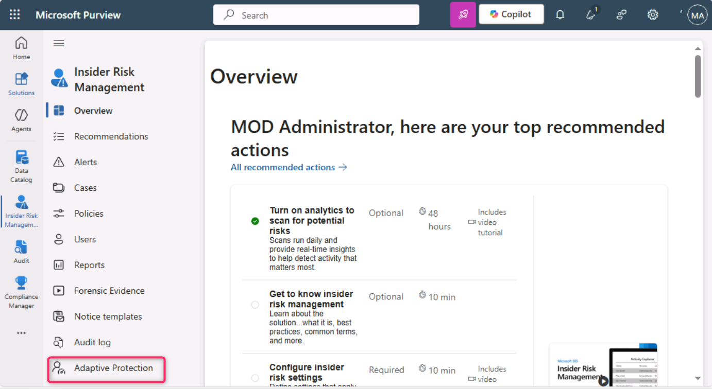

# **Lab 5 – Exploring the capabilities of Adaptive Protection**

**Introduction**

Adaptive Protection in Microsoft Purview integrates Microsoft Purview Insider Risk Management with Microsoft Purview Data Loss Prevention (DLP). When insider risk identifies a user who is engaging in risky behavior, they are dynamically assigned to a inside risk level. Then Adaptive Protection can automatically create a DLP policy to help protect the organization against the risky behavior that's associated with that inside risk level.

**Objectives**

- Set risk thresholds for Adaptive Protection in Insider Risk
  Management.

- Create and configure a custom DLP policy for endpoint protection.

- Define conditions using trainable classifiers and insider risk levels.

- Apply actions to block high-risk data exfiltration activities.

- Enable the policy for immediate enforcement.

## Exercise 1 – Setting up Adaptive Protection

### Task 1 – Setting up risk levels for Adaptive Protection

1.  From the navigation bar, go to **Solutions** \> **Insider risk
    management**.

2.  On the **Insider Risk Management** left-sided pane, navigate and
    click on **Adaptive Protection**.

3.  In the **Adaptive Protection** page, click on **Insider risk
    levels**. Then, navigate to **Insider risk policy** section and
    click on the dropdown beside **Select a policy**. Navigate and
    select the checkbox beside **Data leaks by a user**.

4.  Under **Conditions for insider risk levels**, select User performs
    at least 3 data exfiltration activities, each… for **Elevated risk
    level** field. Select User performs at least 2 data exfiltration
    activities, each… for **Moderate risk level** field. Select User
    performs at least 1 data exfiltration activities,
    each… for **Minor risk level** field. Then, scroll down and select
    the **Save** button.

5.  Click on the **Save** button.

Task 2 – Create a Custom Adaptive Protection DLP Policy for Endpoint

1.  In the **Adaptive Protection** page, navigate and click on **Data
    Loss Prevention**, then click on **+ Create policy**.

2.  On **Choose what type of data to protect** page, ensure that **Data
    stored in connected sources** radio button is selected.

3.  On **Template or custom policy** page, in the **Categories**
    section, navigate and select **Custom**, then under **Regulations**,
    click on **Custom policy**.

4.  In the **Namee your DLP policy** page, **Name** field, enter
    **+++Custom Policy for Endpoint+++**.

5.  In the **Assign admin units** page, click on the **Next** button.

6.  On **Choose where to apply the policy** page, click on the **Next**
    button.

7.  On **Define policy settings** page, click on the **Next** button.

8.  On the **Customize advanced DLP rules** page, click on the **+
    Create rule**.

9.  In the **Create rule** field, enter +++**Adaptive Protection block
    rule for Endpoint DLP**+++

10. Click on the dropdown beside **+ Add condition**, then select
    **Content contains**.

11. In the **Content contains** section, click on the dropdown beside
    **Add**, the select **Trainable classifiers**.

12. In the **Trainable classifiers** pane on the right side, navigate
    and select the checkbox beside **Source code**, **Agreements**,
    **HR**, and **IP**, then click on the **Add** button.

13. Then, click on the dropdown beside **Add condition** and select
    **Insider risk level for Adaptive Protection is**

14. Click on the dropdown beside **Select one or more risk levels** and
    select the checkbox beside **Elevated risk level**

15. Under the **Actions** section, click on the dropdown beside **Add an
    action** and select **Audit or restrict activities on devices**.

16. Select **Block** for **Copy to clipboard, Copy to a removable USB
    device, Copy to a network share,** and **Print**.

..

17. On the **Incident reports** section, in the **Use this severity
    level in admin alerts and reports** field, select **Low** from the
    dropdown. Then, click on the **Save** button.

18. Click on the **Next** button.

19. In the **Policy mode** page, select the radio button beside **Turn
    the policy on immediately**, then click on the **Next** button.

20. On the **Review and finish** page, click on the **Submit** button.

21. On the **New policy created** page, click on the **Done** button.

**Summary**

In this exercise, you configured Adaptive Protection in Microsoft
Purview by first defining insider risk levels based on data exfiltration
activity thresholds. You then created a custom Data Loss Prevention
(DLP) policy for endpoint devices that uses Adaptive Protection to
automatically restrict activities—such as copying to USB or
printing—when elevated risk is detected. The policy targets sensitive
content using trainable classifiers and applies strict actions based on
insider risk levels to mitigate potential data leaks.
