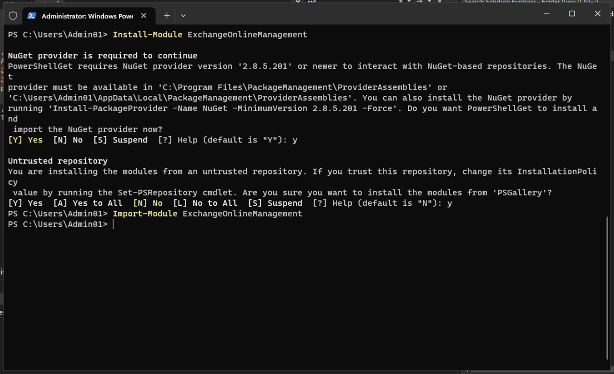

# **Lab 8 – Configuring Information Barriers**

## **Introduction**

Contoso has five departments: *HR*, *Sales*, *Marketing*, *Research*,
and *Manufacturing*. In order to remain compliant with industry
regulations, users in some departments aren't supposed to communicate
with other departments, as listed in the following table:

|**Segment**|**Can communicate with**|**Can't communicate with**|
| ----------|------------------------|--------------------------|
|       HR           |       Everyone                 |      (no restrictions)           |
|  Sales        |  HR, Marketing Manufacturing                          | Research                           |
|  Marketing  |  Everyone                          |        (no restrictions)                    |
|  Research    |  HR, Marketing, Manufacturing           |                          Sales  |
|  Manufacturing       |               HR, Marketing           |                    Anyone other than HR or Marketing        |

For this structure, Contoso's plan includes three IB policies:

1.  An IB policy designed to prevent Sales from communicating with
    Research

2.  Another IB policy to prevent Research from communicating with Sales.

3.  An IB policy designed to allow Manufacturing to communicate with HR
    and Marketing only.

## **Objectives**

- Set up organization segments using PowerShell for Information Barriers
  (IB) implementation.

- Enable scoped directory search in Microsoft Teams to enforce
  segment-based user visibility.

- Create Information Barrier (IB) policies via Microsoft Purview portal
  and PowerShell to control inter-segment communication.

- Apply the configured IB policies to enforce communication restrictions
  across departments.

### **Exercise 1 – Prerequisites**

**Task 1 – Create segment for users in your organization**

1.  Right click on Windows icon, then navigate and click on **Windows
    PowerShell (Admin)** 

    

2.  On the **User Account Control** dialog box, click on the **Yes**
    button.

    

3. Run the following:

    **+++Install-Module ExchangeOnlineManagement+++**

4.  If prompted ‘**Do you want PowerShellGet to install and import the
    NuGet provider now?**’ and ‘**Are you sure you want to install the
    modules from 'PSGallery'?**’ type **y** and press enter.

    

5.  Execute the following command.

    **+++Import-Module ExchangeOnlineManagement+++**

    

6.  Now run the following command to connect to Exchange Online.

    **+++Connect-IPPSSession+++**

    

7.  Log in using the **MOD Administrator** credentials given on the home
    page of the lab environment.

    **Note**: In case, **Automatically sign in to all desktop apps and websites on this device?** dialog box appears, then click on **No, this app only** button.

    

    

8.  Run the following command one by one in the **PowerShell** to create
    the organisation structure.

    **+++New-OrganizationSegment -Name "HR" -UserGroupFilter "Department -eq 'HR'"+++**

    

    **+++New-OrganizationSegment -Name "Sales" -UserGroupFilter "Department -eq 'Sales'"+++**

    **+++New-OrganizationSegment -Name "Marketing" -UserGroupFilter "Department -eq 'Marketing'"+++**

    **+++New-OrganizationSegment -Name "Research" -UserGroupFilter "Department -eq 'Research'"+++**

    **+++New-OrganizationSegment -Name "Manufacturing" -UserGroupFilter "Department -eq 'Manufacturing'"+++**

**Task 2 – Enable scoped directory search in Microsoft Teams**

To turn on search by name

1.  Go to Microsoft Teams admin center by going
    to **+++https://admin.teams.microsoft.com+++**,
    select **Teams** \> **Teams settings**.

    

2.  Under **Search by name**, next to **Scope directory search using an
    Exchange address book policy**, turn the toggle **On**.
    Select **Save**.

    

3.  If **Changes might take some time to take effect** dialog box
    appears, then click on the **Confirm** button.

    

### **Exercise 2 – Create IB policies**

**Task 1 – Block communications between segments**

1.  In the Microsoft Purview portal, click on **Solutions**\>
    **Information barriers**.

    

2.  In the Information Barriers blade, click on **Policies**, then
    select Policies. On the **Policies** page, select **+** **Create
    policy** to create and configure a new IB policy.

    

3.  On **Provide a policy name** page, in the Name field, enter the name
    for the policy—**+++Sales-Research+++**. Then, select **Next**.

    

4.  On the **Add assigned segment** details page, select **Choose
    segment**. **On Select assigned segment for this policy** pane,
    select **Sales**. Now, select **Add** to add the selected segment to
    the policy. You can only select one segment.

    

5.  Select **Next**.

    

6.  Under **Configure Communication and collaboration details page**,
    select **Block**. Select **Choose segment**, select **Research** and
    then select **Add.**

    

    

7.  Then, click on the **Next** button.

    

8.  On the **Configure Policy status** page, toggle the active policy status
    to **On**. Select **Next** to continue.

    

9.  On the **Review your settings** page, review the settings you've
    chosen for the policy and any suggestions or warnings for your
    selections. Select **Submit** to create the policy.

    

10. Select **Done** once the policy is created.

    

11. Sales-Research IB Policy is successfully created.

    

**Task 2 – Create IB Policies via PowerShell**

1.  Go back to **Administrator: Windows PowerShell** and run the
    following command:

    **+++Import-Module ExchangeOnlineManagement+++**

    

2.  Now run the following command to connect to Exchange Online.

    **+++Connect-IPPSSession+++**

    

3.  Log in using the **MOD Administrator** credentials given on the home
    page of the lab environment.

    **Note**: In case, **Automatically sign in to all desktop apps and websites on this device?** dialog box appears, then click on **No, this
app only** button.

    

    

4.  Run the following command to create an IB policy
    called **Research-Sales**. When this policy is active and applied,
    it will help prevent users who are in the **Research** segment from
    communicating with users in the **Sales** segment.

    **+++New-InformationBarrierPolicy -Name "Research-Sales" -AssignedSegment "Research" -SegmentsBlocked "Sales" -State Inactive+++**

    

    

5.  Run the following command to create an IB policy
    called, **Manufacturing-HRMarketing**. When this policy is active
    and applied, **Manufacturing** can communicate only
    with **HR** and **Marketing**. HR and Marketing aren't restricted
    from communicating with other segments..

    **+++New-InformationBarrierPolicy -Name "Manufacturing-HRMarketing" -AssignedSegment "Manufacturing" -SegmentsAllowed "HR","Marketing","Manufacturing" -State Inactive+++**

    

    

6.  Go back Microsoft Purview portal, refresh the Information Barriers –
    Policies page, you will be able to see the policies that you’ve
    created using the PowerShell.

    

**Summary:**

In this lab, you created organizational segments (HR, Sales, Marketing,
Research, and Manufacturing) using PowerShell and enabled scoped
directory search in Microsoft Teams to align user visibility with
segment restrictions. You then configured IB policies within Microsoft
Purview to block or allow communication between specific segments (e.g.,
blocking Sales from communicating with Research). These policies were
created both via the portal and PowerShell for hands-on practice.
Finally, you applied the policies to activate and enforce the defined
communication restrictions within the organization.

