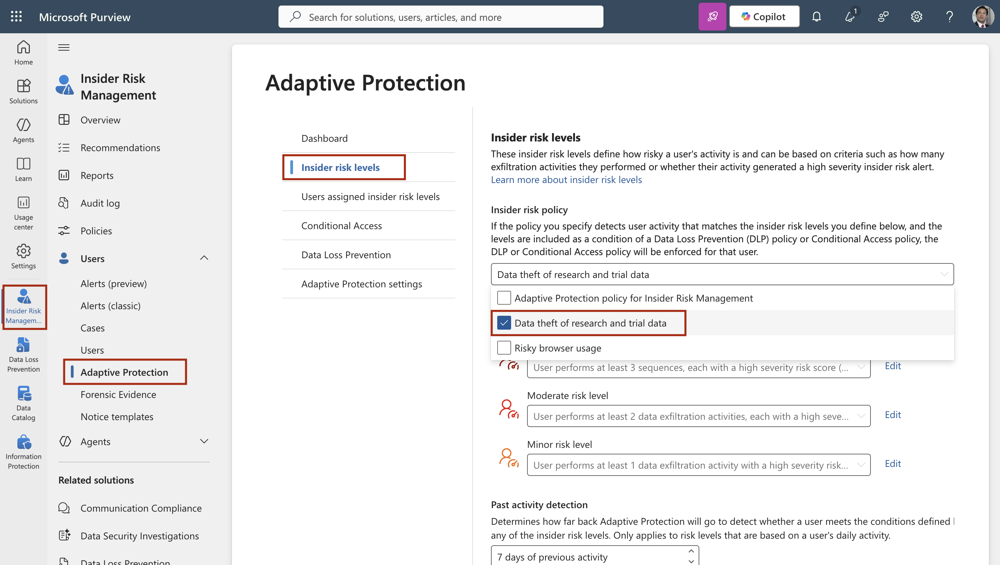
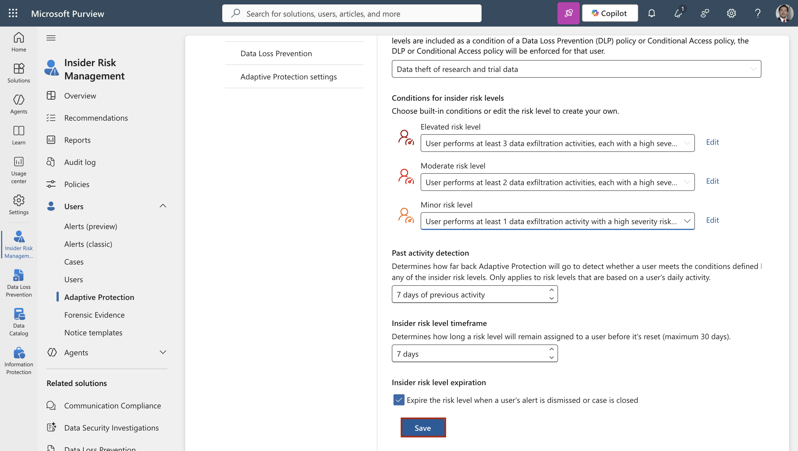

---
lab:
  title: Lab 7 — Escalate data protection dynamically for high-risk users by linking Adaptive Protection with Insider Risk and DLP
  description: In this lab we configured Adaptive Protection to tie insider risk levels to dynamic DLP enforcement and Conditional Access for high-risk users.
  duration: 15 minutes
  level: 300
  islab: true
  primarytopics:
    - Microsoft Purview
    - Insider Risk Management
---

# Lab 7 — Escalate data protection dynamically for high-risk users by linking Adaptive Protection with Insider Risk and DLP

Static protection treats every user the same, but risk is not evenly distributed. A researcher who suddenly starts downloading compound formulations and browsing to risky sites should face tighter controls than a colleague doing routine work — automatically, without an administrator hand-editing policies. Adaptive Protection makes this possible: it takes the risk levels that Insider Risk Management assigns to users and feeds them into Data Loss Prevention and Conditional Access, so enforcement tightens for an elevated-risk user and relaxes again when their risk subsides. In this lab, acting as Allan Deyoung, you'll connect the insider-risk policy from Lab 6 to Adaptive Protection, create a DLP policy that blocks device egress only for elevated-risk users, and add a Conditional Access policy that blocks sign-in access for those same users — closing the loop between detection and enforcement.

This lab depends on Adaptive Protection having been enabled in Lab 0 and the insider-risk policy created in Lab 6, and it uses the classifiers and labels from Labs 2 and 4 as the sensitive content the adaptive DLP rule protects.

**Learning outcomes.** After this lab you can:

- Configure Adaptive Protection insider risk levels tied to an insider-risk policy.
- Create a DLP policy whose enforcement is conditioned on a user's insider risk level.
- Create a Conditional Access policy that blocks access for elevated-risk users.
- Explain how Insider Risk Management, DLP, and Conditional Access combine into an adaptive control loop.

**Tasks**:

1. Configure insider risk levels for Adaptive Protection
2. Create an adaptive DLP policy scoped to elevated risk
3. Create a Conditional Access policy for elevated-risk users
4. Review the adaptive control loop

> [!IMPORTANT]
> Adaptive Protection was enabled in Lab 0 and can take up to 72 hours to begin assigning risk levels. It only assigns a user an elevated level after Insider Risk Management (Lab 6) scores enough genuine activity for that user. As a result, the policies in this lab are fully configurable now, but they only take effect for a user once that user actually reaches the elevated level — which depends on the 72-hour activation and real scored activity. This timing is indicative, not guaranteed.

## Task 1 – Configure insider risk levels for Adaptive Protection

Adaptive Protection needs to know what "minor," "moderate," and "elevated" risk mean, and which insider-risk policy supplies the signal. In this task, you'll associate Adaptive Protection with the data-theft policy from Lab 6 and define the activity thresholds for each risk level.

1. In **Microsoft Edge**, navigate to **`https://purview.microsoft.com`** and sign in as **Allan Deyoung**, `AllanD@TenantName` (the Tenant Name and password are provided in the Resources tab).

2. In the left navigation, select **Solutions** > **Insider Risk Management** > **Users** > **Adaptive Protection**.

3. Select the **Insider risk levels** tab. Under **Insider risk policy**, select the dropdown beside **Select a policy**, then select **Data theft of research and trial data** (the policy created in Lab 6).

	

4. Under **Conditions for insider risk levels**, set the thresholds:

   - **Elevated risk level**: a user performs at least **3** data exfiltration activities.
   - **Moderate risk level**: a user performs at least **2** data exfiltration activities.
   - **Minor risk level**: a user performs at least **1** data exfiltration activity.

5. Review the additional options below the thresholds — past-activity detection window, risk-level timeframe, and risk-level expiration — leaving the defaults, then select **Save**.

	

> [!NOTE]
> Adaptive Protection must always be associated with an insider-risk policy to function; if that policy is later deleted, Adaptive Protection stops assigning risk levels until a different policy is chosen. Pointing it at the Lab 6 data-theft policy means the risk signal is driven by activity against Contoso's research and trial data.

You have successfully configured the insider risk levels that Adaptive Protection will use.

## Task 2 – Create an adaptive DLP policy scoped to elevated risk (Read-Only)

Now you'll create a DLP policy that does nothing to ordinary users but blocks device egress for anyone Adaptive Protection has marked as elevated risk. The rule matches Contoso's sensitive content using the classifiers and labels from earlier labs, and it fires only when the user's risk level is elevated. This is a read-only task as this task requires Adaptive Protection to be turned on which takes around 72 hours. You can complete this task later on when you still have the access to the environment. 

1. In the Microsoft Purview portal, on the **Adaptive Protection** page, select the **Data Loss Prevention** tab, then select **+ Create policy**. (Creating the policy from here ensures it is registered as an Adaptive Protection policy.)

2. If prompted to **Choose what type of data to protect**, ensure **Data stored in connected sources** is selected, then select **Next**.

3. On the template page, under **Categories** select **Custom**, then under **Regulations** select **Custom policy**. Select **Next**.

4. On the **Name your DLP policy** page, enter the following, then select **Next**:

   - **Name**: `Adaptive endpoint protection for elevated risk`
   - **Description**: `Blocks device egress of Contoso sensitive data for users at elevated insider risk.`

5. On the **Assign admin units** page, select **Next**.

6. On the **Choose where to apply the policy** page, enable **Devices** only, then select **Next**.

7. On the **Define policy settings** page, select **Create or customize advanced DLP rules**, then select **Next**.

8. On the **Customize advanced DLP rules** page, select **+ Create rule**.

9. In the **Name** field, enter `Block device egress at elevated risk`.

10. Under **Conditions**, select **+ Add condition**, then select **Insider risk level for Adaptive Protection is**. In the risk-level selector, select **Elevated risk level**.

11. Select **+ Add condition** again, then select **Content contains**. Select **Add** > **Sensitive info types**, select **Contoso Compound ID** and **Contoso Clinical Trial Subjects** (from Lab 2), then select **Add**. Add a second grouping for **Sensitivity labels** and select **Highly Confidential – Research** and **Restricted – Trial Data** (from Lab 4). Set the grouping so the rule matches content containing **any** of these.

12. Under **Actions**, select **+ Add an action**, then select **Audit or restrict activities on devices**. Under **File activities for all apps**, select **Apply restrictions to specific activity**, then set each of the following to **Block**:

    - **Copy to clipboard**
    - **Copy to a removable USB device**
    - **Copy to a network share**
    - **Print**

13. In the **User notifications** section, set the toggle to **On** so the user sees a policy tip when an activity is blocked.

14. In the **Incident reports** section, set the severity to **High**, then select **Save**.

15. Select **Next**. On the **Policy mode** page, select **Turn the policy on immediately**, then select **Next**, **Submit**, and **Done**.

> [!NOTE]
> Because the rule includes the **Insider risk level for Adaptive Protection is Elevated** condition, it applies only to users Adaptive Protection has marked as elevated risk — everyone else is unaffected. This is what makes the policy adaptive rather than static: the same policy that blocks a high-risk user leaves ordinary users free to work.

You have successfully created an adaptive DLP policy that blocks device egress only for elevated-risk users.

## Task 3 – Create a Conditional Access policy for elevated-risk users (Read-Only)

Adaptive Protection's risk signal can also drive access decisions, not just DLP. In this task, you'll create a Conditional Access policy in Microsoft Entra that blocks sign-in access for elevated-risk users. Because a misconfigured access policy can lock users out, you'll create it in report-only mode and exclude emergency-access accounts. This is a read-only task as this task requires Adaptive Protection to be turned on which takes around 72 hours. You can complete this task later on when you still have the access to the environment. 

1. In **Microsoft Edge**, navigate to **`https://entra.microsoft.com`** and sign in as **Allan Deyoung** (who holds the Security Administrator role from Lab 1, sufficient to manage Conditional Access).

2. In the left navigation, select **Entra ID** > **Conditional Access** > **Policies**.

3. Select **+ New policy**.

4. In the **Name** field, enter `Block elevated insider risk`.

5. Under **Assignments**, select **Users**. Under **Include**, select **All users**.

6. Under **Exclude**, select **Users and groups**, then select your organization's **emergency access or break-glass accounts** (and Allan's own account) so this policy can never lock out administrators.

> [!IMPORTANT]
> Always exclude break-glass and administrator accounts from a blocking Conditional Access policy before enabling it. Skipping this step risks locking every user, including administrators, out of the tenant.

7. Under **Target resources**, select **Resources**, then under **Include** select **All resources**.

8. Under **Conditions**, select **Insider risk**. Set **Configure** to **Yes**, select **Elevated**, then select **Done**.

9. Under **Access controls** > **Grant**, select **Block access**, then select **Select**.

10. At the bottom, set **Enable policy** to **Report-only**.

11. Select **Create**.

> [!IMPORTANT]
> Leave the policy in **Report-only** mode. Report-only lets you confirm, using the sign-in logs, which sign-ins the policy *would* have blocked, without actually blocking anyone — the correct way to validate a blocking policy before enforcing it. Only after reviewing report-only results would you switch it to **On** in production. Using the insider risk condition in Conditional Access requires Microsoft Entra ID P2, which is included in the lab's licensing.

You have successfully created a Conditional Access policy, in report-only mode, that targets elevated-risk users.

## Task 4 – Review the adaptive control loop

With all three pieces in place, it's worth stepping back to see how they form a single adaptive loop, and how to observe it. In this task, you'll review the Adaptive Protection dashboard and confirm the connected policies.

1. In the Microsoft Purview portal, select **Solutions** > **Insider Risk Management** > **Adaptive Protection**.

2. Review the tabs, which correspond to the loop you've built:

   - **Insider risk levels** — the thresholds and the associated Lab 6 policy that supply the risk signal (Task 1).
   - **Users assigned insider risk levels** — the users Adaptive Protection has currently marked at each level. This populates as Insider Risk Management scores activity; it may be empty until users reach a level.
   - **Data Loss Prevention** — lists the adaptive DLP policy you created (Task 2), confirming it is registered as an Adaptive Protection policy.
   - **Conditional Access** — reflects the access enforcement available to the loop (Task 3).

3. Trace the end-to-end mechanism to confirm your understanding:

   - Insider Risk Management (Lab 6) scores a user's activity against Contoso's research and trial data.
   - When the user crosses the thresholds from Task 1, Adaptive Protection assigns them the **Elevated** risk level.
   - The adaptive DLP policy (Task 2) immediately begins blocking that user's device egress of sensitive content, while leaving other users unaffected.
   - The Conditional Access policy (Task 3), once moved out of report-only, would additionally block that user's access to resources.
   - When the user's risky activity subsides and their risk level drops, the tighter controls automatically relax.

4. To observe the loop in action over time, return to the **Users assigned insider risk levels** tab after Insider Risk Management has scored real activity, and check the Conditional Access **sign-in logs** in Entra to see report-only results for any elevated-risk sign-ins.

> [!NOTE]
> The loop can only be observed end to end once Adaptive Protection is fully active (up to 72 hours from the Lab 0 enablement) and a user has generated enough scored activity to reach the elevated level. This is inherent to how Adaptive Protection works, not a limitation of the configuration you completed. These timings are indicative, not guaranteed.

You have successfully reviewed the adaptive control loop linking Insider Risk Management, DLP, and Conditional Access.

## Summary

In this lab, you connected Contoso Pharmaceuticals' insider-risk detection to automatic enforcement using Adaptive Protection. You associated Adaptive Protection with the data-theft policy from Lab 6 and defined the activity thresholds for minor, moderate, and elevated risk. You then created a DLP policy that blocks device egress of Contoso's sensitive content — matched by the classifiers from Lab 2 and the labels from Lab 4 — but only for users at elevated risk, and a Conditional Access policy, in report-only mode with break-glass accounts excluded, that blocks access for those same users. Finally, you reviewed how Insider Risk Management, DLP, and Conditional Access form a single adaptive loop in which controls tighten automatically for high-risk users and relax as their risk subsides. Because the loop depends on real scored activity and Adaptive Protection's activation window, the policies are configured now and take effect for a user once that user genuinely reaches the elevated level.
