---
lab:
  title: Lab 8 — Restrict regulated collaboration with Information Barriers segments, policies, and modes
  description: In this lab we defined Information Barriers segments, created block and allow policies, applied them, and verified that restricted groups cannot communicate.
  duration: 15 minutes
  level: 300
  islab: true
  primarytopics:
    - Microsoft Purview
    - Information Barriers
---

# Lab 8 — Restrict regulated collaboration with Information Barriers segments, policies, and modes

Contoso Pharmaceuticals has relationships between teams that must not exist. Its clinical and research function cannot freely collaborate with its commercial and sales function — commercial pressure must not influence trial conduct, and unreleased research must not reach sales. More acutely, the confidential **Project Falcon** deal team, which holds material non-public information about an acquisition, must be walled off from the rest of the company except for the HR staff who support it, to prevent insider-trading exposure. Information Barriers enforce these ethical walls in Microsoft 365: they stop specified groups of users from communicating or collaborating in Teams, and remove blocked users from each other's search and discovery. In this lab, acting as Allan Deyoung, you'll define organization segments, express Contoso's entire communication matrix as allow-mode policies, create them both in the portal and with PowerShell, apply them, and verify the barrier actually blocks communication.

This lab uses the tenant's existing department attributes and groups to define segments. It builds the barriers with a mix of the portal and PowerShell, and includes the policy-application step that makes barriers take effect.

> [!NOTE]
> **Design approach — allow-mode "default-deny".** This lab models Contoso's barriers entirely with **allow-mode** policies. Every segment receives exactly one policy that names the only segments its users may communicate with; everything not named is implicitly blocked. This is the posture regulated organizations (finance, pharma, legal) typically adopt, because reachability is never accidental — a segment created later cannot reach a walled-off team unless a policy explicitly permits it. It also avoids a subtle failure common to mixed block/allow designs: an allow-mode policy on one segment implicitly blocks it from every segment it does *not* name, and those relationships must be **symmetric** (if Falcon may not reach Research, Research must not name Falcon in its allow list). Building the whole matrix in allow-mode keeps every relationship explicit and symmetric. See Microsoft's guidance in [Get started with Information Barriers](https://learn.microsoft.com/en-us/purview/information-barriers-policies) (Scenario 2: allow policies, defined as directional pairs).

**Learning outcomes.** After this lab you can:

- Define Information Barriers organization segments from user attributes and group membership.
- Enable scoped directory search in Microsoft Teams.
- Design an organization-wide communication matrix and express it as allow-mode barrier policies, using the portal and PowerShell.
- Apply barrier policies and verify enforcement between segments.
- Explain Information Barriers modes for segments.

**Contoso's communication matrix.** The design implemented in this lab:

| Segment | May communicate with | Walled off from |
| --- | --- | --- |
| Research | Research, HR, Marketing | Sales, Project Falcon |
| Sales | Sales, HR, Marketing | Research, Project Falcon |
| Marketing | Marketing, Research, Sales, HR | Project Falcon |
| HR | HR, Research, Sales, Marketing, Project Falcon | (none — HR supports every function, including the deal team) |
| Project Falcon | Project Falcon, HR | Research, Sales, Marketing |

Read the matrix for symmetry: Falcon may reach HR, and HR names Falcon — symmetric. Falcon names no one else, and Research, Sales, and Marketing each omit Falcon — symmetric. Research omits Sales and Sales omits Research — symmetric. Every pairing is consistent in both directions, which is what allows the policy application to succeed.

**Tasks**:

1. Create organization segments
2. Enable scoped directory search in Microsoft Teams
3. Create an allow-mode barrier policy in the portal
4. Create the remaining allow-mode policies with PowerShell
5. Apply the policies and verify enforcement
6. Understand Information Barriers modes

## Task 1 – Create organization segments

Segments are the groups of users a barrier applies to. In this task, you'll define segments for Contoso's clinical/research and commercial/sales functions using the department attribute, plus a segment for the Project Falcon deal team based on its existing group. You perform the PowerShell tasks as the Global Administrator.

1. On the client VM, open an elevated terminal: right-click the **Start** button and select **Terminal (Administrator)**. Select **Yes** on the User Account Control prompt.

2. Install the Exchange Online module and connect to Security & Compliance PowerShell. When the sign-in window appears, sign in as **Allan Deyoung**, `AllanD@TenantName`:

   ```powershell
   Install-Module -Name ExchangeOnlineManagement -Scope CurrentUser -Force -AllowClobber
   Import-Module ExchangeOnlineManagement
   Connect-IPPSSession -UserPrincipalName AllanD@TenantName
   ```

	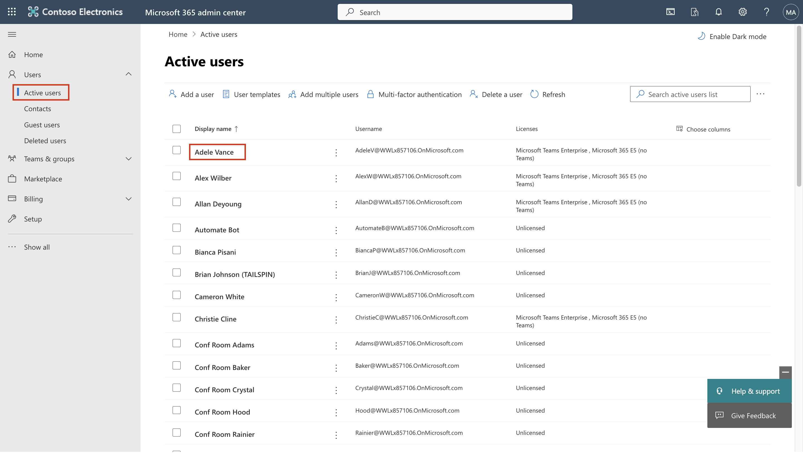

3. Create the department-based segments for the clinical/research and commercial functions:

   ```powershell
   New-OrganizationSegment -Name "Research" -UserGroupFilter "Department -eq 'Research'"
   New-OrganizationSegment -Name "Sales" -UserGroupFilter "Department -eq 'Sales'"
   New-OrganizationSegment -Name "Marketing" -UserGroupFilter "Department -eq 'Marketing'"
   New-OrganizationSegment -Name "HR" -UserGroupFilter "Department -eq 'HR'"
   ```

4. Create the Project Falcon deal-team segment from its existing group. Replace the group address with the actual Project Falcon group address in your tenant:

   ```powershell
   New-OrganizationSegment -Name "Project Falcon" -UserGroupFilter "MemberOf -eq 'Falcon@TenantName'"
   ```

5. Confirm all segments were created and review their filters:

   ```powershell
   Get-OrganizationSegment | Format-List Name, UserGroupFilter, Type
   ```

	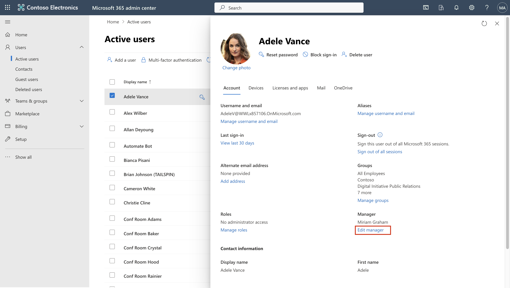

> [!IMPORTANT]
> Segments must not overlap — a user included in more than one segment causes barrier processing to fail for that user. The department-based segments rely on the tenant's `Department` attribute; confirm your users' departments match the values used here. The Project Falcon segment uses `MemberOf` against the existing group — if `MemberOf` does not resolve in your tenant, define the Falcon segment on a department or other single-valued attribute instead. Keep segment filters simple (use `-eq` or `-ne`).

You have successfully created the organization segments for Contoso's barriers.

## Task 2 – Enable scoped directory search in Microsoft Teams

For barriers to affect who users can find and message, Microsoft Teams must scope its directory search to the barrier policies. In this task, you'll turn on scoped directory search.

1. In **Microsoft Edge**, navigate to the Microsoft Teams admin center at **`https://admin.teams.microsoft.com`** and sign in as **Allan Deyoung**.

2. In the left navigation, select **Teams** > **Teams settings**.

3. Under **Search by name**, set **Scope directory search using an Exchange address book policy** to **On**, then select **Save**.

	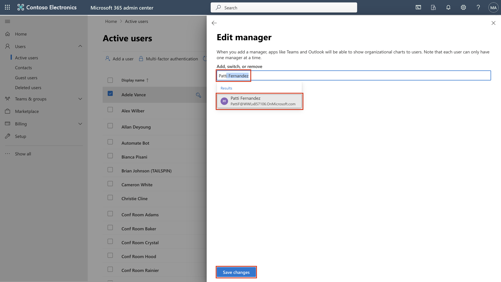

4. If a dialog notes the change may take time to take effect, select **Confirm**.

	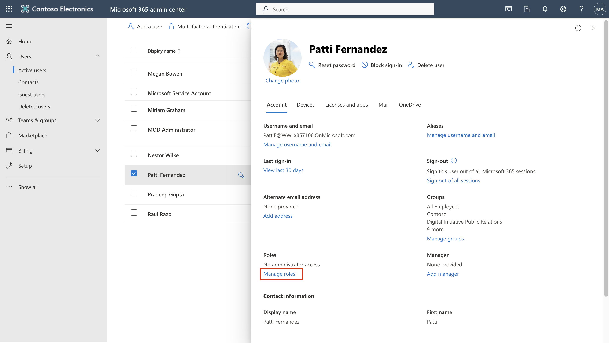

> [!IMPORTANT]
> Microsoft requires that you enable scoped directory search **before** you define your organization's first Information Barriers policy, and then **wait at least 24 hours** before creating or applying policies. In a lab that has already run once, this prerequisite is typically already satisfied; if you are running this tenant for the first time, complete this task and allow the wait period before proceeding to Task 3. This timing is a Microsoft prerequisite, not merely propagation delay.

You have successfully enabled scoped directory search in Microsoft Teams.

## Task 3 – Create an allow-mode barrier policy in the portal

You'll build Contoso's communication matrix as a set of allow-mode policies — one per segment. In this task, you create the first policy in the portal to learn the workflow: the **Research** segment's policy, which permits Research to communicate only with Research, HR, and Marketing (and therefore walls it off from Sales and Project Falcon). In Task 4 you'll create the remaining four policies with PowerShell.

1. In **Microsoft Edge**, in the Microsoft Purview portal as **Allan Deyoung**, select the **Information barriers** solution card. If you don't see it, select **View all solutions** and choose **Information barriers** from the **Risk & compliance** section.

2. Select **Policies**, then select **Create policy**.

3. On the **Name** page, in the **Name** field, enter `Research-Allow`, then select **Next**.

	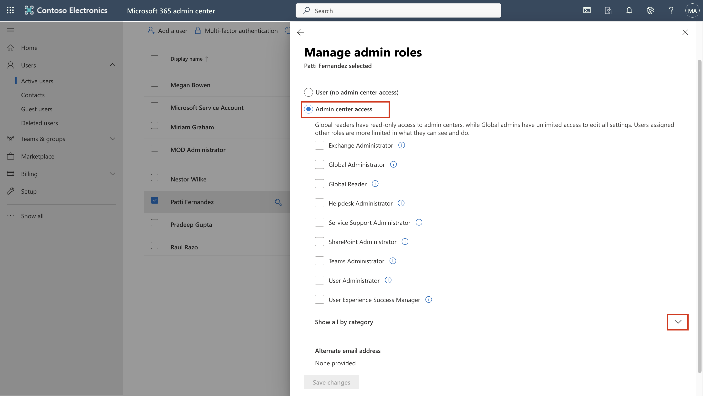

4. On the **Assigned segment** page, select **Choose segment**, select **Research**, then select **Add**. (You can select only one assigned segment.) Select **Next**.

	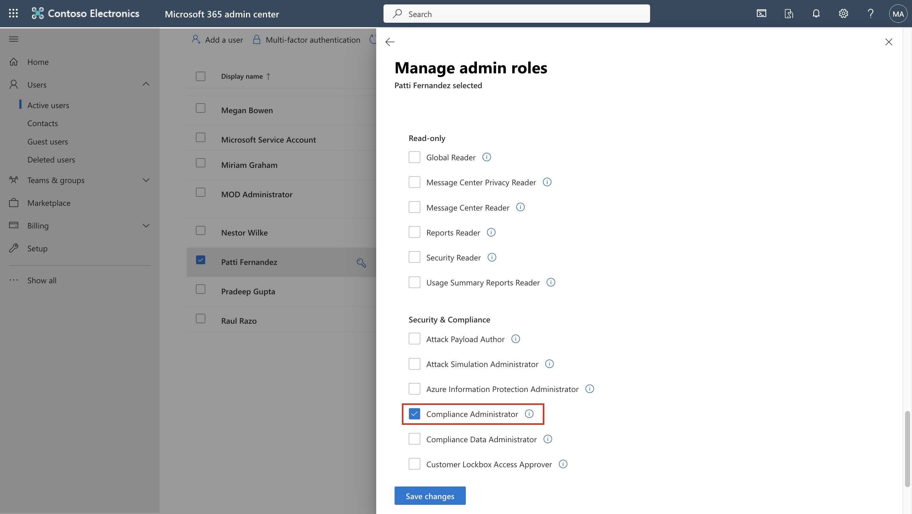

5. On the **Communication and collaboration** page, in the **Communication and collaboration** field select **Allowed**. Then select **Choose segment** and add each of the following, so Research is permitted to communicate only with them. Then select **Next**.

   - **Research**
   - **HR**
   - **Marketing**

	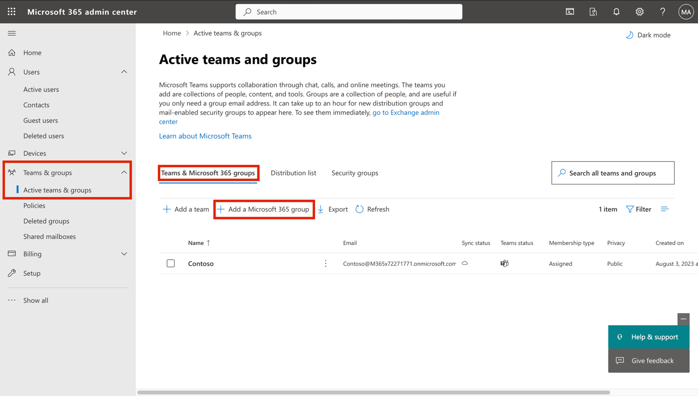

   > [!NOTE]
   > The assigned segment (**Research**) is included in its own allow list. This is required: an allow-mode policy that omits its own segment would prevent the segment's users from communicating with each other. Everything **not** listed — here, **Sales** and **Project Falcon** — is implicitly blocked.

6. On the **Configure policy status** page, set the status to **On**, then select **Next**.

	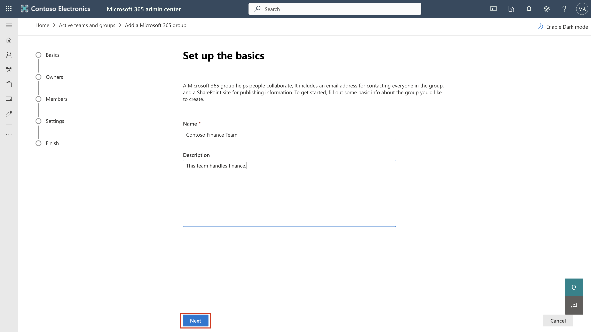

7. On the **Review your settings** page, review the configuration and any warnings, then select **Submit**. When the policy is created, select **Done**.

	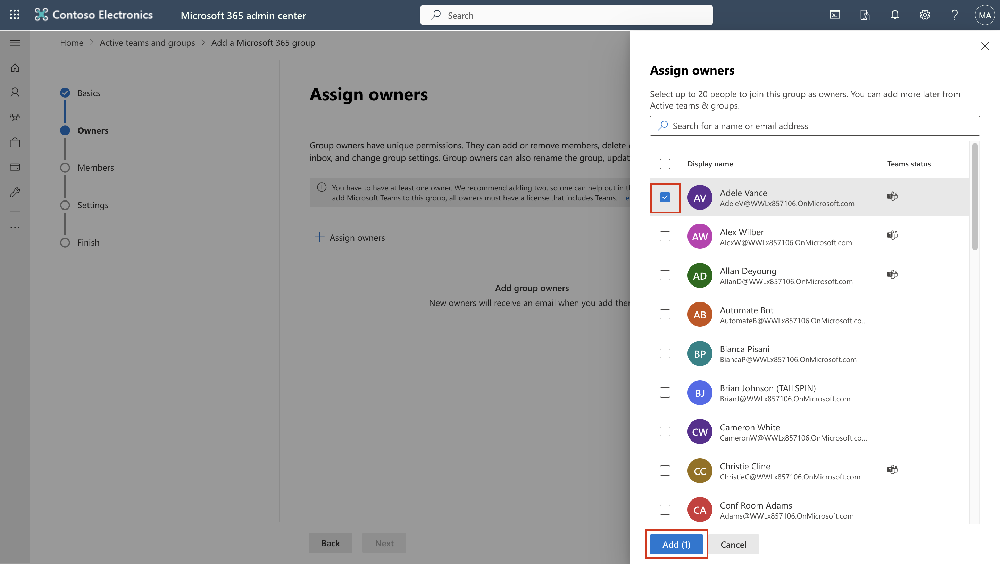

	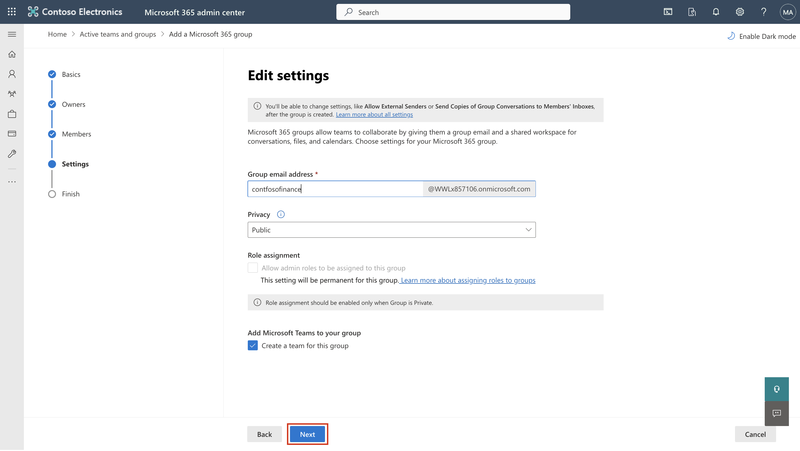

> [!IMPORTANT]
> You cannot change a policy's **Allowed** vs **Blocked** type after it is created — to change it you must delete the policy and create a new one. Confirm you selected **Allowed** before submitting.

You have successfully created the allow-mode policy for the Research segment in the portal.

## Task 4 – Create the remaining allow-mode policies with PowerShell

Administrators build the rest of the matrix at scale with PowerShell. In this task, you'll create the four remaining allow-mode policies — one each for Sales, Marketing, HR, and Project Falcon — completing Contoso's communication matrix. Each policy is created in the `Inactive` state and activated in Task 5.

1. In the elevated terminal, still connected to Security & Compliance PowerShell, create the **Sales** policy (Sales may communicate only with Sales, HR, and Marketing — walled off from Research and Project Falcon):

   ```powershell
   New-InformationBarrierPolicy -Name "Sales-Allow" -AssignedSegment "Sales" -SegmentsAllowed "Sales","HR","Marketing" -State Inactive
   ```

	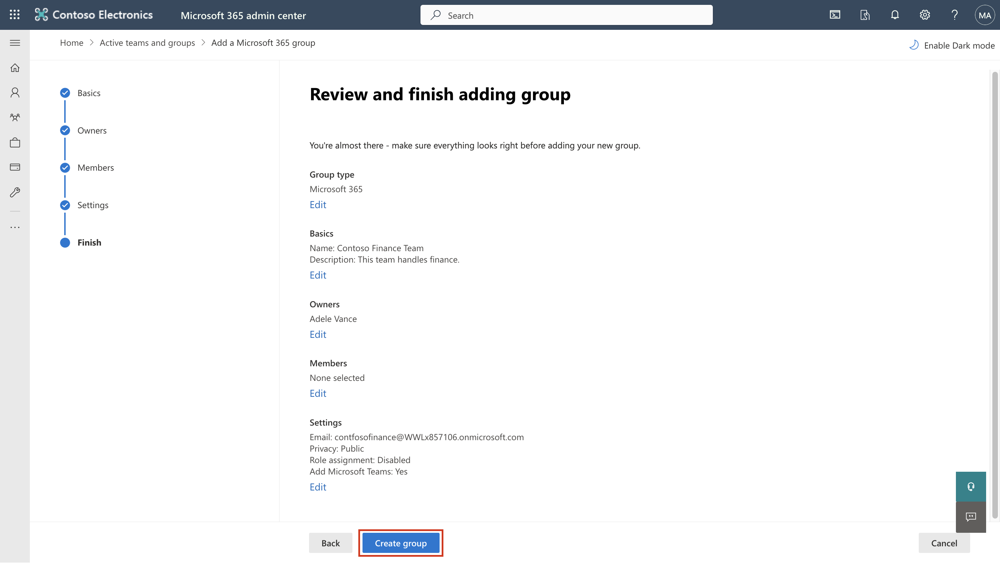

2. Create the **Marketing** policy (Marketing is a shared support function — it may communicate with Marketing, Research, Sales, and HR, but not Project Falcon):

   ```powershell
   New-InformationBarrierPolicy -Name "Marketing-Allow" -AssignedSegment "Marketing" -SegmentsAllowed "Marketing","Research","Sales","HR" -State Inactive
   ```

	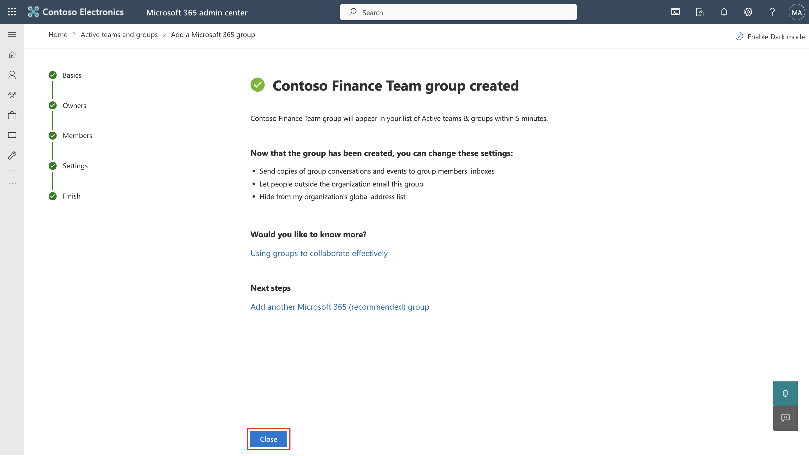

3. Create the **HR** policy (HR supports every function including the deal team — it may communicate with all segments):

   ```powershell
   New-InformationBarrierPolicy -Name "HR-Allow" -AssignedSegment "HR" -SegmentsAllowed "HR","Research","Sales","Marketing","Project Falcon" -State Inactive
   ```

	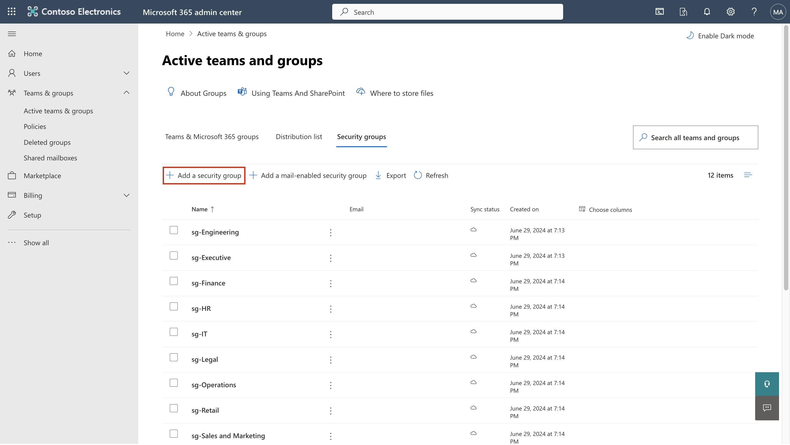

4. Create the **Project Falcon** policy (the deal team may communicate only with itself and the HR staff who support it — walled off from Research, Sales, and Marketing):

   ```powershell
   New-InformationBarrierPolicy -Name "Falcon-Allow" -AssignedSegment "Project Falcon" -SegmentsAllowed "Project Falcon","HR" -State Inactive
   ```

	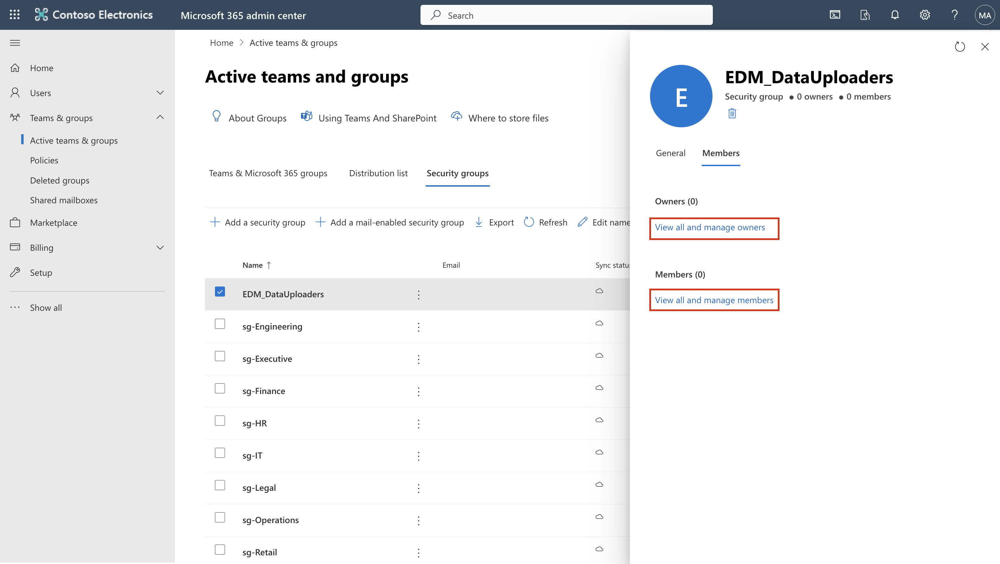

5. Confirm all five policies exist (the portal-created `Research-Allow` plus the four above) and review their allow lists:

   ```powershell
   Get-InformationBarrierPolicy | Format-List Name, AssignedSegment, SegmentsAllowed, State
   ```

	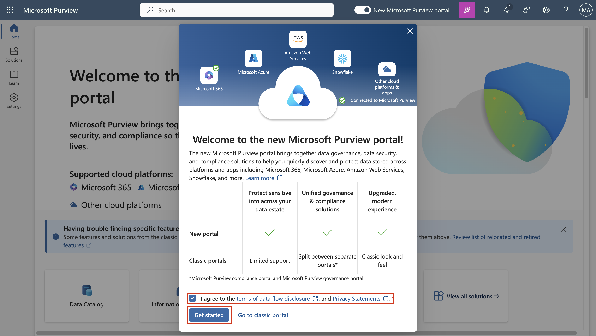

> [!IMPORTANT]
> Enter these commands **one at a time**, waiting for each to return the new policy's details before running the next. Submitting several policy-creation commands together can cause the service to return an internal server error. Each segment may have **only one** policy — the matrix assigns exactly one allow-mode policy per segment, which satisfies this rule.

> [!NOTE]
> Every policy here uses **allow mode** (`-SegmentsAllowed`), and every assigned segment includes itself in its own allow list. Compare the five allow lists against the communication matrix at the top of the lab and confirm each pairing is symmetric before applying — this symmetry is what allows the policy application in Task 5 to complete without an asymmetric-policies error.

You have successfully created the remaining allow-mode policies, completing Contoso's communication matrix.

## Task 5 – Apply the policies and verify enforcement

Creating and activating barrier policies is not enough — they must be applied, which updates every user account against the policies. In this task, you'll activate the inactive policies, apply all policies, and verify that a walled-off pair of users is actually barred while a permitted pair is not.

1. In the elevated terminal, set the four PowerShell-created policies to active. (The portal-created `Research-Allow` was already created with status **On**; setting it active again is harmless if you prefer to include it.)

   ```powershell
   Set-InformationBarrierPolicy -Identity "Sales-Allow" -State Active
   Set-InformationBarrierPolicy -Identity "Marketing-Allow" -State Active
   Set-InformationBarrierPolicy -Identity "HR-Allow" -State Active
   Set-InformationBarrierPolicy -Identity "Falcon-Allow" -State Active
   ```

	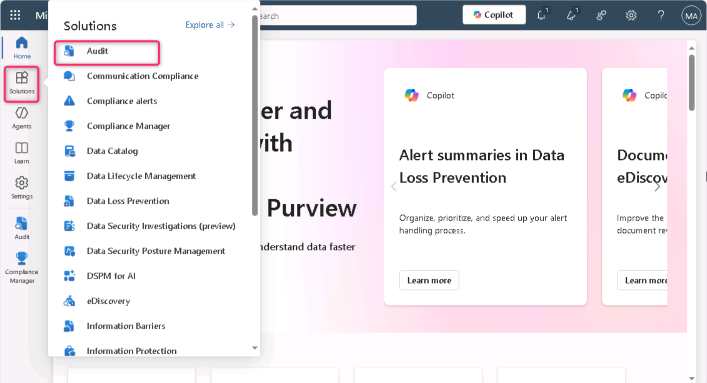

2. Apply all active barrier policies across the organization. When prompted to confirm, press **Y** (do not use *Yes to All*; submit the application only once):

   ```powershell
   Start-InformationBarrierPoliciesApplication
   ```

	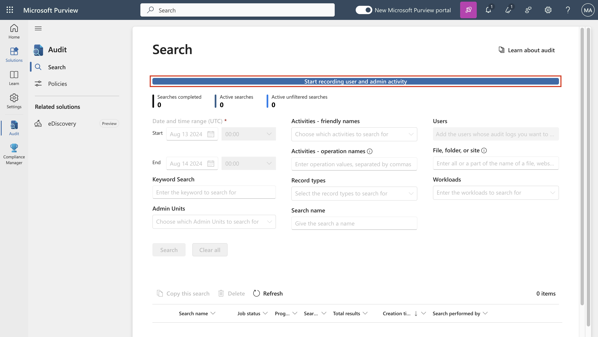

3. Check the application status. Re-run until it shows the application has completed:

   ```powershell
   Get-InformationBarrierPoliciesApplicationStatus | Format-List Identity, Status, PercentProgress, FailedRecipients, FailureCategory
   ```

	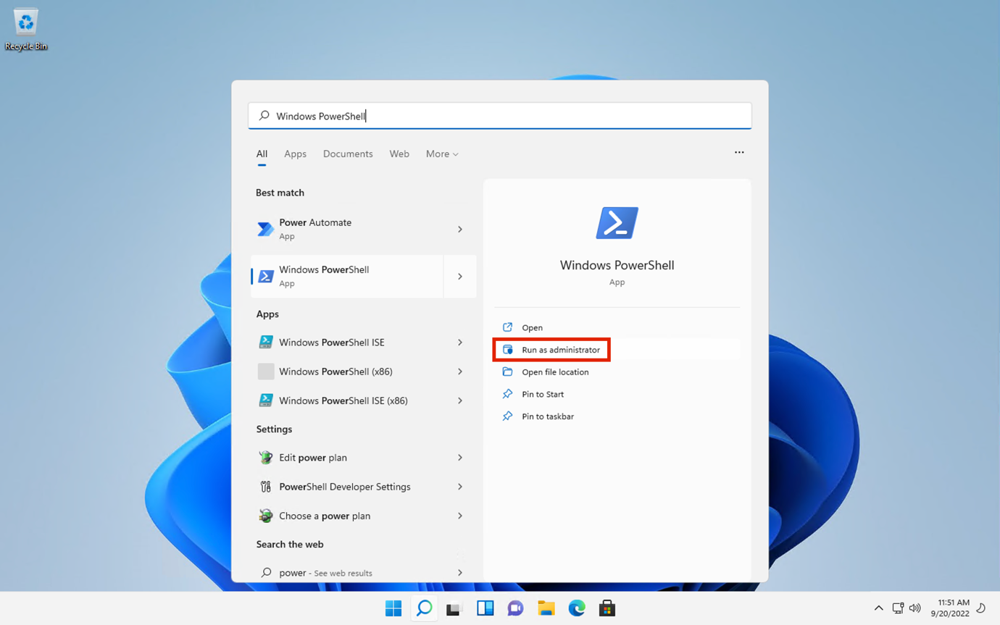

   A successful run shows a **new** application `Identity`, `Status: Completed`, `FailedRecipients: 0`, and `FailureCategory: None`.

   > [!IMPORTANT]
   > **Expected validation gate.** If the application is accepted, the command returns a new application job (initially `Status: NotStarted` or `InProgress`) and **no error**. If instead it returns an `AsymmetricPoliciesException` naming two segments, the allow lists for those segments are not symmetric — re-check them against the communication matrix (a segment that is walled off from another must not appear in that other's allow list, and vice versa) and correct the offending policy before reapplying. Because policy type cannot be edited in place, correcting a policy means removing it (set it `Inactive`, then `Remove-InformationBarrierPolicy`) and recreating it with the correct allow list.

4. After the application completes, verify that a **Research** user and a **Sales** user are barred from communicating. Replace the identities with a real Research-department user and a real Sales-department user in your tenant:

   ```powershell
   Connect-ExchangeOnline -UserPrincipalName AllanD@TenantName
   ```
   ```powershell
   Get-InformationBarrierRecipientStatus -Identity GradyA@TenantName -Identity2 IsaiahL@TenantName
   ```

	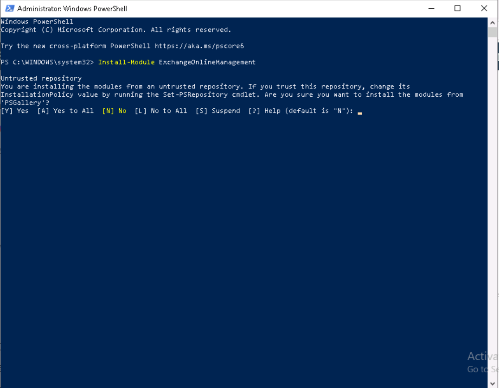

   Review the output and confirm it reports that communication between the two users is blocked by an Information Barriers policy.

You can further use the following optional verification techniques.

5. Verify that a **permitted** pairing is *not* blocked. Confirm an HR user and a Project Falcon user can communicate — the one deliberate exception in the design (replace with real users in those segments):

   ```powershell
   Get-InformationBarrierRecipientStatus -Identity <HRUser>@TenantName -Identity2 <FalconUser>@TenantName
   ```

   The output should report that the two users are **not** blocked, confirming HR can support the deal team while everyone else is walled off from it.

6. As a behavioral verification, sign in to **Microsoft Teams** as a **Research** user (for example, Grady Archie) and attempt to start a chat with a **Sales** user (for example, Isaiah Langer). Confirm the Sales user cannot be found or messaged — the barrier removes them from search and blocks the chat.

> [!IMPORTANT]
> Applying barrier policies updates accounts user by user and can take from 30 minutes to 24 hours to complete; **do not make further barrier changes while application is running** — `New-`/`Set-` cmdlets are blocked until it finishes. The Teams behavioral effects appear only after application completes and scoped directory search has taken effect. It is normal for the verification to show no block immediately after starting application — re-check after it completes. These timings are indicative, not guaranteed.

You have successfully applied the barrier policies and verified that walled-off segments cannot communicate while permitted pairings can.

## Task 6 – Understand Information Barriers modes

Beyond restricting communication, Information Barriers define how a segment's users can be added to Teams and shared with, through segment *modes*. In this task, you'll review the modes so you understand the full control surface.

1. Understand the Information Barriers modes that can apply to a Microsoft 365 resource:

   - **Open** — the resource has no IB policies or segments associated with it; anyone can be invited (for example, an all-company social team).
   - **Implicit** — the resource members' IB policies govern membership; the owner can add members only if they are compatible with existing members. This is the default mode for Microsoft Teams.
   - **Owner Moderated** — the resource owner's IB policy governs the resource, letting the owner add otherwise-incompatible segment users under their own policy (useful when a moderator must bring incompatible groups together).
   - **Explicit** — the segments associated with the resource govern it; the owner or SharePoint administrator manages those segments directly.

2. Recognize how modes complement policies: barrier **policies** decide *who can communicate with whom*, while **modes** decide *how a user can be added to teams and shared with*. Together they enforce the ethical wall not just in chat but in Teams membership and content sharing. For Contoso, the Project Falcon deal team operates under the implicit mode created by its allow-mode policy, so deal-team members can't be added to teams whose membership would breach the wall — while HR members, whom the matrix permits, can still be brought in to support the team.

3. Note the deliberate shape of Contoso's matrix: HR and Marketing are broad support functions, so their allow lists are wide — but even they are constrained where the business requires it (Marketing is walled off from Project Falcon, while HR is not). This is the value of the allow-mode, default-deny approach: every reachability decision, including the exceptions, is explicit and auditable rather than left to a default.

You have successfully reviewed how Information Barriers modes govern Teams membership and sharing alongside barrier policies.

## Summary

In this lab, you enforced Contoso Pharmaceuticals' ethical walls with Information Barriers using an allow-mode, default-deny design. You defined organization segments from the tenant's department attributes and from the Project Falcon group, enabled scoped directory search in Teams, and expressed Contoso's entire communication matrix as five allow-mode policies — one per segment — created in both the portal and PowerShell. Research and Sales are walled off from each other; the Project Falcon deal team is reachable only by the HR staff who support it and walled off from everyone else; and the shared support functions carry the broad-but-explicit allow lists their roles require. You then applied the policies across the organization and verified — with `Get-InformationBarrierRecipientStatus` and a Teams communication test — that walled-off segments genuinely cannot reach each other while permitted pairings can. Finally, you reviewed how Information Barriers modes govern Teams membership and sharing alongside the policies. These barriers keep Contoso's regulated collaboration boundaries intact, protecting both trial integrity and the confidentiality of the Falcon acquisition.