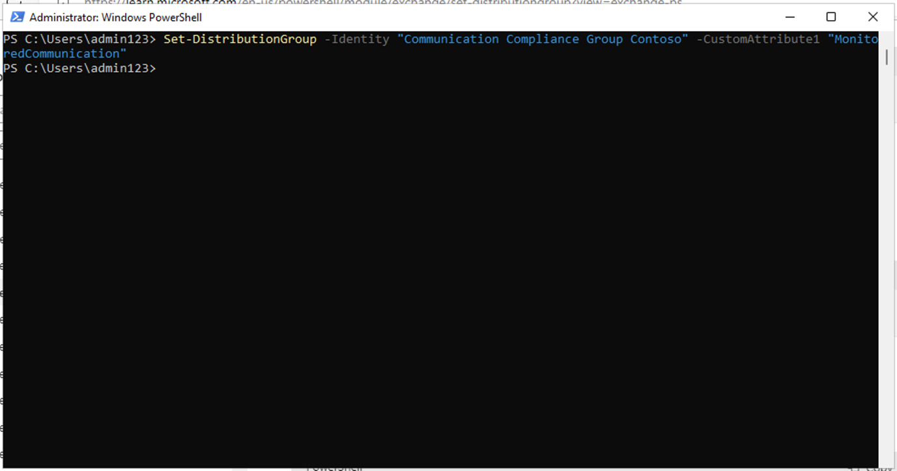

# **Lab 9 – Configuring Communication Compliance**

## Introduction

In this lab, you will configure a compliance policy to detect any
sensitive information being communicated by the users in your
organisation. You will use the sensitive info types created in the
earlier lab, to detect the employee health data or employee IDs being
communicated through Emails.

## Objectives

- Assign roles for communication compliance access.

- Create distribution groups using PowerShell.

- Configure and edit communication compliance policies.

- Enable anonymization and user notifications.

- Understand the policy testing process.

## Exercise 1 – Enabling permissions for communication compliance

In this task you will assign users to specific role groups to segment
communication compliance access and responsibilities among different
users in your organization.

1.  In the navigation menu, select **Settings**, then select **Roles and
    scopes.** Navigate and click on **Role groups.**

    

3.  Scroll down and select the checkbox beside **Communication
    Compliance**. Then, click on the pencil icon to **Edit**.

    

3.  On the **Edit members of the role group** select **Choose Users**.

    

4.  Make sure to select **MOD Administrator**, **Megan Bowen**, and
    **Patti Fernandez**. Then choose **Select**.

    

5.  Select **Next**.

    

6.  Select **Save** to add the users to the role group.
    Select **Done** to complete the steps.

    

    

## Exercise 2 – Setting up groups for communication compliance

In the policy, you'll use email addresses to identify individuals or
groups of people. To simplify your setup, you can create groups for
people who have their communication reviewed and groups for people who
review those communications.

You can use PowerShell to configure a distribution group for a global
communication compliance policy for the assigned group. This enables you
to detect messages for thousands of users with a single policy and keep
the communication compliance policy updated as new employees join your
organization.

1.  Right click on the Windows icon, then navigate and select
    **Windows** **PowerShell** **(Admin)**

    

2.  On User Account Control dialog box, select **Yes**.

    

3.  Enter the following cmdlet to use the **Exchange Online
    PowerShell** module and connect to your tenant:

    **+++Connect-ExchangeOnline+++**

    

4.  When the **Sign in** window is displayed, sign in as **MOD
    Administrator**. If **Automatically sign in to all desktop apps and
    websites on this device?** dialog box appears, then select **No,
    this app only** button

    

    

5.  Create a dedicated distribution group for your global communication
    compliance policy with the following properties:

    - **MemberDepartRestriction = Closed**. Ensures that users can't
      remove themselves from the distribution group.

    - **MemberJoinRestriction = Closed**. Ensures that users can't add
      themselves to the distribution group.

    - **ModerationEnabled = True**. Ensures that all messages sent to
      this group are subject to approval and that the group isn't being
      used to communicate outside of the communication compliance policy
      configuration.

      **+++New-DistributionGroup -Name "Communication Compliance Group Contoso" -Alias "CCG_Contoso" -MemberDepartRestriction 'Closed' -MemberJoinRestriction 'Closed' -ModerationEnabled $true+++**

    

    **Note:** You can add an **Exchange Custom Attribute** as in the following command to track users added to the communication
compliance policy in your organization.

    **+++Set-DistributionGroup -Identity "Communication Compliance Group Contoso" -CustomAttribute1 "MonitoredCommunication"+++**

    

6.  Run the following PowerShell script on a recurring schedule to add
    users to the communication compliance policy:

    ```
    $Mbx = (Get-Mailbox -RecipientTypeDetails UserMailbox -ResultSize Unlimited -Filter {CustomAttribute9 -eq $Null})
    $i = 0
    ForEach ($M in $Mbx)
    {
    Write-Host "Adding" $M.DisplayName
    Add-DistributionGroupMember -Identity "Communication Compliance Group Contoso" -Member $M.DistinguishedName -ErrorAction SilentlyContinue
    Set-Mailbox -Identity $M.Alias -CustomAttribute1 "MonitoredCommunication"
    $i++
    }
    Write-Host $i "Mailboxes added to supervisory review distribution group."
    ```

    

7.  After the output generation from the script, open a new tab and
    enter the following URL: **+++https://admin.cloud.microsoft/+++** to
    open Microsoft 365 admin center.

    If prompted to set up **multifactor authentication**, then select **Skip for now**.
    
9.  In Microsoft 365 admin center page, navigate and click on **Teams &
    groups\>Active teams & groups\>Distribution list\>Communication
    Compliance Group Contoso.**

    

10.  On the Communication Compliance pane that appears on the right side,
    click on the **Members** tab, scroll down and review all the members in
    the Distribution list group.

    

    

## Exercise 3 – Creating a communication compliance policy

1.  In the Microsoft Purview portal, select **Solutions** \>
    **Communication Compliance**.

    

2.  In **Communication Compliance** blade, navigate and click on
    **Policies**. Then, in the **Policies** page, select **+ Create
    policy**, then click on **Custom policy**.

    

3.  In the **Name** field, enter **+++My first communication compliance
    policy+++**. In the **Description** field, enter **+++This is a policy to test communication compliance+++**. Select **Next**.

    

4.  On the **Choose users and reviewers** page, scroll down to
    **Reviewers** section, type and select **Patti Fernandez**. Then,
    click on the **Next button**.

    

5.  On **Choose locations to detect** **communications** page, ensure
    that all the check boxes under **Microsoft 365 locations** are
    selected, then click on the **Next** button.

    

6.  On the **Choose conditions and review percentage**, scroll down and
    select **Add condition**, then navigate and select **Content
    contains sensitive info types**.

    

7.  In the **Content contains any of these sensitive info types** box,
    select **Add**, click on **Sensitive info types**, and search
    for **contoso**. Check the boxes for all the sensitive info types we
    created in earlier labs. Then click **Add**

    

8.  Scroll down and select the check box beside **Use OCR to extract
    text from images**, then set **Review percentage to 100%** and click
    on the **Next** button.

    

9.  On **Review and finish** page, select **Create policy**.

    

10. **Your policy was created** page is displayed with guidelines on
    when policy will be activated and which communications will be
    captured. Now, click on the **Done** button.

    

## Exercise 4 – Editing a communication compliance policy

1.  In the **Communication Compliance – Policies** page, click on the
    ellipsis beside **My first communication compliance policy**, then
    navigate and click on **Edit**.

    **Note**: In case, you did not see My first communication complianc policy, then refresh the page.

    

2.  Keep the **Name and describe your policy** as previously set, then
    click on the **Next** button.

    

3.  On **Choose users and reviewers** page, navigate and select the
    radio button beside **Select users**.

    

4.  In the **Start typing to find users or groups**, search
    for **Communication** and select **Communication Compliance Groups
    Contoso**.

    

5.  In **Reviewers** section, type and select MOD Administrator.
    Select **Next** till you reach **Review and finish** page.

    

6.  Then, click on the **Save** button.

    

## Exercise 5 – Creating notice templates and configure user anonymization

1.  In the Microsoft Purview portal, select **Settings** from the top
    right corner, then navigate and select **Communication Compliance**.

    

2.  In **Communication Compliance settings – Privacy** page, to enable
    anonymization, ensure that the **Show anonymized versions of
    usernames** radio button is selected. Then, click on the **Save**
    button.

    **Note**: In case, **Save** button is not highlighted, then select some other feature radio button, and select again **Show anonymized versions
of usernames** radio button.

    

3.  Select **Notice templates** and then click on the **+** symbol to
    create notice template.

    

4.  On the **Create a notice template** page, complete the following
    fields:

    - Template name: **+++Sample Notice+++**

    - Send from: Select **Patti Fernandez** by
      typing **Patti** and selecting the name from the drop down.

    - Cc: Select **MOD** **administrator** by
      typing **MOD** and selecting the name from the drop down.

    - Subject: **+++Your communication violets company Communication compliance policy.+++**

    - Message body: **+++Please note this for future reference and provide an acceptable justification for your current communication.+++**

5.  Select **Create** to create and save the notice template.

    

## Exercise 6 – Testing your communication compliance policy

In the trial account you will not have the privilege to send any email
but you can check out the following steps to understand how to test the
policy when you have your own licenses. You can perform steps but your
mail will not be able to reach the receiver from your current tenant.

1.  In a New InPrivate widnow open outlook by entering the following URL in the address bar:
   **+++https://outlook.office365.com/mail/+++**. Then, sign in with the
    username **adelev@WWLxXXXXXX.onmicrosoft.com** and the User
    Password provided in the **Resources** tab.

2.  Send an email to your personal email account with the following
    message body.

    Message body: **+++Employee Patti Fernandez EMP123456 is on absence because of the flu/influenza+++**

    **Note** Email messages can take approximately 24 hours to fully process in a policy. Communications in Microsoft Teams, Yammer, and third-party
platforms can take approximately 48 hours to fully process in a policy.

Sign in to **+++https://purview.microsoft.com/+++** as **Patti Fernandez**. Navigate to **Communication compliance** \> **Alerts** to
view the alerts for your policies after 24 hours.

**Summary:**

In this lab, you have learned how to configure and manage Communication
Compliance in Microsoft Purview. You assigned the required roles,
created distribution groups using PowerShell, and set up compliance
policies to monitor internal communications. You enabled anonymization
to protect user identities during reviews, created user notice
templates, and understood how to simulate and test communication
compliance policies before full enforcement.


