---
lab:
  title: Lab 9 — Detect data leakage and misconduct with Communication Compliance policy templates and remediation workflows
  description: In this lab we created Communication Compliance policies from templates and worked an alert through the full remediation workflow.
  duration: 20 minutes
  level: 300
  islab: true
  primarytopics:
    - Microsoft Purview
    - Communication Compliance
---

# Lab 9 — Detect data leakage and misconduct with Communication Compliance policy templates and remediation workflows

Not every risk to Contoso Pharmaceuticals is a file leaving the network — some risks are in what people say. A researcher might email pre-publication Mark 8 results to an outside contact, a deal-team member might tip off a colleague about the confidential Falcon acquisition, or an employee might send harassing messages. Communication Compliance detects these in email, Teams, and Viva Engage, routes them to a reviewer, and provides a workflow to investigate and act. In this lab, acting as Megan Bowen, you'll create three policies from Microsoft's built-in templates — inappropriate text, sensitive information, and conflict of interest — and then work an alert through the full remediation workflow the way a reviewer does.

Communication Compliance separates duties: an administrator configures policies, while designated reviewers investigate the messages they surface. In this lab, Megan Bowen acts in both capacities — configuring the policies and serving as the reviewer — because it uses a single account; in production these roles are typically held by different people.

**Learning outcomes.** After this lab you can:

- Create a scoped monitoring group with PowerShell.
- Create policies from the inappropriate-text, sensitive-information, and conflict-of-interest templates.
- Create a notice template for user notifications.
- Investigate and remediate a policy alert using resolve, tag, notify, and escalate actions.

**Tasks**:

1. Create a scoped monitoring group with PowerShell
2. Create a sensitive-information policy
3. Create an inappropriate-text policy
4. Create a conflict-of-interest policy
5. Create a notice template
6. Investigate and remediate an alert

## Task 1 – Create a scoped monitoring group with PowerShell

A policy needs to know whose communications to monitor. Rather than naming individuals, you'll create a distribution group that represents the monitored population, so the policy scales as staff change. In this task, you'll create that group with PowerShell.

1. On the client VM, open an elevated terminal: right-click the **Start** button and select **Terminal (Administrator)**. Select **Yes** on the User Account Control prompt.

2. Install the Exchange Online module and connect. When the sign-in window appears, sign in as **Megan Bowen**:

   ```powershell
   Install-Module -Name ExchangeOnlineManagement -Scope CurrentUser -Force -AllowClobber
   Import-Module ExchangeOnlineManagement
   Connect-ExchangeOnline -UserPrincipalName MeganB@TenantName
   ```

3. Create a moderated, closed distribution group to represent the monitored population:

   ```powershell
   New-DistributionGroup -Name "Contoso Monitored Communications" -Alias "CCG_Contoso" -MemberDepartRestriction 'Closed' -MemberJoinRestriction 'Closed' -ModerationEnabled $true
   ```

4. Tag the group with a custom attribute so monitored users are easy to track:

   ```powershell
   Set-DistributionGroup -Identity "Contoso Monitored Communications" -CustomAttribute1 "MonitoredCommunication"
   ```

5. Add the research and commercial users whose communications are most sensitive. Replace the identities with real users in your tenant as needed:

   ```powershell
   Add-DistributionGroupMember -Identity "Contoso Monitored Communications" -Member GradyA@TenantName
   Add-DistributionGroupMember -Identity "Contoso Monitored Communications" -Member IsaiahL@TenantName
   Add-DistributionGroupMember -Identity "Contoso Monitored Communications" -Member IrvinS@TenantName
   ```

6. Confirm the group and its members:

   ```powershell
   Get-DistributionGroupMember -Identity "Contoso Monitored Communications" | Format-Table DisplayName, PrimarySmtpAddress
   ```

	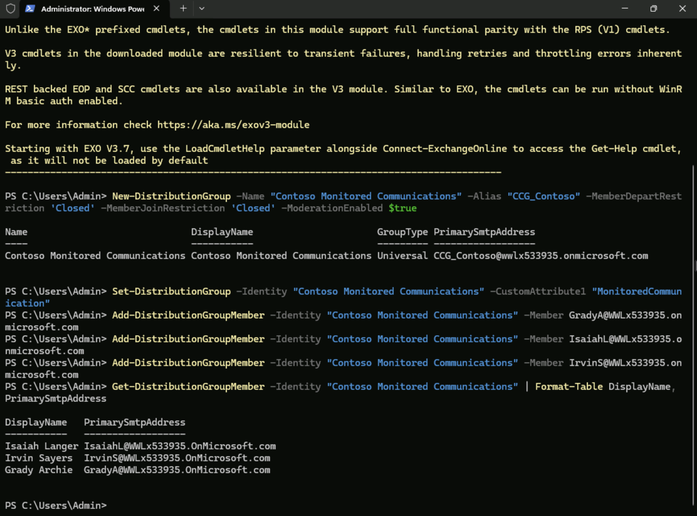

> [!NOTE]
> Closed join/depart restrictions and moderation ensure the group is used only for the compliance policy and not as a general mailing list. In production, you would populate this group on a recurring schedule so new employees are automatically monitored. This timing is indicative, not guaranteed.

You have successfully created the scoped monitoring group with PowerShell.

## Task 2 – Create a sensitive-information policy

Contoso's first concern is pre-publication research and trial data leaving through messages. In this task, you'll create a policy from the sensitive-information template that detects Contoso's compound and trial classifiers in communications.

1. In **Microsoft Edge**, in the Microsoft Purview portal as **Megan Bowen**, select **Solutions** > **Communication Compliance**.

2. Select **Policies**, then select **+ Create policy** > **Detect sensitive info** (the sensitive-information template).

	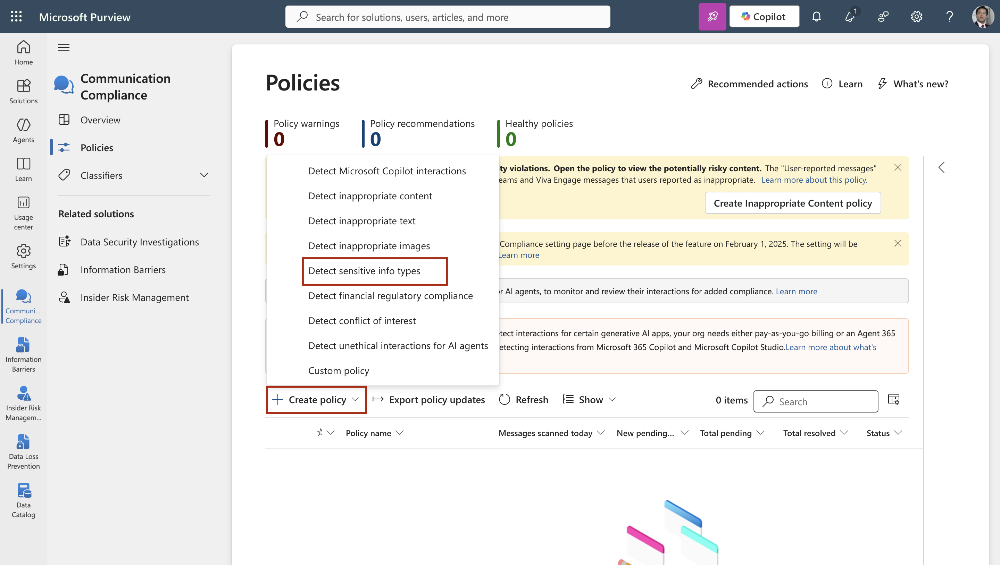

3. On the policy page, confirm or set the **Policy name** to `Detect research and trial data in messages`. (Policy names can't be changed after creation.)

4. In the **Users or groups in scope** field, select the **Contoso Monitored Communications** group from Task 1.

	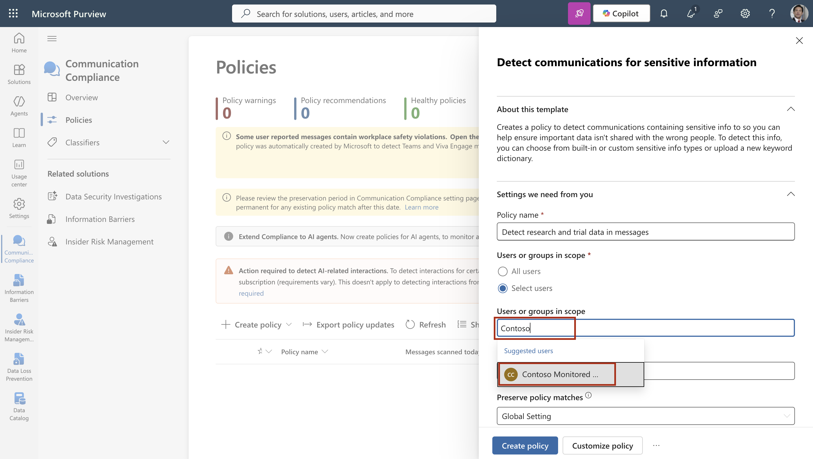

5. In the **Reviewers** field, add **Megan Bowen**. (Reviewers added here are the people you can escalate alerts to later.)

	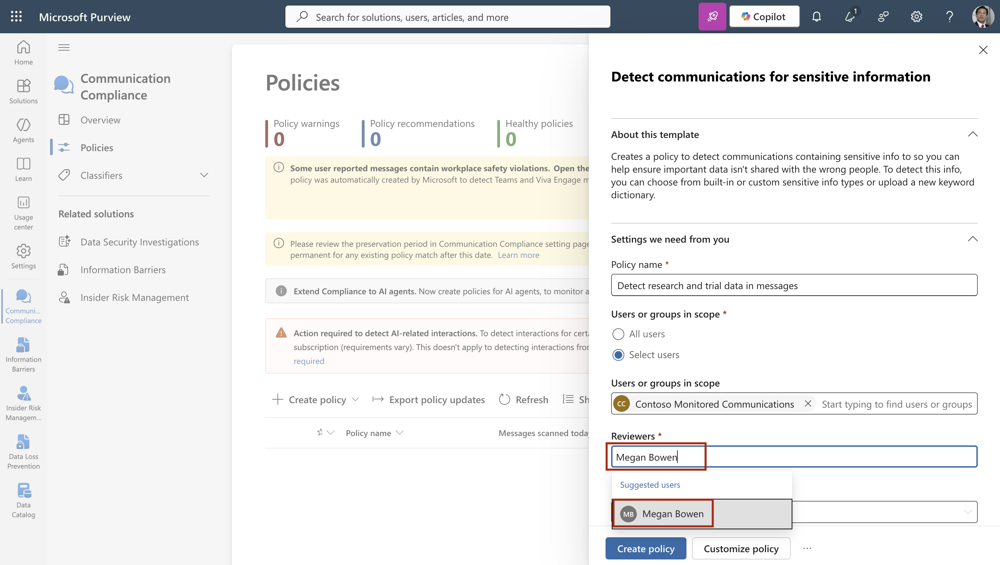

6. On the conditions step, under **Content contains sensitive info types**, select **Add** > **Sensitive info types**, search for `Contoso`, select **Contoso Compound ID** and **Contoso Clinical Trial Subjects** (from Lab 2), then select **Add**. 

	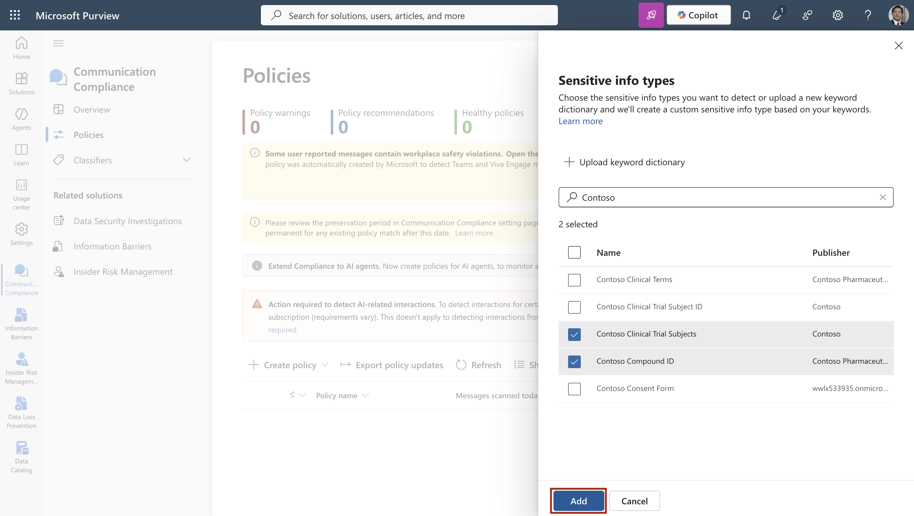

7. Select **Customize policy**.

	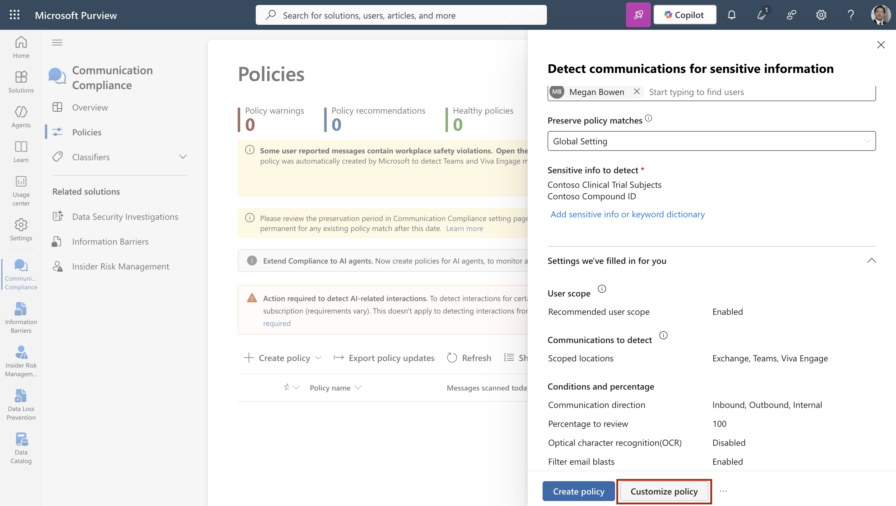

8. Select **Next** until the **Choose conditions and review percentage** page. Enable **Use OCR to extract text from images** so sensitive content in screenshots is also detected, set the **Review percentage** to `100%`, then continue.

	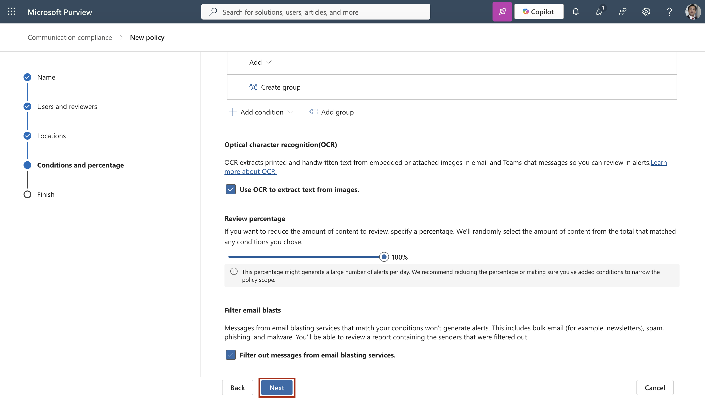

9. Review the settings and select **Create policy**, then select **Done**.

	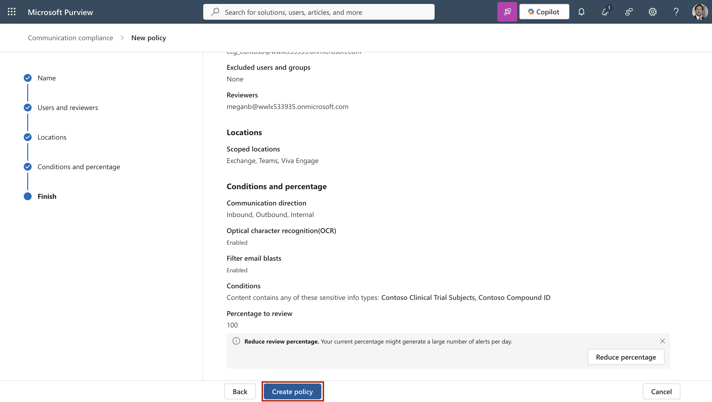

	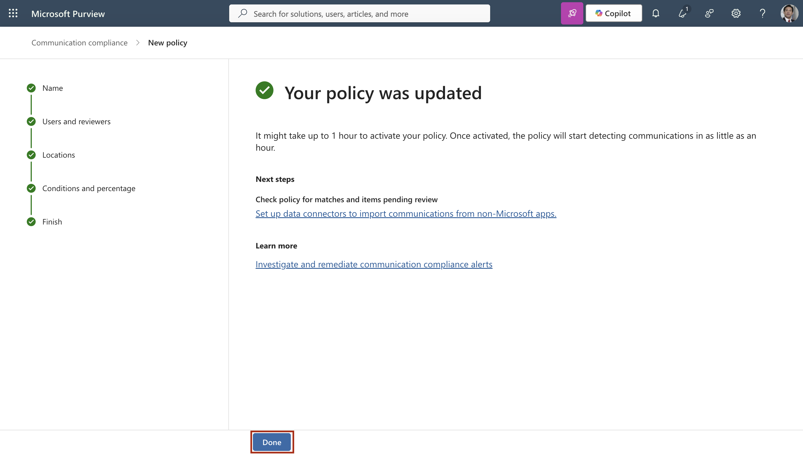

You have successfully created a sensitive-information policy that detects Contoso's research and trial data in communications.

## Task 3 – Create an inappropriate-text policy

Misconduct in messages — harassment, threats, profanity — is the other side of communication risk. In this task, you'll create a policy from the inappropriate-text template, which uses Microsoft's built-in classifiers to detect this content with no training required.

1. In the Microsoft Purview portal, on the **Communication Compliance** > **Policies** page, select **+ Create policy** > **Detect inappropriate text**.

	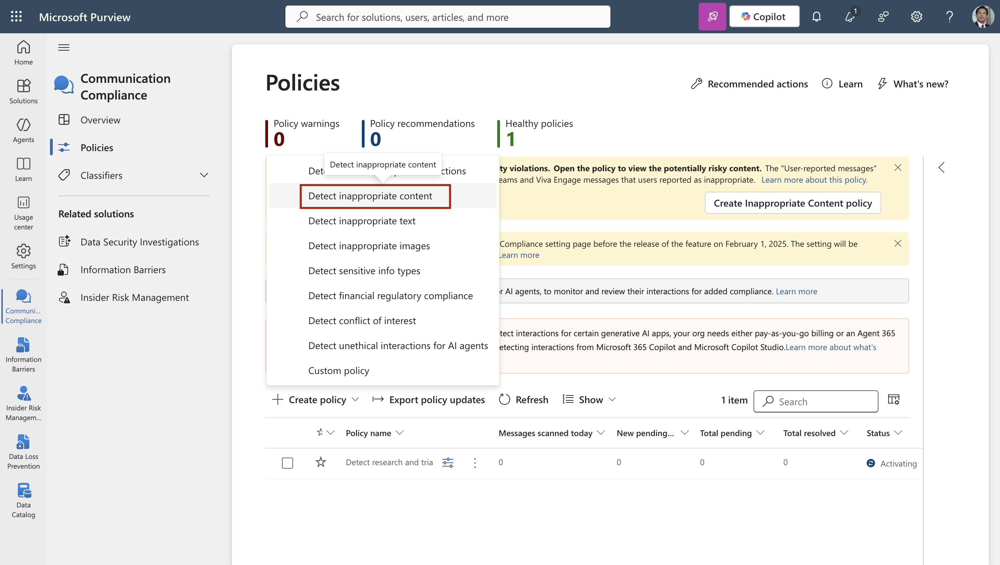

2. Confirm or set the **Policy name** to `Detect inappropriate text`.

3. In the **Users or groups in scope** field, select the **Contoso Monitored Communications** group.

4. In the **Reviewers** field, add **Megan Bowen**.

5. Accept the template's built-in conditions, which apply Microsoft's threat, harassment, discrimination, and profanity classifiers. Set the **Review percentage** as desired (for example, 100% for the lab), then continue.

6. Review the settings and select **Create policy**, then select **Done**.

	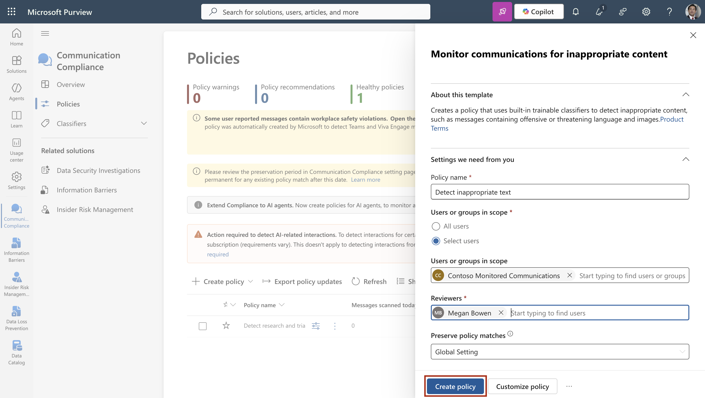

	

> [!NOTE]
> The inappropriate-text template uses Microsoft's pretrained business-conduct classifiers, which are ready to use immediately — you don't train anything. This is why a template-based policy is faster to deploy than a custom one for common conduct scenarios.

You have successfully created an inappropriate-text policy.

## Task 4 – Create a conflict-of-interest policy

The confidential Falcon acquisition creates a conflict-of-interest risk: the deal team must not coordinate with the commercial function, because deal-team members hold material non-public information. In this task, you'll create a conflict-of-interest policy that detects communications between two groups that shouldn't be talking.

1. In the Microsoft Purview portal, on the **Communication Compliance** > **Policies** page, select **+ Create policy** > **Detect conflict of interest**.

	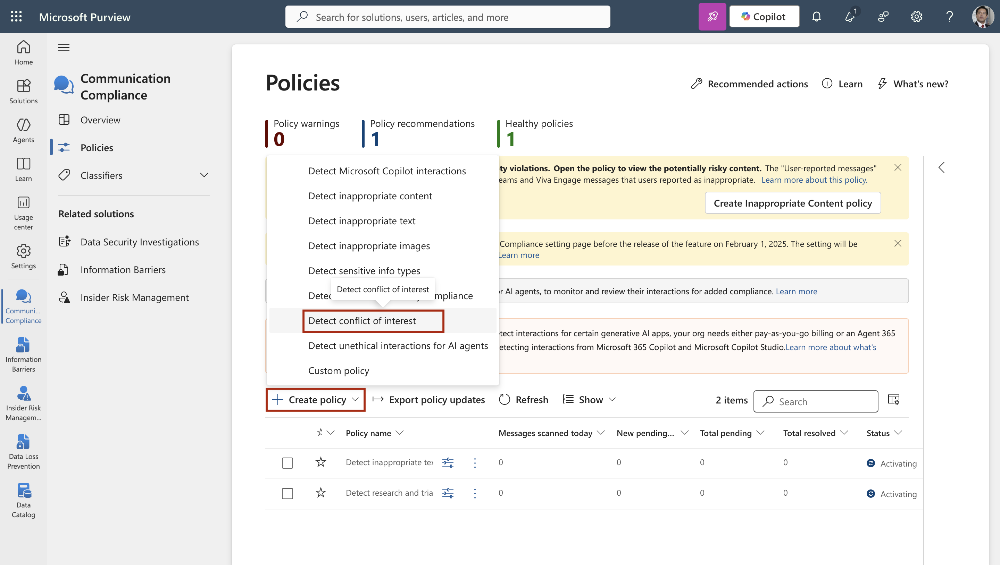

2. Confirm or set the **Policy name** to `Falcon deal team conflict of interest`.

3. The conflict-of-interest template asks for **two** scoped groups (or two users) to detect internal communications between them. For the first group, select the **Project Falcon** group; for the second, select the **Sales** group (or a Sales/commercial group in your tenant).

4. In the **Reviewers** field, add **Megan Bowen**, then continue.

5. Review the settings and select **Create policy**, then select **Done**.

	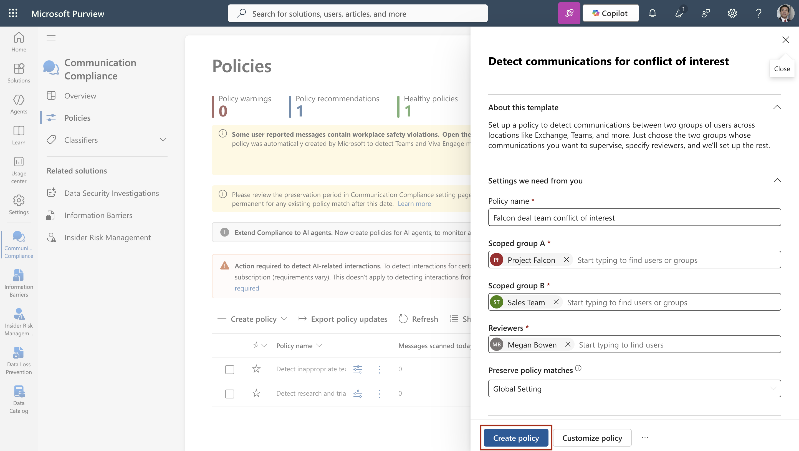

	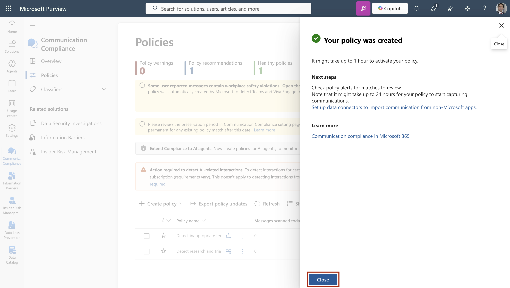

> [!NOTE]
> Unlike the other templates, the conflict-of-interest template detects communication **between two specified groups**, not content matching a classifier. It flags that the Falcon deal team and the commercial function are communicating at all — which, given the confidential acquisition, is itself the risk. Use existing groups for both sides.

You have successfully created a conflict-of-interest policy for the Falcon deal team.

## Task 5 – Create a notice template

When a reviewer decides a message warrants a reminder, they send the user a notice. In this task, you'll create the notice template used in the remediation workflow.

1. In the Microsoft Purview portal, in the upper-right corner select **Settings** > **Communication Compliance**.

2. Select **Notice templates**, then select **+** to create a template.

	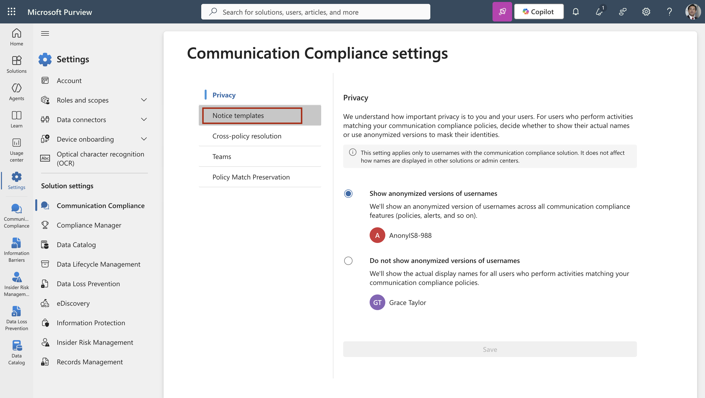

3. On the **Create a notice template** page, complete:

   - **Template name**: `Contoso communication notice`
   - **Send from**: select **Megan Bowen**
   - **Cc**: select **Megan Bowen**
   - **Subject**: `Your communication may violate Contoso communication compliance policy.`
   - **Message body**: `This message was flagged by Contoso's communication compliance policy. Please review company policy and provide a justification for this communication.`

4. Select **Create**.

	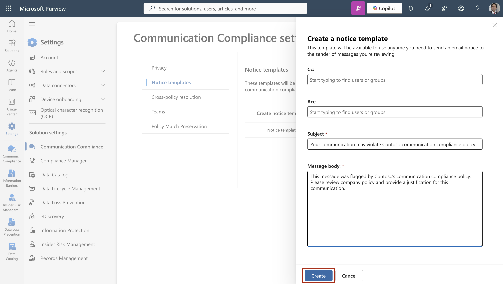

	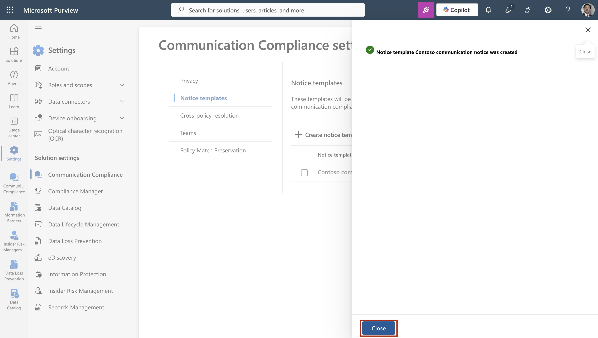

You have successfully created the notice template used to inform users during remediation.

## Task 6 – Investigate and remediate an alert

Detection is only half of Communication Compliance; the workflow to investigate and act on what's found is the other half. In this task, you'll generate a policy match, then work the resulting alert through the remediation actions a reviewer uses.

1. In **Microsoft Edge**, open a **New InPrivate window**, navigate to **`https://outlook.office.com`**, and sign in as **Grady Archie**, `GradyA@TenantName` (a monitored user). Grady's password is provided in the Resources tab.

2. Compose and send an email — to an external address you control or to another internal user — with the subject `Compound results` and a body containing `Sharing pre-publication results for investigational compound CX-2087.` This message contains a Contoso compound identifier and should match the sensitive-information policy.

	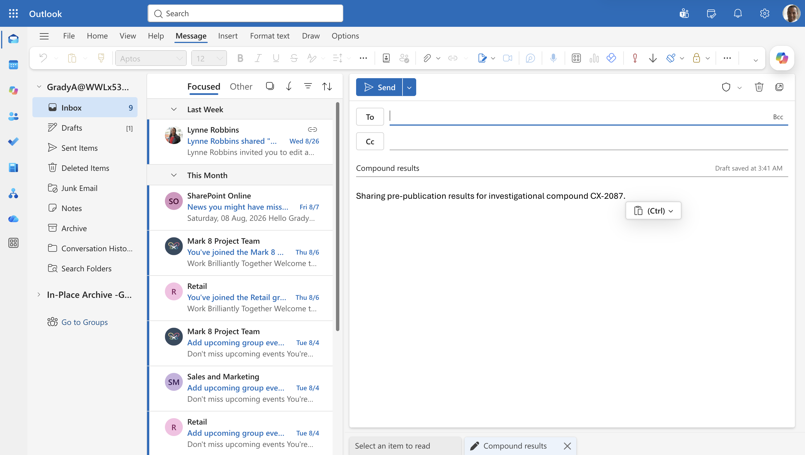

3. Allow time for the message to be processed by the policy (email can take approximately 24 hours; Teams and Viva Engage up to 48 hours).

4. Sign in to the Microsoft Purview portal as **Megan Bowen** (the reviewer), `MeganB@TenantName`, and select **Solutions** > **Communication Compliance** > **Alerts**.

5. Select the alert generated by the **Detect research and trial data in messages** policy to open it. Review the alert basics — policy, severity, and the matched message — noting that the username may appear anonymized.

6. Open the matched message to examine the full header and body, and review the **Timeline** to see the user's prior policy matches, which provides context for how serious the issue is.

7. Work the message through the remediation actions:

   - **Tag as** — tag the message as **Compliant**, **Noncompliant**, or **Questionable** to record your assessment and support filtering.
   - **Notify** — send the user the **Contoso communication notice** template you created, to remind them of policy.
   - **Escalate** — if it needs another reviewer's judgment, escalate it to a designated reviewer.
   - **Resolve** — once handled, resolve the alert to move it from the pending queue to the resolved queue.

8. Confirm the alert moves to the resolved state and that the remediation action is recorded in the user's activity history.

> [!IMPORTANT]
> Alerts appear only after a message matches a policy and is processed, which is not immediate — allow up to 24 hours for email and 48 hours for Teams and Viva Engage. It is normal for the Alerts queue to be empty shortly after sending the test message; return once processing completes. A message that isn't covered by an existing policy can't be remediated — a policy must exist to detect and act on it. A case can also be escalated to eDiscovery (Premium) for a formal investigation, which connects to the eDiscovery lab later in the course. These timings are indicative, not guaranteed.

You have successfully investigated and remediated a Communication Compliance alert.

## Summary

In this lab, you configured Communication Compliance for Contoso Pharmaceuticals to detect both data leakage and misconduct in communications. You configured Communication Compliance with Megan Bowen as both administrator and reviewer (a single account standing in for roles that are usually separated), and created a scoped monitoring group with PowerShell. You then created three policies from Microsoft's built-in templates: a sensitive-information policy detecting Contoso's compound and trial classifiers, an inappropriate-text policy using pretrained business-conduct classifiers, and a conflict-of-interest policy flagging communication between the Falcon deal team and the commercial function. Finally, you created a notice template and worked a policy alert through the full remediation workflow — tag, notify, escalate, and resolve. These policies let Contoso detect and act on communication risks that file-based controls can't see.