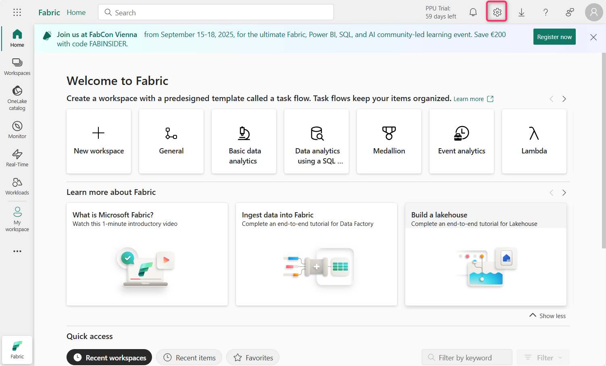

# **Lab 10: Enforce Sensitivity Labeling in Fabric and Power BI using Microsoft Purview**

## **Introduction**

Sensitivity labels from Microsoft Purview Information Protection in
Fabric and Power BI (including Power BI Desktop) must be enabled on the
tenant. When sensitivity labels are enabled:

- Specified users and security groups in the organization can apply
  sensitivity labels to their Fabric content. In the Fabric service,
  this means any Fabric item. In Power BI Desktop, it means their .pbix
  files.

- In the service, all members of the organization can see those labels.
  In Desktop, only members of the organization who have the labels
  published to them can see the labels.

## **Objective**

- Enable and prioritize a manual sensitivity label policy in Microsoft
  Fabric using Microsoft Purview.

## **Exercise 1: Activate Microsoft Fabric Trial and Access the Purview Hub**

1.  Open an Edge browser address bar and enter the following URL to open
    the Fabric portal - **+++https://app.fabric.microsoft.com+++**

    

  **Note**: In case, you are directly landing into the Fabric portal, then skip steps #2 and 3.

2.  Enter your tenant credentials.

    

    

3.  In the password field, enter the tenant password. Then, click on the
    **Sign in** button.

    

4.  On **Welcome to the Fabric view** dialog box, click on the
    **Cancel** button.

    

5.  Click on the profile icon on the command bar.

    

6.  Navigate and click on **Free trial** button.

    

7.  On the **Activate your 60-day free Fabric trial capacity** - **Trial
    capacity region** ensure that **Default – West US 3** region is
    selected, then click on the **Activate** button.

    

8.  On **Successfully upgraded to a free Microsoft Fabric trial** dialog
    box, click on the **Got it** button.

    

9.  Click on the **Settings** gear box in the command bar.

    

10. Navigate to Governance and insights section and click on **Microsoft
    Purview hub (preview)** link.

    

11. In the **Microsoft Purview hub (preview)** page, click on the
    **Information Protection** tile.

    

12. In case, **Pick an account** dialog box appears, then select your
    tenant ID.

    

13. If **Welcome to Information Protection in the new Microsoft Purview
    portal** dialog box, click on **Get started** button.

    

## **Exercise 2: Create and Configure a Sensitivity Label Policy for Fabric and Power BI**

1.  In the Information Protection blade, navigate and click on the
    dropdown beside **Policies**.

    

2.  Then, click on **Label publishing policies**. In the Label policies
    page, click on **Publish label**

    

3.  In the **Create policy** page, navigate and click on **Choose
    sensitivity label to publish** link.

    

4.  **Sensitivity label to publish** pane appears on the right side,
    navigate and select the checkbox beside **Confidential**, then click
    on the **Add** button.

    

5.  Now, click on the **Next** button.

    

6.  On **Assign admin units** page, click on the **Next** button.

    

7.  In **Publish to users and groups** page, ensure that the checkbox
    beside **Users and groups** is selected, then click on the **Next**
    button.

    

8.  In the **Policy settings** page, select the checkbox beside
    **Require users to apply a label to their Fabric and Power BI
    content**. Then, click on the **Next** button.

    

    

9.  On **Default settings for documents – Apply a default label to
    documents** page, click on the **Next** button.

    

10. On **Default settings for documents – Apply a default label to
    emails** page, click on the **Next** button.

    

11. On **Default settings for meetings and calendar events** page, click
    on the **Next** button.

    

12. On **Default settings for Fabric and Power BI content** page, click
    on the **Next** button.

  

13. In **Name your policy** page, under the **Name** field, enter
    **+++Manual Labeling – HR Confidential Docs+++**. Then, click on the
    **Next** button.

    

14. On **Review and finish** page, click on the **Submit** button.

    

15. The policy is successfully created. Now, click on the **Done**
    button.

    

16. In the **Label policies** page, you will see **Manual Labeling – HR
    Confidential Docs** policy is successfully created.

    

17. Select **Manual Labeling – HR Confidential Docs**, then click on the
    horizontal ellipsis, navigate and select **Move up** to change the
    Priority.

    

    

18. Again, select **Manual Labeling – HR Confidential Docs**, then click
    on the horizontal ellipsis beside it and select **Move up**.

    

19. You will notice that **Manual Labeling – HR Confidential Docs**
    priority is now changed to 1.

    

## **Summary**

In this lab, you’ve activated a Microsoft Fabric trial, accessed the
Microsoft Purview portal, and created a mandatory sensitivity label
policy requiring users to apply the "Confidential" label to Fabric and
Power BI content. The policy was then prioritized for enforcement.

