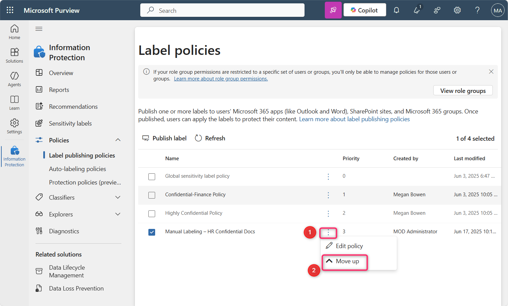

---
lab:
  title: Lab 14 — Enforce sensitivity labeling on analytics data in Microsoft Fabric and Power BI
  description: In this lab we activated a Microsoft Fabric trial and published a sensitivity label policy that makes labels available in Fabric and Power BI and requires users to apply one.
  duration: 15 minutes
  level: 300
  islab: true
  primarytopics:
    - Microsoft Purview
    - Microsoft Fabric
---

# Lab 14 — Enforce sensitivity labeling on analytics data in Microsoft Fabric and Power BI

## Introduction

Contoso Pharmaceuticals' analytics estate is a blind spot for data protection. Confidential HR and Finance documents — employee records, budgets, and other sensitive business content — flow into Microsoft Fabric and Power BI as reports and datasets, where the sensitivity labels that protect documents elsewhere don't automatically apply. To close this gap, Contoso extends its Microsoft Purview Information Protection sensitivity labels into Fabric and Power BI (including Power BI Desktop), so analytics content is classified consistently with the rest of the organization's data.

Sensitivity labels from Microsoft Purview Information Protection must be enabled on the tenant before they can be used in Fabric and Power BI. When sensitivity labels are enabled:

- Specified users and security groups in the organization can apply sensitivity labels to their Fabric content. In the Fabric service, this means any Fabric item. In Power BI Desktop, it means their .pbix files.
- In the service, all members of the organization can see those labels. In Desktop, only members of the organization who have the labels published to them can see the labels.

This lab is part of Contoso's data-protection program and uses the classification labels configured earlier in the course.

> [!IMPORTANT]
> This lab requires a Microsoft Fabric capacity. The steps activate a 60-day Fabric trial capacity, which is sufficient for enabling and publishing labels. Note a licensing detail: enabling labels and publishing the label policy work with the trial capacity, but for an individual user to *apply* a label to a Fabric or Power BI item, that user also needs a Power BI Pro or Premium Per User (PPU) license. This lab covers the tenant-level enablement and policy configuration, which is where Fabric labeling is administered.

## Objective

- Enable and prioritize a mandatory sensitivity label policy in Microsoft Fabric using Microsoft Purview.

**Learning outcomes.** After this lab you can:

- Activate a Microsoft Fabric trial capacity and access the Microsoft Purview hub.
- Publish a sensitivity label policy that makes a Contoso classification label available in Fabric and Power BI.
- Require users to apply a label to their Fabric and Power BI content.
- Prioritize a label policy.

## Exercise 1 – Activate Microsoft Fabric Trial and Access the Purview Hub

In this exercise, you'll open Microsoft Fabric, activate a trial capacity so Fabric features are available, and open the Microsoft Purview hub from within Fabric.

1.  Open an Edge browser address bar and enter the following URL to open the Fabric portal - ```https://app.fabric.microsoft.com```


**Note**: In case you are directly landing into the Fabric portal, then skip steps #2 and 3.

2.  Enter the tenant credentials for **Allan Deyoung**, `AllanD@TenantName` (the Tenant Name and account password are provided in the Resources tab).


3.  In the password field, enter the tenant password. Then, click on the **Sign in** button.


4.  On **Welcome to the Fabric view** dialog box, click on the **Cancel** button.


5.  Click on the profile icon on the command bar.


6.  Navigate and click on **Free trial** button.


7.  On the **Activate your 60-day free Fabric trial capacity**, in the **Trial capacity region** ensure that **Default – West US 3** region is selected, then click on the **Activate** button.


8.  On **Successfully upgraded to a free Microsoft Fabric trial** dialog box, click on the **Got it** button.


9.  Click on the **Settings** gear box in the command bar.


10. Navigate to the **Governance and insights** section and click on **Microsoft Purview hub (preview)** link. Then, on the **Microsoft Purview hub (preview)** page, navigate and click on the **Information Protection** tile.


11. In case a **Pick an account** dialog box appears, then select your tenant ID.


12. On the **Welcome to Information Protection in the new Microsoft Purview portal** dialog box, click on the **Get started** button.


You have successfully activated the Fabric trial capacity and opened the Information Protection area of the Microsoft Purview hub.

## Exercise 2 – Create and Configure a Sensitivity Label Policy for Fabric and Power BI

Contoso needs its confidential HR and Finance documents classified when they appear in Fabric and Power BI. In this exercise, you'll publish a label policy that makes the **Confidential** classification label available in Fabric and Power BI and requires users to apply a label to their content, then prioritize the policy.

1.	In the Information Protection blade, navigate and click on the dropdown beside **Policies**.


2. Then, click on **Label publishing policies**. In the **Label publishing policies** page, navigate and click on **Publish label**.


3. In the **Create policy** page, navigate and click on the **Choose sensitivity label to publish** link.


4. The **Sensitivity label to publish** pane appears on the right side. Navigate and select the checkbox beside **Confidential**, then click on the **Add** button.


5. Now, click on the **Next** button.


6. On the **Assign admin units** page, click on the **Next** button.


7. In the **Publish to users and groups** page, ensure that the checkbox beside **Users and groups** is selected, then click on the **Next** button.


8. In the **Policy settings** page, select the checkbox beside **Require users to apply a label to their Fabric and Power BI content**. Then, click on the **Next** button.


> [!NOTE]
> Requiring users to apply a label — mandatory labeling — means a user must classify their Fabric and Power BI content before they can save or publish it, which prevents unclassified analytics content. In Fabric, a label classifies the content and governs its export to Office formats; the label's encryption and content-marking settings aren't applied to Fabric items themselves. This behavior is indicative, not guaranteed.

9. On the **Default settings for documents – Apply a default label to documents** page, click on the **Next** button.


10. On the **Default settings for documents – Apply a default label to emails** page, click on the **Next** button.


11. On the **Default settings for meetings and calendar events** page, click on the **Next** button.


12. On the **Default settings for Fabric and Power BI content** page, click on the **Next** button.


13. In the **Name your policy** page, under the **Name** field, enter ```Manual Labeling – HR Confidential Docs```. Then, click on the **Next** button.


14. On the **Review and finish** page, click on the **Submit** button.


15. The policy is successfully created. Now, click on the **Done** button.


16. In the **Label policies** page, you will see the **Manual Labeling – HR Confidential Docs** policy is successfully created.


17. Select **Manual Labeling – HR Confidential Docs**, then click on the horizontal ellipsis, navigate and select **Move up** to change the Priority.




18. Again, select **Manual Labeling – HR Confidential Docs**, then click on the horizontal ellipsis beside it and select **Move up**.


19. You will notice that the **Manual Labeling – HR Confidential Docs** priority is now changed to 1.


> [!NOTE]
> When a user is subject to more than one label policy, the default-label and mandatory-labeling settings are taken from the highest-priority policy. Setting this policy to priority 1 ensures Contoso's labeling requirement governs the relevant users. This behavior applies in the policy list, though enforcement to users can lag. This timing is indicative, not guaranteed.

You have successfully published and prioritized the sensitivity label policy for Fabric and Power BI.

## Summary

In this lab, you activated a Microsoft Fabric trial, accessed the Microsoft Purview portal, and created a mandatory sensitivity label policy requiring users to apply the **Confidential** label to Fabric and Power BI content — protecting Contoso Pharmaceuticals' confidential HR and Finance analytics content consistently with the rest of its data. The policy was then prioritized for enforcement. With these controls in place, Contoso's analytics estate is classified the same way as its documents and email, closing a key data-protection gap ahead of broader analytics and AI adoption.