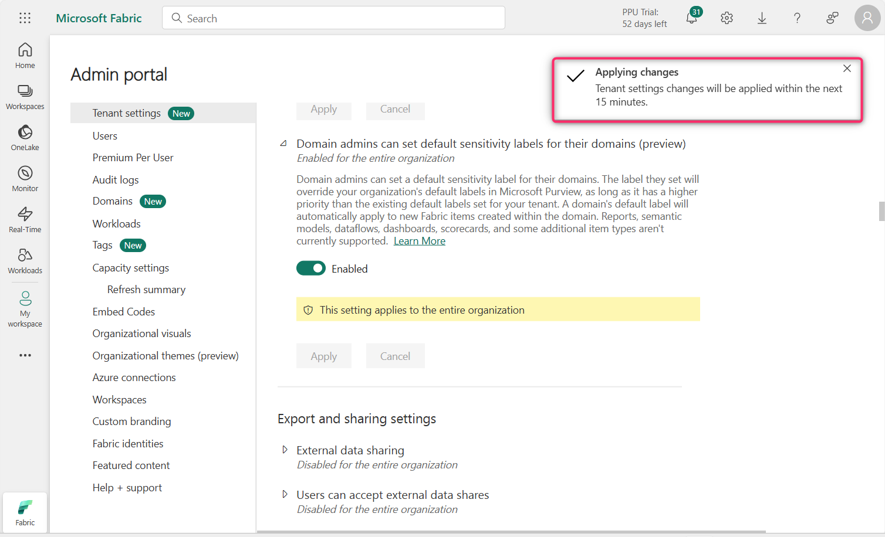

---
lab:
  title: Lab 15 — Configure information protection policy in Microsoft Fabric
  description: In this lab we enabled the information protection tenant settings in the Microsoft Fabric Admin portal to support sensitivity label application, inheritance, and admin overrides.
  duration: 15 minutes
  level: 300
  islab: true
  primarytopics:
    - Microsoft Purview
    - Microsoft Fabric
---

# Lab 15 — Configure information protection policy in Microsoft Fabric

## Introduction

For Contoso Pharmaceuticals to protect the sensitive analytics content in its Microsoft Fabric and Power BI estate, the tenant's information-protection settings must be turned on first. These settings let specified users apply sensitivity labels to Fabric content, allow labels to be inherited from source data and flow downstream, and restrict how protected content can be shared — so that Contoso's confidential information is only seen and accessed by the appropriate users. In this lab, acting as Allan Deyoung, you'll enable the information-protection tenant settings in the Fabric Admin portal that prepare Contoso's estate for sensitivity-label enforcement.

This lab configures the tenant-level foundation that the labeling and data-loss-prevention labs in this Fabric cluster build on.

> [!IMPORTANT]
> This lab requires a Microsoft Fabric capacity (the 60-day trial capacity activated earlier in the Fabric cluster is sufficient) and the appropriate Fabric/Power BI administrator permissions to change tenant settings. Some settings shown are only available once labeling is enabled — for example, the sharing-restriction setting requires that applying sensitivity labels is already turned on, which you do first in this lab. This lab covers tenant-level configuration, not the creation of Fabric artifacts.

## Objective

- Enable information protection features in Microsoft Fabric through the Admin Portal to prepare for sensitivity label enforcement.

**Learning outcomes.** After this lab you can:

- Enable the tenant setting that allows users to apply sensitivity labels to Fabric content.
- Enable label inheritance from data sources and to downstream content.
- Allow workspace admins to override automatically applied labels.
- Restrict sharing of content that carries protected labels.
- Enable domain-level default sensitivity labeling.

## Exercise 1 – Configure Information Protection Settings in Fabric Admin Portal

In this exercise, you'll enable each of the information-protection tenant settings that Contoso needs, applying them one at a time in the Fabric Admin portal.

1.  In the Fabric portal home page, click on the **Settings** icon in
    the command bar, then navigate to the **Governance and insights**
    section and click on the **Admin portal** link.

    

2.  In the Admin portal – Tenant settings, scroll down to the **Information
    protection** section.

    

3.  Click on the play button beside the **Allow users to apply sensitivity
    labels for content.**

    

4.  Click on the toggle button to enable it. With this setting enabled,
    specified users can apply sensitivity labels from Microsoft Purview
    Information Protection.

    

5.  Now, click on the **Apply** button.

    

    **Note**: In case the **Apply** button is not highlighted, then select the **Specific security groups** radio button and select back the **The entire organization** radio button.

6.  You will receive a notification stating – **Tenant settings will be
    applied within the next 15 minutes**.

    

7.  Click on the play icon beside **Apply sensitivity labels from data
    sources to their data in Power BI**

    

8.  Click on the toggle button to enable it.

    

9.  When this setting is enabled, Power BI semantic models that connect
    to sensitivity-labeled data in supported data sources can inherit
    those labels, so that the data remains classified and secure when
    brought into Power BI.

    Click on the **Apply** button.

    

10. You will receive a notification stating – **Tenant settings will be
    applied within the next 15 minutes.**

    

11. Click on the Play icon beside **Automatically apply sensitivity
    labels to downstream content**

    

12. Click on the toggle button to enable it.

    

13. With this setting enabled, whenever a sensitivity label is changed
    or applied to Fabric content, the label will also be applied to its
    eligible downstream content.

    Click on the **Apply** button.

    

14. You will receive a notification stating – Tenant settings will be
    applied within the next 15 minutes.

    

15. Click on the Play icon beside - **Allow workspace admins to override
    automatically applied sensitivity labels**

    

16. Click on the toggle button to enable it.

    

17. This setting makes it possible for workspace admins to override
    automatically applied sensitivity labels without regard to label
    change enforcement rules.

    Click on the **Apply** button

    

18. You will receive a notification stating - Tenant settings will be
    applied within the next 15 minutes.

    

19. Click on the Play icon beside **Restrict content with protected
    labels from being shared via link with everyone in your
    organization**

    

20. Click on the toggle button to enable it.

    

21. When this setting is enabled, users can't generate a sharing link
    for People in your organization for content with protection settings
    in the sensitivity label.

    Click on the **Apply** button

    

22. You will receive a notification stating - Tenant settings will be
    applied within the next 15 minutes.

    

23. Click on the Play icon beside **Domain admins can set default
    sensitivity labels for their domains (preview)**

    

24. Click on the toggle button to enable it.

    

25. Click on the **Apply** button.

    

26. You will receive a notification stating - Tenant settings will be
    applied within the next 15 minutes.

    

> [!NOTE]
> Each setting shows a notice that it can take up to 15 minutes to take effect. Together these settings do two things: allow manual labeling of Fabric content, and enable label *inheritance* — both from labeled data sources into Power BI and downstream from a labeled item to content built from it — while the sharing-restriction and domain-default settings govern how protected content is shared and classified by default. This timing is indicative, not guaranteed.

You have successfully enabled the information protection settings in the Fabric Admin portal.

## Summary

In this lab, you enabled the information protection settings in the Microsoft Fabric Admin portal that prepare Contoso Pharmaceuticals' analytics estate for sensitivity-label enforcement — allowing users to apply labels, enabling label inheritance from data sources and to downstream content, allowing workspace admins to override automatically applied labels, restricting the sharing of content with protected labels, and enabling domain-level default labeling. With these tenant-level foundations in place, Contoso's Fabric and Power BI content can be classified and protected consistently with the rest of its data.