---
lab:
  title: Lab 17 — Secure AI apps and agents against data exposure with Data Security Posture Management
  description: In this lab we used the unified Data Security Posture Management experience to complete setup, work security objectives, run a data risk assessment, review AI observability, and create remediation policies.
  duration: 20 minutes
  level: 300
  islab: true
  primarytopics:
    - Microsoft Purview
    - Data Security Posture Management
---

# Lab 17 — Secure AI apps and agents against data exposure with Data Security Posture Management

Contoso Pharmaceuticals has spent this course building data-security controls one at a time — classification, labeling, DLP, insider risk, retention. Data Security Posture Management (DSPM) is where they come together: it continuously scans the environment to find sensitive data, assess risk, and recommend action, consolidating signals from Data Loss Prevention, Insider Risk Management, Information Protection, and Data Security Investigations into a single, outcome-based view. Crucially for a company adopting AI, it also gives visibility into how AI apps and agents interact with sensitive data — the exact risk that started Contoso's data-security program, when a compound identifier and pre-publication results were surfaced through AI. In this lab, acting as Allan Deyoung, you'll complete DSPM setup, work an outcome-based objective, run a data risk assessment with item-level remediation, review AI observability, review posture reports, and create a remediation policy.

This is the final lab. It draws on every earlier lab — the classifiers, labels, DLP, and insider-risk controls all surface here as posture signals.

> [!IMPORTANT]
> **Use the new unified Data Security Posture Management experience, not the classic experiences.** Microsoft unified the former DSPM (classic) and DSPM for AI (classic) into a single new DSPM experience that reached general availability in 2026; the two classic experiences retire on September 30, 2026. This lab uses the new experience, shown as **DSPM** in the Purview portal. A few capabilities have their own requirements: the full DSPM experience requires Microsoft 365 E5 or E5 Compliance (which this environment has); **monitoring actual AI interactions requires Copilot licensing** — this lab uses the Copilot Studio trial as its AI data source; the **Security Copilot agents** in DSPM roll out to E5 customers in phases and may not be active in your tenant; and policy activity for non-Microsoft 365 AI apps and agents uses **pay-as-you-go billing** that requires a linked Azure subscription. Each is noted where it applies.

**Learning outcomes.** After this lab you can:

- Complete DSPM setup and start the initial scan.
- Work an outcome-based data security objective.
- Run a data risk assessment and review item-level remediation.
- Review AI observability for apps and agents.
- Review DSPM posture reports.
- Create a remediation policy from DSPM.

**Tasks**:

1. Complete DSPM setup
2. Work a data security objective
3. Run a data risk assessment for potential oversharing
4. Review AI observability for apps and agents
5. Review posture reports
6. Create a remediation policy from DSPM

## Task 1 – Complete DSPM setup

Contoso is preparing for broader AI adoption, and the security team needs a unified view of data exposure before rollout. In this task, you'll open DSPM and enable the analytics it needs to start correlating sensitive-data risks.

1. In **Microsoft Edge**, navigate to **`https://purview.microsoft.com`** and sign in as **Allan Deyoung**, `AllanD@TenantName` (the Tenant Name and account password are provided in the Resources tab).

2. In the left navigation, select **Solutions** > **DSPM**.

	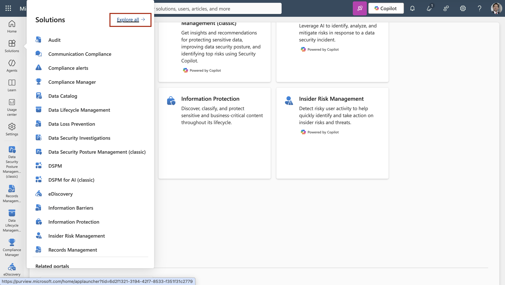

3. On the **DSPM and DSPM for AI unified in one solution** page, select **Get started**.

	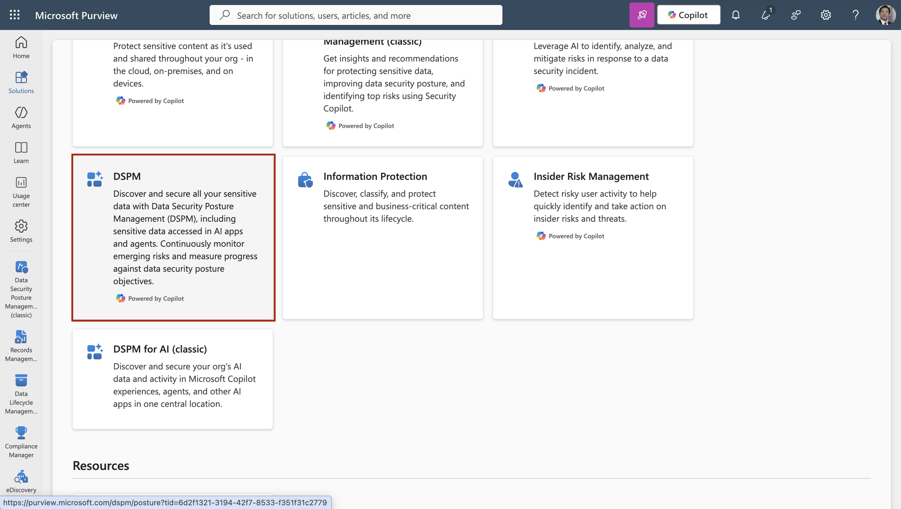

4. On the **Complete setup to unlock the unified DSPM experience** page, review the **Auditing and analytics** card. It confirms that Audit and Insider Risk Management analytics are already enabled (from Lab 0) and that DLP analytics will be enabled during setup.

	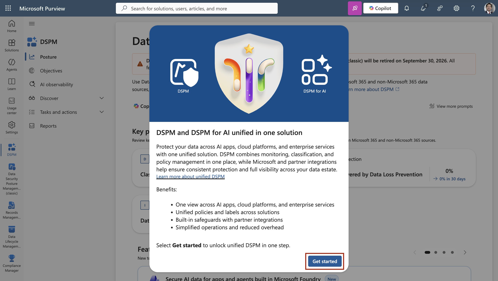

5. Select **Start setup**.

	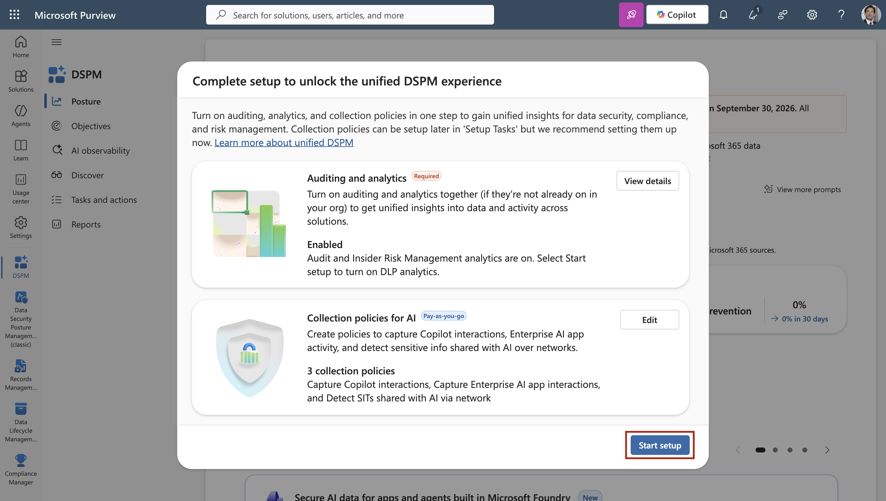

	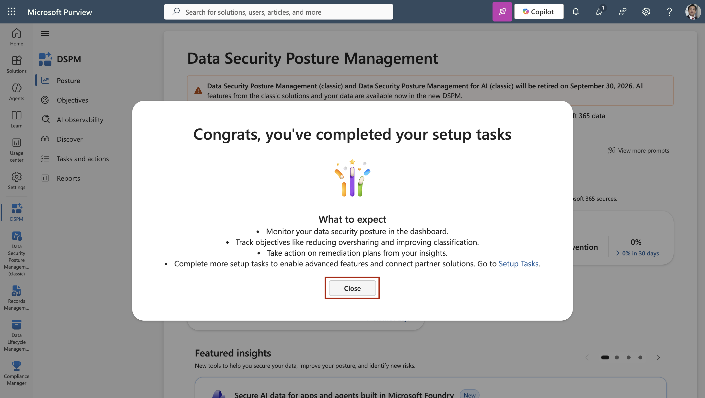

> [!NOTE]
> Selecting **Start setup** enables any required analytics that aren't already enabled and starts the initial DSPM scan. DSPM isn't a separate scanner — it builds on the controls you already configured (classification, labels, DLP, insider risk), consolidating their signals into one view. Because it scans the estate, insights populate over time rather than instantly; return after the scan completes to review results. This timing is indicative, not guaranteed.

You have successfully completed DSPM setup and started the initial scan.

## Task 2 – Work a data security objective

The defining feature of the new DSPM experience is its outcome-based objectives: instead of configuring tools one at a time, you choose a business outcome and DSPM guides you through the combination of Purview solutions and actions that achieve it. In this task, you'll open an objective and review its guided plan.

1. In **DSPM**, select **Objectives**.

	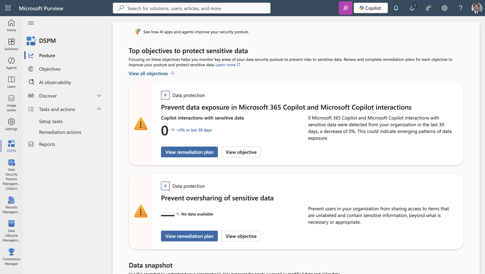

2. Review the data security objectives presented as outcome cards — for example **Prevent oversharing of sensitive data**, **Prevent exfiltration to risky locations**, **Prevent data exposure in Copilot interactions**, and **Discover sensitive data in your organization**.

3. Select any one objective.

	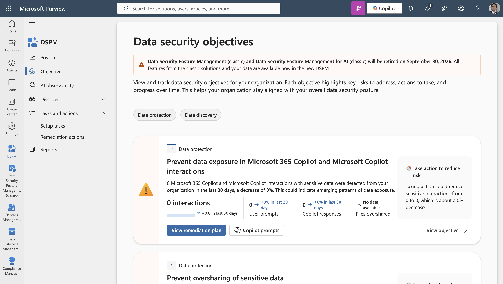

4. Review the objective's guided plan. It lays out the recommended steps to achieve the outcome, shows key metrics such as the share of data covered by policies, and lists prioritized actions you can apply directly. Note how the plan references the specific Purview solutions involved — labels, DLP, and insider risk — that you configured in earlier labs.

	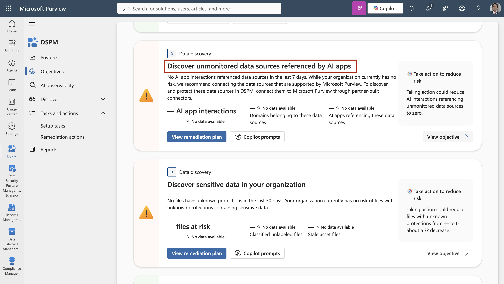

5. Review the actions the objective recommends. Where an action lets you create or strengthen a policy, it hands off to the owning Purview solution to complete the configuration (you create a policy this way in Task 6).

	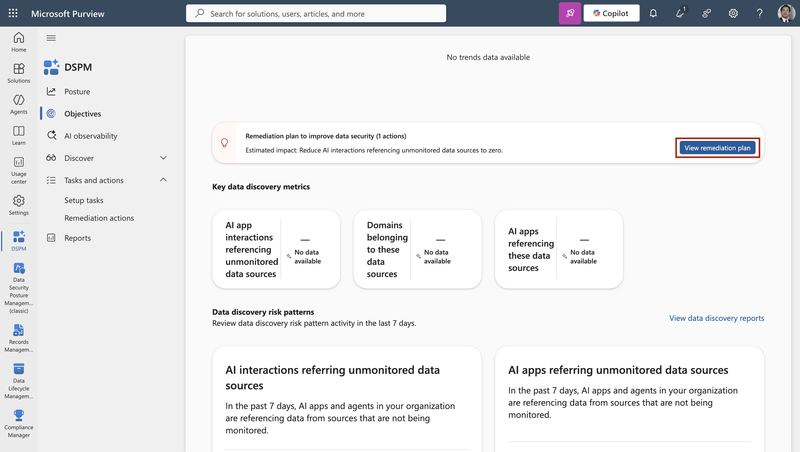

	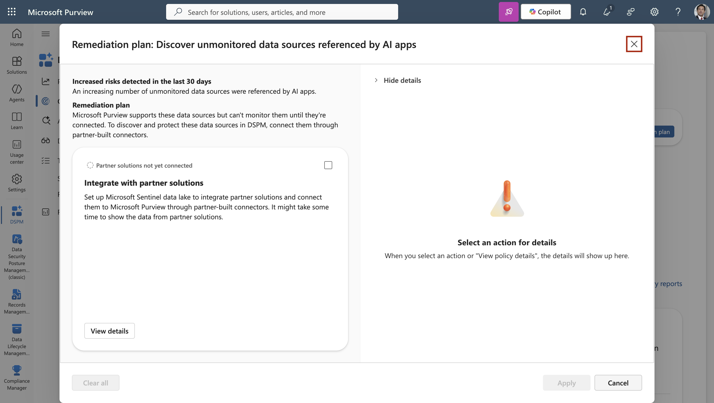

> [!NOTE]
> Objectives turn DSPM from a dashboard into a workflow — each one moves you from "here's a risk" to "here are the steps and policies to reduce it," with as few clicks as possible. Where an objective surfaces a **Security Copilot promptbook** (a guided set of Security Copilot prompts to investigate or act on the objective), you can review it — but Security Copilot in DSPM rolls out to E5 customers in phases, so if it isn't active in your tenant, review the objective's guidance without the Copilot prompts. This availability is indicative, not guaranteed.

You have successfully worked a data security objective.

## Task 3 – Run a data risk assessment for potential oversharing

Data risk assessments are DSPM's tool for finding where sensitive data is overshared — the primary readiness step before broad AI adoption, because an AI agent can surface anything a user can reach. In this task, you'll create an assessment for unlabeled content and review where its results and remediation appear.

1. In **DSPM**, select **Discover** > **Data risk assessments**.

2. Review the assessments. DSPM provides a **default assessment** that highlights oversharing across your most-used sites; you can also create a custom assessment. Select **+ Create custom assessment**.

	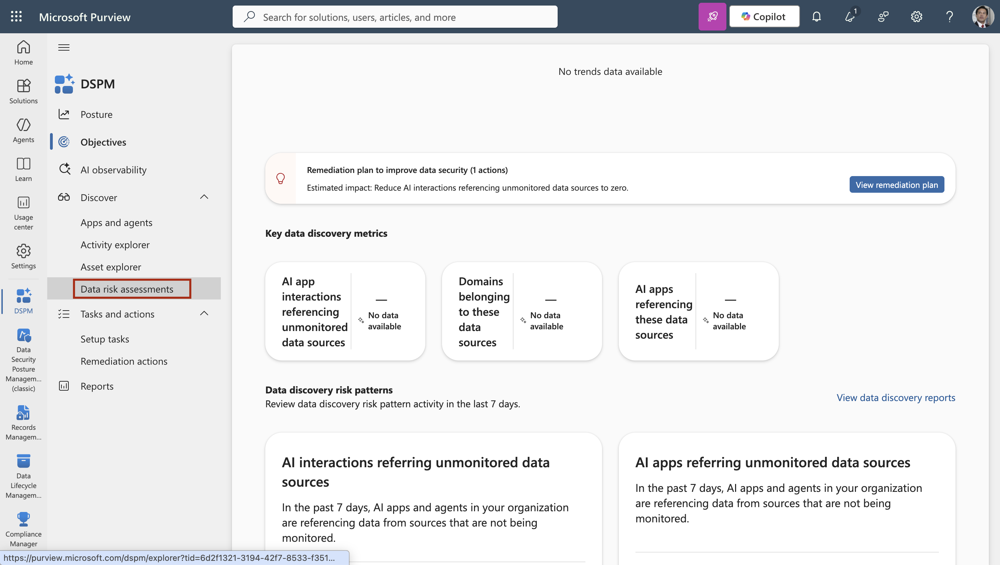

3. On the **Basic details** page, enter the following:

   - **Name**: `Unlabeled trial content assessment`
   - **Description**: `Identifies unlabeled SharePoint and OneDrive content that could be overshared and helps prioritize remediation of Contoso trial and research data.`

4. Select **Next**.
 
	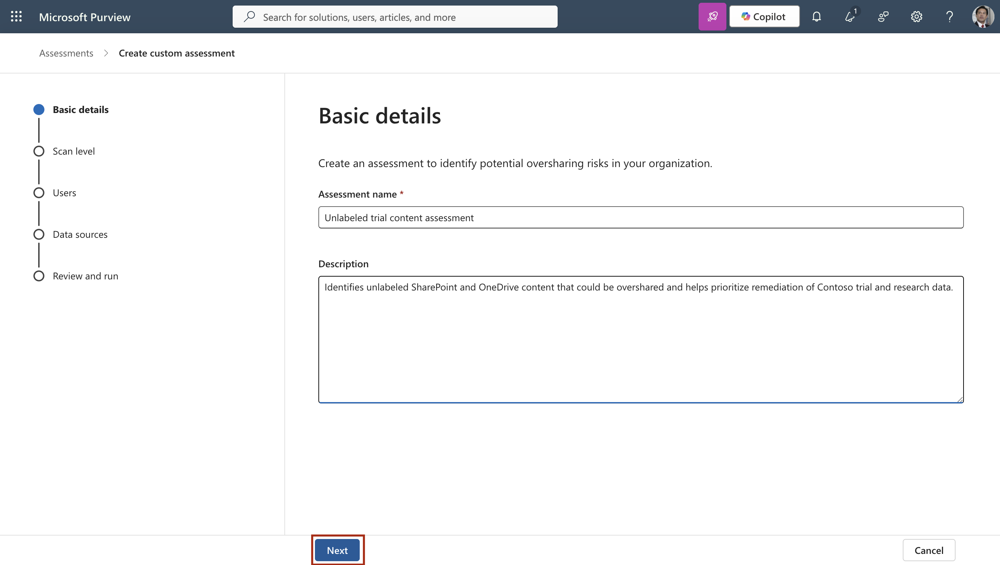

5. On the **Select scan level** page, leave **Source-level** selected, then select **Next**.

	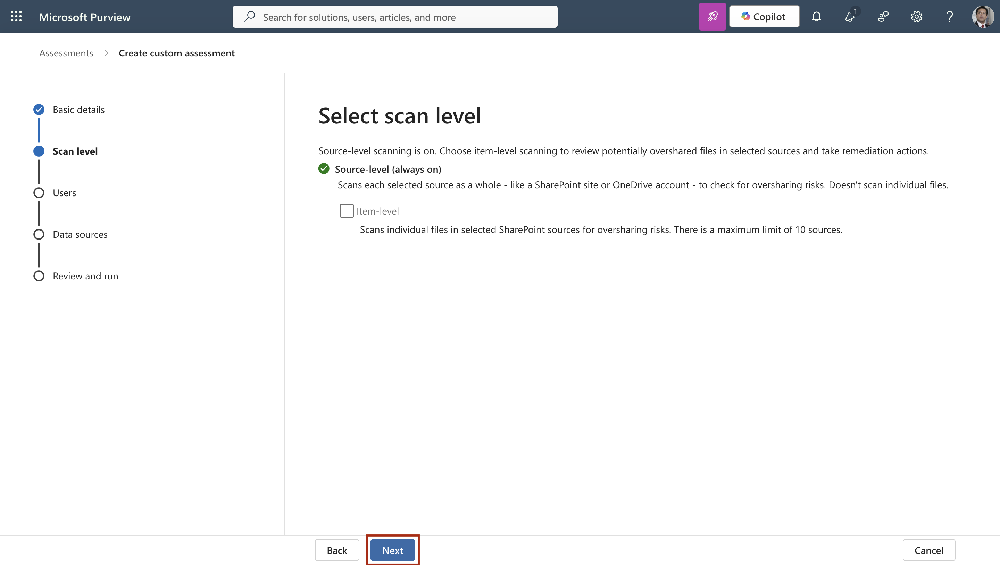

6. On the **Add users** page, select **All**, then select **Next**.

	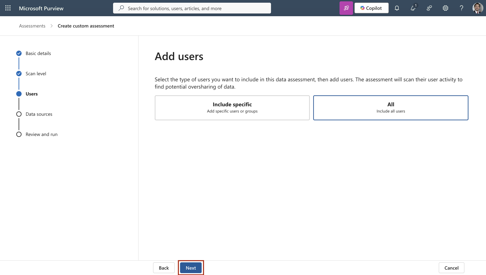

7. On the **Add data sources to assess** page, select **SharePoint** and **OneDrive**, then select **Next**.

	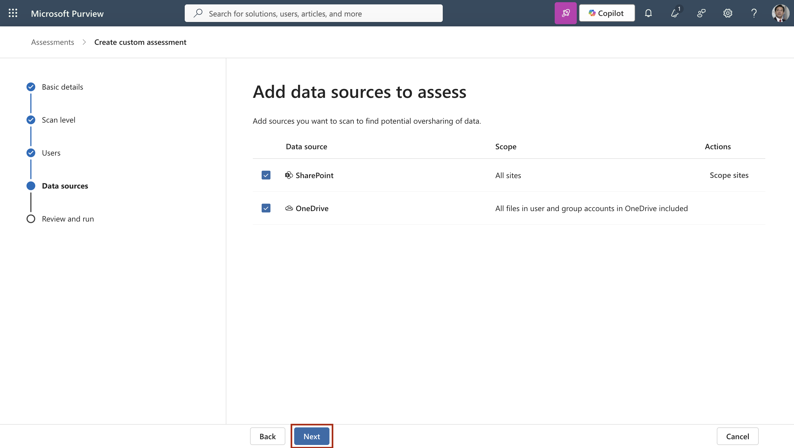

8. On the **Review and run the data assessment scan** page, review the scope, then select **Save and run**.

	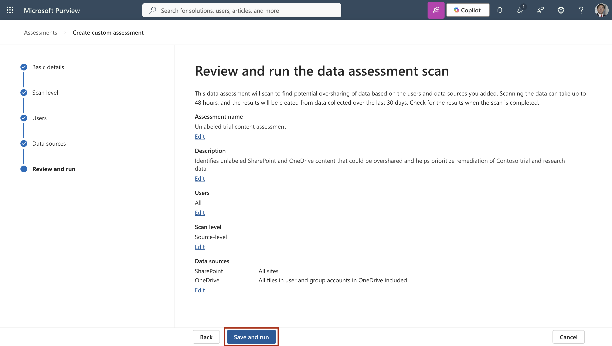

9. On the confirmation page, select **Done**.

	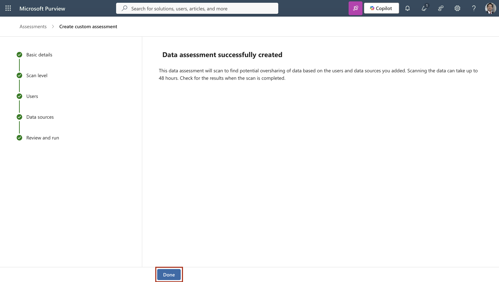

10. Back on the **Data risk assessments** page, select **Unlabeled trial content assessment** to review its status and scope. When the scan completes, the assessment shows the sensitive content found, where it's overshared, and who can access it — and provides item-level remediation actions such as applying a sensitivity label (for example `Restricted – Trial Data`), notifying the owner, and removing sharing links, including bulk-disabling overshared links.

> [!IMPORTANT]
> The assessment scan evaluates real content and is not instantaneous — it can take time to complete. Review the results after processing finishes to identify files that need labeling, access review, or other remediation. Item-level remediation — especially bulk-disabling overshared sharing links — is how a security team quickly reduces a large exposure before AI agents can surface it. This timing is indicative, not guaranteed.

You have successfully created a data risk assessment for potential oversharing.

## Task 4 – Review AI observability for apps and agents

This is DSPM's answer to Contoso's founding incident: visibility into how AI apps and agents interact with sensitive data. In this task, you'll review the apps and agents DSPM has discovered, using the Copilot Studio trial as the AI data source.

1. In **DSPM**, select **Discover** > **Apps and agents**.

	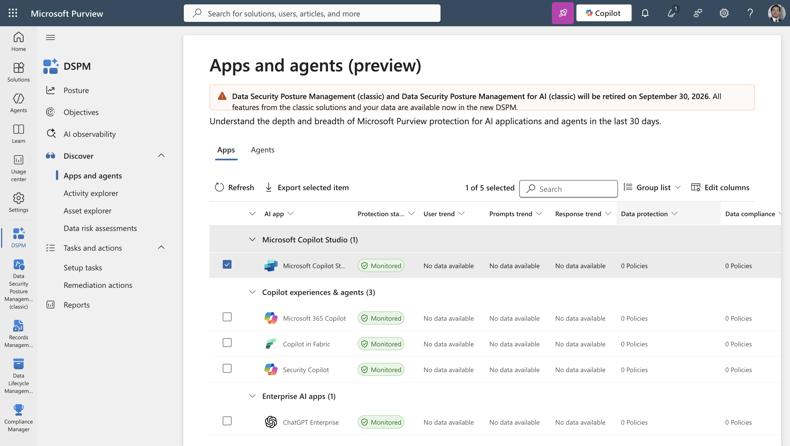

2. Review the dashboard of AI apps and their agents that have been used across the organization — for example Microsoft 365 Copilot and the agent published in your Copilot Studio trial. The dashboard shows the top most-recently-used agents.

3. Select an agent to open its details, and review the sensitive data it accessed and how it's protected by Microsoft Purview policies.

4. Select **Discover** > **Activity explorer**, then select the **AI activities** tab, to review AI interactions in detail — for example, prompts and responses that touched sensitive information types such as the compound or trial classifiers from Lab 2.

	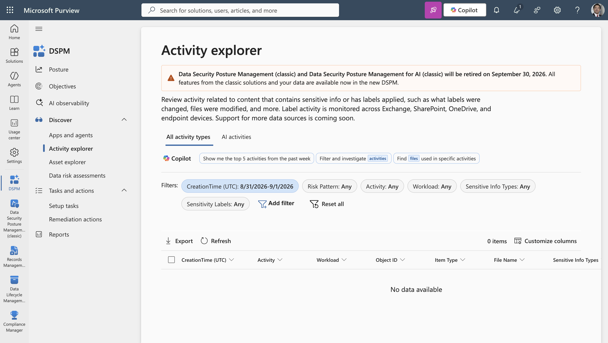

5. Relate this to Contoso's scenario: AI observability is what would have caught the founding incident — a compound identifier surfaced through an AI app, or pre-publication results reached via an overshared site — by showing the agent activity and flagging the risk.

> [!IMPORTANT]
> Monitoring **actual AI interactions** (prompts and responses) requires Copilot licensing — this lab relies on the Copilot Studio trial to generate real AI activity for DSPM to observe. Without an AI app producing interactions, the Apps-and-agents and AI-activities views have no interaction data to show. The **Apps and agents** dashboard doesn't include Agent 365; for those, use the **AI observability** page instead. Because AI agents operate within a user's permissions, the oversharing you remediate in Task 3 directly reduces what an agent can surface — data protection and AI protection are the same work. These behaviors depend on real AI activity and are not instantaneous. This timing is indicative, not guaranteed.

You have successfully reviewed AI observability for apps and agents.

## Task 5 – Review posture reports

DSPM's reports give leadership and the security team the tenant-wide picture. In this task, you'll review the posture reports that consolidate signals across the data-security program.

1. In **DSPM**, select **Reports**.

	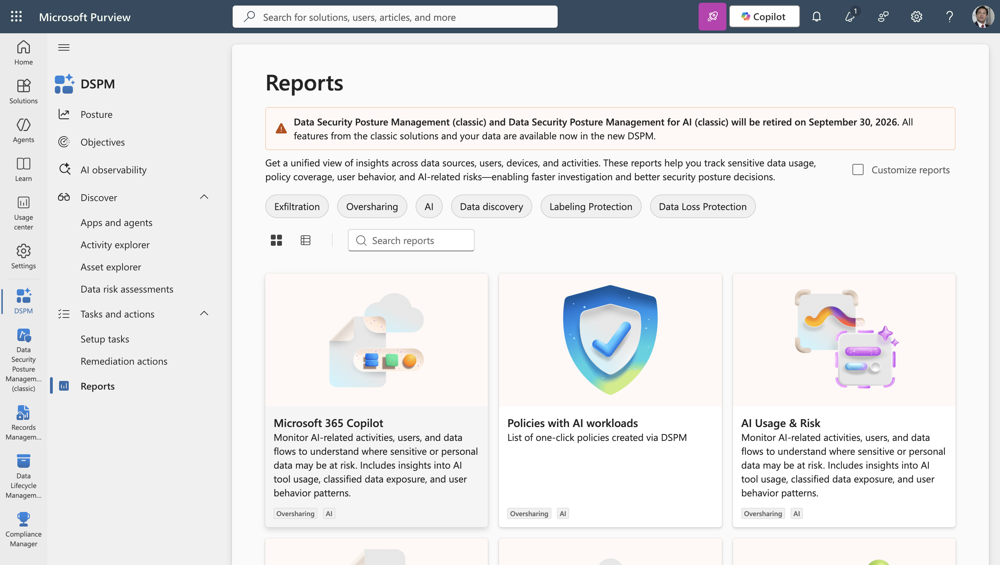

2. Review the available reports. DSPM provides a set of reports covering posture and policy activity — including:

   - The **Microsoft 365 Copilot** report — a focused view of Copilot's interaction with sensitive data.
   - **Policies with AI workloads** — the policies protecting AI interactions and their coverage.
   - Reports showing the results of one-click (remediation) policies, sensitivity-label coverage, DLP policy activity, and posture trends over time.

3. Open the **Microsoft 365 Copilot** report and review its visuals — for example, how much of the data Copilot can reach is labeled or protected, and where gaps remain.

	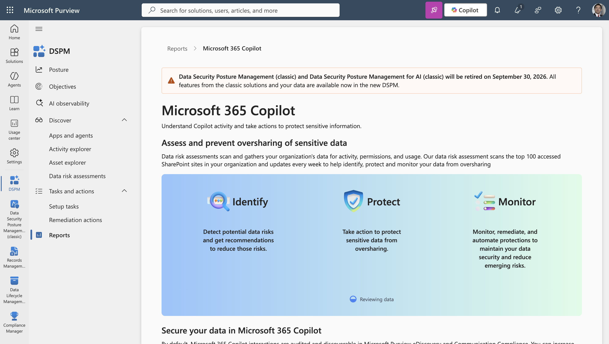

4. Use the filters and drilldowns in a report to pinpoint a specific gap — for example, unlabeled content that Copilot can access — which becomes a prioritized action for Contoso.

> [!NOTE]
> DSPM's reports draw on the classification, labeling, DLP, and insider-risk controls you configured across this course, so the work you already did is what populates these reports. Report data reflects activity across the tenant and is not instantaneous; reports fill in as scans and policy activity accumulate. This timing is indicative, not guaranteed.

You have successfully reviewed the DSPM posture reports.

## Task 6 – Create a remediation policy from DSPM

DSPM doesn't just show risk — it turns a recommendation into a working policy, owned and managed by the appropriate Purview solution. In this task, you'll create a policy from a remediation action and confirm the handoff.

1. In **DSPM**, select **Actions** (or **Tasks and actions**) > **Remediation actions**.

	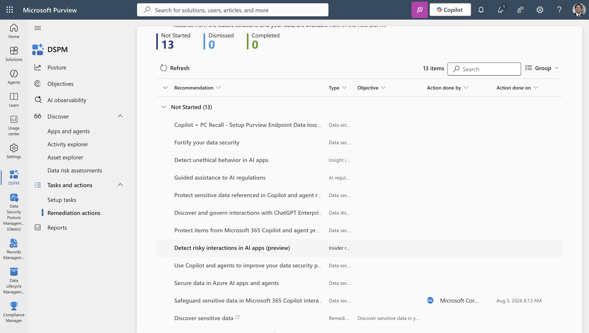

2. Review the recommended remediation actions. Select the recommendation for **Detect risky interactions in AI apps** (a policy that restricts high-risk users from pasting or uploading sensitive data into generative AI sites, using Adaptive Protection).

3. Review the recommendation summary.

4. You can review and complete the rest of the recommendations.

> [!IMPORTANT]
> DSPM creates the policy but the policy is owned and managed by the underlying Purview solution (DLP, Insider Risk Management, or Communication Compliance, depending on the recommendation). Some DSPM remediation policies — specifically those governing policy activity in non-Microsoft 365 Copilot, agents, and enterprise AI apps — require **pay-as-you-go billing** and a linked Azure subscription, and won't be created in a tenant that hasn't opted in. Create the recommendations that are available, and note which require pay-as-you-go for your environment. This availability is indicative, not guaranteed.

You have successfully created a remediation policy from DSPM.

## Summary

In this lab, you brought Contoso Pharmaceuticals' entire data-security program together in the new unified Data Security Posture Management experience. You completed DSPM setup to start the analytics scan, then worked an outcome-based objective — a guided workflow that turns a risk into a structured plan and prioritized actions. You ran a data risk assessment to find overshared content and reviewed its item-level remediation, the key readiness step before AI adoption. You used AI observability to review how AI apps and agents interact with Contoso's sensitive data — the visibility that addresses the incident that started the program — reviewed the posture reports that consolidate signals from DLP, Insider Risk Management, Information Protection, and Data Security Investigations, and created a remediation policy from a DSPM recommendation. DSPM is where classification, protection, insider risk, and AI governance become one continuously managed posture — letting Contoso adopt AI across its enterprise while keeping its most sensitive data secure.