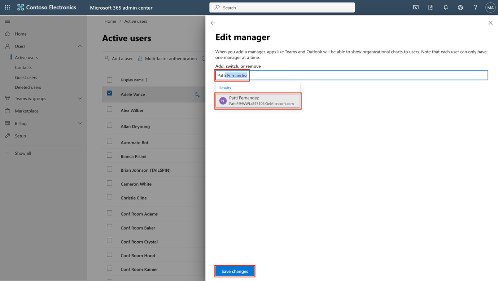
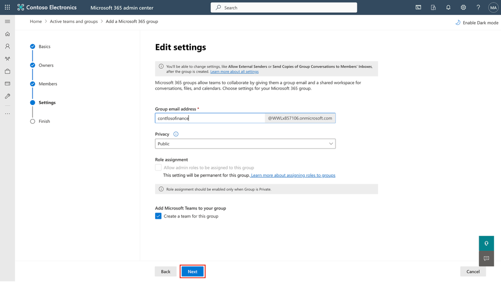
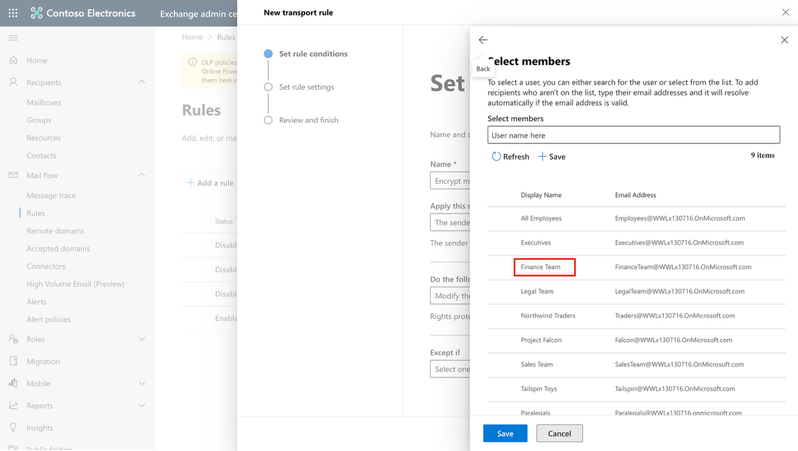
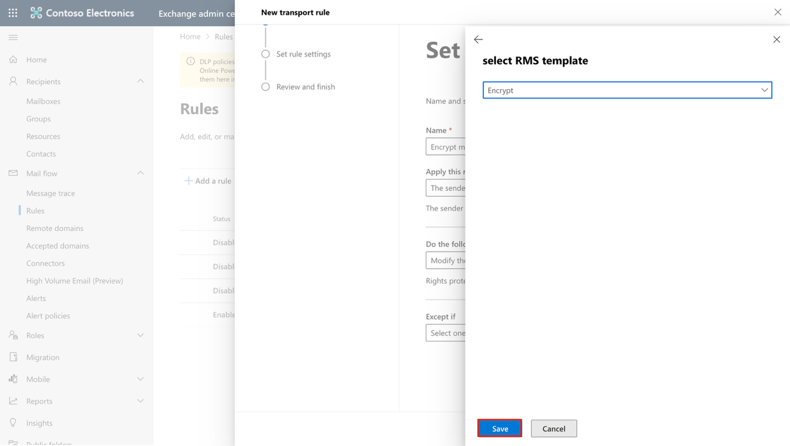
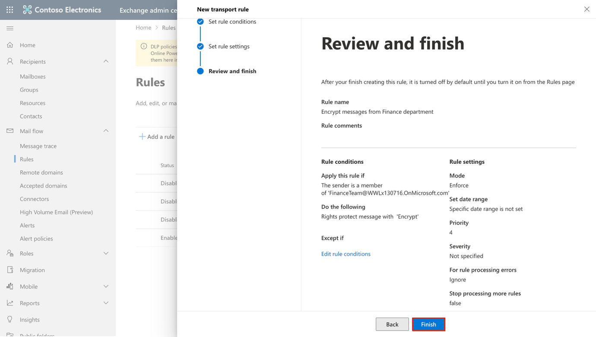
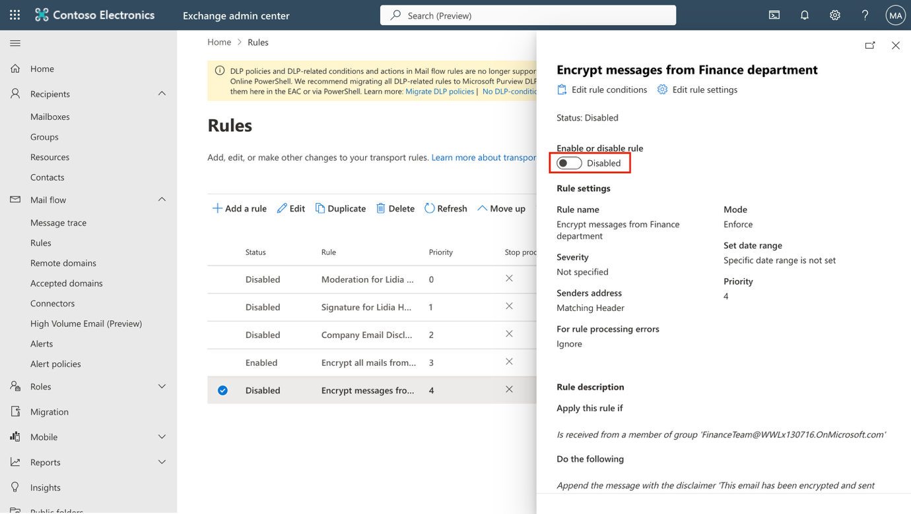
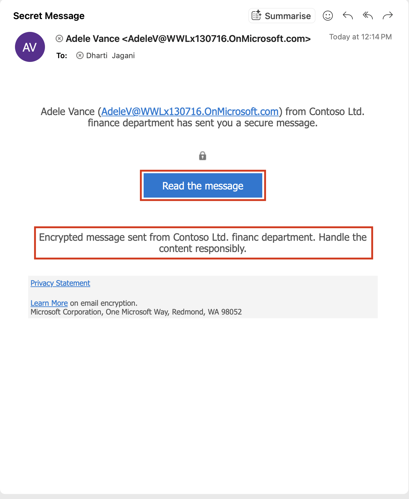

**Lab 1 – 分配合规角色和管理 Office 365消息加密**

**介绍:**

Microsoft Purview 门户支持直接管理在 Microsoft Purview 内执行任务的用户权限。通过门户设置中的角色和范围区域，您可以管理Purview数据安全、数据治理以及风险与合规解决方案中的权限。你可以限制用户只执行你明确授权的任务。

**目标:**

- 在 Microsoft 365 中为用户分配经理和合规角色。

- 创建Microsoft 365和安全组以促进团队协作。

- 启用Microsoft Purview合规评估的试用。

- 验证并配置 Azure RMS 用于 Office 365 消息加密。

- 修改默认的OME模板，禁用社交ID访问。

- 测试无社交登录的加密邮件投递。

- 为财务团队创建并应用定制的OME品牌模板。

- 制定邮件流规则来加密财务部门的邮件

- 在加密消息中添加免责声明

- 启用邮件流规则

- 验证消息加密

**练习 1 - 管理合规岗位**

在本次演练中，我们将激活所有实现Microsoft Purview安全所需的试用许可证。

**任务 1 – 向现有用户添加管理器角色。**

1.  用实验室提供的账户信息登录虚拟机。

2.  打开**Microsoft Edge**，进入Microsoft 365管理中心，https://admin.microsoft.com，并**使用管理员凭证**登录为MOD管理员。

> \[!Note\] **注释: 跳过 Microsoft 365 管理中心的多重身份验证**
>
> 在某些租户中，登录时你可能会看到门户多重身份验证（MFA）执行提示。如果出现这个提示:

- 选择 ** Skip for now** 以暂时延迟多重身份验证设置。

- 在 **Let us know why you're skipping MFA** 对话中, 选择任意对方，然后选择 **Send and skip**.

> 这推迟了租户在 Microsoft 365 管理中心的 MFA 执行，允许你继续实验室工作。

3.  从左侧窗格选择**Users** \> **Active users**, 点击第一个用户 **Adele Vance**.

> 
>
> 在 **Manager**下点击 **Edit manager**.
>
> 

4.  删除当前经理，在搜索框中输入Patti。精选 **Patti Fernandez**. 点击**Save Changes**.

> 

5.  将管理员更改为 **Patti Fernandez**，适用于以下所有用户。

    1.  Adele Vance

    2.  Christie Cline

    3.  Megan Bowen

6.  对于 **Patti Fernandez**，请将**MOD Administrator**加入为经理。

**任务 2 – 分配行政职务**

1.  选择用户 **Patti Fernandez**，在 **账户**下滚动到**角色**，点击**管理角色**。

> 

2.  **Roles** 面板打开后，点击**Admin center access** 附近的单选按钮，并展开**“Show all by category”。**

> 

3.  在 **Security & Compliance** 类别, 选择 的复选框 **Compliance Administrator**, **Security Administrator**, 和 **Application Administrator** 然后,在飞出面板底部选择 **Save changes** 。 点击 **Save changes**.

> 

4.  关闭窗格，保持在同一页面，继续下一个任务.

**任务 3 – 在 Microsoft 管理中心创建团队和组**

1.  现在扩展  **团队与组别**, 选择 **Active teams & groups ，在** **Teams & Microsoft 365 groups**下点击 **Add a Microsoft 365 group** 

> 

2.  在**Name** 字段, 输入 Contoso Finance Team, 在 **Description ** 字段中输入“This team handles finance”。然后点击**“Next**”。

> 

3.  在**Assign Owners** 页面, 点击 **Assign owners**, 在旁边勾选框 **Adele Vance**, 点击 **Add（1）** 。点击**“Next**”。

> 

4.  在“**Add members**”页面，添加**Adele Vance**和**Christie Cline**为成员，点击**“Next**”。在**“添加成员**”页面，选择 **“Next**”。

5.  用于群组电子邮件地址 contosofinance 然后点击 **“Next**”。

> 

6.  点击 **Create group**.

> 

7.  完成后，点击 **Close**.

> 

8.  在 **Active teams & groups page**, 选择 **Security groups** 标签页. 选择 **Add a security group.**

> . 

9.  重复这些步骤，用以下信息创建另一个组。

    - 在设置**基础**信息中，输入以下内容

> **名称**字段：EDM_DataUploaders。

- 在**描述**字段中输入 People who will upload data for EDM.

- 选择 **Next**.

- 在**设置**页面，选择**“下一步**”。

- 在**Review and finish adding group** 页面，检查你的设置并选择 **Create group**.

- 当 **New group created** 页面显示后，选择关闭按钮。

- 现在选择新创建的 **EDM_DataUploaders** 名单上的小组。

- 在 **“Members ”**标签下，选择 **“View all and manage owners” 和管理所有者**“，并添加 **Patti Fernandez** 和 **Christie Cline**。

- 

- 同样地，加加法 **Patti Fernandez** 和 **Christie Cline** 作为成员。

> 

**练习 2 – 管理 Office 365 消息加密**

**任务 1 – 制定邮件流规则来加密财务部门的邮件**

在此任务中，您将使用 Exchange 管理中心创建邮件流规则，将 Microsoft Purview 消息加密应用于财务团队成员发送的所有邮件。

1.  在 **Microsoft Edge**, 转到 https://admin.exchange.microsoft.com and sign in as PattiF@TenantName.

2.  在左侧导航面板中, 展开 **Mail flow**, 然后选择 **Rules**.

> 

3.  在 **Rules** 页面, 选择 **+ Add a rule** \> **Apply Office 365 Message Encryption and rights protection to messages**.

> 

4.  在 **Set rule conditions** 页面, 配置:

    - **名字:** Encrypt messages from Finance department

    - 在 **Apply this rule if** 部分, 配置:

      - 下拉选单 1: **The sender**

> 

5.  对于下拉菜单2：**is a member of this group**, 然后选择**Finance Team** 和 Select 会员**的储蓄**活动。

> 
>
> 
>
> 

- 在 **Do the following** 部分:

  - 保留默认选项**：modify the message security**，并**选择  Apply Office 365 Message Encryption and rights protection**

> 

- 在 “**Do the following 部分**下选择 ** Select one** 链接。

> 

- 在 **Select RMS template** flyout, 选择 **Encrypt**, 然后选择 **Save**.

> 

- 选择 **下一个**返回集合 ** Set rule conditions** 页面。

> 

5.  在“** Set rule settings**”页面，保持默认选项为选项，然后选择**“Next**”。

> 

6.  在 “** Review and finish **”页面，查看你的邮件流规则，然后选择 **Finish**。

> 

7.  创建邮件流规则后 **Done ** 完成。

> 

您已成功创建了一个邮件流规则，使用Microsoft Purview消息加密技术加密财务部门发送的邮件。这确保敏感的财务沟通在离开组织前得到保护。

**任务 2 – 在加密消息中添加免责声明**

接下来，你将修改现有的加密规则，添加免责声明。该免责声明作为一种简单的信息品牌化形式，通知收件人该信息由Contoso Ltd.安全发送。

1.  在 **Rules **页面，选择财务部门新创建**的 Encrypt messages from Finance department. **

> 

2.  在“ **Encrypt messages from Finance department**  **”**窗口中，选择 **Edit rule conditions. **。

> 

3.  选择**“ Do the following**”部分右侧的**+**键以添加另一个动作。

> 

4.  在新设立的**“And”部分** :

    - 下拉选单 1: **Apply a disclaimer to the message**

> 

- 下拉选单 2: **append a disclaimer**.

> 

- 在下拉菜单下，选择 **Enter text**.

> 

- 那就进去This email has been encrypted and sent securely by Contoso Ltd. 在 **specify disclaimer text** 中。

- 在飞出窗口底部选择 **Save** 。

> 

- 选择 “Select one” 链接以添加备用作。

- 在  **specify fallback action** 的跳板中，选择**“Wrap**”，然后在 **跳出页底部**选择 **Save** 。

> 

5.  在底部  **Encrypt messages from Finance department** flyout 选择**“Save **。

> 

6.  规则更改后，你会看到一条消息说 **Transport rule updated successfully. **。

> 

7.  通过选择 **Done**关闭飞出。

> 

你已经更新了加密规则，在每个受保护消息后附加了免责声明。这让收件人清楚知道邮件是加密的，并由Contoso有限公司安全传输。

**任务 3 – 启用邮件流规则**

默认情况下，新的邮件流规则是在禁用状态下创建的。在这项任务中，你将启用加密规则，以便开始保护来自财务部门的消息。

1.  在 **Rules **页面，选择**“Disabled **”以获取新创建**的 Encrypt messages from Finance department. **。

> 

2.  **在Encrypt messages from Finance department ，将 Enable or disable rule** 下的开关设置为**启用**。

> 

3.  邮件流规则会自动启用。您将看到一条消息，提示更新 **规则状态，请稍候......**。一旦规则启用，你会看到一条提示，说**规则状态已成功更新**。

> 

4.  关闭飞出时，选择 **右上角**的X。

> 

**注释**: 规则传播变更可能需要几分钟才能应用。如果验证失败，等待几分钟再发送测试。

加密规则现已生效，并对财务部门发送的消息执行Microsoft Purview消息加密。未来来自Finance用户的任何消息都将自动加密，并包含Contoso有限公司的免责声明。

**任务 4 – 验证消息加密**

在这项任务中，你将发送一封来自财务部门成员的测试邮件，以确认Microsoft Purview消息加密已自动应用，并且收件人是否看到了安全消息通知。

1.  通过任务栏右键点击 Microsoft Edge 并选择**新的 InPrivate 窗口**，在 InPrivate 窗口中打开 **Microsoft Edge**。

2.  导航至此 https://outlook.office.com 并登录Outlook网页版，作为 AdeleV@TenantName.

3.  在**Stay signed in?** 窗口中，选择“ **Don't show this again“ 的复选框** ，然后选择**“不**”。

4.  在网页版的Outlook中，选择 **New mail**.

> 

5.  在**“收件人**”栏输入你个人或其他不在租户域名中的第三方邮箱地址. 在主题栏输入“Secret Message ”和“ My super-secret message”。 在邮件正文中。

6.  选择 **Send** 发送消息。保持Outlook窗口开着。

> 
>
> 在新窗口登录您的个人邮箱，打开阿黛尔·万斯的消息。如果你把消息发到Microsoft账号（比如@outlook.com），邮件可能会自动打开。如果你把邮件发到其他邮箱服务，比如（@gmail.com），你可能需要执行下一步来处理加密并阅读邮件。

7.  选择 **Read the message**.

> 

8.  选择 **Sign in with a One-time passcode** 以接收限时密码。

9.  进入你的个人邮箱，打开邮件，主题为 **“Your one-time passcode to view the message 。**

10. 复制密码，粘贴到门户，然后选择 **Continue**。

11. 审查加密消息。您应该会看到 “**This email has been encrypted and sent securely by Contoso Ltd。”邮件**底部留言。

您已成功验证财务部门的消息自动加密，并附带Contoso免责声明，确认Microsoft Purview消息加密功能正常运行。

**总结:**

在这个实验室里，我们成功复制了一个管理中心的组织，分配了合适的许可证，并学习如何使用 Microsoft 365 内置的 Office 365 消息加密（OME）。
