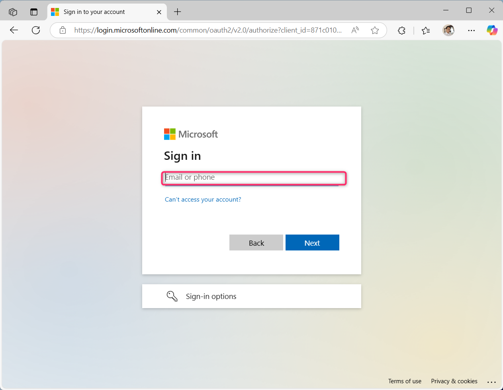
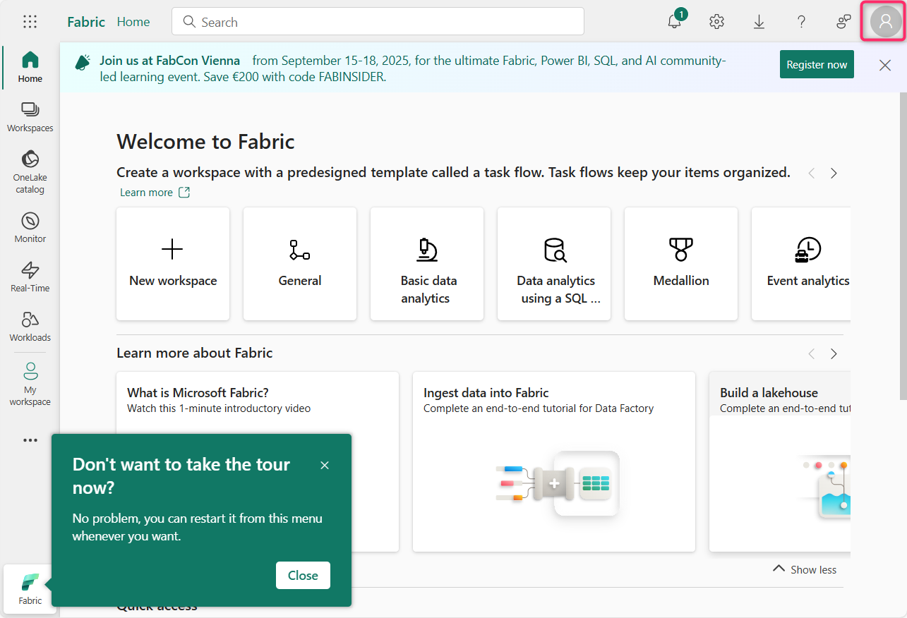
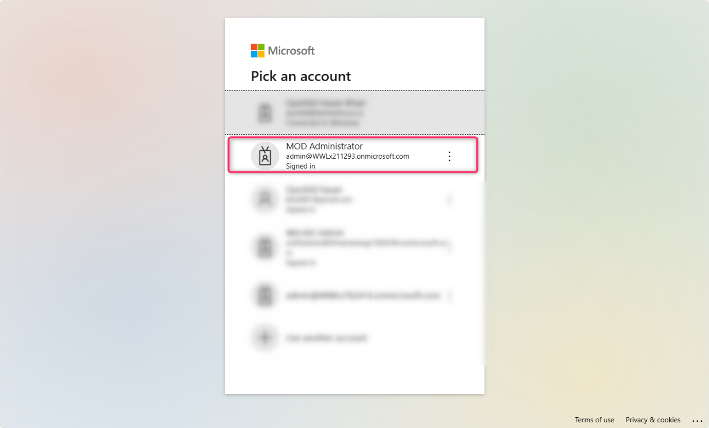
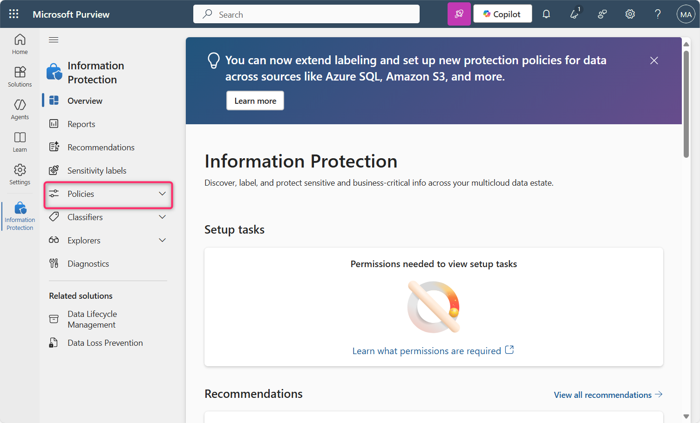
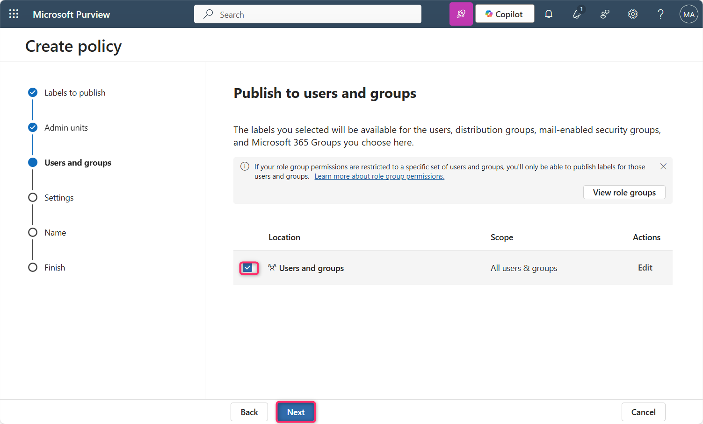
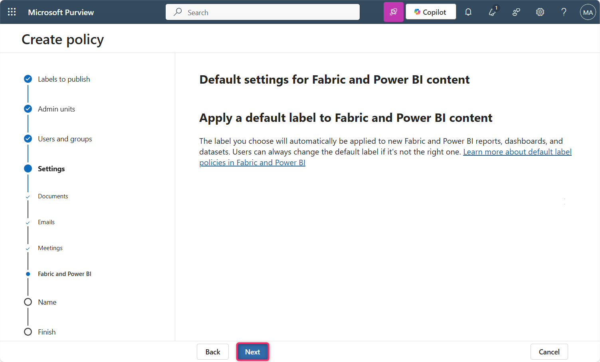
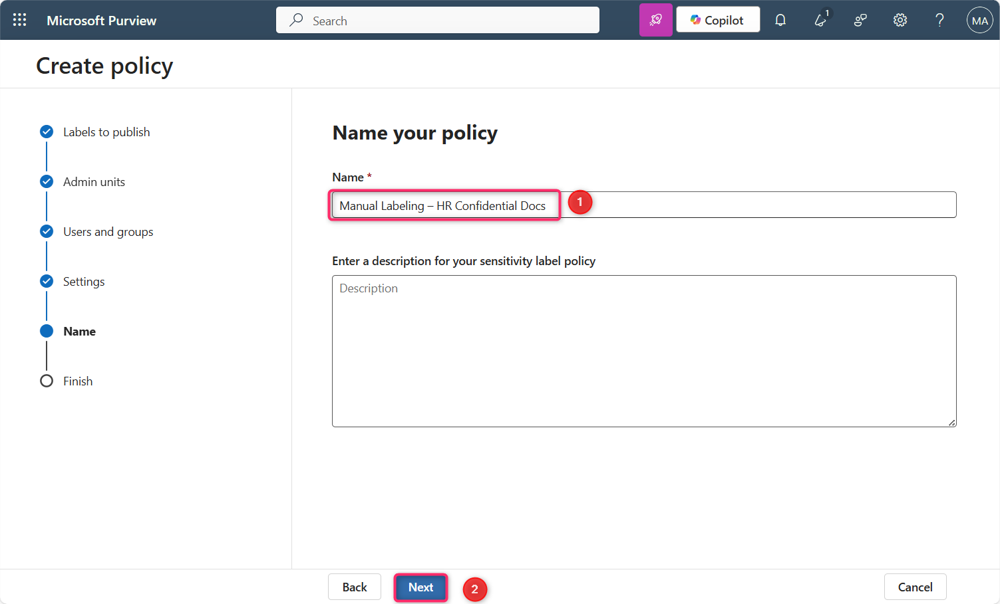
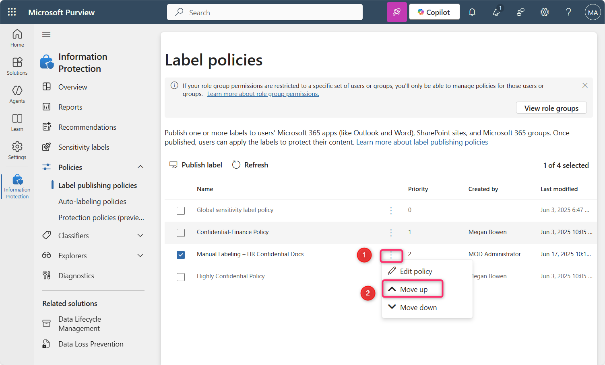

**实验室 10 – 使用 Microsoft Purview 在 Fabric 和 Power BI 中强制执行敏感性标签**

**介绍**

租户必须启用 Microsoft Purview 信息保护（Fabric 和 Power BI，包括 Power BI Desktop）中的敏感标签。启用敏感性标签时：

- 组织内指定的用户和安全组可以对其 Fabric 内容应用敏感性标签。在Fabric服务中，这意味着任何Fabric商品。在Power BI Desktop中，指的是他们的.pbix文件。

- 在仪式中，所有组织成员都能看到这些标签。在桌面版中，只有组织中被发布标签的成员才能看到标签。

**目标**

1.  在 Microsoft Fabric 中使用 Microsoft Purview 启用并优先设置手动敏感性标签策略。

**练习 1 – 激活 Microsoft Fabric 试用并访问 Purview Hub**

1.  打开Edge浏览器地址栏，输入以下URL即可打开Fabric门户 - https://app.fabric.microsoft.com

**注释**: 如果你直接进入织物传送门，那就跳过步骤#2和3.

2.  输入您的租户凭证.

3.  在密码字段输入租户密码。然后，点击**登录**按钮。

4.  在**“欢迎进入织物视图**”对话框中，点击**取消**按钮。

5.  点击命令栏上的个人资料图标.

6.  点击**并点击  Free trial** 按钮.

7.  在“**激活你的60天免费Fabric试用容量**”中，在**试用容量区域**中确保**选择了默认-西美国3**地区，然后点击**激活**按钮。

8.  在**成功升级到免费的 Microsoft Fabric 试用**对话框后，点击**“已获取”**按钮。

9.  点击 命令栏中的设置齿轮框。

10. 进入治理与洞察部分，点击 **Microsoft Purview 中心（预览）**链接。然后，在 **Microsoft Purview 中心（预览）**页面，点击**并点击信息保护**瓷砖。

11. 如果**出现“选择账户**”对话框，然后选择租户ID.

12. 在**新的 Microsoft Purview 门户对话框中的“欢迎使用信息保护”**中，点击**“开始**”按钮。

**练习 2 – 为Fabric和Power BI创建并配置敏感标签策略**

1.  在信息保护栏目中，点击“政策”旁的下拉菜单。

2.  然后，点击**标签发布政策**。在**标签发布政策**页面，点击“**发布标签**”。

3.  在**创建政策**页面，点击**选择敏感标签以发布**链接。

4.  **Sensitivity label to publish** 出现在右侧，导航并选择“机密”旁边的复选框，然后点击**“添加**”按钮。

5.  现在，点击**“下一**页”按钮。

6.  在**“分配管理单元**”页面，点击**“下一步**”按钮。

7.  在**“发布给用户和组”页面，确保选中**了“用户和组**”旁的复选框** ，然后点击**“下一**页”按钮。

8.  在**策略设置**页面，选择**“要求用户为其 Fabric 和 Power BI 内容应用标签”旁的复选框**。然后，点击**“下一步**”按钮。

9.  关于**文档默认设置——为文档页面应用默认标签**，点击**“下一步**”按钮。

10. 在**文档默认设置中——给邮件页面应用默认标签**，点击**“下一步**”按钮。

11. 在**会议和日历活动的默认设置**页面，点击**“下一步**”按钮。

12. 在**Fabric和Power BI内容页面的默认设置**中，点击**“下一步**”按钮。

13. 在**“命名你的保单**”页面，在**“姓名**”栏下输入“手动标签——人力资源保密文档。然后，点击**“下一步**”按钮。

14. 在**审核与完成**页面，点击**提交**按钮。

15. 该政策成功制定。现在，点击**“完成**”按钮。

16. 在**标签政策**页面，您将看到**手动标签——人力资源保密文件**政策已成功创建。

17. 选择**“手动标签——人力资源保密文档**”，然后点击水平省略号，导航并选择**“向上移动**”以更改优先级。

18. 同样，选择**“手动标签——人力资源保密文档**”，然后点击旁边的横向省略号，选择**“向上移动**”。

19. 您会注意到**，手动标签——人力资源机密文件的**优先级现在改为1。

**总结**

在这个实验室里，你激活了 Microsoft Fabric 试用，访问了 Microsoft Purview 门户，并创建了强制性的敏感性标签策略，要求用户对 Fabric 和 Power BI 内容应用“机密”标签。该政策随后被优先执行。
