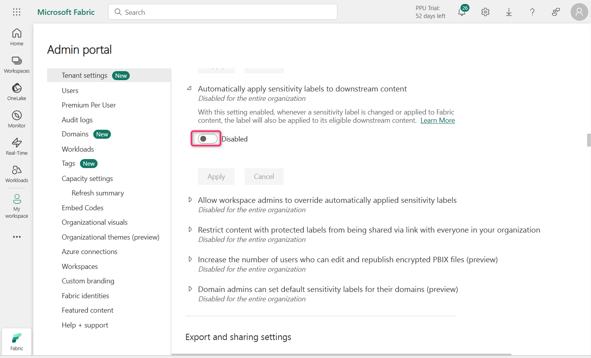
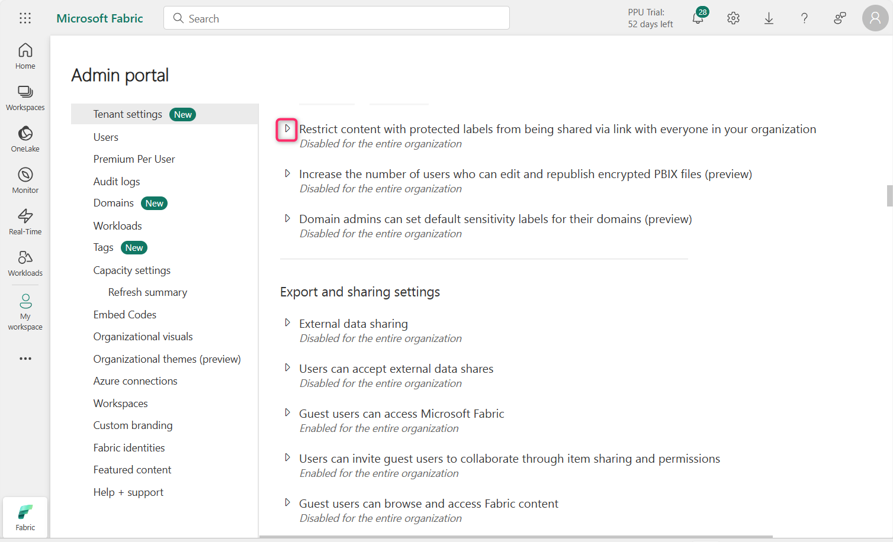
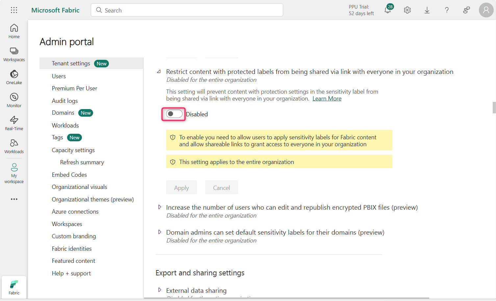
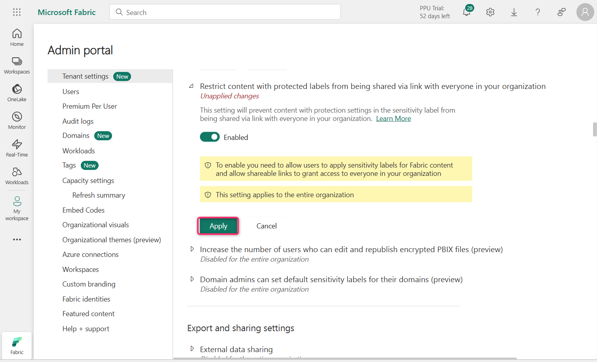
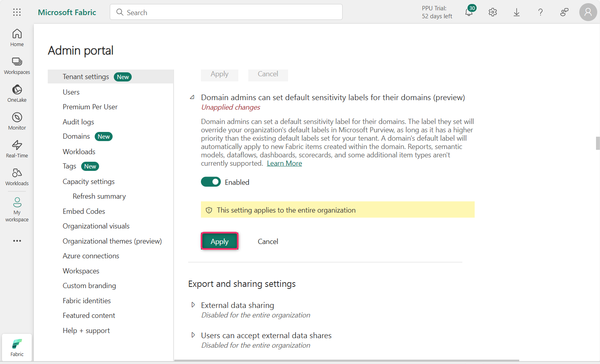

**实验室 11 – 在 Fabric 中配置信息保护策略​**

**介绍**

信息保护租户设置帮助您保护Power BI租户中的敏感信息。允许并应用敏感性标签确保信息仅被适当用户看到和访问. 

**目标**

- 通过管理门户启用 Microsoft Fabric 中的信息保护功能，为敏感性标签强制执行做准备.

**练习 1 – 在 Fabric 管理门户中配置信息保护设置**

1.  在 Fabric 门户主页，点击 命令栏中的设置图标，然后进入**治理与洞察**部分，点击**管理员门户**链接。

> 

2.  在管理员门户——租户设置中，向下滚动至**信息保护**部分。

> 

3.  点击“允许用户为内容应用敏感标签**”旁边的播放按钮。**

> 

4.  点击开关按钮即可启用。启用此设置后，指定用户可以应用 Microsoft Purview 信息保护中的敏感标签。

> 

5.  现在，点击**“应用”**按钮。

> 

6.  **注意**：如果 应用按钮未被高亮，请选择**特定安全组**单选按钮，再返回“**整个组织”**单选按钮。

7.  您将收到通知，内容为——**租户设置将在接下来的15分钟内应用**。

> 

8.  **Apply sensitivity labels from data sources to their data in Power BI**”**旁边的播放图标**

> 

9.  点击开关按钮即可启用。

> 

10. 启用该设置后，连接支持数据源敏感性标记数据的 Power BI 语义模型可以继承这些标签，确保数据在导入 Power BI 时保持机密和安全。

> 点击**“申请**”按钮。
>
> 

11. 您将收到通知，内容为—— **Tenant settings will be applied within the next 15 minutes.。**

> 

12. 点击旁边的播放图标**，Automatically apply sensitivity labels to downstream content**

> 

13. 点击开关按钮即可启用。

> 

14. 启用此设置后，每当你更改敏感标签或应用到Fabric内容时，该标签也会应用到其符合条件的下游内容上。

> 点击**“申请**”按钮。
>
> 

15. 您将收到通知，内容为——租户设置将在接下来的15分钟内应用。

> 

16. 点击旁边的播放图标 - **允许工作区管理员覆盖自动应用的敏感标签**

> 

17. 点击开关按钮即可启用。

> 

18. 该设置使工作区管理员能够覆盖自动应用的敏感标签，而无需考虑标签更改强制规则。

> 点击**“申请**”按钮
>
> 

19. 您将收到通知，内容为——租户设置将在15分钟内应用。

> 

20. 点击“播放”图标，**Restrict content with protected labels from being shared via link with everyone in your organization**

21. 

22. 点击开关按钮即可启用。

> 

23. 启用此设置后，用户无法为组织内的人员生成带有敏感性标签保护内容的共享链接。

> 点击**“ Apply**”按钮
>
> 

24. 您将收到通知，内容为——租户设置将在15分钟内应用。

> 

25. 点击域名旁的播放图标**，Domain admins can set default sensitivity labels for their domains (preview)**

<!-- -->

1.  

<!-- -->

26. 点击开关按钮即可启用。

> 

27. 点击**“申请**”按钮。

> 

28. 您将收到通知，内容为——租户设置将在15分钟内应用。

> 

**总结**

在本实验室中，您启用了Microsoft Fabric管理门户中的多种信息保护设置，支持敏感标签应用、继承、自动标签和管理员覆盖。
