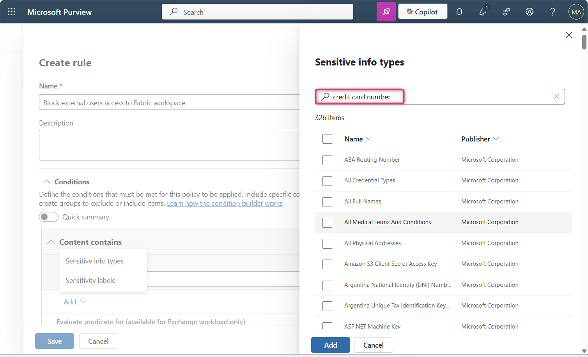
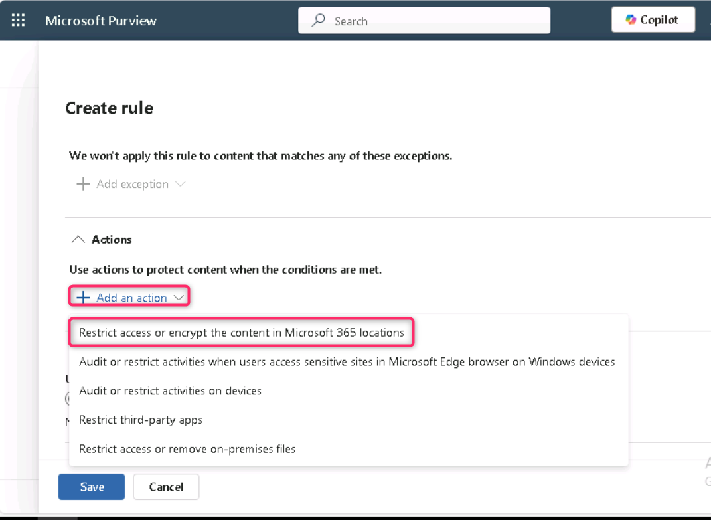
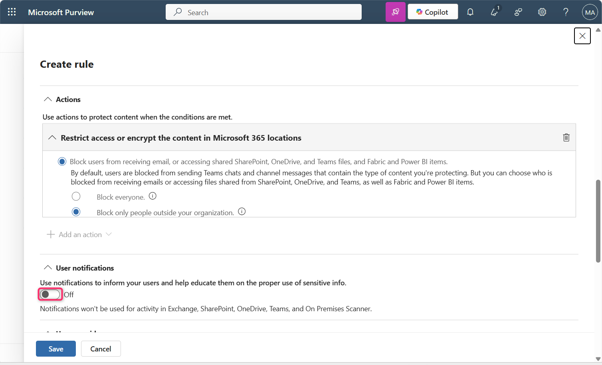
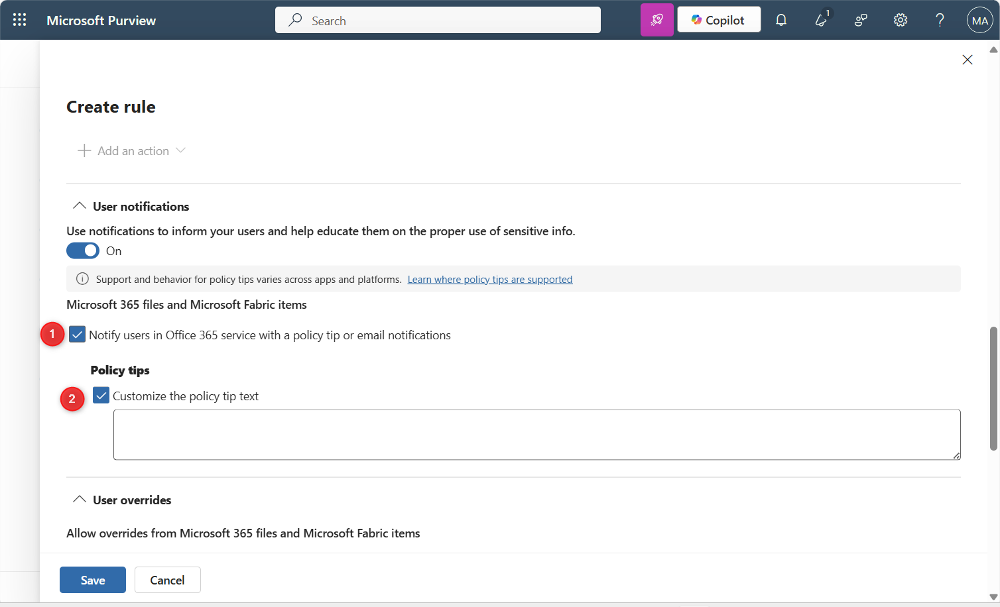

**Lab 12 – 创建一个 DLP 策略，阻止外部用户访问 Fabric 工作区**

**介绍**

我们需要阻止外部用户报告包含信用卡号码，除非数据标有“高度机密-内部”敏感性标签，在这种情况下，保护策略会限制对特定安全组的访问。我们希望通知合规管理员，以便在语义模型被阻挡时知晓，并让数据所有者知道该限制发生。我们还希望内部用户知道这些数据高度机密，不应在组织外部分享。

| **命题** | **配置问题已解答及配置映射** |
|----|----|
| "我们需要屏蔽外部用户......” | 监控地点：**Fabric 和 Power BI** 管理范围：**完整目录**。作：**限制访问或加密Microsoft 365个地点的内容 \> 阻止用户接收邮件或访问共享的SharePoint、OneDrive和Teams文件，以及Power BI项目 \>仅屏蔽组织外人员** |
| "...来自包含信用卡号码的报告......” | 需要监控的事项：使用**自定义模板**。匹配条件：编辑以添加信用卡号码敏感信息类型。 |
| "...除非数据标注为高度机密-内部敏感性标签......” | 条件组配置：创建一个嵌套的布尔NOT 条件组，使用布尔和条件匹配，并与第一个条件连接：编辑以添加高度机密 - 内部敏感性标签. |
| "我们希望通知合规管理员，以便在语义模型被阻挡时得知。.." | 事件报告：**规则匹配发生时向管理员发送警报：开**启。每当活动符合规则时发送警报：**已选中** |
| "...数据所有者应知晓该限制已发生。我们还希望内部用户知道这些数据高度机密，不应在组织外部分享。” | 用户通知：**开启**。Microsoft 365 文件和 Microsoft Fabric 项目：通过策略提示通知 Office 365 服务中的用户，或邮件通知：**已选中**。政策提示：自定义政策提示文本：已选中。在文本框中添加说明高度机密数据共享规则的文字。 |

**重要**

在此策略创建过程中，你将接受默认的包含/排除值，并关闭该策略。你部署策略时会更改这些。

**目标**

1.  在 Microsoft Purview 中创建自定义的数据丢失防护（DLP）策略，阻止外部用户访问包含敏感信息的 Fabric 和 Power BI 内容。

**练习1 ：创建自定义 DLP 策略以阻止外部访问 Fabric 工作区**

1.  在 Microsoft Purview 门户中，点击**“解决方案**”，然后导航并点击**“数据丢失防止”**

> 

2.  现在，点击**“政策**”。

> 

3.  在政策 页面，点击 **+ 创建政策**.

> 

4.  从 **What info do you want to protect?** 窗口, 选择 **Enterprise applications and devices**.

> 

5.  在 **Choose what type of data to protect** 页面时，确保**选择“存储在连接来源中的数据**”单选按钮，然后点击**“下一步**”按钮。

> 

6.  在 S**tart with a template or create a custom policy**页面”中，点击“**自定义**”类别“。

从**法规列表中**选择**自定义政策**，然后点击**“下一步**”按钮.

\

5.  在“**命名你的DLP策略**”页面的**名称**字段中，确保提及**自定义策略**。

> **注意**：您可以在此处使用政策意图声明。保单不能改名。
>
> 点击**“下一个**”按钮。
>
> 

6.  在**“分配管理单元**”页面，点击**“下一个**”按钮。

> 

7.  在 ** Choose where to apply the policy**的地点页面，点击**“下一步**”按钮。

> 

8.  在**“定义策略设置**”页面，确保**选择“创建或自定义高级DLP规则**”单选按钮。然后，点击**“下一步**”按钮。

> 

9.  在**“自定义高级DLP规则**”页面，选择**+创建规则**。

> 

10. 在**创建规则**页面的**名称**字段中输入 **+++Block external users access to Fabric workspace+++**.

<!-- -->

1.  

<!-- -->

11. 在**“条件**”部分，选择 **Add condition** \> **Content contains** \> **Add** \> **Sensitive info types**.

> 
>
> 

12. 在**右侧的敏感信息类型**面板中，点击搜索栏内，输入**+++credit card number+++** 按下回车键.

> 
>
> 

13. 选择信用卡号**旁的复选框**，然后点击**添加**按钮。

> 

14. 在**作中**，选择**添加 Add an action** \> **Restrict access or encrypt the content in Microsoft 365 locations**

<!-- -->

1.  

<!-- -->

15. 确保**选择了屏蔽用户接收邮件或访问共享的SharePoint、OneDrive和Teams文件，以及Power BI项目**，并**仅屏蔽组织外人员**。

> 

16. 在**用户通知里**，把开关设为**开启**。

> 
>
> 

17. 选择**在Office 365服务中通过策略提示或电子邮件通知的选项框通知用户**，并**选择自定义策略提示文本框。**

> 

18. 在**用户覆盖**部分，选择**“允许用户在 Fabric（包括 Power BI）、Exchange、SharePoint、OneDrive 和 Teams 中覆盖政策限制”的复选框，然后选择“自动覆盖规则”**旁的复选框**，**如果他们报告为误报。

> 

19. 在**事件报告中**，将**管理员警报和报告中的“使用此严重程度级别”**设置为**“高**”。

> 
>
> 

20. 确保**“规则匹配发生时向管理员发送警报”开关**设置为**开启**。

21. 确保**每次活动符合规则**的单选按钮时都会触发发送提醒。

> 

22. 点击**保存**按钮。

> 

23. 查看规则后，点击**“下一**页”按钮。

> 

24. 确保**勾选“在仿真模式下运行策略”**单选按钮和**“在仿真模式下显示策略提示**”复选框。然后，点击**“下一步**”按钮。

> 

25. 在**“审核与完成**”页面，点击**提交**按钮。几秒钟后，策略将成功创建。

> 
>
> 

**重要提示**：

由于本实验室环境的许可限制，您可能会遇到以下错误。

该实验室采用 Power BI Pro 许可证运行，不支持 Microsoft Purview DLP 集成，适用于 Fabric 或 Premium 工作区。因此，像“屏蔽外部用户”这样的DLP策略作无法正确定位，向导会因以下错误失败：

要仅屏蔽组织外的人，必须选择“内容与组织外的人共享”的条件。

在现实世界的企业环境中，如果租户已经满足，这个问题就不会发生:

1.  Power BI 按用户高级许可（PPU）

2.  或是 Microsoft Fabric 容量（F64+）

这些许可允许与 Microsoft Fabric 和 Power BI 完全集成 DLP 策略，包括支持阻断动作和适当的条件范围。

**总结**

在本实验室中，你在 Microsoft Purview 中创建了自定义的 DLP 策略，通过检测敏感数据并施加限制以阻止外部用户访问来保护 Fabric 和 Power BI 内容。该策略还支持用户通知和管理员提醒。
