**实验室 13 – 实施和管理留任**

您是Patti Fernandez，Contoso有限公司的合规管理员。公司正在加强数据安全策略，以减少与金融数据和特权通信相关的风险暴露。您被要求配置支持审计准备、限制不必要的数据保留，并确保敏感通信的合理监管的Microsoft Purview保留解决方案。

**任务**:

1.  创建一个保留标签

2.  发布保留标签

3.  创建自动应用保留标签策略

4.  创建静态保留策略

5.  恢复 SharePoint 内容

**练习 1 – 创建一个保留标签**

在这项任务中，你将为需要保留以便审计和调查目的的敏感财务数据创建保留标签。

1.  以管理员身份登录虚拟机.

2.  在 Microsoft Edge 中，导航到 https://purview.microsoft.com 并登录为 pattif@TenantName.

3.  导航至此**Solutions** \> **Data Lifecycle Management**.

> 

4.  然后选择**保留标签**。

> 

5.  在**标签**页面，选择**创建标签**。

> 

6.  在“**命名你的保留标签**”页面，输入:

    - **Name**: Sensitive Financial Records

    - **Description for users**: Use for financial files with sensitive data that must be retained for audit or security purposes.

    - **Description for admins**: Retains high-impact financial data for 5 years to support audits and security investigations.

7.  选择 **Next**.

> 

8.  在**定义标签设置**页面，选择**“永久保留物品”或“特定期限**”，然后选择**“下一步**”。

> 

9.  在**“定义期间**”页面，确保这些值已为保留期配置输入设置:

    - **月段有多长?**: 5 Years

> 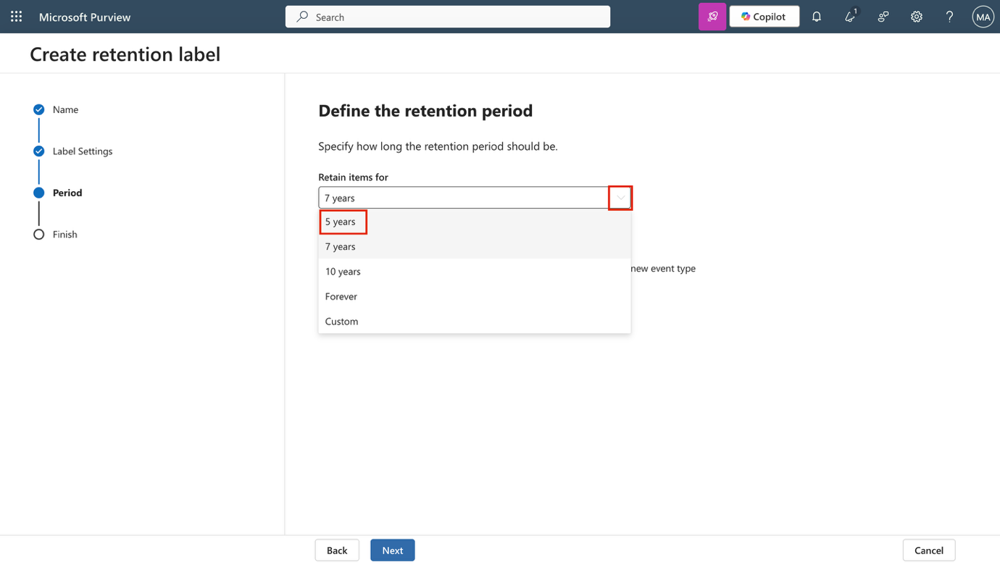

10. **该期何时开始?**: 物品被修改时

> 

11. 选择 **Next**.

> 

12. 在“**选择保留期结束后发生什么”**页面，选择**自动删除项目**，然后选择**“下一步**”。

> 

13. 在“**审核与结束**”页面，选择**创建标签**.

> 

14. 在“**您的留存标签已创建**”页面，选择**“不做任何事**”，然后选择**“完成**”。

> 

你创建了一个保留标签，将财务内容保留五年，之后删除以减少数据暴露.

**练习 2 – 发布保留标签**

在此任务中，您将发布保留标签，以便用户在 Exchange、SharePoint 和 OneDrive 等 Microsoft 365 服务中应用。

1.  在 Microsoft Purview 中，导航至**Solutions** \> **Data Lifecycle Management** \> **Retention labels**.

> 

2.  在“敏感财务记录**”标签**旁勾选“复选框，然后选择”**发布标签**“图标以发布该保留标签。

> 

3.  在“**选择标签发布”**页面，确认**已选中敏感金融记录**标签，然后选择**“下一步**”。

> 

4.  在**策略范围**页面选择**“下一步**”。

> 

5.  在**“选择创建页面的保留策略类型”中，**选择**静态**，然后选择**“下一步**”。

> 

6.  在**“选择发布标签的地点”**页面，选择**“让我选择具体地点**并选择”。:

    - 交换邮箱

    - SharePoint 经典与通信网站

    - OneDrive 账户

    - 取消选择所有其他位置

7.  选择 **Next**.

> 

8.  在“**你的保单名称”**上填写：

    - **名称**: Sensitive Financial Data Retention

    - **描述**: Makes the 'Sensitive Financial Records' label available to users in Exchange, SharePoint, and OneDrive.

9.  选择 **Next**.

> 

10. 在**“完成**”页面，选择**提交**。

> 

11. 在“**您的保留标签已发布**”页面，选择**“已完成**”。

> 

你们已经发布了保留标签，让用户可以在关键的 Microsoft 365 服务中应用。

**练习 3 – 创建自动应用保留标签策略**

在此任务中，您将配置一个策略，自动为包含个人财务信息的内容应用保留标签。

1.  在 Microsoft Purview 中，导航至**Solutions** \> **Data Lifecycle Management** \> **Policies** \> **Label policies**.

> 

2.  在**标签策略**页面，选择**“自动应用标签**”以开始标签配置。

> 

3.  在“**让我们开始”页面**输入:

    - **Name**: Auto-apply Personal Financial PII

    - **Description**: Applies this label to personal financial data to help meet audit and investigation requirements. Retains content for 3 years.

4.  选择 **Next**.

> 

5.  在 **Choose the type of content you want to apply this label to** 页面, 选择 **Apply label to content that contains sensitive info**, 然后选择 **Next**.

> 

6.  在**“包含敏感信息的内容**”页面，选择**金融**类别，然后选择**美国格兰-里奇-布莱利法案（GLBA）**法规，然后选择**“下一步**”。

> 

7.  在**“定义包含敏感信息的内容**”页面，选择**“下一步**”。

> 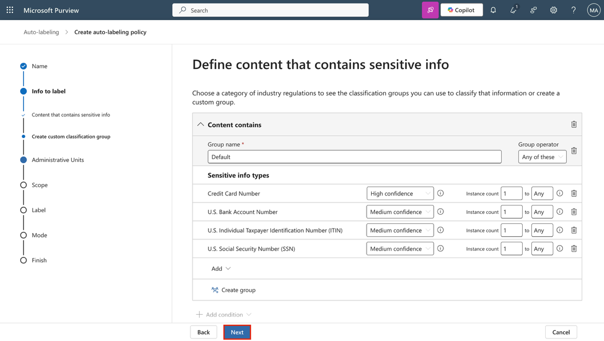

8.  在政策**范围**页面，选择**“下一步**”。

> 

9.  在“**选择保留政策类型创建”**页面，选择**静态**。选择**下一步**。

> 

10. 在“**选择发布标签地点”**页面，选择**“让我选择具体地点**”并选择：

    - 交换邮箱

    - SharePoint 经典与通信网站

    - OneDrive 账户

    - 取消选择所有其他位置

11. 选择 **Next**.

> 

12. 在**“选择标签以自动应用**”页面，选择**添加标签**。

> 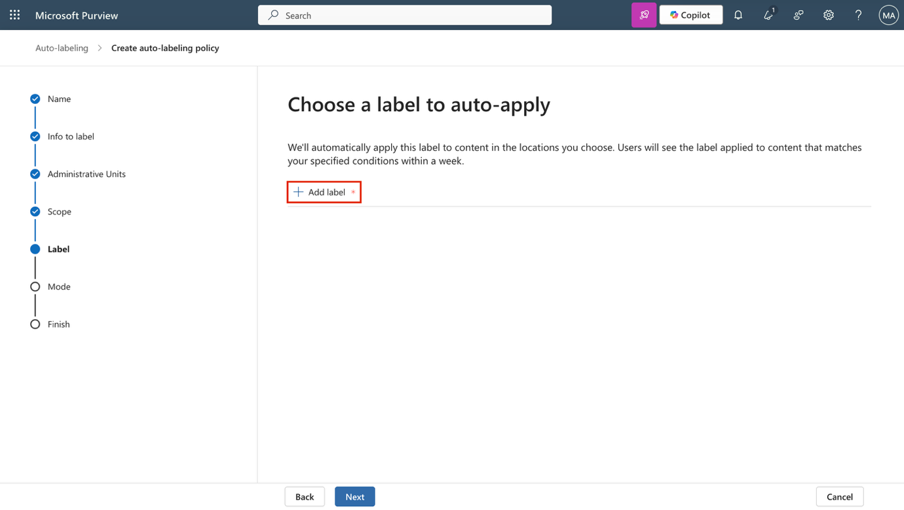

13. 在“**选择标签**”跳出窗口中，选择**个人财务PII**，然后选择**添加**。

> 

14. 回到“**选择标签以自动应用”**页面，选择**“下一步**”。

> 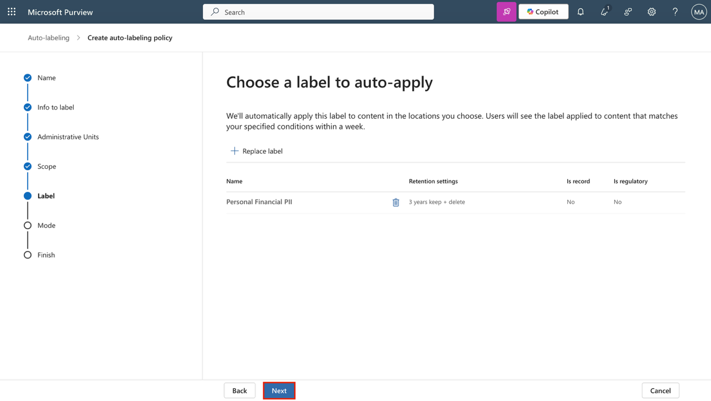

15. 在**“决定是测试还是运行你的策略”**时，先选择**“测试策略”再运行**它，然后选择**“下一步**”。

> 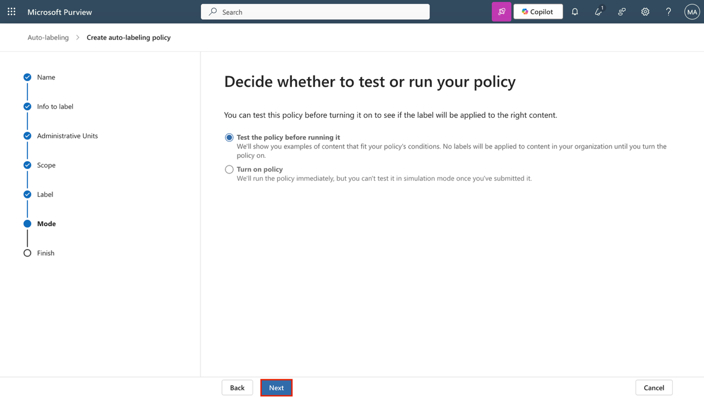

16. 在**“审核与完成**”页面，选择**提交**。

> 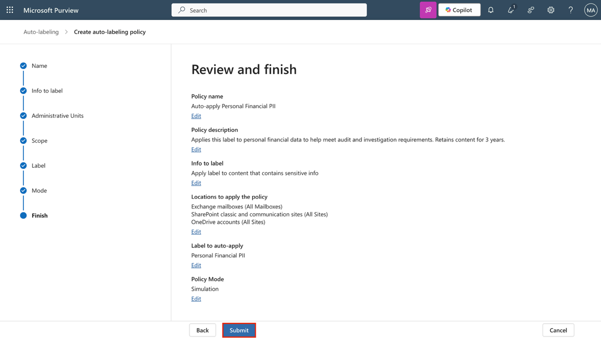

17. 然后在“**您的自动标签政策已创建**”页面选择**完成**“。

> 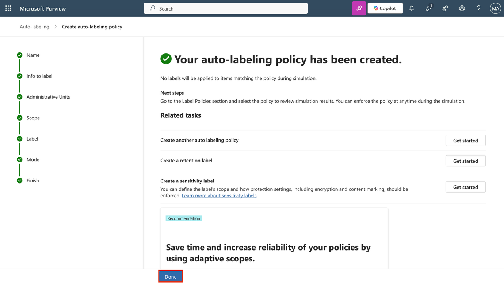

你创建了一个自动应用政策，识别个人财务数据并自动应用保留标签。

**练习 4 – 创建静态保留策略**

在此任务中，您将为Microsoft Teams内容创建静态保留策略，以帮助降低长期数据风险。

1.  在 Microsoft Purview 中，导航至**Solutions** \> **Data Lifecycle Management** \> **Policies** \> **Retention policies**.

> 

2.  在“**保留政策**”页面，选择**“新的保留政策**”。

> 

3.  在“**命名你的保留政策**”页面输入:

    - **名字**: Teams Retention

    - **描述**: Retains Teams chats and channel messages for 3 years, then deletes them to reduce long-term data risk.

4.  选择 **Next**.

> 

5.  在政策**范围**页面，选择**“下一步**”。

> 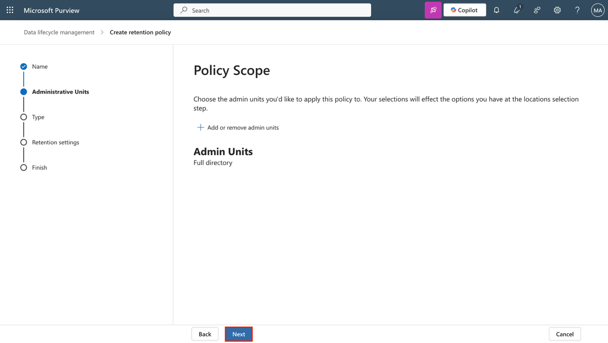

6.  在“**选择创建的保留策略类型**”页面中，选择**静态**，然后选择**“下一步**”。

> 

7.  在**“选择地点以应用政策**”页面，启用:

    - Teams channel messages

    - Teams chats

    - Leave all other locations disabled.

8.  选择 **Next**.

> 

9.  在**决定你是想保留内容、删除内容，还是两个**页面都设置时，确保保留配置中设置了这些值:

    - 选择**保留物品至特定期限**。

    - 在“保留物品以特定期限”**中**，从 **下拉列表中**选择自定义

> 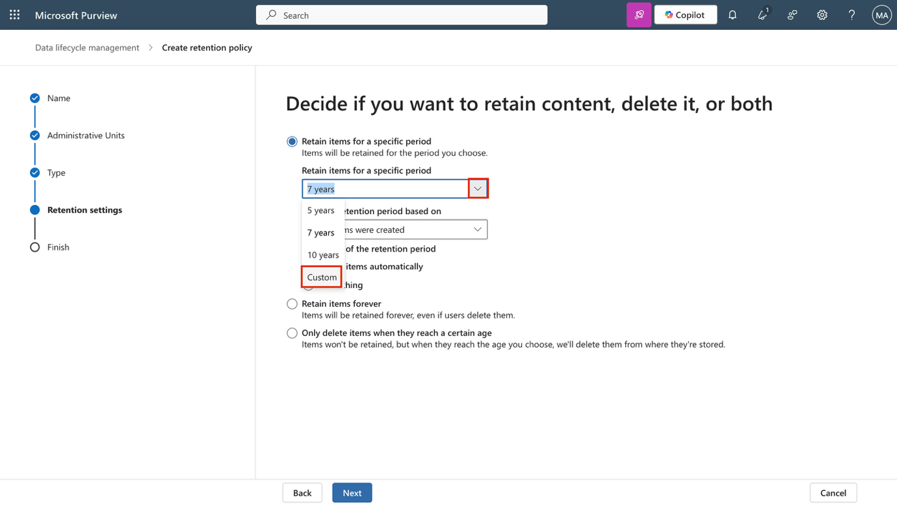

- 将年份字段改为3

- **根据以下时间开始保留期限**：物品最后修改的时间

> 

- **保留期结束**后：自动删除项目

<!-- -->

- 选择**下一步**。

> 

10. 在**“审核与结束**”页面选择**提交**。

> 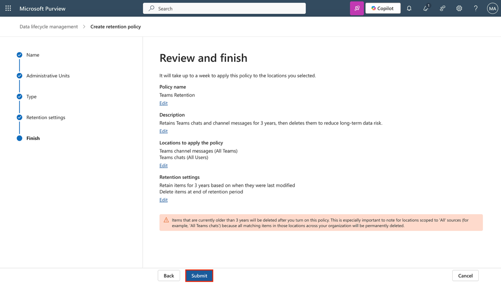

11. 然后在“**你成功创建了保留政策**”页面**上选择**“完成”。

> 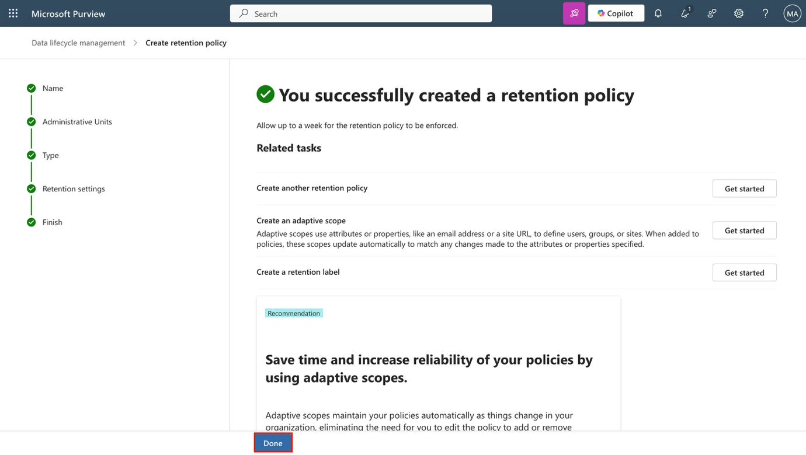

你配置了一个静态保留策略，可以保留 Teams 消息三年后才自动删除。

**练习 5 – 创建一个自适应瞄准镜**

在此任务中，您将定义一个针对与领导和运营岗位相关的Microsoft 365团队的自适应范围。

1.  在 Microsoft Purview 中, **Settings** \> **Roles and scopes** \> **Adaptive scopes**.

2.  在**自适应示波**器页面选择**+创建示波器**。

> 

3.  在**“命名你的自适应政策范围**”页面输入:

    - **名字**: Leadership and Ops Groups

    - **描述**: Targets Leadership and Operations M365 groups with privileged access to sensitive data.

4.  选择 **Next**.

> 

5.  在**“分配管理单元**”页面选择 **Next**.

> 

6.  你**想打造什么类型的望远镜？** 页面选择 **Microsoft 365 组**，然后选择**“下一步**”。

> 

7.  在“**创建定义用户查询**”页面的用户**属性**部分，确保为用户属性配置选择了以下数值：

    1.  选择属性 下拉菜单，然后选择**名称**

> 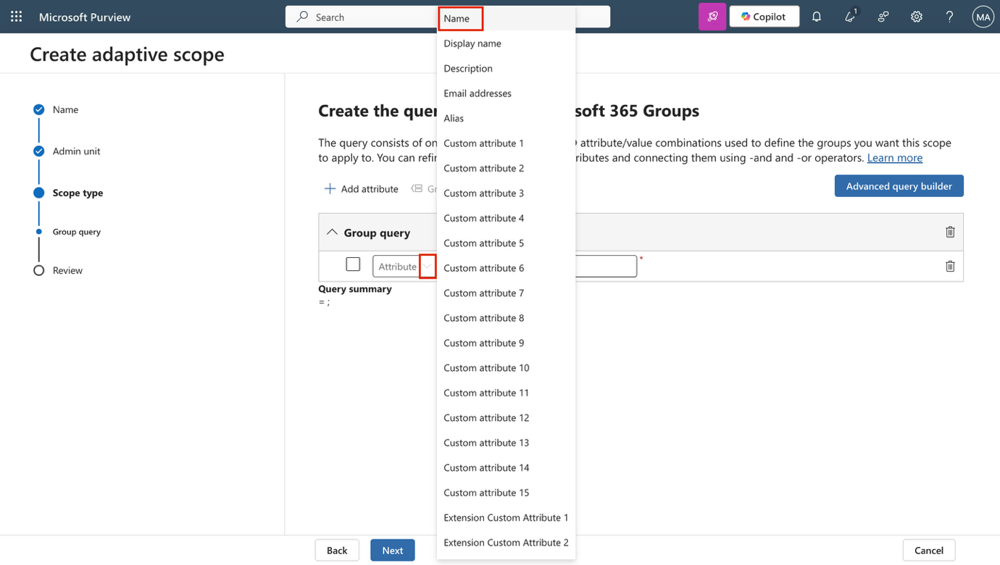

- 留下，默认值**等于**下一个字段的值

- 这就是价值 **的领导力**

8.  通过在**创建查询定义用户**页面**选择+添加属性**添加第二个属性。

> 

9.  在我们刚配置的字段下的新字段中，配置以下值：

    - 选择查询作符的下拉菜单，并将其从And更新为**Or**。

> 

- 选择属性 下拉菜单，然后选择**名称**。

> 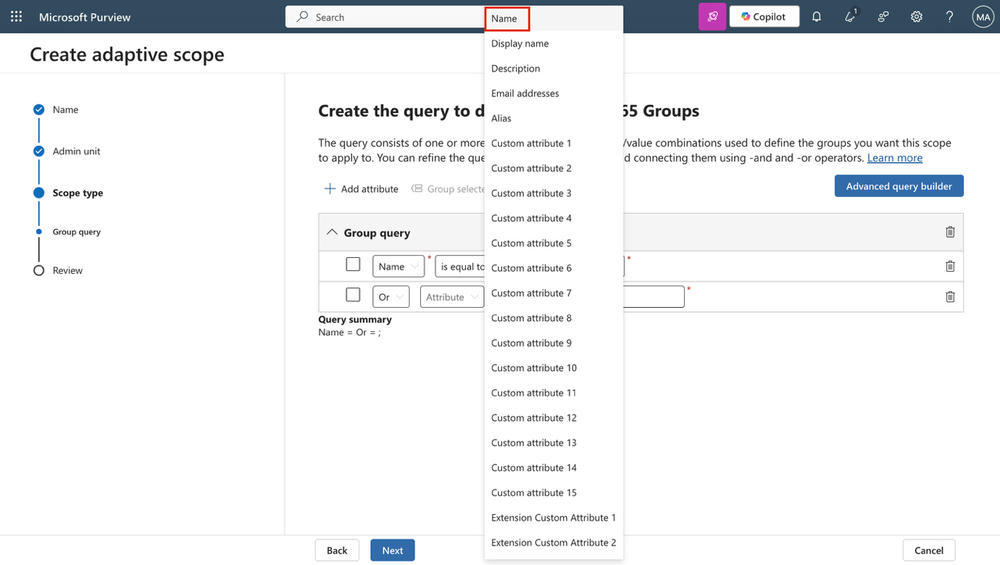

- 留下，默认值**等于**下一个字段的值

- 输入作作为**值**

10. 选择 **Next**.

> 

11. 在**“审核与结束**”页面选择**提交**。

> 

12. 自适应范围创建后，在 **“**您的范围已创建**”页面选择完成**。

> 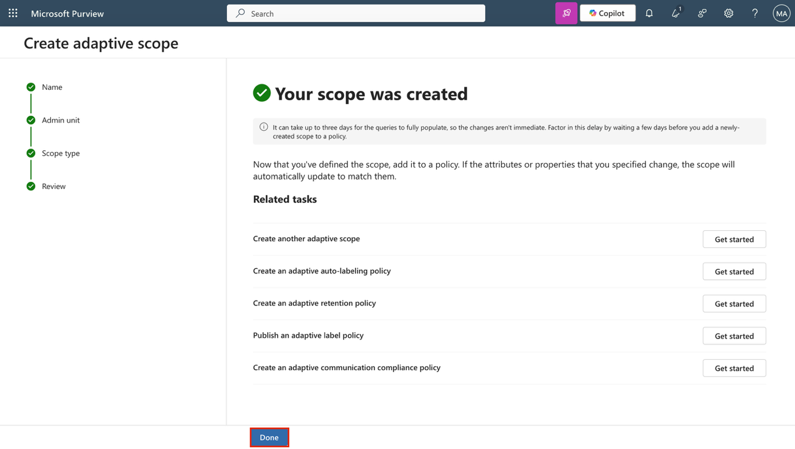

你们创建了一个适应性范围，支持组织中特权群体的有针对性留任。

**练习 6 – 制定适应性留任政策**

在此任务中，您将使用您创建的自适应范围，为具有敏感职责的 Microsoft 365 组配置保留策略。

1.  在 Microsoft Purview 中，导航至**Solutions** \> **Data Lifecycle Management** \> **Policies** \>  **Retention policies**.

> 

2.  在“**保留政策**”页面，选择**+新保留政策**。

> 

3.  在“**命名你的留任政策**”页面输入:

    - **名字**: Privileged Group Retention

    - **描述**: Retains content from Leadership and Operations groups for 5 years to support audit and investigation.

4.  选择 **Next**.

> 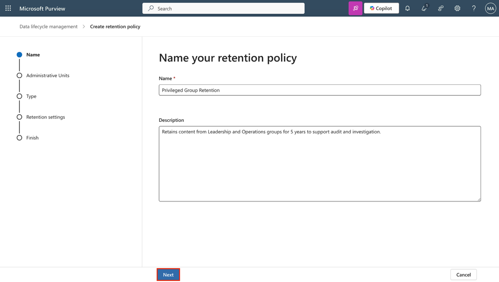

5.  在**策略范围**页面选择**“下一步**”。

> 

6.  在“**选择创建的保留策略类型”页面，**选择**“自适应**”，然后选择**“下一步**”。

> 

7.  在“**选择自适应政策范围和位置**”页面，选择**+添加范围。**

> 

8.  在“**选择自适应政策范围”飞出面板**中，选择领导层和运营组**的复选框** ，然后在 **面板底部**选择添加。

> 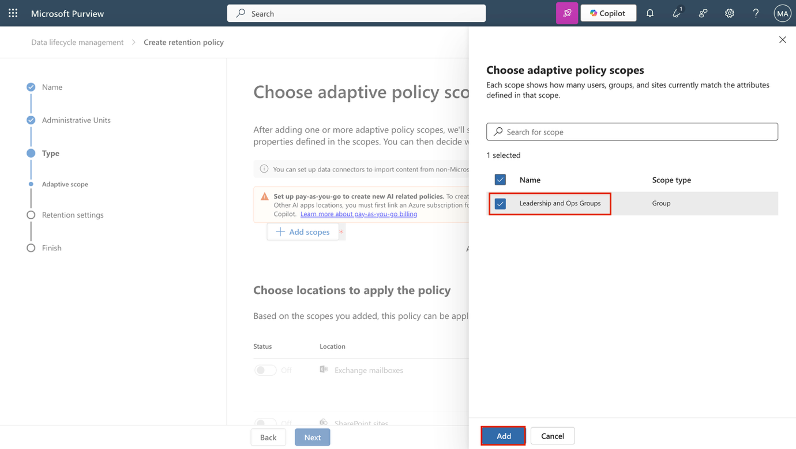

9.  回到**选择地点以应用保单**，支持：

    - Microsoft 365 Group 邮箱与站点

    - 关闭所有其他地点。

10. 选择 **Next**.

> 

11. 在**决定是保留内容、删除内容或两个**页面时，确保保留配置设置了以下数值：

    - 选择**保留物品至特定期限**。

    - 在“保留物品以指定期限”**中，**从下拉菜单**中选择**5年

    - **根据以下时间开始保留期限**：物品最后修改的时间

    - **保留期结束**后：自动删除项目

12. 选择 **Next**.

> 

13. 在**“审核与结束**”页面选择**提交**。

> 
>
> 14． 创建策略后**选择**“完成”。
>
> 

你制定了一项保留政策，适用于特权群体拥有的内容，保留五年后才删除。

**练习 7 – 恢复 SharePoint 内容**

在此任务中，您将模拟从SharePoint网站恢复已删除的文档，以验证您的恢复选项.

1.  你仍然应该登录虚拟机，并且在Microsoft Purview中以Patti Fernandez的身份登录。

2.  选择左上角的应用启动器（网格图标），然后 **从子菜单中选择**“更多应用”。

> 

3.  选择 **SharePoint**.

> 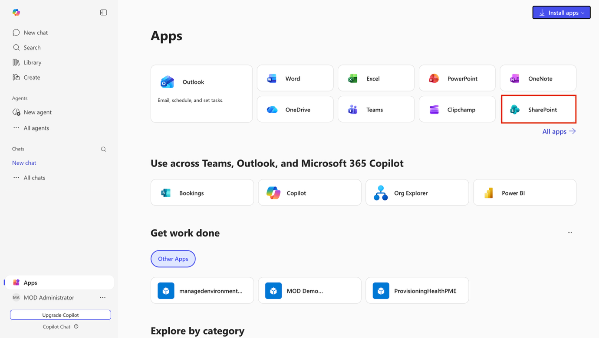

4.  在SharePoint登陆页上，搜索“福利”，然后从 **搜索结果中选择**福利@Contoso.

> 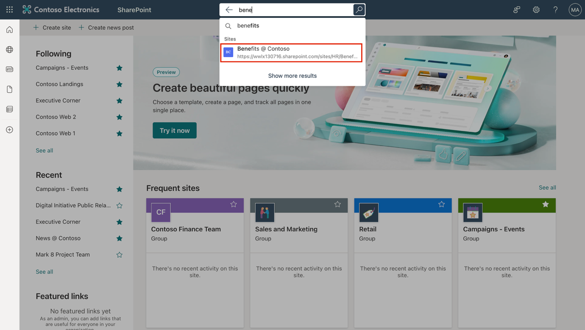

5.  在左侧边栏选择**“文档**”。

> 

6.  在**文档页面，选择**“假期Policies.pptx**”复选框** ，然后 **从作栏**选择删除。

> 

7.  删除时**？**对话框，选择**删除**。

> 

8.  在左侧边栏，选择**“回收箱**”。

> 

9.  在**回收站**页面，右键点击**“假期Policies.pptx**”，然后选择**恢复**。

> 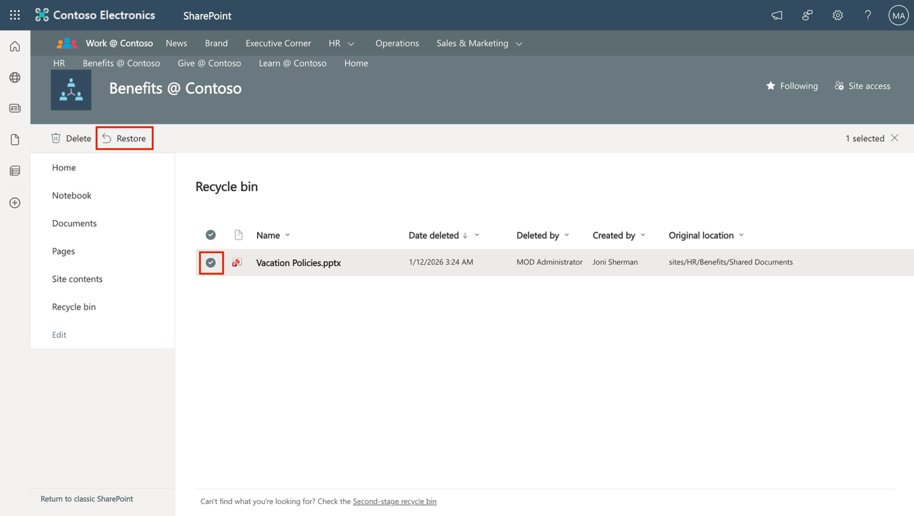

10. 在左侧边栏，选择**“文档**”，并注意到文件已被恢复。

> 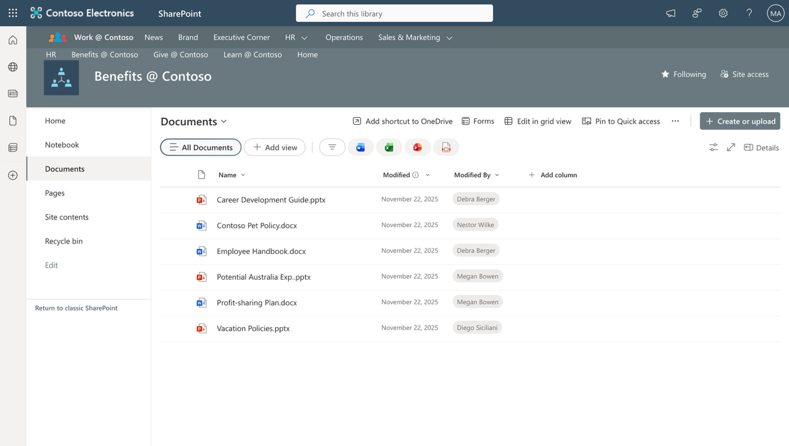

您已成功从SharePoint站点恢复了一份已删除的文档。
