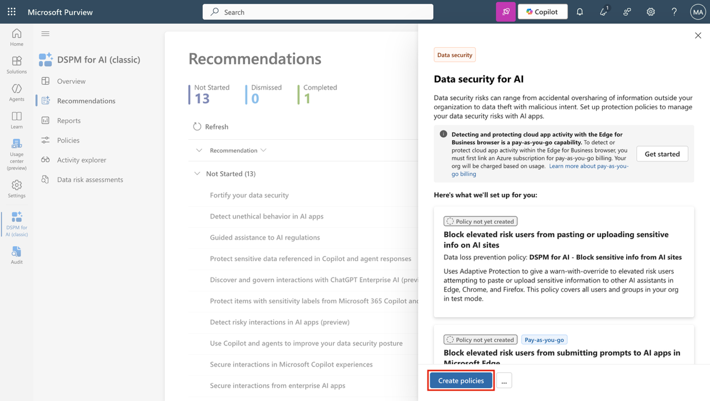
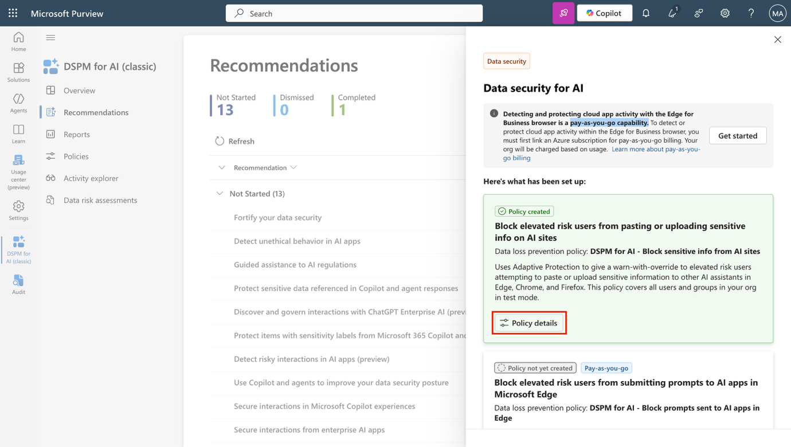
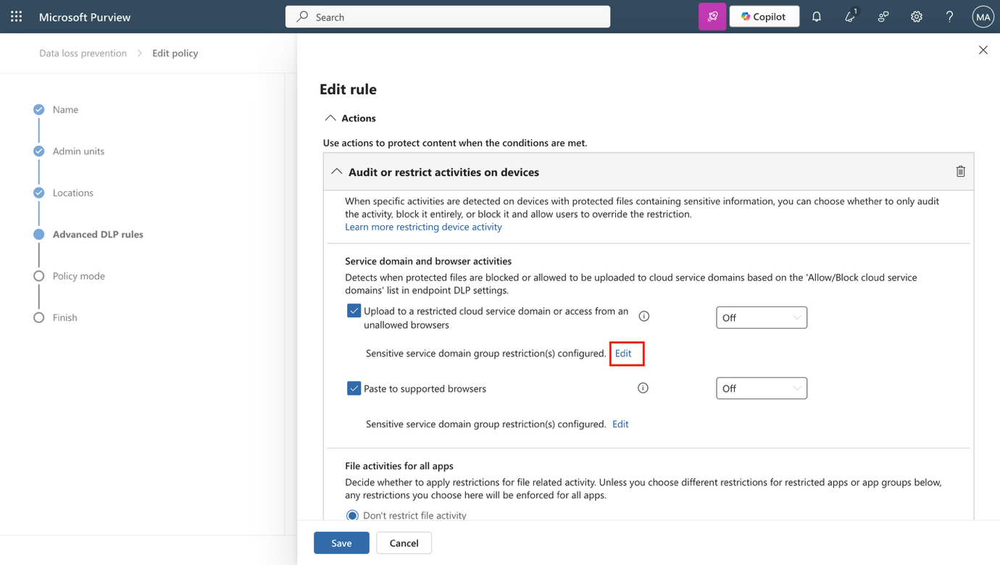
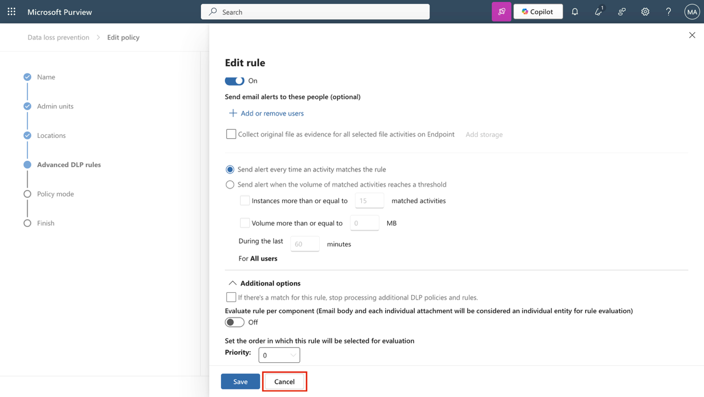
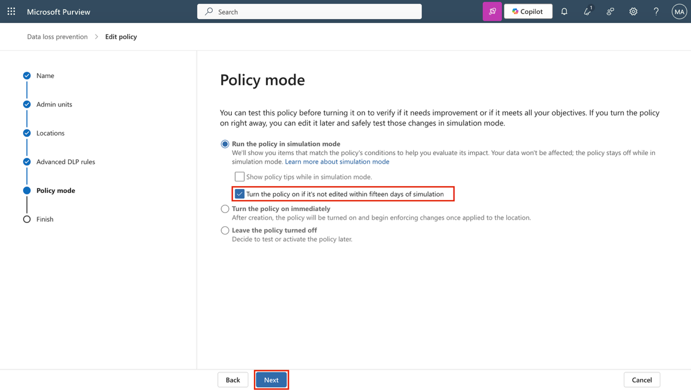

**实验室 14 – 利用 DSPM for AI 来保护您的代理和 AI 应用**

您是Patti Fernandez，Contoso有限公司的信息安全管理员。随着像Microsoft Copilot这样的AI工具越来越融入日常工作流程，您的团队被要求评估并改进敏感数据的保护措施。在本实验室中，您将探索Microsoft Purview DSPM for AI如何通过策略执行、风险检测和暴露评估，帮助保障与AI工具的数据交互安全。

**任务**:

1.  使用 DSPM for AI 来为生成式 AI 网站创建 DLP 策略

2.  制定内部风险政策以检测有风险的AI互动

3.  检测AI应用中的不道德行为

4.  运行数据评估以检测未标记的内容

**任务 1 – 使用 DSPM for AI 来为生成式 AI 网站创建 DLP 策略**

为了降低通过AI助手丢失数据的风险，你将首先使用“加强你的数据安全”建议创建DLP策略。该政策利用自适应保护（Adaptive Protection）限制将敏感数据粘贴或上传到Edge、Chrome和Firefox中的ChatGPT和Copilot等AI工具中。

1.  以管理员身份登录虚拟机。

2.  在 **Microsoft Edge** 中，导航到 https://purview.microsoft.com 并以  **Patti Fernandez 登录** , Pattif@TenantName.

3.  在 Microsoft Purview 中，通过选择 DSPM for AI 导航 **Solutions** \> **DSPM for AI** \> **Recommendations**

> 

4.  选择**“加强你的数据安全**”建议。

> 

5.  在“**AI** 飞行数据安全”页面，查看摘要，然后选择**创建策略**。这会创建针对生成式AI站点的预设DLP策略。

> 

6.  你会看到“阻止高风险用户在AI网站上粘贴或上传敏感信息”的政策。由于另外两个租户需要按需付费功能，因此不会在这个租户中创建它们。创建完保单后，选择**保单详情**。

> 

7.  在策略**详情**部分，选择**“在解决方案中编辑策略**”，在 **Microsoft Purview** 中打开数据丢失预防解决方案.

> 

8.  选择**“下一步**”直到你进入“**选择应用保单的地点**”页面。

> 

9.  确认该策略是针对**设备**。选择**下一步**。

10. 在**“自定义高级DLP规则**”页面，选择“屏蔽”旁边的铅笔图标**，方便风险较高的用户**查看规则。

11. 请查看DSPM为AI创建的规则配置：

    - 在**条件**部分，注意包含敏感信息类型，并指出该规则基于 **风险升高使用自**适应保护。

> 

1.  在**作**中，上传和粘贴活动中，选择**敏感服务域组限制**旁边的**编辑**。

> 

2.  在服务域组配置中，确认 **Generative AI网站**设置为**覆盖屏蔽**。

> 

- 选择**关闭**以关闭面板。

> 

1.  选择**取消**以退出规则编辑器，无需更改。

2.  回到**“自定义高级DLP规则**”页面，选择**“下一步**”。

3.  在 **Policy mode** 页面 选择 **Turn the policy on if it's not edited within fifteen days of simulation**, 然后选择 **Next**.

4.  在**Review and finish** 页面, 选择**Submit**, 然后选择 **Done**.

您已创建一项策略，阻止高风险用户在生成式人工智能网站上共享敏感数据，并确认了数据安全态势管理平台 DSPM for AI 设置的策略配置。

你同样可以通过选择 DSPM **\> AI** \> **推荐**方案来查看其他政策。如果你的租户或用户ID中有按需付费功能，可以继续进行接下来的作

**任务 2 – 制定内部风险政策以检测有风险的AI互动**

接下来，你将创建一个策略，帮助检测Copilot中的冒险提示行为。

1.  在Microsoft权限中， **选择“**解决方案**\>** DSPM for AI **\>**推荐”，导航至**DSPM for AI**。

2.  选择**“检测AI应用中的风险互动（预览）**”推荐。

3.  在**“检测AI应用中的风险交互”（预览）**跳出页面，查看摘要，然后选择**创建策略**。

4.  创建策略后，选择**查看政策**。

5.  在策略**详情**部分，选择**“在解决方案中编辑策略**”，以打开 **Microsoft Purview 的**内部风险管理区域。

6.  在政策 页面，找到并选择 **AI 的 DSPM - 检测有风险的 AI 使用**策略。

7.  在跳出窗口中，选择**编辑策略**以查看完整的策略配置。

8.  在“**选择策略模板**”页面，注意该策略使用了**“风险AI使用（预览）**”模板。

9.  选择**“下一步**”，直到您进入**本政策页面的“选择触发事件**”。确认触发事件是从 **Microsoft Entra ID 中删除用户账户**，这表明可能存在可能的离职相关风险，这些风险可能在冒险的 AI 活动之前或之后发生。

10. 选择 **Next**.

11. 在**“指示器**”页面，展开指示器类别以查看被选中的信号：

    1.  浏览 Generative AI 网站

    2.  收到了 Copilot 的敏感回复

    3.  在 Copilot 中输入了风险提示

12. 选择**“下一步**”直到进入**“评测和完成**页面，然后选择**取消**退出编辑器，无需更改。

你们制定了一项策略，检测有风险的AI交互，包括提示和响应，帮助识别风险用户行为的早期迹象。

**任务 3 – 检测AI应用中的不道德行为**

在这项任务中，你将在DSPM中创建一项策略，用于检测Microsoft 365 Copilot及其他AI应用中的不道德或不当行为。

1.  在Microsoft权限中， **选择 “Solutions** \> **DSPM for AI** \> **Recommendations**.

2.  选择**“检测AI应用中的不道德行为**”推荐。

3.  在飞出中，请回顾该政策将配置的内容概览：

    - 默认政策名称是 **DSPM for AI——AI应用中的不道德行为**。

    - 该策略检测到 Microsoft 365 Copilot 及其他 AI 代理中提示和响应中的敏感或不当信息。

    - 它适用于你组织中的所有用户和组。

4.  选择**创建策略**以创建通信合规策略。

5.  在“**策略成功创建**”页面，选择**X**关闭飞出窗口。

6.  **推荐**页面将刷新，**“检测AI应用中的不道德行为**”推荐将移至**已完成**。

7.  在左侧导航中，选择**“政策**”。

8.  选择新创建的 **DSPM for AI – 不道德行为** AI 应用政策，以查看其配置和状态。

9.  在 **DSPM for AI - AI 应用中的不道德行为**页面，选择 **X** 关闭该飞出页面。

你们制定了一项政策，检测AI应用中的不道德行为，帮助Contoso保持对Copilot的负责任使用。

**任务 4 – 创建数据风险评估以检测未标记内容**

为了了解标签覆盖可能存在的漏洞，您将进行数据风险评估，以识别可能被 Copilot 访问的无敏感标签文件。

1.  在 **DSPM for AI** 中，选择标题为**“保护 Copilot 和代理响应中引用的敏感数据**”的建议。

2.  在**Copilot和代理响应面板中提到的保护敏感数据中**，查看摘要，然后选择**“前往评估”**。

3.  在**数据风险评估**页面，选择**创建自定义评估**

4.  在**基础详情**页面，请输入：

    - **名字**: Unlabeled File Exposure Assessment

    - **描述**: Identifies files without sensitivity labels that may be exposed in Microsoft 365 Copilot responses and provides recommendations to reduce oversharing risks.

5.  选择 **Next**.

6.  在 **Add users** 页面, 选择 **All**, 然后选择**Next**.

7.  在“**添加数据源以评估**”页面，保持 SharePoint 默认位置 ，然后选择**“下一步**”。

8.  在“**审查并运行数据评估扫描**”页面，选择**保存并运行**。

9.  在“**数据评估成功创建”**页面，选择**完成**。

您现在已经使用Microsoft Purview DSPM for AI，检测与AI相关的风险、执行政策并评估敏感数据暴露，帮助您的组织安全地使用AI。
