**实验室 2 – 管理敏感信息类型​**

**介绍**

Contoso 有限公司此前曾遇到员工在工单支持工单处理时意外发送客户个人信息的问题。

为了未来教育用户，需要自定义敏感信息类型来识别电子邮件和文档中的员工ID，这些文件由三个大写字符和六个数字组成，使用敏感信息类型。为降低误报率，将使用关键词“员工”和“ID”。

**目标**

- 使用正则表达式和关键词列表**创建**  **custom sensitive information type**。

- 利用结构化员工数据**配置并定义  EDM-based sensitive info type**。

- 将员工数据哈希并上传到  **EDM Upload Agent** 进行分类。

- 构建**基于 keyword dictionary-based sensitive info type **，以识别机密的健康相关术语。

- 在应用到政策之前，测试并验证自定义敏感信息类型的准确性。

**练习 1 – 创建自定义敏感信息类型**

在本练习中，您将使用 **Security & Compliance Center PowerShell** 模块创建一种新的自定义敏感信息类型，识别“Employee”和“ID”关键字附近的员工ID模式。

1.  在你的 Edge 浏览器中打开一个 InPrivate 窗口，在地址栏输入以下 URL，打开 Microssoft Purview 门户：https://purview.microsoft.com，然后 **用**资源标签页上的用户名 **PattiF@TenantName** **和用**户密码登录为 **Patti Fernandez。**

> 
>
> 

2.  如果  **Welcome to the new Microsoft Purview protal!** 对话框出现, 然后点击**“开始**使用”按钮

> 

3.  从左侧导航中选择**Solutions** \> **Data Loss Prevention**.

> 
>
> **注释**: 如果你在解决方案列表中没有看到 ** Data Loss Prevention**，请等待几分钟后重新上传页面。如果解决方案列表中仍然没有看到数据丢失防止，请使用普通（正常）浏览窗口登录。

4.  从左侧面板选择 **Classifiers **。 **在子导航面板中**选择 **Sensitive info types**。选择 **+ Create sensitive info type** 以打开新的敏感信息类型向导。

> 

5.  在 **Name your sensitive info type** 页面, enter the following information:

    - **名字**: Contoso Employee IDs

    - **描述**: Pattern for Contoso employee IDs

6.  选择 **Next**.

> 

7.  在 **Define patterns for this sensitive info type** 页面, 选择 **Create pattern**.

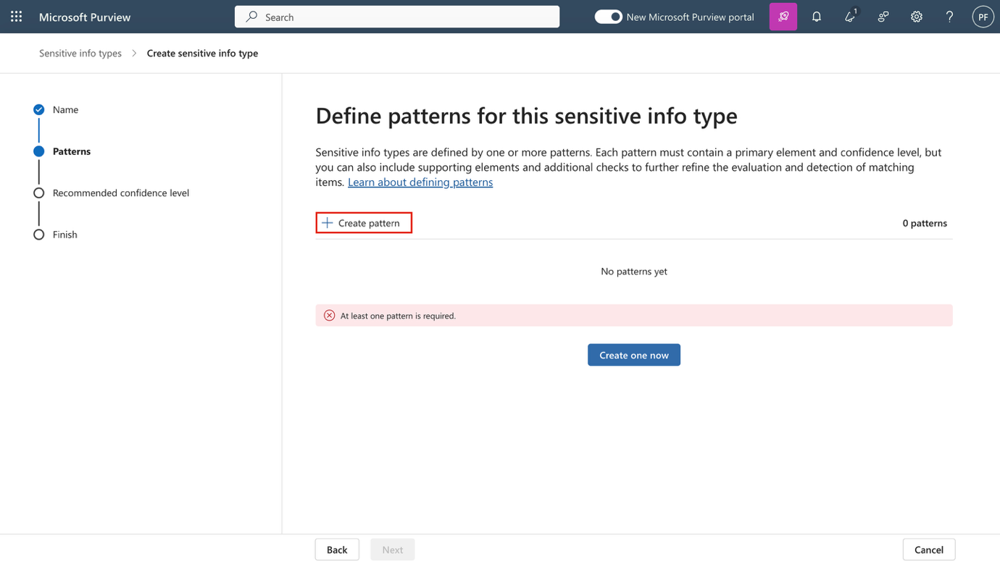

8.  在 **New pattern** 右侧的面板，选择 **Add primary element** 并选择 **Regular expression**.

9.  在新的右侧面板中 **Add a regular expression**, 请加入以下内容：

    - **ID**: Contoso IDs

    - **Regular expression**: \s\\A-Z\\{3}\\0-9\\{6}\s

    - Select **String match**

10. 选择 **Done**.

11. 在新模式面板中，减少**Character proximity** value to ***100*** characters.

> 
>
> 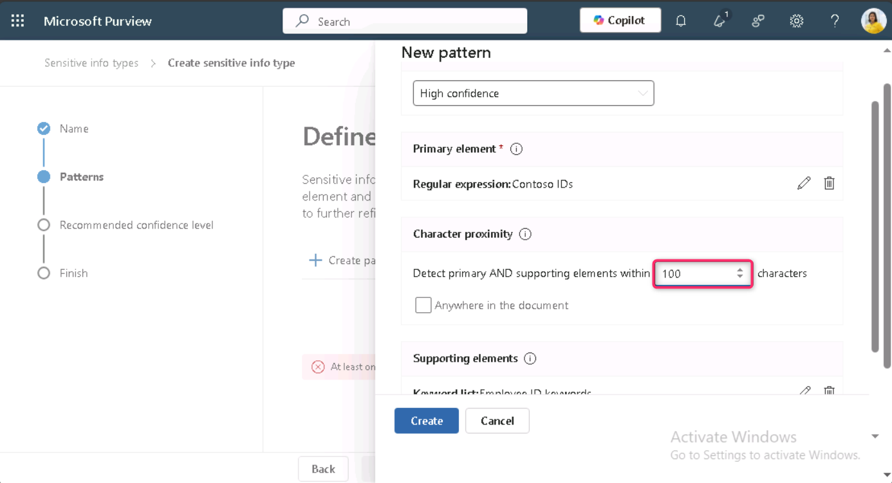

12. 导航至 **Supporting elements**  标题, 点击**+ Add supporting elements or group of elements** 下拉菜单并选择 **Keyword list**.

> 

13. 在**Add a keyword list** 窗口, 请加入以下内容：

    - **ID**: Employee ID keywords

    - **Case insensitive**:Employee ID

> 

14. 向下滚动，选择  **Word match** 旁边的单选按钮。 然后，点击**“Done**”按钮。

> 

15. 现在，点击 **“Create **”按钮。

> 

16. 在 **Define patterns for this sensitive info type** 页面选择 **Next**.

> 

17. 在 **Choose the recommended confidence level to show in compliance policies**页面, 使用默认值，然后选择**“下一步”按钮。**

> 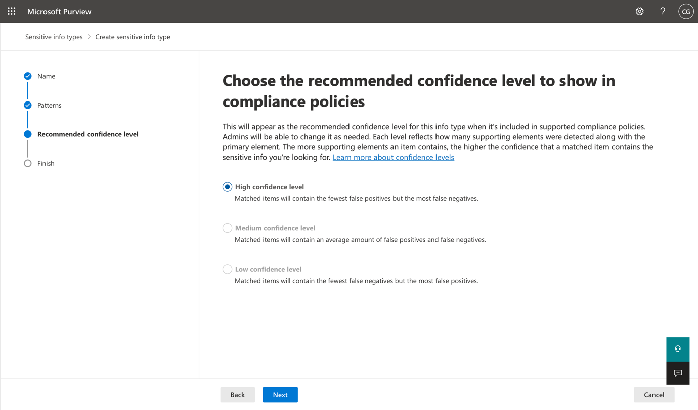

18. 在 **Review settings and finish** 页面查看设置并选择**创建**。 成功创建后选择**完成**。

> 
>
> 

19. 保持浏览器窗口开启.

您已成功创建一种新的敏感信息类型，用于识别员工ID，采用三个大写字符、六个数字以及100字符范围内的关键词“Employee”或“IDS”。

**练习 2 – 创建基于 EDM 的分类信息类型**

作为额外的搜索模式，你将创建一个基于EDM的分类，并建立一个员工数据的数据库模式。数据库源文件将采用以下员工数据字段格式：姓名、出生日期、街道地址和员工ID。

1.  点击“解决方案”，然后选择 **Data Loss Prevention**

> 

2.  点击 **“Classifiers**”，然后选择**EDM分类器**。在EDM分类器页面，点击**新 New EDM experience**即可 **Off**

> 

3.  然后点击 **Create** **EDM schema**

> 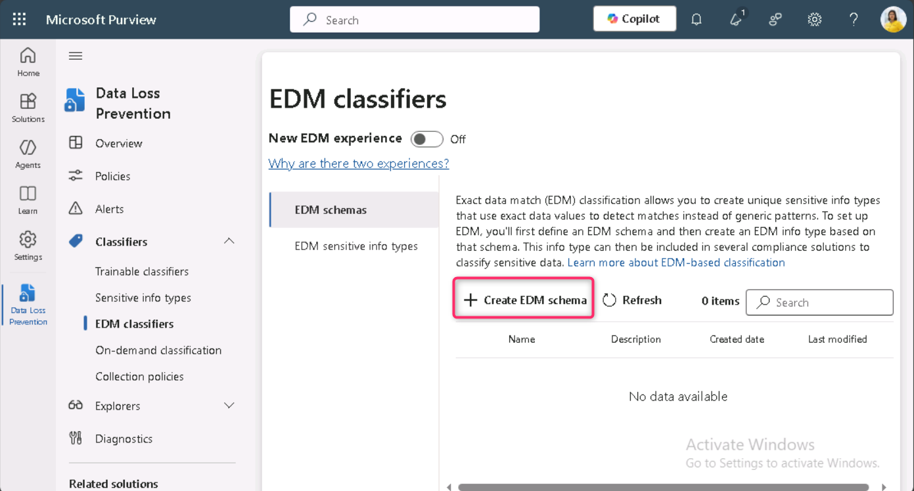

4.  在 **Name** 字段, 输入 employeedb.

5.  在 **Description** 字段, 输入 Employee Database schema.. 取消勾选**Ignore delimiters and punctuation for all schema fields**.

> 
>
> 

6.  在第一个模式字段名称中输入名称，标记 **Field is searchable **框。

> 

7.  点击下拉菜单 **Choose delimiters and punctuation to ignore** 并 **Hyphen**, **Period**, **Space**, **Open parenthesis** 和 **Close parenthesis**.

> 

8.  选择 **+ Add schema data field** 从较低的部分开始。

> 

9.  在 **Schema field name**, **Schema field \#2** 下, 输入 Birthdate.

10. 选择 **+ Add schema data field** 又是低价。

11. 在**模式字段名称中**, **Schema field \#3 下**, 输入 StreetAddress.

12. 选择 **+ Add schema data field** 最后一次从低端。

13. 在**Schema field name**, **Schema field \#4 下**, 输入 EmployeeID.

14. 选择 **Field is searchable**.

15. 选择 **Save**.

> 

16. 从左侧窗格选择 **EDM sensitive info types**类型，然后选择**+  Create EDM sensitive info type **以打开**EDM rule package** 向导。

> 

17. **在Define data store schema** 页面, 选择 **Choose an existing EDM schema**.

> 

18. 选择 **employeedb** 并选择 **Add**.

> 

19. 查看数据存储模式并选择**Next**.

> 

20. 在 **Define patterns for this EDM sensitive info type** 页面, 选择 **+ Create pattern**.

> 

21. 在 **New pattern** 右侧的玻璃, 在 **Primary element** 字段, 选择 ***EmployeeID***.

22. 在**Primary element's sensitive info type 下**, 选择 **Choose sensitive info type**.

> 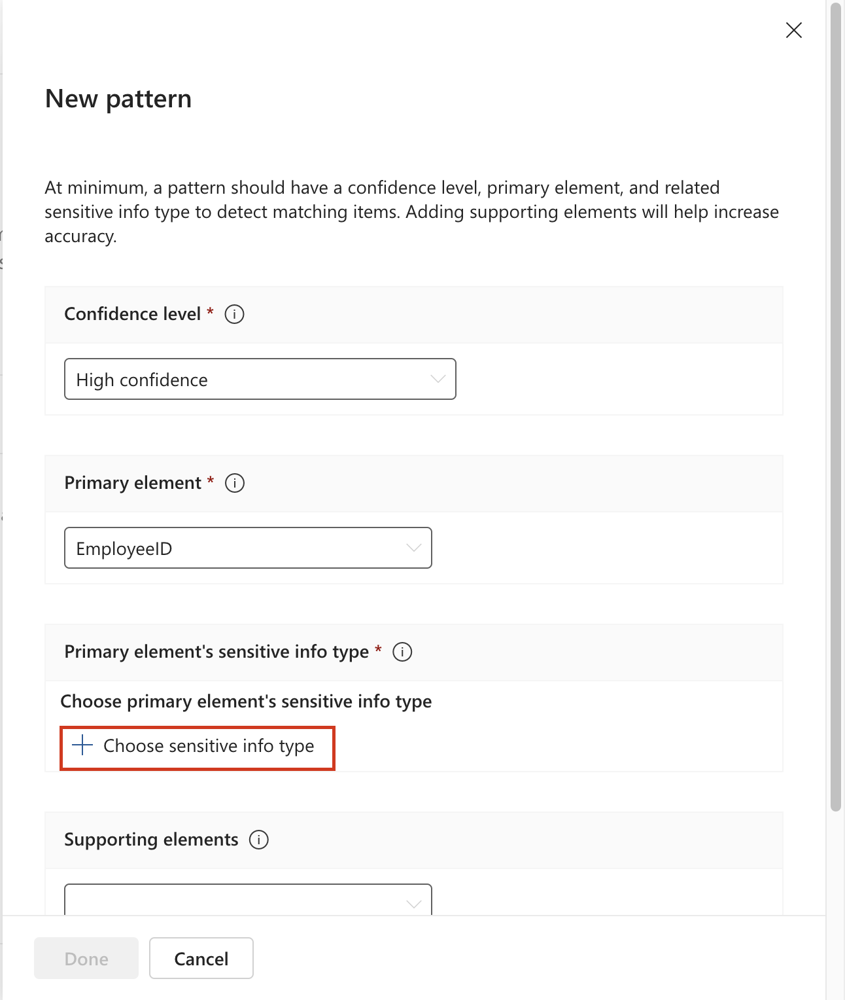

23. 在 **搜索**栏, 输入 Contoso 然后按下回车键。

24. 选择 **Contoso Employee IDs** 并选择**Done**.

25. 选择 **Done**.

> 

26. 在**“**定义图案”界面中选择下一步，用于此EDM敏感信息类型界面。

> 

27. 在 **Choose the recommended confidence level and character proximity** 让默认值保持不变，然后选择**“下一步**”。

> 

28. 在 **Name and describe your EDM sensitive info type** 页面, 输入 Contoso Employee EDM for the name.

29. 在 **Description for admins** 字段, 输入 EDM-based sensitive information type for employee personal information.选择 **Next.**

> 

30. 检查设置并选择**Submit**.

> 

31. 在 **Your EDM sensitive info type was created** 页面, 选择 **Done**.

> 

32. 保持浏览器打开，打开Microsoft Purview门户。

您已成功创建了一种基于EDM的新分类敏感信息类型，用于识别数据库文件源中的员工数据。

**练习 3 – 创建基于 EDM 的分类数据源**

要将基于EDM的分类与包含敏感数据的数据库关联，接下来需要通过EDM上传代理工具对敏感信息类型的实际数据进行哈希和上传。

1.  在 **Microsoft Edge** 浏览器, 导航到 https://go.microsoft.com/fwlink/?linkid=2088639 以下载EDM下载代理。

2.  点击 **Open file** 访问链接 **EdmUploadAgent.msi**

> 

3.  在 **Welcome to the Microsoft Exact Data Match Upload Agent Setup Wizard** 对话框，点击**“下一步**”按钮。

> 

4.  在 **Microsoft Exact Data Match Upload Agent Setup** 巫师, 选择 **Next**.

    - 选择 **I accept the terms in the License Agreement** 并选择 **Next**.

    - 不要更改默认**的目标文件夹**路径并选择**“下一步**”。

    - 选择**安装**以执行安装。

    - 当**用户账户控制**窗口打开时，选择**“是**”。

    - 如果被要求登录，请通过**Patti**的账户登录。

    - 安装完成后，选择**完成**。

5.  现在，右键点击Windows图标，导航并点击**“运行**”。在**“运行**”对话框中，输入“记事本”，然后点击**确定**按钮。

> 
>
> 

6.  在记事本中输入以下文字：

> Name,Birthdate,StreetAddress,EmployeeID
>
> Patti Fernandez,01.06.1980,1Main Street,CSO123456
>
> Christie Cline,31.01.1985,2Secondary Street,CSO654321
>
> 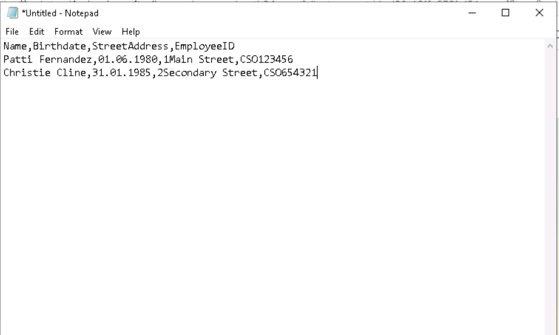

7.  选择文件并另存为：EmployeeData.csv

8.  选择“**Save as type**”**下的拉菜单** ，然后选择**“所有文件”（*。*）。**

9.  在**编码**字段中，确保选择**了UTF-8**，然后点击**保存**按钮。

> 

10. 关闭记事本窗口。

11. 右键点击 任务栏上的 **Windows** 图标，选择 **Windows PowerShell（管理员）**以管理员身份运行。

> 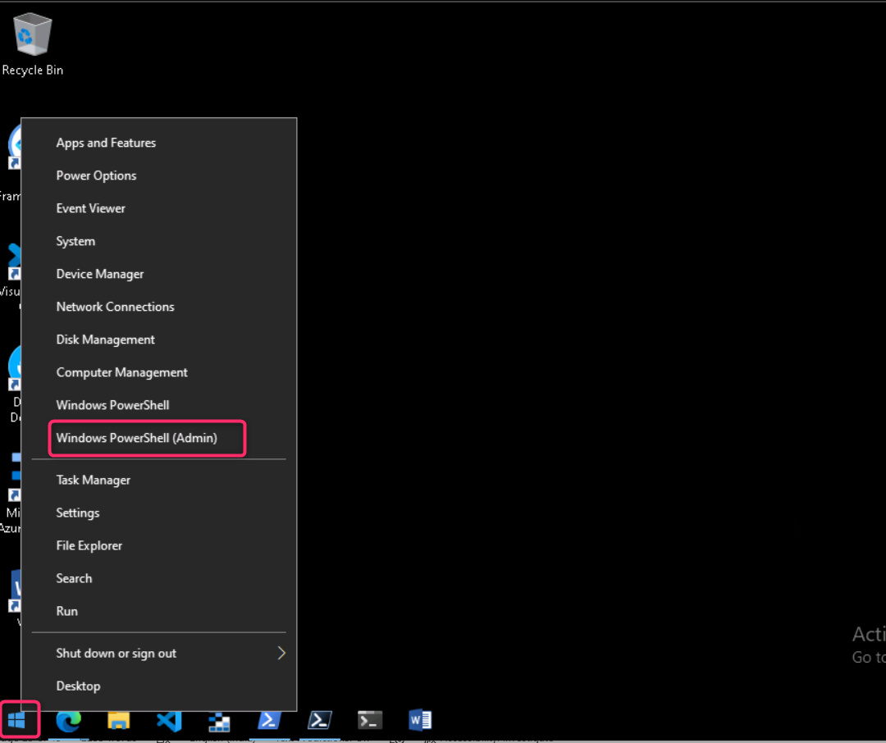

12. 在 **User Account Control** 对话框，点击**“Yes ”**按钮。

> 

13. 导航至EDM上传代理目录：

> cd "C:\Program Files\Microsoft\EdmUploadAgent"
>
> 

14. 通过运行以下命令，使用您的账户授权将数据库上传到租户:

> .\EdmUploadAgent.exe /Authorize
>
> 

15. 当**显示“Pick an account**” 窗口时，请 **用用户**名**PattiF@TenantName和**资源标签页上给出的用户密码登录**Patti Fernandez。（或者用你重置的新密码。）**

> 
>
> 

16. 通过在PowerShell中运行以下脚本，下载基于EDM的分类敏感信息类型的数据库模式定义：

> .\EdmUploadAgent.exe /SaveSchema /DataStoreName employeedb /OutputDir "C:\Users\Admin\Documents\\
>
> **注释**: 如果最后一个命令失败，可能需要更多时间才能应用**EDM_DataUploaders**组成员身份。下载schema文件可能需要长达一小时。如果失败，继续下一个任务，稍后再回到这一步。或者检查虚拟机里的路径文件文件夹。
>
> 

17. 通过在PowerShell中运行以下脚本，对数据库文件进行哈希并上传到基于EDM的分类敏感信息类型:

.\EdmUploadAgent.exe /UploadData /DataStoreName employeedb /DataFile C:\Users\Admin\Documents\EmployeeData.csv /HashLocation "C:\Users\Admin\Documents\\ /Schema "C:\Users\Admin\Documents\employeedb.xml"

\

\*\*Note:\*\* If you get the following errors

Error Type: System.IO.FileNotFoundException

Error Message: Unable to find the specified file.

\*\*Check the path where you saved the file EmployeeData.csv\*\*

\

19. 检查上传进度直到状态变成完成，然后执行以下PowerShell命令:

> .\EdmUploadAgent.exe /GetSession /DataStoreName employeedb
>
> 

你已经成功哈希并上传了一个基于EDM的分类敏感信息类型的数据库文件.

**练习 4 – 创建关键词词典**

多起个人信息泄露事件发生在同事报告病假后用户发送邮件。当这种情况发生时，疾病或疾病的原因会被传达出来。我们不希望这种情况发生。

1.  在 **Microsoft Edge**, 开 **New InPrivate Window**, 导航到 https://purview.microsoft.com 登录时为 **Patti Fernandez** 使用用户名 **PattiF@TenantName** 和资源标签页上给出的用户密码。

2.  从左侧导航中选择**Solutions** \> **Data Loss Prevention**.

> 

3.  从左侧面板选择 **Classifiers **。在子导航面板中 **Sensitive info types**。选择 **+Create sensitive info type**以打开新的敏感信息类型向导。

> 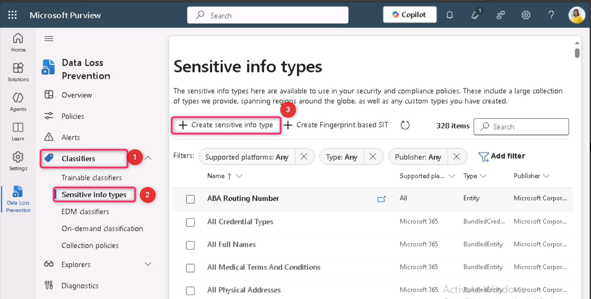

4.  在**Name your sensitive info type** 页面, enter the following:

    1.  名字: Contoso Diseases List

    2.  描述: List of possible diseases of employees.

> 

5.  选择 **Next**.

6.  在 **Define patterns for this sensitive info type** 页面, 选择 **+ Create pattern**.

> 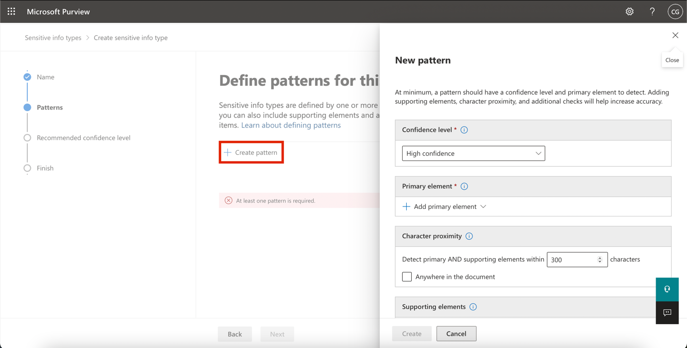

7.  选择下方下拉字段 **Primary element** 并选择 **Keyword dictionary**.

> 

8.  在 **Add a keyword dictionary** 页面，请输入姓名 Diseases Dictionary\*.

9.  在 **Keywords** 区域将以下关键词输入，分别在一行中：

> flu
>
> influenza
>
> cold
>
> bronchitis
>
> otitis
>
> 

10. 选择 **Done**.

11. 在 **“ Supporting elements” 下方**，选择**“+Add supporting elements or group of elements**，选择**keyword list **以增加对关键词词典的额外支持。

> 

12. 在**添加关键词列表**页面的ID栏输入**“员工**”。在大小**写不敏感**的框中，输入以下关键词，分别在一行中，然后点击**“完成**”按钮：

> Employee ID
>
> leave
>
> reason
>
> 

13. 在 **New pattern** 页面, 查看配置并选择**创建**。

> 

14. 在 **Define patterns for this sensitive info type** 选择 **Next**.

> 

15. 在 **Choose the recommended confidence level to show in compliance policies** 让默认值保持不变并选择**Next**.

> 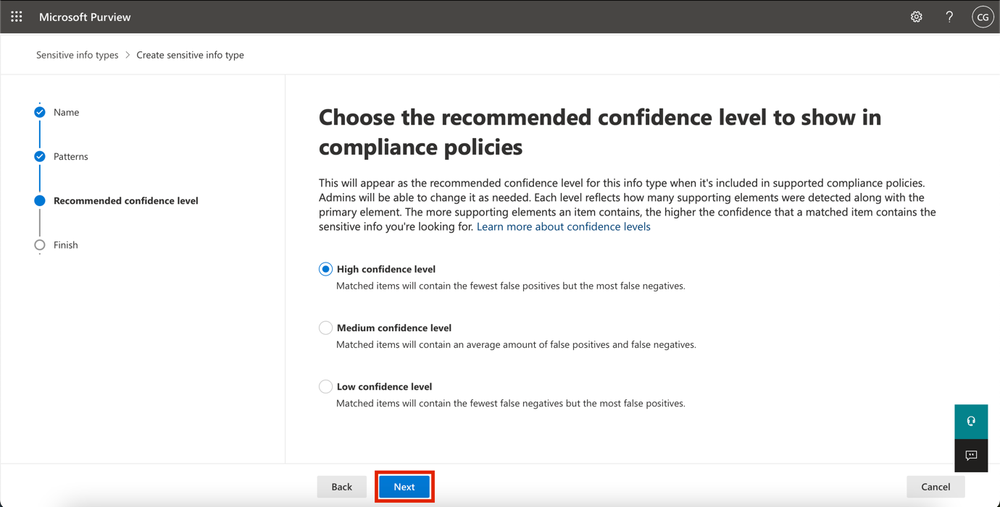

16. 在 **Review settings and finish** 页面，查看你的设置并选择**“创建**”。流程完成后选择**“完成**”。

> 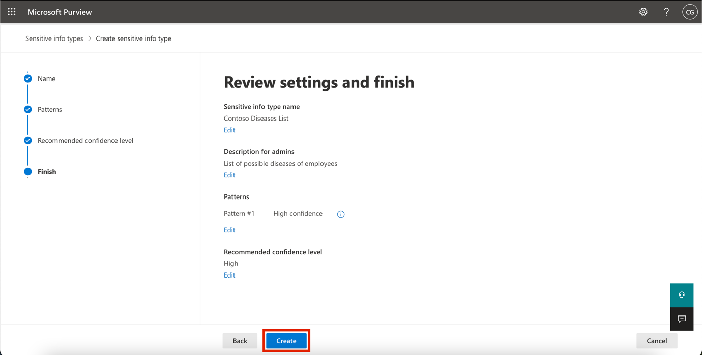

1.  保持 Microsoft Purview 门户中的浏览器窗口开启。

你已经成功基于关键词词典创建了一个新的敏感信息类型，并添加了更多关键词以降低误报率。继续下一个任务。

**练习 5 – Working with custom Sensitive Information Types**

自定义敏感信息类型在策略中使用前应始终进行测试，否则由于自定义搜索模式故障，可能导致数据丢失或泄露。

1.  右键点击Windows图标，导航并点击**“运行**”。 在**“运行**”对话框中，输入 +++notepad+++，然后点击**确定**按钮。

> 
>
> 

2.  在记事本窗口输入以下文字：

> Employee Patti Fernandez with Employee ID ABC123456 is on leave because of the flu/influenza

3.  选择 **File** 以及《拯救AsSickTestData 然后选择**保存**。

4.  关闭记事本窗口。

5.  在 **Microsoft Edge**, Microsoft Purview 门户标签页应该仍然开着。如果有，选择它并进入下一步。如果你关闭了它，然后在新标签页里进入 https://purview.microsoft.com。**使用资源标签页上的用户名**PattiF@TenantName**和用**户密码登录为 Patti Fernandez。

6.  在左侧导航面板中选择“ **Solutions** \> **Data Loss Prevention**，然后在**分类器**中**选择敏感信息类型**。在**搜索**框中，右上角输入Contoso并按回车。点击**Contoso员工IDS**打开右侧面板。

7.  从右侧面板**选择**测试。

> 

8.  在 **Upload file to test** 页面, 选择 **Upload file**.

> 

9.  从左侧窗格选择**“文档**”，选择名为 **SickTestData** 的文件，然后选择**“打开**”。

> 

10. 选择**测试**开始分析。

> 

11. 在**匹配结果**页面，查看找到的匹配。

> 

12. 选择**完成**，然后点击X键关闭测试页面 。

> 

13. 回到**数据分类**页面，选择名为**“Contoso Diseases List”的敏感信息类型**。

14. 在右侧面板中，选择测试。

> 

15. 在“**Upload file to test** ”页面，选择**“上传  Upload file**”。

> 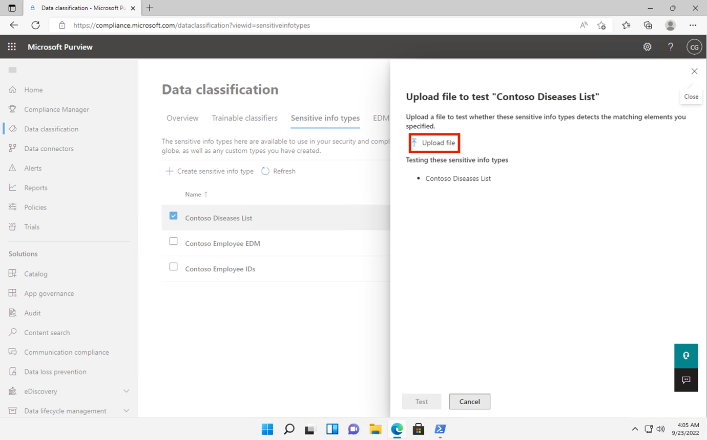
>
> 16． 从左侧窗格选择**“Documents **”，选择名为 *SickTestData* 的文件，然后选择**“打开**”。

17. 选择 **Test **开始分析。

> 

18. 在**匹配结果**页面，查看找到的匹配。审核完成后，选择**“结束**”。

> 

**总结:**

在本实验室中，你学习了如何在Microsoft Purview中创建和测试自定义敏感信息类型（SITE），使用正则表达式、关键词词典和精确数据匹配（EDM）技术，以增强数据丢失防护能力。
