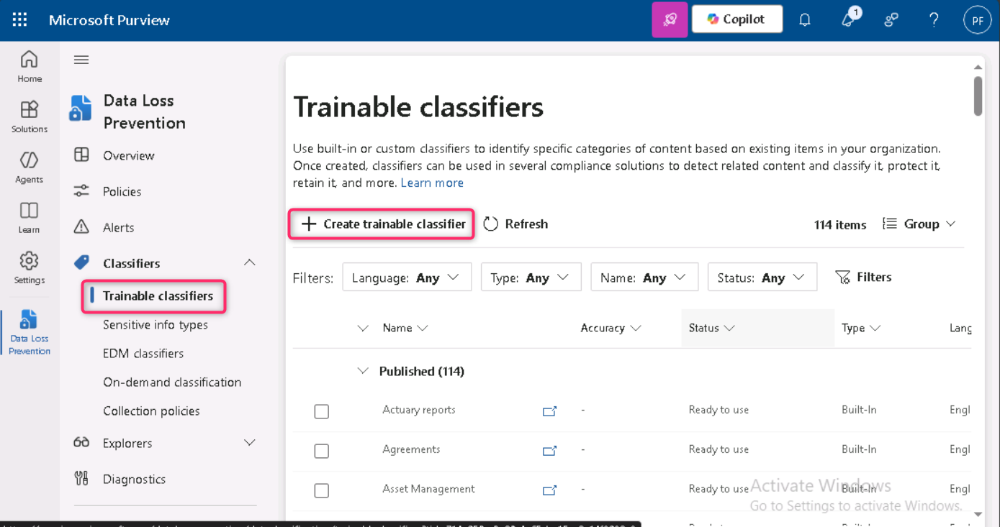
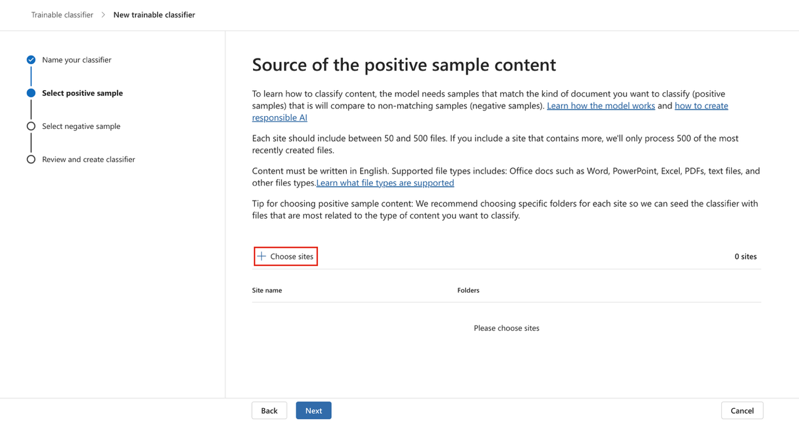
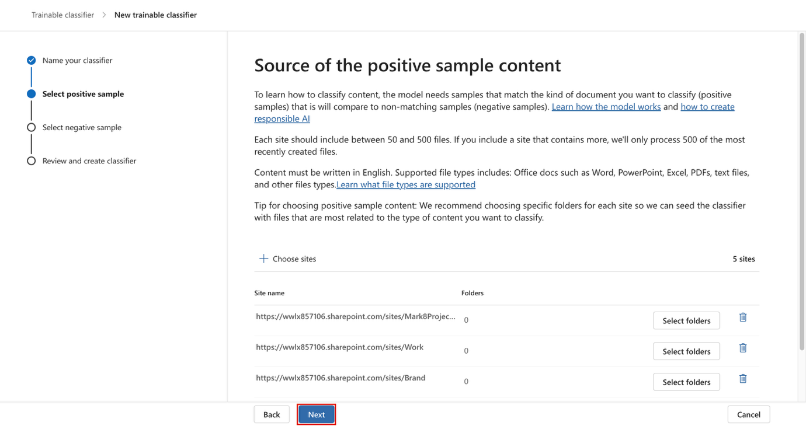
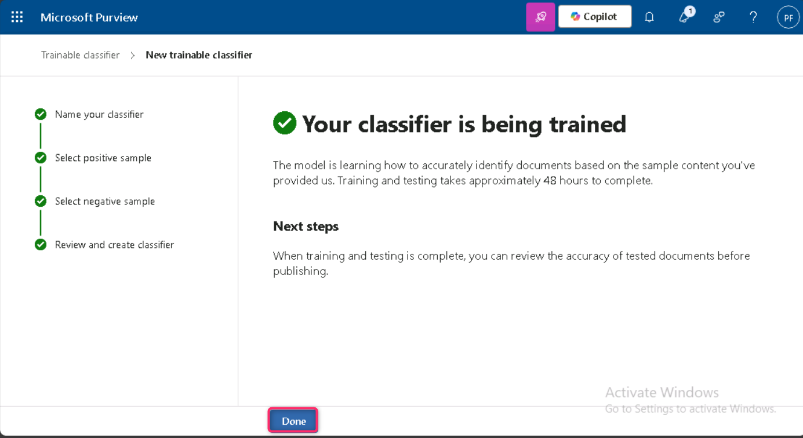

**Lab 3 – 管理可训练分类器**

**介绍**

Contoso Ltd.租户包含一个名为“销售与营销”的SharePoint网站集合，未来将用于存储多份财务相关文件和报告。由于这些文档的性质，你需要创建一个可训练的分类器来识别和标记这些文件。为此，你将激活自定义可训练的分类器，并在实验室中创建一个新的分类器。

**目标**

1.  创建一个可训练的分类器，用于识别和分类存储在选定 SharePoint 站点中的典型数据。

**练习 1 – 创建可训练分类器**

在这项任务中，Patti将创建一个新的可训练分类器，并选择不同的SharePoint站点，以识别Contoso有限公司创建和存储的典型数据。

1.  在 **Microsoft Edge**, 打开**一个  New InPrivate Window**，导航到 **+++[<u>https://purview.microsoft.com+++</u>](https://purview.microsoft.com+++)** 并使用用户名**Patti Fernandez**登录  [**<u>PattiF@WWLxXXXXXX.onmicrosoft.com</u>**](mailto:PattiF@WWLxXXXXXX.onmicrosoft.com) 以及资源标签页中提供的用户密码。

2.  从左侧导航中选择 **Solutions** \> **Data Loss Prevention**.

> 

3.  从左侧面板展开**分类器**。从子导航面板中选择 **Trainable Classifiers **。选择 **+ 创建可训练分类器**以创建新的分类器。

> 

4.  请输入以下信息：

5.  名字: **+++Contoso Company Data+++**

6.  描述: **+++Trainable classifier for company data produced and stored by Contoso Ltd.+++**

7.  选择 **Next**.

> 

8.  选择**“选择网站**”以打开右侧面板。

> 

9.  选择以下 SharePoint 站点并选择**Add**.

    - Brand

    - Digital Initiative Public Relations

    - Work

    - Sales and Marketing

    - Mark 8 Project Team

> 

10. 等待选定的网站出现在列表中，然后选择**“Next**”。

> 

11. 在 **Source of the negative sample content page**, 点击**+ Choose sites**

> 

12. 在**“添加 SharePoint 网站**”面板中，点击“学习”旁边的复选框，然后点击“**添加**”按钮。

> 

13. 点击**“下一个**”按钮。

> 

14. 检查设置并选择 **Create trainable classifier**.

> 

15. 在 **Your trainable classifier is being trained** 页面, 点击**完成**按钮。

> 

所选SharePoint网站中的文档和文件正在被分析，可能需要长达24小时。

**总结:**

在这个实验室里，你通过选择相关的ShareForce站点作为正负内容来源，创建了一个可训练的Microsoft Purview分类器，名为*Contoso Company Data*。该分类器将分析文档以识别公司特定数据，培训时间最长可达24小时。
