**Lab 4 – 创建和管理敏感标签**

**介绍**

Patti Fernandez，Contoso有限公司的信息安全管理员，正在部署现代敏感性标签框架，以加强组织内的数据保护。Patti创建并发布敏感标签组和标签，用于分类和保护内容，包括加密、自动标注和双键加密（DKE）。Patti还将将Microsoft Purview与Microsoft Defender for Cloud Apps集成，扩展数据保护对存储在云端的文件的控制。

**目标:**

1.  启用敏感标签支持

2.  创建标签组

3.  创建儿童标签

4.  发布标签

5.  配置自动标签

6.  为保密内容创建并发布DKE标签

7.  在 Defender for Cloud Apps 中启用 Microsoft Purview 集成

8.  创建一个文件策略来标记外部共享文件

- 

**练习 1 – 启用敏感标签支持**

在此任务中，您将启用敏感标签的共作者功能，同时也启用 SharePoint 和 OneDrive 文件的敏感标签。

1.  你仍然应该用**管理员**账户登录虚拟机。

2.  打开**Microsoft Edge**，然后导航到 https://purview.microsoft.com，并以Patti Fernandes Microsoft名登录Purview。

3.  在左侧导航中，选择 **“Settings \> Information Protection.**

> 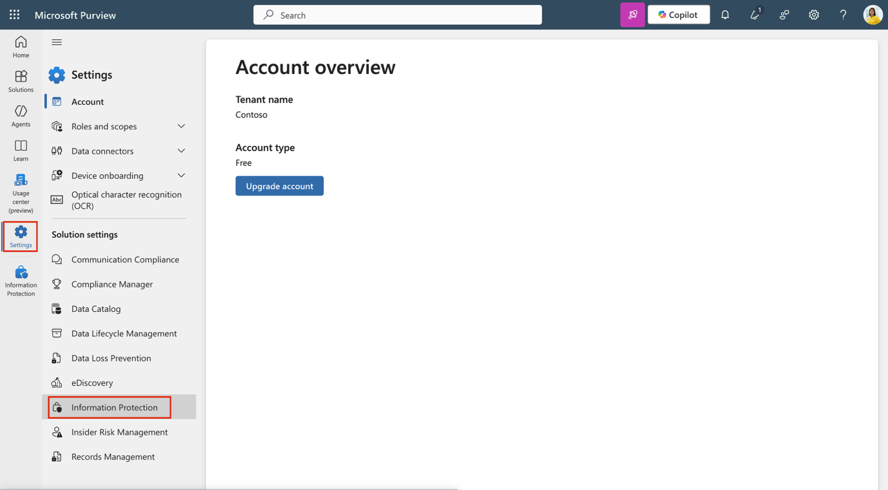

1.  在 ** Information Protection settings **页面，确保你在**“Co-authoring for files with sensitivity labels ”标签下**。

2.  勾选 “T**urn on co-authoring for files with sensitivity labels**. **”复选框**。

> 

6.  在屏幕底部选择**“Apply **。

> 

你已经成功启用了对 SharePoint 和 OneDrive 文件敏感标签的支持。

**练习 2 - 使用灵敏度标签**

**任务 1 – 创建标签组**

在这个任务中，你将创建一个标签组来组织内部敏感性标签。标签组作为相关标签的容器，如部门或业务单元分类。

1.  在 **Microsoft Edge**, 导航至。 https://purview.microsoft.com.

2.  在 Microsoft Purview 门户中，从 左侧侧栏选择 **Solutions** ，然后选择 **Information Protection**。

> 

3.  在 ** Microsoft Information Protection ** 页面的左侧栏，选择 **Sensitivity labels**。

> 

4.  在 **Sensitivity labels** 页面选择 **+  Create \> Label group**。

> 

5.  配置将开始。在**“ Provide basic details for this label group” 中**，输入：

    - **名称**: Internal

    - **显示名称**: Internal

    - **用户简介**: Internal sensitivity label.

    - **管理员简介**: Internal sensitivity label group for Contoso.

6.  选择 **Next**.

> 

7.  在 **Review your settings and finish** 页面, 选择 **Create label group**.

> 

8.  在“ **Your label group was created successfully** **”**页面，选择**“Don't create a label yet**”，然后选择“**Done”**。

> 

你创建了一个内部使用的标签组。该组帮助你管理特定部门或数据类别的相关标签。

**任务 2 – 创建儿童标签**

现在你已经创建了标签组，可以添加一个子标签用于人力资源相关内容。该标签强制加密和内容标记，以保护人力资源数据免受未经授权的访问。

1.  在**敏感度标签**页面，找到**内部**敏感度标签组。选择垂直省略号（**...**然后在下拉菜单**中选择** + **Create label in group**。

> 

2.  **新的敏感性标签**向导将启动。在**“提供本标签基本信息”**页面输入：

    - **名称**: Employee data (HR)

    - **显示名称**: Employee data (HR)

    - **用户简介**: This HR label is the default label for all specified documents in the HR Department.

    - **管理员简介**: This label is created in consultation with Ms. Jones (Head of the HR department). Contact her if you need to change the label settings.

3.  选择 **Next**.

> 

4.  在**定义  Define the scope for this label ** 页面，选择**文件**和**电子邮件**。如果选中了**会议**的复选框，请确保它已取消。

5.  选择 **Next**.

> 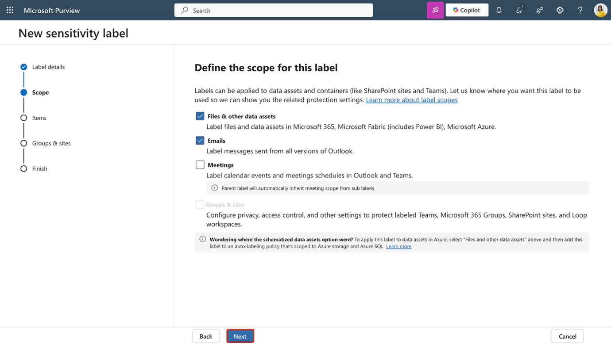

6.  在“ ** Choose protection settings for labeled items** ”页面，选择**“ Control access**”和**“Apply content marking**”选项，然后选择**“Next**”。

> 

7.  在  **Access control** 页面，选择 **Configure access control settings. **。

8.  用这些选项配置加密设置:

    - **Assign permissions now or let users decide?**: 立即分配权限

    - **User access to content expires**: 绝不

    - **Allow offline access**: Only for a number of days

    - **Users have offline access to the content for this many days**: 15

> 

- 选择 **Assign permissions** 链接。 在**“ Assign permissions**”面板中，选择 **+ Add any authenticated users,**，然后选择**“保存**”以应用此设置。

9.  在  **Access control**  页面，选择**“Next**”。

> 

10. 在 ** Content marking ** 页面，选择开关以启用 ** Content marking **。

> 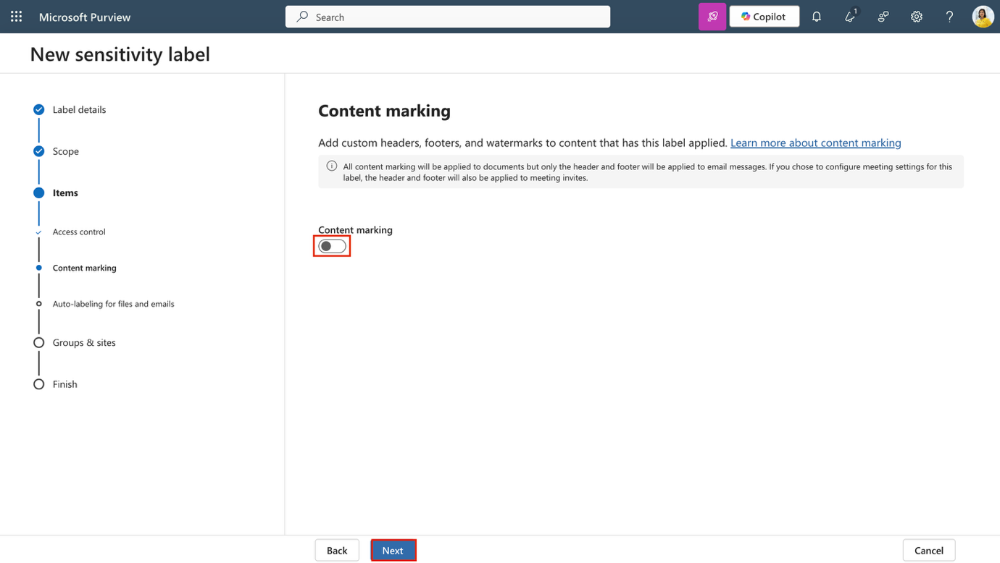

11. 对于以下每种标记类型，选择复选框，然后选择编辑图标输入文本:

| **标记类型**    | **Text**             |
|-----------------|----------------------|
| Add a watermark | INTERNAL USE ONLY    |
| Add a header    | Internal Document    |
| Add a footer    | Contoso Confidential |

12. 选择**Next**.

> 

13. 在  **Auto-labeling for files and emails**页面，选择**“Next**”。

> 

14. **在“ Define protection settings for groups and sites”页面，选择“下一步”。**

> 

15. 在 **“Review your settings and finish**” 页面，选择**Create label**. 。

> 

16. 在 “ **Review your settings and finish**” 页面，选择 **“Don't create a policy yet,**”，然后选择**“完成**”。

> 

你在内部标签组内创建了一个子标签。该标签对人力资源文件进行加密和内容标记，使敏感数据易于识别并受政策保护。

**任务 3 – 发布标签**

接下来，你将从内部标签组发布HR标签，方便HR部门的用户将其应用到文档中。

1.  在 **Microsoft Edge** 中，Microsoft Purview 门户标签页应该仍然开着。如果没有，请访问 <https://purview.microsoft.com>“  **Solutions** \> **Information Protection** \> **Sensitivity labels**. ”。

2.  在 **Sensitivity labels**页面选择 ** Publish labels**。

> 

3.  发布敏感标签配置将开始。

4.  在“ **Choose sensitivity labels to publish”页面**，选择**“Choose sensitivity labels to publish”**链接。

> 

5.  在发布飞出面板 **Sensitivity labels to publish** 中，选择  **Internal/Employee data (HR)**复选框，然后在 飞出页面底部选择添加。

> 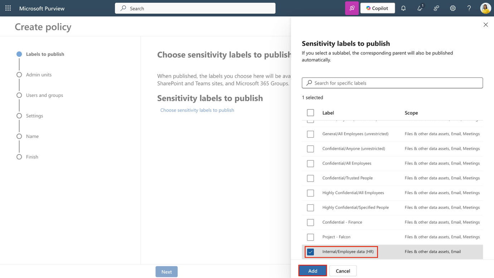

6.  回到**“Choose sensitivity labels to publish”**页面，选择**“下一步**”。

> 

7.  在**“ Assign admin units **”页面，选择**“下一步”**

> 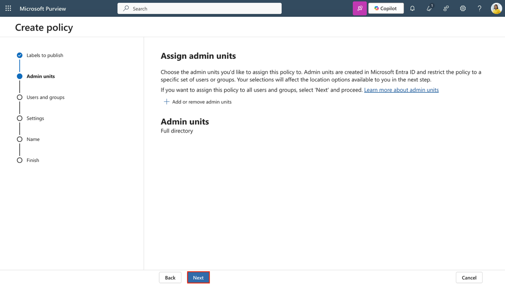

8.  在**“ Publish to users and groups”**页面，选择**“Next**”。

> 

9.  在 **Policy settings ** 页面，选择**“Next**”。

> 

10. 在 ** Default settings for documents 中**选择**“下一步**”。

> 

11. 在 ** Default settings for emails**选择**“下一步**”。

> 

12. 在 **Default settings for meetings and calendar events** 选择 **Next**.

> 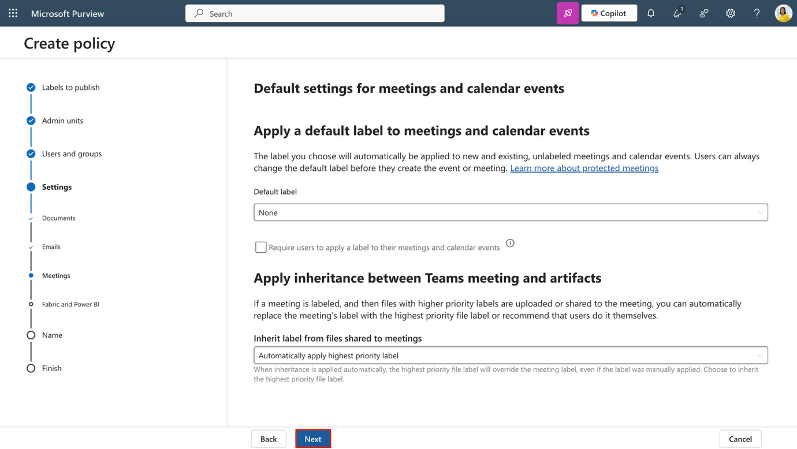

13. 在 **Default settings for Fabric and Power BI content** 页面, 选择**Next**.

> 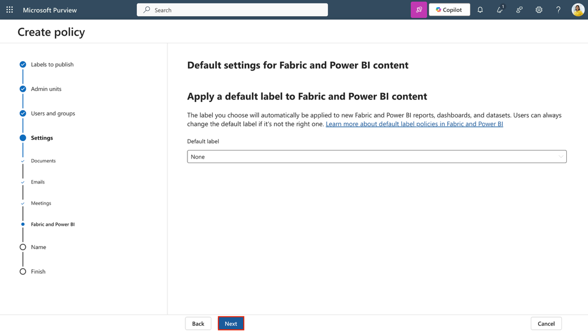

14. 在“**命名你的保单**”页面输入:

    - **Name**: Internal HR employee data

    - **输入敏感标签策略的描述**: This HR label is to be applied to internal HR employee data.

15. 选择**Next**.

> 

16. 在 **Review and finish**”页面，选择**提交**。

> 

17. 在“ **New policy created**”页面，选择**完成**以完成发布你的标签政策。

> 

你已经发布了内部标签组及其人力资源标签，方便用户将它们应用到人力资源文档上。政策在各服务之间传播可能需要长达24小时。

**任务 4 – 配置自动标签**

1.  在Microsoft Purview门户中，选择**“Solutions \> Information Protection \> Sensitivity labels. **”。

2.  在**敏感度标签**页面，找到**内部**敏感度标签。选择垂直省略号（**...**），然后从**下拉菜单中选择+“ Create label in group”。**

> 

3.  在 **Provide basic details for this label** 页面, 输入:

| **Details** | **Text** |
|----|----|
| **名称** | Financial Data |
| **显示名称** | Financial Data |
| **用户简介** | This content contains financial data that must be labeled and protected. |
| **管理员简介** | This label is used for content that includes sensitive financial identifiers. |

4.  选择 **Next**.

> 

5.  在**定义  Define the scope for this label ** 页面，选择**文件**和**电子邮件**。如果选中了**会议**的复选框，请确保它已取消。

6.  选择**Next**.

> 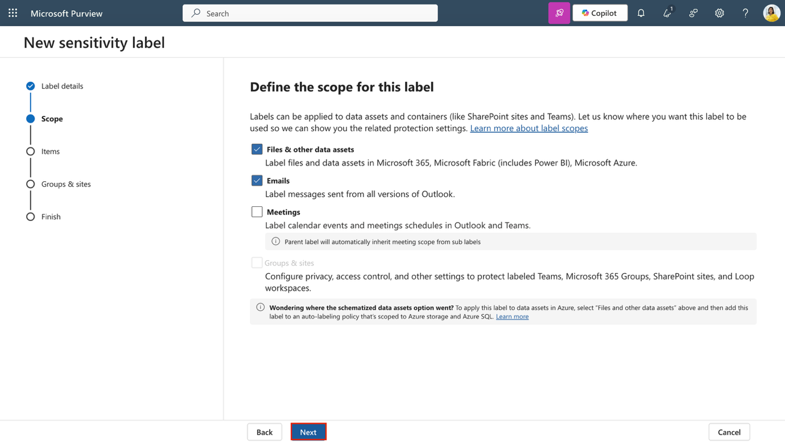

7.  在“ ** Choose protection settings for labeled items **”页面，选择**“下一步**”。

> 

8.  在 “**Auto-labeling for files and emails** ”页面，将**文件和邮件的自动标签**设置为启用。

> 

9.  在**“  Detect content that matches these conditions** ”部分，选择 **+ Add condition** \> **Content contains**. 

> 

10. 在**“ Content contains**”部分，选择 ** Add \> Sensitive info types. **。

> 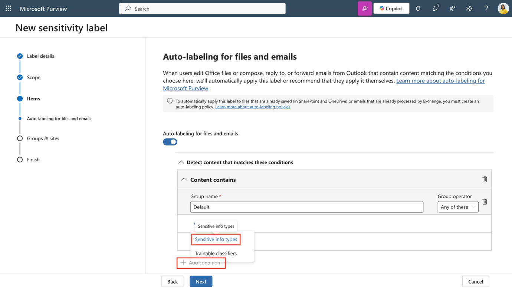

11. 在**敏感信息类型**飞出页面，搜索并选择以下敏感信息类型：

    - Credit Card Number

    - ABA Routing Number

    - SWIFT Code

12. 选择 **Add**.

> 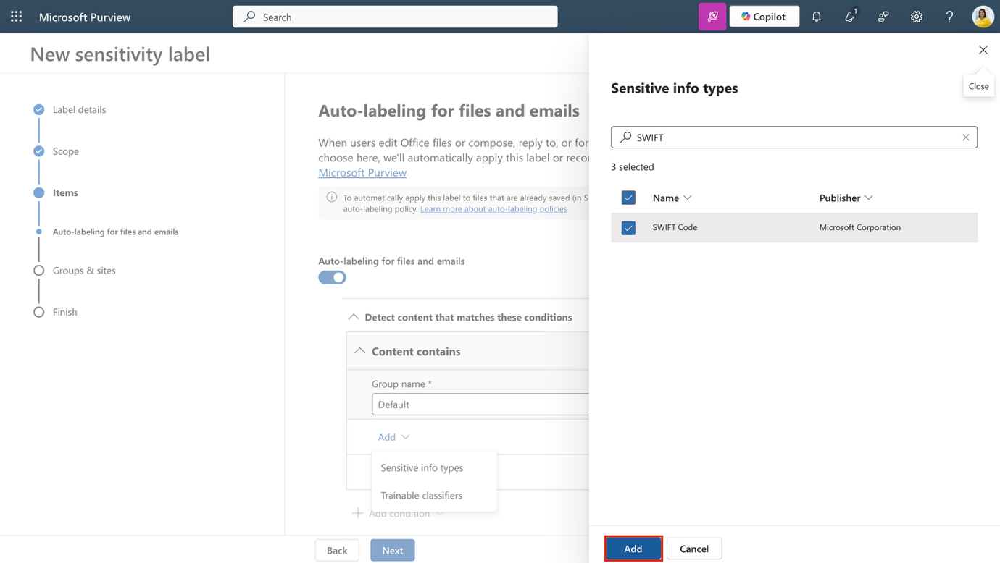

13. 回到**“Auto-labeling for files and emails **”页面，选择**“下一步**”。

> 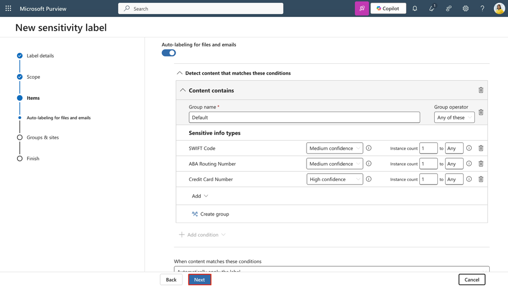

14. 在 “ **Define protection settings for groups and sites**”页面，选择**“下一步**”。

> 

15. 在**“ Review your settings and finish**”页面，选择 **Create label.**。

> 

16. 在“ **Your sensitivity label was created ”**页面，选择**“Automatically apply label to sensitive content,**”，然后选择**“完成**”。

> 

17. 在 ** Create auto-labeling policy**的跳板页面，选择**审查政策**。

> 

18. 在“N**ame your auto-labeling policy**”页面，保留默认选项，然后选择**“下一步**”。

> 

19. 在**“ Choose a label to auto-apply **”页面，检查是否选择*了内部/财务数据*标签，然后选择**“下一步**”。

> 

20. 在**“ Assign admin units **”页面，选择**“下一步**”。

> 

21. 在“ **Choose locations where you want to apply the label** **”**页面，选择以下选项:

    - Exchange email

    - SharePoint sites

    - OneDrive accounts

22. 选择 **Next**.

> 

23. 在 **Set up common or advanced rules** 页面, 保持默认的**通用规则**为选项，然后选择**“下一步**”。

> 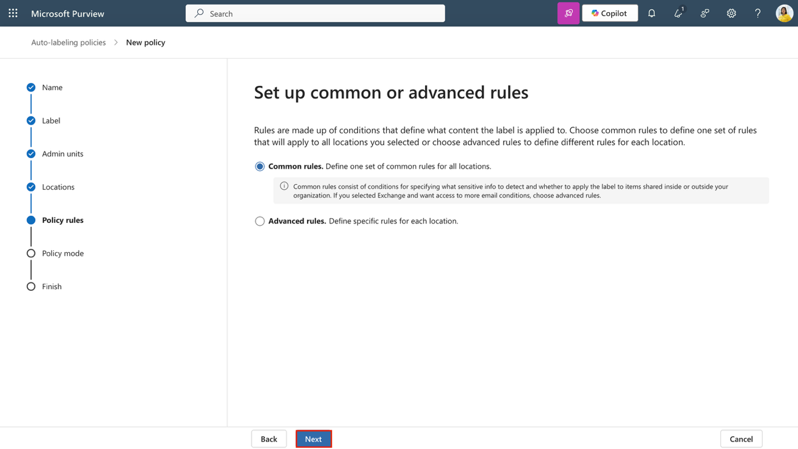

24. 在 “ **Choose locations where you want to apply the label** ”页面，展开“财务*数据规则*”以确保预期规则的定义，然后选择**“下一步**”。

> 

25. 在“**Additional settings for email**”页面，选择**“下一步**”。

> 

26. 在 **“ Decide if you want to test out the policy now or later**” 页面，选择**在 Run policy in simulation mode**，并勾选**“ Automatically turn on policy if not modified after 7 days in simulation “。**

> 

27. 选择 **Next**.

> 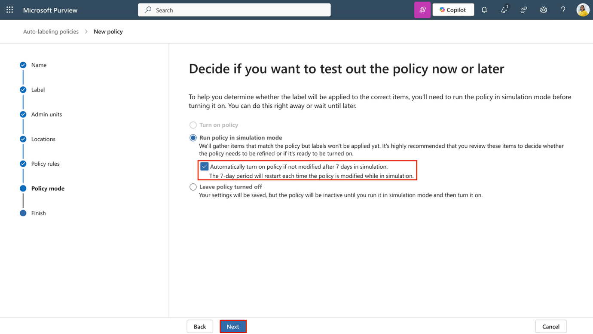

28. 在“ **Review and finish** ”页面，选择 ** Create policy**。

> 

29. 在“ **Your auto-labeling policy was created”页面**，选择**“完成**”。

你已经为财务数据创建了子标签，并配置了一个自动标签策略，用于检测和标记包含金融信息的内容。

**任务 5 – 为保密内容创建并发布DKE标签**

接下来，你将在内部组创建一个子标签，使用双密钥加密（DKE）和动态水印保护机密法律内容。

1.  在**Microsoft Edge**中，导航到 https://purview.microsoft.com 并以 **Patti Fernandes** 的身份登录Microsoft Purview门户 。

2.  在Microsoft Purview门户中，选择 **“Solutions \> Information Protection \> Sensitivity labels. **”。

3.  在 ** Sensitivity labels** 页面，找到**内部**敏感度标签组。选择垂直省略号（**...**），然后从下拉菜单**中选择**+ **Create label in group** 标签。

> 

4.  在**“ Provide basic details for this label”**页面，输入:

| **Details** | **Text** |
|----|----|
| **Name** | Confidential Legal |
| **Display name** | Confidential Legal |
| **Description for users** | Use this label for highly sensitive legal content that must be encrypted using Double Key Encryption. |
| **Description for admins** | Label configured with DKE and dynamic watermarking for highly sensitive legal content. |

5.  选择 **Next**.

> 

6.  在 ** Define the scope for this label** 页面，选择**文件**和**电子邮件**。如果选中了**会议**的复选框，确保它已取消，然后选择**“下一步**”。

> 

7.  在“ **Choose protection settings for the types of items you selected**”页面，选择 ** Control access**，然后选择**“下一步**”。

> 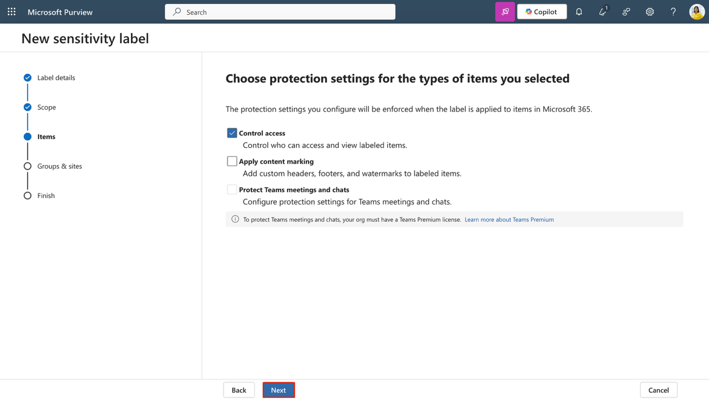

8.  在访问**控制**页面，选择 **Configure access control settings**。

> 

9.  用这些选项配置加密设置:

    1.  **现在就分配权限，或者让用户自行决定?**: Assign permissions now

    2.  **用户对内容的访问会过期**: A number of days after label is applied

    3.  **标签贴上后，访问权限会在这几天内失效**: 5

    4.  **允许离线访问**: Never

    5.  选择**“Assign permissions**”链接。在**“ Assign permissions**”面板上，选择 **+ Add users or groups**。

> 

- 在“ **Add users or groups**” 跳出页面，搜索并选择法律团队和帕蒂·费尔南德斯，然后选择**添加**。

> 

- 在**“ Assign permissions**”页面，选择**保存**。

> 

10. 回到 ** Access control ** 页面，选择“ **Use dynamic watermarking”的复选框**，然后选择**“Customize text (optional)”。**

> 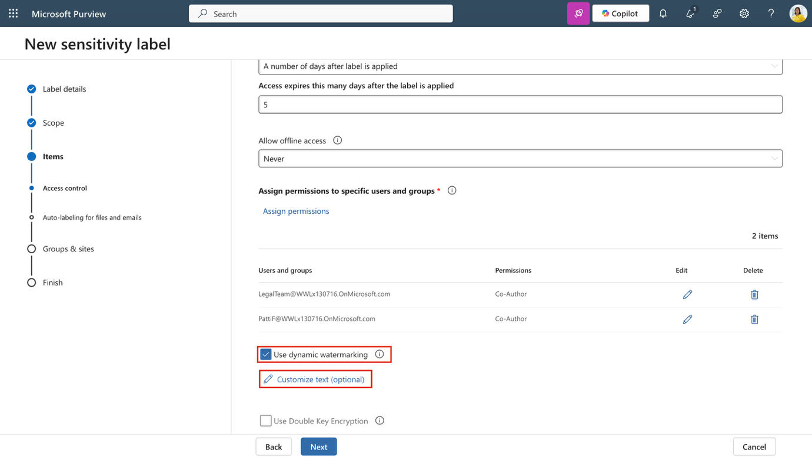

11. 在**“ Add custom text to watermark (optional)** 页面，输入“Confidential”，然后选择**UPN**和**时间戳**。

12. 在飞出页面底部**选择**保存。

> 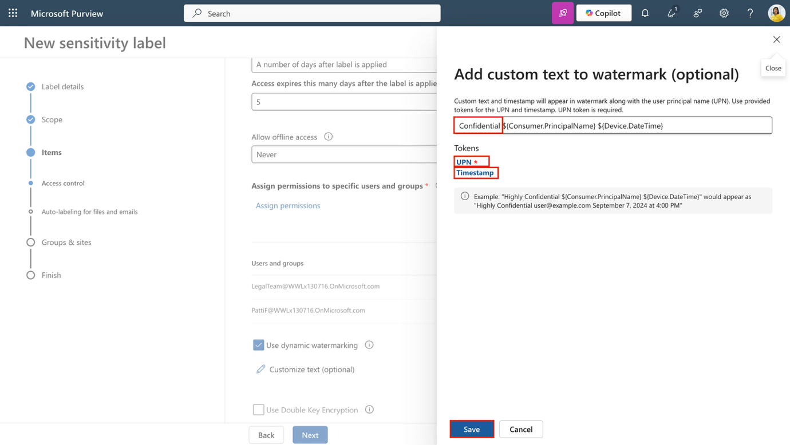

13. 回到 **Access control** 页面，选择“ **Use Double Key Encryption**,**”的复选框**，并输入 https://testingdke1.azurewebsites.net/Test 作为双密钥加密服务的URL。

14. 选择 **Next**.

> 

15. 在  **Auto-labeling for files and emails** 页面，选择**“下一步**”。

> 

16. 在“ **Define protection settings for groups and sites** ”页面，选择**“下一步**”。

> 

17. 在**“ Review your settings and finish**”页面，选择 **Create label**。

> 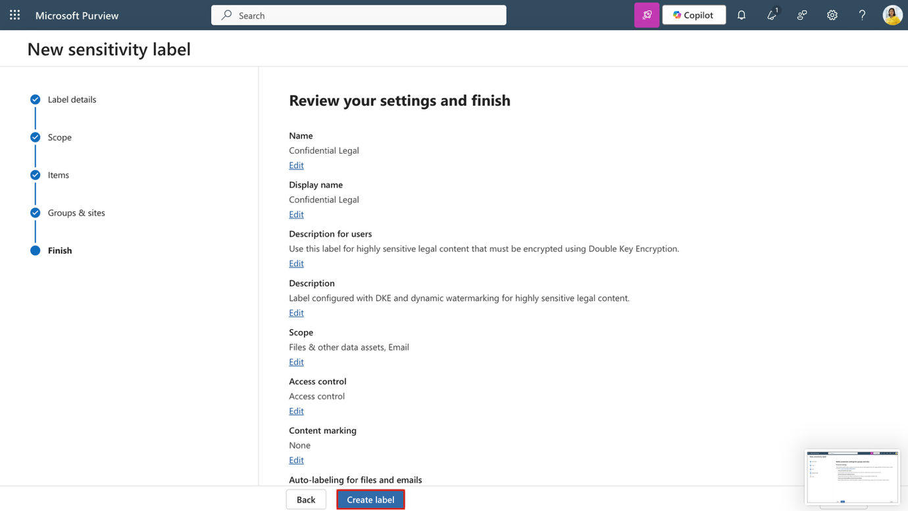

18. 在 “**Your sensitivity label was created**”页面，选择 **Publish label to users' apps**,”，然后选择**“完成**”。

> 

19. 在 ** Publish label ** 跳出页面，选择 **Create new label policy**。

> 

20. 在“ ** Choose sensitivity labels to publish”** 页面，选择**“ Choose sensitivity labels to publish”**并添加 ** Internal/Confidential Legal 标签，然后选择 Add**。

> 

21. 选择 **Next**.

> 

22. 在**“  Assign admin units**”页面，选择**“下一步**”。

> 

23. 在**“Publish to users and groups”**页面，保持默认选项，然后选择**“下一步**”。

> 

24. 在 ** Policy settings**页面，选择 **“Users must provide a justification to remove a label or lower its classification” 的复选框**，然后选择**“下一步**”。

> 

25. 在“ **Default settings for documents​** ”页面，选择**“下一步**”。

> 

26. 在 ** Default settings for emails**页面，选择**“ Next**”。

> 

27. 在 ** Default settings for meetings and calendar events**页面，选择**“下一步**”。

> 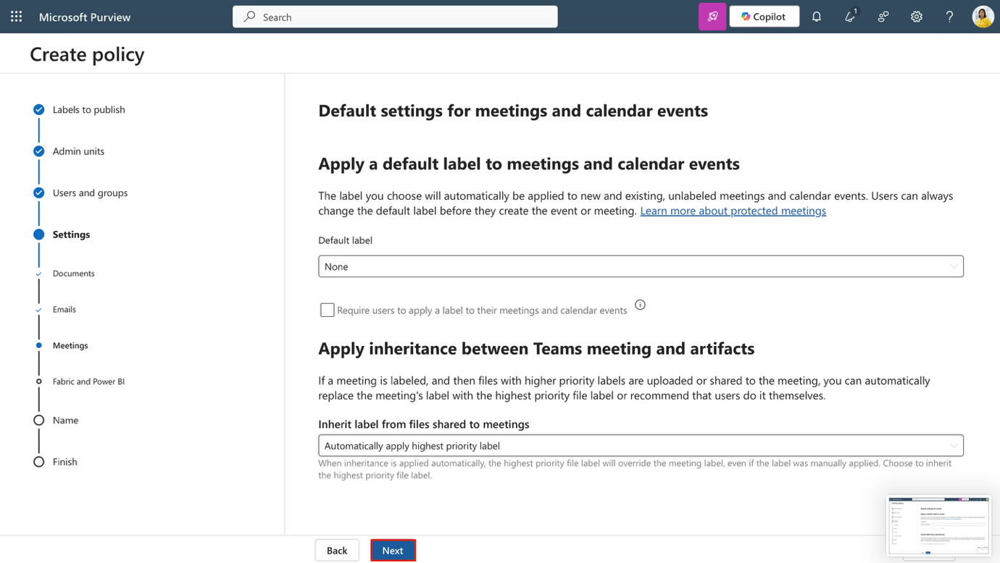

28. 在  **Default settings for Fabric and Power BI content​** 页面，选择**“下一步**”。

> 

29. 在“ **Name your policy**”页面输入:

    1.  **Name**: Confidential Legal

    2.  **Description**: Enables manual use of the DKE label for confidential content accessible by Legal.

30. 选择 **Next**.

> 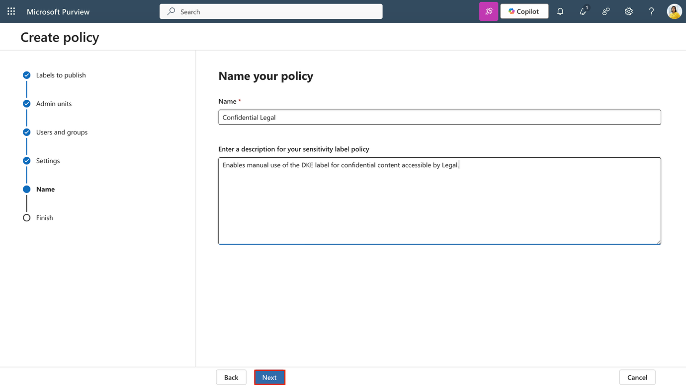

31. 在**“审核与完成**”页面，选择 **Submit**。

> 

32. 在“ **New policy created**”页面，选择**“完成**”。

> 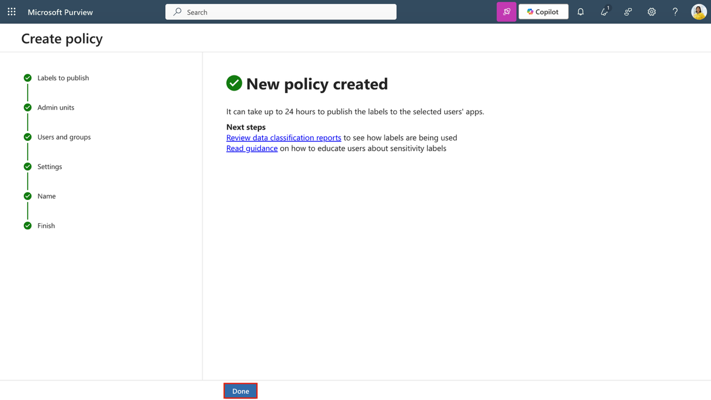

你创建并发布了一个使用双密钥加密和动态水印的子标签。该标签限制授权用户访问，并强制要求降级分类。

**练习 3 - 使用标签与 Microsoft Purview 的文件策略**

**任务 1 – 在 Defender for Cloud Apps 中启用 Microsoft Purview集成**

在创建并发布敏感标签后，你现在将将 Microsoft Purview 与 Microsoft Defender for Cloud Apps 集成。该集成使 Defender 能够扫描文件中的敏感标签并实施文件监控。

1.  打开**Microsoft Edge**，然后**通过导航到** https://security.microsoft.com 进入Microsoft Defender。

2.  在左侧导航中，选择**设置**，然后选择**云应用**。

> 

3.  在左侧面 **Information Protection**部分，选择**Microsoft Information Protection**。

> 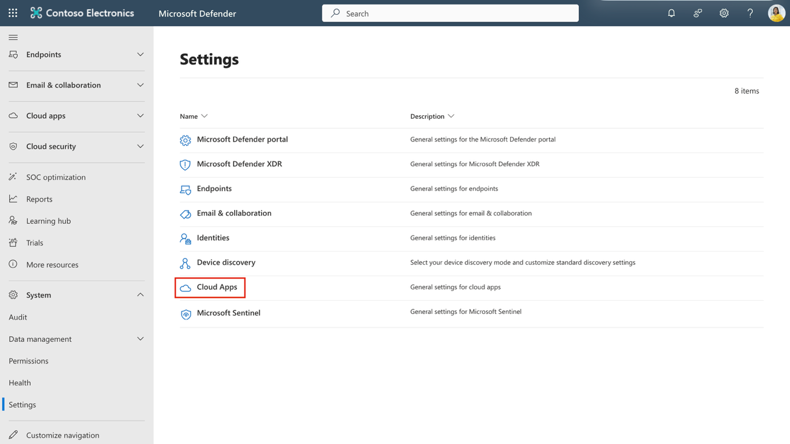

4.  在  **Microsoft Information Protection** 页面上，选择该页面提供的两个复选框。

    - **自动扫描新文件，以检测Microsoft信息保护敏感标签和内容检查警告**

> 使Defender for Cloud Apps能够自动扫描新建或修改文件，以检测敏感性标签和内容检查警告，这些文件来自Microsoft Purview。

- **仅扫描该租户文件中的Microsoft信息保护敏感标签和内容检查警告**

> 扫描限制在你自己组织内创建的标签和警告。外部租户贴上的标签将被忽略。

5.  选择**保存**以应用设置。

> 

6.  在左侧面板的 **Information Protection**部分，选择**文件**。

> 

7.  在文件 页面，选择 ** Enable file monitoring**。

> 

8.  选择**保存**以应用设置。

> 

你已在 Defender for Cloud Apps 中启用了 Microsoft Purview 集成。Defender 现在可以检测敏感标签，并监控文件以进行策略评估和治理作。

**任务 2 – 创建一个文件策略来标记外部共享文件**

最后，你会创建一个文件策略，自动对外部共享的文件应用敏感性标签。这确保了敏感内容即使在组织外共享也能受到保护。

1.  在 **Microsoft Defender** 中，导航到  **Cloud apps** \> **Policies** \> **Policy management**. 。

> 

2.  选择**“ Information protection**”标签，然后选择 **Create policy \> File policy. **。

> 

1.  在**创建文件策略**页面，配置:

    - **Policy name**: Auto-label externally shared files

    - **Policy severity**: **High**

    - **Category**: **DLP**

    <!-- -->

    - 在**符合以下所有部分的档案中**：

      - 对于第一个过滤器，将下拉菜单配置为：**Access level equals external **

      - 第二个筛选器，将下拉菜单设置为：**Last modified after (date) ，**并使用今天日期

> 

- 在**治理作中**，扩展 **Microsoft OneDrive for Business**：

  - 选择“ **Apply sensitivity label”的复选框**

  - 在下拉菜单中选择 ** Highly Confidential-Specified People**

> 

- 对 **Microsoft SharePoint Online**  **重复同样的流程**

  - 选择“ **Apply sensitivity label** **”的复选框**

  - 从下拉菜单**中选择**  **Apply sensitivity label** 

> 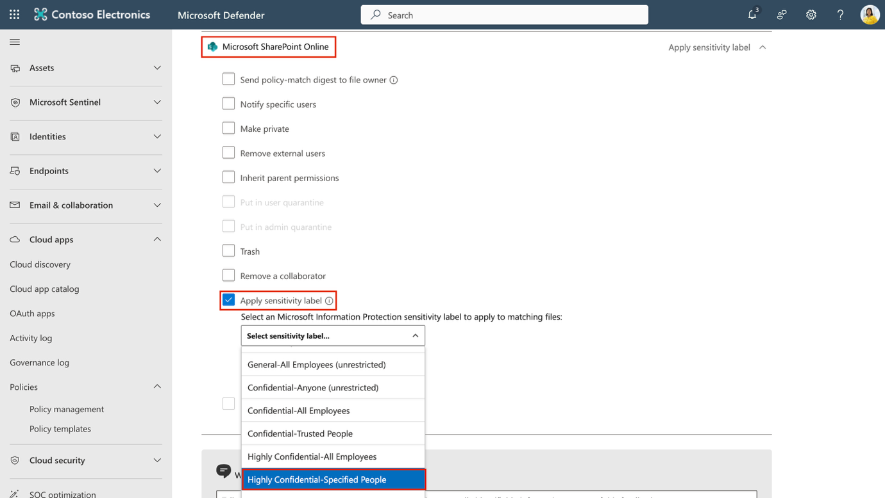

2.  选择**创建**以完成文件策略的创建。

> 

你创建了一个文件策略，对外部共享的文件应用敏感标签。该政策将您的信息保护策略扩展到云存储内容。

**总结**

在这个实验室中，你扮演了Contoso有限公司的系统管理员Patti Fernandez，并利用Microsoft Purview敏感性标签实现了信息保护。你在 SharePoint 和 Teams 中启用了使用 PowerShell 的敏感标签支持，创建并发布了一个内部标签和一个针对人力资源的子标签，并在 Word 文档和 Outlook 邮件中应用了这些标签。你还为德国特有的GDPR相关内容创建并发布了自动标记敏感标签。这些步骤确保人力资源和监管文件在组织内部得到妥善分类和保护。
