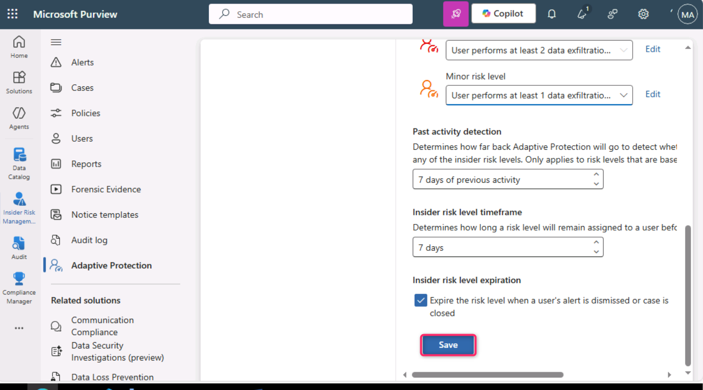
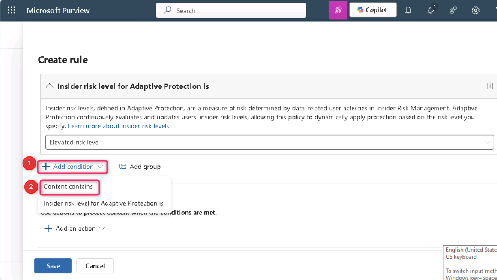
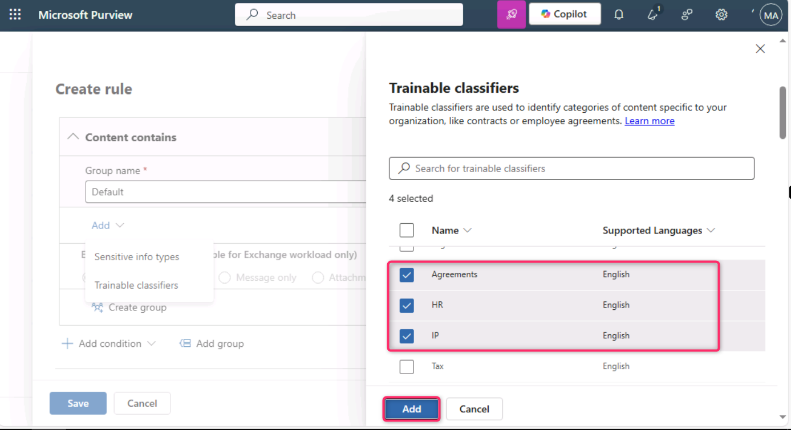
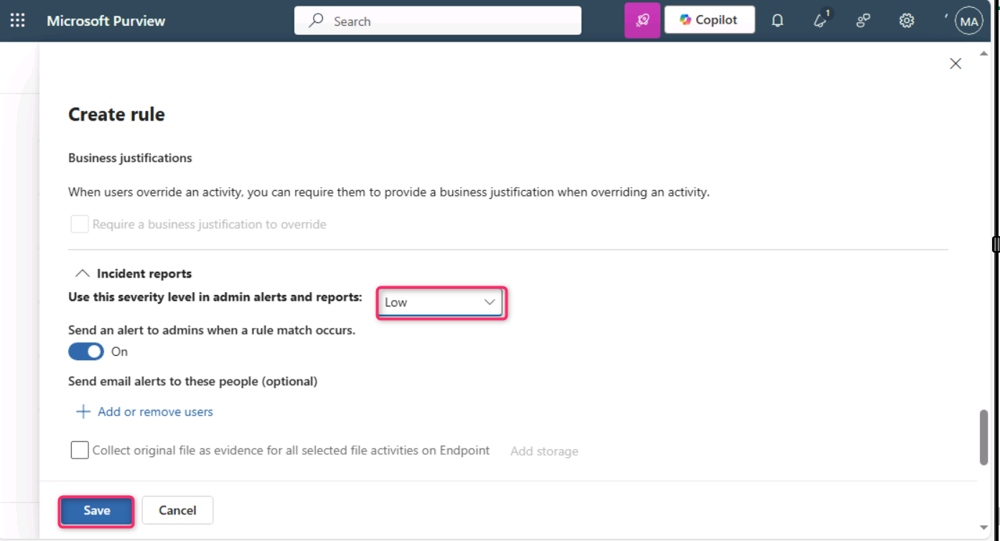
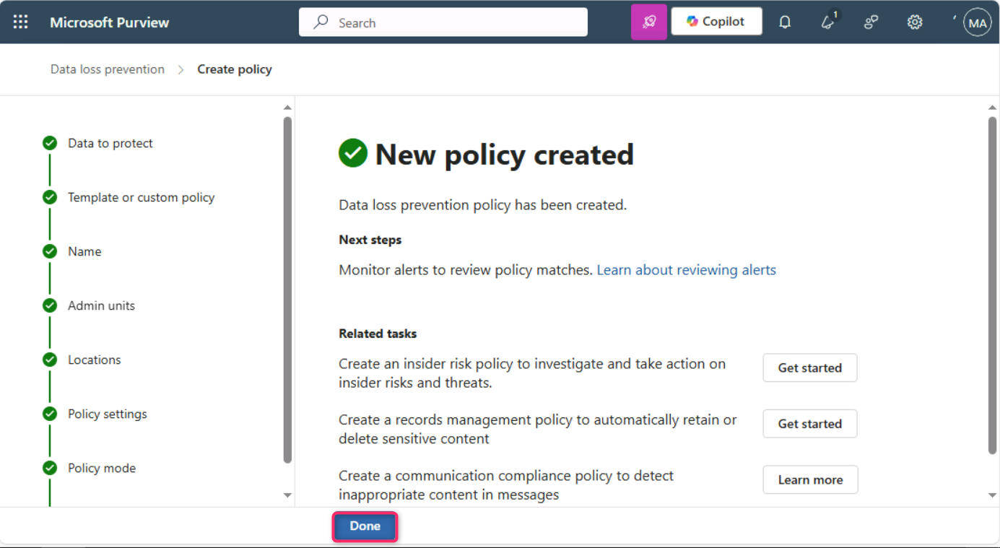

**Lab 5 – 探索自适应保护的能力**

**介绍**

Microsoft Purview 中的自适应保护将 Microsoft Purview 内部风险管理与 Microsoft Purview 数据丢失防护（DLP）集成。当内部风险识别出从事风险行为的用户时，该用户会被动态分配到内部风险级别。然后，自适应保护可以自动创建DLP策略，帮助保护组织免受与该内部风险等级相关的风险行为。

**目标**

1.  在内部风险管理中设定自适应保护的风险阈值。

2.  创建并配置定制的终端防护DLP策略。

3.  使用可训练的分类器和内部风险水平定义条件。

4.  采取措施阻止高风险数据泄露活动。

5.  启用该政策以便立即执行。

**练习 1 – 建立自适应防护**

**任务 1 – 为适应性防护设定风险等级**

1.  在普通窗口中打开Microsoft Edge浏览器标签，使用**MOD adiminstrator**凭证登录Microsoft Purview门户，进入 **Solutions \> Insider risk management.**。

> 

2.  在 ** Insider Risk Management** 左侧面板中，点击 “**Adaptive Protection**”。

> 

3.  在**“Adaptive Protection **”页面，点击“**内部人员风险等级**”。然后，进入**内部风险保单部分，点击“**选择保单**”旁的下拉菜单**。导航并选择**Data leaks by a user**旁的复选框。

> 
>
> 

4.  在**内部风险等级条件**下，选定用户至少执行3项数据窃取活动，每次......针对**高风险级别**领域。选择用户至少执行两次数据外泄活动，每次......中**等风险级别**领域。选择用户至少执行一项数据窃取活动，每项......针对**轻微风险**级别领域。然后向下滚动，选择**保存**按钮。

> 

5.  点击**保存**按钮。

> 

**任务 2 – 为端点创建自定义自适应保护 DLP 策略**

1.  在**自适应保护**页面中，点击“ **Data Loss Prevention**，然后点击**“+ Create policy**”。

> 

2.  在 ** Choose what type of data to protect**类型页面时，确保 ** Data stored in connected sources **”单选按钮。

> 

3.  在 **Template or custom policy** 页面的**Categories **部分，选择**自定义**，然后在**Regulations 中**点击 **Custom policy**。

> 

4.  在“ **Namee your DLP policy** ” 页面，**“Name**”字段，输入“终端自定义策略”。

> 

5.  在**“ Assign admin units**”页面，点击**“下一步**”按钮。

> 

6.  在 ** Choose where to apply the policy **页面，点击**“下一步**”按钮。

> 

7.  在**“Define policy settings **”页面，点击**“Next **”按钮。

> 

8.  在**“Customize advanced DLP rules**”页面，点击**+  Create rule. **。

> 

9.  在“** Create rule**”字段中输入 Adaptive Protection block rule for Endpoint DLP

> 

10. 点击“**Select one or more risk levels”**下的拉菜单，并在“**Elevated risk level”**旁勾选复选框

> 

11. 点击“**Add condition”旁边的下拉菜单**，然后选择**“ Content contains. **”。

> 

12. 在“ **Content contains**”部分，点击添加旁边的下拉菜单，选择 ** Trainable classifiers. **。

> 

13. 在右侧的 ** Trainable classifiers **面板中，导航并选择**源代码**、**协议**、**人力资源**和**IP**旁的复选框，然后点击添加 按钮

> 
>
> 

14. 在**“Actions **”部分，点击**“Add an action**”旁边的下拉菜单，选择**“ Audit or restrict activities on devices.**”。

> 

15. 选择**“Copy to clipboard, Copy to a removable USB device, Copy to a network share, and Print**..

> 

16. 在 **Incident reports**部分，在**Use this severity level in admin alerts and reports **字段，从下拉菜单中选择**“低**”。然后，点击**保存**按钮。

> 

17. 点击**“下一个**”按钮。

> 

18. 在** Policy mode** 页面，选择“ **Turn the policy on immediately**,**” 旁的单选按钮**，然后点击**“下一步**”按钮。

> 

19. 在**“ Review and finish**”页面，点击**提交**按钮。

> 

20. 在 ** New policy created** 页面，点击**“已完成**”按钮。

> 

**总结**

在本练习中，你首先根据数据泄露活动阈值定义了内部风险等级，从而在 Microsoft Purview 中配置了自适应防护。随后，您为终端设备创建了自定义的数据丢失防护（DLP）策略，利用自适应保护在检测到风险升高时自动限制活动，如复制到USB或打印。该政策通过可训练分类器针对敏感内容，并根据内部风险等级采取严格措施，以减轻潜在的数据泄露。
