**实验6 – 创建和管理DLP策略**

**介绍**

您是Patti Fernandez，Contoso Ltd.新聘的合规管理员，负责配置公司的Microsoft 365租户以实现数据丢失预防。Contoso有限公司是一家在美国提供驾驶培训的公司，您需要确保敏感客户信息不会流出组织。

**目标**

1.  在 Microsoft Purview 中创建并测试 DLP 策略。

2.  用PowerShell管理DLP设置。

3.  在 Defender for Cloud Apps 中启用文件监控并创建文件策略。

4.  为Power Platform实现DLP以控制数据流。

- 

**练习 1 – 制定DLP策略**

**任务 1 – 在测试模式下创建DLP策略**

在本练习中，您将在 Microsoft Purview 门户中创建数据丢失防护策略，以保护敏感数据不被用户共享。您创建的DLP政策将告知用户是否愿意分享包含信用卡信息的内容，并允许他们提供发送这些信息的理由。该策略将在测试模式下实现，因为你不希望封锁动作影响到你的用户。

1.  在**Microsoft Edge**中，导航到 https://purview.microsoft.com，确保你以**Patti Fernandez的身份登录**Microsoft Purview**门户**。

2.  在**Microsoft Purview**门户的左侧导航窗格中，选择**“解决方案**\>**数据丢失预防**”。

> 

3.  在**  Data loss prevention 中**，选择**“策略**”，然后选择**“+创建策略**”以启动创建新的数据丢失预防策略的向导。

<!-- -->

1.  

> 

4.  **在What info do you want to protect? ？** 面板，选择 **Enterprise applications and devices. **

> 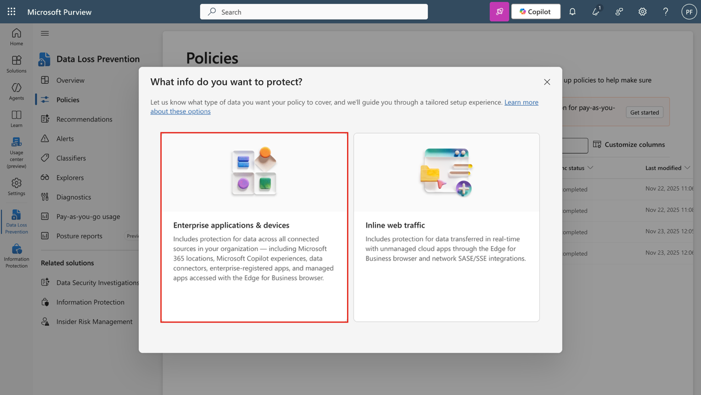

5.  在**“ Start with a template or create a custom policy**”中，向下滚动，在“类别**”中选择**“自定义**”。** 然后，在**法规**中**选择定制保单**。点击**“下一个**”按钮。

> 

6.  在“**命名你的DLP政策**”页面， 在名称**栏输入“信用卡DLP政策**”，并“保护信用卡号码防止被共享”。 在**描述**字段中。选择**下一步**。

> 

7.  在**“Assign admin units**”页面，选择**“下一步**”。

> 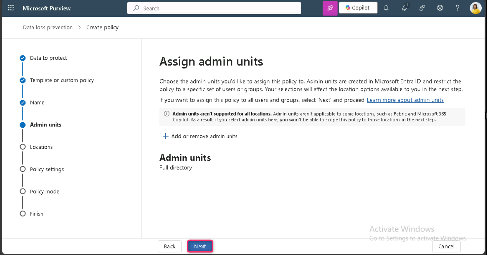

8.  在“ **Choose where to apply the policy **”页面，勾选 **Teams 聊天和频道消息**旁的复选框，取消其他资源旁的复选框，然后点击**“下一步**”按钮。

> 

9.  在**“ Define policy settings**”页面，确保**选择“ Create or customize advanced DLP rules **”单选按钮，然后点击**“下一步**”按钮。

> 

10. 在**“ Customize advanced DLP rules**”页面，选择**+ Create rule**。

> 

11. 在创建**规则**页面，输入**“名称**”字段。

> 

12. 在**创建规则页面**的**条件**中，选择**+ Add condition**，并从 **下拉菜单中选择Content is shared from Microsoft 365**。

> 

13. 在新的“** Content is shared from Microsoft 365** 的部分， 选择**with people outside my organization**。

> 

14. 选择 **+ Add Condition**，然后 **从下拉菜单**中选择“内容包含”。

> 
>
> 15． 在新的**“Content contains **”区域，选择**添加**并从 **下拉菜单中选择** **ensitive info types** 。
>
> 

16. 在**右  Sensitive info types**面板中，输入信用卡号并按下回车键。选择信用卡号旁的复选框，然后选择**添加**按钮。

> 

17. 在 **Create rule**页面，选择 **+  Add an action **，选择 **Restrict access or encrypt the content in Microsoft 365 locations. **

> 

18. 在**“限制访问或加密 Microsoft 365 地点内容”**部分，确保**选择“阻止用户接收邮件或访问共享的 SharePoint、OneDrive 和 Teams 文件，以及 Power BI 项目”**单选按钮，然后确保“**仅屏蔽组织外人员”**单选按钮。

> 

19. 在**创建规则**页面的用户**通知**部分，选择开关将其置于**开机**状态。

> 

20. 在**创建规则**页面的“**用户覆写”**部分，在**“允许 M365 服务覆盖”下**，勾选**“允许 M365 服务覆盖”框。允许Exchange、SharePoint、OneDrive和Teams的用户覆盖政策限制。**

> 

**注意**：如果您无法选择“**允许从M365服务覆盖”复选框，请在Office 365中启用“通知用户”**复选框**，该策略提示**可在上一步“**创建规则**页面**的用户通知\>\Microsoft\> 365服务**部分找到。然后选择**“允许覆盖 M365 服务”的复选框。允许Exchange、SharePoint、OneDrive和Teams的用户覆盖政策限制。**

21. 勾选**“需要商业理由才能推翻**”选项。

> 

22. 在**事件报告**部分，在“**使用管理员警报和报告中的此严重程度级别”**下拉菜单中，选择**“低**”。

> 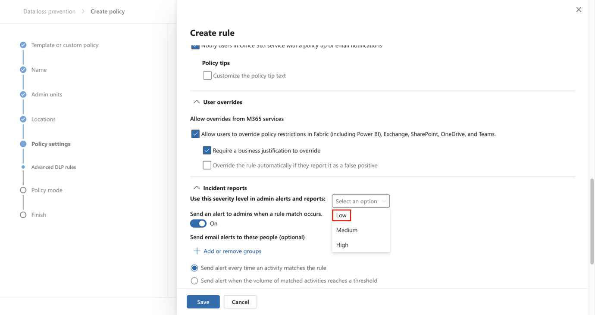

23. 选择**保存**，然后选择**下一步**。

> 
>
> 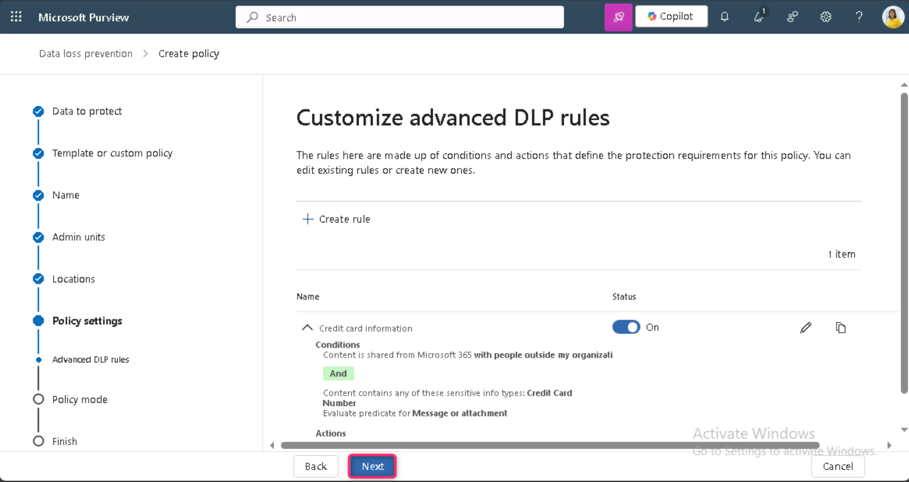

24. 在**策略模式**页面，确保**选择“在模拟模式下运行策略**”单选按钮，并勾选“测试**模式时显示策略提示**”旁的复选框。然后，点击**“下一步**”按钮。

> 

25. 选择**提交**以创建政策。

> 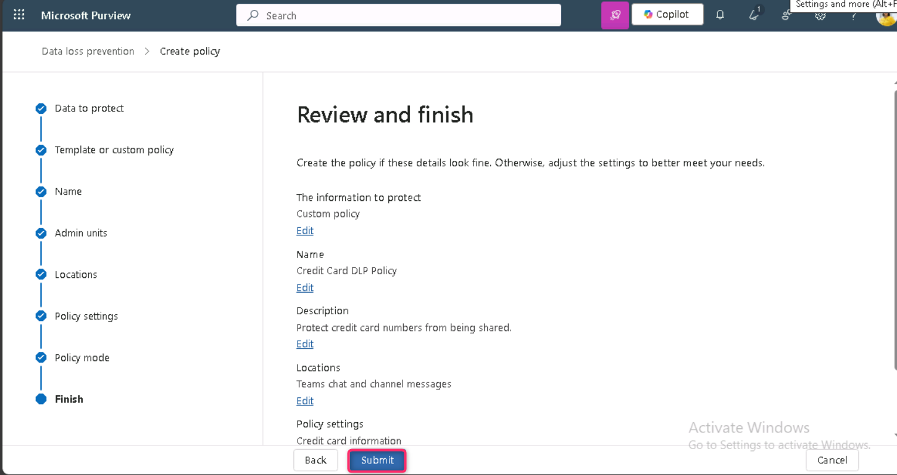

26. 创建完策略后，选择**“完成**”。

> 
>
> 你现在创建了一个DLP策略，扫描Microsoft Teams聊天和频道中的信用卡号码，并允许用户提供商业理由来覆盖该策略。
>
> 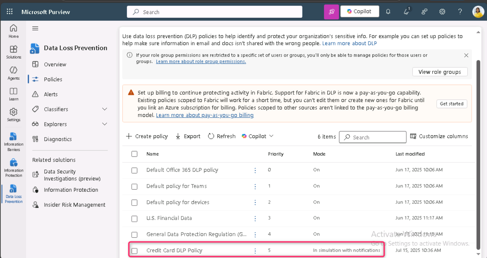

**任务 2 – 修改DLP策略**

在此任务中，您将修改前一步创建的现有DLP策略，同时扫描电子邮件中的信用卡信息，并告知用户是否希望通过电子邮件分享这些内容。

1.  点击“信用卡DLP政策**”旁的复选框**，然后点击命令栏中的**“编辑**”图标，如下图所示.

> 

2.  在“**命名你的DLP策略**”和**“分配管理单元**”页面，选择**“下一步**”。

> 
>
> 

2.  在“ ** Name your DLP policy 和  Assign admin units ”**页面，选择**“下一步**”，

> 

3.  Select **Submit** to apply the change you made in the policy.

> 

4.  策略更新后，选择**“完成**”按钮。

> 

你现在修改了现有的DLP策略，并更改了它扫描内容的位置.

**任务 3 – 在PowerShell中创建DLP策略**

在这个任务中，你需要使用PowerShell创建DLP策略，保护Contoso的员工ID并防止它们在Exchange中被共享。用户将被告知他们正在尝试分享敏感数据，如果邮件中包含Contoso员工ID，将被阻止发送。

1.  右键点击任务栏上的Windows图标，选择Windows PowerShell（管理员）以管理员身份运行。

> 

2.  在**用户账户控制**对话框中，点击**“是”按钮**。

> 

3.  在PowerShell中执行以下命令:

> Install-Module ExchangeOnlineManagement
>
> Import-Module ExchangeOnlineManagement
>
> 
>
> 

4.  在**PowerShell**窗口中输入Connect-IPPSSession，然后以**Patti Fernandez登录。**

> 
>
> 

如果，**自动登录该设备上的所有桌面应用和网站？** 对话框出现，然后点击**“否，仅此应用”按钮。**

> 
>
> 

5.  在PowerShell中输入以下命令，创建一个DLP策略，扫描所有Exchange邮箱：

> New-DlpCompliancePolicy -Name "EmployeeID DLP Policy" -Comment "This policy blocks sharing of Employee IDs" -ExchangeLocation All
>
> 

6.  在PowerShell中输入以下命令，为你在前一步创建的DLP策略添加DLP规则：

> New-DlpComplianceRule -Name "EmployeeID DLP rule" -Policy "EmployeeID DLP Policy" -BlockAccess \$true -ContentContainsSensitiveInformation @{Name="Contoso Employee IDs"}
>
> 
>
> 

7.  请使用以下命令来复查**EmployeeID DLP rule**:

> Get-DLPComplianceRule -Identity "EmployeeID DLP rule"
>
> 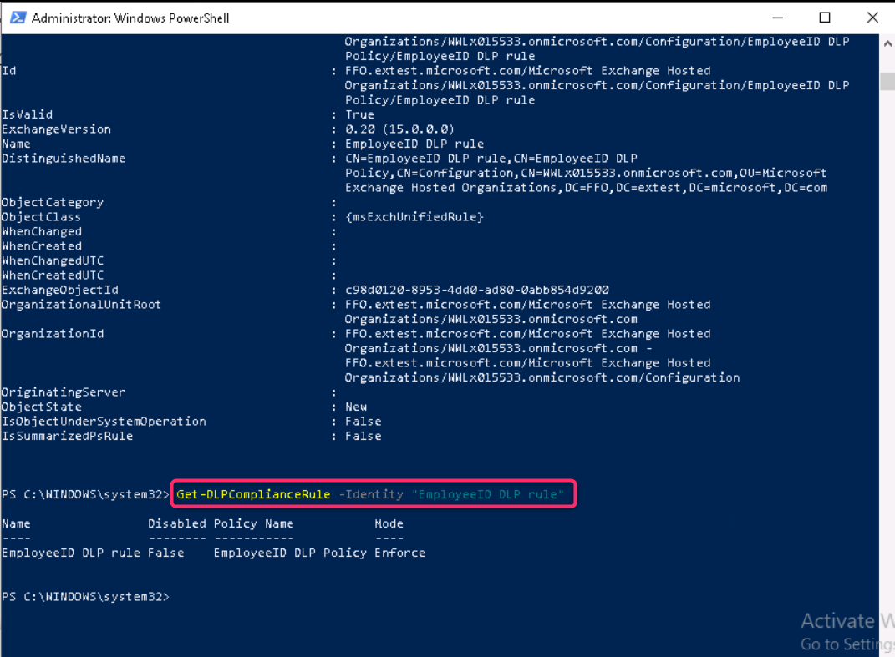

你现在已经创建了一个DLP策略，通过PowerShell扫描Exchange中的Contoso EmpoloyeeIDs。

**任务 4 – 在测试模式下激活策略**

在此任务中，您将激活测试模式创建的信用卡信息DLP策略，以强制执行其保护措施。

1.  在**Microsoft Edge InPrivate 窗口**中，导航到 https://purview.microsoft.com，确保你以 **Patti Fernandez 的身份登录了** Microsoft Purview **门户**

2.  在**Microsoft Purview**门户的左侧导航窗格中，选择**“解决方案**\> **Data loss prevention**.”。

> 

3.  在 D**ata loss prevention中**，选择**“策略**”，然后选择名为**“信用卡DLP策略”**的策略，然后选择**“编辑策略**”（铅笔图标）以打开策略向导。

> 

4.  选择**“下一步**”直到进入测试，**或打开政策**页面并选择**立即启用政策**。

> 

5.  选择**“下一步**”，然后选择**“提交**”以激活该政策。

> 

6.  政策更新后，选择**“ Done**”。

> 

您已成功激活DLP策略。如果策略检测到有人试图分享信用卡信息，现在会屏蔽该尝试，并允许用户提供商业理由来覆盖屏蔽行为。

**练习 2 – 管理DLP政策**

**任务 1 – 修改策略优先级**

创建两个DLP策略后，你需要确保限制性较高的策略被处理，优先级高于限制性较低的策略。因此，你应该把员工ID DLP策略移到更高优先级。

1.  在**Microsoft Edge**中，导航到 https://purview.microsoft.com，确保你以**Patti Fernandez的身份登录**Microsoft Purview**门户**。

2.  在**Microsoft Purview**门户的左侧导航窗格中，选择**“ Solutions \> Data loss prevention. **。

> 

3.  在**Data loss prevention 中**，选择**“策略**”，然后选择名为**“信用卡DLP策略**”的策略。选择**“移动到顶部（最高优先级）**”。

> 

4.  在 ** Data loss prevention**窗口中，选择**刷新**并查看策略表的**顺序**列中的优先级 .

> 

你成功修改了DLP策略的优先级。如果两项策略内容一致，则执行优先级更高的策略。

**任务 2 – 在 Microsoft Defender 中启用文件监控**

你想在 **Microsoft Defender** 中使用文件策略来保护 OneDrive 和 SharePoint Online 位置上的文件。在创建文件策略之前，你需要启用文件监控，以便Microsoft Defender能扫描组织内的文件。

1.  在你常用的Microsoft Edge浏览器中打开一个新标签页，在地址栏输入以下URL，打开Defender门户Microsoft：https://security.microsoft.com。然后，以 MOD管理员身份登录Microsoft Defender门户。

2.  在Microsoft Defender门户中，向下滚动，点击左侧导航菜单中的**系统设置（System\>Settings**）。在**设置**页面，点击**云应用**。

> 

3.  现在，向下滚动到**信息保护**部分，然后点击**“文件**”。在**文件**页面，选择“启用文件监控**”旁的复选框**，然后点击**保存**按钮。

> 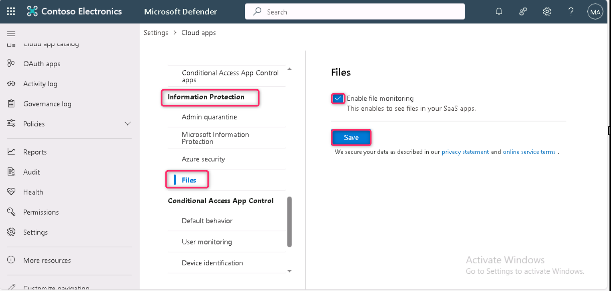

**注意**：如果文件监控默认已启用，则忽略上述步骤，继续下一个任务。

你成功启用了Microsoft Defender for Cloud Apps中的文件监控，现在可以使用文件策略扫描敏感内容。

**Task 3 – 为 Microsoft Defender 创建文件策略**

在这个任务中，你需要在 Microsoft Defender 中创建一个文件策略，扫描 OneDrive 和 SharePoint Online 中的文件，并自动隔离包含信用卡信息的文件（如果这些文件被共享）。

1.  现在，在同一**信息保护**部分，点击**“Microsoft 信息保护**”，然后选择**“自动扫描新文件以获取 Microsoft 信息保护敏感标签和内容检查警告”的复选框**。然后，点击保存按钮

> 
>
> 

2.  在检查受保护文件**中**，点击**“授予许可**”。

> 

3.  会弹出一个账户对话框，然后选择MOD管理员租户凭证。

\

4.  在**请求权限**页面，点击**“接受**”按钮.

> 

5.  您将看到“**活跃**”状态，表示许可已成功授予。

> 

6.  在子菜单中，在**“已连接应用**”部分，点击**应用连接器**，然后确认 **已添加** Microsoft 365。

> 

7.  现在，在 **Microsoft Defender** 门户左侧导航窗格中，展开 云应用部分的策略，选择**策略管理**。

> 

8.  在**策略**页面，点击**创建策略**，然后选择**文件策略**。

> 

9.  在 ** Create file policy**页面，在政策名称字段输入“    Credit Card Information for files ”，并输入“ Protect credit card numbers from being shared in files”。 在**描述**字段中。

> 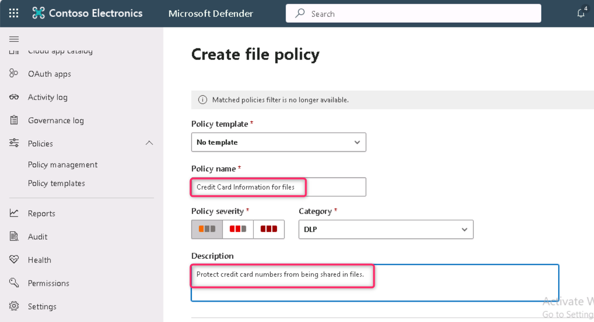

10. 保持**政策严重度**为**低**（一个带灯图标），并确保**类别**设置为**DLP**。对于文件策略，这应该是默认的。

> 

11. 在**符合以下所有区域的文件**中，展开下拉菜单**“公共（互联网）、外部”、“公共”**，并添加**“内部**”。

> 

12. 在“**应用”**部分，在**检查方法**下拉菜单中，选择**“ Data Classification Service.**”。

> 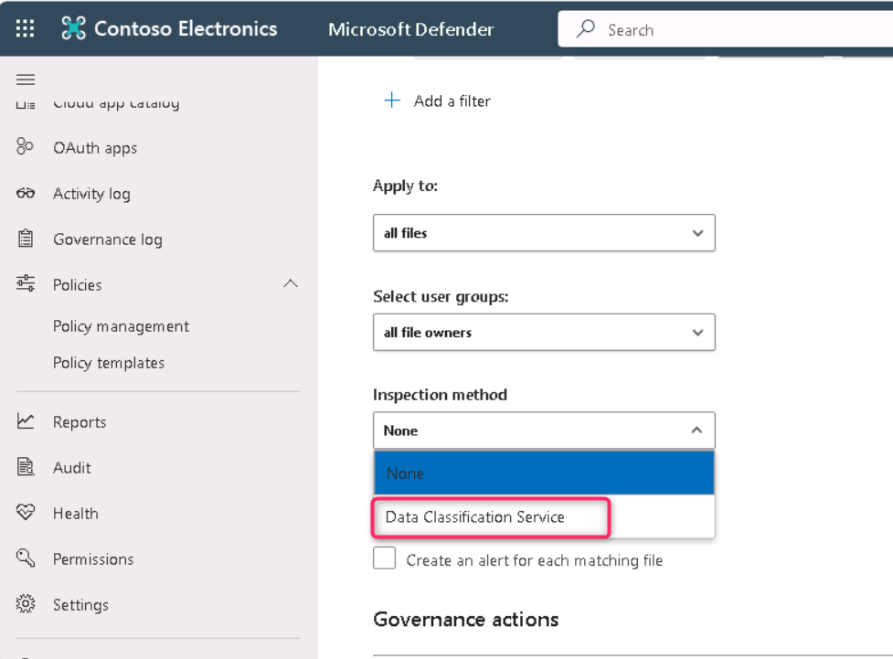
>
> **注意：**如果你还没在下拉菜单中看到**数据分类服务**，请选择**“截至目前为止无”**。完成后，过一段时间后返回**“ Policies\>Policy management\>All Policies\>Search for name: Credit card \>Select Credit Card Information for files **

13. 在**选择检查类型中......** 下拉菜单，选择**敏感信息类型......**。

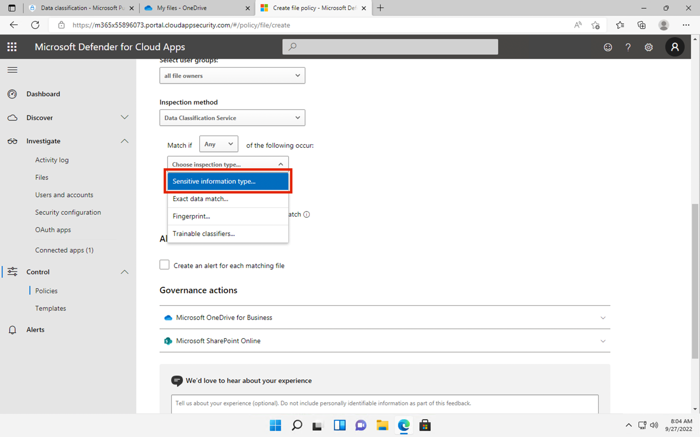

14. 在“**选择敏感信息类型**”对话框中，在搜索栏输入“ Credit Card Number”，选择“信用卡号**”旁的复选框**，然后点击**“完成**”按钮。

> 

15. 在**“警报**”部分，选择“为每个匹配文件创建警报**”的复选框**。然后，点击**“ Save as default settings”按钮。**

> 

16. 在**治理作**部分，展开 **Microsoft OneDrive for Business**，选择**“置于用户隔离**”。

> 

17. 在**治理作**部分，展开 **Microsoft SharePoint Online**，选择**“置入用户隔离**”。

> 

18. 在页面底部选择**“创建**”。

> 

19. 选择 **右上角MOD管理员**的头像，然后在齿轮旁边选择**“登出**”，然后关闭浏览器。

> 

你现在创建了一个文件策略，可以持续扫描 OneDrive 和 SharePoint 中保存的文件是否有信用卡信息，并在组织内部共享时将其隔离。

**任务 4 – 为Power Platform制定DLP策略**

您的公司使用 Power Automate 流程在 SharePoint Online 和 Salesforce 之间共享数据。在此任务中，您将为Power Platform创建DLP策略，允许现有流程继续正常工作，但防止创建在SharePoint Online与非业务应用之间共享数据的流程。

1.  在**Microsoft Edge**中，导航到 https://admin.powerplatform.microsoft.com 并以MOD管理员**身份登录Power Platform管理中心** .

2.  在 **Power Platform 管理中心**主页，点击**并点击安全**。

> 

3.  然后，点击 **下图所示**的数据与隐私图标。

> 

4.  在数据保护与隐私页面，点击**“数据政策**”。

> 

5.  在**数据政策**页面，选择**+ New Policy**。

> 

6.  在“**命名你的策略**”页面，输入“租户范围的 SharePoint 策略”，然后选择**“下一步**”。

> 

7.  关于**非商业 \|默认**标签页，选择**SharePoint**和**Salesforce**，然后在页面顶部选择**“移动到业务**”。

> 

8.  在“**分配连接器**”页面，选择**“业务**”标签，确保 SharePoint 和 Salesforce 现在都显示出来。

> 

9.  选择**“下一步**”两次。

> 
>
> 

10. 在**定义范围**页面，选择**添加所有环境**，然后选择**下一步**。

> 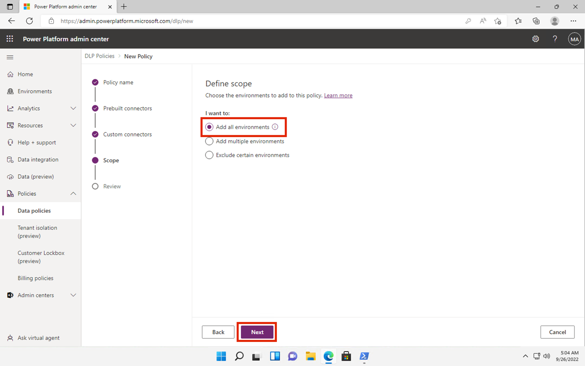

11. 在“**审查并创建政策**”页面，查看你的政策设置，然后选择**创建政策**。

> 
>
> 你现在创建了一个Power Platform的DLP策略，防止用户创建涉及SharePoint在线连接器及任何非Salesforce连接器的流程。
>
> 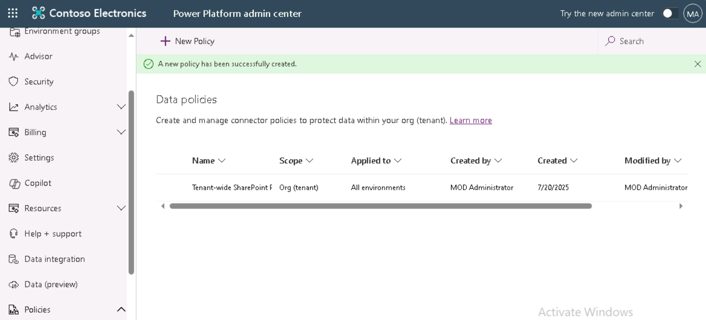

**总结:**

在本实验室中，您创建并管理数据丢失防护（DLP）策略，以保护Microsoft Teams、Exchange、OneDrive、SharePoint和Power Platform上的敏感数据，如信用卡号码和员工ID。你用 Microsoft Purview 和 PowerShell 构建了策略，启用了用户通知和覆盖，优先级策略，激活了 Microsoft Defender 中的文件监控，并配置了文件隔离作。此外，你制定了Power Platform的DLP策略，限制与非业务连接器的数据共享。
