**实验室7 – 配置内部风险管理**

**介绍**

在本实验室中，我们将学习如何使用内部风险管理策略来配置内部风险管理。我们将利用实验室1创建的敏感信息类型和实验室4创建的DLP策略，制定策略，保护组织免受高风险浏览器使用或数据盗窃或泄露。

为此，我们将在Azure中建立一个基础设施，代表组织中的设备。我们将学习如何在Azure AD和Intune中接入这些设备，并在它们上安装MDM代理，以便它们能够从这些机器获取警报。

**目标**

- 同步虚拟机时钟，确保策略测试时间设置准确。

- 将用户分配到Microsoft Purview中的内部风险管理角色组。

- 启用分析洞察，用于租户和用户层面的内部风险检测。

- 将Windows 10设备安装到Microsoft Defender for Endpoint，用于内部风险监控。

- 创建并配置内部风险管理策略:

  - 风险浏览器使用问题

  - 离职用户的数据盗窃

  - 用户数据泄露

<!-- -->

- 对每个策略进行评分，以模拟国防部管理员账户的内部风险检测场景.

**练习1 ——营造环境**

**任务0 – 同步虚拟机时钟**

1.  关闭虚拟机上打开的所有 Microsoft Edge 浏览器标签页。点击**Windows**图标，然后点击**设置**，如下图所示。

> 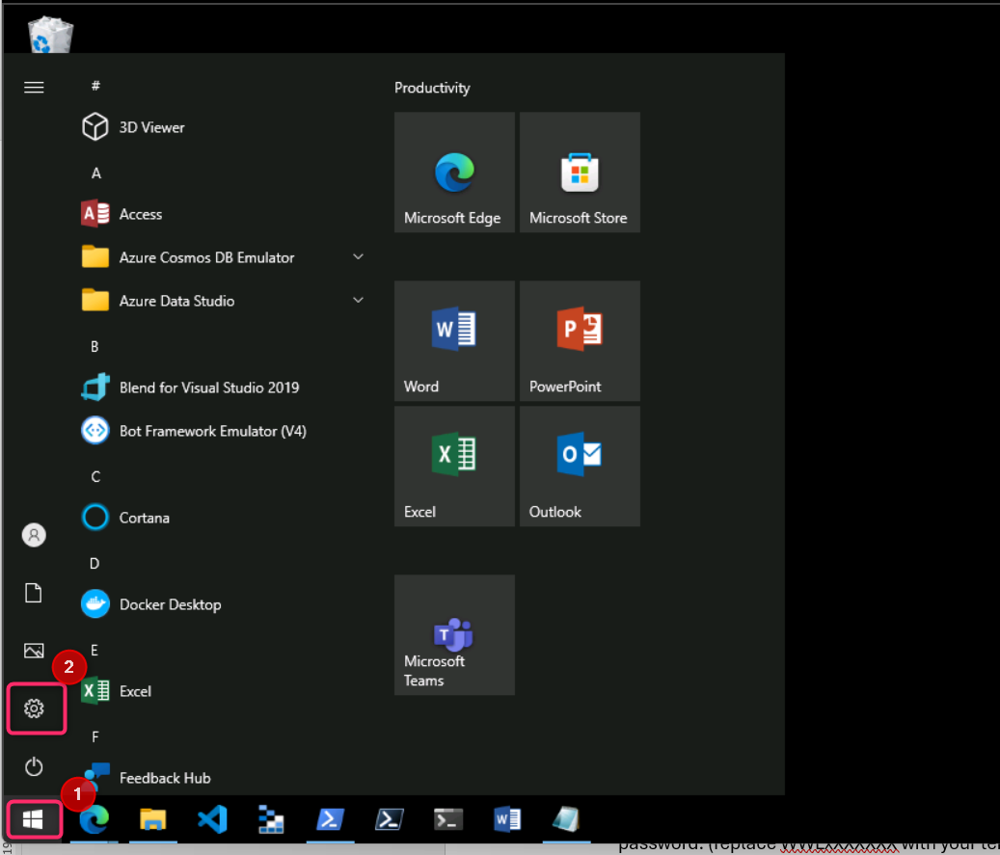

2.  在**Windows设置**搜索栏中，输入日期和时间设置，然后从列表中选择**日期和时间设置**。

> 

3.  在**日期和时间**页面中，点击“**立即同步**”按钮。

> 

**练习2 ——制定 Insider Risk Management 政策。**

**前提条件**

**步骤1——将用户添加到内部风险管理角色组**

1.  打开Microsoft Purvie门户：https://purview.microsoft.com 并用**国防部管理员**凭证登录。

2.  在左侧导航菜单中，点击**设置。**

> 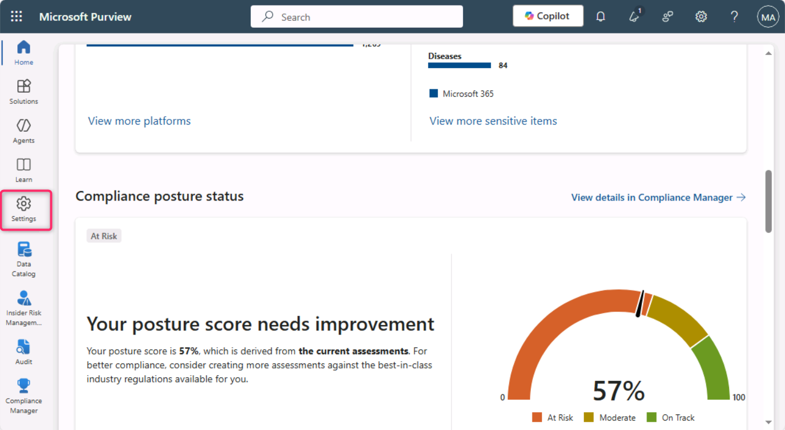

3.  在**设置**面板中，点击角色**和范围**。点击**角色组**，然后选择“ **Insider Risk Management”旁的复选框** ，点击铅笔图标进行编辑。

> 
>
> 

4.  在**编辑角色组**成员页面，点击**选择用户**。

> 

5.  选择Alex Wilber**附近的复选框**。然后，点击**选择**按钮。如果亚历克斯·威尔伯已经被选中，则忽略这一步。

> **注意**：如果你在编辑成员名中没有看到Megan Bowen和MOD管理员的名字，那么除了Alex名外，还要选择Megan Bowen和MOD管理员名。
>
> 

6.  确保显示MOD管理员Megan Bowen和Alex Wilber的名字，然后点击**“下一**页”按钮.

> 

7.  选择**“保存**”以将用户添加到角色组。

> 

8.  选择**完成**以完成步骤。

> 

**步骤2——启用内部风险分析洞察**

1.  在Microsoft Purview门户中，进入**设置**，然后向下滚动，点击 “**Insider Risk Management**”。在 **Insider Risk Management 设置**——**分析**页面，开启“**租户级显示洞察**”和**用户级显示洞察**“的开关。然后，点击**保存**按钮。

> 

**步骤3 – 设备上线**

在这个部署场景中，你会接入尚未上线的设备，你只是想检测Windows 10设备上的内部风险活动。

我们需要在Microsoft Entra ID中注册设备/虚拟机，作为创建任何内部风险策略的前提条件。

1.  点击Windows图标，然后选择 **如下图所示**的设置。

> 
>
> 2\. 转到 **账户**\>**访问工作或学校**。在“**工作或学校访问**”页面，点击**连接**。
>
> 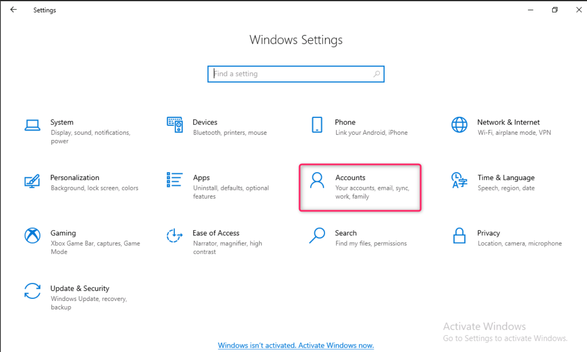
>
> 
>
> 3． 在“**设置工作或学校账户**”提示中，点击**“加入此设备以访问Microsoft Entra ID**”。
>
> 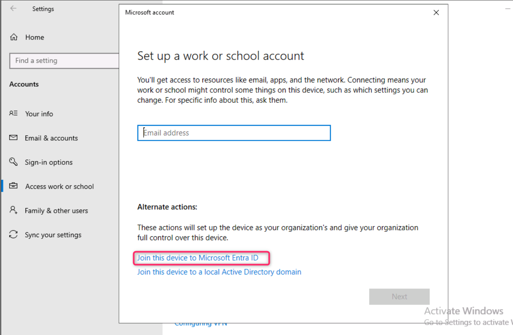

4.  在登录提示中，使用**实验室环境资源标签中提供的**国防部管理员凭证登录。

> 
>
> 

5.  在**“确认这是你的组织对话框”中**，点击**加入**按钮。

> 

6.  完成后你会看到确认窗口**，一切就绪！**。点击**完成**。

> 

7.  同样，在“**工作或学校访问**”页面，点击**连接**。

> 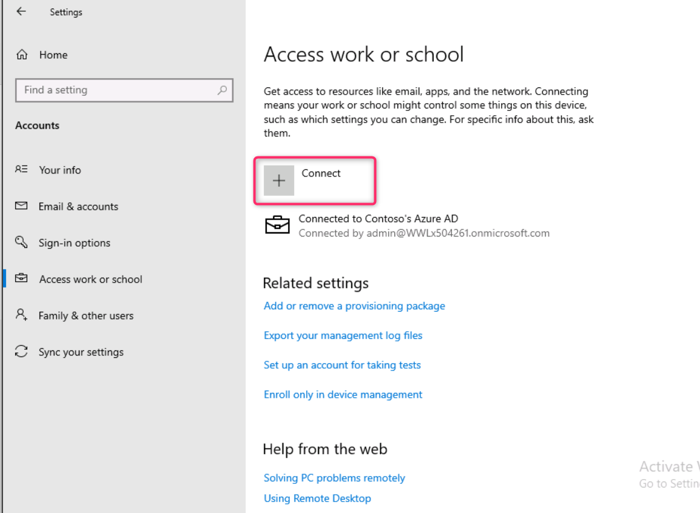

8.  在“**设置工作或学校账户**”提示中，使用MOD管理员凭证登录。

> 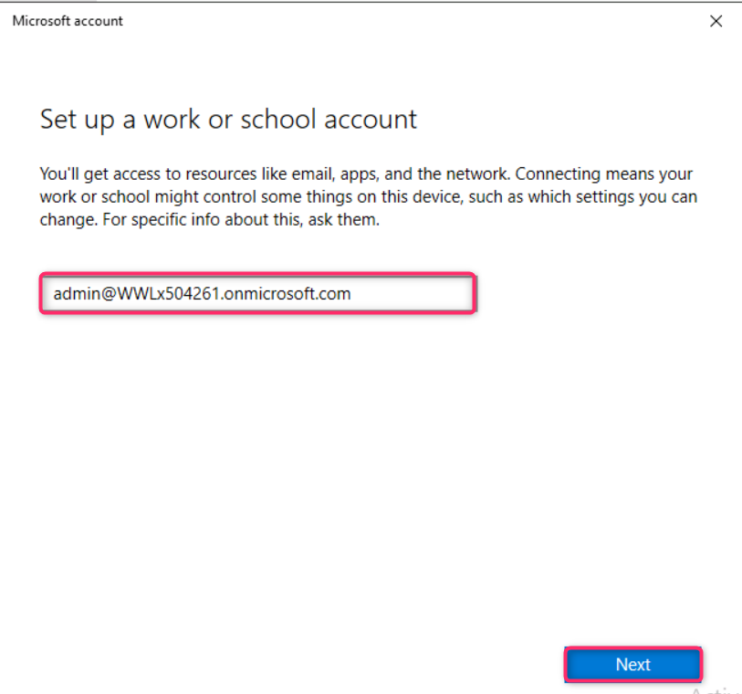
>
> 

9.  登录时保持**登录？**对话框，点击**“是”**按钮。

> 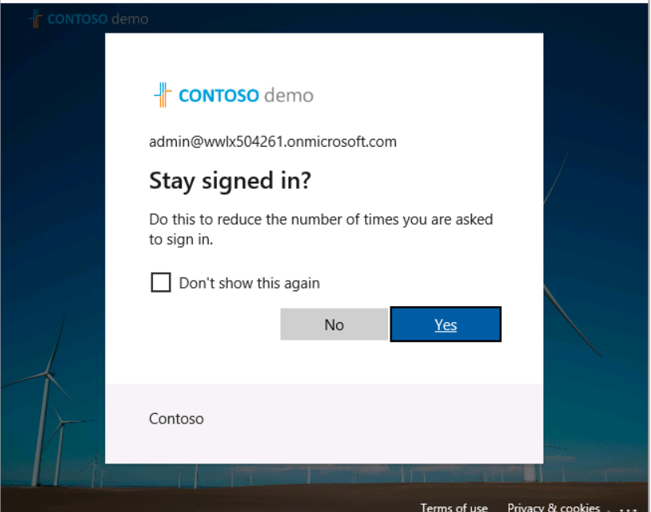

10. 如果**弹出“设置您的设备**”对话框，请选择**“明白**”。

> 

11. 现在进入**Windows设置**\>**账户**\>**访问工作或学校**\>**连接到Contoso的MDM**\>**信息**\>**同步**.

> 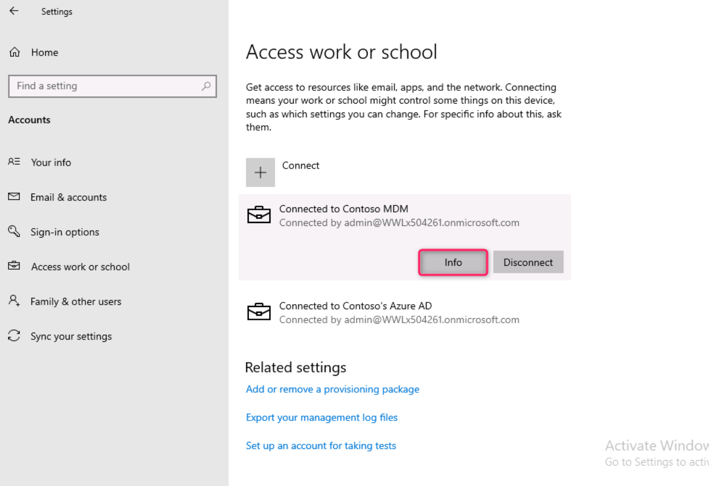
>
> 

12. 点击虚拟机上的Windows图标。选择用户**管理员**并选择**退出**。

> 

13. 在用户界面选择**“其他用户**”。

> 

14. 输入你在实验室环境主页提供的O365凭证，并以**MOD管理员身份登录虚拟机**。

> 

15. 在你的实验室虚拟机上使用MOD管理员账户**登录以 https://purview.microsoft.com**。

16. 在Microsoft Purview 门户中，导航并选择 **“ Settings \> Device onboarding \> Devices. Click on Turn on Device onboarding. **”。

17. 在**“启用设备入职**”对话框中，点击**确定**按钮。

> 

18. 在设备**监控中，对话框已开启**，点击**确定**按钮。

> 

19. 等几分钟，然后刷新页面。

> 
>
> 

20. 在** settings \> Device onboarding \> Onboarding** 中。点击下载**包**。

> 

21. 下载完成后，将文件复制到桌面。右键点击文件，全部**解压......**然后点击**提取**按钮

> 
>
> 
>
> 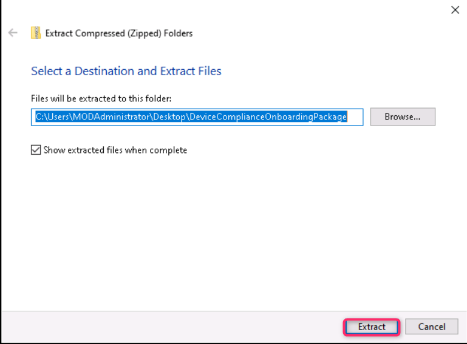

22. 完成后，打开文件夹并用管理员权限运行该文件 。

> 

23. 如果在**商店里搜索应用？** 对话框出现，点击**“是”**按钮，否则忽略。

24. 出版**商无法被核实。你确定要运行这个软件吗？对话框**，点击**“运行**”按钮。

> 

25. 如果**出现“用户账户控制”**对话框，请点击**“是**”按钮。

> 

26. 在命令提示符中，按**Y**并按回车确认。你会收到设备已上线的消息。在命令提示符中，一旦收到消息，**按任意键即可继续......**，按任意键。

> 

27. 命令提示符关闭后，在Windows搜索栏输入cmd，以管理员模式打开命令提示符 ，然后右键点击**命令提示符**，选择**以管理员身份运行**。

> 

28. 在**用户账户控制**对话框中，点击“是”按钮。

> 

29. 通过执行以下命令进行检测测试。命令提示符窗口会自动关闭。

> powershell.exe -NoExit -ExecutionPolicy Bypass -WindowStyle Hidden \$ErrorActionPreference= 'silentlycontinue';(New-ObjectSystem.Net.WebClient).DownloadFile('http://127.0.0.1/1.exe','C:\test-WDATP-test\invoice.exe');Start-Process 'C:\test-WDATP-test\invoice.exe'
>
> 

30. 关闭虚拟机连接。

31. 点击导航中的设置，选择“ **Devices Onboarding** \> **Devices**.” 打开设置。

> **注释:** 虽然通常设备上线需要大约60秒才能启用，但请允许最多30分钟。

32. 你可以查看**设备**列表。在你接入设备之前，列表会是空的，一旦完成，你就能看到你的虚拟机被列为已接入的设备。

**任务 1 – 制定全组织范围的政策，以检测并评分高风险浏览器使用情况**

**第一步——创建新保单**

1.  在Microsoft Purview门户中，点击解决方案，然后点击 ** Insider Risk Management **

> 

2.  点击“**政策**”。在策略页面，点击**+ Create policy \> Custom policy. **。

> 

3.  在“选择策略模板”页面，选择“风险浏览器使用（预览），”风险浏览器使用“（预览）”。

> 

4.  复习所有先修课程。

> 

5.  选择**“下一页**”继续。

> 

6.  在名称**和描述**页面，填写以下字段：

    - Name: Risky usage of browser

    - Description: This is a test policy for the risky browser usage

7.  选择**“下一页**”继续。

> 

8.  在**“选择用户、组和自适应范围”**页面，选择**“所有用户、组和自适应范围”**。选择**“下一页**”继续。

> 

9.  在**“排除用户和组”**页面，选择**“下一步**”。

> 

10. 在“决定是否优先排序”页面，选择**“我现在不想优先处理内容**”。选择**“下一页**”继续。

> 

11. 在 ** Choose triggering event for this policy时**，选择**“启用指示器**”按钮。

> 

12. 在**“ Turn on indicators for your organization **中，向下滚动，点击“**选择指示器以开启**”按钮。

> 
>
> 

13. 在**“选择指示器以开启**”对话框中，确保在“风险浏览指示器”（预览）中选中所有指示器。

> 
>
> 

14. 向下滚动，选择**保存**。

15. 在 **Choose triggering event for this policy** 时，确保点击“用户浏览至潜在风险网站**”旁的单选按钮** 。在**选择触发该政策的活动中**，选择所有选项，点击**“下一步**”按钮。

> 

16. 在 ** Choose thresholds for triggering events** 页面，选择**“选择您自己的阈值**”单选按钮，将所有阈值改为每天1个，然后选择**“下一步**”。

> 
>
> 

17. 在**指示器**页面，选择**“下一步**”。

> 

18. 在**“ Choose threshold type for indicators**”页面，确保**选择了“应用 Microsoft 提供的阈值**”，然后点击**“下一步**”按钮。

> 

19. 在**审核设置和结束**页面，选择**提交**。

> 

20. 在**“你的保单已创建**”页面，选择**“完成**”。

> 

21. 保持标签页打开，继续做下一个任务。

**第二步——为保单评分**

1.  点击名为“风险使用浏览器”的新政策。选择**“为用户开始计分活动**”。

> 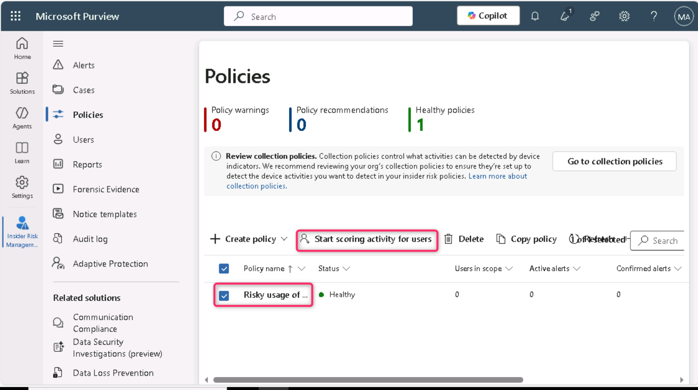

2.  在“活动评分原因”字段中输入“测试策略”。在**“计分活动”栏中，针对**5天到30天，选择**10天**。

> 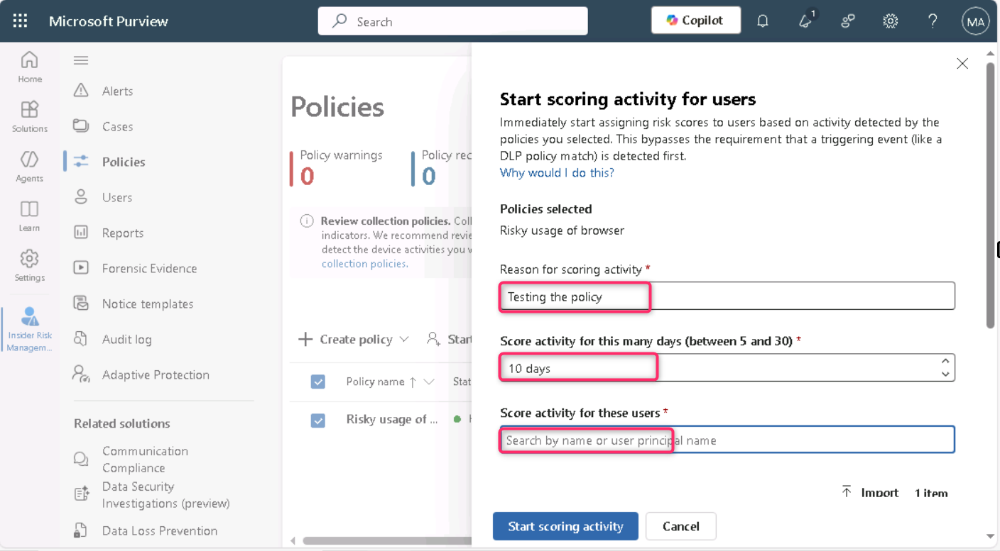

3.  在这些用户的评分活动栏中，输入MOD，然后选择MOD管理员。

> 

4.  然后，点击**“开始计分活动**”按钮。

> 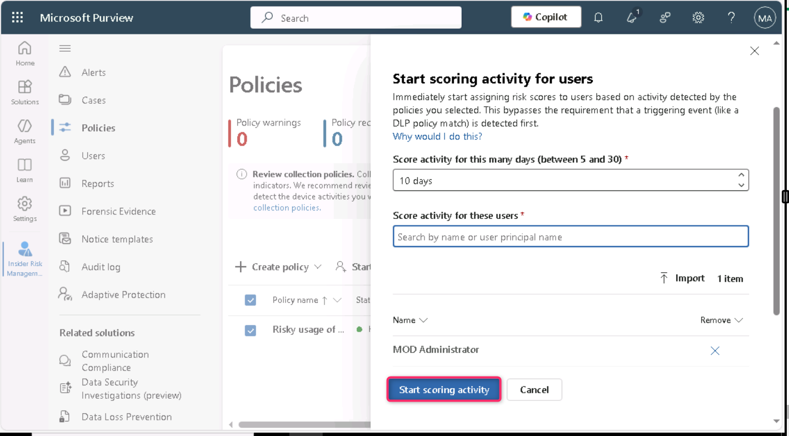

5.  点击**关闭**按钮。

> 

**任务 2 – 离职用户的数据盗窃**

**第一步——创建新保单**

1.  在**策略**页面，点击 **+ 创建策略**，然后选择**自定义策略**。

> 

2.  在“选择政策模板”页面，在“数据盗窃”下选择“离职用户数据盗窃”。选择“下一页”继续。

> 

3.  在**名称和描述**页面，填写以下字段:

    - Name: Data theft by a user

    - Description: This is a test policy for preventing data theft

4.  选择**“下一页**”继续。

> 

5.  在**“选择用户、组和自适应范围”**页面，选择“所有用户、组和自适应范围”旁边的单选按钮，然后点击**“下一步**”按钮。

\

6.  在**“排除用户和群组”（可选）**页面，点击**“下一步**”按钮。

\

7.  在**“决定是否优先排序内容**”页面，选择**“我想要优先处理内容**”。只勾选**敏感标签**和**敏感信息类型的复选框**。选择**“下一页**”继续。

> 

8.  在**“敏感度标签优先排序**”页面，选择**添加或编辑敏感标签**。在添加或编辑敏感标签搜索栏中，输入“employee”并按下回车键，选择**内部/员工数据（HR），**然后选择**添加**。然后点击“下一步”。

> 

9.  在“**敏感信息类型优先排序**”页面，选择**添加或编辑敏感信息类型**。在跳出窗格中，搜索并选择信用卡**号**、**Contoso员工ID**和**Contoso员工EDM**。选择**添加**。然后，点击**“下一步**”。

> 

10. 在**决定是否只对优先内容的活动进行评分**时，确保**已选择“获取所有活动的警报**”。然后，点击**“下一步**”按钮。

> 

11. 在**该政策页面选择触发事件**时，保持默认选项并选择**“下一步**”。

> 

12. 在**“指标”**页面，点击“办公室指标”（选中31/31）**旁的下拉菜单**。

> 

13. 确保所有办公室指示器都被选中，然后点击**“下一步**”按钮。

> 

14. 保持检测选项页面**上的所有参数** 保持默认状态，点击**“下一步**”按钮

> 

15. 在**“选择指标阈值类型**”页面，选择“**选择你自己的阈值**”旁的单选按钮，然后向下滚动并点击“Office 指标”下拉菜单。

> 
>
> 

16. 在**与组织外部人员共享SharePoint文件**中，每个阶段分别设置1、2和3个事件，然后选择**“下一步**”。

> 

17. 在 **Review and Finish** 页面，点击**提交**按钮。

> 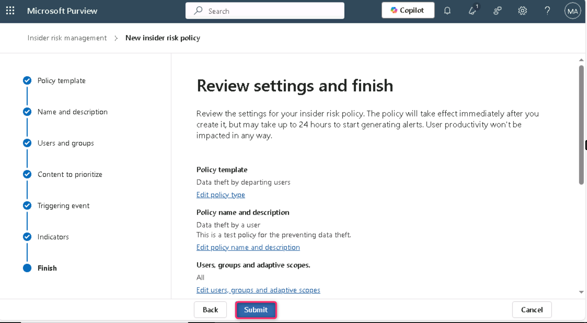

18. 在您的保单创建中，选择“完成”。

> 

**第二步——为保单评分**

19. 点击名为**“用户数据盗窃”的新策略**。选择**“为用户开始计分活动**”。

> 

20. 在“活动评分原因”字段中输入“测试策略”。在**“计分活动”栏中，针对**5天到30天，选择**10天**。

> 

21. 在这些用户的评分活动栏中，输入MOD，然后选择MOD管理员。

> 

22. 然后，点击**“开始计分活动**”按钮。

> 

23. 点击**关闭**按钮。

> 

**任务 3 – 用户数据泄露**

**第一步——创建新保单**

1.  在**策略**页面，点击 **+ 创建策略**，然后选择**自定义策略**。

> 

2.  在“**选择策略模板**”页面，选择**数据泄露**，在**“数据泄露”**下。选择**“下一页**”继续。

> 

3.  在**名称和描述**页面，填写以下字段:

    1.  Name: Data leaks by a user

    2.  Description: This is a test policy for preventing data leaks

4.  选择**“下一页**”继续。

> 

5.  在**“选择用户、组和自适应范围”**页面，确保**选择了所有用户、组和自适应范围的**单选按钮。然后点击**“下一页**”按钮继续。

> 

6.  在**“排除用户和群组”（可选）**页面，点击**“下一步**”按钮。

7.  在**“Decide whether to prioritize** **”**页面，选择**“我想要优先处理内容**”。选择**SharePoint网站、敏感标签和敏感信息类型的复选框**。点击**“下一步**”按钮。

> 

8.  在“**SharePoint 优先级网站**”页面，选择**添加或编辑 SharePoint 网站**。在飞出窗格中输入 https://WWLxXXXXXX.sharepoint.com/sites/ContosoWeb1，然后选择Contoso Web 1**旁的复选框** ，点击**添加按钮。然后，点击“下一步**”。

> **注意**：**XXXXXX**租户前缀可在**资源**标签页中获取。
>
> 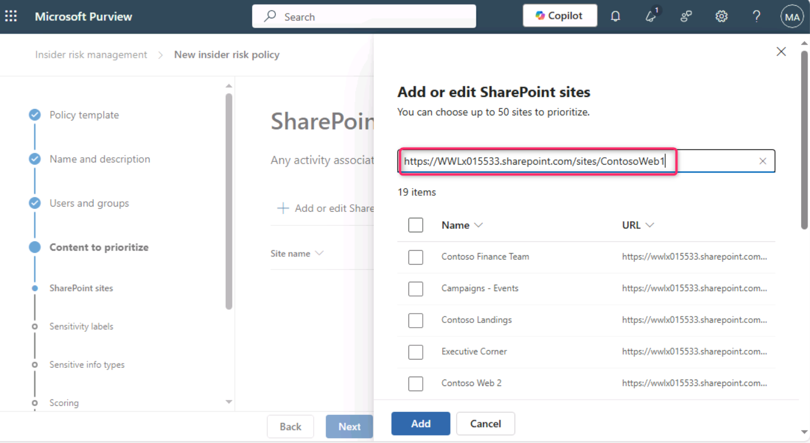
>
> 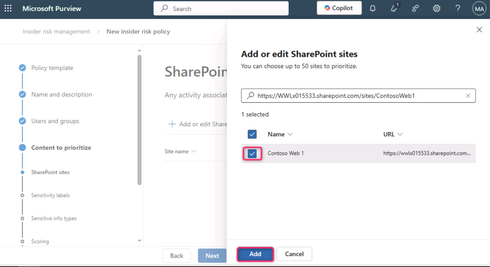
>
> 

9.  在**“敏感度标签优先排序**”页面，选择**添加或编辑敏感标签**。在飞出窗格中输入“员工”，然后选择“内部/员工数据（HR）”复选框，点击添加 按钮。然后，点击**“下一步**”按钮。

> 
>
> 

10. 在“**敏感信息类型优先排序**”页面，选择**添加或编辑敏感信息类型**。在跳出窗格中，Credit Card Number, Contoso Employee ID 和 Contoso Employee EDM. 。选择**添加**。然后点击**“下一步**”。

\

11. 在**Decide whether to score only activity with priority content** ，选择**获取所有活动的提醒**。选择**下一步**。

> 

12. 在**该策略页面的“选择触发事件**”时，确保选择“用户执行窃取活动**”的单选按钮** 。在**选择触发该策略的活动**中，选择**从SharePoint下载内容，向组织外收件人发送带有附件的邮件**，与**组织外人员共享SharePoint文件**，然后选择**下一步**。

> 
>
> 

13. 在**“选择触发事件阈值**”页面，选择“**选择您自己的阈值**”旁的单选按钮。将每个阈值设为1，然后选择**“下一步**”。

> 
>
> 

13. 保持指示器页面**的默认设置** ，选择**下一步**。

> 

14. 保持检测选项页面的默认设置 ，选择**“下一步**”。

> 

15. 在**“选择指示器阈值类型**”页面，确保**选择“选择您自己的阈值**”单选按钮。然后，点击 Office 指示器，分别为每个阶段使用 1、2 和 3 个事件，然后选择**“下一步**”。

> 
>
> 
>
> 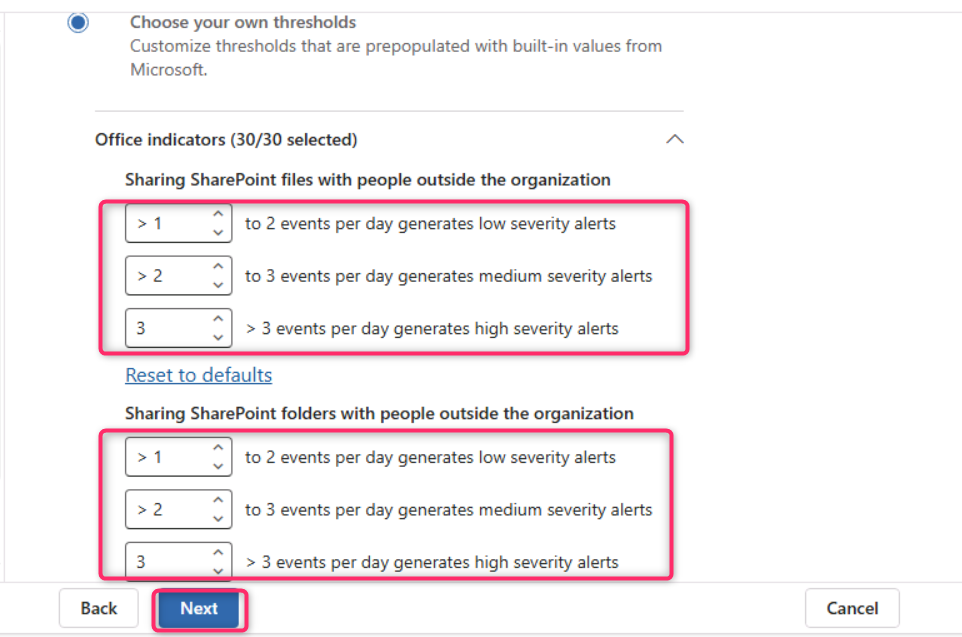

16. 在**审核设置并完成时**，选择**提交**。

> 

11. On Your policy was created, select Done.

> 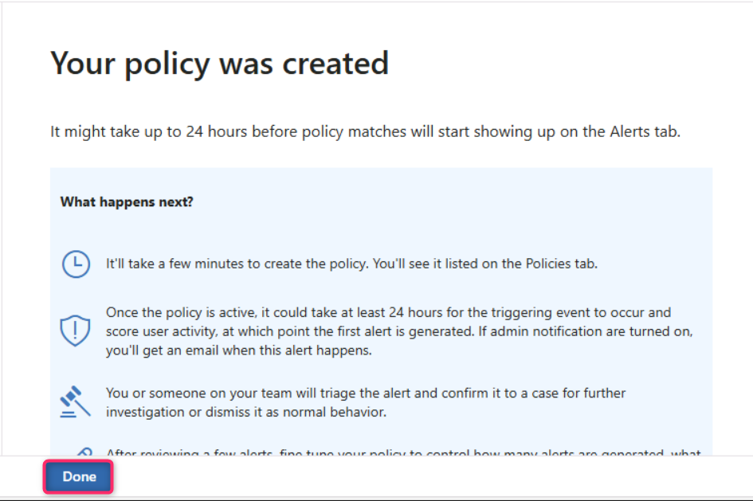

**第二步——为保单评分**

1.  在**策略**页面，选择名为**“用户数据泄露”的新策略旁的复选框**。然后，选择**“开始为用户计分活动**”。

> 

2.  在“活动评分原因”字段中，输入“测试策略”。在**“计分活动”栏中，针对**5天到30天，选择**10天**。在这些用户的评分活动栏中，输入MOD，然后选择MOD管理员。

> 
>
> 

3.  然后，点击**“开始计分活动**”按钮。

> 

4.  点击**关闭**按钮。

> 

**总结:**

在这个实验室里，你首先通过同步虚拟机时钟和为 Microsoft Purview 中的内部风险管理所需的用户和设备进行导入来准备环境。你启用了分析洞察，并在所有目标虚拟机上验证了Defender的反恶意软件客户端版本。设备上线后，您创建了三种不同的 Insider Risk Management 策略，以监控和评分与高风险浏览器使用、离职用户潜在数据盗窃以及内部用户数据泄露相关的活动。每个策略都通过敏感标签、SharePoint站点和敏感信息类型作为优先级内容进行定制，并配置阈值以触发警报和评分。最后，你们启动了评分活动，模拟真实世界的内部风险场景并评估配置策略的有效性。
