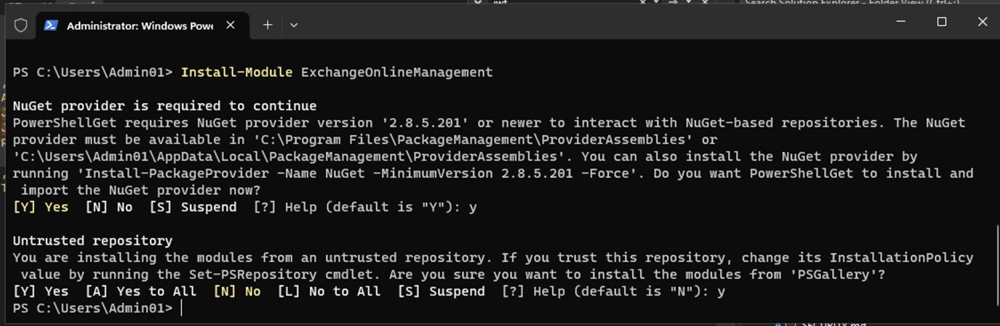
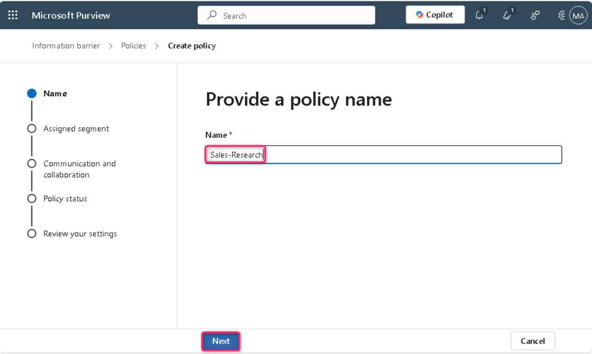
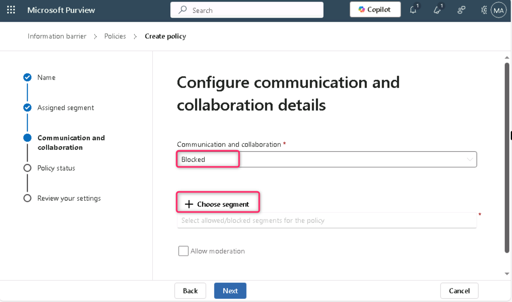
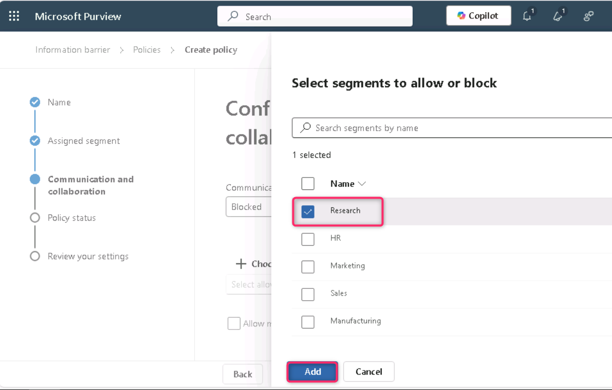
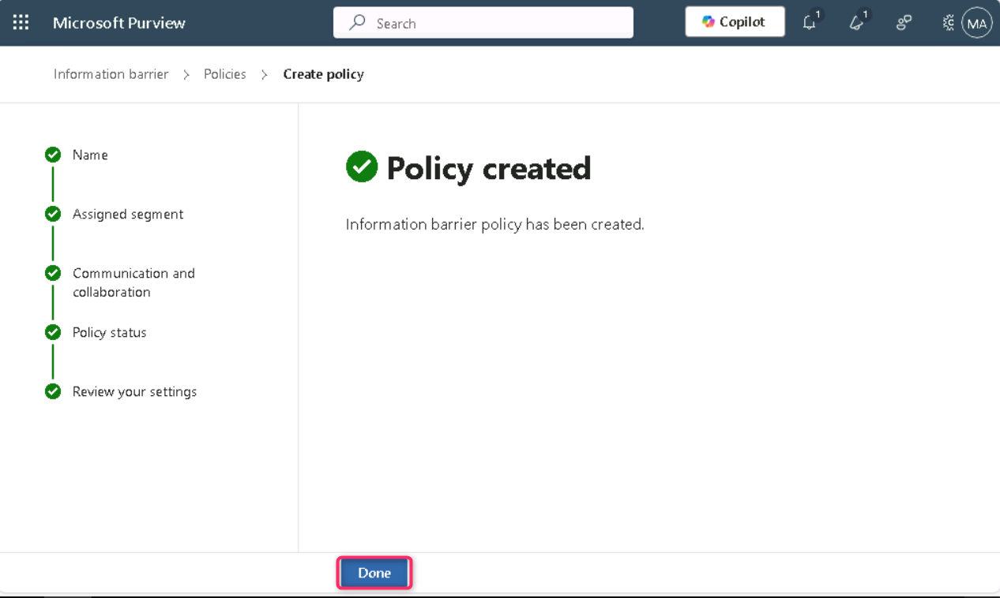
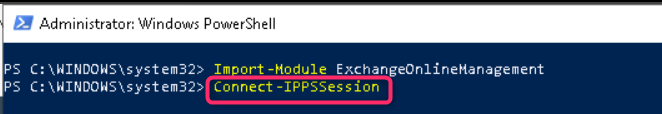
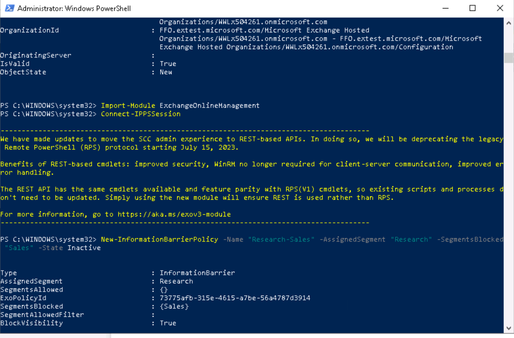

**实验室 8 – 配置 Information Barriers**

**介绍**

Contoso设有五个部门：*人力资源*、*销售*、*市场营销*、*研究*和*制造*。为了遵守行业法规，某些部门的用户不应与其他部门沟通，如下表所示：

‘

| **分段** | **可以交流**                 | **无法交流**                      |
|----------|------------------------------|-----------------------------------|
| HR       | Everyone                     | (no restrictions)                 |
| 销售     | HR, Marketing Manufacturing  | 研究                              |
| 营销     | Everyone                     | (no restrictions)                 |
| 研究     | HR, Marketing, Manufacturing | Sales                             |
| 制造     | HR, Marketing                | Anyone other than HR or Marketing |

对于该结构，Contoso的计划包括三项IB政策：

1.  一项IB政策旨在防止销售与研究部门沟通

2.  又一项IB政策，防止研究部门与销售部门沟通。

3.  IB的一项政策旨在允许制造部门仅与人力资源和市场部门沟通。

**目标**

1.  使用PowerShell设置组织分段以实现信息屏障（IB）。

2.  在 Microsoft Teams 中启用有范围的目录搜索，以强制基于分段的用户可见性。

3.  通过Microsoft Purview门户和PowerShell创建信息屏障（IB）策略，以控制分段间通信。

**练习 1 – 前提条件**

**任务 1 – 为你组织内的用户创建细分**

1.  右键点击Windows图标，然后导航并点击**Windows PowerShell（管理员）**

> 

2.  在**用户账户控制**对话框中，点击**“是”按钮**。

> 

3.  运行以下程序：

> Install-Module ExchangeOnlineManagement

4.  如果被提示 ‘**Do you want PowerShellGet to install and import the NuGet provider now?**’ 和 ‘**Are you sure you want to install the modules from 'PSGallery'?**输入**Y**并按回车.

> 

5.  执行以下命令。

> Import-Module ExchangeOnlineManagement
>
> 

6.  现在执行以下命令连接Exchange Online。

> Connect-IPPSSession
>
> 

7.  请使用 实验室环境主页提供的 MOD管理员凭证登录.

> **注意**：如果，**自动登录该设备上的所有桌面应用和网站？** 对话框出现，然后点击**“否，仅此应用**”按钮。
>
> 
>
> 

8.  在PowerShell**中逐一执行以下命令** ，创建组织结构。

> New-OrganizationSegment -Name "HR" -UserGroupFilter "Department -eq 'HR'"
>
> 
>
> New-OrganizationSegment -Name "Sales" -UserGroupFilter "Department -eq 'Sales'"
>
> New-OrganizationSegment -Name "Marketing" -UserGroupFilter "Department -eq 'Marketing'"
>
> New-OrganizationSegment -Name "Research" -UserGroupFilter "Department -eq 'Research'"
>
> New-OrganizationSegment -Name "Manufacturing" -UserGroupFilter "Department -eq 'Manufacturing'"

**任务 2 – 在 Microsoft Teams 中启用有范围的目录搜索**

开启按名称搜索

1.  访问 Microsoft Teams 管理中心，请访问 to https://admin.teams.microsoft.com, select **Teams** \> **Teams settings**.

> 

2.  在**“按名称搜索**”中，在**使用 Exchange 地址簿策略的范围目录搜索旁边**，打开开关。选择**保存**。

> 

3.   如果**Changes might take some time to take effect**，会弹出对话框，点击**确认**按钮。

> 

**练习 2 – 制定 IB 政策**

**任务 1 – 段间的阻断通信**

1.  在 Microsoft Purview 门户中，点击**Solutions**\> **Information barriers**.

> 

2.  在信息屏障刀片中，点击**“政策**”，然后选择“政策”。在策略 页面，选择 **+ 创建策略**以创建和配置新的 IB 策略。

> 

3.  在**“ Provide a policy name **”页面的名称字段中，输入保单名称——销售-研究。然后，选择**“下一步**”。

> 

4.  在“**添加分配段**详情”页面，选择**选择段**。 **在该政策窗格的“选择分配的细分”**时，选择**销售**。现在，选择**添加**，将选中的段添加到策略中。你只能选择一个片段。

> 

5.  选择**Next**.

> 

6.   在**Configure Communication and collaboration details page页面**，选择**屏蔽**。选择 **Choose segment,**，选择**研究**，然后选择**添加。**

> 
>
> 

7.  然后，点击**“下一步**”按钮。

> 

8.  在 ** Configure Policy status**页面，将活跃策略状态切换为**开启**。选择**“下一页**”继续。

> 

9.  在“**查看您的设置**”页面，查看您为该政策选择的设置以及任何建议或警告。选择**提交**以创建政策。

> 

10. 创建策略后**选择**“完成”。

> 

11. 销售-研究IB政策已成功制定。

> 

**任务 2 – 通过PowerShell创建IB策略**

1.  回到**管理员：Windows PowerShell**，执行以下命令：

> Import-Module ExchangeOnlineManagement
>
> 

2.  现在执行以下命令连接 Exchange Online.

> Connect-IPPSSession
>
> 

3.  请使用 实验室环境主页提供的MOD管理员凭证登录.

> **Note**： **是否会自动登录该设备上的所有桌面应用和网站？** 对话框出现，然后点击**“否，仅此应用**”按钮。
>
> 
>
> 

4.  执行以下命令创建一个名为**“研究-销售**”的投行策略。当该政策生效并应用时，将有助于防止研究 板块的用户与**销售**板块的用户进行沟通。

> New-InformationBarrierPolicy -Name "Research-Sales" -AssignedSegment "Research" -SegmentsBlocked "Sales" -State Inactive
>
> 
>
> 

5.  执行以下命令创建一个名为 **Manufacturing-HRMarketing** 的 IB 策略。当该政策生效并执行时，**制造部门**只能与**人力资源**和**市场部门**沟通。人力资源和市场部门并不被限制与其他部门沟通。

> New-InformationBarrierPolicy -Name "Manufacturing-HRMarketing" -AssignedSegment "Manufacturing" -SegmentsAllowed "HR","Marketing","Manufacturing" -State Inactive
>
> 
>
> 

6.  回到 Microsoft Purview 门户，刷新信息屏障 – 策略页面，你将可以看到你用 PowerShell 创建的策略。

> 

**总结**

在本实验室中，你用PowerShell创建了组织细分（人力资源、销售、市场、研究和制造），并在Microsoft Teams中启用了范围目录搜索功能，以使用户可见性与细分限制保持一致。然后你在 Microsoft Purview 中配置了 IB 策略，阻止或允许特定细分段之间的通信（例如，阻止销售与研究部门的通信）。这些策略是通过门户和PowerShell创建的，供实践使用。
