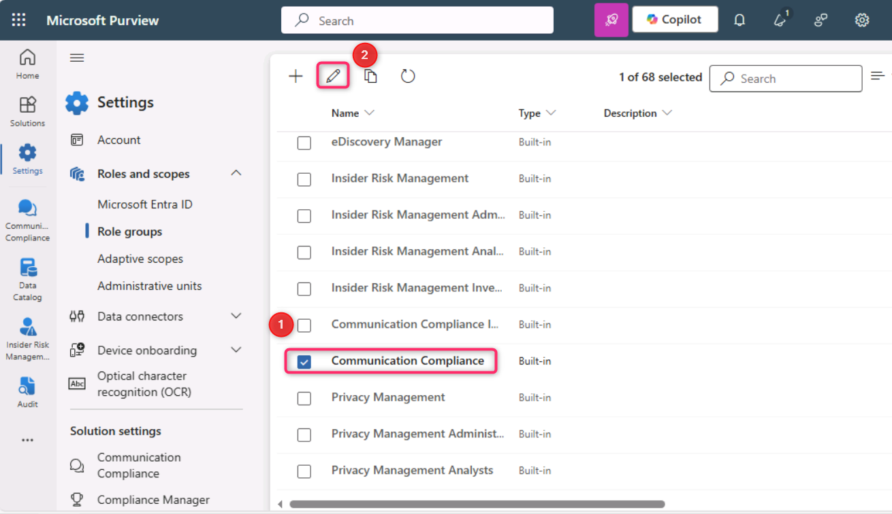
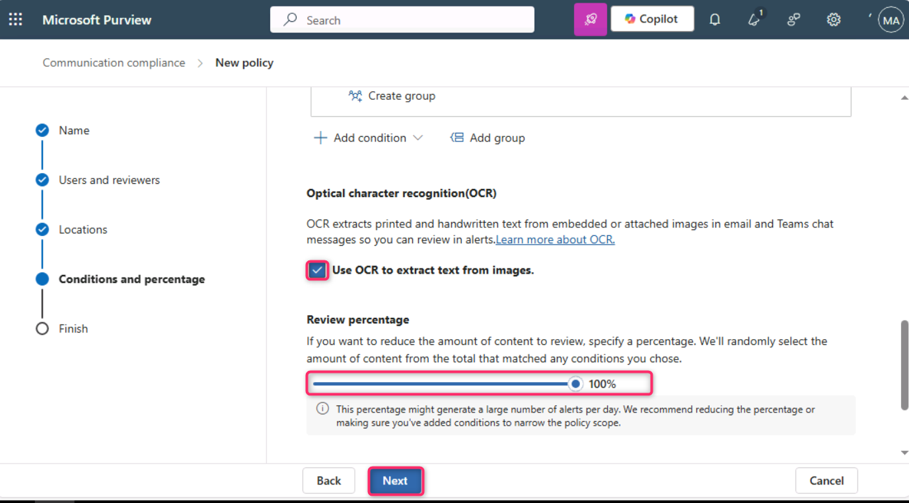
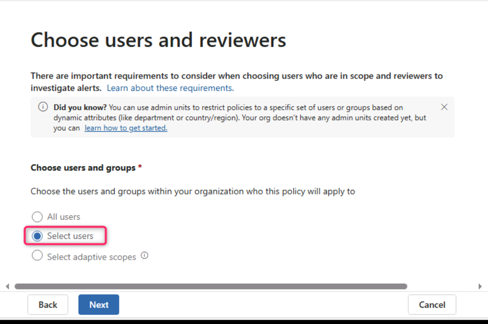
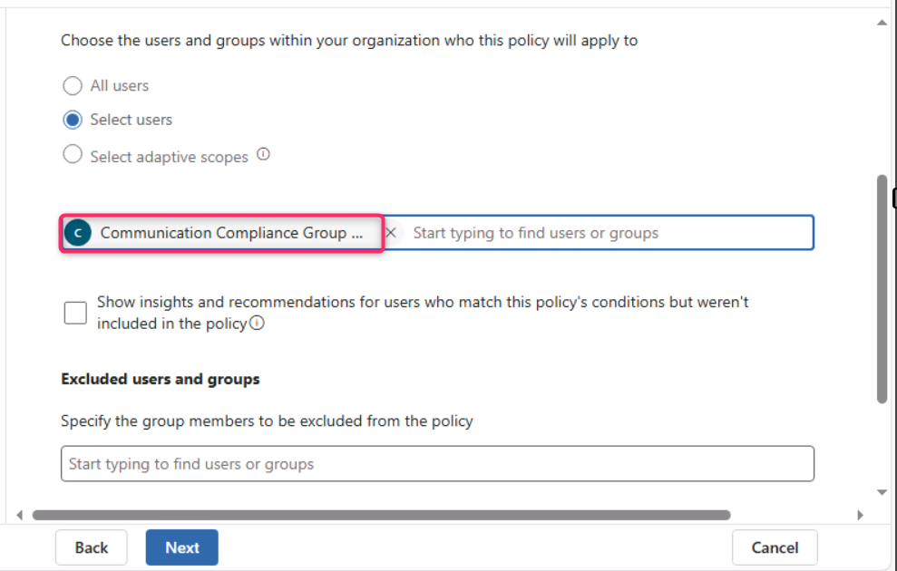
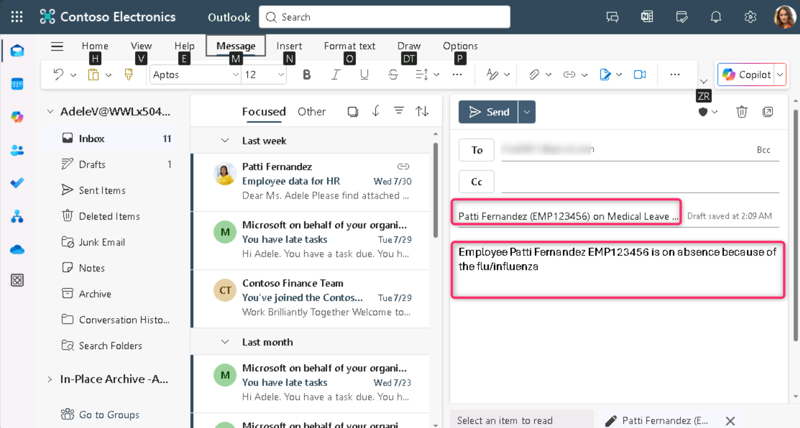

**实验室 9 – 配置 Communication Compliance**

**介绍**

在本实验室中，您将配置合规策略，以检测组织内用户传递的任何敏感信息。你将使用之前实验室创建的敏感信息类型，检测通过电子邮件传递的员工健康数据或员工身份证。

**目标**

1.  分配通信合规访问的角色。

2.  使用 PowerShell 创建分发组。

3.  配置和编辑通信合规策略。

4.  启用匿名化和用户通知功能。

5.  了解政策测试流程。

**练习 1 – 启用 Communication Compliance 权限**

在此任务中，您将将用户分配到特定角色组，以在组织内不同用户之间划分沟通、合规、访问和职责。

1.  在导航菜单中，选择**设置**，然后选择**角色和范围。** 导航并点击**“角色组”。**

> 

2.  向下滚动，选择“ **Communication Compliance**”旁的复选框。然后，点击铅笔图标进行**编辑**。

> 

3.  在 ** Edit members of the role group，**选择**选择用户**。

> 

4.  务必选择**国防部管理员**梅**根·鲍恩**和**帕蒂·费尔南德斯**。然后选择**“选择**”。

> 

5.  选择**Next**.

> 

6.  选择**“保存**”以将用户添加到角色组。选择**完成**以完成步骤。

> 
>
> 

**练习 2 – 建立沟通合规组**

在政策中，你将使用电子邮件地址来识别个人或群体。为了简化你的设置，你可以为被审核沟通的人创建群组，也可以为审核沟通的人创建群组。

你可以用PowerShell配置分发组，为分配的组配置全局通信合规策略。这使你能够通过单一策略检测成千上万用户的消息，并在新员工加入组织时保持通信合规政策的更新。

1.  右键点击Windows图标，然后导航并选择**Windows PowerShell（管理员）**

> 

2.  在用户账户控制对话框中，选择**“是**”。

> 

3.  输入以下 cmdlet 即可使用 **Exchange Online PowerShell** 模块并连接到您的租户：

> Connect-ExchangeOnline
>
> 

4.  当显示**登录**窗口时，请以**MOD管理员身份登录**。如果**这台设备上自动登录所有桌面应用和网站？** 对话框出现，然后选择**“否，仅限此应用**”按钮

> 
>
> 

5.  为您的全球通信合规政策创建专门的分发组，涵盖以下物业:

    - **MemberDepartRestriction = 关闭**. 确保用户无法将自己从分发组中移除。

    - **MemberJoinRestriction = 关闭**. 确保用户无法将自己添加到分发组。

    - **ModerationEnabled = 真的**. 确保所有发送给该组的消息都需审核，且该组不会被用于通信合规策略配置之外的通信。

> New-DistributionGroup -Name "Communication Compliance Group Contoso" -Alias "CCG_Contoso" -MemberDepartRestriction 'Closed' -MemberJoinRestriction 'Closed' -ModerationEnabled \$true

6.  

7.  **注意：**您可以按照以下命令添加 **Exchange 自定义属性**，以跟踪组织中添加到通信合规策略的用户。

> Set-DistributionGroup -Identity "Communication Compliance Group Contoso" -CustomAttribute1 "MonitoredCommunication"

8.  

9.  请以定期计划运行以下PowerShell脚本，将用户添加到通信合规策略中：

> \$Mbx = (Get-Mailbox -RecipientTypeDetails UserMailbox -ResultSize Unlimited -Filter {CustomAttribute9 -eq \$Null})
>
> \$i = 0
>
> ForEach (\$M in \$Mbx)
>
> {
>
> Write-Host "Adding" \$M.DisplayName
>
> Add-DistributionGroupMember -Identity "Communication Compliance Group Contoso" -Member \$M.DistinguishedName -ErrorAction SilentlyContinue
>
> Set-Mailbox -Identity \$M.Alias -CustomAttribute1 "MonitoredCommunication"
>
> \$i++
>
> }
>
> Write-Host \$i "Mailboxes added to supervisory review distribution group."
>
> 

10. 脚本生成输出后，打开新标签页并输入以下URL：https://admin.cloud.microsoft/ 打开Microsoft 365管理中心。

> 如果被要求设置**多因素认证**，请选择**暂时跳过**。

11. 在Microsoft 365管理中心页面，点击“**Teams & groups**”\>**“活跃团队和**\>**群组”分发列表**\>**通信**合规组Contoso\*\*

> 

12. 在右侧的“ Communication Compliance” 面板上，点击“**成员**”标签，向下滚动，查看分发列表组中的所有成员。

\

\

**练习 3 – 制定通信合规政策**

1.  在 Microsoft Purview 门户中，选择**“ Solutions \> Communication Compliance. **”。

> 

2.  在**“ Communication Compliance**”刀片中，点击“**政策**”。然后在**策略**页面选择 **+ 创建策略**，然后点击**自定义策略**。

> 

3.  在名称 栏中输入 My first communication compliance policy. 在**描述**字段中输入 This is a policy to test communication compliance. 选择**下一页**.

> 

4.  在“**选择用户和审核者**”页面，向下滚动至**审核员**部分，输入并选择**Patti Fernandez**。然后，点击**“下一步”按钮**。

> 

5.  在**“ Choose locations to detect communications ”页面，确保勾选了** Microsoft 365 位置**下的所有复选框** ，然后点击**“下一步**”按钮。

> 

6.  在“**选择条件”和“审核百分比”**中，向下滚动选择**“添加条件**”，然后导航并选择**“包含敏感信息类型的内容**”。

> 

7.  在**“内容包含这些敏感信息类型”**的框中，选择**添加**，点击**敏感信息类型**，搜索**“contoso**”。勾选我们在早期实验室创建的所有敏感信息类型。然后点击**添加**

> 

8.  向下滚动，选择“使用OCR提取图片文本**”旁的复选框**，然后将**评论百分比设置为100%，**点击**“下一步**”按钮。

> 

9.  在**审核并完成**页面，选择**创建政策**.

> 

10. **您的“政策创建”**页面会显示，并列出何时启用政策以及哪些通信将被捕获的指导方针。现在，点击**“完成**”按钮。

> 

**练习 4 – 编辑 Communication Compliance 政策**

1.  在**“communication compliance——政策**”页面，点击“我的第一个**communication compliance** 政策**”旁的省略号**，然后导航并点击**“编辑**”。

> **注释**: 如果你没看到“我的第一次沟通合规政策”，请刷新页面。
>
> 

2.  保留**姓名并描述之前设置的保单**，然后点击**“下一步**”按钮。

> 

3.  在**选择用户和审核者页面，点击“**选择用户**”旁边的单选按钮**。

> 

4.  在开始**输入以查找用户或组**时，搜索**“通信”**并选择 ** Communication Compliance组 Contoso**。

> 

5.  在**审核员**部分，输入并选择MOD管理员。选择**“下一步**”直到进入**“评测并结束**页面。

> 

6.  然后，点击**保存**按钮。

> 

**练习 5 – 创建通知模板并配置用户匿名化**

1.  在 Microsoft Purview 门户中，从 右上角选择设置，然后导航并选择**“ Communication Compliance**”。

> 

2.  在**通信合规设置——隐私**页面，为了启用匿名化，请确保选择**“显示匿名化用户名版本**”单选按钮。然后，点击**保存**按钮。

> **注释**: 如果 保存按钮未被高亮，则选择其他功能单选按钮，再次选择**“显示匿名用户名版本”**单选按钮。
>
> 

3.  选择**通知模板**，然后点击**+**符号创建通知模板。

> 

4.  在**“创建通知模板**”页面，填写以下字段：

    - 模板名称: Sample Notice

    - 发送方式：通过**输入**“Patti”**并从下拉菜单中选择名字，**选择“Patti Fernandez”。

    - Cc: 通过输入MOD 并从下拉菜单中选择名称，**选择**MOD管理员。

    - 主题: Your communication violates company Communication compliance policy.

    - 消息主体: Please note this for future reference and provide an acceptable justification for your current communication.

5.  选择**创建**以创建并保存通知模板。

> 

**练习 6 – 测试您的 Communication Compliance 政策**

在试用账户中，你没有发送任何电子邮件的权利，但你可以查看以下步骤，了解如何在拥有自己许可证的情况下测试该政策。你可以执行步骤，但你的邮件无法从你当前租户那里送达收件人。

1.  在新的InPrivate Widnow中，通过在地址栏输入以下URL，打开Outlook。: https://outlook.office365.com/mail/. 然后，在资源标签页中输入用户名 adelev@WWLxXXXXXX.onmicrosoft.com 和用户密码 登录。

2.  请发送电子邮件至您的个人邮箱，内容如下.

> 主题行: Patti Fernandez (EMP123456) on Medical Leave Due to Flu
>
> 消息主体: Employee Patti Fernandez EMP123456 is on absence because of the flu/influenza
>
> 
>
> **注意**：电子邮件邮件大约需要24小时才能完全处理成保单。Microsoft Teams、Yammer及第三方平台的通信大约需要48小时才能完全处理策略.

登录到 https://purview.microsoft.com/ 饰演**帕蒂·费尔南德斯**。进入**“ Communication Compliance ”**\>**提醒**，查看24小时后保单的提醒。

总结**:**

在本实验室中，您将学习如何在Microsoft Purview中配置和管理通信合规。你分配了所需的角色，使用PowerShell创建分发组，并设置合规策略以监控内部通信。你启用匿名化以保护审核中的用户身份，创建了用户通知模板，并了解如何在全面执行前模拟和测试通信合规政策。
